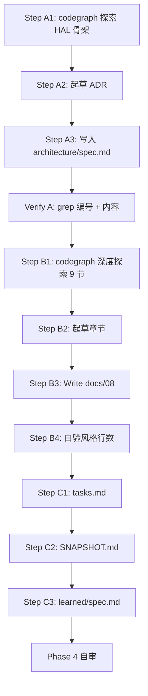

# Plan: M3 架构 ADR + M3.1 HAL 架构文档

> Created: 2026-06-05  
> Skill: ai-engineer-workflow-v5  
> 流程裁剪:跳过 OpenSpec 变更(用户已 approve,记录于 5 问自审)

---

## 1. 概览

| 项 | 内容 |
|---|------|
| **范围** | M3 架构 ADR(写入 `openspec/specs/architecture/spec.md`)+ M3.1 文档(`docs/08-hal-architecture.md`)|
| **不在范围** | M3.2/3.3/3.4(stm32/nrf/rp 平台篇)|
| **依赖** | M1(架构)+ M2(executor/time/sync/futures)已完成 |
| **CodeGraph 状态** | ✅ healthy(46966 节点 / 1953 Rust 文件)|
| **预估总时** | A: 1h · B: 2-3h · C: 15m |

---

## 2. Scenario Sketch(摘自 Phase 1)

### 读者画像
| 维度 | 设定 |
|------|------|
| 基础 | 已掌握 M1 + M2 |
| 目标 | 理解 Embassy 跨平台复用机制 + `embedded-hal` trait 角色 |
| 下游 | 流畅切入 M3.2/3.3/3.4 平台篇 |

### M3 ADR 拟覆盖
1. **术语统一**:PAC / HAL / `embedded-hal` trait / `embassy-hal-internal` / metapac
2. **章节模板**(M3.2~3.4 复用,7 节)
3. **横向对比维度**(异步化 / 时钟 / DMA / 元数据生成)
4. **关键 codegraph 入口**(下游 3 篇沿用)

### M3.1 章节大纲(9 节)
```
1. 引言:HAL 在 Embassy 中的位置
2. 三层模型:PAC / HAL / 应用
3. embedded-hal trait 生态(blocking/async 双轨)
4. embassy-hal-internal:跨平台复用骨架
5. 中断模型:HAL → async waker 桥接
6. 时间抽象:driver trait + time-driver-* feature
7. 外设抽象统一模式(以 GPIO 串讲)
8. 跨平台对比矩阵入口(指向 M3.2~3.4)
9. 总结 + 阅读 M3.2~3.4 的导览
```

---

## 3. Phase A: M3 架构 ADR(预估 1h)

### Step A1: codegraph 探索 HAL 骨架(30m)

**目标**:理解 `embassy-hal-internal` 模块结构、`embedded-hal` 依赖关系,产出核心 trait/类型清单。

**执行**:
1. `codegraph_files` 看 `embassy-hal-internal/` 目录结构
2. `codegraph_explore "embassy-hal-internal"` 一次拉模块概览
3. `codegraph_search "embedded_hal"` 找跨 crate 使用点
4. `codegraph_search "InterruptHandler"` / `codegraph_search "Driver"` 找时间驱动 trait
5. `Read embassy-hal-internal/Cargo.toml`(理解依赖)
6. `Read embassy-stm32/Cargo.toml` / `embassy-nrf/Cargo.toml` / `embassy-rp/Cargo.toml`(理解 3 平台对 embedded-hal 的依赖)

**产出**:核心符号清单(贴在本计划"附录 A")
- `embassy_hal_internal::interrupt`(中断抽象)
- `embassy_hal_internal::Peripheral` trait
- `embassy_hal_internal::PeripheralRef`
- 各平台 `init()` 入口
- `embedded_hal_async` / `embedded_hal` trait 入口

**Verify A1**:✅ `codegraph_explore` 至少调用 1 次 + 产出清单 ≥ 5 个符号

---

### Step A2: 起草 ADR 内容(20m)

**结构**:
```
<!-- A{n} -->
日期:2026-06-05
决策:M3 文档系列(HAL 层)统一规划

背景:M3.2~3.4 三平台篇需要统一术语 + 对比维度,否则读者无法横向对比。

决策内容:
  1. 术语对照表(PAC/HAL/embedded-hal trait 等)
  2. 章节模板(7 节,M3.2~3.4 沿用)
  3. 横向对比 4 维度
  4. CodeGraph 入口清单

原因:
  - M2 各组件独立,无需前置规划,但 M3 是 1+3 结构
  - 统一模板保证横向可比性
  - CodeGraph 入口预先列出,减少 3 篇重复探索

影响:
  - 改变 M3.2/3.3/3.4 文档结构(强制使用模板)
  - 增加 M3.1 篇章节(纳入对比维度入口)

替代方案:
  - 不前置规划 → 3 平台文档风格漂移(已弃)
  - 每平台篇独立规划 → 重复工作(已弃)
```

### Step A3: 写入 architecture/spec.md(10m)

**执行**:
1. `Read openspec/specs/architecture/spec.md` 找当前最大 A 编号
2. `Edit` 在决策列表顶部追加新条目(Surgical Changes 原则)
3. 更新 "Last updated" 时间戳

**Verify A**(Gate 5 等价):
- ✅ `grep "^<!-- A" openspec/specs/architecture/spec.md | tail -3` 确认新条目编号正确
- ✅ `grep "M3 文档系列" openspec/specs/architecture/spec.md` 确认内容已写入

---

## 4. Phase B: M3.1 文档撰写(预估 2-3h)

### Step B1: codegraph 深度探索(45m)

**目标**:为 9 节文档各准备至少 1 处源码引用(file:line)。

**执行**(按章节顺序):
| 章节 | codegraph 调用 |
|------|----------------|
| 1 引言 | 复用 M1/M2 已有(无需新调用)|
| 2 三层模型 | `codegraph_explore "embassy_hal_internal::Peripheral"` |
| 3 embedded-hal 生态 | `codegraph_search "embedded_hal_async"` + 看 trait 树 |
| 4 embassy-hal-internal 骨架 | `codegraph_explore "embassy-hal-internal"`(已在 A1 做过,复用)|
| 5 中断模型 | `codegraph_explore "InterruptHandler"` + `codegraph_node "InterruptExt"` |
| 6 时间抽象 | `codegraph_explore "embassy_time_driver"` + `codegraph_node "Driver"` |
| 7 GPIO 统一模式 | `codegraph_explore "embassy_stm32::gpio"` + 对照 nrf/rp |
| 8 对比矩阵入口 | 引用 ADR(无需新调用)|
| 9 导览 | 引用 ADR + tasks.md(无需新调用)|

**Verify B1**:✅ codegraph 总调用次数 ≥ 5 + 每章节有 ≥ 1 个具体符号待引用

---

### Step B2: 起草章节(60m)

**模板**(沿用 M1/M2 文档风格):
```markdown
# {N}-{title}

> 撰写:2026-06-05  
> 前置:docs/{前置文档}

## 目录
1. ...

## 1. 引言
{内容}

## 2. ...
**核心**:{一句话总结}

{说明}

**源码**:`{file_path}:{line}`
{代码片段,带 ```rust}

...

## 总结
{回顾 + 下一篇导览}

## 参考
- {引用}
```

**写作要点**:
- 关键流程用 Mermaid 图(参考 `docs/02-architecture.md` 拓扑图、`docs/05-time.md` wake 链)
- 术语首次出现给定义(参考 `docs/03-async-fundamentals.md`)
- 表格 > 文字(对比、矩阵)
- 每章 ≥ 1 处源码引用
- 行数 500-800

---

### Step B3: 写入 docs/08-hal-architecture.md(30m)

**执行**:
1. `Write docs/08-hal-architecture.md`(新文件,可用 Write)
2. 如果一次输出过长 → 分步:先写 1-4 节,再 Edit 追加 5-9 节

**Verify B3**:
- ✅ `wc -l docs/08-hal-architecture.md`(500-800 行)
- ✅ `grep -c "^## " docs/08-hal-architecture.md`(≥ 9 节)
- ✅ `grep -cE "\\.rs:[0-9]+" docs/08-hal-architecture.md`(≥ 9 处源码引用)

---

### Step B4: 自验(15m)

**对照 M2 文档风格**:
1. `wc -l docs/0[4-7]*.md docs/08-hal-architecture.md` → 行数在 M2 范围内
2. `grep -c "```rust" docs/08-hal-architecture.md` → 代码片段密度合理
3. `grep -c "```mermaid" docs/08-hal-architecture.md` → 至少 1 处 Mermaid 图
4. 抽样读 1-2 章,人工检查术语/语气与 M2 一致

**Karpathy 监察**:
- ✅ Simplicity:无投机性章节(只写大纲列的 9 节)
- ✅ Surgical Changes:不动 docs/01-07
- ✅ Requirements Integrity:9 节全覆盖,无裁剪

---

## 5. Phase C: 收尾(预估 15m)

### Step C1: 更新 tasks.md
1. `Edit` 把 M3.1 任务行 `状态:待办` → `✅ 完成`,补 `产出:docs/08-hal-architecture.md (XXX 行)`
2. `Edit` 在"已完成"区追加条目:`| 2026-06-05 | M3.1 ... | ✅ 完成 |`
3. `Edit` 进度统计 M3 行:`0 → 1`、总计 `7/27 → 8/27`

### Step C2: 更新 SNAPSHOT.md
1. `Edit` Last updated → 2026-06-05(若已在今天则保持)
2. `Edit` 当前阶段 → `M3 启动,M3.1 完成`
3. `Edit` 下一步 → `M3.2 candidate(stm32 平台)`
4. `Edit` 进度 → `8/27(30%)`

### Step C3: 更新 learned/spec.md
1. `Read openspec/specs/learned/spec.md` 找当前最大 L 编号
2. `Edit` 追加 ≥ 2 条:
   - L{n}: `embassy-hal-internal` 关键 trait 速查
   - L{n+1}: M3 文档系列 codegraph 入口清单

---

## 6. Requirements Traceability Matrix

| Req | 描述 | Phase/Step | Coverage | Simplification | Status |
|-----|------|-----------|----------|----------------|--------|
| R1 | M3 ADR 写入 architecture/spec.md | A3 | 100% | None | ✅ Plan |
| R2 | M3.1 文档 ≥ 500 行,≤ 800 行 | B3+B4 | 100% | None | ✅ Plan |
| R3 | 每章 ≥ 1 处源码引用(file:line) | B2+B3 | 100% | None | ✅ Plan |
| R4 | CodeGraph 调用 ≥ 3 次 | A1+B1 | 200% | None | ✅ Plan |
| R5 | 与 M1/M2 无术语冲突 | B2 | 100% | None | ✅ Plan |
| R6 | tasks.md 更新 M3.1 状态 | C1 | 100% | None | ✅ Plan |
| R7 | SNAPSHOT.md 同步 M3 进度 | C2 | 100% | None | ✅ Plan |
| R8 | learned/spec.md 沉淀 codegraph 入口 | C3 | 100% | None | ✅ Plan |

**Gate 2 检查**:
- ✅ 全部 R 状态 = ✅ Plan
- ✅ 无 ⚠️ Simplified
- ✅ 无 ❌ Missing
- → Gate 2 PASS(待用户 approve 后切 Phase 3)

---

## 7. 风险与应对

| ID | 风险 | 触发条件 | 应对 |
|----|------|----------|------|
| RK1 | CodeGraph 索引中途变 stale | Edit 源码后(本次不改源码,N/A)| N/A |
| RK2 | M3.1 文档行数超 800 | B3 输出过长 | 压缩 7-8 节(对比矩阵入口/导览),只留核心 |
| RK3 | 9 节 codegraph 调用过多导致上下文紧张 | B1+B2 累计 | 复用 A1 的探索成果,B1 只补差异 |
| RK4 | 用户中途叫停 | 任意 | Phase 边界天然 commit 点;A 完成可独立交付 |
| RK5 | 对比维度难选(异步化/时钟/DMA/PAC) | A2 | 维度可调,以源码深度为准 |

---

## 8. 执行顺序图



---

## 9. 附录 A:核心符号清单(Step A1 填充)

> 待 Step A1 执行后填入

```
- {符号}({文件})
- {符号}({文件})
...
```

---

## 10. 附录 B:Phase 边界 commit 建议

| 时机 | 建议 commit 信息 |
|------|------------------|
| Phase A 完成 | `M3: 架构 ADR 入档(术语 + 章节模板 + 对比维度)` |
| Phase B 完成 | `M3.1: HAL 架构(docs/08-hal-architecture.md, {N} 行)` |
| Phase C 完成 | `tasks/SNAPSHOT/learned: M3.1 收官同步(8/27, 30%)` |

(commit 由用户决定何时执行,workflow 不主动 git commit)
