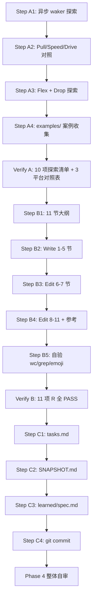

# Plan: M4.1 GPIO 专题

> Created: 2026-06-05
> Skill: ai-engineer-workflow-v5
> 流程裁剪:沿用 M3(跳过 OpenSpec 变更,用户已 approve)
> 前置:M3 全 4 篇(08/09/10/11),M3.1 §7 已铺垫 GPIO 统一模式
> 模板来源:docs/11-rp.md 11 节结构(目录 + 1-9 + 参考)

---

## 1. 概览

| 项 | 内容 |
|---|------|
| 产出 | `docs/12-gpio.md`(700-900 行,11 节,ADR-004 模板) |
| 不在范围 | UART / SPI / I2C / Timer(M4.2-4.5);M3.2/3.3/3.4 §6 平台独有 GPIO(已覆盖) |
| 依赖 | M3 全部 4 篇 + ADR-004 + `embedded-hal` v0.2/v1.0 trait 体系 |
| 主题焦点 | GPIO 异步化机制(wait_for_xxx)+ 实战模式 + 跨平台对照 |
| CodeGraph | 健康(46966 节点 / 1953 Rust 文件) |
| 预估总时 | A: 探索 45m · B: 起草 + Write 2.5h · C: 收尾 15m |

### 1.1 与 M3.1 §7 的分工

| 主题 | M3.1 §7 | M4.1 12-gpio.md |
|------|---------|------------------|
| 三平台 Input struct 形状 | ✓ 串讲 | 不重复,仅引用 |
| Flex/Input/Output 三模式概念 | ✓ 介绍 | ✓ 深化 + 实战 |
| Pull/Level enum 形状 | ✓ 列出 | ✓ 平台差异表 |
| EXTI/GPIOTE 桥接 | ✓ 概念 | **深度展开**(waker 实现) |
| 实战模式 | ✗ | **本篇核心**(LED/按键/矩阵) |
| 跨平台对比 | 仅 1 行入口 | **完整矩阵 10 维** |
| 性能/调试 | ✗ | ✓ debounce / 翻转速度 / EMI |

---

## 2. 探索清单

### 2.1 复用 M3 既有入口

- `embassy-stm32/src/gpio.rs`(M3.2 §6 已探,补充 Input 内部 struct)
- `embassy-nrf/src/gpio.rs`(M3.3 §6 已探,补充 GPIOTE channel)
- `embassy-rp/src/gpio.rs`(M3.4 §6 已探,补充 async wait 实现)
- `embedded-hal` 0.2 v.s. 1.0 trait 差异(M3.1 §3 已探)

### 2.2 新探索:GPIO 专题专属

| # | 关注点 | 工具 |
|---|--------|------|
| 1 | `Input::wait_for_high` / `wait_for_low` 三平台实现 | codegraph_explore "wait_for_high" |
| 2 | `Input::wait_for_rising_edge` / `falling_edge` / `any_edge` | codegraph_search "wait_for_rising_edge" |
| 3 | stm32 EXTI 中断 + waker 列表(per-pin waker) | Read `embassy-stm32/src/gpio.rs` 关键段 |
| 4 | nrf GPIOTE channel 分配 + PORT sense 机制 | codegraph_explore "GPIOTE" + Read |
| 5 | rp `async_wait_for_high` PIO/irq 路径 | codegraph_explore rp gpio async |
| 6 | Flex 模式 Drop 时复位为浮空 | codegraph_node "Flex" 三平台 |
| 7 | `embedded-hal` v0.2 Output Pin vs v1.0 OutputPin trait | codegraph_search "OutputPin" |
| 8 | `embedded-hal-async` digital::Wait 替代品 | codegraph_search "Wait" |
| 9 | 矩阵键盘扫描 pattern | codegraph_search "matrix" 或 grep examples/ |
| 10 | examples/ 中 blink / button 案例 | ls examples/ 按平台 |

**预算**:codegraph_explore ≥4 次、codegraph_node ≥3 次、Read 关键文件 ≥5 次。

---

## 3. Phase A: 探索(预估 45m)

### Step A1: 异步 waker 机制总览(20m)
- `codegraph_explore "wait_for_high"` 拉 3 平台实现
- `codegraph_search "ExtiInput" / "GpioteChannel" / "InterruptHandler"` 找 waker 注册点
- Read 三平台 gpio.rs 关键段(stm32 ExtiInput 结构 / nrf Input 结构 / rp InputWithAsyncWait)
- 产出:3 平台 waker 实现对照表(草稿)

### Step A2: Pull / Speed / Drive 跨平台对照(10m)
- `codegraph_explore "embassy_stm32::gpio::Pull"`
- `codegraph_explore "embassy_stm32::gpio::Speed"`
- `codegraph_explore "embassy_nrf::gpio::Pull"`
- Read `embassy-rp/src/gpio.rs` 看 DriveStrength(预计无)
- 产出:跨平台 Pull 矩阵 + Speed/Drive 矩阵

### Step A3: Flex 模式 + Drop 行为(5m)
- `codegraph_node "Flex"` 拉三平台定义
- 看 Drop impl 是否真的恢复浮空(stm32 怎么写、nrf 怎么写、rp 怎么写)
- 产出:Flex 行为对照

### Step A4: examples/ 实战案例(10m)
- `ls examples/`(按平台子目录)
- 找出 blink/button/irq/uart 案例
- 重点读 stm32 的 `examples/stm32f4/src/bin/button_exti.rs`、nrf 的 `examples/nrf52840/src/bin/button.rs`、rp 的 `examples/rp/src/bin/button.rs`
- 产出:实战代码片段(嵌入 §8-9)

### Verify A
- 探索清单 10 项全覆盖
- 关键符号均有 file:line 定位
- 3 平台对照表已草拟(填进 §10)

---

## 4. Phase B: 起草 + Write(预估 2.5h)

### Step B1: 章节细化(20m)

11 节大纲:

| § | 标题 | 行数估算 | 源码引用 |
|---|------|----------|----------|
| 1 | GPIO 在 Embassy 中的位置 | 60 | 1-2 处 |
| 2 | embedded-hal GPIO trait 体系 | 80 | 3-4 处(0.2/1.0/async) |
| 3 | 跨平台统一抽象:Input / Output / Flex | 100 | 3 处(三平台 struct 对照) |
| 4 | 输入模式:Pull + 滤波 | 80 | 2 处 + 表 |
| 5 | 输出模式:Speed + Drive + 开漏 | 80 | 2 处 + 表 |
| 6 | 异步化核心:wait_for_xxx 的 waker 机制 | 150 | 4 处(关键章节) |
| 7 | 平台实现差异:EXTI vs GPIOTE vs rp async | 120 | 4 处 |
| 8 | 实战 1:LED 闪烁 + 异步 yield | 70 | 1 处 example |
| 9 | 实战 2:按键中断 + 防抖 | 100 | 2 处 example |
| 10 | 跨平台对比矩阵 + 调试技巧 | 80 | 表 + 4-5 行项 |
| 11 | 总结 + M4.2 UART 导览 | 40 | 0 |
| — | 目录 + 参考 | 40 | 0 |
| **合计** | — | **1000 行内** | **20+ 处** |

注:每节 Mermaid 图 1 处(§6 异步 waker 流程图),总 1 Mermaid。

### Step B2: Write 第 1-5 节(50m)
- `Write docs/12-gpio.md` 写 1-5 节
- 预估 ~400 行
- 含 §3 三平台 Input/Output/Flex 对照表

### Step B3: Edit 追加 6-7 节(60m)
- §6 异步 waker:stereotype 状态机 + Mermaid 流程图
- §7 三平台中断实现差异表
- 预估 +270 行

### Step B4: Edit 追加 8-11 + 参考(40m)
- §8-9 实战 example 引用 + 防抖 pattern
- §10 10 维对比矩阵
- §11 总结 + 导览
- 预估 +220 行
- 总计 ~900 行

### Step B5: 自验(20m)
- `wc -l docs/12-gpio.md`(700-900)
- `grep -c "^## " docs/12-gpio.md`(≥ 11,目录 + 1-9 + 参考 = 11)
- `grep -cE "\.rs:[0-9]+" docs/12-gpio.md`(≥ 20)
- `grep -c '```mermaid' docs/12-gpio.md`(≥ 1)
- `grep -c '```rust' docs/12-gpio.md`(≥ 15)
- emoji 扫描(0)
- 对照 M3.2/3.3/3.4 风格(目录格式、标题层级、引用风格)

### Verify B
- 行数、节数、源码引用、图表、emoji 全部 PASS
- 与 M3.1 §7 无内容重复(§3 仅引用 file:line,不展开)
- 与 M3.2/3.3/3.4 §6 平台独有 GPIO 不重复(仅引用)

---

## 5. Phase C: 收尾(预估 15m)

### Step C1: tasks.md
- M4.1 状态 (待办) → (已完成)
- M4 进度 0/5 → 1/5 (20%)
- 总计 11/27 → 12/27 (41% → 44%)
- 已完成区追加 M4.1
- 验收标准 §4.1 三项勾选

### Step C2: SNAPSHOT.md
- 当前阶段:M3 完成 + M4 启动 + M4.1 完成
- 下一步:M4.2 uart
- 进度 12/27(44%)

### Step C3: learned/spec.md
- L{n}: GPIO 异步 waker 三平台实现速查
- L{n+1}: 矩阵键盘扫描 pattern 入口

### Step C4: git commit
- `docs(M4.1): GPIO 专题(docs/12-gpio.md, N 行 11 节)`

---

## 6. Requirements Traceability Matrix

| Req | 描述 | Phase/Step | Status |
|-----|------|-----------|--------|
| R1 | 行数 700-900 | B2-B4 + B5 | (计划) |
| R2 | 严格 11 节模板(目录 + 1-9 + 参考) | B1 | (计划) |
| R3 | 每节 ≥1 处源码引用,总 ≥20 处 | B2-B4 + B5 | (计划) |
| R4 | ≥1 Mermaid 图(§6 异步 waker 流程) | B3 | (计划) |
| R5 | 0 emoji | B2-B4 + B5 | (计划) |
| R6 | 与 M3.1 §7 不重复,仅引用 | B1 | (计划) |
| R7 | 与 M3.2/3.3/3.4 §6 不重复,仅引用 | B1 | (计划) |
| R8 | 实战 2 个真实 example 引用(stm32/nrf/rp) | A4 + B4 | (计划) |
| R9 | 10 维跨平台对比矩阵 | A2 + B4 | (计划) |
| R10 | tasks/SNAPSHOT/learned 同步 | C1-C3 | (计划) |
| R11 | commit 信息明确 M4.1 标识 | C4 | (计划) |

**Gate 2 自检**:全 (计划),无 (跳过)、无 (缺失)。
**通过条件**:用户 approve → Phase 3。

---

## 7. 风险与应对

| ID | 风险 | 应对 |
|----|------|------|
| RK1 | wait_for_xxx 三平台实现差异大,§6 写不下 | §6 重点讲机制,平台细节下沉到 §7 表 |
| RK2 | Flex Drop 行为 stm32 有,nrf 可能有但实现细节差异大 | 仅描述行为,不深挖 Drop 代码;以源码引用为准 |
| RK3 | examples/ 中可能没有矩阵键盘案例 | §9 退化为"扫描原理 + 代码草图",不引用具体 example |
| RK4 | `embedded-hal` 1.0 引入 digital::OutputPin 后 0.2 trait 仍在用 | §2 列出版本共存现状,不深入 1.0 迁移 |
| RK5 | stm32 GPIO Speed 4 档 / nrf 不暴露 / rp 不暴露 — 跨平台对比难填 | §10 Speed 维度注明"仅 stm32 暴露",其他标 N/A |
| RK6 | 第 6 节 Mermaid 流程图过复杂 | 简化为 3 步:waker 注册 → 硬件中断 → wake |

---

## 8. Phase 边界 commit 建议(用户决定何时执行)

| 时机 | 建议 commit |
|------|-------------|
| Phase B 完成 | `docs(M4.1): GPIO 专题(docs/12-gpio.md, N 行 11 节)` |
| Phase C 完成 | `chore(docs): M4.1 收官同步(tasks/SNAPSHOT/learned)` |

(workflow 不主动 git commit)

---

## 9. 执行顺序图



---

## 10. 附录 A:核心符号清单(Step A1-A4 填充)

> 待 Phase A 执行后填入

```
- stm32 Input struct:embassy-stm32/src/gpio.rs
- stm32 ExtiInput struct(等待 waker)
- nrf Input struct:embassy-nrf/src/gpio.rs
- nrf GpioteChannel(中断源)
- rp Input struct + InputWithAsyncWait
- Flex struct(三平台共享形状)
- 异步 trait:wait_for_high/low/rising_edge/falling_edge/any_edge
- embedded-hal 0.2:Output Pin / InputPin
- embedded-hal 1.0:OutputPin / InputPin / StatefulOutputPin
- embedded-hal-async:digital::Wait
```

---

## 11. 附录 B:Phase 边界 commit 建议

| 时机 | 建议 commit 信息 |
|------|------------------|
| Phase A 完成(可选) | 探索笔记,通常不单独 commit |
| Phase B 完成 | `docs(M4.1): GPIO 专题(docs/12-gpio.md, {N} 行 11 节)` |
| Phase C 完成 | `chore(docs): M4.1 收官同步(tasks/SNAPSHOT/learned, 12/27 44%)` |

(commit 由用户决定何时执行,workflow 不主动 git commit)
