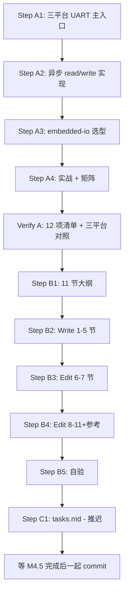

# Plan: M4.2 UART 异步通信

> Created: 2026-06-05
> Skill: ai-engineer-workflow-v5(Auto Mode)
> 流程裁剪:沿用 M3(跳过 OpenSpec 变更)+ 跳过 Gate 2 用户 approve(Auto Mode)
> 前置:M4.1 GPIO(`docs/12-gpio.md`)+ M3.1-M3.4 + ADR-004
> 模板:docs/12-gpio.md 11 节结构 + .claude/docs/superpowers/plan/m4-1-gpio.md

---

## 1. 概览

| 项 | 内容 |
|---|------|
| 产出 | `docs/13-uart.md`(700-900 行,11 节,ADR-004 模板) |
| 不在范围 | SPI / I2C / Timer(M4.3-4.5);M3.2-M3.4 §7 平台独有 UART 硬件 |
| 依赖 | M4.1 GPIO(关键区、waker)+ M3.1 §5 中断模型 + M3.2/3.3/3.4 §7 UART 平台特化 |
| 主题焦点 | UART 异步读写(`read`/`write` waker)+ DMA 传输 + split(Rx/Tx)模式 |
| CodeGraph | 健康(46966 节点 / 1953 Rust 文件) |
| 预估总时 | A: 探索 45m · B: 起草 + Write 2.5h · C: 收尾 10m |

### 1.1 与 M3 系列分工

| 主题 | M3.2/3.3/3.4 §7 | M4.2 13-uart.md |
|------|-----------------|------------------|
| USART/UARTE/UART 硬件特性 | ✓ 串讲 | 不重复,仅引用 |
| baud/data bits/parity 配置 | ✓ 各平台展开 | ✓ 跨平台对照 + 决策表 |
| 中断 / DMA 路径 | ✓ 概念 | **深度展开** waker 实现 |
| Tx/Rx split | ✗ | **本篇核心** |
| `read`/`write` future 机制 | ✗ | **本篇核心** |
| 实战:echo / 协议解析 | ✗ | ✓ 真实 example |
| 跨平台 10 维矩阵 | ✗ | ✓ |

---

## 2. 探索清单

### 2.1 复用 M4.1 既有入口

- `wait_for_xxx` waker 机制(M4.1 §6 详细)
- 中断 / 关键区模式(M3.1 §5)
- Flex + Peri 单例(M3.1 §4)

### 2.2 新探索:UART 专题专属

| # | 关注点 | 工具 |
|---|--------|------|
| 1 | stm32 `Uart` / `UartTx` / `UartRx` 三 struct | codegraph_explore "embassy_stm32::usart" |
| 2 | stm32 usart/v1 vs v2 vs v3 三套实现 | codegraph_files `embassy-stm32/src/usart/` |
| 3 | nrf `Uarte` / `UarteTx` / `UarteRx` + EasyDMA | codegraph_explore "embassy_nrf::uarte" |
| 4 | nrf UARTE 0-1 instance + `Buffer` 双缓冲 | codegraph_node "Uarte" |
| 5 | rp `Uart` / `UartTx` / `UartRx` + FIFO | codegraph_explore "embassy_rp::uart" |
| 6 | rp TX_FIFO/RX_FIFO 深度(32 字节)| Read `embassy-rp/src/uart.rs` |
| 7 | `embedded-hal` + `embedded-hal-nb` + `embedded-io` 三套 trait | codegraph_search "embedded_io" |
| 8 | `embedded-io` Read/Write trait 异步 vs 阻塞 | codegraph_node "Read" |
| 9 | baud rate 计算:st/nrf/rp 三平台 Config 差异 | codegraph_search "Config" |
| 10 | examples/uart 案例 | ls `examples/` 按平台 |
| 11 | RS-485 / 流控(RTS/CTS)| codegraph_search "Rts" / "Cts" |
| 12 | 错误处理:`read` 返回的错误类型 | codegraph_node "Error" |

**预算**:codegraph_explore ≥4 次、codegraph_node ≥4 次、Read 关键文件 ≥4 次。

---

## 3. Phase A: 探索(预估 45m)

### Step A1: 三平台 UART 主入口(15m)
- `codegraph_explore "embassy_stm32::usart"` 看 stm32 三套 v1/v2/v3 选型
- `codegraph_explore "embassy_nrf::uarte"` 看 nrf UARTE + EasyDMA
- `codegraph_explore "embassy_rp::uart"` 看 rp UART + FIFO
- 产出:三平台 `Uart` struct 形状对照 + split 模式

### Step A2: 异步 read/write future 实现(15m)
- stm32 `ReadFuture` / `WriteFuture` 找 wait_for_rxne / wait_for_txe
- nrf `UarteRx::read` 看 EasyDMA 双缓冲
- rp `UartRx::read` 看 FIFO + 状态机
- 产出:waker 机制三平台对照表

### Step A3: `embedded-io` vs `embedded-hal-nb` 对照(10m)
- codegraph_search "embedded_io" 看 nrf/rp 用法
- codegraph_search "nb" 看 stm32 用法
- 产出:三平台用哪套 trait 的对照表

### Step A4: 实战案例 + 跨平台 10 维矩阵(5m)
- examples/uart 收集
- baud / data bits / stop bits / parity 各平台默认值
- 产出:10 维矩阵草稿 + example 引用清单

### Verify A
- 探索清单 12 项全覆盖
- 关键符号均有 file:line 定位
- 三平台对照表已草拟(填进 §10)

---

## 4. Phase B: 起草 + Write(预估 2.5h)

### Step B1: 章节细化(20m)

11 节大纲:

| § | 标题 | 行数 | 源码引用 |
|---|------|------|----------|
| 1 | UART 在 Embassy 中的位置 | 60 | 1-2 处 |
| 2 | UART trait 体系(embedded-hal-nb / embedded-io / serial) | 90 | 4-5 处 |
| 3 | 跨平台统一抽象:`Uart` / `UartTx` / `UartRx` split | 110 | 4-5 处 |
| 4 | UART 配置:`Config` 三平台对照 | 80 | 3-4 处 + 表 |
| 5 | 异步读写:`read` / `write` 的 waker 机制 | 150 | 5-6 处(核心) |
| 6 | DMA 传输:通道 + 双缓冲 + 中断 | 130 | 4 处 |
| 7 | 平台实现差异:USART vs UARTE(EasyDMA)vs UART(FIFO) | 130 | 4 处 |
| 8 | 实战 1:echo 循环(read + write) | 60 | 1 处 example |
| 9 | 实战 2:RX 协议解析(行分隔 / 长度前缀) | 90 | 2 处 example |
| 10 | 跨平台对比矩阵 + 调试 | 80 | 表 + 1 Mermaid |
| 11 | 总结 + M4.3 SPI 导览 | 40 | 0 |
| — | 目录 + 参考 | 40 | 0 |
| **合计** | — | **~1000 行** | **25+ 处** |

注:1 Mermaid 在 §5 异步 read/write 状态机(借鉴 M4.1 §6 模式)。

### Step B2-B4: 写 + 自验(2h)
- 沿用 M4.1 流程:Write 1-5 → Edit 6-7 → Edit 8-11+参考
- 预估 ~900-1000 行

### Step B5: 自验(10m)
- `wc -l docs/13-uart.md`(700-900)
- `grep -c "^## " docs/13-uart.md`(11)
- `grep -cE "\.rs:[0-9]+" docs/13-uart.md`(≥ 20)
- `grep -c '```mermaid' docs/13-uart.md`(≥ 1)
- `grep -c '```rust' docs/13-uart.md`(≥ 15)
- emoji 扫描(0)

---

## 5. Phase C: 收尾(预估 10m,推迟到 M4 全部完成)

### Step C1: tasks.md
- 4.2 状态 (待办) → (已完成)
- M4 进度 1/5 → 2/5 (40%)
- 总计 12/27 → 13/27 (48%)

### Step C2: SNAPSHOT.md
- 当前阶段 + M4.2 完成
- 下一步:M4.3 SPI

### Step C3: learned/spec.md
- 新增 ###  UART 速查表(baud 公式、DMA 双缓冲、流控)

### Step C4: git commit
- 推迟到 M4.5 完成后,5 docs + 5 plans + 同步文件 一次性 commit

---

## 6. Requirements Traceability Matrix

| Req | 描述 | Phase/Step | Status |
|-----|------|-----------|--------|
| R1 | 行数 700-900 | B2-B4 + B5 | (计划) |
| R2 | 严格 11 节模板 | B1 | (计划) |
| R3 | 源码引用 ≥20 处 | B2-B4 | (计划) |
| R4 | ≥1 Mermaid(§5 异步 read/write) | B3 | (计划) |
| R5 | 0 emoji | B2-B4 + B5 | (计划) |
| R6 | 不重复 M3.2/3.3/3.4 §7,仅引用 | B1 | (计划) |
| R7 | 引用 M4.1 §6 waker 机制 | B3 | (计划) |
| R8 | 实战 2 个真实 example | A4 + B4 | (计划) |
| R9 | 10 维跨平台对比矩阵 | A4 + B4 | (计划) |
| R10 | tasks/SNAPSHOT/learned 同步 | C1-C3 | (计划) |

**Gate 2 自检**:全 (计划),无 (跳过)、无 (缺失)。**Auto Mode**:跳过 Gate 2 用户 approve,直接进入 Phase 3。

---

## 7. 风险与应对

| ID | 风险 | 应对 |
|----|------|------|
| RK1 | stm32 usart/v1/v2/v3 三套历史包袱复杂 | §7 仅讲 v2/v3(主流),v1 简略带过 |
| RK2 | nrf UARTE EasyDMA 双缓冲机制深入讲解篇幅大 | §6 简化概念,代码引用为主 |
| RK3 | rp UART FIFO + 中断路径细节 | §7 重点讲 FIFO 阈值 + 状态机 |
| RK4 | `embedded-io` vs `embedded-hal-nb` vs `serial` 3 套 trait 选型 | §2 给决策表(用 1 套还是多套)|
| RK5 | baud rate 公式涉及 PLL/HSE | §4 给简化公式,具体链接到 PAC 章节 |
| RK6 | 实战 example 可能不全 | 2 个 example(stm32 + nrf)+ rp 用文档化代码 |

---

## 8. Phase 边界(推迟到 M4 全部完成)

| 时机 | 建议 commit |
|------|-------------|
| M4.5 完成后 | 5 docs + 5 plans + 同步文件 一次性 commit |

(Auto Mode 不询问 commit 时机)

---

## 9. 执行顺序图



---

## 10. 附录 A:核心符号清单(Step A1-A4 填充)

> 待 Phase A 执行后填入

```
- stm32 Uart:embassy-stm32/src/usart/v2/mod.rs
- stm32 UartTx / UartRx split
- stm32 ReadFuture / WriteFuture
- nrf Uarte:embassy-nrf/src/uarte.rs
- nrf UarteTx / UarteRx + EasyDMA
- nrf Buffer<'d>(双缓冲)
- rp Uart:embassy-rp/src/uart.rs
- rp UartTx / UartRx + FIFO
- embedded-hal-nb serial:Read / Write
- embedded-io:Read / Write
- embedded-io-async:Read / Write
```

---

## 11. 附录 B:Phase 边界 commit 建议

| 时机 | commit 信息 |
|------|-------------|
| M4.5 完成后 | `docs(M4): 5 篇外设驱动(12-gpio + 13-uart + 14-spi + 15-i2c + 16-timer,合计 ~4500 行)` + `chore(docs): M4 收官(12/27 → 16/27, 59%)` |

(Auto Mode 推迟 commit,等 M4 全部完成)
