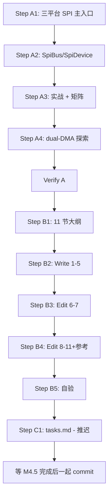

# Plan: M4.3 SPI 同步串行通信

> Created: 2026-06-05
> Skill: ai-engineer-workflow-v5(Auto Mode)
> 流程裁剪:沿用 M3(跳过 OpenSpec 变更)+ 跳过 Gate 2 用户 approve(Auto Mode)
> 前置:M4.1 GPIO + M4.2 UART
> 模板:docs/13-uart.md 11 节结构 + .claude/docs/superpowers/plan/m4-2-uart.md

---

## 1. 概览

| 项 | 内容 |
|---|------|
| 产出 | `docs/14-spi.md`(700-900 行,11 节,ADR-004 模板) |
| 不在范围 | I2C / Timer(M4.4-4.5);M3.2/3.3/3.4 §8 平台 SPI 硬件 |
| 依赖 | M4.1 GPIO(CS 引脚)+ M4.2 UART(DMA 模式借鉴)+ M3.1 §5 中断模型 |
| 主题焦点 | SPI 全双工 `read_write` + dual-DMA + CS 片选管理 + 4 种 SPI 模式 |
| CodeGraph | 健康(46966 节点 / 1953 Rust 文件) |
| 预估总时 | A: 探索 45m · B: 起草 + Write 2.5h · C: 收尾 10m |

### 1.1 与 M3 系列分工

| 主题 | M3.2/3.3/3.4 §8 | M4.3 14-spi.md |
|------|-----------------|------------------|
| SPI 硬件特性 | ✓ 串讲 | 不重复,仅引用 |
| CPOL/CPHA 4 种模式 | ✓ 概念 | ✓ 跨平台 Config 字段 + 决策表 |
| `read_write` future 机制 | ✗ | **本篇核心** |
| CS 片选管理 | ✗ | **本篇核心**(`SetConfig` trait) |
| DMA 双向(dual-DMA)| ✗ | 深度展开(§6) |
| 实战:传感器 / SD 卡 | ✗ | ✓ 真实 example |
| 10 维跨平台对比矩阵 | ✗ | ✓ |

---

## 2. 探索清单

### 2.1 复用 M4.2 既有入口

- `read` / `write` waker 机制(M4.2 §5)
- `Uart` / `UartTx` / `UartRx` split 模式(M4.2 §3)
- DMA 通道 + OnDrop 守卫(M4.2 §6)

### 2.2 新探索:SPI 专题专属

| # | 关注点 | 工具 |
|---|--------|------|
| 1 | stm32 `Spi` / `SpiTx` / `SpiRx` 三 struct | codegraph_explore "embassy_stm32::spi" |
| 2 | stm32 spi/v1 vs v2 vs v3 三套实现 | codegraph_files `embassy-stm32/src/spi/` |
| 3 | nrf `Spim` / `SpimTx` / `SpimRx` + EasyDMA | codegraph_explore "embassy_nrf::spim" |
| 4 | rp `Spi` / `SpiTx` / `SpiRx` + FIFO | codegraph_explore "embassy_rp::spi" |
| 5 | `embedded-hal` `SpiBus` / `SpiDevice` trait | codegraph_search "SpiBus" |
| 6 | `SetConfig` trait + `with_configuration` | codegraph_node "SetConfig" |
| 7 | CPOL/CPHA 4 模式 | codegraph_search "Mode" |
| 8 | examples/spi 案例 | ls `examples/` 按平台 |
| 9 | SD 卡 / W25Q 闪存 SPI 案例 | codegraph_search "sd" / "w25q" |
| 10 | MISO/MOSI/SCK 引脚 trait 约束 | codegraph_search "MisoPin" |

**预算**:codegraph_explore ≥3 次、codegraph_node ≥3 次、Read 关键文件 ≥3 次。

---

## 3. Phase A: 探索(预估 45m)

### Step A1: 三平台 SPI 主入口(15m)
- `codegraph_explore "embassy_stm32::spi"` 看 v1/v2/v3 选型
- `codegraph_explore "embassy_nrf::spim"` 看 nrf SPIM + EasyDMA
- `codegraph_explore "embassy_rp::spi"` 看 rp SPI + FIFO
- 产出:三平台 `Spi` struct 形状 + 4 模式(0-3)

### Step A2: `embedded-hal` SpiBus / SpiDevice(10m)
- codegraph_search "SpiBus" 看 stm32/rp 用法
- codegraph_search "SpiDevice" 看 CS 管理
- 产出:trait 选型 + SetConfig 用法

### Step A3: 实战案例 + 跨平台 10 维矩阵(10m)
- examples/spi 收集
- CPOL/CPHA 各平台默认值
- 产出:10 维矩阵草稿 + example 引用清单

### Step A4: DMA 双向(dual-DMA)(10m)
- stm32 dual-DMA(TX + RX 同时)
- nrf EasyDMA 自带双向
- rp dual-DMA 路径
- 产出:dual-DMA 三平台对照

### Verify A
- 探索清单 10 项全覆盖
- 关键符号均有 file:line 定位
- 三平台对照表已草拟

---

## 4. Phase B: 起草 + Write(预估 2.5h)

### Step B1: 章节细化(20m)

11 节大纲:

| § | 标题 | 行数 | 源码引用 |
|---|------|------|----------|
| 1 | SPI 在 Embassy 中的位置 | 50 | 1-2 处 |
| 2 | SPI trait 体系(`SpiBus` / `SpiDevice` / `Operation`) | 80 | 3-4 处 |
| 3 | 跨平台统一抽象:`Spi` / `SpiTx` / `SpiRx` / `FullDuplex` | 100 | 4 处 |
| 4 | SPI 配置:`Config` + 4 模式(0-3)+ bit_order | 90 | 3-4 处 + 表 |
| 5 | 异步 `read_write` / `transfer` waker 机制 | 140 | 5 处(核心) |
| 6 | DMA 双向(dual-DMA)+ 异步 CS 控制 | 120 | 4 处 |
| 7 | 平台实现差异:SPI vs SPIM(EasyDMA)vs SPI(FIFO) | 120 | 4 处 |
| 8 | 实战 1:传感器读写(初始化 + 读寄存器) | 60 | 1 处 example |
| 9 | 实战 2:SD 卡 / 闪存(命令 + 数据) | 80 | 2 处 example |
| 10 | 跨平台对比矩阵 + 调试 | 80 | 表 + 1 Mermaid |
| 11 | 总结 + M4.4 I2C 导览 | 40 | 0 |
| — | 目录 + 参考 | 40 | 0 |
| **合计** | — | **~1000 行** | **25+ 处** |

注:1 Mermaid 在 §5 异步 read_write 状态机(借鉴 M4.2 §5 模式)。

### Step B2-B4: 写 + 自验(2h)
- 沿用 M4.2 流程:Write 1-5 → Edit 6-7 → Edit 8-11+参考
- 预估 ~900-1000 行

### Step B5: 自验(10m)
- `wc -l docs/14-spi.md`(700-900)
- `grep -c "^## " docs/14-spi.md`(11)
- `grep -cE "\.rs:[0-9]+" docs/14-spi.md`(≥ 20)
- `grep -c '```mermaid' docs/14-spi.md`(≥ 1)
- `grep -c '```rust' docs/14-spi.md`(≥ 15)
- emoji 扫描(0)

---

## 5. Phase C: 收尾(预估 10m,推迟到 M4 全部完成)

### Step C1: tasks.md
- 4.3 状态 (待办) → (已完成)
- M4 进度 2/5 → 3/5 (60%)
- 总计 13/27 → 14/27 (52%)

### Step C2: SNAPSHOT.md
- 当前阶段 + M4.3 完成
- 下一步:M4.4 I2C

### Step C3: learned/spec.md
- 新增 ### SPI 速查表(CPOL/CPHA 4 模式 + DMA 双向)

### Step C4: git commit
- 推迟到 M4.5 完成后,5 docs + 5 plans + 同步文件 一次性 commit

---

## 6. Requirements Traceability Matrix

| Req | 描述 | Phase/Step | Status |
|-----|------|-----------|--------|
| R1 | 行数 700-900 | B2-B4 + B5 | (计划) |
| R2 | 严格 11 节模板 | B1 | (计划) |
| R3 | 源码引用 ≥20 处 | B2-B4 | (计划) |
| R4 | ≥1 Mermaid(§5 异步 read_write) | B3 | (计划) |
| R5 | 0 emoji | B2-B4 + B5 | (计划) |
| R6 | 不重复 M3.2/3.3/3.4 §8,仅引用 | B1 | (计划) |
| R7 | 引用 M4.1 §6 + M4.2 §5 waker | B3 | (计划) |
| R8 | 实战 2 个真实 example | A3 + B4 | (计划) |
| R9 | 10 维跨平台对比矩阵 | A3 + B4 | (计划) |
| R10 | tasks/SNAPSHOT/learned 同步 | C1-C3 | (计划) |

**Gate 2 自检**:全 (计划),无 (跳过)、无 (缺失)。**Auto Mode**:跳过 Gate 2 用户 approve,直接进入 Phase 3。

---

## 7. 风险与应对

| ID | 风险 | 应对 |
|----|------|------|
| RK1 | stm32 spi/v1/v2/v3 三套历史复杂 | §7 仅讲 v2/v3,v1 简略带过 |
| RK2 | CS 片选管理多种方式(SetConfig / 手动 GPIO)| §3 重点讲 SetConfig 抽象 |
| RK3 | CPOL/CPHA 4 模式概念清晰但代码展示易乱 | §4 用 ASCII 图表 + 代码 |
| RK4 | dual-DMA 抽象层 vs 单 DMA 替代 | §6 重点 stm32 v2/v3,其他平台略过 |
| RK5 | SPI 与 QSPI/OSPI 关系 | 不展开 QSPI,只讲标准 SPI |

---

## 8. Phase 边界(推迟到 M4 全部完成)

| 时机 | commit 信息 |
|------|-------------|
| M4.5 完成后 | 5 docs + 5 plans + 同步文件 一次性 commit |

(Auto Mode 推迟 commit)

---

## 9. 执行顺序图



---

## 10. 附录 A:核心符号清单(待 Phase A 填充)

> 待 Phase A 执行后填入

```
- stm32 Spi:embassy-stm32/src/spi/v2/mod.rs
- stm32 SpiTx / SpiRx split
- stm32 SetConfig trait
- nrf Spim:embassy-nrf/src/spim.rs
- nrf SpimTx / SpimRx + EasyDMA
- rp Spi:embassy-rp/src/spi.rs
- rp SpiTx / SpiRx + FIFO
- embedded-hal SpiBus
- embedded-hal SpiDevice
- embedded-hal SetConfig
```

---

## 11. 附录 B:Phase 边界 commit 建议

| 时机 | commit 信息 |
|------|-------------|
| M4.5 完成后 | `docs(M4): 5 篇外设驱动(合计 ~4500 行)` + `chore(docs): M4 收官(13/27 → 16/27, 59%)` |

(Auto Mode 推迟 commit,等 M4 全部完成)
