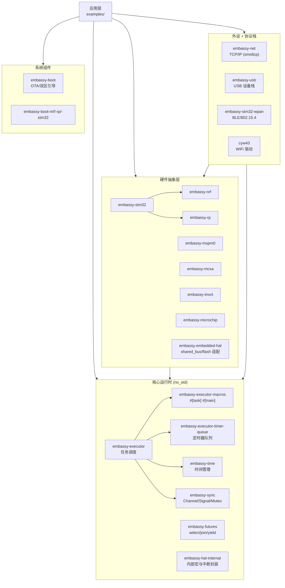

# 01 Embassy 项目速览

> 本文档是 Embassy 学习路径的**第一站**，目标：用 5-10 分钟建立对 Embassy 的整体认知。
> 读者画像：具备 Rust async/await 基础与 RTOS（FreeRTOS / RTX）经验，关注 Embassy 的设计取舍。

---

## 1. 一句话定义

**Embassy = Rust 异步运行时 + 嵌入式 HAL + 协议栈**，以编译时任务分配和零堆分配为核心理念，面向 40+ 微控制器系列。

与传统 RTOS 不同，Embassy 不暴露"任务控制块 + 调度器"原语，而是把任务当成普通 `async fn`，由 Rust 编译器生成状态机，由 Embassy 提供的执行器调度。**任务不是运行时对象，而是编译期产物**。

---

## 2. 核心设计理念（vs 传统 RTOS）

| 维度 | Embassy | 传统 RTOS（FreeRTOS） | 通用异步运行时（tokio） |
|------|---------|------------------------|------------------------|
| 任务表达 | `async fn` → 编译期状态机 | `fn` + 任务控制块 | `async fn` + 堆分配 Future |
| 调度模型 | 协作式 await | 抢占式时间片 | 协作式 await + 工作窃取 |
| 内存分配 | **零堆**（任务槽静态分配） | 静态/动态可选 | 必须堆 |
| 任务数量 | 编译期固定槽位（1-1000+） | 运行时动态 | 运行时无上限 |
| 平台目标 | 嵌入式 MCU | 嵌入式 MCU | 服务器/桌面 |
| 阻塞 I/O | **不允许**（会卡死执行器） | 允许 | 通常不允许 |

**关键差异一句话**：Embassy 把"任务是什么"从运行时搬到了编译时，代价是**绝对不能阻塞**。

### 2.1 协作 vs 抢占的取舍

FreeRTOS 通过定时器中断强制切换任务，保证公平性；Embassy 信任每个任务在 `await` 点主动让出。后果：

- ✅ 切换成本极低（仅寄存器保存/恢复，无栈拷贝）
- ✅ 任务间无共享栈，无栈溢出风险
- ⚠️ 一个 `while x { }` 死循环会卡死整个系统
- ⚠️ 长任务需要主动 `yield_now().await`（见 `embassy-futures`）

### 2.2 零堆的代价

所有任务槽、Channel、缓冲在编译期固定。运行时没有 `malloc`/`free`。
- ✅ 无内存碎片、无分配失败
- ⚠️ 配置项变多（`task-arena-size`、`signal-count` 等）
- ⚠️ 调整容量需重新编译

---

## 3. 核心特性

1. **编译时状态机** — `async fn` 由 Rust 编译器转为状态机，无运行时调度器
2. **零堆分配** — 任务、信号量、Channel 全部静态分配
3. **跨平台** — STM32 / nRF / RP2040·235x / MSPM0 / MCXA / imxrt / microchip 等 7+ 系列
4. **低功耗友好** — 空闲时进入 WFI/WFE，中断唤醒后只轮询就绪任务
5. **HAL 兼容** — 实现 `embedded-hal` v0.2 + v1.0 + `embedded-io` trait
6. **丰富协议栈** — embassy-net（TCP/IP）· embassy-usb · embassy-stm32-wpan（BLE）· LoRa
7. **可观测性** — 集成 `defmt` 高效日志与 `RTT`/串口输出

---

## 4. 项目结构（crate 拓扑）

整个工作空间由 **30+ 独立 crate** 组成，按职责可分为 4 大类：



### 4.1 核心运行时（无 HAL 依赖，可独立使用）

| crate | 职责 |
|-------|------|
| `embassy-executor` | 任务调度、唤醒、执行器主循环 |
| `embassy-executor-macros` | `#[task]`、`#[main]` 过程宏 |
| `embassy-executor-timer-queue` | 独立的定时器队列 trait（便于替换实现） |
| `embassy-time` | `Timer::after(Duration)`、`Instant`、`Duration` |
| `embassy-sync` | 同步原语：`Channel`、`Signal`、`Mutex`、`Semaphore`、`PubSubChannel` |
| `embassy-futures` | `select!`、`join!`、`yield_now()` 等组合子 |
| `embassy-hal-internal` | `Peripheral` 类型、`interrupt!` 宏、原子环缓冲 |

### 4.2 HAL（每个 MCU 系列一个 crate）

| crate | 目标硬件 | 关键外设 |
|-------|---------|----------|
| `embassy-stm32` | STM32 全系列 | GPIO/UART/SPI/I2C/ADC/TIM/DMA |
| `embassy-nrf` | nRF52 / 53 / 54 / 91 系列 | UARTE/SPIM/TWIM/PPI/DPPI/Radio |
| `embassy-rp` | RP2040 / RP235x | PIO/DMA/USB |
| `embassy-mspm0` | TI MSPM0 系列 | UART/I2C/SPI/ADC/TIM |
| `embassy-mcxa` | NXP MCXA 系列 | LPUART/SPI/I2C/CTimer |
| `embassy-imxrt` | NXP i.MX RT | FlexCOMM/CSI |
| `embassy-microchip` | Microchip 系列 | UART/I2C/GPIO |

### 4.3 协议栈

| crate | 职责 |
|-------|------|
| `embassy-net` | 基于 smoltcp 的 TCP/IP 栈（含 DNS/ICMP） |
| `embassy-usb` | USB 设备栈（CDC/HID/厂商类） |
| `embassy-stm32-wpan` | STM32WB 系列的 BLE/802.15.4 |
| `cyw43` / `cyw43-pio` | CYW43 WiFi 驱动（RP2040 常用） |
| `embassy-net-*` | 各 PHY 驱动（`adin1110` / `wiznet` / `enc28j60` / `nrf91`） |

### 4.4 系统组件

| crate | 职责 |
|-------|------|
| `embassy-boot` | 双区 bootloader + 固件验证 |
| `embassy-boot-nrf` / `-rp` / `-stm32` | 各平台 flash 适配 |

---

## 5. Embassy vs FreeRTOS vs tokio（设计取舍）

| 维度 | Embassy | FreeRTOS | tokio |
|------|---------|----------|-------|
| **执行模型** | 协作式 `async/await` | 抢占式时间片 | 协作式 `async/await` + 工作窃取 |
| **任务表达** | `async fn` 编译为状态机 | 函数 + TCB + 独立栈 | `async fn` → 堆分配 `Future` |
| **内存模型** | 零堆，任务槽静态化 | 静态池 / `pvPortMalloc` | 必须堆，有 `jemalloc`/`mimalloc` 优化 |
| **并发度** | 受限于 `task-arena-size` | 几乎无限（受 RAM 约束） | 默认 1 worker/核，可配置 |
| **中断处理** | HAL 内 trait + 唤醒 | `IRQn_Handler` 直接调用 | 平台无关（仅通用 OS） |
| **阻塞 I/O** | **严禁**（会卡死执行器） | 允许（任务独立栈） | **严禁**（worker 被占） |
| **公平性保障** | 无（信任 `await`） | 时钟中断强制切换 | 调度器抢占 |
| **典型场景** | 单 MCU 固件 | 单 MCU 固件 | 服务器/桌面应用 |
| **Rust 学习成本** | 中（需懂 async） | 低（C 风格 API） | 中 |
| **生态成熟度** | 较新（2020- 持续活跃） | 30+ 年 | 标杆（生产级） |

**核心洞察**：
- Embassy ≈ tokio 的**设计哲学** + 嵌入式 **零堆约束** + 跨 MCU 抽象
- 它**不是** FreeRTOS 的 Rust 包装，而是**完全不同的范式**
- 选用 Embassy 的典型理由：想用 async 写 MCU、需要更现代的类型系统与生态、对低功耗和静态可预测性有强需求

---

## 6. 一个最小示例（RP2040 blinky）

```rust
#![no_std]
#![no_main]

use embassy_executor::Spawner;
use embassy_time::Timer;
use embassy_rp::gpio;
use gpio::{Level, Output};
use {defmt_rtt as _, panic_probe as _};

#[embassy_executor::main]
async fn main(spawner: Spawner) {
    let p = embassy_rp::init(Default::default());
    let mut led = Output::new(p.PIN_25, Level::Low);

    loop {
        led.set_high();
        Timer::after_millis(500).await;
        led.set_low();
        Timer::after_millis(500).await;
    }
}
```

**5 行核心解读**：

1. `#[embassy_executor::main]` — 宏展开：生成 `main()`、构造 `Executor`、调用 `run()`
2. `let p = embassy_rp::init(...)` — HAL 初始化，返回 `Peripherals`（一次性借用所有外设）
3. `Output::new(p.PIN_25, Level::Low)` — GPIO 配置为输出
4. `Timer::after_millis(500).await` — 异步睡眠 500ms，**不阻塞**执行器
5. `loop { ... }` — `async fn` 顶层循环是 Embassy 任务的标准模式

注意：**没有 `unsafe`**、**没有堆分配**、**没有 RTOS API**。这就是 Embassy 写 MCU 的样子。

---

## 7. 学习路径

```
01-overview（本篇）
  ↓
02-architecture        ← crate 依赖关系、宏展开机制
  ↓
03-async-fundamentals  ← Rust async/await + Embassy 适配
  ↓
04-executor            ← 任务调度原理（必须）
  ↓
05-time / 06-sync      ← 时间与同步原语
  ↓
08-hal-architecture    ← HAL 设计 + embedded-hal trait
  ↓
09 / 10 / 11           ← 选择你的 MCU 平台（stm32/nrf/rp）
  ↓
12-16                  ← 外设驱动（gpio/uart/spi/i2c/timer）
  ↓
17-20                  ← 网络与通信栈
  ↓
24-27                  ← 开发实践（环境、调试、测试、模式）
```

---

## 8. 参考

- **本仓库**：
  - `learn/embassy.md` — Embassy 项目的中文介绍（更详细的特性与历史）
  - `learn/02-architecture.md` — 紧接本篇，分析 crate 间的依赖与模块关系
  - `learn/03-async-fundamentals.md` — async/await 在 Embassy 上下文的工作原理
- **官方资源**：
  - [embassy-rs/embassy](https://github.com/embassy-rs/embassy) — 上游仓库
  - [embassy.dev](https://embassy.dev) — 官方文档站
  - [The Embedded Rust Book](https://docs.rust-embedded.org/book/) — 嵌入式 Rust 基础
- **相关规范**：
  - [embedded-hal](https://github.com/rust-embedded/embedded-hal) — HAL trait 标准
  - [defmt](https://github.com/knurling-rs/defmt) — 嵌入式日志格式
