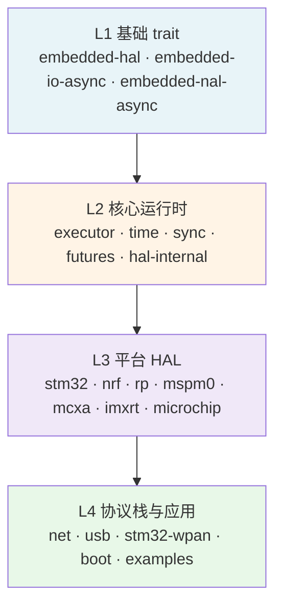
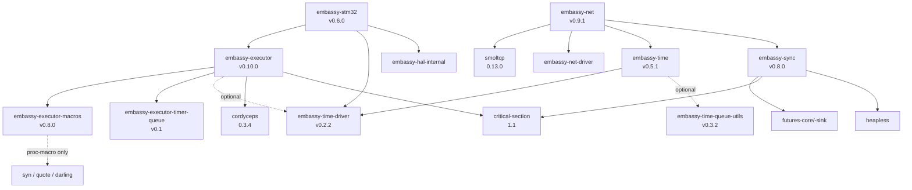

# 02 Embassy 架构：crate 依赖与模块关系

> 本文档紧接 `01-overview.md`，从"是什么"深入到"它们如何连接"。
> 重点：依赖方向、feature 矩阵、宏展开机制、跨 crate 调用关系。

---

## 1. 概念分层

Embassy 的 30+ crate 在概念上分为 **4 层**（自下而上依赖，禁止反向引用）：



**依赖方向铁律**：
- L2 可以依赖 L1（如 `embassy-net` 依赖 `embedded-io-async`）
- L3 依赖 L2（如 `embassy-stm32` 依赖 `embassy-executor`）
- L4 依赖 L3（如 `embassy-net` 依赖具体的网卡 driver）
- ❌ **反向引用不存在**：L1 永远不知道 L2 存在

这保证了 HAL trait 可以被非 Embassy 项目使用（如 RTIC + embedded-hal 也能跑同一组传感器驱动）。

---

## 2. workspace 全景与依赖方向

### 2.1 30+ crate 的 7 大分类

| 类别 | crate | 角色 |
|------|-------|------|
| **核心运行时** | `embassy-executor` / `-macros` / `-timer-queue` | 任务调度、宏、定时器队列 |
| **核心运行时** | `embassy-time` / `embassy-time-driver` / `embassy-time-queue-utils` | 时间抽象与驱动接口 |
| **核心运行时** | `embassy-sync` | 同步原语（Channel/Signal/Mutex） |
| **核心运行时** | `embassy-futures` | `select!`/`join!`/`yield_now` |
| **核心运行时** | `embassy-hal-internal` | `Peripheral` 类型、`interrupt!` 宏、原子环缓冲 |
| **平台 HAL** | `embassy-stm32` / `-nrf` / `-rp` / `-mspm0` / `-mcxa` / `-imxrt` / `-microchip` | 各 MCU 系列的 HAL |
| **平台 HAL** | `embassy-embedded-hal` | shared_bus / flash 适配 |
| **协议栈** | `embassy-net` / `-net-driver` / `-net-driver-channel` | TCP/IP 栈与 driver 接口 |
| **协议栈** | `embassy-net-adin1110` / `-enc28j60` / `-wiznet` / `-nrf91` / `-ppp` / `-tuntap` / `-esp-hosted` | 各 PHY 驱动 |
| **协议栈** | `embassy-usb` | USB 设备栈 |
| **协议栈** | `embassy-stm32-wpan` | STM32WB BLE/802.15.4 |
| **协议栈** | `cyw43` / `cyw43-pio` | CYW43 WiFi 驱动（RP2040 常用） |
| **系统组件** | `embassy-boot` / `-boot-nrf` / `-boot-rp` / `-boot-stm32` | 双区 bootloader |

### 2.2 依赖方向示意（核心子图）



**注意几个反直觉的依赖**：
- `embassy-executor` **不**依赖 `embassy-time`（只通过可选 feature 间接关联）
- `embassy-sync` **不**依赖 `embassy-executor` 或 `embassy-time`（完全独立）
- `embassy-executor-macros` **不**依赖任何 embassy crate（纯编译器库）

这种解耦是 Embassy 模块化的核心。

---

## 3. 核心 crate 依赖详解（实际 Cargo.toml 摘录）

### 3.1 `embassy-executor` 的依赖

```toml
[dependencies]
defmt = { version = "1.0.1", optional = true }
log = { version = "0.4.14", optional = true }
rtos-trace = { version = "0.2", optional = true }

embassy-executor-macros = { version = "0.8.0", path = "../embassy-executor-macros" }
embassy-time-driver = { version = "0.2.2", path = "../embassy-time-driver", optional = true }
embassy-executor-timer-queue = { version = "0.1", path = "../embassy-executor-timer-queue" }
critical-section = "1.1"
cordyceps = { version = "0.3.4", features = ["no-cache-pad"] }

# 平台门控
cortex-m = { version = "0.7.6", optional = true }      # platform-cortex-m
aarch32-cpu = { version = "0.3", optional = true }     # platform-cortex-ar
wasm-bindgen = { version = "0.2.82", optional = true } # platform-wasm
avr-device = { version = "0.8.1", optional = true }     # platform-avr
```

**关键观察**：
- 8 种平台 feature（cortex-m / cortex-ar / riscv32 / riscv64 / wasm / avr / z7 / std / spin）— 互斥选用
- `cordyceps` 是上游 crates.io 的 intrusive 数据结构库（`embassy-executor` 用它实现 task pool）
- `embassy-time-driver` 是 **optional** —— 仅当开启 `embassy-time-driver` feature 时才依赖

### 3.2 `embassy-executor-macros` 的依赖（极简）

```toml
[dependencies]
syn = { version = "2.0.15", features = ["full", "visit"] }
quote = "1.0.9"
darling = "0.20.1"
proc-macro2 = "1.0.29"
```

**为什么这么少**：过程宏在编译时运行（用户在 build 他们的二进制时），不能引入任何运行时依赖。`syn` 解析 AST、`quote` 生成代码、`darling` 解析宏属性（如 `#[task(pool_size = 4)]`）。

### 3.3 `embassy-time` 的依赖

```toml
[dependencies]
embassy-time-driver = { version = "0.2.2", path = "../embassy-time-driver" }
embassy-time-queue-utils = { version = "0.3.2", path = "../embassy-time-queue-utils", optional = true}

embedded-hal-02 = { package = "embedded-hal", version = "0.2.6" }
embedded-hal-1 = { package = "embedded-hal", version = "1.0" }
embedded-hal-async = { version = "1.0" }

futures-core = { version = "0.3.31", default-features = false }
critical-section = "1.1"
```

**注意**：
- `embassy-time` 同时支持 `embedded-hal` v0.2 **和** v1.0 — 双版本共存，避免破坏现有用户
- 不依赖 `embassy-executor`！但用了一个 *trait* `embassy-time-driver` — 通过 trait 抽象允许其他执行器（tokio、smoltcp 自带）也能用
- 实际的 timer queue 实现分两种：
  - 默认 `queue_integrated`：与 `embassy-executor` 集成（性能高，**不能用于其他执行器**）
  - `generic-queue-{8,16,32,64,128}`：通用实现，可用于任何执行器

### 3.4 `embassy-sync` 的依赖（最自包含）

```toml
[dependencies]
futures-sink = { version = "0.3", default-features = false }
futures-core = { version = "0.3.31", default-features = false }
critical-section = "1.1"
heapless = "0.9"
embedded-io-async = { version = "0.7.0" }
```

**完全不依赖任何 `embassy-*` crate**。`embassy-sync` 是一个**通用的 no_std 同步原语库**，可以在 RTIC、smoltcp、甚至是裸机项目中使用。`Channel`/`Signal`/`Mutex`/`Semaphore`/`PubSubChannel` 都是基于 `critical-section` 和 `heapless` 实现的。

### 3.5 `embassy-net` 的依赖（最重）

```toml
[dependencies]
smoltcp = { version = "0.13.0", default-features = false, features = ["socket", "async"] }
embassy-net-driver = { version = "0.2.0", path = "../embassy-net-driver" }
embassy-time = { version = "0.5.1", path = "../embassy-time" }
embassy-sync = { version = "0.8.0", path = "../embassy-sync" }
embedded-io-async = { version = "0.7.0" }
managed = { version = "0.8.0", default-features = false, features = ["map"] }
heapless = { version = "0.9", default-features = false }
embedded-nal-async = "0.9.0"
```

**架构角色**：`embassy-net` 是**薄包装**，把 smoltcp 的同步 API 适配为 async API。核心 TCP/IP 协议实现在 smoltcp，Embassy 只做"polling 调度"和"trait 对接"。

---

## 4. feature flag 机制

Embassy 的 feature flag 体系极其精细，目的是**精确控制编译产物**（FLASH 空间敏感）。

### 4.1 `embassy-executor` 的 feature 矩阵

| Feature | 作用 | 二进制影响 |
|---------|------|------------|
| `platform-cortex-m` | 启用 Cortex-M 后端（WFE/SEV、NVIC） | +内核支持代码 |
| `platform-riscv32/64` | 启用 RISC-V 后端（WFI） | +内核支持代码 |
| `platform-std` | 启用 std 后端（线程模拟） | +std 依赖 |
| `platform-wasm` | 启用 WASM 后端 | +wasm-bindgen |
| `platform-avr` | 启用 AVR 后端 | +avr-device |
| `platform-spin` | 自旋锁后端（仅调试） | 最小 |
| `executor-thread` | 启用 thread-mode 执行器 | 核心实现 |
| `executor-interrupt` | 启用 interrupt-mode 执行器（Cortex-M only） | +中断处理 |
| `scheduler-priority` | 优先级调度 | +优先级字段 |
| `scheduler-deadline` | Earliest Deadline First 调度 | +deadline 字段 |
| `embassy-time-driver` | 启用 time driver trait | 链接 time 驱动 |
| `defmt` / `log` | 日志后端 | 仅替换日志宏 |
| `rtos-trace` | 集成 rtos-trace 框架 | +tracepoint |
| `turbowakers` | 优化 waker 内存布局（需 nightly） | 需打补丁 core |
| `nightly` | 启用 nightly 特性 | 需 nightly Rust |

**典型组合示例**：

```toml
# RP2040 项目（Cortex-M0+）
embassy-executor = { version = "0.10", features = [
    "arch-cortex-m", "executor-thread", "defmt",
] }

# 高性能 Cortex-M7 项目
embassy-executor = { version = "0.10", features = [
    "arch-cortex-m", "executor-thread", "scheduler-priority",
    "executor-interrupt", "embassy-time-driver", "defmt",
] }
```

### 4.2 `embassy-stm32` 的 feature 矩阵（最复杂）

`embassy-stm32` 用了**双重 feature 矩阵**：

```toml
# 1. 芯片选择（互斥，必须选一个）
features = ["stm32f401ve"]    # 启用此芯片的 PAC + 时钟树

# 2. 外设/功能门控（可叠加）
features = [
    "defmt",                 # 日志
    "exti",                  # 外部中断
    "time",                  # embassy-time driver 集成
    "time-driver-tim1",      # 用 TIM1 作 time 驱动
    "dual-bank",             # 双 bank flash（OTA 优化）
    "low-power",             # 低功耗模式支持
]
```

**芯片 feature 数量**：100+（从 STM32C011 到 STM32H7S78）。`embassy-stm32` 是 `stm32-metapac` 的薄包装，启用某个芯片 feature 会触发 `build.rs` 生成对应的 `embassy_stm32::chip` 模块。

### 4.3 `embassy-time` 的 tick 频率矩阵

100+ `tick-hz-*` feature（1Hz 到 5.24GHz），由 `gen_tick.py` 自动生成。允许精确选择**时间分辨率**，直接影响定时器比较寄存器值和精度。

**为什么这么多**：不同 MCU 的硬件定时器位宽不同（16/32/64 bit），用户需要根据硬件能力选 tick 频率。

---

## 5. 宏展开机制（`#[task]` / `#[main]`）

Embassy 的 `#[task]` 和 `#[main]` 宏是用户体验的核心 —— 它**把 async fn 变成可调度任务**。

### 5.1 `#[embassy_executor::main]` 展开逻辑

```rust
// 源码（用户写的）
#[embassy_executor::main]
async fn main(spawner: Spawner) {
    let p = embassy_rp::init(Default::default());
    // ...
}
```

宏展开后（伪代码）：

```rust
fn main() -> ! {
    // 1. 构造 Executor（thread-mode）
    static EXECUTOR: StaticCell<Executor> = StaticCell::new();
    let executor = EXECUTOR.init(Executor::new());

    // 2. 构造 task arena（编译期固定大小）
    static TASKS: [Task<...>; 1] = [Task::new()];

    // 3. 在 arena[0] 上 spawn main 任务
    let spawner = executor.spawner();
    let main_task = TASKS[0].init(|| main(spawner));
    executor.run(|spawner| {
        spawner.spawn(main_task);
    });
}
```

**关键点**：
- `static EXECUTOR: StaticCell<Executor>` — **零堆**，执行器是静态变量
- `static TASKS: [Task; N]` — 任务槽数量在编译期固定
- `main` 函数被转成 `TASKS[0].init(|| main(spawner))` — 实际上是把 main 包成"future"

### 5.2 `#[task]` 宏展开逻辑

```rust
// 源码
#[embassy_executor::task(pool_size = 4)]
async fn blink(pin: Output<'static>, interval_ms: u64) {
    loop {
        pin.toggle();
        Timer::after_millis(interval_ms).await;
    }
}

// 展开后（伪代码）
struct BlinkTask {
    pin: Output<'static>,
    interval_ms: u64,
}

impl BlinkTask {
    fn schedule(&self) { /* 唤醒 */ }
}

// pool 静态变量
static BLINK_POOL: [Task<BlinkTask>; 4] = [Task::new(); 4];

// spawner spawn 方法
fn spawn(pin: Output<'static>, interval_ms: u64) -> SpawnToken<...> {
    // 在 pool 中找空槽
    // 写入参数
    // 返回 spawn token（让用户知道是否成功）
}
```

**关键点**：
- `pool_size` 控制同一任务的并发实例数（4 = 同一 blink 函数可同时跑 4 个）
- 任务参数必须是 `'static` —— **状态机在编译期固定，不能引用栈**
- spawn 返回 token，用户需 `token.wait()` 确认是否成功调度

### 5.3 与 tokio `#[tokio::main]` 的对比

| 维度 | Embassy `#[main]` | tokio `#[tokio::main]` |
|------|-------------------|------------------------|
| 执行器 | 静态变量（StaticCell） | tokio runtime（可单/多线程） |
| 任务槽 | 编译期固定（pool_size） | 堆分配，无上限 |
| 阻塞 I/O | 禁止 | 禁止 |
| 时间驱动 | trait 注入（`embassy-time-driver`） | 内置（tokio 自带 IO/时间） |
| 多线程 | 通过 `arch-cortex-m` 平台区分（thread/interrupt） | 通过 `flavor` 参数 |
| Waker | 自实现（基于 `critical-section` + `cordyceps` intrusive list） | std 标准 waker |

---

## 6. `no_std` 与 `no_main` 模式

整个 Embassy 项目**默认 `no_std`**，因为目标平台无 OS、无堆。

### 6.1 `#![no_std]` 的意义

```rust
#![no_std]  // 不链接 std
#![no_main] // 不使用标准 main 入口
```

后果：
- ❌ 不能用 `String`、`Vec`、`HashMap`
- ❌ 不能用 `std::thread`、`println!`
- ✅ 只能用 `core`（基础类型）+ 显式启用的 alloc + 第三方 no_std crate
- ✅ 二进制大小大幅减小（典型 RP2040 blinky ~10-20 KB）

### 6.2 HAL crate 的统一 `lib.rs` 模式

```rust
// embassy-stm32/src/lib.rs
#![no_std]
#![cfg_attr(docsrs, feature(doc_cfg))]

// 重新导出 PAC（按 feature 选择）
#[cfg(feature = "stm32f401ve")]
pub use stm32_metapac::stm32f4 as pac;
// ... 100+ 个 cfg

// 通用模块
pub mod dma;
pub mod gpio;
pub mod usart;
pub mod rcc;
// ...
```

每个 HAL crate 都遵循此模式：re-export PAC + 实现 HAL trait。

### 6.3 `cortex-m-rt` / `riscv-rt` 链接脚本

`no_main` 模式下，启动入口由 crate 提供（不是 `std::rt`）：

```rust
// cortex-m-rt 提供的入口（典型 RP2040）
#[cortex_m_rt::entry]
fn main() -> ! {
    // 硬件初始化
    // 然后调用用户 #[embassy_executor::main] 包装的函数
}
```

不同 MCU 系列用不同的 `cortex-m-rt` / `riscv-rt` / `avr-rt` crate，由 HAL crate 在 `examples/` 中演示。

---

## 7. 跨 crate 调用模式

Embassy 内部有几个**反复出现的设计模式**，值得在源码阅读前先理解：

### 7.1 Trait 抽象驱动接口

| 位置 | 模式 | 例子 |
|------|------|------|
| `embassy-time-driver` | HAL 实现 `Driver` trait 提供时间 | `embassy-stm32/src/time_driver.rs` |
| `embassy-net-driver` | 网卡实现 `Driver` trait 提供 packet rx/tx | 各 PHY driver |
| `embassy-executor-timer-queue` | 实现 `TimerQueue` trait | 默认集成在 executor |
| `embedded-hal` | GPIO/SPI/I2C 等标准 trait | 各 HAL crate |

**好处**：核心库定义 trait，HAL crate 实现 trait。核心库不需要知道具体硬件。

### 7.2 `Peripheral` 类型模式（所有权表达）

`embassy-hal-internal` 提供 `Peripheral` 类型，用于表达"外设所有权"：

```rust
let p = embassy_stm32::init(Default::default());
let mut led = Output::new(p.PC13, Level::Low);
//          ↑^^^^^^^ p.PC13 是 Peripheral<PCTYPE>，只能借给 Output 一次
//                  后续代码不能再次使用 p.PC13
```

这是 **类型系统层面的"一次借用"** — 编译期防止两个任务同时操作同一个 GPIO。

### 7.3 `interrupt!` 宏与中断绑定

`embassy-hal-internal::interrupt!` 宏把中断处理函数和具体外设绑定：

```rust
embassy_hal_internal::interrupt_mod!(USART1, ...);
```

HAL 在 `build.rs` 中解析芯片的 `device.x`（来自 PAC）来生成每个中断的 `bind_interrupts!` 块。

---

## 8. 关键设计决策回顾

| 决策 | 原因 | 权衡 |
|------|------|------|
| 多个独立 crate 而非单一 monorepo | 允许用户只引入需要的部分；可单独发版 | 跨 crate 改动需要同步版本号 |
| `embassy-sync` 完全独立 | 让同步原语能用于非 Embassy 项目 | 失去与 executor 的优化机会 |
| `embassy-executor-macros` 不依赖 embassy | 宏不能引入运行时依赖 | 宏无法做 executor 相关的类型检查 |
| `embassy-time` 用 trait 抽象 | 允许其他执行器使用 | 增加一层间接 |
| 100+ feature flag | 精确控制二进制大小 | Cargo.toml 配置变复杂 |
| 任务参数必须 `'static` | 状态机在编译期固定，无堆分配 | API 限制，无法动态 spawn |
| trait 注入 driver（时间/网卡） | 解耦核心与平台 | 用户必须正确实现 trait |

---

## 9. 推荐源码阅读顺序

```
1. embassy-executor/src/lib.rs          (~22 符号，1 文件入口)
2. embassy-executor/src/raw/mod.rs       (~65 符号，核心数据结构)
3. embassy-executor/src/spawner.rs       (~28 符号，Spawner 抽象)
4. embassy-executor-macros/src/macros/task.rs  (~15 符号，#[task] 宏)
5. embassy-time/src/lib.rs               (~9 符号，Timer trait)
6. embassy-sync/src/lib.rs               (~1 符号，入口很轻)
7. embassy-sync/src/{mutex,channel,signal}.rs  具体原语
8. embassy-hal-internal/src/{peripheral,interrupt}.rs  关键 trait
9. 某个 HAL 的 src/lib.rs                (e.g. embassy-rp/src/lib.rs)
10. examples/ 下 blinky-async/src/main.rs  完整闭环
```

---

## 10. 参考

- **本仓库**：
  - `learn/01-overview.md` — 上一节，crate 分类与设计理念
  - `learn/03-async-fundamentals.md` — 下一节，async/await 在 Embassy 上下文
  - `learn/04-executor.md` — 深入 embassy-executor 调度原理
- **官方**：
  - [embassy-rs/embassy](https://github.com/embassy-rs/embassy) — Cargo.toml 是依赖关系的真相
  - [docs.embassy.dev](https://docs.embassy.dev) — 各 crate 的 feature 文档
  - [API guidelines](https://rust-lang.github.io/api-guidelines/) — Embassy 遵循的 Rust API 规范
- **相关设计**：
  - [cordyceps](https://crates.io/crates/cordyceps) — executor 用到的 intrusive 数据结构
  - [critical-section](https://crates.io/crates/critical-section) — 跨平台临界区抽象
  - [smoltcp](https://github.com/smoltcp-rs/smoltcp) — 底层 TCP/IP 协议实现
