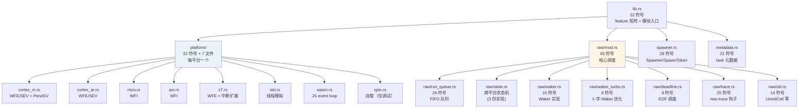

# 04 embassy-executor 任务调度

> 本文档是 M2（核心组件深入）首篇，深入 `embassy-executor` 的源码实现。
> 紧接 M1.3 的 Poll/Waker 通用机制，本文聚焦 Embassy **怎么把通用机制变成可运行系统**。

---

## 1. 模块结构

`embassy-executor/src/` 目录（~25 个 .rs 文件，按职责分组）：



**关键设计**：
- `lib.rs` 27-37 行用 `check_at_most_one!` 宏**编译期**强制 9 个 platform feature **互斥**（同一 crate 只能启用一个）
- `raw/` 子模块被 `#[doc(hidden)]` 标记为不安全，**普通用户不直接用**，由 `Spawner`/`Executor` 包装
- `platform/` 通过 `#[cfg_attr(feature = "platform-cortex-m", path = "...")]` 在编译期选择具体实现

---

## 2. 三个核心类型

### 2.1 `TaskHeader` — 任务元数据

每个任务在编译期绑定一个 `TaskHeader`（`raw/mod.rs:105-119`）：

```rust
pub(crate) struct TaskHeader {
    pub(crate) state: State,                      // 状态机（WAITING/SPAWNED/RUN_ENQUEUED）
    pub(crate) run_queue_item: RunQueueItem,     // intrusive list 节点
    pub(crate) executor: AtomicPtr<SyncExecutor>,// 所属执行器（支持跨 executor）
    poll_fn: SyncUnsafeCell<Option<unsafe fn(TaskRef)>>,  // 当前 poll 函数
    pub(crate) timer_queue_item: TimerQueueItem, // 定时器队列 slot
    pub(crate) metadata: Metadata,               // 任务名/优先级/截止时间
    #[cfg(feature = "rtos-trace")]
    all_tasks_next: AtomicPtr<TaskHeader>,      // 全局链表
}
```

**关键设计**：
- `state` 是 `State` enum 的原子版本（`AtomicUsize` 或 `critical_section` 保护）—— 跨上下文安全
- `poll_fn` 是**动态函数指针**：任务活跃时是 `TaskStorage::poll`，退出后是 `poll_exited` —— 同一槽位不同生命周期不同行为
- `executor` 用 `AtomicPtr` 支持一个 task 在不同 executor 间迁移（虽然实际很少用）

### 2.2 `TaskRef` — 类型擦除的任务指针

```rust
pub struct TaskRef {
    ptr: NonNull<TaskHeader>,  // 单字段！
}
```

**为什么 1 个字段就够**：`TaskStorage<F>` 用 `#[repr(C)]` 保证 `TaskHeader` 在偏移 0（`raw/mod.rs:192-198`）：

```rust
// repr(C) is needed to guarantee that the Task is located at offset 0
// This makes it safe to cast between TaskHeader and TaskStorage pointers.
#[repr(C)]
pub struct TaskStorage<F: Future + 'static> {
    raw: TaskHeader,
    future: UninitCell<F>, // Valid if STATE_SPAWNED
}
```

**`TaskRef` 2 字 vs 完整 `Waker` 8+ 字** —— 通用原语（如 `AtomicWaker`）可直接存 `TaskRef` 省 75% 内存。

### 2.3 `Executor` — 执行器（公开类型）

```rust
#[repr(transparent)]
pub struct Executor {
    pub(crate) inner: SyncExecutor,
    _not_sync: PhantomData<*mut ()>,  // 标记 !Sync
}
```

**`_not_sync: PhantomData<*mut ()>`** 故意让 `Executor` 变 `!Sync` —— 因为 `pender` 可能从任何上下文（包括另一个中断）调用，Rust 的同步保证不适用。

`SyncExecutor` 是内部类型，由 `Executor::new()` 构造时绑定 pender：

```rust
pub fn new(context: *mut ()) -> Self {
    Self {
        inner: SyncExecutor::new(Pender(context)),
        _not_sync: PhantomData,
    }
}
```

`context` 是用户透传给 pender 的"魔法数"：
- thread mode：`THREAD_PENDER = usize::MAX`
- interrupt mode：IRQ 编号

---

## 3. `Executor::run()` 主循环

### 3.1 完整源码（`platform/cortex_m.rs:100-109`）

```rust
pub fn run(&'static mut self, init: impl FnOnce(Spawner)) -> ! {
    init(self.inner.spawner());

    loop {
        unsafe {
            self.inner.poll();
            asm!("wfe");   // ← Wait For Event：CPU 进入低功耗
        };
    }
}
```

**4 步循环**：

1. `init` 闭包：用户 spawn 初始任务（典型：spawn 一次 main_task）
2. 死循环 `loop`
3. `self.inner.poll()` —— 取出 run_queue 所有 task，逐个 poll
4. `asm!("wfe")` —— ARM 的 **Wait For Event** 指令

### 3.2 `SyncExecutor::poll` 源码（`raw/mod.rs:466-485`）

```rust
pub(crate) unsafe fn poll(&'static self) {
    self.run_queue.dequeue_all(|p| {
        let task = p.header();
        // Run the task
        task.poll_fn.get().unwrap_unchecked()(p);
    });
}
```

**关键点**：
- `dequeue_all` 一次性取**所有**就绪 task（避免遗漏 race 期间新 wake 的）
- 对每个 task 调 `poll_fn`（动态派发）
- `unwrap_unchecked` 因为 poll_fn 在 task 活跃时一定存在

### 3.3 Pender 机制（`platform/cortex_m.rs:1-43`）

```rust
#[unsafe(export_name = "__pender")]
#[cfg(any(feature = "executor-thread", feature = "executor-interrupt"))]
fn __pender(context: *mut ()) {
    unsafe {
        let context = context as usize;

        #[cfg(feature = "executor-thread")]
        if !cfg!(feature = "executor-interrupt") || context == THREAD_PENDER {
            core::arch::asm!("sev");   // ← 唤醒 WFE
            return;
        }

        #[cfg(feature = "executor-interrupt")]
        {
            use cortex_m::peripheral::NVIC;
            let irq = Irq(context as u16);
            NVIC::request(irq);         // ← 触发指定中断
        }
    }
}
```

**`#[export_name = "__pender"]`** —— 这是关键技巧。`__pender` 不在 Rust 链接表里，**通过 C ABI 名字查找**。当 `enqueue()` 把 task 加入 run_queue 后调 `self.pender.pend()`，最终调到 `__pender` 函数。

**两种实现**：
- **thread mode**：`sev` 指令 —— 唤醒正在 `WFE` 的 CPU
- **interrupt mode**：`NVIC::request(irq)` —— 触发软中断

### 3.4 完整调用链（一图流）

```
Waker::wake()  (在中断或任务内)
   ↓
wake_task(task_ref)  (raw/mod.rs:598)
   ↓
state.run_enqueue(...)  → 修改 state 为 RUN_ENQUEUED
   ↓
executor.enqueue(task)  → task 加入 run_queue
   ↓
executor.pender.pend()  → 调用 __pender
   ↓
ARM: SEV 指令  /  NVIC: 触发软中断
   ↓
CPU 唤醒 WFE / 中断 handler
   ↓
executor.run() 下一轮 poll()
   ↓
run_queue.dequeue_all(|p| p.poll_fn(p))  → poll 每个 task
   ↓
future.poll(cx)  → 如果 Ready 移出；如果 Pending 等下次 wake
```

---

## 4. 任务生命周期

### 4.1 状态机（6 个转移）

`raw/mod.rs:78-105` 的官方状态图：

```text
┌────────────┐   ┌────────────────────────┐
│Not spawned │◄─5┤Not spawned|Run enqueued│
│            ├6─►│                        │
└─────┬──────┘   └──────▲─────────────────┘
      1                 │
      │    ┌────────────┘
      │    4
┌─────▼────┴─────────┐
│Spawned|Run enqueued│
│                    │
└─────┬▲─────────────┘
     2│
     │3
┌─────▼┴─────┐
│  Spawned   │
│            │
└────────────┘
```

| 转移 | 触发点 | 涉及函数 |
|------|--------|----------|
| 1 | `AvailableTask::claim` 后 `Executor::spawn` | 任务进入活跃状态 |
| 2 | `RunQueue::dequeue_all` 取出 task | `State::run_dequeue` |
| 3 | `Waker::wake` 唤醒 | `wake_task` → `State::run_enqueue` |
| 4 | Poll 时返回 `Poll::Ready` | `TaskStorage::poll` |
| 5 | Run-queued 状态 task 退出 | `poll_exited` 替换 `poll_fn` |
| 6 | 任务**未 spawn** 就被 wake | `wake_task` → 入 run_queue 但不 poll |

**注意转移 6**：如果对一个已退出但未重新 spawn 的 task 调 wake，它会被加入 run_queue 但下次 poll 时**不被执行**（`poll_fn` 已是 `poll_exited`，调用了什么都不做）。这是设计：等待下次 spawn。

### 4.2 `TaskStorage::poll`（M1.3 §3.4 已讲，重温）

`raw/mod.rs:246-278`：

```rust
unsafe fn poll(p: TaskRef) {
    let this = &*p.as_ptr().cast::<TaskStorage<F>>();
    let future = Pin::new_unchecked(this.future.as_mut());
    let waker = waker::from_task(p);
    let mut cx = Context::from_waker(&waker);
    match future.poll(&mut cx) {
        Poll::Ready(_) => {
            this.future.drop_in_place();   // ← 释放 future 内存
            this.raw.poll_fn.set(Some(poll_exited));   // ← 切换 poll_fn
            this.raw.state.despawn();
        }
        Poll::Pending => {}
    }
    mem::forget(waker);
}
```

**3 个关键操作**：
- `drop_in_place` 释放 future 内存（`TaskStorage` 槽位可被复用）
- `poll_fn.set(Some(poll_exited))` —— **这个槽位从此只接收 wake，不重复 poll**
- `state.despawn()` —— 改回 `Not spawned` 状态，下次可 `spawn` 复用

---

## 5. 平台差异（7 种 platform feature）

### 5.1 总览

| 平台 feature | 调度方式 | 唤醒指令 | 适用 |
|--------------|----------|----------|------|
| `platform-cortex-m` | thread / interrupt | WFE / SEV / PendSV | Cortex-M0/M3/M4/M7 |
| `platform-cortex-ar` | thread only | WFE / SEV | Cortex-A/R（应用核） |
| `platform-z7` | thread / interrupt | WFE + Zynq 扩展 | Xilinx Zynq-7000 |
| `platform-riscv32` | thread | WFI | 32 位 RISC-V |
| `platform-riscv64` | thread | WFI | 64 位 RISC-V |
| `platform-wasm` | thread (JS 调度) | wasm-bindgen | WebAssembly |
| `platform-std` | thread (OS 线程) | OS 原语 | 桌面/服务器 |
| `platform-avr` | thread | WFI | AVR（megaAVR、tinyAVR） |
| `platform-spin` | thread (自旋) | 无 | 调试用（永不休眠） |

**thread mode 通用模式**：

```rust
pub fn run(&'static mut self, init: impl FnOnce(Spawner)) -> ! {
    init(self.inner.spawner());
    loop {
        unsafe {
            self.inner.poll();
            platform_sleep();   // 平台相关的低功耗指令
        };
    }
}
```

**Cortex-M 特殊点**（`cortex_m.rs:106`）：用 ARM 专用 `asm!("wfe")`，**RISC-V** 用 `asm!("wfi")`（`riscv.rs`），**WASM** 用 `wasm-bindgen` 事件循环（`wasm.rs`）。

### 5.2 interrupt mode（仅 Cortex-M）

```rust
pub struct InterruptExecutor {
    started: Mutex<Cell<bool>>,
    executor: UnsafeCell<MaybeUninit<raw::Executor>>,
}
```

**用法模式**：

```rust
// 1. 静态分配
static EXEC: InterruptExecutor = InterruptExecutor::new();

// 2. 在初始化代码中启动
let spawner = EXEC.start(InterruptNumber::from(27));  // 选一个未用的中断

// 3. 用户写中断 handler
#[interrupt]
fn SWI0() {  // 中断号 = 27
    unsafe { EXEC.on_interrupt() }
}

// 4. 在其他任务中通过 SendSpawner spawn
spawner.spawn(my_task()).unwrap();
```

**pender 路径**：
- task wake → `executor.enqueue(task)` → `__pender(irq=27)`
- `NVIC::request(Irq(27))` 触发软中断
- 中断 handler 调 `EXEC.on_interrupt()` → `executor.poll()`
- 多 executor 时：每个 executor 绑不同 IRQ，**硬件优先级天然隔离**

### 5.3 与 RTOS 的对比

| 维度 | Embassy | FreeRTOS | Zephyr |
|------|---------|----------|--------|
| 多优先级 | 多 Executor（thread + interrupt × N） | 任务优先级 0-32 | 线程优先级 + 调度域 |
| 抢占 | 中断优先级抢占 | 时间片 + 优先级 | 同左 |
| 中断延迟 | 微秒级（pender 是 SEV/NVIC.pend） | 取决于 configKERNEL | 取决于配置 |
| 上下文切换 | PendSV 硬件支持 | PendSV 模拟 | 同左 |

---

## 6. Scheduler 类型

### 6.1 默认 FIFO（无 feature）

`run_queue.rs` 用 `cordyceps::IntrusiveList` 实现 FIFO 队列。`dequeue_all` 一次性取出所有 task，**保持插入顺序**。

### 6.2 优先级（`scheduler-priority` feature）

启用后，task 状态从简单 `State` 变成 `StateWithPriority`，run_queue 也变成支持优先级的版本。

但实际上源码层面**优先级调度在 user side**：用户用 `interrupt::InterruptExecutor` + 不同 IRQ 优先级实现**多优先级**。`scheduler-priority` feature 主要影响 task 内部数据结构，让同优先级内**严格 FIFO**（避免优先级反转）。

### 6.3 截止时间（`scheduler-deadline` feature）

```rust
#[cfg(feature = "scheduler-deadline")]
mod deadline;
pub(crate) use deadline::Deadline;
```

**EDF（Earliest Deadline First）** 算法：
- 每个 task 有 `Deadline` 字段（在 `Metadata` 里）
- run_queue 按 deadline 排序，**deadline 最近的 task 优先 poll**
- 需要 `embassy-time-driver` feature（时间来源）

**适用场景**：软实时系统，需要"最紧急任务先跑"。

### 6.4 调度器选择对照表

| 需求 | 选择 |
|------|------|
| 普通应用，无实时要求 | 默认（无 feature） |
| 同优先级多任务，严格公平 | `scheduler-priority` |
| 软实时，最紧急任务优先 | `scheduler-deadline` |
| 多优先级隔离 | `interrupt::InterruptExecutor`（不是 feature） |

---

## 7. 任务大小与 pool 机制

### 7.1 `#[task(pool_size = N)]` 展开

`task_pool_size::<F, _, N>(my_task) == size_of::<TaskPool<F, N>>()`

`TaskPool<F, POOL_SIZE>` 内部是 `POOL_SIZE` 个 `TaskStorage<F>` 数组。`POOL_SIZE = 1` 时只有 1 个槽（默认），`POOL_SIZE = 4` 时 4 个同任务可并发。

**为什么不是堆**：所有 `TaskStorage` 静态分配，**编译期已知总内存**。

```rust
// 宏展开
#[embassy_executor::task(pool_size = 4)]
async fn blink(pin: Output<'static>, interval_ms: u64) { ... }

// 展开为
static BLINK_POOL: TaskPool<BlinkFuture, 4> = TaskPool::new();
// size = 4 * (TaskHeader 大小 + future 大小 + align padding)
```

**典型大小**：RP2040 的 `Output + u64` future ≈ 32 字节，`pool_size=4` ≈ 200 字节总开销。

### 7.2 任务内存布局图

```text
TaskStorage<F> (#[repr(C)])
┌──────────────────────────────┐
│ raw: TaskHeader              │  ← 偏移 0
│  ├─ state: State (AtomicUsize)│
│  ├─ run_queue_item: ...      │
│  ├─ executor: AtomicPtr      │
│  ├─ poll_fn: fn ptr          │
│  ├─ timer_queue_item: ...    │
│  └─ metadata: Metadata       │
├──────────────────────────────┤
│ future: UninitCell<F>        │  ← 偏移 sizeof(TaskHeader)
│  └─ [MaybeUninit<F>]         │     只在 SPAWNED 状态有效
└──────────────────────────────┘
```

`UninitCell<F>` 是封装 `MaybeUninit<F>` 的安全包装：避免在 future 初始化前误访问。

### 7.3 `size_of::<F>()` 编译期可知的好处

```rust
// 用户可以写
const_assert!(size_of::<MyTask>() < 256);
```

**编译期检查任务内存**，避免超 RAM 预算的 future 偷偷进入固件。

---

## 8. 与其他 crate 的协作

### 8.1 与 `embassy-time` 集成

`raw/mod.rs:56-64` 的关键 ABI 桥接：

```rust
#[unsafe(no_mangle)]
extern "Rust" fn __embassy_time_queue_item_from_waker(waker: &Waker) -> &'static mut TimerQueueItem {
    unsafe { task_from_waker(waker).timer_queue_item() }
}
```

**桥接机制**：
1. `Timer::after(d).await` 时，Timer future 调 `cx.waker()` 拿到任务的 Waker
2. Waker 通过 `task_from_waker` 反查 `TaskRef`
3. 拿 task header 里的 `timer_queue_item` slot
4. 把"唤醒时间"和 slot 一起塞进 timer queue
5. HAL 提供的 timer driver 在 tick 时检查 queue，**到点调用 `wake_task`**

**为什么用 `extern "Rust"` ABI 桥接**：`embassy-time` 不直接依赖 `embassy-executor`（解耦），但需要拿 timer slot —— 用 `#[unsafe(no_mangle)]` 函数跨 crate 寻址。

### 8.2 与 `embassy-executor-timer-queue` 抽象

`embassy-executor-timer-queue` 是个**独立 trait crate**，定义了 `TimerQueue` trait：

```rust
pub trait TimerQueue {
    type Schedule;
    fn schedule_wake(&mut self, at: Instant, waker: &Waker);
    fn next_wake(&self) -> Option<Instant>;
}
```

`embassy-executor` 内部用了这个 trait（默认实现是"内联"在 executor 里）。用户可以**替换** timer queue 实现 —— 比如多 executor 共享一个时间源。

### 8.3 与 `embassy-futures` 协作

`embassy-futures` 提供 `select!`/`join!`/`yield_now` 等**用户级组合子**。它们不依赖 executor 内部，只在 `.await` 协议上工作。

---

## 9. 实战：自定义调度策略的思路

**问题**：想在低功耗场景下，让 executor 每隔 100ms 自动 poll 一次（无论有没有 wake）。

**实现思路**（基于源码认知）：

```rust
// 1. 用 platform-spin 跑一个"心跳"任务
#[embassy_executor::task]
async fn heartbeat() {
    let mut ticker = Ticker::every(Duration::from_millis(100));
    loop {
        ticker.next().await;
        // 唤醒其他任务...
    }
}

// 2. 在 main 中用 InterruptExecutor（高优先级 + 中断驱动）
//    + ThreadExecutor（低优先级 + WFE）
// 3. heartbeat 跑在 InterruptExecutor（每 100ms 触发一次 poll）
// 4. 普通任务跑在 ThreadExecutor（被 heartbeat 间接驱动）
```

**更深度的自定义**（`raw::Executor` 裸用）：

```rust
// 完全裸用 raw executor，自定义 pender
#[unsafe(export_name = "__pender")]
fn my_pender(_ctx: *mut ()) {
    // 在这里挂自己的通知机制
    // 例如：写一个事件到 RTOS 邮箱
}

// 注意：不能用 platform-xx feature（会与 __pender 冲突）
```

**权衡**：裸用 `raw::Executor` 失去 platform 提供的标准 pender，但获得完全控制权（适合 RTOS 集成）。

---

## 10. 关键设计决策回顾

| 决策 | 原因 | 代价 |
|------|------|------|
| `Executor` 是 `!Sync` | pender 可在任何上下文调，Rust 同步保证不适用 | 多线程不能共享 Executor |
| 9 个 platform 互斥 | 一个程序只跑一个平台 | 需要重编译切换平台 |
| thread mode + interrupt mode 分开 | 优先级隔离 + 中断上下文中跑 async | API 复杂度增加 |
| `TaskRef` 是 1 字段 | 省内存（vs Waker 2 字段） | 失去类型安全（`NonNull<TaskHeader>` 强转） |
| `poll_fn` 动态函数指针 | 同一槽位活跃/退出两种行为 | 一次间接调用 |
| `SpawnToken` Drop panic | 防止 token 泄漏 | API 略 awkward |
| `#[export_name = "__pender"]` | 跨 crate ABI 桥接 | 不通过 Rust 链接，类型不安全 |
| cordyceps intrusive list | 任务入队出队零分配 | 学习曲线 + 强约束（`'static` 指针） |

---

## 11. 推荐源码阅读顺序

```
1. raw/mod.rs:1-120        → 模块结构 + TaskHeader 定义 + 状态机图
2. raw/mod.rs:200-300      → TaskStorage::poll（已 M1.3 讲过，重读）
3. raw/mod.rs:450-490      → SyncExecutor::poll + spawn
4. raw/mod.rs:595-622      → wake_task 关键路径
5. raw/state_atomics.rs    → 状态机位运算
6. raw/run_queue.rs        → cordyceps 包装
7. platform/cortex_m.rs:1-110  → pender + Executor::run
8. platform/cortex_m.rs:113-232 → InterruptExecutor
9. spawner.rs              → Spawner/SendSpawner/SpawnToken
10. raw/waker.rs            → Waker 极简实现（已 M1.3 讲过）
11. _export.rs（lib.rs:65+）→ task_fn_impl! 与对齐魔法
12. raw/deadline.rs         → EDF 调度（如果用 scheduler-deadline）
```

按这个顺序读，~1000 行能掌握 executor 核心。

---

## 12. 参考

- **本仓库**：
  - `learn/01-overview.md` · `learn/02-architecture.md` · `learn/03-async-fundamentals.md`
  - `learn/05-time.md`（M2.2，紧接）—— 深入 `Timer::after` 怎么用 executor
  - `learn/06-sync.md`（M2.3）—— Channel/Signal 怎么跨任务通信
- **官方**：
  - [embassy-rs/embassy](https://github.com/embassy-rs/embassy/tree/main/embassy-executor) — 源码
  - [docs.embassy.dev/embassy-executor](https://docs.embassy.dev/embassy-executor/) — API 文档
  - [embassy-book](https://embassy.dev/book/) — 官方教程
- **上游依赖**：
  - [cordyceps](https://docs.rs/cordyceps/) — intrusive 数据结构库
  - [cortex-m](https://docs.rs/cortex-m/) — Cortex-M intrinsics（asm!、NVIC、SCB）
  - [critical-section](https://docs.rs/critical-section/) — 跨平台临界区
