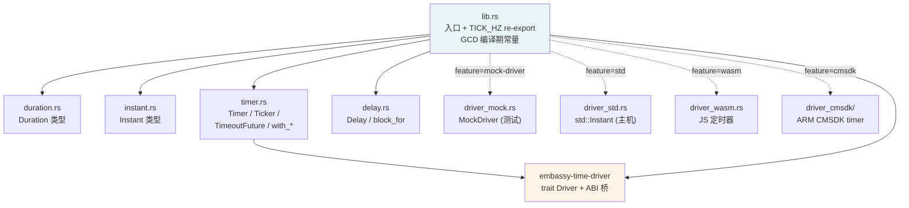

# 05 embassy-time 定时器与时间管理

> 本文档是 M2.2，深入 `embassy-time` 的源码实现。
> 紧接 M1.3 / M2.1 的 Timer 桥接概述，本文聚焦 Timer 自身、Driver 抽象、queue 选择、HAL 注入。

---

## 1. 模块结构



**关键观察**：
- **`duration.rs` + `instant.rs` 是纯计算类型**，不依赖任何运行时
- `timer.rs` 通过 `embassy-time-driver` 的 ABI 桥接调用**全局** driver（不在 generic 里）
- 4 个内置 driver 都是 `#[cfg(feature = "...")]` 门控的
- `TICK_HZ` 来自 `embassy-time-driver` crate（用户配 `tick-hz-*` feature）

---

## 2. 基础类型

### 2.1 `Duration`（`duration.rs`）

```rust
#[derive(Debug, Default, Copy, Clone, PartialEq, Eq, PartialOrd, Ord)]
pub struct Duration {
    pub(crate) ticks: u64,   // 私有！必须通过 const fn 构造
}
```

**设计要点**：
- **不存"秒"而存 tick** —— 避免运行时除法（tick 才是硬件定时器的原语）
- **所有单位换算都是 `const fn`** —— 编译期可调用
- **精度损失是显式的** —— `from_micros` 注释说"Delays this small may be inaccurate"

#### 2.1.1 构造方法（8 种）

| 方法 | 精度 | 失败行为 |
|------|------|----------|
| `from_ticks(t)` | 精确 | — |
| `from_secs(s)` | 1 秒 | 隐式 `*TICK_HZ` |
| `from_millis(ms)` | 1 ms | `div_ceil` 向上取整 |
| `from_micros(us)` | 1 µs | `div_ceil`（注：精度受 TICK_HZ 限制） |
| `from_nanos(ns)` | 1 ns | `div_ceil`（注：同上） |
| `from_hz(hz)` | 反向（频率→周期） | 钳位到 1 tick |
| `from_*_floor` | 向下取整变体 | — |
| `try_from_*` | 溢出返回 `None` | 显式处理 |

#### 2.1.2 编译期 GCD 优化

```rust
const fn gcd(a: u64, b: u64) -> u64 {
    if b == 0 { a } else { gcd(b, a % b) }
}

pub(crate) const GCD_1K: u64 = gcd(TICK_HZ, 1_000);
pub(crate) const GCD_1M: u64 = gcd(TICK_HZ, 1_000_000);
pub(crate) const GCD_1G: u64 = gcd(TICK_HZ, 1_000_000_000);
```

`as_millis()` 内部：
```rust
self.ticks * (1000 / GCD_1K) / (TICK_HZ / GCD_1K)
```

**优化思路**：先除以 GCD，**避免大数乘除**。例如 `TICK_HZ = 32_768`（典型 RTC），`GCD_1K = 1`，表达式变为 `ticks * 1000 / 32768`（1 次乘法 + 1 次除法）；若没有 GCD 优化，要算 `ticks * 1000 / 32768`（本质一样，但 GCD 让大 TICK_HZ 情况更优）。

#### 2.1.3 算术运算 + checked_* 变体

```rust
impl Add for Duration { ... }              // 溢出 panic
pub fn checked_add(self, rhs: Duration) -> Option<Duration> { ... }  // 溢出 None
```

**两种风格并存**：默认 `panic`（用户友好），`checked_*` 用于需要显式处理溢出的场景（如协议解析）。

#### 2.1.4 与 `std::time::Duration` 互转

```rust
impl TryFrom<core::time::Duration> for Duration { ... }  // std → no_std
impl From<Duration> for core::time::Duration { ... }     // no_std → std
```

**关键**：从 std 转是 `TryFrom`（可能失败，std::time 用 u64 nanos，可能超过 u64 micros），反之是 `From`（永远成功）。

### 2.2 `Instant`

```rust
pub struct Instant {
    pub(crate) ticks: u64,
}
```

**核心 3 元素**（按使用频度）：
- `Instant::now() -> Instant` —— 调 `embassy_time_driver::now()`
- `a + Duration` / `a - Duration` / `a - b` —— 算术运算
- `a <= b` 等比较（继承 `PartialOrd`）

**关键约束**（来自 `Driver` trait doc）：
- **单调递增**：永不回退
- **永不溢出**：在 ~10,000 年内不能溢出
- **永不失败**：即使硬件未初始化也要返回 0

**实现策略**：HAL 提供的 driver 必须保证这 3 条。32-bit 硬件定时器需要**软件扩展**到 64-bit（计数溢出次数）。

---

## 3. `Timer` 异步原语（`timer.rs:99-202`）

### 3.1 数据结构

```rust
#[derive(Debug)]
pub struct Timer {
    expires_at: Instant,
    yielded_once: bool,    // ← 关键：第一次 poll 时让出一次
}
```

### 3.2 `poll` 实现

```rust
impl Future for Timer {
    type Output = ();
    fn poll(mut self: Pin<&mut Self>, cx: &mut Context<'_>) -> Poll<Self::Output> {
        if self.yielded_once && self.expires_at <= Instant::now() {
            Poll::Ready(())
        } else {
            embassy_time_driver::schedule_wake(self.expires_at.as_ticks(), cx.waker());
            self.yielded_once = true;
            Poll::Pending
        }
    }
}
```

**4 步逻辑**：

1. **如果已经让出过一次 + 已到期** → `Ready`
2. **否则**（第一次 OR 未到期）：
   - 注册 waker 到 driver（`schedule_wake(expires_at_ticks, waker)`）
   - 标记 `yielded_once = true`
   - 返回 `Pending`

**`yielded_once` 的设计**：
- 第一次 poll 时立即让出（让其他任务先跑）—— **避免独占 executor**
- 第二次 poll 才真正检查时间（如果第一次注册 waker 时已经过了 expires_at，wake 路径会有 race）
- **cancel-safe**：drop 不需要清理（`schedule_wake` 是幂等的）

### 3.3 4 个便利方法

```rust
Timer::at(instant)                 // 在指定时刻醒来
Timer::after(duration)             // 相对当前时间醒来
Timer::after_millis(500)           // 500 ms 后
Timer::after_secs(1)               // 1 秒后
// 还有 after_micros / after_nanos / after_ticks
```

**`after_*` 内部都是 `after(duration.into())`** —— 一行包装，无额外逻辑。

### 3.4 完整 wake 链（Timer 视角）

```text
任务 A 调 Timer::after(100ms).await
   ↓
Timer future 被 poll
   ↓
schedule_wake(now + 100ms_ticks, waker)
   ↓
[driver.crate] 把 (time, waker) 塞入 timer queue
   ↓
HAL 的 timer ISR 在每个 tick 检查 queue
   ↓
[到期] 调 wake_task_no_pend / wake_task（如果 queue 是 integrated，用前者）
   ↓
Waker::wake() → wake_task → enqueue → pender
   ↓
executor.poll() 重新 poll Timer future
   ↓
Timer::poll 检查到 expires_at <= now → Ready(())  → 任务 A 继续
```

---

## 4. `Ticker`（节拍器，`timer.rs:244-316`）

### 4.1 问题：Timer 累积漂移

```rust
// ❌ 这不是"每秒调用 foo()"
loop {
    foo();                        // 假设耗时 50ms
    Timer::after(Duration::from_secs(1)).await;
}
// 实际周期：1050ms（50ms 工作 + 1000ms 等待）
```

### 4.2 解决：Ticker 固定周期

```rust
// ✅ 真正"每秒调用 foo()"
let mut ticker = Ticker::every(Duration::from_secs(1));
loop {
    foo();
    ticker.next().await;
}
// 实际周期：1000ms（无论 foo 多快都补齐）
```

### 4.3 内部实现

```rust
pub struct Ticker {
    expires_at: Instant,
    duration: Duration,
}

impl Ticker {
    pub fn next(&mut self) -> impl Future<Output = ()> + Send + Sync + '_ {
        poll_fn(|cx| {
            if self.expires_at <= Instant::now() {
                let dur = self.duration;
                self.expires_at += dur;       // ← 关键：累加而非从 now 算
                Poll::Ready(())
            } else {
                embassy_time_driver::schedule_wake(self.expires_at.as_ticks(), cx.waker());
                Poll::Pending
            }
        })
    }
}
```

**核心技巧**：
- `expires_at += duration` —— **累加**到下个周期点
- 不重新 `Instant::now() + duration` —— 这就是 Timer 的"漂移源"
- 即使 foo 耗时 50ms，**Ticker 自动补齐**（expires_at 已经"飞过去"了）

### 4.4 与 Timer 的取舍

| 场景 | 用 Timer | 用 Ticker |
|------|----------|-----------|
| 周期性采集数据 | — | ✅ 固定周期 |
| 单次 sleep | ✅ | — |
| 任务节流（避免太频繁） | ✅ | — |
| 时间敏感采样（每 10ms 一次） | — | ✅ 严格周期 |
| 防 watchdog 喂狗 | ✅ 简单 | — |

### 4.5 cancel safety 的微妙之处

文档注释：
```
It is safe to cancel waiting for the next tick,
meaning no tick is lost if the Future is dropped.
```

**但实际行为**（`next()` 实现）：
- 如果 expires_at <= now：先 `expires_at += duration` 再 `Ready(())`
- 也就是说，**drop 一个 Ready 但还没被 `.await` 消费的 future** 会"消耗"一个 tick

实际是"对调用者 cancel-safe"（调用者可以随时 drop，不会死锁），但**对内部状态有影响**。

---

## 5. `Driver` trait 抽象（`embassy-time-driver/src/lib.rs`）

### 5.1 trait 定义

```rust
pub trait Driver: Send + Sync + 'static {
    /// Return the current timestamp in ticks.
    fn now(&self) -> u64;

    /// Schedules a waker to be awoken at moment `at`.
    fn schedule_wake(&self, at: u64, waker: &Waker);
}
```

**2 个方法，极简**。但约束严格（来自 doc comment）：

- **单调**：现在 >= 之前
- **不溢出**：10,000 年内不能回卷
- **不失败**：硬件未初始化也要返回 0

### 5.2 ABI 桥接（最关键的设计）

```rust
// embassy-time-driver 内部
unsafe extern "Rust" {
    fn _embassy_time_now() -> u64;
    fn _embassy_time_schedule_wake(at: u64, waker: &Waker);
}

#[inline]
pub fn now() -> u64 {
    unsafe { _embassy_time_now() }
}
```

```rust
// driver crate（HAL 实现）
#[unsafe(no_mangle)]
fn _embassy_time_now() -> u64 {
    <$t as $crate::Driver>::now(&$name)
}
```

**关键技巧**：
- `extern "Rust" { fn ... }` —— 声明外部符号，不通过 Rust trait 解析
- `#[unsafe(no_mangle)]` —— 提供具体实现
- **链接器解析**：没有或多个定义 → 链接失败
- **单全局 driver** —— 避免多个驱动导致 `Instant` 不一致

### 5.3 `time_driver_impl!` 宏

```rust
#[macro_export]
macro_rules! time_driver_impl {
    (static $name:ident: $t: ty = $val:expr) => {
        static $name: $t = $val;

        #[unsafe(no_mangle)]
        #[inline]
        fn _embassy_time_now() -> u64 {
            <$t as $crate::Driver>::now(&$name)
        }

        #[unsafe(no_mangle)]
        #[inline]
        fn _embassy_time_schedule_wake(at: u64, waker: &core::task::Waker) {
            <$t as $crate::Driver>::schedule_wake(&$name, at, waker);
        }
    };
}
```

**HAL 用法**（伪代码）：
```rust
struct RpTimerDriver { /* TIMER 硬件寄存器 */ }
impl Driver for RpTimerDriver { ... }

// 在 binary crate 的初始化中：
embassy_time_driver::time_driver_impl!(static DRIVER: RpTimerDriver = RpTimerDriver::new());
```

**为什么不是 trait object**：避免泛型传播（库友好）+ 编译期单例检查（链接错误 vs 运行错误）。

### 5.4 4 种内置 driver

| Feature | 用途 | 实现 |
|---------|------|------|
| `mock-driver` | 单元测试 | 手动 `advance()` 推进时间 |
| `std` | 主机单元测试 | 用 `std::time::Instant` |
| `wasm` | 浏览器/Node.js | `js-sys` 定时器 |
| `cmsdk` | ARM CMSDK 评估板 | 硬件 timer 寄存器 |
| `cortex-m` | Cortex-M 通用 | 需 HAL 配合 |

**mock-driver 特殊**：用于**确定性测试** —— 不依赖真实时间流逝，测试代码可以 `embassy_time::MockDriver::advance(Duration::from_millis(100))` 手动推进时间。

---

## 6. Timer queue 抽象

### 6.1 两种 queue 模式

| 模式 | Feature | 性能 | 通用性 |
|------|---------|------|--------|
| **Integrated queue**（默认） | 无（依赖 `embassy-executor`） | ⚡ 高（直接复用 executor run_queue） | ❌ 只能配 `embassy-executor` |
| **Generic queue** | `generic-queue-{8,16,32,64,128}` | 较慢（独立数据结构） | ✅ 任何执行器 |

### 6.2 怎么选

```toml
# 默认（embassy-executor 用户）—— 不要加 generic-queue-* feature
embassy-time = { version = "0.5" }

# 库作者希望库可被其他执行器用 —— 也不加
# 让用户自己选

# 强制 generic queue（不依赖 embassy-executor）
embassy-time = { version = "0.5", features = ["generic-queue-32"] }
```

### 6.3 queue 容量选择

`generic-queue-N` 的 N 是**同时活跃的 timer 数**。选错会 panic：

- **太小**：第 N+1 个 `Timer::after(...).await` 触发 assert
- **太大**：浪费 RAM

**典型选择**：
- 简单应用：8-16
- 复杂应用（多任务 + 多个 timeouts）：32-64
- 路由器/网关（大量并发连接）：64-128

### 6.4 HAL 实现 driver 时的 queue 模式

参考 `embassy-time-driver` 文档（`lib.rs:42-85`）：

```rust
struct MyDriver {
    queue: Mutex<RefCell<Queue>>,
}

impl Driver for MyDriver {
    fn schedule_wake(&self, at: u64, waker: &Waker) {
        critical_section::with(|cs| {
            let mut queue = self.queue.borrow(cs).borrow_mut();
            if queue.schedule_wake(at, waker) {
                let mut next = queue.next_expiration(self.now());
                while !self.set_alarm(&cs, next) {
                    next = queue.next_expiration(self.now());
                }
            }
        });
    }
}
```

**关键流程**：
1. `queue.schedule_wake(at, waker)` —— 把 timer 放入 queue，返回"是否需要重设硬件 alarm"
2. 如果需要，调 `set_alarm` 重新配置硬件定时器到 `queue.next_expiration()`
3. `set_alarm` 失败（硬件正在跑更早的 alarm）→ 重试 next_expiration

---

## 7. tick 频率（`TICK_HZ`）

### 7.1 100+ `tick-hz-*` feature 的意义

`TICK_HZ` 由**用户**通过 feature 选择。它是**整个二进制**的全局常量：

- 1 Hz：超长周期任务（电池供电传感器，每秒一次）
- 1 MHz：通用高频定时（µs 精度）
- 100 MHz：高性能 MCU（ns 精度）

### 7.2 选择原则

| 场景 | 推荐 TICK_HZ |
|------|--------------|
| 需要 µs 精度 | ≥ 1 MHz |
| ms 精度 | ≥ 1 kHz |
| 长时间运行（>1 小时）需要 µs 精度 | 注意 u64 溢出（约 58 万年） |

### 7.3 HAL 视角

如果 HAL 写死 tick 频率（用某个硬件定时器），启用对应 feature：
```toml
# HAL 自己的 Cargo.toml
[features]
default = ["tick-hz-1_000_000"]  # 假设 HAL 用 1 MHz 硬件
```

如果 HAL 支持多种 tick 频率，**不**启用任何 feature，让用户选。

---

## 8. HAL 注入实战

### 8.1 RP2040（`embassy-rp`）

```rust
// 简化伪代码
struct RpTimerDriver {
    timer: Pac::TIMER,
}

impl Driver for RpTimerDriver {
    fn now(&self) -> u64 {
        // 读 TIMERAWL 寄存器，累加溢出次数到 64-bit
        self.timer.now()
    }
    fn schedule_wake(&self, at: u64, waker: &Waker) {
        // 把 (at, waker) 放入 atomic queue
        // 配置 ALARM0 寄存器
        // 到 ISR 时 wake waker
    }
}

// 在 binary crate
embassy_time_driver::time_driver_impl!(static DRIVER: RpTimerDriver = RpTimerDriver::new(p.TIMER));
```

**关键**：
- 用 ALARM0 / ALARM1 / ALARM2 / ALARM3 之一
- **ISR 中 wake waker**（而不是回到 thread context）

### 8.2 nRF（`embassy-nrf`）

类似 RP2040，但用 **RTC0**（32 kHz 低功耗晶振）。中断处理在 RTC0 IRQ。

### 8.3 STM32（`embassy-stm32`）

用 **TIM1** 或 **TIM2** 等通用定时器，feature 决定具体哪个：
```toml
features = ["time-driver-tim1", ...]   # 用 TIM1
features = ["time-driver-tim2", ...]   # 用 TIM2
features = ["time-driver-any", ...]    # 用 build script 自动选
```

### 8.4 注入点（HAL 责任）

HAL 必须在 binary crate 初始化时**调一次** `time_driver_impl!` 注册。这通常在 HAL 的 `init()` 函数里隐式完成。

---

## 9. 与 executor 的协作（深化 M2.1 §8.1）

### 9.1 完整数据流

```text
1. 任务 A 调 Timer::after(100ms).await
   ↓
2. Timer::poll 调 schedule_wake(expires_at, waker_A)
   ↓
3. [driver] schedule_wake 把 (expires_at, waker_A) 塞入 queue
   ↓
4. [driver] 调 set_alarm(next_expiration)
   ↓
5. [硬件] 100ms 后产生 timer ISR
   ↓
6. [ISR] 取 queue 头，调 waker_A.wake_by_ref()
   ↓
7. Waker::wake → wake_task(task_ref_A)
   ↓
8. state.run_enqueue → executor.enqueue → __pender (SEV)
   ↓
9. executor 主循环：WFE 唤醒 → poll()
   ↓
10. run_queue.dequeue_all → 任务 A 的 poll_fn 被调
    ↓
11. Timer::poll 看到 expires_at <= now → Ready
    ↓
12. 任务 A 继续执行
```

### 9.2 integrated vs generic queue 的差异

| 步骤 | integrated queue | generic queue |
|------|------------------|---------------|
| step 3-4 | 任务 A 的 `timer_queue_item` slot 复用 | 独立 queue |
| step 6-7 | 直接 wake（_no_pend 路径） | 必须 wake（标准路径） |
| step 8 | 已有 pender | 已有 pender |

**integrated queue 快在哪**：
- 任务 A 不需要再次 enqueue 到 run_queue
- 节省一次 atomic CAS

---

## 10. 实战：`with_timeout` / `with_deadline`

### 10.1 trait 扩展

```rust
pub trait WithTimeout: Sized {
    type Output;
    fn with_timeout(self, timeout: impl Into<Duration>) -> TimeoutFuture<Self>;
    fn with_deadline(self, at: Instant) -> TimeoutFuture<Self>;
}

impl<F: Future> WithTimeout for F {
    type Output = F::Output;
    fn with_timeout(self, timeout: impl Into<Duration>) -> TimeoutFuture<Self> { ... }
    fn with_deadline(self, at: Instant) -> TimeoutFuture<Self> { ... }
}
```

**所有 `Future` 都自动有 `.with_timeout()` 和 `.with_deadline()` 方法**。

### 10.2 `TimeoutFuture` 实现

```rust
pub struct TimeoutFuture<F> {
    timer: Timer,
    fut: F,
}

impl<F: Future> Future for TimeoutFuture<F> {
    type Output = Result<F::Output, TimeoutError>;
    fn poll(self: Pin<&mut Self>, cx: &mut Context<'_>) -> Poll<Self::Output> {
        let this = unsafe { self.get_unchecked_mut() };
        let fut = unsafe { Pin::new_unchecked(&mut this.fut) };
        let timer = unsafe { Pin::new_unchecked(&mut this.timer) };
        if let Poll::Ready(x) = fut.poll(cx) { return Poll::Ready(Ok(x)); }
        if let Poll::Ready(_) = timer.poll(cx) { return Poll::Ready(Err(TimeoutError)); }
        Poll::Pending
    }
}
```

**特点**：
- 同时 poll 两个 future，**任一 Ready 就返回**
- 另一个会被 drop（连同它占用的资源）
- 完整覆盖 use case：超时保护 + 资源回收

### 10.3 实战：UART 读 + 超时

```rust
use embassy_time::WithTimeout;
use embassy_futures::select;

async fn read_with_timeout(uart: &mut UartRx<'static>, buf: &mut [u8]) -> Result<usize, Error> {
    uart.read(buf).with_timeout(Duration::from_millis(100)).await
        .map_err(|_| Error::Timeout)
}
```

或用 `select`（无 default 行为时）：
```rust
match select(
    uart.read(buf),
    Timer::after(Duration::from_millis(100))
).await {
    Either::First(Ok(n)) => Ok(n),
    Either::First(Err(e)) => Err(e.into()),
    Either::Second(_) => Err(Error::Timeout),
}
```

---

## 11. 关键设计决策回顾

| 决策 | 原因 | 代价 |
|------|------|------|
| 单字段 `Duration { ticks }` | 硬件原语 + 无除法 | 精度依赖 TICK_HZ |
| `from_*` 用 `div_ceil` 向上取整 | 不会"早醒"（安全） | 实际时间略长 |
| `try_from_*` 显式溢出处理 | 协议解析场景需要 | API 表面增大 |
| `Timer::poll` 第一次 yield 一次 | 避免独占 executor | 多一次 await 周期 |
| `Ticker` 累加 expires_at | 固定周期不漂移 | API 略复杂 |
| Driver 用 ABI 桥接（非 trait object） | 编译期单例 + 库友好 | ABI 不安全 |
| `time_driver_impl!` 宏 | 隐藏 `extern "Rust"` 细节 | 宏调试难 |
| integrated queue 默认 | 性能高 | 锁死 `embassy-executor` |
| `Instant` 永不变回 / 不溢出 | 跨平台可比较 | HAL 实现复杂 |
| `TICK_HZ` 全局常量 | 简单 | 不同模块不能用不同频率 |

---

## 12. 推荐源码阅读顺序

```
1. embassy-time/src/lib.rs (64 行)              → 模块结构 + TICK_HZ re-export
2. embassy-time-driver/src/lib.rs (178 行)      → Driver trait + ABI 桥 + 宏
3. embassy-time/src/duration.rs (299 行)         → Duration 完整 API + GCD 优化
4. embassy-time/src/instant.rs (估计 ~50 行)    → Instant（薄包装）
5. embassy-time/src/timer.rs (323 行)           → Timer / Ticker / with_timeout
6. embassy-time/src/delay.rs                    → Delay / block_for
7. embassy-time/src/driver_mock.rs              → MockDriver 实现
8. embassy-time/src/driver_std.rs               → std driver 实现
9. examples/std/wrapper.rs（如果有）           → 完整 HAL 注入示例
```

按这个顺序读，~700 行能掌握 embassy-time 核心。

---

## 13. 参考

- **本仓库**：
  - `learn/03-async-fundamentals.md` · `learn/04-executor.md`
  - `learn/06-sync.md`（M2.3）—— Channel/Signal/Mutex
  - `learn/07-futures.md`（M2.4）—— select/join
- **官方**：
  - [embassy-rs/embassy/tree/main/embassy-time](https://github.com/embassy-rs/embassy/tree/main/embassy-time) — 源码
  - [docs.embassy.dev/embassy-time](https://docs.embassy.dev/embassy_time/) — API 文档
- **上游 crate**：
  - [embassy-time-driver](https://docs.rs/embassy-time-driver/) — Driver trait 定义
  - [embassy-time-queue-utils](https://docs.rs/embassy-time-queue-utils/) — generic queue 实现
- **相关标准**：
  - [embedded-hal](https://github.com/rust-embedded/embedded-hal) — HAL trait（embassy-time 不直接实现但兼容）
  - [std::time::Duration](https://doc.rust-lang.org/std/time/struct.Duration.html) — Rust std 对照
