# 06 embassy-sync 同步原语

> 本文档是 M2.3，深入 `embassy-sync` 的源码实现。
> 紧接 M1.3 / M2.1 / M2.2，本文聚焦 Embassy 跨任务**通信与同步**的全部原语。

---

## 1. 模块结构（比你想象的丰富）

`embassy-sync/src/` —— 20 个 .rs 文件，5 大类：

```mermaid
graph TD
    LIB["lib.rs<br/>模块入口 + pub mod 列表"] --> CORE["5 个核心原语"]
    LIB --> ADV["5 个进阶原语"]
    LIB --> LOCK["3 个锁机制"]
    LIB --> PAT["1 个高级模式"]
    LIB --> WQ["5 个 waker 实现"]

    CORE --> CH["channel.rs<br/>MPMC 有界"]
    CORE --> SG["signal.rs<br/>一次性事件"]
    CORE --> MX["mutex.rs<br/>异步互斥"]
    CORE --> SM["semaphore.rs<br/>计数信号量"]
    CORE --> PS["pubsub/<br/>多发布多订阅"]

    ADV --> PCH["priority_channel.rs<br/>优先级队列"]
    ADV --> PP["pipe.rs<br/>流式传输"]
    ADV --> RW["rwlock.rs<br/>读写锁"]
    ADV --> WT["watch.rs<br/>最新值订阅"]
    ADV --> ZC["zerocopy_channel.rs<br/>零拷贝 Channel"]

    LOCK --> BM["blocking_mutex/<br/>Mutex + RawMutex 抽象"]
    LOCK --> LL["lazy_lock.rs<br/>运行时初始化锁"]
    LOCK --> OL["once_lock.rs<br/>一次性初始化"]

    PAT --> RPC["rpc_service.rs<br/>请求-响应模式"]

    WQ --> WQ1["atomic_waker.rs"]
    WQ --> WQ2["atomic_waker_turbo.rs"]
    WQ --> WQ3["critical_section_waker.rs"]
    WQ --> WQ4["multi_waker.rs"]
    WQ --> WQ5["waker_registration.rs"]

    style CORE fill:#e8f4f8
    style ADV fill:#fff4e6
    style LOCK fill:#f0e8f8
    style WQ fill:#e8f8e8
```



**观察**：
- 5 个核心原语 + 5 个进阶原语 + 5 个 waker 实现（**数字 5 三次出现，不是巧合**）
- 锁机制独立成 3 个子模块，因为它们是**所有原语的基础设施**
- `rpc_service` 是"组合原语"（用 Channel 包装请求-响应模式）

---

## 2. 设计哲学：完全自包含

```toml
# embassy-sync/Cargo.toml
[dependencies]
futures-sink = { version = "0.3", default-features = false }
futures-core = { version = "0.3.31", default-features = false }
critical-section = "1.1"
heapless = "0.9"
embedded-io-async = { version = "0.7.0" }
```

**关键事实**（已在 02-architecture.md §3.4 强调）：
- ❌ 不依赖 `embassy-executor`
- ❌ 不依赖 `embassy-time`
- ❌ 不依赖任何 `embassy-*` crate
- ✅ 依赖**通用** no_std 生态（`futures-core` / `heapless` / `critical-section`）

**意味着什么**：
- `embassy-sync` 可以用于 **RTIC**、**smoltcp**、**裸机**、**任何 async runtime**
- 不绑定 Embassy 生态（"sync"是通用原语，不是 Embassy 专属）

---

## 3. `blocking_mutex` 抽象（基础设施）

### 3.1 `RawMutex` trait（`blocking_mutex/raw.rs:25-33`）

```rust
pub unsafe trait RawMutex {
    const INIT: Self;
    fn lock<R>(&self, f: impl FnOnce() -> R) -> R;
}
```

**极简** —— 只有 `const INIT` 和 `lock(f)` 两个元素。

**关键安全约束**（来自 doc）：
- 不阻止**同线程重入**（reentrant）
- 只阻止**其他线程**并发
- "Locking only guarantees safe shared (&) access, not exclusive (&mut) access"

**最后一行最关键**：与 `std::sync::Mutex` 不同，**lock 不自动给 &mut 访问权**。原因是 embassy-sync 内部通常用 `lock(|cell| ...)` 模式访问 `RefCell<T>`，**借用检查由 RefCell 保证**。

### 3.2 3 种 RawMutex 实现

| 类型 | 文件 | 适用 | 开销 |
|------|------|------|------|
| `CriticalSectionRawMutex` | `raw.rs:41-60` | 跨线程 + 跨中断 | 中（进入临界区） |
| `NoopRawMutex` | `raw.rs:70-88` | **单 executor 内**（无中断 race） | 零（直接调 f） |
| `ThreadModeRawMutex` | `thread_mode.rs` | Cortex-M 单核 | 极小（VECTACTIVE 检查） |

#### 3.2.1 `CriticalSectionRawMutex`

```rust
unsafe impl RawMutex for CriticalSectionRawMutex {
    const INIT: Self = Self::new();
    fn lock<R>(&self, f: impl FnOnce() -> R) -> R {
        critical_section::with(|_| f())   // ← 调 f 在临界区内
    }
}
```

**关键技巧**：`f()` 整个闭包在 `critical_section::with` 内执行 —— **临界区范围 = 闭包范围**。如果 f 里有 `.await`，会**跳出临界区**！

#### 3.2.2 `NoopRawMutex`

```rust
unsafe impl RawMutex for NoopRawMutex {
    const INIT: Self = Self::new();
    fn lock<R>(&self, f: impl FnOnce() -> R) -> R {
        f()   // ← 完全 no-op
    }
}
```

**适用**：当所有访问都来自同一 executor 的 task，**永远不会被中断或其他线程并发访问**。零开销。

#### 3.2.3 `ThreadModeRawMutex`（Cortex-M 特殊）

```rust
unsafe impl RawMutex for ThreadModeRawMutex {
    fn lock<R>(&self, f: impl FnOnce() -> R) -> R {
        assert!(in_thread_mode(), "ThreadModeMutex can only be locked from thread mode.");
        f()
    }
}

pub(crate) fn in_thread_mode() -> bool {
    // ICSR.VECTACTIVE == 0
    unsafe { (0xE000ED04 as *const u32).read_volatile() } & 0x1FF == 0
}
```

**核心检查**：读 ARM `ICSR` 寄存器的 `VECTACTIVE` 字段 —— 0 表示**当前不在任何中断**。这个**编译期不存在**的检查是嵌入式特有的"软检查"。

### 3.3 怎么选

| 场景 | 选谁 |
|------|------|
| 中断 handler 调 sync 原语 | `CriticalSectionRawMutex` |
| 单 executor + 不进中断 | `NoopRawMutex` |
| 单核 Cortex-M（标准 Embassy 用户） | `ThreadModeRawMutex`（最低开销） |
| 多核 / RP2040 双核 | `CriticalSectionRawMutex` |

---

## 4. `Channel`（最常用，`channel.rs`）

### 4.1 类型签名

```rust
pub struct Channel<M, T, const N: usize> { ... }

pub struct Sender<'ch, M, T, const N: usize> { ... }
pub struct Receiver<'ch, M, T, const N: usize> { ... }
```

**3 个泛型**：
- `M: RawMutex` —— 选哪个 mutex
- `T` —— 消息类型
- `const N: usize` —— 容量（编译期固定）

### 4.2 用法

```rust
use embassy_sync::channel::Channel;
use embassy_sync::blocking_mutex::raw::ThreadModeRawMutex;

static CHANNEL: Channel<ThreadModeRawMutex, u32, 8> = Channel::new();

// 中断 handler（只调 try_send）
#[interrupt]
fn USART1() {
    let _ = CHANNEL.try_send(42);
}

// 任务（调 send().await）
#[embassy_executor::task]
async fn reader() {
    let rx = CHANNEL.receiver();
    loop {
        let msg = rx.receive().await;
        info!("got {}", msg);
    }
}
```

**关键**：
- `Channel` 是 `static`（`const fn new()`）
- `Sender` / `Receiver` 是 **零大小**（含 `&'ch Channel`）
- `Sender` 是 `Copy`（可任意复制给多个 sender）

### 4.3 三种 send 模式

| 方法 | 失败时 |
|------|--------|
| `try_send(msg)` | 立即返回 `Err(TrySendError::Full(msg))` |
| `send(msg).await` | 等待有空间，**永不失败**（除非 cancel） |
| `poll_ready_to_send(cx)` | 用于 `Sink` trait 集成 |

### 4.4 三种 receive 模式

| 方法 | 失败时 |
|------|--------|
| `try_receive()` | 立即返回 `Err(TryEmpty)` |
| `receive().await` | 等待有消息，**永不失败**（除非 cancel） |
| `peek()` | 偷看队头但**不消费** |

### 4.5 MPMC 语义

- **多生产者**：任何 `Sender` 都能 send
- **多消费者**：消息被**任一** `Receiver` 接收后，其他 receiver 看不到
- 接收是**公平**的（FIFO + 唤醒顺序）

### 4.6 内部实现（简化）

```rust
pub struct Channel<M, T, const N: usize> {
    inner: Mutex<M, RefCell<ChannelState<T, N>>>,
}

struct ChannelState<T, const N: usize> {
    queue: Deque<T, N>,                        // heapless 环形缓冲
    senders: WakerRegistration,                // 等空位的 sender waker
    receivers: WakerRegistration,              // 等消息的 receiver waker
}
```

**关键点**：
- `Mutex<M, RefCell<...>>` —— 双重间接（mutex 跨线程，RefCell 单线程借用检查）
- 用 2 个 `WakerRegistration` —— **一对多 wake**（多个 sender 等同一个空位 / 多个 receiver 等同一条消息）

### 4.7 完整唤醒链（send 路径）

```text
1. 任务 A: CHANNEL.send(msg).await
   ↓
2. Channel 内部 lock mutex
   ↓
3. 内部 RefCell 借 queue
   ↓
4. queue.full() → 把 cx.waker() 存入 senders WakerRegistration → Pending
   ↓
5. 任务 B: CHANNEL.try_send(other_msg)  // 假设满了
   ↓
6. Channel 内部 lock → queue.push(other_msg) → 队有空了
   ↓
7. senders.wake() → 唤醒任务 A 的 waker
   ↓
8. executor.poll() 重新 poll 任务 A
   ↓
9. 任务 A 的 send().await 看到有空间 → push msg → Ready
```

---

## 5. `Signal`（一次性事件，`signal.rs`）

### 5.1 类型

```rust
pub struct Signal<M, T> { ... }
```

**最简原语** —— 只存 1 个值（或 0 个值）。

### 5.2 用法

```rust
use embassy_sync::signal::Signal;
use embassy_sync::blocking_mutex::raw::ThreadModeRawMutex;

static DONE: Signal<ThreadModeRawMutex, ()> = Signal::new();

#[embassy_executor::task]
async fn worker() {
    // ... 工作 ...
    DONE.signal(());    // 触发事件
}

#[embassy_executor::task]
async fn waiter() {
    DONE.wait().await;   // 阻塞直到有事件
    info!("worker done!");
}
```

### 5.3 三种 wait 模式

| 方法 | 行为 |
|------|------|
| `wait().await` | 阻塞直到有 signal，**消费信号** |
| `try_wait() -> Result<T, TryWaitError>` | 立即检查，**消费** |
| `peek() -> Option<&T>` | 看但**不消费** |
| `poll_wait(cx)` | 用于 select 等组合场景 |

### 5.4 Signal vs Channel

| 场景 | 用谁 |
|------|------|
| 单条事件通知（"启动完成"） | **Signal**（更轻） |
| 多条独立消息流 | **Channel**（缓冲） |
| 需要"准备好"语义 | **Channel + 长度 0？**用 Signal 配 `peek()` |
| 想要 `Stream` 接口 | **Channel**（Sink/Stream） |

**关键差异**：
- Channel 是**队列**（FIFO）
- Signal 是**单一状态**（每次 signal 覆盖或仅首次生效）

### 5.5 多接收者

`Signal::wait()` 只**唤醒一个**等待者。多个 wait() 同时存在时，signal 只唤醒**其中一个**（顺序未定义）。

---

## 6. `Mutex`（异步互斥，`mutex.rs`）

### 6.1 类型

```rust
pub struct Mutex<M, T>
where M: RawMutex, T: ?Sized { ... }
```

**2 个泛型**：mutex 类型 + 保护数据。

### 6.2 用法

```rust
use embassy_sync::mutex::Mutex;
use embassy_sync::blocking_mutex::raw::ThreadModeRawMutex;

static COUNTER: Mutex<ThreadModeRawMutex, u32> = Mutex::new(0);

#[embassy_executor::task]
async fn increment() {
    COUNTER.lock().await += 1;    // ← async lock
}

// 中断中
fn isr() {
    critical_section::with(|cs| {
        let mut guard = COUNTER.try_lock().unwrap();
        *guard += 1;
    });
}
```

### 6.3 关键差异（vs `std::sync::Mutex`）

| 维度 | `std::sync::Mutex` | `embassy_sync::Mutex` |
|------|---------------------|------------------------|
| `lock()` | **阻塞线程** | **await future**（不阻塞执行器） |
| `try_lock()` | 立即返回 | 立即返回 |
| 持锁期间可 `.await`？ | ❌（deprecation） | ✅（但要小心） |
| 递归锁 | ❌ | ✅（`RawMutex` 允许重入） |

**最关键差异**：`lock().await` **不阻塞** executor —— 等待期间其他任务可运行。

### 6.4 持锁 await 的危险性

```rust
// ⚠️ 危险：持锁 await 其他原语
COUNTER.lock().await.send(other_chan).await
//                       ↑ 如果 other_chan 也想 lock COUNTER → 死锁
```

**铁律**：持锁期间**只 await 不会回头 lock 同一 mutex 的 future**。

### 6.5 与 critical section 的差异

| 维度 | `critical_section::with` | `embassy_sync::Mutex` |
|------|--------------------------|------------------------|
| 阻塞类型 | 关中断（同步） | 等待（异步） |
| 适用上下文 | 短临界区（µs 级） | 长时间持锁（ms+） |
| 中断延迟 | 增加 | 不影响（异步让出） |
| 死锁风险 | 低 | 中（要小心 await 链） |

**原则**：**短操作**用 `critical_section`（关中断快），**长操作**用 `embassy_sync::Mutex`（异步让出）。

---

## 7. `Semaphore`（计数信号量，`semaphore.rs`）

### 7.1 类型

```rust
pub struct Semaphore<M, const N: usize> { ... }
```

**容量 N 编译期固定**。

### 7.2 用法

```rust
use embassy_sync::semaphore::Semaphore;
use embassy_sync::blocking_mutex::raw::ThreadModeRawMutex;

// 允许最多 3 个并发连接
static CONNECTIONS: Semaphore<ThreadModeRawMutex, 3> = Semaphore::new();

#[embassy_executor::task]
async fn handle_conn(conn: TcpStream) {
    let permit = CONNECTIONS.acquire().await.unwrap();
    // ... 处理 conn ...
    drop(permit);  // 释放
}
```

### 7.3 关键 API

| 方法 | 行为 |
|------|------|
| `acquire().await` | 等待直到有空位，返回 `Permit` |
| `acquire(n).await` | 等待直到有 n 个空位 |
| `try_acquire() -> Result<Permit, TryAcquireError>` | 立即尝试 |
| `try_acquire(n)` | 立即尝试 n 个 |
| `available()` | 当前可用数 |
| `capacity()` | 总容量 |

**`Permit` 是 RAII 守卫**：drop 时自动释放。

### 7.4 Mutex vs Semaphore

| 维度 | Mutex | Semaphore |
|------|-------|-----------|
| 资源数 | 1 | N |
| 持锁类型 | `MutexGuard` | `Permit` |
| 适用 | 独占资源 | 资源池 |

**Mutex<...> ≡ Semaphore<1>**：Mutex 是 Semaphore 的特例。

---

## 8. `PubSubChannel`（多发布多订阅，`pubsub/`）

### 8.1 概念

`PubSubChannel` 是**消息总线模式**：
- 多个发布者（publisher）
- 多个订阅者（subscriber）
- 每个订阅者**独立读取所有消息**
- 容量有限（FIFO 缓冲 + 覆盖策略）

### 8.2 类型

```rust
pub struct PubSubChannel<M, T, const CAP: usize, const SUBS: usize, const PUB: usize> { ... }
```

**5 个泛型**：
- `M: RawMutex`
- `T` —— 消息类型
- `CAP: usize` —— 队列容量
- `SUBS: usize` —— 最大订阅者数
- `PUB: usize` —— 最大发布者数

### 8.3 用法

```rust
use embassy_sync::pubsub::PubSubChannel;
use embassy_sync::blocking_mutex::raw::ThreadModeRawMutex;

// 容量 4，2 个订阅者，2 个发布者
static BUS: PubSubChannel<ThreadModeRawMutex, Event, 4, 2, 2> = PubSubChannel::new();

#[embassy_executor::task]
async fn publisher() {
    let pub_ref = BUS.publisher().unwrap();
    pub_ref.publish(Event::Button).await;
}

#[embassy_executor::task]
async fn subscriber1() {
    let mut sub = BUS.subscriber().unwrap();
    loop {
        let event = sub.next().await;
        info!("sub1 got {:?}", event);
    }
}
```

### 8.4 关键方法

| 角色 | 方法 | 返回 |
|------|------|------|
| 发布 | `publisher() -> Result<Publisher, ...>` | Publisher 句柄 |
| 订阅 | `subscriber() -> Result<Subscriber, ...>` | Subscriber 句柄 |
| 订阅 | `subscriber_immediate() -> Result<...>` | 不等待订阅空位（更快） |
| 发 | `publish(msg).await` | 发布一条 |
| 收 | `next().await` | 订阅下一条 |

### 8.5 与 Channel 差异

| 维度 | Channel | PubSubChannel |
|------|---------|---------------|
| 接收者关系 | **竞争**（任一 Receiver 消费） | **独立**（所有 Subscriber 都收到） |
| 消息数 | 1 条被 1 人消费 | 1 条被 N 人消费 |
| 内存 | 1 队列 | 1 队列 + N 个独立位置指针 |
| 适用 | 任务池分发 | 事件广播 |

---

## 9. `waitqueue`（M1.3 §6.1 深化）

5 个 waker 实现，按通用性排序：

| 文件 | 通用性 | 性能 |
|------|--------|------|
| `waker_registration.rs` | 最基础（1 个 waker） | 直接 |
| `atomic_waker.rs`（默认） | 中（4 状态机无锁） | ⚡ 高 |
| `atomic_waker_turbo.rs` | 需 nightly + 特殊编译 | ⚡ 最高 |
| `critical_section_waker.rs` | 通用 | 中（临界区） |
| `multi_waker.rs` | 多个 waker 同时等 | 中 |

### 9.1 `WakerRegistration`（基础原语）

**1 个 waker slot**，无原子状态机 —— 简单但 race 风险高。

```rust
pub struct WakerRegistration {
    waker: UnsafeCell<Option<Waker>>,
}
```

**用法**：
```rust
self.waker.register(cx.waker());    // 替换 waker
self.waker.wake();                  // 唤醒当前 waker
```

### 9.2 `AtomicWaker`（默认）

已 M1.3 §6.1 讲过，4 状态机无锁实现。**所有 Channel/Signal/Mutex/Semaphore 内部都默认用它**。

### 9.3 `CriticalSectionWaker`

```rust
unsafe impl Waker for CriticalSectionWaker {
    fn wake(&self) {
        critical_section::with(|cs| {
            // 临界区内访问 waker
        });
    }
}
```

**适用**：没有原子指令的平台（AVR 某些模式）。**性能不如 AtomicWaker**（临界区开销）。

### 9.4 `MultiWaker`

支持**多个 waker 同时等待**。Channel 的 senders / receivers 内部用 WakerRegistration（一个 slot），但有些场景需要"所有等这个事件的 waker 都唤醒" —— MultiWaker。

---

## 10. 5 类核心原语对比

| 原语 | 存储 | 唤醒 | 主要用途 |
|------|------|------|----------|
| `Channel<M, T, N>` | 队列（容量 N） | 一个 receiver | 任务池分发 |
| `Signal<M, T>` | 1 个值 | 一个 waiter | 一次性事件 |
| `Mutex<M, T>` | 1 个 T | 一个 locker | 独占共享状态 |
| `Semaphore<M, N>` | 计数（0-N） | 一个 acquirer | 资源池 |
| `PubSubChannel<..., CAP, SUBS, PUB>` | 队列 + N 个独立指针 | 所有 subscribers | 事件广播 |

**快速决策树**：

```
要"传递"消息？  ── 是 ── 多个消费者？ ── 是 ── PubSubChannel
                                  └── 否 ── Channel
              └── 否
要"保护"共享状态？  ── 是 ── Mutex
              └── 否
要"限制并发数"？  ── 是 ── Semaphore
              └── 否
要"一次性通知"？  ── 是 ── Signal
              └── 否 ── 看进阶原语
```

---

## 11. 实战模式

### 11.1 任务间通信（Channel）

```rust
// 一个生产者（UART ISR）+ 一个消费者（数据处理 task）
static UART_RX: Channel<CriticalSectionRawMutex, u8, 64> = Channel::new();

#[interrupt]
fn USART1() {
    while let Some(b) = read_byte() {
        let _ = UART_RX.try_send(b);    // 满了就丢
    }
}

#[embassy_executor::task]
async fn processor() {
    let rx = UART_RX.receiver();
    let mut buf = [0u8; 64];
    let mut idx = 0;
    while rx.receive().await != b'\n' && idx < 64 {
        buf[idx] = /* the byte */ 0;  // simplified
        idx += 1;
    }
}
```

### 11.2 单次事件（Signal）

```rust
static BOOT_DONE: Signal<ThreadModeRawMutex, ()> = Signal::new();

#[embassy_executor::task]
async fn init() {
    // ... 硬件初始化 ...
    BOOT_DONE.signal(());
}

#[embassy_executor::task]
async fn worker() {
    BOOT_DONE.wait().await;        // 等启动完成
    loop { /* 正常工作 */ }
}
```

### 11.3 共享状态（Mutex）

```rust
use core::cell::RefCell;
static STATE: Mutex<ThreadModeRawMutex, RefCell<MyState>> =
    Mutex::new(RefCell::new(MyState::default()));

async fn reader() -> u32 {
    STATE.lock().await.borrow().counter
}
```

### 11.4 资源池（Semaphore）

```rust
// 最多 3 个并发上传
static UPLOAD_SLOTS: Semaphore<ThreadModeRawMutex, 3> = Semaphore::new();

async fn upload(file: &[u8]) {
    let _permit = UPLOAD_SLOTS.acquire().await.unwrap();
    http_post(file).await;
}
```

### 11.5 事件总线（PubSubChannel）

```rust
static EVENTS: PubSubChannel<ThreadModeRawMutex, Event, 16, 4, 4> = PubSubChannel::new();

// 多个订阅者独立收到所有事件
async fn logger() { /* subscribe + log */ }
async fn ui_updater() { /* subscribe + update UI */ }
async fn error_handler() { /* subscribe + error only */ }
```

---

## 12. 关键设计决策回顾

| 决策 | 原因 | 代价 |
|------|------|------|
| 完全不依赖 `embassy-*` | 库友好（其他 runtime 可用） | 不能用 `embassy-time` 等 |
| `RawMutex` 允许重入 | 适配 `critical_section` 模式 | 用户需小心 |
| `lock` 只保证 `&` 不保证 `&mut` | 内部用 `RefCell` 借用检查 | API 不直观 |
| 5 个 waker 实现（不同 trade-off） | 覆盖各种平台 | 学习成本 |
| `Channel` 用 `WakerRegistration`（单 slot） | 简单 | 只能 1 个 waiter |
| `Semaphore<N>` 而非动态 N | 编译期固定 | 配置繁琐 |
| `PubSubChannel` 5 泛型 | 编译期固定所有维度 | 复杂 |
| `Sender` 是 `Copy` | 零成本传播 | 多 sender 共享同一 channel |

---

## 13. 推荐源码阅读顺序

```
1. blocking_mutex/raw.rs (151 行)        → RawMutex 抽象 + 3 种实现
2. blocking_mutex/mod.rs (估计 ~100 行)  → Mutex 包装
3. waitqueue/atomic_waker.rs (估计 ~250 行) → 4 状态机无锁 waker
4. waitqueue/mod.rs (小)                → waitqueue 索引
5. channel.rs (~300 行)                 → 最常用原语
6. signal.rs (~150 行)                  → 最简单原语
7. mutex.rs (~150 行)                   → 异步互斥
8. semaphore.rs (~200 行)               → 计数信号量
9. pubsub/mod.rs + pubsub.rs (~300 行)  → 高级模式
10. zerocopy_channel.rs / watch.rs     → 进阶原语
11. lazy_lock.rs / once_lock.rs         → 初始化模式
12. rpc_service.rs                      → 组合模式范例
```

按这个顺序读，~1500 行能掌握 embassy-sync 全部。

---

## 14. 参考

- **本仓库**：
  - `learn/02-architecture.md` §3.4 —— embassy-sync 依赖
  - `learn/03-async-fundamentals.md` §6.1 —— AtomicWaker 4 状态机
  - `learn/07-futures.md`（M2.4）—— select/join 怎么用这些原语
- **官方**：
  - [embassy-rs/embassy/tree/main/embassy-sync](https://github.com/embassy-rs/embassy/tree/main/embassy-sync) — 源码
  - [docs.embassy.dev/embassy-sync](https://docs.embassy.dev/embassy_sync/) — API 文档
- **依赖**：
  - [heapless](https://docs.rs/heapless/) — 编译期容量集合
  - [critical-section](https://docs.rs/critical-section/) — 跨平台临界区
  - [futures-sink](https://docs.rs/futures-util/latest/futures/sink/index.html) — Sink trait
