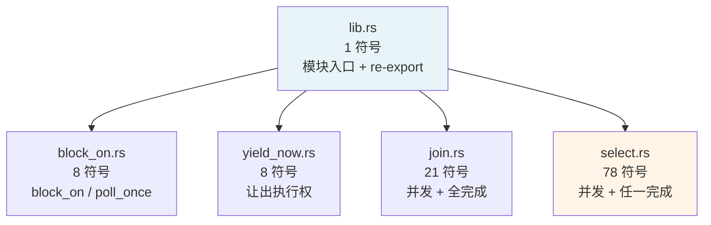

# 07 embassy-futures 异步工具

> 本文档是 M2 收官之作（M2 核心组件第 4 篇），深入 `embassy-futures` 的源码实现。
> 紧接 M1.3 / M2.1 / M2.2 / M2.3，本文聚焦 Embassy 提供的 4 个**通用组合子**。

---

## 1. 模块结构（极致精简）

`embassy-futures/src/` —— 4 个文件：



**关键观察**：
- **总代码量 < 500 行**（`block_on.rs` 45 行 + `yield_now.rs` 50 行 + `join.rs` 320 行 + `select.rs` ~500 行 + `lib.rs` 16 行 + `fmt.rs` 14 行）
- `select.rs` 最大，因为有 `select` / `select3` / `select4` 三个变体 + `Either*` 类型
- `join.rs` 中等，因为有 `Join` / `Join3` / `Join4` / `Join5` / `JoinArray` 五个变体
- `block_on` / `yield_now` 都 < 50 行，**极简实现**

---

## 2. 整体定位：轻量组合子层

### 2.1 与 std/futures/tokio 的对比

| 维度 | `std::future` | `futures-rs` | `tokio` | `embassy-futures` |
|------|---------------|--------------|---------|-------------------|
| 提供 | `Future` trait | 完整生态 | 运行时 + 工具 | **仅 4 个组合子** |
| 代码量 | 0（标准库） | ~5 万行 | ~10 万行 | < 500 行 |
| 阻塞运行 | | （需要 executor） | `block_on` | `block_on` |
| 取消 | | `tokio::select!` 宏 | `JoinHandle::abort()` | `select` 隐式 |
| 与 `executor` 关系 | 无关 | 无关 | 自带 runtime | **完全独立** |

**embassy-futures 哲学**：只做"用户级组合子"，**不提供 executor**。用户用 `embassy-executor`，但 `embassy-futures` 提供的工具对**任何** runtime 都可用（tokio / async-std / smoltcp 都能用）。

### 2.2 不依赖任何 embassy-*

```rust
# embassy-futures/Cargo.toml
[dependencies]
# (无!)
```

**与 embassy-sync 一样**：`embassy-futures` 也不依赖任何 `embassy-*` crate —— 它只是个**通用 no_std 兼容的 async 工具库**。

---

## 3. `yield_now`（M1.3 §6.3 深化）

### 3.1 完整源码（50 行）

```rust
pub fn yield_now() -> impl Future<Output = ()> {
    YieldNowFuture { yielded: false }
}

struct YieldNowFuture {
    yielded: bool,
}

impl Future for YieldNowFuture {
    type Output = ();
    fn poll(mut self: Pin<&mut Self>, cx: &mut Context<'_>) -> Poll<Self::Output> {
        if self.yielded {
            Poll::Ready(())
        } else {
            self.yielded = true;
            cx.waker().wake_by_ref();
            Poll::Pending
        }
    }
}
```

### 3.2 4 步语义

1. **第一次 poll**：`yielded = false` → 立即调 `cx.waker().wake_by_ref()`（自己 wake 自己）→ 返回 `Pending`
2. **被唤醒后再 poll**：`yielded = true` → 返回 `Ready(())`
3. **如果用 `block_on`**：第一次 poll 后立刻被空 waker 唤醒 → 第二次 poll → Ready
4. **如果用 `embassy-executor`**：第一次 poll 后 waker 唤醒自己，pender 触发，下一轮 poll → Ready

### 3.3 busy-loop 陷阱（必须警惕）

注:`yield_now` **100% 占用 CPU**（除非被其他高优先级任务抢占）：

```rust
// 反面示例
while !some_condition() {
    yield_now().await;   // 不停 yield + 立即 ready，busy-loop
}

// 正确做法
while !some_condition() {
    Timer::after(Duration::from_millis(10)).await;  // 让出 + 睡眠
}
```

### 3.4 适用场景

| 场景 | 用 yield_now？ |
|------|----------------|
| 等待一个**微秒内**可能就绪的硬件标志 | |
| 轮询 DMA 状态 | |
| 实现"自旋锁"行为 | |
| 等待**毫秒级**事件 | 用 `Timer::after` |
| 等待**秒级**事件 | 用 `Timer::after` |

---

## 4. `join`——并发 + 全部完成（`join.rs`）

### 4.1 类型与构造

```rust
pub struct Join<Fut1, Fut2> { fut1: MaybeDone<Fut1>, fut2: MaybeDone<Fut2> }
pub struct Join3<Fut1, Fut2, Fut3> { ... }
pub struct Join4<Fut1, Fut2, Fut3, Fut4> { ... }
pub struct Join5<...> { ... }
pub struct JoinArray<Fut, const N: usize> { futures: [MaybeDone<Fut>; N] }
```

**5 个变体**：`join` / `join3` / `join4` / `join5`（固定 arity）+ `join_array`（动态 N）。

### 4.2 `MaybeDone` 状态机（核心抽象）

```rust
enum MaybeDone<Fut: Future> {
    Future(Fut),                 // 未完成
    Done(Fut::Output),           // 已完成，存了结果
    Gone,                        // 已 take（防 double-take）
}
```

**3 态转换**：
- `Future → Done`：poll 返回 Ready 时
- `Done → Gone`：`take_output()` 用 `mem::replace` 转走
- 不能从 `Gone` 出去（`take_output` 在 Gone 状态 panic）

### 4.3 `poll` 实现（精妙）

```rust
impl<...> Future for Join<Fut1, Fut2> {
    type Output = (Fut1::Output, Fut2::Output);

    fn poll(self: Pin<&mut Self>, cx: &mut Context<'_>) -> Poll<Self::Output> {
        let this = unsafe { self.get_unchecked_mut() };
        let mut all_done = true;
        all_done &= unsafe { Pin::new_unchecked(&mut this.fut1) }.poll(cx);
        all_done &= unsafe { Pin::new_unchecked(&mut this.fut2) }.poll(cx);

        if all_done {
            Poll::Ready((this.fut1.take_output(), this.fut2.take_output()))
        } else {
            Poll::Pending
        }
    }
}
```

**3 个关键设计**：

1. **共享同一个 `cx.waker()`** —— 任一 future 唤醒都会重新 poll 全部
2. **`all_done &= ...`** —— AND 累积
3. **`take_output()` 转走** —— 用 `mem::replace(self, Self::Gone)` 防止 double-take

### 4.4 宏生成 5 个变体

`generate!` 宏（`join.rs:49-106`）通过 token repetition 生成 Join / Join3 / Join4 / Join5，避免写 4 遍重复代码。

### 4.5 `JoinArray`（动态 N）

```rust
pub fn join_array<Fut, const N: usize>(futures: [Fut; N]) -> JoinArray<Fut, N> {
    JoinArray { futures: futures.map(MaybeDone::Future) }
}
```

**适用**：N 在运行时才知道（但需先收集成数组）。例如 `futures::future::join_all` 的 no_std 等价物。

### 4.6 用法

```rust
let (a, b) = join(sensor.read(), network.send()).await;
//    ↑     ↑ 两个 future 并发 poll
//    a, b 是两个结果

let res = join3(read1, read2, read3).await;
//  res: (R1, R2, R3)
```

### 4.7 cancel safety

| 操作 | cancel safety |
|------|---------------|
| `join` 整体 drop | 安全（所有 future 都被 drop） |
| 任一 future 返回 `Ready` | 不影响其他 |
| `take_output` 前 drop | 注:已经在 Done 状态的结果会丢（但 future 不会被"卡死"） |

**核心保证**：join 不会"卡死"任何 future —— 所有 future 要么完成、要么被一起 drop。

### 4.8 与 std/tokio/futures 对比

| API | 来源 | 差异 |
|-----|------|------|
| `std::future::join` | （std 没有） | — |
| `futures::future::join` | `futures` crate | API 几乎一样，依赖 `futures-util` |
| `tokio::join!` | `tokio` | 宏形式（不是函数），`tokio` 专属 |
| `embassy_futures::join` | `embassy-futures` | 函数形式，无运行时依赖 |

**关键差异**：`embassy_futures::join` 是**普通函数**（不是宏），用更标准的 `Poll` 协议实现。

---

## 5. `select`——并发 + 任一完成（`select.rs`）

### 5.1 类型与构造

```rust
pub enum Either<A, B> { First(A), Second(B) }
pub enum Either3<A, B, C> { First(A), Second(B), Third(C) }
pub enum Either4<A, B, C, D> { First(A), Second(B), Third(C), Fourth(D) }

pub struct Select<A, B> { a: A, b: B }
// + Select3, Select4
```

**3 个变体**：`select` / `select3` / `select4`（最多 4 个 future）。

### 5.2 `poll` 实现（极简）

```rust
impl<A: Future, B: Future> Future for Select<A, B> {
    type Output = Either<A::Output, B::Output>;

    fn poll(self: Pin<&mut Self>, cx: &mut Context<'_>) -> Poll<Self::Output> {
        let this = unsafe { self.get_unchecked_mut() };
        let a = unsafe { Pin::new_unchecked(&mut this.a) };
        let b = unsafe { Pin::new_unchecked(&mut this.b) };
        if let Poll::Ready(x) = a.poll(cx) { return Poll::Ready(Either::First(x)); }
        if let Poll::Ready(x) = b.poll(cx) { return Poll::Ready(Either::Second(x)); }
        Poll::Pending
    }
}
```

**极简 4 步**：
1. poll a
2. 如果 a Ready → 返回 `First`
3. 否则 poll b
4. 如果 b Ready → 返回 `Second`；否则 `Pending`

**关键**：
- **顺序 poll**（先 a 后 b） —— 第一个总是"先尝试"
- **共享 `cx.waker()`** —— 任一唤醒都重新 poll
- **没有"自动清理未选中的 future"** —— `Select` 整体 drop 时才 drop

### 5.3 cancel safety（最关键概念）

**select 是不 cancel-safe 的**（相对于选中的 future 而言）：

```rust
let result = select(uart_read, timer_after(100ms)).await;
match result {
    Either::First(data) => { /* uart 拿到数据 */ }
    Either::Second(_) => { /* 超时，但 uart 还没消费！ */ }
}
```

**问题**：如果 timer 先到，select 立即返回 `Second(_)`，整个 `Select` 结构体被 drop，**`uart_read` 也被 drop**：
- 如果 uart 正在等待数据 → 它的 waker 已经在 channel 里 → 不影响硬件
- 但**未消费的数据丢失**

**cancel-safe 写法**（保留另一个 future）：

```rust
let mut uart_fut = Box::pin(uart.read(buf));   // Pin 到堆上
let mut timer_fut = Box::pin(Timer::after(100ms));
loop {
    match select(&mut uart_fut, &mut timer_fut).await {
        Either::First(Ok(n)) => { /* 处理 n 字节 */ return; }
        Either::First(Err(e)) => { /* 错误处理 */ return; }
        Either::Second(_) => { /* 超时，重试 */ continue; }
    }
}
```

**关键**：用 `&mut` 借而不是消费，select 后**两个 future 都还在**。

### 5.4 `select` 不支持的特性

| 特性 | 支持？ |
|------|--------|
| 嵌套 select | （`select(select(a, b), c)`） |
| `default` 分支（tokio 风格） | （用 `Either` 自己 match） |
| `biased` 参数（tokio 风格） | （始终按参数顺序 poll） |
| 取消另一个 future | （drop 整个 Select 才取消） |

### 5.5 与 std/tokio 对比

| API | 来源 | 关键差异 |
|-----|------|----------|
| `tokio::select!` | `tokio` | 宏；支持 `default` / `biased`；`Pin` 必须手动 |
| `futures::future::select` | `futures` | 函数；用 `Either` |
| `embassy_futures::select` | `embassy-futures` | 函数；用 `Either`；不依赖 runtime |

**embassy-futures 的 select 是最简实现** —— 不支持 biased / default / 取消其他分支，需要用户用 `&mut` 自己处理。

---

## 6. `block_on`（单线程 block 运行）

### 6.1 完整源码（45 行）

```rust
use core::ptr;
use core::future::Future;
use core::pin::Pin;
use core::task::{Context, Poll, RawWaker, RawWakerVTable, Waker};

static VTABLE: RawWakerVTable = RawWakerVTable::new(
    |_| RawWaker::new(ptr::null(), &VTABLE),
    |_| {}, |_| {}, |_| {}
);

pub fn block_on<F: Future>(mut fut: F) -> F::Output {
    let mut fut = unsafe { Pin::new_unchecked(&mut fut) };
    let raw_waker = RawWaker::new(ptr::null(), &VTABLE);
    let waker = unsafe { Waker::from_raw(raw_waker) };
    let mut cx = Context::from_waker(&waker);
    loop {
        if let Poll::Ready(res) = fut.as_mut().poll(&mut cx) {
            return res;
        }
    }
}
```

### 6.2 4 步语义

1. 创建**空 waker**（`data = null`），所有 4 个 vtable 函数都是 no-op
2. loop：调用 `poll`
3. 如果 `Ready` → 返回结果
4. 如果 `Pending` → 继续 loop（**waker 不会被调用**，因为没人 wake）

**关键事实**：
- **100% CPU**（busy-loop）
- **不阻塞**：依赖 future 内部用某种等待（如 `Timer::after` 用 `embassy-time-driver`，driver 在 loop 中被检查？**不对** —— 实际上 block_on **不与 time driver 集成**，所以 `Timer::after` 会**永远 Pending**）

**反直觉警告**：
```rust
// 这不会工作
block_on(async {
    Timer::after(Duration::from_secs(1)).await;   // 永远 Pending！
    println!("after 1 sec");
});
// ↑ 实际上永远不会打印
```

**block_on 适用**：
- future 内部**不依赖外部事件**（只用 `yield_now` / 同步计算）
- **测试** `embassy-time` 提供的 `MockDriver`（在测试线程手动 `advance()`）
- **配合 `join` 跑多个"主动完成"的 future**

### 6.3 `poll_once` 辅助

```rust
pub fn poll_once<F: Future>(mut fut: F) -> Poll<F::Output> {
    // ... poll 一次
    fut.as_mut().poll(&mut cx)
}
```

**用途**：
- 手动驱动 future
- 测试 / 调试

### 6.4 与 `tokio::main` 对比

| 维度 | `tokio::main` | `embassy_futures::block_on` |
|------|----------------|------------------------------|
| 阻塞类型 | 内部 sleep 等待 | **busy-loop** |
| 任务调度 | tokio runtime | 没有（单 future） |
| 时间 | 内置 IO/timer | 依赖 future 自己 |
| 多 future | 内部 | （用 join 包） |
| 多线程 | | （单线程） |

**结论**：`embassy_futures::block_on` 只适合**测试**和**简单 demo**，不适合生产。

---

## 7. 组合子组合（实战模式）

### 7.1 `join` 嵌套 `select`

```rust
// 等两个外设都读完成，但每个读都有超时
let (sensor_data, network_status) = join(
    select(sensor_a.read(), Timer::after(100ms)),     // sensor_a 或 100ms 超时
    select(sensor_b.read(), Timer::after(200ms)),     // sensor_b 或 200ms 超时
).await;
// sensor_data: Either<SensorDataA, ()>
// network_status: Either<SensorDataB, ()>
```

### 7.2 `select` 嵌套 `timeout`

```rust
// wait_for_event 但带总超时
let result = select(
    wait_for_event(),
    Timer::after(Duration::from_secs(5)),
).await;

match result {
    Either::First(event) => handle(event),
    Either::Second(_) => handle_timeout(),
}
```

### 7.3 `join_array` + 动态数量

```rust
// 等所有传感器读完成
let sensors: [SensorFut; 4] = [read_s0(), read_s1(), read_s2(), read_s3()];
let readings: [Reading; 4] = join_array(sensors).await;
```

### 7.4 `yield_now` + 轮询

```rust
async fn wait_for_flag(flag: &AtomicBool) {
    while !flag.load(Ordering::Relaxed) {
        yield_now().await;
    }
}
```

### 7.5 完整异步函数链

```rust
async fn complex_workflow() -> Result<(), Error> {
    let boot = wait_for_boot_done().await?;
    let sensor_data = select(
        read_all_sensors(),
        Timer::after(MAX_INIT_TIME)
    ).await;
    let processed = match sensor_data {
        Either::First(data) => process(data)?,
        Either::Second(_) => return Err(Error::Timeout),
    };
    Ok(())
}
```

---

## 8. cancel safety 深入

### 8.1 定义

**cancel-safe**：drop 一个 future（"取消"它）后，原 future 状态机**不会留下不可恢复的副作用**。

### 8.2 `embassy-futures` 各组合子的 cancel safety

| 组合子 | cancel safety |
|--------|---------------|
| `yield_now` | 完全 |
| `join` | 整体 drop 安全 |
| `select` | 注:未选中的 future 会被 drop（可能丢数据） |
| `block_on` | 不可 drop（必须完成） |

### 8.3 实战判断清单

问自己：被取消的 future 在**已注册 waker 但未完成**时，**留下了什么状态**？

| 状态 | 取消后 | 严重度 |
|------|--------|--------|
| 没有任何 waker | 一切 OK | 无 |
| 在 channel/queue 里注册了 waker | 注册项需要清理 | 中 |
| 持有独占资源（DMA buffer 等） | 资源需要释放 | 中 |
| 已发送但未确认的请求 | 状态不一致 | **高** |
| 触发了一次硬件操作 | 硬件可能半完成 | **高** |

### 8.4 embassy-futures 的处理策略

**文档化的 cancel safety 注释**（在 yield_now 中）：
> "This can be used to easily and quickly implement simple async primitives without using wakers."

**select 文档**：
> "When one of them completes, it will complete with its result value. The other future is dropped."

**不主动管理 cancel** —— 依赖 future 自己的 `Drop` 实现正确清理。

---

## 9. 与 std/tokio/futures 对比

| 维度 | `embassy-futures` | `futures` | `tokio` |
|------|-------------------|-----------|---------|
| 代码量 | < 500 行 | ~5 万行 | ~10 万行 |
| `join` | 函数 + 5 变体 | 函数 + 5 变体 | 宏 `join!` |
| `select` | 函数 + 3 变体 | 函数 + `Either` | 宏 `select!` + `default` + `biased` |
| `block_on` | （busy-loop） | | （runtime） |
| `yield_now` | | | |
| 依赖 | 0 | `futures-util` 等 | `tokio` runtime |
| `no_std` | | 部分 | |
| 用于 Embassy | | | （不能） |

**embassy-futures 的独特定位**：
- **no_std 友好** —— 任何嵌入式项目可用
- **无运行时依赖** —— 不强迫用户用 embassy-executor
- **API 极简** —— 4 个组合子就够
- **没有"高级语法"** —— 没有 `select!` 宏，没有 `biased`，需要用户用 `&mut` 自己组合

---

## 10. 关键设计决策回顾

| 决策 | 原因 | 代价 |
|------|------|------|
| 4 个组合子就够 | 极简 API | 没有 biased / default / abort |
| 用函数而非宏 | 编译期可推导类型 | 比宏更冗长 |
| `MaybeDone` 3 态枚举 | 内部状态清晰 | 比直接 `Option` 多一态 |
| `Join` / `Join3` / `Join4` / `Join5` 分别实现 | 性能（不浪费字段） | API 表面大 |
| `select` 用 `Either<L, R>` | 类型安全 | 需要 match |
| `block_on` 用 busy-loop | 不依赖时间 driver | 100% CPU |
| 不做 cancel safety 自动管理 | 简洁 | 用户需自己处理 |
| 不依赖任何 embassy-* | 库通用 | 不能用 embassy 特有功能 |

---

## 11. 推荐源码阅读顺序

```
1. lib.rs (16 行)                    → 模块入口
2. block_on.rs (45 行)               → block_on + poll_once
3. yield_now.rs (50 行)              → 49 行核心
4. join.rs (320 行)                  → MaybeDone + generate! 宏
5. select.rs (~500 行)               → Select + Either
6. embassy-time/src/timer.rs (with_timeout 段) → 实战用法
7. examples/std/ 或 examples/nrf/    → 真实组合
```

按这个顺序读，~1000 行能掌握全部 embassy-futures。

---

## 12. M2 收官总结

M2（核心组件深入）4 篇全部完成：

```
M2.1 04-executor.md (585 行)  → 任务调度、状态机、平台差异
M2.2 05-time.md     (690 行)  → Timer、Driver、queue、HAL 注入
M2.3 06-sync.md     (729 行)  → 5 类原语 + RawMutex 抽象
M2.4 07-futures.md  (本文)    → 4 个组合子
```

**M2 核心技能**：理解 Embassy 怎么把 async/await + Future 变成可用的**完整运行时**。

**进入 M3** 的视角：怎么把运行时的能力**映射到具体硬件**（HAL）。

---

## 13. 参考

- **本仓库**：
  - `docs/03-async-fundamentals.md` §6.3 — yield_now 详解
  - `docs/04-executor.md` · `docs/05-time.md` · `docs/06-sync.md`
  - `docs/08-hal-architecture.md`（M3.1）—— 紧接 M2 收官
- **官方**：
  - [embassy-rs/embassy/tree/main/embassy-futures](https://github.com/embassy-rs/embassy/tree/main/embassy-futures) — 源码
  - [docs.embassy.dev/embassy-futures](https://docs.embassy.dev/embassy_futures/) — API 文档
- **对照参考**：
  - [futures-rs](https://github.com/rust-lang/futures-rs) — 完整 future 生态
  - [tokio::select! 宏文档](https://docs.rs/tokio/latest/tokio/macro.select.html) — 更高级的 select 形态
