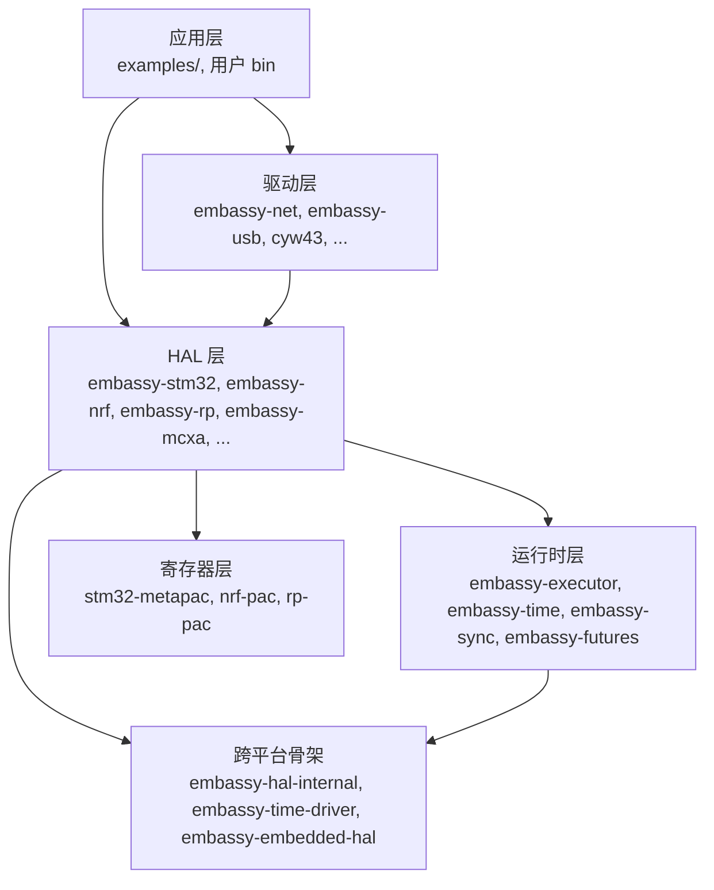
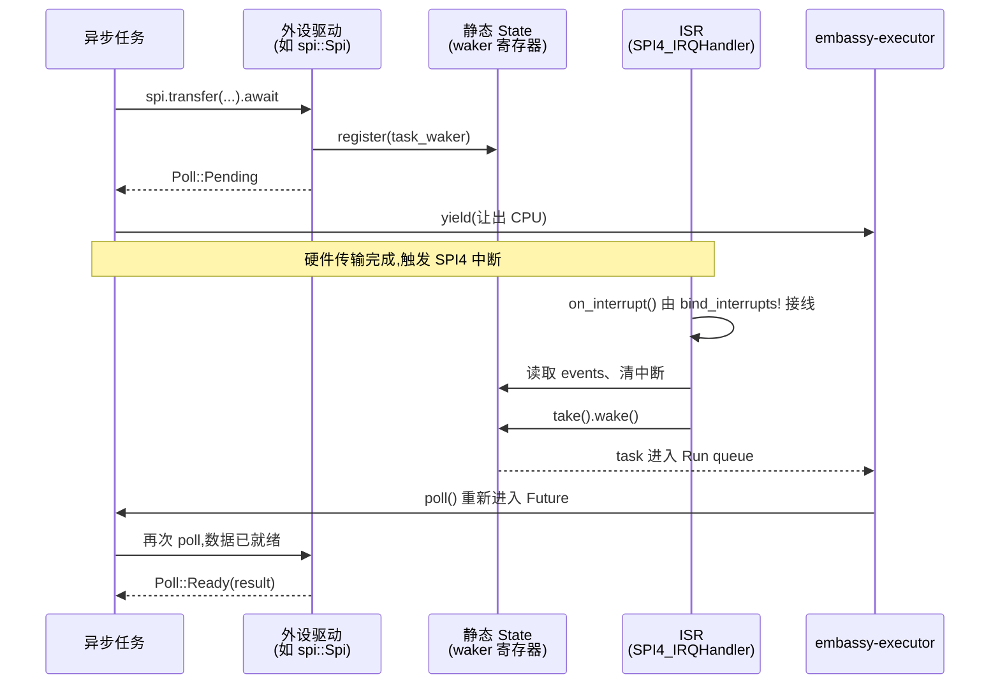
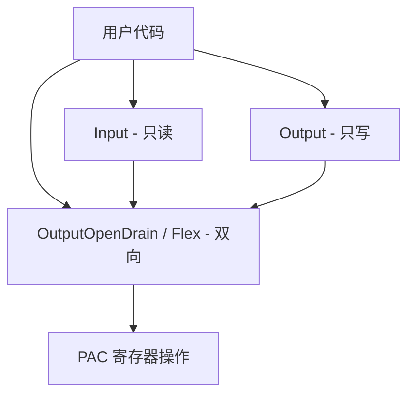

# 08 HAL 层架构

> 撰写:2026-06-05
> 前置:docs/01-overview · docs/02-architecture · docs/03-async-fundamentals
> 后续:docs/09-stm32 · docs/10-nrf · docs/11-rp(本篇为 3 平台篇定调)

---

## 目录

1. 引言:HAL 在 Embassy 中的位置
2. 三层模型:PAC / HAL / 应用,Embassy 的边界划分
3. embedded-hal trait 生态(blocking/async 双轨,4 套 crate 共存)
4. embassy-hal-internal:跨平台复用骨架
5. 中断模型:HAL 如何把硬件中断桥接到 async waker
6. 时间抽象:`Driver` trait + `time-driver-*` feature 机制
7. 外设抽象的统一模式(以 GPIO 串讲一遍)
8. 跨平台对比矩阵入口(指向 M3.2~3.4)
9. 总结 + 阅读 M3.2~3.4 的导览

---

## 1. 引言:HAL 在 Embassy 中的位置

回顾 M1.2(`02-architecture.md`)的依赖拓扑,Embassy 工作空间约 40+ crate,大致分四层:



**HAL 层是 Embassy 整个体系的硬件接入面**:向上为应用/驱动提供"异步友好的外设抽象",向下封装芯片厂商提供的寄存器细节,横向与执行器、时间驱动、同步原语协作。

M3 系列(本篇 + M3.2/3.3/3.4)关注两个问题:

- **抽象问题**:不同芯片家族(Cortex-M、RISC-V)、不同厂商(ST、Nordic、Raspberry Pi)、不同外设(GPIO、UART、SPI、I2C、DMA、ADC...)的差异如何被收敛到统一的异步 API?
- **复用问题**:几十款芯片、几百种外设组合,是怎么用一份"跨平台骨架 + 平台特化"做到既统一又灵活的?

本篇定调架构,M3.2~3.4 按 ADR-004(`openspec/specs/architecture/spec.md`)定义的 7 节模板分别讲 stm32 / nrf / rp 三个平台。

---

## 2. 三层模型:PAC / HAL / 应用

### 2.1 三层的职责

Rust 嵌入式生态约定俗成的分层,从硬件向上依次:

| 层 | 角色 | 本项目代表 |
|----|------|------------|
| **PAC**(Peripheral Access Crate)| 寄存器位段映射,最薄抽象,几乎只是 `pub struct Reg { bits: u32 }` + setter/getter | `stm32-metapac`(由 [stm32-data](https://github.com/embassy-rs/stm32-data) 元数据生成)、`nrf-pac`、`rp-pac` |
| **HAL**(Hardware Abstraction Layer)| 外设抽象,封装"打开 SPI"、"读 ADC"等操作,封装中断、DMA、时钟等基础设施 | `embassy-stm32`、`embassy-nrf`、`embassy-rp`、`embassy-mcxa`、`embassy-mspm0`、`embassy-imxrt`、`embassy-microchip` |
| **应用**(Application)| 业务逻辑,使用 HAL 提供的外设抽象 | `examples/{platform}/`、用户工程 |

> **术语**(ADR-004 统一定义):**PAC** = 寄存器层 crate,**HAL** = 平台 crate(本项目指 `embassy-{platform}`)。下文不再赘述。

### 2.2 Embassy 的边界划分

Embassy HAL 与传统 HAL(如 `stm32-hal`、`nrf-hal`)的本质差异有三点:

**第一,所有阻塞型外设操作都提供 `async` 版本**。例如 `Uart::read(&mut buf).await` 在数据未到时 yield,执行器调度其它任务,数据到达后中断 → waker → 任务恢复。

**第二,共享 `embassy-hal-internal` 跨平台骨架**。Peri、中断 typelevel 三件套(`Interrupt` / `Handler` / `Binding`)、`OnDrop` 等公共抽象由这个 crate 统一提供,避免每个平台 HAL 重新发明轮子。

**第三,平台 HAL 自行实现 `embassy-time-driver` 的 `Driver` trait** 并通过链接器替换全局唯一实例(详见第 6 节),使 `embassy_time::Instant::now()` 在任意平台都能正常返回 64-bit 单调时间戳。

### 2.3 谁能跨平台,谁不能

| 跨平台度 | 代表 | 备注 |
|----------|------|------|
| **完全跨平台** | 应用业务逻辑、`embassy-net`、`embassy-usb`、`embassy-sync` | 只依赖 `embedded-hal*` trait 或 `Driver` trait,理论上换芯片只换 HAL crate |
| **部分跨平台** | 设备驱动(如 BME280 传感器)| 通常依赖 `embedded-hal-async::i2c::I2c` trait,实现一处即可在多平台用 |
| **平台特定** | 平台 HAL 本身、PAC 调用、芯片专属外设(如 STM32 的 BDMA、nRF 的 EasyDMA、RP 的 PIO) | 这是无法回避的硬件差异,M3.2~3.4 各自展开 |

---

## 3. `embedded-hal` trait 生态(blocking/async 双轨)

### 3.1 为什么不是一套就够

Embassy 平台 HAL 同时依赖 **4 套 `embedded-hal` 系列 crate**(见 `embassy-stm32/Cargo.toml`、`embassy-nrf/Cargo.toml`、`embassy-rp/Cargo.toml`):

```toml
# 摘自 embassy-stm32/Cargo.toml
embedded-hal-02    = { package = "embedded-hal", version = "0.2.6", features = ["unproven"] }
embedded-hal-1     = { package = "embedded-hal", version = "1.0" }
embedded-hal-async = { version = "1.0" }
embedded-hal-nb    = { version = "1.0" }
```

每套 crate 在不同历史阶段被引入,目的也不同:

| crate | 角色 | 何时用 |
|-------|------|--------|
| `embedded-hal` 0.2 | 早期阻塞 trait(`OutputPin::set_high`、`I2c::write` 等)| 兼容大量历史驱动(BME280、SSD1306 等社区驱动早期都基于 0.2)|
| `embedded-hal` 1.0 | 重设计的稳定 1.0 阻塞 trait | 现代驱动首选 |
| `embedded-hal-async` 1.0 | 异步 trait(`I2c::write(...).await`)| Embassy 应用首选,体现 async/await 优势 |
| `embedded-hal-nb` 1.0 | `nb`(non-blocking)风格 trait | 兼容 `nb` 风格的驱动 |

> **注**:`embassy-nrf` 不依赖 `embedded-hal-nb`(见 ADR-004 矩阵)。3 平台中只有 stm32 和 rp 同时支持 4 套,nrf 支持 3 套。原因是 nRF 历史上 `nb` 风格使用较少。

### 3.2 一个外设同时实现多套 trait

平台 HAL 的策略是:**对同一个外设结构体同时 impl 多套 trait**,让用户按需选用。以 STM32 SPI 为例(简化示意):

```rust
pub struct Spi<'d, T: Instance, M: PeriMode> { /* ... */ }

// 实现 0.2 阻塞 trait
impl<'d, T: Instance> embedded_hal_02::blocking::spi::Transfer<u8>
    for Spi<'d, T, Blocking> { /* ... */ }

// 实现 1.0 阻塞 trait
impl<'d, T: Instance> embedded_hal_1::spi::SpiBus for Spi<'d, T, Blocking> { /* ... */ }

// 实现 1.0 异步 trait
impl<'d, T: Instance> embedded_hal_async::spi::SpiBus
    for Spi<'d, T, Async> { /* ... */ }
```

`PeriMode` 是类型参数(`Blocking` 或 `Async`),决定该实例是否绑定了 DMA,从而决定能不能用 `async` trait。

### 3.3 `embassy-embedded-hal`:Embassy 自有的跨平台辅助 crate

除了上述四套外部 trait,Embassy 还有一个**自有的辅助 crate** `embassy-embedded-hal`,源码 `embassy-embedded-hal/src/lib.rs:1-40`:

```rust
pub mod adapter;     // 同步 ↔ 异步适配器
pub mod flash;       // Flash 分区、拼接、内存测试
pub mod shared_bus;  // I2C/SPI 总线共享(多个设备共一条总线)

pub trait SetConfig {
    type Config;
    type ConfigError;
    fn set_config(&mut self, config: &Self::Config) -> Result<(), Self::ConfigError>;
}

pub trait GetConfig {
    type Config;
    fn get_config(&self) -> Self::Config;
}
```

**三个子模块的用途**:

| 子模块 | 解决什么问题 | 典型场景 |
|--------|--------------|----------|
| `adapter` | 异步 ↔ 阻塞互转(`blocking_async`、`yielding_async`)| 在异步驱动中复用阻塞算法,或反之 |
| `flash` | Flash 分区(`partition`)、拼接(`concat_flash`)、内存模拟(`mem_flash`)| OTA 升级、双 bank 切换、单元测试 |
| `shared_bus` | 一条 I2C/SPI 总线挂多个设备 | 多 SPI 设备共享一条物理总线,运行时切换 CS |

`SetConfig` / `GetConfig` 两个 trait 让 `shared_bus` 能在切换设备时同时切换通信参数(波特率、SPI 模式等),典型用法见 `embassy-embedded-hal/src/shared_bus/asynch/spi.rs`(`SpiDeviceWithConfig`)。

---

## 4. `embassy-hal-internal`:跨平台复用骨架

### 4.1 公开 API 表面极小

打开 `embassy-hal-internal/src/lib.rs`(只有 21 行):

```rust
// 摘自 embassy-hal-internal/src/lib.rs:8-20
pub(crate) mod fmt;

#[cfg(feature = "aligned")]
pub mod aligned;
pub mod atomic_ring_buffer;
pub mod drop;
mod macros;
mod peripheral;
pub mod ratio;
pub use peripheral::{Peri, PeripheralType};

#[cfg(feature = "cortex-m")]
pub mod interrupt;
```

**公开的全部表面**:

| 名称 | 类型 | 来源 | 用途 |
|------|------|------|------|
| `Peri` | struct | `peripheral.rs:17` | 跨平台外设引用 |
| `PeripheralType` | trait | `peripheral.rs:107` | 外设类型标记 |
| `aligned` | mod | `aligned.rs`(可选 feature)| 对齐缓冲区(STM32 DMA 需要)|
| `atomic_ring_buffer` | mod | `atomic_ring_buffer.rs` | 无锁单读单写环形缓冲(UART 缓冲常用)|
| `drop` | mod | `drop.rs` | `OnDrop` RAII guard |
| `ratio` | mod | `ratio.rs` | 编译期分数运算(时钟分频用)|
| `interrupt` | mod | `interrupt.rs`(条件编译 `cortex-m`)| 中断 trait 与宏 |

**私有的**:`fmt`(defmt/println 兼容封装)、`macros`(平台 HAL 用的宏)、`peripheral`(`Peri`/`PeripheralType` 内部,只通过 pub use 暴露)。

### 4.2 `Peri<'a, T>`:零成本的"借用式外设引用"

`Peri` 是这个 crate 最有讲究的设计,看完整源码(`embassy-hal-internal/src/peripheral.rs:17-20`):

```rust
pub struct Peri<'a, T: PeripheralType> {
    inner: T,
    _lifetime: PhantomData<&'a mut T>,
}
```

**关键看注释**(原文 `peripheral.rs:4-16`):

> 这在功能上等同于 `&'a mut T`,有专门 struct 而非用引用的两个理由:
>
> - **空间效率**:外设单例通常是零大小(`PA9`、`SPI4`)或 1 字节(`AnyPin`),而 `&mut T` 在 32 位目标上恒为 4 字节。`Peri` 直接存 `T` 的拷贝,大小与 `T` 相同。
> - **代码体积**:如果驱动同时支持 `SPI4` 和 `&mut SPI4` 两种参数,会单态化两次。用 `Peri`,驱动只对生命周期泛型化,`SPI4` 变成 `Peri<'static, SPI4>`、`&mut SPI4` 变成 `Peri<'a, SPI4>`,生命周期不导致单态化。

简言之:**Peri 把"借用语义"用 PhantomData 表达,但不实际持有引用,所以零开销;同时把 ownership 也包进来,可以转移,可以 reborrow**。

核心方法(同文件 22-76 行):

```rust
impl<'a, T: PeripheralType> Peri<'a, T> {
    // HAL 内部用:把裸外设包装进 Peri
    pub const unsafe fn new_unchecked(inner: T) -> Self;

    // 借用一个"子 Peri",生命周期借给子,父在子 drop 前不可用
    // 这相当于 &mut 的 reborrow,但保持 Peri 类型
    pub const fn reborrow(&mut self) -> Peri<'_, T>;

    // 把 Peri<T> 转成 Peri<U>,比如 Peri<PB11> -> Peri<AnyPin>
    pub fn into<U>(self) -> Peri<'a, U> where T: Into<U>, U: PeripheralType;
}
```

`PeripheralType` 是 marker trait,定义极简(`peripheral.rs:106-107`):

```rust
pub trait PeripheralType: Copy + Sized {}
```

`Copy + Sized` 两个约束保证:
- `Copy`:外设句柄拷贝廉价(因为通常是 ZST)
- `Sized`:能放进 `Peri` 的 inner 字段(避免 DST)

### 4.3 谁是 `PeripheralType`?

每个平台 HAL 用宏批量生成。以 STM32 为例,执行 `cargo expand` 后能看到形如:

```rust
// 每个外设单例都是 ZST + impl PeripheralType
pub struct SPI4 { _private: () }
impl PeripheralType for SPI4 {}

pub struct PA9 { _private: () }
impl PeripheralType for PA9 {}

// AnyPin 是 type-erased,1 字节
pub struct AnyPin { pin_port: u8 }
impl PeripheralType for AnyPin {}
```

这样从应用代码看,`p.SPI4` 是一个 `Peri<'static, SPI4>`,大小 0;`p.PA9.into()` 得到 `Peri<'static, AnyPin>`,大小 1。

### 4.4 其它公共组件

**`OnDrop`**(`drop.rs:7`)是经典 RAII guard:接受一个闭包,drop 时执行;可以 `defuse()` 拆掉(让闭包不执行)。在 HAL 里用于"出错时回退已经做的硬件配置":

```rust
let guard = OnDrop::new(|| { /* 恢复时钟、关中断、释放 DMA */ });
risky_init_step()?;   // 出错走 ? 时,guard drop,自动回退
guard.defuse();       // 成功后拆掉 guard,不回退
```

`atomic_ring_buffer`(`atomic_ring_buffer.rs`,48 个符号)是无锁单读单写(SPSC)环形缓冲,UART/SPI 的 buffered 模式典型使用 — 中断侧写入、任务侧读取,无需锁。

`ratio`(`ratio.rs`)是编译期分数运算,用于时钟分频比的精确表达(如 `Hz(168_000_000) / Ratio::new(3, 2) = Hz(112_000_000)`)。

---

## 5. 中断模型:HAL 如何把硬件中断桥接到 async waker

这是 Embassy 整套架构最巧妙的地方之一,也是 M3 系列里最值得仔细看的细节。问题是:**硬件中断在 ISR(Interrupt Service Routine)上下文执行,而异步任务是 cooperative scheduled 的 Future,如何把"中断到了"这个事件通知到正在 `await` 数据的任务?**

答案是 **`embassy-hal-internal::interrupt::typelevel` 三件套** + 各平台 HAL 自行 expose 的 `bind_interrupts!` 宏。

### 5.1 三件套:`Interrupt` / `Handler` / `Binding`

源码 `embassy-hal-internal/src/interrupt.rs` 通过 `interrupt_mod!` 宏(`interrupt.rs:11-144`)在各平台 `crate::interrupt::typelevel` 命名空间下生成三个核心 trait:

```rust
// 来自 interrupt.rs:38-99(由宏展开)
pub trait Interrupt: SealedInterrupt {
    const IRQ: super::Interrupt;             // 枚举常量,1 类型对应 1 中断
    unsafe fn enable() { Self::IRQ.enable() }
    fn disable() { Self::IRQ.disable() }
    fn is_pending() -> bool { Self::IRQ.is_pending() }
    fn pend() { Self::IRQ.pend() }
    fn unpend() { Self::IRQ.unpend() }
    // ... priority setter/getter
}

// 来自 interrupt.rs:117-127
pub trait Handler<I: Interrupt> {
    unsafe fn on_interrupt();
}

// 来自 interrupt.rs:140
pub unsafe trait Binding<I: Interrupt, H: Handler<I>>: Copy {}
```

**这三者各自的角色**:

| trait | 角色 | 谁实现 |
|-------|------|--------|
| `Interrupt` | 类型级中断标识(1 类型/中断,如 `pub enum SPI4 {}`)| 平台 HAL 用 `interrupt_mod!` 宏批量生成 |
| `Handler<I>` | 中断处理逻辑接口(`on_interrupt()` 函数)| 外设驱动(SPI/UART 等)实现,函数体中"唤醒等待中的 waker" |
| `Binding<I, H>` | **编译期断言**"`I` 这个中断已被 `H` 这个 handler 接管" | **用户**通过 `bind_interrupts!` 宏生成 |

关键设计:`Binding` 是 `unsafe trait`,声明它就是承诺"我已经在某个 ISR 函数里调用了 `H::on_interrupt()`",这是 Embassy 用类型系统强制用户做正确接线的手段。

### 5.2 用户视角:`bind_interrupts!` 宏

应用层把所有中断接线在一个宏调用里:

```rust
use embassy_stm32::{bind_interrupts, peripherals, spi};

bind_interrupts!(struct Irqs {
    SPI4 => spi::InterruptHandler<peripherals::SPI4>;
    USART1 => usart::InterruptHandler<peripherals::USART1>;
});
```

展开后大致等价于:

```rust
struct Irqs;
impl Clone for Irqs { /* ... */ }
impl Copy for Irqs {}

unsafe impl Binding<typelevel::SPI4, spi::InterruptHandler<SPI4>> for Irqs {}
unsafe impl Binding<typelevel::USART1, usart::InterruptHandler<USART1>> for Irqs {}

#[unsafe(no_mangle)]  // 让链接器把它放到 NVIC 表
extern "C" fn SPI4() {
    unsafe { <spi::InterruptHandler<SPI4>>::on_interrupt() }
}

#[unsafe(no_mangle)]
extern "C" fn USART1() {
    unsafe { <usart::InterruptHandler<USART1>>::on_interrupt() }
}
```

外设构造函数签名通常长这样:

```rust
// 摘自 embassy-nrf/src/saadc.rs:148-154
pub fn new(
    saadc: Peri<'d, peripherals::SAADC>,
    _irq: impl interrupt::typelevel::Binding<interrupt::typelevel::SAADC, InterruptHandler> + 'd,
    config: Config,
    channel_configs: [ChannelConfig; N],
) -> Self
```

`_irq` 参数是一个**编译期 token**,要求传入实现了 `Binding<SAADC, InterruptHandler>` 的类型。用户必须传 `Irqs` 才能编译通过。**如果用户忘了在 `bind_interrupts!` 里列出 SAADC,代码根本编译不过** — 这正是 typelevel 三件套要的效果。

### 5.3 ISR → waker → async 任务的完整链路



**关键点**:
- `State` 是 `static`,生命周期独立于驱动实例(典型实现:`AtomicWaker` 或 `embassy_sync::waitqueue::AtomicWaker`)
- ISR 不直接调用任务代码,只通过 wake() 把任务推回执行器队列(详见 `docs/04-executor.md` 主循环)
- 这种"中断只 wake、不工作"的模式让 ISR 极短,符合实时系统设计

### 5.4 `InterruptExt`:运行时操作中断的 trait

除了 `typelevel`,还有一个 `InterruptExt` trait(`interrupt.rs:148-200+`)针对运行时拿到的 `Interrupt` 枚举值:

```rust
// 摘自 interrupt.rs:148
pub unsafe trait InterruptExt: InterruptNumber + Copy {
    unsafe fn enable(self) { /* NVIC::unmask(self) */ }
    fn disable(self) { /* NVIC::mask(self) */ }
    fn is_pending(self) -> bool { /* ... */ }
    fn pend(self) { /* ... */ }
    fn unpend(self) { /* ... */ }
    fn get_priority(self) -> Priority { /* ... */ }
    fn set_priority(self, prio: Priority) { /* ... */ }
}
```

`typelevel::Interrupt` 是"编译期类型",`InterruptExt` 是"运行时值"。两者本质一样,只是表达层次不同。典型应用代码用 `typelevel::Interrupt::pend()`,底层操作 NVIC 的代码用 `InterruptExt`。

---

## 6. 时间抽象:`Driver` trait + `time-driver-*` feature

回顾 M2.2(`05-time.md`)讲过的 `embassy-time` 用户 API(`Timer`、`Instant`、`Duration`),但当时跳过了"具体怎么知道现在几点"。答案在 `embassy-time-driver`。

### 6.1 `Driver` trait 极简

源码 `embassy-time-driver/src/lib.rs:118-139`:

```rust
pub trait Driver: Send + Sync + 'static {
    /// 返回当前时间戳,单位 tick。
    /// 实现 MUST 满足:
    /// - 单调(永不回退)
    /// - 几乎不溢出(10000 年级别)
    /// - 不 fault(即使硬件未初始化也安全返回)
    fn now(&self) -> u64;

    /// 安排 waker 在 `at` 时刻被唤醒。
    /// 若 `at` 已过去,可能立即唤醒。
    fn schedule_wake(&self, at: u64, waker: &Waker);
}
```

**两个方法,就这些**。整个时间生态(`Timer::after`、`Instant::now`、`Ticker`)都建立在这两个方法之上。

### 6.2 链接器替换实现(不走 trait + generic)

这里是又一个巧妙设计。看完整链接机制(同文件 87-103、141-156):

```rust
unsafe extern "Rust" {
    fn _embassy_time_now() -> u64;
    fn _embassy_time_schedule_wake(at: u64, waker: &Waker);
}

#[inline]
pub fn now() -> u64 {
    unsafe { _embassy_time_now() }
}

#[inline]
pub fn schedule_wake(at: u64, waker: &Waker) {
    unsafe { _embassy_time_schedule_wake(at, waker) }
}
```

**机制**:`embassy-time` 通过 `extern "Rust" fn` 调用这两个符号,符号由驱动 crate 用 `time_driver_impl!` 宏定义:

```rust
// 摘自 embassy-time-driver/src/lib.rs:161-178
#[macro_export]
macro_rules! time_driver_impl {
    (static $name:ident: $t: ty = $val:expr) => {
        static $name: $t = $val;

        #[unsafe(no_mangle)]
        #[inline]
        fn _embassy_time_now() -> u64 {
            <$t as $crate::Driver>::now(&$name)
        }

        #[unsafe(no_mangle)]
        #[inline]
        fn _embassy_time_schedule_wake(at: u64, waker: &core::task::Waker) {
            <$t as $crate::Driver>::schedule_wake(&$name, at, waker);
        }
    };
}
```

**为什么用链接器替换而不是 trait + generic**?原文 lib.rs 上方注释给了三个理由:

> - **可达性**:时间驱动在任何地方都可用,不必通过泛型参数往下传(对库尤其重要 — 想想 `embassy-net` 要在所有 HAL 上跑)
> - **`Instant` 可比性**:多个 driver 同时存在会导致 `Instant::A < Instant::B` 等比较失去意义
> - **链接错误检测**:如果项目里没有 driver 或有多个 driver,**链接阶段就报错**(0 个 = unresolved symbol,>1 个 = duplicate symbol)

这是用链接器机制做"全局唯一性"约束,代价是 trait 调用走 `extern "Rust"`(略损失内联机会,但实测开销可忽略 — 函数体短,LTO 能优化)。

### 6.3 谁实现 `Driver`?

每个平台 HAL 自带 1~N 个 `Driver` 实现,用 cargo feature 切换。以 STM32 为例(部分):

| feature | 实现位置 | 用什么定时器 |
|---------|----------|--------------|
| `time-driver-any` | `embassy-stm32/src/time_driver/` | 编译时自动挑一个空闲的 |
| `time-driver-tim1` | 同上 | 用 TIM1 |
| `time-driver-tim2` | 同上 | 用 TIM2 |
| `time-driver-tim4` | 同上 | 用 TIM4 |
| ... | | |
| `time-driver-rtc` | `embassy-stm32/src/rtc/` | 用 RTC(适合低功耗) |

nRF 平台用 RTC(`embassy-nrf/src/time_driver.rs`),RP 用 timer(`embassy-rp/src/time_driver.rs`)。每个平台的具体选择和 overflow 处理策略详见 M3.2~3.4。

### 6.4 `Driver::schedule_wake` 怎么和 `embassy-time-queue-utils` 配合

`schedule_wake(at, waker)` 一次只注册一个 waker,但实际场景常常有上百个 `Timer::after(...)` 同时在等。driver 通常**只持有一个硬件 compare-match alarm**,所以需要一个"软件时间队列"来排队所有 pending 的 waker,只把最近一个写到硬件 alarm。

`embassy-time-queue-utils` 提供这个队列(`Queue::schedule_wake`/`next_expiration`)。驱动的 `schedule_wake` 典型实现见 `embassy-time-driver/src/lib.rs:52-85` 注释里的示例。

具体到 12 步 wake 链(从 `Timer::after` 到任务恢复),M2.2(`05-time.md` §9)已经讲过,这里不重复。

---

## 7. 外设抽象的统一模式(以 GPIO 串讲)

GPIO 是所有 MCU 都有的最基础外设,看 3 平台怎么把它抽象成几乎一致的 API 是理解 Embassy HAL 风格的最佳切入点。

### 7.1 三平台 API 对比

**STM32**(`embassy-stm32/src/gpio.rs:328-369`):

```rust
pub struct Input<'d> {
    pub(crate) pin: Flex<'d>,
}

impl<'d> Input<'d> {
    pub fn new(pin: Peri<'d, impl Pin>, pull: Pull) -> Self {
        let mut pin = Flex::new(pin);
        pin.set_as_input(pull);
        Self { pin }
    }

    pub fn is_high(&self) -> bool { self.pin.is_high() }
    pub fn is_low(&self) -> bool { self.pin.is_low() }
    pub fn get_level(&self) -> Level { self.pin.get_level() }
}
```

**nRF**(`embassy-nrf/src/gpio.rs:44-76`):

```rust
pub struct Input<'d> {
    pub(crate) pin: Flex<'d>,
}

impl<'d> Input<'d> {
    pub fn new(pin: Peri<'d, impl Pin>, pull: Pull) -> Self {
        let mut pin = Flex::new(pin);
        pin.set_as_input(pull);
        Self { pin }
    }

    pub fn is_high(&self) -> bool { self.pin.is_high() }
    pub fn is_low(&self) -> bool { self.pin.is_low() }
    pub fn get_level(&self) -> Level { self.pin.get_level() }
}
```

**rp**(`embassy-rp/src/gpio.rs`,类似结构,签名一致)。

**用肉眼对比就能看到**:三平台 GPIO `Input` 完全一致 — 同样的 struct 名、同样的 `new` 签名、同样的方法。`Pull`、`Level` 两个 enum 也都是 `{ Up, Down, None }` / `{ Low, High }` 同样的形状。

**这种一致性怎么做到的**?不是从 `embassy-hal-internal` 来的(它不提供 GPIO 抽象,只提供 `Peri`),而是 Embassy 三平台 HAL 在**约定俗成**地保持 API 形状一致。这种"软约定"在 ADR-004 里被升级为"M3 系列文档统一术语",从而向用户暴露统一心智模型。

### 7.2 内部:`Flex` 是底层,`Input`/`Output` 是 type-safe wrapper

三平台都遵循同一个内部分层:



- **`Flex`**:双向 GPIO,API 最全(set_as_input / set_as_output / 双向读写),通过 `Drop` 自动恢复为浮空态(避免遗留状态)
- **`Input`/`Output`**:基于 `Flex` 的 type-safe 包装,API 受限(`Input` 只能读、`Output` 只能写),`pub(crate) pin: Flex<'d>` 让 HAL 内部能复用底层但对用户隐藏 Flex 细节
- 想做"既要又要"(双向、上拉切换、动态切换方向),用户得显式拿 `Flex`

### 7.3 平台差异在哪里

虽然 API 形状一致,平台特性还是有差异,典型例子:

| 差异 | STM32 | nRF | rp |
|------|-------|-----|----|
| **Speed**(GPIO 翻转速度) | 4 档(`Low`/`Medium`/`High`/`VeryHigh`)| 不暴露(硬件不可配)| 不暴露 |
| **DriveStrength** | 不暴露 | 4 档(`Standard`/`High`/`...`)| 4 档(`2mA`/`4mA`/...`/`12mA`) |
| **`persist()` 方法** | 无 | 有(`Input::persist()`,`'static` 才有,持久化配置避免 `core::mem::forget` 误用) | 无 |
| **SchmittTrigger 输入** | 有(隐含)| 不可配 | 可显式配 |

这些差异是芯片硬件本身决定的,HAL 只是诚实地暴露。第 8 节给出完整对比矩阵入口。

### 7.4 GPIO 中断(EXTI)的桥接

GPIO 边沿/电平中断在三平台都做了 async 包装,典型签名:

```rust
// STM32 EXTI
impl<'d> Input<'d> {
    pub async fn wait_for_high(&mut self);
    pub async fn wait_for_low(&mut self);
    pub async fn wait_for_rising_edge(&mut self);
    pub async fn wait_for_falling_edge(&mut self);
    pub async fn wait_for_any_edge(&mut self);
}
```

底层走第 5 节描述的 ISR → waker 机制。具体到 STM32 的 EXTI 多路复用、nRF 的 GPIOTE channel 分配、rp 的 IO 中断,三平台实现细节差别大,M3.2~3.4 各自展开。

---

## 8. 跨平台对比矩阵(入口)

完整对比表在 **ADR-004**(`openspec/specs/architecture/spec.md`,见"决策内容 → 4. embedded-hal 矩阵"),本节只列入口:

### 8.1 `embedded-hal` 支持矩阵

| crate | stm32 | nrf | rp |
|-------|-------|-----|----|
| `embedded-hal-02` | 是 | 是 | 是 |
| `embedded-hal-1` | 是 | 是 | 是 |
| `embedded-hal-async` | 是 | 是 | 是 |
| `embedded-hal-nb` | 是 | **否** | 是 |

### 8.2 中断优先级位数

| 平台 | `prio-bits-N` | 优先级级数 |
|------|---------------|------------|
| stm32 | 4 | 16 |
| nrf | 3 | 8 |
| rp | 2 | 4 |

(差异源于 Cortex-M 实现的 NVIC 优先级寄存器位宽)

### 8.3 4 维横向对比(ADR-004 定义)

| 维度 | M3.2~3.4 应展开 |
|------|-----------------|
| 外设异步化策略 | 中断 + waker / DMA 完成 / 状态轮询 各自分布 |
| 时钟与时间驱动 | hardware timer 选择 / overflow 处理 / tick rate 配置 |
| DMA 抽象 | 统一 channel 抽象?DMA buf 对齐(STM32 用 `aligned` feature) |
| PAC 生成方式 | stm32-data 元数据驱动 / nrf-pac 手写 / rp-pac 半自动 |

具体差异和原因留给 M3.2~3.4 各自的"7. 平台独有特性"章节展开。

---

## 9. 总结 + 阅读 M3.2~3.4 的导览

### 9.1 本篇要点回顾

| 要点 | 一句话总结 |
|------|------------|
| **三层模型** | PAC(寄存器)→ HAL(`embassy-{platform}`)→ 应用,Embassy HAL 提供异步外设 + 跨平台骨架 |
| **`embedded-hal` 四套并存** | 0.2 / 1.0 / async / nb,同一外设同时实现多套,用户按需选 |
| **`embassy-hal-internal`** | 极简骨架:`Peri`、`PeripheralType`、`interrupt::typelevel`、`OnDrop`、`atomic_ring_buffer`、`ratio` |
| **`Peri<'a, T>`** | 零成本"借用式外设引用",PhantomData 表达生命周期,不实际持有引用 |
| **中断 typelevel 三件套** | `Interrupt`(类型)+ `Handler`(处理)+ `Binding`(编译期断言),`bind_interrupts!` 宏给用户用 |
| **`Driver` trait** | 时间驱动接口仅 2 方法,链接器替换实现保证全局唯一 |
| **GPIO 统一模式** | 三平台 API 形状一致,`Flex` 底层 + `Input`/`Output` 包装;平台差异在 `Speed`/`DriveStrength`/中断细节 |

### 9.2 下一篇怎么读

M3.2~3.4 三平台篇按 **ADR-004 定义的 7 节模板** 撰写:

```
1. 平台概览(芯片家族、外设矩阵)
2. PAC 来源与生成(stm32-metapac / nrf-pac / rp-pac)
3. HAL crate 入口与 init() 流程
4. 中断模型(平台 NVIC + bind_interrupts! 落实,呼应本篇 §5)
5. 时间驱动绑定(time-driver-* feature,呼应本篇 §6)
6. 外设抽象映射(以 GPIO 为代表,呼应本篇 §7)
7. 平台独有特性(差异化部分,如 STM32 BDMA / nRF EasyDMA / rp PIO)
```

**阅读建议**:三篇是平行的,任意顺序;但**先读自己最常用的平台**收益最大。读完任一篇后,带着对比意识读第二篇会快很多 — 你会发现 3-4-5-6 节基本同构,差异集中在 1、2、7 节。

### 9.3 跳到 M4 之前

M3 系列完成后,**M4 外设驱动篇**(GPIO / UART / SPI / I2C / Timer)会聚焦"同一外设在不同平台的实现差异",这是从"架构"(本系列)到"驱动"的过渡。

---

## 参考

- 源码:
  - `embassy-hal-internal/src/lib.rs`(公开 API 入口)
  - `embassy-hal-internal/src/peripheral.rs`(`Peri`、`PeripheralType`)
  - `embassy-hal-internal/src/interrupt.rs`(中断 typelevel 三件套、`InterruptExt`)
  - `embassy-hal-internal/src/drop.rs`(`OnDrop`)
  - `embassy-time-driver/src/lib.rs`(`Driver` trait + `time_driver_impl!`)
  - `embassy-embedded-hal/src/lib.rs`(`SetConfig`/`GetConfig` + 3 子模块)
  - `embassy-stm32/src/gpio.rs`、`embassy-nrf/src/gpio.rs`、`embassy-rp/src/gpio.rs`(GPIO 三平台对照)
  - `embassy-{stm32,nrf,rp}/Cargo.toml`(embedded-hal 依赖矩阵)
- 规划文档:
  - `openspec/specs/architecture/spec.md` → ADR-004(M3 文档系列统一规划:术语、章节模板、对比维度、CodeGraph 入口)
- 前置文档:
  - `docs/02-architecture.md`(crate 拓扑)
  - `docs/04-executor.md`(执行器主循环 — 第 5 节 wake 链路终点)
  - `docs/05-time.md`(时间用户 API 与 12 步 wake 链 — 第 6 节的上层)

