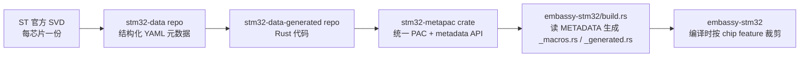

# 09 stm32 平台

> 撰写:2026-06-05
> 前置:docs/08-hal-architecture.md(M3.1 HAL 架构通论)
> 平行篇:docs/10-nrf.md · docs/11-rp.md(M3.3 / M3.4)
> 模板:ADR-004(`openspec/specs/architecture/spec.md`),7 节固定结构

---

## 目录

1. 平台概览
2. PAC 来源:stm32-data 元数据驱动 stm32-metapac
3. HAL 入口:`init()` + `Config` 时钟树
4. 中断模型:NVIC + `bind_interrupts!` 在 stm32 的具体落实
5. 时间驱动:`time-driver-*` feature 与 timer 选择
6. GPIO 外设抽象映射(stm32 独有部分)
7. 平台独有特性:DMA 三栈、世代差异、低功耗

---

## 1. 平台概览

### 1.1 STM32 在 Embassy 生态中的位置

STM32 是意法半导体(ST)的 Cortex-M 微控制器家族,被 Embassy 视作**最高完整度的 HAL** — `embassy-stm32` 是所有平台 HAL 中代码体量最大、外设覆盖最全、世代支持最广的一个:

- 源码 216 个 `.rs` 文件(`embassy-stm32/src/`)
- `Cargo.toml` 1896 行,其中绝大部分是 800+ 个 stm32 具体型号的 cargo feature
- 同时支持 4 套 `embedded-hal`(0.2 / 1.0 / async / nb),`prio-bits-4`(16 级中断优先级),启用 `aligned` feature(DMA 缓冲对齐)— 见 ADR-004 矩阵

### 1.2 支持的 STM32 系列(选摘)

| 家族 | 代表系列 | 时钟世代 | 备注 |
|------|----------|----------|------|
| F0 / F1 / F2 / F3 / F4 / F7 | F4 应用最广 | `f013` / `f247` | 老牌主流,生态最成熟 |
| L0 / L1 / L4 / L5 | L4 低功耗主流 | `l` | 低功耗(low-power)优化 |
| G0 / G4 | G4 模拟外设强 | `g0` / `g4` | 中端新代,带 CORDIC、HRTIM |
| H5 / H7 / H7RS | H7 高性能 | `h` | Cortex-M7 + 大缓存,400MHz+ |
| U0 / U3 / U5 / WBA | U5 安全增强 | `u3` / `u5` / `wba` | 新代,Cortex-M33 + TrustZone |
| WB / WL | 集成 BLE / LoRa | `wba` 等 | 无线 SoC |
| C0 | 入门级 | `c0` | 极简,8KB RAM 起 |
| N6 | NPU 集成 | `n6` | AI 加速 |

完整列表见 `embassy-stm32/Cargo.toml` 的 `stm32*` feature 段。

### 1.3 本篇关注点

本篇按 ADR-004 7 节模板讲 **stm32 在 Embassy 框架内是如何被抽象的**,重点是:

- **stm32-data 元数据驱动**:Embassy 区别于其它 HAL 的核心做法
- **`Config` 时钟树**:每代独立 Config 的务实设计
- **time-driver-* 多选**:18 个 feature 背后只有 2 个底层实现
- **DMA 三栈共存**:DMA / BDMA / GPDMA 如何接同一个 `Channel` 抽象

非重点(留给 examples 或后续):具体外设(SPI/UART/I2C/...)使用细节、PWM/QEI 操作、网络栈使用。

---

## 2. PAC 来源:stm32-data 元数据驱动 stm32-metapac

### 2.1 stm32-hal 生态的传统困境

ST 官方提供 CMSIS 寄存器头文件,但 Rust 生态需要 `svd2rust` 工具把芯片厂商的 SVD 文件转成 PAC crate。问题是:

- 每个 STM32 型号有自己的 SVD,生成的 PAC 互不兼容
- 用户每次换芯片要换 PAC 依赖
- 外设地址、寄存器布局、中断号在不同型号间有微妙差异,HAL 层难以统一处理
- 时钟树、引脚复用矩阵这些"芯片元数据"在 SVD 里没有,只能 HAL 手写,维护成本极高

### 2.2 Embassy 的解决方案:stm32-data

Embassy 团队维护了独立 repo [`embassy-rs/stm32-data`](https://github.com/embassy-rs/stm32-data),收集所有 STM32 型号的**结构化元数据**(YAML/JSON 格式):

- 寄存器布局(从 SVD 解析,但归一化、去重)
- 引脚 → 外设功能复用矩阵(AF 映射)
- 时钟树拓扑(每个外设挂在哪条总线、需要哪个时钟)
- DMA 请求映射表
- 中断号与中断名

### 2.3 stm32-data → stm32-metapac 生成链路



**关键设计**:

- `stm32-metapac` 是**单一 crate**(不是 800+ PAC),通过 cargo feature 选具体型号(`stm32-metapac/stm32h743`),编译时只编译该型号的寄存器代码
- `stm32-metapac` 同时暴露 `metadata` API,让 `embassy-stm32` 在 `build.rs` 中**读取自己的元数据**做代码生成

`embassy-stm32/Cargo.toml` 中的依赖声明:

```toml
stm32-metapac = { git = "https://github.com/embassy-rs/stm32-data-generated",
                  tag = "stm32-data-7aaa9af0001abcfb01c01e1a9b048697a82b7d57" }
stm32-metapac = { git = "...", default-features = false, features = ["metadata"] }
```

两次依赖同一 crate,第二个带 `metadata` feature 给 `build.rs` 用(不会进运行时),第一个进运行时(正常 PAC 使用)。tag 锁定具体提交,保证可重现构建。

### 2.4 `embassy-stm32/build.rs`(3042 行)做什么

源码 `embassy-stm32/build.rs:11-15` 直接引入 metapac 的 metadata:

```rust
use stm32_metapac::metadata::ir::BitOffset;
use stm32_metapac::metadata::{
    ALL_CHIPS, ALL_PERIPHERAL_VERSIONS, METADATA, MemoryRegion, MemoryRegionKind, Peripheral,
    PeripheralRccKernelClock, PeripheralRccRegister, PeripheralRegisters, StopMode,
};
```

`build.rs` 主要做三件事:

1. **检测当前编译的 chip feature**(`build.rs:46-54`):从 `CARGO_FEATURE_STM32*` 环境变量找出唯一一个,失败则 panic(0 个或 ≥2 个都不行)
2. **enable rustc cfg flags**(`build.rs:60-77`):为每个外设种类和版本(`spi_v3`、`usart_v2` 等)开启 `#[cfg(...)]`,让 HAL 源码可以 `#[cfg(spi_v3)] pub mod v3;` 这样裁剪
3. **生成 `_generated.rs` + `_macros.rs`**:输出到 `OUT_DIR`,在 `lib.rs` 用 `include!(concat!(env!("OUT_DIR"), "/_generated.rs"))`(line 191)包进来,提供 `peripherals`、`interrupt`、`DmaChannel` 等编译期类型

### 2.5 这套机制的代价与收益

**代价**:`build.rs` 极长(3042 行),编译时间长(首次编译 1-2 分钟级),对开发者来说编译过程是黑盒,出错信息抽象。

**收益**:
- 同一份 `embassy-stm32` 源码支持 800+ 芯片型号
- 添加新芯片只需 PR `stm32-data` 元数据,HAL 自动支持
- 外设代码用统一 `#[cfg(spi_v3)]` 分支表达版本差异,而非维护 N 个 crate
- 时钟、引脚复用、DMA 请求等"硬数据"集中维护,杜绝散落手写

这是 Embassy 在 stm32 HAL 上的核心设计哲学:**把芯片差异下沉到元数据,而非 fan out 到代码**。

---

## 3. HAL 入口:`init()` + `Config` 时钟树

### 3.1 标准启动流程

stm32 程序的最小 entry point(摘自 `examples/stm32xxx/`):

```rust
use embassy_executor::Spawner;
use embassy_stm32::Config;

#[embassy_executor::main]
async fn main(spawner: Spawner) {
    let config = Config::default();
    let p = embassy_stm32::init(config);
    // p 是 peripherals 单例集合
    // p.PA9, p.SPI4, p.USART1, ... 都是 Peri<'static, T>
    spawner.spawn(my_task(p.PA9)).unwrap();
}
```

三步:**取 Config → 调 init() → 拿 peripherals 单例**。从此 `p.X` 字段是 `Peri<'static, X>`(回顾 M3.1 §4.2),可以直接传给外设构造函数。

### 3.2 `Config` 不是一个统一类型

这里是 stm32 的务实设计 — **每个时钟世代有自己的 `Config`**。grep 一下能看到:

```
embassy-stm32/src/rcc/c0.rs:42:    pub struct Config {
embassy-stm32/src/rcc/u3.rs:132:   pub struct Config {
embassy-stm32/src/rcc/g4.rs:59:    pub struct Config {
embassy-stm32/src/rcc/g0.rs:67:    pub struct Config {
embassy-stm32/src/rcc/l.rs:39:     pub struct Config {
embassy-stm32/src/rcc/h.rs:207:    pub struct Config {
embassy-stm32/src/rcc/f013.rs:90:  pub struct Config {
embassy-stm32/src/rcc/f247.rs:89:  pub struct Config {
embassy-stm32/src/rcc/wba.rs:62:   pub struct Config {
embassy-stm32/src/rcc/n6.rs:122:   pub struct Config {
embassy-stm32/src/rcc/u5.rs       (line N)  pub struct Config { ... }
... 共 14 个文件,每个时钟世代独立
```

`embassy-stm32/src/rcc/mod.rs` 通过 `#[cfg(...)]` 把当前芯片家族对应的 `Config` 暴露为 `rcc::Config`,顶层 `Config`(`embassy_stm32::Config`)是个包装:

```rust
pub struct Config {
    pub rcc: rcc::Config,    // 真正的时钟配置
    pub dma_interrupt_priority: Priority,  // 默认 NORMAL_PRIORITY
    // 一些跨世代的小项
}
```

**为何不用统一 Config**?STM32 各家族时钟树差异巨大:

- F1 时钟树:HSE → PLLMul → SYSCLK,字段少
- H7 时钟树:HSE → PLL1/2/3 + per-domain HCLK + per-peripheral kernel clock,字段几十个
- L4 / U5:增加 MSI 内部多速率振荡器、HSI48 用于 USB
- WBA / WL:集成 RF 子系统,有独立时钟域

强行统一会得到一个"超集 + 大量 unused" 的 Config,反而难用。Embassy 选择**让每个世代直接暴露贴合自己硬件的 Config**,牺牲源码层面跨家族可移植(换芯片要改 Config),换来表达力和编译期检查。

### 3.3 `init()` 做什么

源码主要逻辑(`embassy-stm32/src/lib.rs` 末尾,具体行号因芯片而异):

```rust
pub fn init(config: Config) -> Peripherals {
    critical_section::with(|cs| {
        // 1. 应用时钟配置(rcc::init(config.rcc))
        //    - 配置时钟源(HSE/HSI/MSI/PLL)
        //    - 配置总线分频(HCLK/PCLK1/PCLK2)
        //    - 启用必要的外设时钟门(GPIO bank 等)
        rcc::init(config.rcc);

        // 2. 初始化 DMA(如果有 DMAMUX 或 GPDMA)
        #[cfg(any(bdma, dma, gpdma))]
        dma::init(cs, config.dma_interrupt_priority);

        // 3. 初始化 EXTI(GPIO 中断多路复用)
        #[cfg(exti)]
        exti::init(cs);

        // 4. 启动时间驱动(如果启用了 _time-driver feature)
        #[cfg(feature = "_time-driver")]
        time_driver::init(cs);
    });

    Peripherals::take()
}
```

`Peripherals::take()` 是单例机制 — 由 `embassy-hal-internal::impl_peripheral!` 宏生成,内部 `AtomicBool` 保证全程序只能调一次。第二次调返回 None(或 panic,看实现)。

### 3.4 时钟配置不仅是数字,还是文档

H7 系列的 `Config` 是个典型,字段示意:

```rust
// 摘自 embassy-stm32/src/rcc/h.rs(简化)
pub struct Config {
    pub hsi: Option<Hsi>,           // 内部 16/64MHz 振荡器
    pub hse: Option<Hse>,           // 外部晶振 4-50MHz
    pub csi: bool,                  // 4MHz CSI 振荡器
    pub hsi48: Option<Hsi48Config>, // 48MHz HSI(USB 用)
    pub sys: Sysclk,                // 系统时钟源选择
    pub pll1: Option<Pll>,          // PLL1
    pub pll2: Option<Pll>,
    pub pll3: Option<Pll>,
    pub d1c_pre: AHBPrescaler,      // Domain 1 CPU 时钟分频
    pub ahb_pre: AHBPrescaler,
    pub apb1_pre: APBPrescaler,
    pub apb2_pre: APBPrescaler,
    pub apb3_pre: APBPrescaler,
    pub apb4_pre: APBPrescaler,
    pub voltage_scale: VoltageScale, // 电源电压档位
    pub mux: super::mux::ClockMux,    // 各外设 kernel clock 多路选择
    // ...
}
```

写一个 H7 应用最大的工作量之一就是配置这些。`Config::default()` 通常是最低稳定时钟(HSI 64MHz),想跑 480MHz 必须手动配 PLL1。具体配置示例见 `examples/stm32h7*/src/bin/`。

---

## 4. 中断模型:NVIC + `bind_interrupts!` 在 stm32 的具体落实

M3.1 §5 已讲过三件套(`Interrupt` / `Handler` / `Binding`)和 `bind_interrupts!` 的用户用法,这里只补 **stm32 特有的两个细节**:vector 折叠 + 宏定义位置。

### 4.1 `bind_interrupts!` 宏定义在 lib.rs

M3.1 提到 `interrupt_mod!` 在 `embassy-hal-internal/src/interrupt.rs:11` 提供 typelevel 基础设施,但 `bind_interrupts!` 不在那里。源码 `embassy-stm32/src/lib.rs:236-237` 给出原因:

```rust
// developer note: this macro can't be in `embassy-hal-internal` due to the use of `$crate`.
#[macro_export]
macro_rules! bind_interrupts {
    ...
}
```

`$crate` 在 `macro_rules!` 中指向**定义该宏的 crate**。如果在 `embassy-hal-internal` 定义,用户代码里 `bind_interrupts!` 展开的 `$crate::interrupt::typelevel::Binding` 会指向 `embassy_hal_internal`,但实际需要指向 `embassy_stm32`(用户写 `embassy_stm32::bind_interrupts!`)。

折中:每个平台 HAL **自己 expose 一份 `bind_interrupts!` 宏**(语义完全一致,只是 `$crate` 不同)。这是宏卫生(macro hygiene)规则的一个常见踩坑点。

### 4.2 一个 vector 多个 handler

STM32 的硬件设计中,**一个中断 vector 可能服务多个外设事件**。例如 STM32F0 / G0 的 `I2C2_3`:I2C2 和 I2C3 共用一个 NVIC vector。`bind_interrupts!` 显式支持这种情况:

```rust
// 摘自 embassy-stm32/src/lib.rs:220-231 注释
bind_interrupts!(
    /// Binds the I2C interrupts.
    struct Irqs {
        I2C1 => i2c::EventInterruptHandler<peripherals::I2C1>,
                i2c::ErrorInterruptHandler<peripherals::I2C1>;
        I2C2_3 => i2c::EventInterruptHandler<peripherals::I2C2>,
                  i2c::ErrorInterruptHandler<peripherals::I2C2>,
                  i2c::EventInterruptHandler<peripherals::I2C3>,
                  i2c::ErrorInterruptHandler<peripherals::I2C3>;
    }
);
```

**一行 `I2C2_3 => ...` 注册了 4 个 handler**。宏展开后 `extern "C" fn I2C2_3()` 内部按顺序调用 4 个 handler 的 `on_interrupt()`。每个 handler 自行检查"是不是我的事件"(通过寄存器状态位),如果不是就 early return。

这种"vector 折叠"在 STM32 不同系列频率不一(F0 / G0 折叠多,H7 较少),用户写 `bind_interrupts!` 时必须按 chip 实际 vector 名,否则编译报错"unknown interrupt"。

### 4.3 中断优先级:`prio-bits-4`

`embassy-stm32/Cargo.toml`:

```toml
embassy-hal-internal = { ..., features = ["cortex-m", "prio-bits-4", "aligned"] }
```

`prio-bits-4` 表示 NVIC 优先级寄存器是 4-bit(16 级)。所有 Cortex-M3/M4/M7 STM32 都是 4 位(M0/M0+ 是 2 位,但 STM32C0 / G0 用了 `prio-bits-2` 配置 — 这个反映在 stm32-data 里,build.rs 自动选)。

实际项目中,**用户配置外设时通常用 `Priority::P5`、`Priority::P6` 等常量**,不直接和位数打交道。

### 4.4 中断与执行器:ThreadMode vs InterruptExecutor

`embassy-stm32/src/executor.rs`(22 符号)给 stm32 提供了 `InterruptExecutor` 包装(对接 `embassy-executor`)。回顾 M2.1 §3:

- **ThreadMode**(默认):`#[embassy_executor::main]` 启动的执行器,运行在 thread mode(非中断)
- **InterruptExecutor**:运行在中断 handler 上下文,优先级可控,适合高响应性子系统

stm32 上典型用法:**ThreadMode 跑业务逻辑 + InterruptExecutor 高优先级跑实时控制任务**。后者通过 `bind_interrupts!` 接到某个**未使用的 SW interrupt** 上,具体见 `examples/stm32f4/src/bin/multiprio.rs` 之类。

---

## 5. 时间驱动:`time-driver-*` feature 与 timer 选择

### 5.1 18 个 feature,2 个实现

`embassy-stm32/Cargo.toml` 中有 **18 个 time-driver-* feature**:

```toml
time-driver-any   = ["_time-driver"]      # 编译时自动挑一个空闲 timer
time-driver-tim1  = ["_time-driver"]
time-driver-tim2  = ["_time-driver"]
time-driver-tim3  = ["_time-driver"]
... (tim4/5/8/9/12/15/20/21/22/23/24 共 14 个)
time-driver-lptim1 = ["_lp-time-driver"]
time-driver-lptim2 = ["_lp-time-driver"]
time-driver-lptim3 = ["_lp-time-driver"]
```

但底层实现文件只有 **2 个**(`embassy-stm32/src/time_driver/`):

| 文件 | 实现什么 | 触发 feature |
|------|----------|--------------|
| `gp16.rs` | 通用 16-bit timer 驱动(tim1~24)| `_time-driver`(由 `time-driver-tim*` 触发) |
| `lptim.rs` | Low-power timer 驱动(lptim1~3)| `_lp-time-driver`(由 `time-driver-lptim*` 触发) |
| `mod.rs` | 路由 + `LPTimeDriver` trait | 始终编译 |

### 5.2 优雅的路由设计

`embassy-stm32/src/time_driver/mod.rs:41-44` 用 `#[cfg_attr(..., path = "...")]` 切换实际文件:

```rust
#[cfg_attr(feature = "_lp-time-driver", path = "lptim.rs")]
#[cfg_attr(not(feature = "_lp-time-driver"), path = "gp16.rs")]
mod driver;
pub(crate) use driver::*;
```

**`path` 属性可以指向不同文件**,不是常见的 `#[cfg]` 内嵌代码,而是切换整个模块文件。这种写法把两个相互独立的实现完全隔离,共享接口靠各自实现导出同名符号,而不是用 trait 多态。

### 5.3 选哪个 timer?

每个 timer 在硬件层面有不同特性:

| timer 类型 | 位宽 | 用途 |
|------------|------|------|
| GP16(tim1/2/3/...) | 16 bit | 通用,但只覆盖 65535 ticks,driver 用软件计数器扩展到 64-bit |
| LPTIM | 16 bit | Low-power,Stop 模式下仍能运行 → 适合低功耗应用 |
| TIM2 / TIM5 / TIM23 / TIM24 | 32 bit(部分 chip)| 硬件原生 32-bit,扩展到 64-bit 更稳 |

**建议**:

- 普通应用:`time-driver-any`,让编译器挑(通常会避开你显式声明给其它用途的 timer)
- 低功耗应用:`time-driver-lptim1`(stop mode 下仍跑)
- 想留某个 TIM 给 PWM/QEI:显式选另一个 timer

详见 `embassy-stm32/src/time_driver/gp16.rs` 注释和 `examples/stm32xxx/Cargo.toml`。

### 5.4 `LPTimeDriver` trait(low-power 支持)

`time_driver/mod.rs:21-39` 定义了 `LPTimeDriver` trait,在 `low-power` feature 开启时编译。核心方法:

```rust
pub(crate) trait LPTimeDriver {
    fn time_until_next_alarm(&self, cs: CriticalSection) -> embassy_time::Duration;
    fn set_min_stop_pause(&self, cs: CriticalSection, min_stop_pause: embassy_time::Duration);
    fn set_rtc(&self, cs: CriticalSection, rtc: crate::rtc::Rtc);
    fn pause_time(&self, cs: CriticalSection) -> Result<(), ()>;
    fn resume_time(&self, cs: CriticalSection);
}
```

设计目的:**进入 Stop 模式前暂停 timer,记下偏移;唤醒后用 RTC 补回流逝的时间**。这是 STM32 在 `embassy-time` 之上额外加的低功耗支持,M3.3 nrf 也有类似机制(下篇展开)。

### 5.5 Driver 链接器替换的具体实现

回顾 M3.1 §6.2 的链接器替换机制:`embassy-time-driver` 声明 `extern "Rust" fn _embassy_time_now()`,任何 driver 提供 `#[unsafe(no_mangle)] fn _embassy_time_now()`。

stm32 的 `gp16.rs` 末尾(典型)有:

```rust
embassy_time_driver::time_driver_impl!(static DRIVER: RtcDriver = RtcDriver::new());
```

`time_driver_impl!` 宏(`embassy-time-driver/src/lib.rs:161`)展开后生成 `#[unsafe(no_mangle)] fn _embassy_time_now()` 等。如果用户启用了多个 `time-driver-*`,**链接阶段就报 duplicate symbol** — 这正是设计意图。

---

## 6. GPIO 外设抽象映射(stm32 独有部分)

M3.1 §7 已讲过三平台 GPIO API 的**共性**(`Input`/`Output`/`Flex`/`Level`/`Pull` 高度一致)。本节只补 **stm32 独有的部分**:Speed、AFIO、EXTI 多路复用。

### 6.1 Speed:GPIO 翻转速度(stm32 专属)

stm32 GPIO 的 OSPEEDR 寄存器允许选择输出翻转速度,功耗 vs 抗干扰的权衡。源码 `embassy-stm32/src/gpio.rs:298-325`:

```rust
#[derive(Debug, Copy, Clone)]
pub enum Speed {
    Low,
    Medium,
    #[cfg(not(syscfg_f0))]
    High,
    VeryHigh,
}
```

- `Low`:低速,最低噪声,适合按键/LED
- `Medium`:中速,通用
- `High` / `VeryHigh`:高速,适合高频 SPI/通信信号

`Output::new()` 接受 Speed 参数:

```rust
// 摘自 embassy-stm32/src/gpio.rs:408 之后
impl<'d> Output<'d> {
    pub fn new(pin: Peri<'d, impl Pin>, initial_output: Level, speed: Speed) -> Self {
        // ...
    }
}
```

这与 nRF 的 `OutputDrive`(驱动强度,4 档)是不同维度 — Speed 控的是 slew rate,Drive 控的是输出电流。两者在 stm32 都没有(stm32 输出电流是 IOH/IOL 固定值,不可配)。

### 6.2 AFIO / GPIOAF:引脚复用矩阵

STM32 每个 GPIO 引脚可以连到多个外设(SPI、UART、TIM 等),通过**复用功能编号**(AF0~AF15)切换。`embassy-stm32/src/macros.rs:43-72`(M3.1 §4.4 已部分看过)定义了 `pin_trait_impl!` 宏处理这件事:

```rust
// 摘自 macros.rs:58-72(简化)
macro_rules! pin_trait_impl {
    (crate::$mod:ident::$trait:ident, $instance:ident, $pin:ident, $af:expr) => {
        impl crate::$mod::$trait<crate::peripherals::$instance>
            for crate::peripherals::$pin
        {
            fn af_num(&self) -> u8 {
                $af
            }
        }
    };
}
```

build.rs 根据 stm32-data 中的"引脚 → 外设"映射表批量生成 `pin_trait_impl!` 调用。**结果是用户写 `Spi::new(p.SPI1, p.PA5, p.PA6, p.PA7, ...)` 时,编译期就检查 PA5/PA6/PA7 能否作为 SPI1 的 SCK/MISO/MOSI,不能编译就报错**。

F1 老芯片用 AFIO_MAPR 寄存器(remapping),不是 AF 数字,源码用 `#[cfg(afio)]` 分支处理:

```rust
// 摘自 macros.rs:74-104
#[cfg(afio)]
macro_rules! pin_trait_afio_impl { ... }
```

这是 stm32-data 元数据驱动 + cfg 分支处理硬件差异的典型例子。

### 6.3 EXTI:GPIO 中断的多路复用器

stm32 的 GPIO 中断(边沿/电平)经由 **EXTI**(External Interrupt/Event Controller)寄存器路由。源码在 `embassy-stm32/src/exti/`(3 个文件):

```
exti/
├── blocking.rs   (6 符号)   阻塞 API
├── low_level.rs  (20 符号)  低层直接寄存器操作
└── mod.rs        (71 符号)  ExtiInput 异步包装
```

`ExtiInput` 是用户面向的 async 包装,典型用法:

```rust
use embassy_stm32::exti::ExtiInput;
use embassy_stm32::gpio::Pull;

let button = ExtiInput::new(p.PA0, p.EXTI0, Pull::Up);
button.wait_for_falling_edge().await;
```

关键点:`PA0` 和 `EXTI0` **必须配对**(PA0/PB0/PC0/... 都映射到 EXTI 通道 0,4 个 bank 共享 16 个 EXTI 通道)。stm32-data 元数据保证这种约束在编译期就被检查。

底层实现走 M3.1 §5 的 ISR → waker 链路:EXTI 通道触发 → `EXTI0_IRQ` → `bind_interrupts!` 接到的 handler → `wake` 注册的 waker → 任务恢复。

### 6.4 GPIO 寄存器版本差异

stm32-data 把 GPIO 寄存器版本归类为 `gpio_v1`(F1 系列,有 CRL/CRH 寄存器)和 `gpio_v2`(其余,有 MODER/OTYPER/OSPEEDR/PUPDR)。源码用 `#[cfg(gpio_v1)]` / `#[cfg(gpio_v2)]` 分支处理,用户 API 完全一致。这是 §2.5"代价与收益"里"用 #[cfg] 表达版本差异"的具体体现。

---

## 7. 平台独有特性:DMA 三栈、世代差异、低功耗

### 7.1 DMA 三栈共存:DMA / BDMA / GPDMA

STM32 的 DMA 硬件随时代演进经历了三代:

| 代 | 全称 | 代表系列 | 特点 |
|----|------|----------|------|
| DMA(v1/v2) | 老代 DMA | F1/F2/F3/F4/F7/L0/L1/L4 | 固定 channel ↔ peripheral 映射(F1),后期引入 DMAMUX |
| BDMA | Basic DMA | H7 | 与 DMA 类似,但配合 H7 的多 domain 时钟 |
| GPDMA | General Purpose DMA | H5 / U5 等新代 | 链表式描述符,更灵活,字 + 字节混合传输 |

`embassy-stm32/src/dma/mod.rs:1-26`:

```rust
#[cfg(any(bdma, dma, mdma))]
mod dma_bdma;
#[cfg(any(bdma, dma, mdma))]
pub use dma_bdma::*;

#[cfg(gpdma)]
pub(crate) mod gpdma;
#[cfg(gpdma)]
pub use gpdma::*;

#[cfg(dmamux)]
mod dmamux;
```

**三种实现共存,按 `#[cfg(...)]` 选一个**,但向用户暴露统一接口(`Channel`、`Dir`、`Increment`):

```rust
// 摘自 dma/mod.rs:69-72
pub struct Channel<'d> {
    pub(crate) channel: DmaChannel,
    phantom: PhantomData<&'d ()>,
}
```

`DmaChannel` 是 `_generated` mod 产物(stm32-data 提供),底层指向 `bdma::Channel` / `gpdma::Channel` 之一。用户写 `let dma = Channel::new(p.DMA1_CH0, Irqs)` 在所有 STM32 上语法一致。

### 7.2 `aligned` feature:DMA 缓冲对齐

`embassy-stm32/Cargo.toml` 显式依赖 `aligned = "0.4.3"`,这是因为部分 STM32(尤其 H7 的 DTCM/AXISRAM)对 DMA 缓冲有对齐要求。`embassy-hal-internal` 的 `aligned` mod 暴露 `AlignedBuffer<T, const N: usize>`,常用于:

```rust
let mut buf: AlignedBuffer<u8, 1024> = AlignedBuffer::new();
spi.transfer(buf.as_mut()).await;
```

对应 ADR-004 矩阵中 stm32 是唯一启用 `aligned` feature 的平台。

### 7.3 世代差异:`#[cfg]` 分支的实战

`embassy-stm32/src/flash/` 是世代差异最明显的目录,**17 个文件,每个对应一类 flash 控制器**:

| 文件 | 适用芯片 |
|------|----------|
| `f0.rs` | F0 |
| `f1f3.rs` | F1 / F3(共享布局) |
| `f2.rs` / `f4.rs` / `f7.rs` | F2 / F4 / F7(stress region 不同) |
| `g.rs` | G0 / G4 |
| `h5.rs` / `h50.rs` / `h7.rs` | H 系列(H50 是 H5 子集) |
| `l.rs` | L0 / L1 / L4 / L5 |
| `u0.rs` / `u3.rs` / `u5.rs` | U 系列 |

`mod.rs` 用 `#[cfg(flash_f4)] mod f4; pub use f4::*;` 模式按芯片选择。这是"按家族分文件 + 顶层 cfg 路由"的标准 stm32 HAL 模式,同样适用于 `rcc/`(14 文件)和 `adc/`(16 文件)。

### 7.4 低功耗:`low-power` feature

stm32 是 Embassy 平台中**低功耗支持最完整**的,`embassy-stm32/src/low_power.rs`(42 符号)+ `time_driver/mod.rs` 的 `LPTimeDriver`(§5.4)共同实现:

- **进 Stop 模式前**:暂停 timer,记录"还有多久下一个 alarm"
- **进 Stop 时**:CPU 停止,RTC 继续走
- **唤醒后**:用 RTC 计算流逝时间,恢复 timer

效果:`Timer::after_secs(30).await` 在低功耗模式下,真的让 CPU 大部分时间睡 30 秒,μA 级功耗。具体见 `examples/stm32l4*/src/bin/lowpower.rs`。

### 7.5 外设模块快速概览(M4 详解,本节仅列)

`embassy-stm32/src/` 顶层 + 子目录中的可用外设(部分):

| 类别 | 模块 |
|------|------|
| 通信 | `spi`、`i2c`(v1/v2)、`usart`(`buffered`/`ringbuffered`)、`can`(bxcan + fd)、`sai`、`sdmmc`、`usb`(otg + 全速)、`eth` |
| 模拟 | `adc`(v1~v4 + c0/f1/f3/g4/l1)、`dac`、`comp`、`opamp`、`vrefbuf` |
| 加密 | `aes`、`cryp`、`hash`、`pka`、`rng` |
| 显示 | `ltdc`(LCD-TFT)、`dsihost`、`dcmi`/`dcmipp`(摄像头)、`jpeg` |
| 存储 | `flash`、`qspi`/`ospi`/`xspi`(外部 quad/octo SPI flash) |
| 计时 | `timer`(simple_pwm/complementary_pwm/input_capture/qei/...)、`hrtim`(高分辨率)、`lptim`、`rtc` |
| 其它 | `wdg`(看门狗)、`tsc`(电容触摸)、`hsem`(硬件信号量)、`ipcc`(IPC) |

详见 `embassy-stm32/src/lib.rs:55-180` 的 `#[cfg(...)] pub mod ...` 段。每个模块按所在芯片有无该外设 cfg 控制是否编译。

---

## 8. 跨平台对比矩阵(入口)

完整对比表见 ADR-004(`openspec/specs/architecture/spec.md`)。stm32 在 4 个对比维度上的位置:

| 维度 | stm32 位置 |
|------|-----------|
| 异步化策略 | 中断 + waker 为主,DMA 完成通知大量使用,少量状态轮询(如 FLASH 操作) |
| 时钟与时间驱动 | 14 世代 Config 独立,18 个 time-driver-* feature(底层 2 实现:gp16 + lptim) |
| DMA 抽象 | 三栈共存(DMA/BDMA/GPDMA),用 `Channel` 统一接口;启用 `aligned` 支持对齐缓冲 |
| PAC 生成 | stm32-data 元数据 → stm32-metapac → embassy-stm32/build.rs(3042 行) |

对比 M3.3(nrf)/ M3.4(rp)请直接读那两篇。

---

## 9. 总结 + 阅读 M3.3 / M3.4 的导览

### 9.1 本篇核心要点

| 要点 | 一句话总结 |
|------|------------|
| stm32-data 元数据驱动 | Embassy 区别于其它 stm32 HAL 的根本做法:芯片差异下沉到元数据,而非 fan out 到代码 |
| 单 metapac + build.rs 生成 | 同一份源码 800+ 芯片型号支持 |
| Config 不强求统一 | 14 个时钟世代各自定义 Config,牺牲跨家族可移植换表达力 |
| 18 个 time-driver-* | 用户感知"丰富选项",底层只有 2 个实现(gp16 + lptim) |
| `bind_interrupts!` 在 lib.rs 而不在 hal-internal | 因 `$crate` 宏卫生限制 |
| GPIO 独有 Speed + AFIO + EXTI | 与 nrf/rp 的差异化部分 |
| DMA 三栈共存 | DMA / BDMA / GPDMA 接同一 `Channel` 抽象 |
| `aligned` + `low-power` feature | stm32 独享(对比 ADR-004 矩阵) |

### 9.2 横向对比预告

读完 M3.3 nrf 和 M3.4 rp 你会发现:

- **PAC 生成**:nrf 是手写 nrf-pac,rp 是半自动生成 rp-pac。**只有 stm32 用元数据驱动**
- **time driver 数量**:nrf 用 RTC 单一实现,rp 用 timer 单一实现。**只有 stm32 暴露多 feature 选择**
- **DMA 抽象**:nrf 用 EasyDMA(外设直接连 RAM,无独立 DMA 控制器),rp 有少量 DMA channel
- **平台独有创新**:nrf 的 PPI/DPPI(外设连外设无 CPU 参与),rp 的 PIO(可编程 IO 状态机)

stm32 的特点是**世代多 + 外设全 + 抽象厚**,nrf 是**集成度高 + 外设异步原生**,rp 是**外设少但 PIO 极度灵活**。三平台代表三种不同的 SoC 设计哲学。

### 9.3 接下来怎么读

- **要写 stm32 应用**:跳到 `examples/stm32{xx}/` 看具体 chip 的 examples;时钟配置参考 `examples/stm32{xx}/src/bin/` 多个 main 的 Config 写法
- **要理解其它平台**:依次读 M3.3 nrf 和 M3.4 rp,带着本篇的"对比意识"
- **要深入某个外设**:M4 外设驱动系列(`docs/12-gpio.md` 起)会聚焦"同一外设在 3 平台的实现差异"

---

## 参考

源码:

- `embassy-stm32/src/lib.rs`(顶层入口、`bind_interrupts!` 宏、200+ 模块 cfg)
- `embassy-stm32/build.rs`(3042 行,stm32-data 元数据驱动代码生成)
- `embassy-stm32/Cargo.toml`(800+ chip feature 矩阵、18 个 time-driver-*)
- `embassy-stm32/src/rcc/{c0,u3,g4,g0,l,h,f013,f247,wba,n6,...}.rs`(14 世代 Config)
- `embassy-stm32/src/time_driver/{mod,gp16,lptim}.rs`(2 个底层实现 + 路由)
- `embassy-stm32/src/dma/{mod,dma_bdma,gpdma/,dmamux}.rs`(三栈)
- `embassy-stm32/src/gpio.rs`(Speed/Pull/Flex/Input/Output)
- `embassy-stm32/src/macros.rs`(peripherals!/pin_trait!/pin_trait_impl!)
- `embassy-stm32/src/exti/{mod,low_level,blocking}.rs`(GPIO 中断多路复用)
- `embassy-stm32/src/low_power.rs`(低功耗集成)

外部 repo:

- [embassy-rs/stm32-data](https://github.com/embassy-rs/stm32-data)(元数据源)
- [embassy-rs/stm32-data-generated](https://github.com/embassy-rs/stm32-data-generated)(stm32-metapac 仓库)

规划与平行篇:

- ADR-004(`openspec/specs/architecture/spec.md`,M3 文档系列统一规划)
- `docs/08-hal-architecture.md`(M3.1 HAL 通论)
- `docs/10-nrf.md` / `docs/11-rp.md`(M3.3 / M3.4,平行平台篇)

