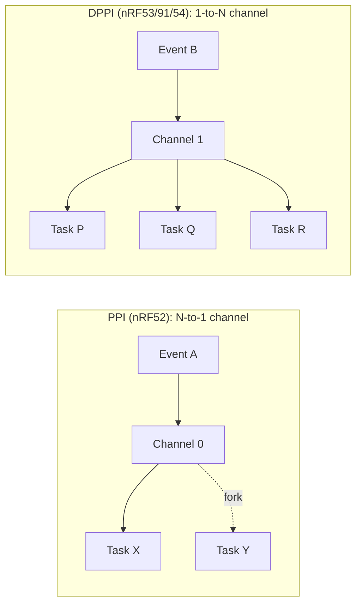

# 10 nrf 平台

> 撰写:2026-06-05
> 前置:docs/08-hal-architecture.md(M3.1 HAL 通论)· docs/09-stm32.md(M3.2 stm32,可对比)
> 平行篇:docs/11-rp.md(M3.4 rp)
> 模板:ADR-004(`openspec/specs/architecture/spec.md`),7 节固定结构

---

## 目录

1. 平台概览
2. PAC 来源:nrf-pac 手写 + chips/{chip}.rs 描述外设
3. HAL 入口:`init()` + `Config` 与 chip 互锁
4. 中断模型:`bind_interrupts!` 在 nrf 的具体落实
5. 时间驱动:RTC1 vs GRTC(只有 2 个 feature)
6. GPIO 外设抽象映射(nrf 独有:DriveStrength / persist / GPIOTE)
7. 平台独有特性:PPI / DPPI / EasyDMA / Radio
8. 跨平台对比矩阵(入口)
9. 总结 + 阅读 M3.4 的导览

---

## 1. 平台概览

### 1.1 nrf 在 Embassy 生态中的位置

nrf(Nordic Semiconductor 的 Cortex-M 与 RISC-V 系列)是 Embassy 第二大平台 HAL,定位**集成度高、外设异步原生、低功耗 + 无线 SoC 强项**。与 stm32 对比:

| 指标 | stm32 | nrf |
|------|-------|-----|
| `src/` 文件数 | 216 | **60** |
| `Cargo.toml` 行数 | 1896 | **248** |
| `build.rs` 行数 | 3042 | **无 build.rs** |
| chip feature 数量 | 800+ | **24** |
| time-driver-* feature | 18 | **2**(rtc1 / grtc) |
| 元数据生成 | stm32-data → metapac | **chips/{chip}.rs 手写** |

少得多。这反映两个事实:Nordic 芯片 SKU 数量本身就少;chips/{chip}.rs 手工维护可控。

### 1.2 支持的 nrf 系列(枚举完整)

`embassy-nrf/src/lib.rs:14-41` 用 `compile_error!` 强制必须选一个,完整候选 24 个:

| 家族 | 代表芯片 | 内核 / 特点 |
|------|----------|-------------|
| nRF51 | nrf51 | Cortex-M0,老一代 |
| nRF52 | nrf52805 / 810 / 811 / 820 / 832 / 833 / **840** | Cortex-M4 + FPU(840 是旗舰),BLE 5 / 802.15.4 / NFC |
| nRF53 | nrf5340-app-s / app-ns / net | **双核**:M33 应用核 + M33 网络核 |
| nRF54L | nrf54l05/10/15-app-s/ns + nrf54lm20 | RISC-V FLPR + M33,新一代多核 |
| nRF91 | nrf9120/9151/9160/9161-s/-ns | Cortex-M33,LTE-M / NB-IoT 蜂窝 SoC |

`-s` / `-ns` 后缀:Secure / Non-Secure(TrustZone 域)。

### 1.3 src/ 子目录速览

```
chips/             16 个 .rs 文件(每芯片一份,手写)
ppi/               PPI(nrf52)+ DPPI(nrf53/91/54)+ 路由 mod
radio/             无线 radio(802.15.4 / BLE)
usb/               USB 设备 + USBHS + vbus_detect
buffered_uarte/    UART 缓冲版本 v1 / v2
+ 各外设文件:gpio, gpiote, i2s, nvmc, pdm, pwm, qdec, qspi, rng, rtc, saadc,
            spim, spis, temp, timer, twim, twis, uarte, wdt 等
+ 平台基础:lib.rs, time_driver.rs, fmt.rs, util.rs, reset.rs, vpr.rs, ipc.rs
```

**没有 `dma/` 目录** — nrf 不需要独立 DMA crate(详见 §7 EasyDMA)。
**没有 `rcc/` 目录** — nrf 时钟简洁,不需要每代独立 Config 文件。

### 1.4 本篇关注点

- **chips/{chip}.rs 手写**(vs stm32 元数据驱动,强对比)
- **PPI / DPPI**:外设互联无 CPU 参与,nrf 最独特的设计
- **EasyDMA**:外设自带 DMA,设计哲学与 stm32 三栈完全不同
- **GPIOTE**:GPIO 中断的另一种实现思路
- **time-driver 仅 2 选项**:与 stm32 18 选项的强对比

---

## 2. PAC 来源:nrf-pac 手写 + chips/{chip}.rs 描述外设

### 2.1 nrf-pac 的来历

nrf-pac 由 Nordic 维护的官方 PAC,基于 svd2rust 半自动生成,但 **Embassy 团队没有像 stm32 那样从元数据重新驱动**。Cargo.toml:

```toml
# 摘自 embassy-nrf/Cargo.toml
nrf52840 = ["nrf-pac/nrf52840", "_nrf52", "_gpio-p1"]
nrf5340-app-s = ["_nrf5340-app", "_s"]
_nrf5340 = ["_gpio-p1", "_dppi"]
```

每个公开 chip feature 转发到 `nrf-pac/<chip>` 的同名 feature(让 PAC 只编译该 chip 的寄存器),同时启用 `_nrf52` / `_nrf5340` 等内部 cfg,以及 `_gpio-p1`(有第二 GPIO port)、`_dppi`(用 DPPI 而非 PPI)等能力 flag。

### 2.2 chips/{chip}.rs:外设清单手写

每个 chip 一份 .rs 文件(16 个),描述该 chip 的:**外设清单 + 引脚 + 中断**。以 nRF52840 为例(`chips/nrf52840.rs`,402 行):

```rust
// 摘自 chips/nrf52840.rs:1-9
pub use nrf_pac as pac;

/// EasyDMA 单次传输最大字节数。
pub const EASY_DMA_SIZE: usize = (1 << 16) - 1;
pub const FORCE_COPY_BUFFER_SIZE: usize = 512;
pub const FLASH_SIZE: usize = 1024 * 1024;
pub const RESET_PIN: u32 = 18;
pub const APPROTECT_MIN_BUILD_CODE: u8 = b'F';
```

接着用 `peripherals!` 宏列出所有外设单例(USBD / RTC0~2 / WDT / UARTE0~1 / TWISPI0~1 / SAADC / PWM0~3 / TIMER0~4 / GPIOTE_CH0~7 / PPI_CH0~31 / PPI_GROUP0~5 / P0_00~31 / P1_00~15 / RADIO / NFCT / ...):

```rust
// 摘自 chips/nrf52840.rs:12-194
embassy_hal_internal::peripherals! {
    USBD,
    RTC0,
    #[cfg(not(feature = "time-driver-rtc1"))]
    RTC1,    // 若用 RTC1 做时间驱动,从用户可见 peripherals 移除
    RTC2,
    // ... 共 200+ 个外设单例
}
```

每个外设变成一个 ZST + `impl PeripheralType`,通过 `Peri<'static, T>` 暴露给用户(回顾 M3.1 §4)。

### 2.3 然后是 `impl_xxx!` 批量绑定

源码 `chips/nrf52840.rs:196-356` 用一组宏把外设 ZST 绑到具体寄存器和中断:

```rust
impl_usb!(USBD, USBD, USBD);
impl_uarte!(UARTE0, UARTE0, UARTE0);
impl_uarte!(UARTE1, UARTE1, UARTE1);

impl_spim!(TWISPI0, SPIM0, TWISPI0);   // 一个外设可有多种"角色":SPI master、SPI slave、TWI master、TWI slave
impl_spim!(TWISPI1, SPIM1, TWISPI1);
impl_spis!(TWISPI0, SPIS0, TWISPI0);
impl_twim!(TWISPI0, TWIM0, TWISPI0);
impl_twis!(TWISPI0, TWIS0, TWISPI0);

impl_timer!(TIMER0, TIMER0, TIMER0);
impl_timer!(TIMER3, TIMER3, TIMER3, extended);   // TIMER3/4 是 32-bit 扩展版

impl_pin!(P0_00, 0, 0);    // 引脚 → (port, pin) 编号
impl_pin!(P0_18, 0, 18);

impl_ppi_channel!(PPI_CH0, PPI, 0 => configurable);   // PPI_CH0~19 可配置
impl_ppi_channel!(PPI_CH20, PPI, 20 => static);       // PPI_CH20~31 固定

impl_saadc_input!(P0_02, AnalogInput0);   // 模拟引脚 → ADC 通道映射
```

末段集中声明所有中断:

```rust
// 摘自 chips/nrf52840.rs:357-401
embassy_hal_internal::interrupt_mod!(
    CLOCK_POWER,
    RADIO,
    UARTE0,
    TWISPI0,
    TWISPI1,
    GPIOTE,
    SAADC,
    TIMER0,
    // ... 共 45 个中断
);
```

`interrupt_mod!`(M3.1 §5)展开后生成 `crate::interrupt::typelevel::SAADC` 等 typelevel 类型。

### 2.4 stm32 vs nrf:元数据 vs 手写

| 维度 | stm32 | nrf |
|------|-------|-----|
| 芯片差异表达 | yaml 元数据 → build.rs 生成 | 每 chip 一份 .rs 手写 |
| 添加新 chip | PR `stm32-data` 元数据 | PR `embassy-nrf/src/chips/` 新文件 |
| 入门门槛 | 高(build.rs 黑盒)| 低(代码即文档,可直接读) |
| 维护成本 | 元数据 + build.rs 复杂但稳定 | 16 文件人工维护,有重复但简单 |
| 适用场景 | 芯片型号多(800+) | 芯片型号少(24)且差异化大 |

两种做法都合理 — stm32 的 SKU 多到必须自动化,nrf 的 SKU 少到手写更经济。这是工程务实的不同选择。

---

## 3. HAL 入口:`init()` + `Config` 与 chip 互锁

### 3.1 必须选一个 chip,否则编译报错

源码 `embassy-nrf/src/lib.rs:14-71` 是一长串 cfg 互锁:

```rust
#[cfg(not(any(
    feature = "nrf52840",
    feature = "nrf5340-app-s",
    // ... 24 个候选
)))]
compile_error!(
    "No chip feature activated. You must activate exactly one of the following features:
     nrf51, nrf52805, ..., nrf9161-ns"
);
```

后续还有更精细互锁:

```rust
#[cfg(all(feature = "reset-pin-as-gpio", not(feature = "_nrf52")))]
compile_error!("feature `reset-pin-as-gpio` is only valid for nRF52 series chips.");

#[cfg(all(feature = "nfc-pins-as-gpio", not(any(...))))]
compile_error!("feature `nfc-pins-as-gpio` is not valid for this chip.");
```

这是 stm32 不易做的检查(stm32 用 build.rs 的 panic 实现),nrf 用 `compile_error!` 在普通 Rust 编译流程中报错,信息明确。

### 3.2 启动流程

```rust
use embassy_executor::Spawner;
use embassy_nrf::config::Config;

#[embassy_executor::main]
async fn main(spawner: Spawner) {
    let mut config = Config::default();
    // 可选:HFCLK 用外部晶振、设置 DCDC 电源模式等
    let p = embassy_nrf::init(config);

    // p.P0_13 是 Peri<'static, P0_13>
    let led = Output::new(p.P0_13, Level::Low, OutputDrive::Standard);
    // ...
}
```

与 stm32 一样的 **取 Config → init() → 拿 Peripherals 单例** 三步。

### 3.3 `Config` 的简洁

nrf 没有 stm32 那样按时钟世代分裂 Config 的需求,因为:

- 时钟树简单:HFCLK(高频)+ LFCLK(32.768kHz 低频)+ 几个固定分频
- 不区分多 power domain
- 整个 nRF52 系列共享几乎相同的 Config 字段

`Config` 大致字段(typical):

```rust
pub struct Config {
    pub hfclk_source: HfclkSource,       // 内部 HSI 64MHz / 外部晶振
    pub lfclk_source: LfclkSource,       // 内部 LSI / 外部 32768Hz 晶振 / Synth
    pub time_interrupt_priority: Priority,
    pub gpiote_interrupt_priority: Priority,
    pub dcdc: DcdcConfig,                 // DCDC 电源模式(REG0/REG1)
    pub debug: Debug,                     // 调试器接管选项
    // ... 少量 chip 特定字段(如 nRF53 的 IPC 配置)
}
```

无需像 stm32 H7 那样配置 PLL1/2/3 + 6 个 APB 分频 + voltage_scale + per-peripheral kernel clock mux。**简洁是 nrf 的设计哲学**。

### 3.4 `init()` 内部做什么

类似 stm32(M3.2 §3.3),但项目数更少:

```rust
pub fn init(config: Config) -> Peripherals {
    // 1. 配置 LFCLK(用于 RTC/time-driver)
    clocks::init(config.hfclk_source, config.lfclk_source);

    // 2. 配置 DCDC 电源模式(影响功耗)
    power::init(config.dcdc);

    // 3. 初始化 GPIOTE(GPIO 中断多路复用)— 如果有
    gpiote::init(config.gpiote_interrupt_priority);

    // 4. 启动时间驱动(如果启用了 _time-driver)
    #[cfg(feature = "_time-driver")]
    time_driver::init(config.time_interrupt_priority);

    Peripherals::take()
}
```

`Peripherals::take()` 仍是 `embassy-hal-internal` 提供的单例机制,与 stm32 一致。

---

## 4. 中断模型:`bind_interrupts!` 在 nrf 的具体落实

M3.1 §5 已讲过 typelevel 三件套,M3.2 §4 已讲过 `bind_interrupts!` 的 `$crate` 宏卫生原因 + vector 折叠机制。本节只补 **nrf 特有的两点**:中断聚合 + GPIOTE 例。

### 4.1 nrf 中断的聚合特性

nRF 芯片中断比 stm32 少且功能聚合度高。`chips/nrf52840.rs:357-401` 中 `interrupt_mod!` 列出全部 45 个中断,但每个中断通常**覆盖一个外设的所有 event**(纯硬件设计):

```rust
embassy_hal_internal::interrupt_mod!(
    CLOCK_POWER,    // CLOCK + POWER 共享一个 vector
    RADIO,
    UARTE0,
    TWISPI0,        // TWIM0 / TWIS0 / SPIM0 / SPIS0 共享(取决于配置)
    TWISPI1,
    GPIOTE,         // 8 个 GPIOTE channel 共享一个 vector
    SAADC,
    TIMER0,
    // ...
);
```

**对比 stm32**:stm32 一个 I2C 外设可能有 EV(事件)+ ER(错误)两个 vector,需要 2 个 handler;nrf 一个 UARTE 一个 vector,handler 自己 dispatch 不同 event,代码更紧凑但对 handler 实现要求高。

### 4.2 用户用法对比

stm32(M3.2 §4):

```rust
bind_interrupts!(struct Irqs {
    I2C1 => i2c::EventInterruptHandler<peripherals::I2C1>,
            i2c::ErrorInterruptHandler<peripherals::I2C1>;   // 2 个 handler
});
```

nrf:

```rust
bind_interrupts!(struct Irqs {
    TWISPI0 => twim::InterruptHandler<peripherals::TWISPI0>;   // 1 个 handler 覆盖所有 event
    SAADC => saadc::InterruptHandler;
});
```

更简洁。在驱动内部,`twim::InterruptHandler::on_interrupt()` 通过寄存器状态位判断是 STOPPED / RX_END / TX_END 等事件,各自唤醒对应 waker。

### 4.3 GPIOTE 中断:一处独特设计

stm32 GPIO 中断通过 EXTI 多路复用(M3.2 §6.3),nrf 用 **GPIOTE**(GPIO Tasks and Events,8 个 channel)。GPIOTE 在 lib 暴露 8 个独立 channel peripheral:

```rust
// 摘自 chips/nrf52840.rs:63-71
GPIOTE_CH0, GPIOTE_CH1, GPIOTE_CH2, GPIOTE_CH3,
GPIOTE_CH4, GPIOTE_CH5, GPIOTE_CH6, GPIOTE_CH7,
```

用户配置某个 channel 检测引脚 → 该 channel 触发中断 → handler dispatch 到正确 waker。区别于 stm32:

| 维度 | stm32 EXTI | nrf GPIOTE |
|------|------------|------------|
| 通道数 | 23(EXTI0~22)| 8(GPIOTE_CH0~7) |
| 通道选择 | 由 pin number 决定(PA0/PB0/... → EXTI0)| 用户运行时显式分配 |
| 唤醒 | 仅唤醒,事件读寄存器 | 同时是"事件"和"任务",可参与 PPI |

GPIOTE 与 PPI 配合极强:**GPIOTE event(引脚下降沿)→ PPI → 别的外设 task(如启动 ADC 采样),全程无 CPU 参与**。详见 §7 PPI/DPPI。

### 4.4 中断优先级:`prio-bits-3`

`embassy-nrf/Cargo.toml`:

```toml
embassy-hal-internal = { ..., features = ["cortex-m", "prio-bits-3"] }
```

`prio-bits-3` = 8 级优先级,介于 stm32 的 4 位(16 级)和 rp 的 2 位(4 级)之间。8 级在实际项目中**够用**(典型分:系统/RT 控制/IO/低优先级 4 档已经够)。

---

## 5. 时间驱动:RTC1 vs GRTC(只有 2 个 feature)

### 5.1 极简的 2 选择

`embassy-nrf/Cargo.toml`(关键 2 行):

```toml
time-driver-rtc1 = ["_time-driver", "embassy-time-driver?/tick-hz-32_768"]
time-driver-grtc = ["_time-driver", "embassy-time-driver?/tick-hz-1_000_000"]
```

对比 stm32 的 18 个 `time-driver-*`(M3.2 §5.1),nrf 只有 2 个。

| feature | 硬件 | 频率 | 适用 |
|---------|------|------|------|
| `time-driver-rtc1` | RTC1(Real-Time Counter,32.768 kHz)| 32768 Hz tick | nRF51/52(主流)|
| `time-driver-grtc` | GRTC(Global RTC,1 MHz)| 1_000_000 Hz tick | nRF53/54/91(新代,精度高) |

互斥:开一个,链接器会自动接到对应实现;两个都开则 duplicate symbol(回顾 M3.1 §6.2)。

### 5.2 实现位置

`embassy-nrf/src/time_driver.rs`(35 符号)是统一实现文件,内部用 `#[cfg(feature = "time-driver-rtc1")]` / `#[cfg(feature = "time-driver-grtc")]` 分支处理硬件差异。**不像 stm32 用 `cfg_attr(path = "...")` 切换不同文件**(M3.2 §5.2),nrf 实现量小,一个文件就够。

### 5.3 RTC1 占用 = 不暴露给用户

注意 `chips/nrf52840.rs:18-20`:

```rust
RTC0,
#[cfg(not(feature = "time-driver-rtc1"))]
RTC1,                  // 启用 time-driver-rtc1 时,RTC1 不出现在 Peripherals
RTC2,
```

用户启用 `time-driver-rtc1` 后,`p.RTC1` 字段**根本不存在**,编译期就拒绝用户拿这个外设做别的事 — 防止与 time driver 冲突。这是 Rust 类型系统在嵌入式 HAL 中的优雅运用。stm32 用 build.rs 的"已选 timer 不出现在 peripherals"做同样的事,但代码量大得多。

### 5.4 RTC1 的 wake 链路

RTC1 是 24-bit counter @ 32768 Hz,**单 counter overflow 在 ~512 秒**。time-driver 用软件计数器扩展到 64-bit:

```
应用代码:Timer::after_secs(10).await
  → embassy-time 计算目标 tick(32768 * 10 = 327680)
  → embassy_time_driver::schedule_wake(at, waker)
  → nrf time_driver.rs 接管
  → 用 embassy-time-queue-utils Queue 排队 waker
  → 计算"下一个最近的 alarm 时刻"
  → 写入 RTC1 的 CC[0] compare 寄存器(只放最近一个)
  → CPU 进入 sleep / WFE / WFI
  → 10s 后 RTC1 触发 COMPARE[0] event → CPU 中断
  → handler 读出 queue 中所有过期 waker → wake()
  → 任务在执行器主循环被 poll
```

这 12 步本质与 stm32 GP16 driver(M3.2 §5)一致,只是硬件是 RTC 而非通用 timer。底层都是 wake-on-compare 机制,driver 接 `embassy-time-queue-utils` 的 Queue 排序所有 pending waker。

### 5.5 低功耗的天然优势

RTC1 是低功耗 timer,**在 System OFF 模式下仍能运行**(消耗 < 1 μA)。意味着 nrf 应用走 `Timer::after_secs(60).await` 时,CPU 可以进 System ON Sleep 甚至 System OFF,功耗自然极低 — 不需要 stm32 那样的 `low-power` feature + `LPTimeDriver` trait 显式集成(M3.2 §5.4)。

### 5.6 GRTC:nRF53/54/91 的新选择

GRTC(Global RTC,1 MHz tick)是 nrf 新代芯片(53/91/54)引入的,跨多核共享(双核架构下 app core + net core 看同一时间基),精度更高(1 μs vs 32768 Hz 的 30.5 μs)。在 nRF52 上仍用 RTC1,新项目 + nRF53/91/54 推荐 GRTC。

---

## 6. GPIO 外设抽象映射(nrf 独有部分)

M3.1 §7 + M3.2 §6 已讲过共性(`Input`/`Output`/`Flex` API 形状),本节只补 **nrf 独有**:DriveStrength、`persist()`、GPIOTE 集成。

### 6.1 `OutputDrive`(驱动强度)

stm32 暴露 `Speed`(slew rate),nrf 暴露 `OutputDrive`(驱动电流),两者是**不同硬件维度**。源码 `embassy-nrf/src/gpio.rs` Output 部分(摘要):

```rust
#[derive(Clone, Copy, Debug, Eq, PartialEq)]
pub enum OutputDrive {
    Standard,            // S0S1:标准 0、标准 1
    HighDrive0Standard1, // H0S1
    Standard0HighDrive1, // S0H1
    HighDrive,           // H0H1:高驱动 0、高驱动 1
    Disconnect0Standard1,// D0S1:断 0、标准 1(开漏)
    Disconnect0HighDrive1, // D0H1
    Standard0Disconnect1,// S0D1:标准 0、断 1
    HighDrive0Disconnect1,// H0D1
}
```

8 种组合,每种独立控制 high / low 驱动模式。可表达 push-pull / open-drain / 推挽 + 强驱动 等组合。stm32 没有这种细粒度。

### 6.2 `persist()`:'static 生命周期持久化

nrf `Input::persist()` 是独有方法(`embassy-nrf/src/gpio.rs:78-85`):

```rust
impl Input<'static> {
    pub fn persist(self) {
        self.pin.persist()
    }
}
```

注意 `impl Input<'static>` 而非 `impl<'d> Input<'d>` — 只有 `'static` 生命周期才能调。语义:**消费 self,但不恢复引脚配置**(对比正常 drop 会把引脚设为 Disconnect)。

为何需要?某些低功耗场景需要"GPIO 配置保留,代码不再操作它"(如系统进 System OFF 模式时引脚保留唤醒能力)。stm32 通常用 `core::mem::forget(input)` 实现,但 `mem::forget` 有"内存泄漏"语义争议;nrf 提供专门方法,语义清晰,且强制 `'static` 避免误用。

注释里点名(`gpio.rs:79-81`):

> This method should be preferred over `core::mem::forget()` because the `'static` bound prevents accidental reuse of the underlying peripheral.

### 6.3 `LevelDrive`(仅 nRF54L)

nRF54L 引入更细控制(`embassy-nrf/src/gpio.rs:117-130`):

```rust
#[cfg(feature = "_nrf54l")]
pub enum LevelDrive {
    Disconnect = 2,
    Standard = 0,
    High = 1,
    ExtraHigh = 3,
}
```

可分别配置 high / low 两侧的驱动强度,粒度比 `OutputDrive` 更细。这是 nrf54l 硬件新特性,通过 cfg 暴露给该芯片用户。

### 6.4 GPIO 中断:走 GPIOTE 而非独立 EXTI

stm32 GPIO 中断走 EXTI(M3.2 §6.3),nrf 走 GPIOTE。`embassy-nrf/src/gpiote.rs`(108 符号)提供:

```rust
// nrf 等价于 stm32 ExtiInput
let mut pin = InputChannel::new(p.GPIOTE_CH0, Input::new(p.P0_13, Pull::Up), InputChannelPolarity::HiToLo);
pin.wait().await;
```

**用户必须显式分配 GPIOTE channel**(因为只有 8 个,而引脚有 32+ 个,资源敏感)。每个 channel 可以监听一个引脚,触发 event。
- `InputChannelPolarity` 选择上升 / 下降 / 双边沿
- 对应 OUT 任务(可由 PPI 触发,自动翻转引脚)
- channel 数量限制提示用户**优先用 PORT event**(GPIO 全 port 唤醒,无需 channel,但只能检测电平不能区分引脚)

GPIOTE 独立于 EXTI 的设计让它能与 PPI 直接互联(详见 §7),这是 nrf 异步外设互联的关键基础设施。

---

## 7. 平台独有特性:PPI / DPPI / EasyDMA / Radio

### 7.1 PPI / DPPI:外设互联,CPU 旁观

**PPI**(Programmable Peripheral Interconnect,nRF51/52)和 **DPPI**(Distributed PPI,nRF53/91/54)是 nrf 最独特的硬件设计 — 让**外设的 event 直接触发其它外设的 task,全程不需要 CPU 介入**。

源码 `embassy-nrf/src/ppi/mod.rs:3-16` 注释:

> The (Distributed) Programmable Peripheral Interconnect interface allows for an autonomous interoperability between peripherals through their events and tasks. There are fixed PPI channels and fully configurable ones.
>
> On nRF52 devices, there is also a fork task endpoint, where the user can configure one more task to be triggered by the same event, even fixed PPI channels have a configurable fork task.
>
> The DPPI for nRF53 and nRF91 devices works in a different way. Every channel can support infinitely many tasks and events, but any single task or event can only be coupled with one channel.

#### 7.1.1 PPI vs DPPI 的架构差异



- **PPI**:每 channel 一个 event 输入 + 一个 task 输出(+ optional fork task)
- **DPPI**:每 channel 是"主题",任意多 event 发布到该主题、任意多 task 订阅该主题
- 切换由 `_ppi` / `_dppi` 内部 feature 控制(chip 自动选,见 `Cargo.toml` 的 `_nrf5340 = ["_gpio-p1", "_dppi"]`)

源码用 `cfg_attr(path = "...")` 选实现(与 stm32 time_driver 同款):

```rust
// 摘自 ppi/mod.rs:26-28
#[cfg_attr(feature = "_dppi", path = "dppi.rs")]
#[cfg_attr(feature = "_ppi", path = "ppi.rs")]
mod _version;
```

#### 7.1.2 用户视角:连接 GPIO 中断到 ADC 采样

经典示例(伪代码):

```rust
// 1. 创建 GPIOTE input event:按钮按下 → event
let button = InputChannel::new(p.GPIOTE_CH0, ..., InputChannelPolarity::HiToLo);
let event = button.event_in();

// 2. 创建 SAADC sample task:启动采样
let mut adc = Saadc::new(p.SAADC, Irqs, ...);
let task = adc.task_sample();

// 3. PPI 把 event 直连 task,CPU 旁观
let mut ppi = Ppi::new_one_to_one(p.PPI_CH0, event, task);
ppi.enable();

// 之后按钮一按,ADC 立刻开始采样,CPU 全程不参与,μs 级响应
```

**收益**:延迟稳定(纯硬件)、功耗低(CPU 可睡)、不占用 NVIC 资源。

#### 7.1.3 `Ppi` 与 `PpiGroup` 抽象

`embassy-nrf/src/ppi/mod.rs:33-40`:

```rust
pub struct Ppi<'d, C: Channel, const EVENT_COUNT: usize, const TASK_COUNT: usize> {
    ch: Peri<'d, C>,
    #[cfg(feature = "_dppi")]
    events: [Event<'d>; EVENT_COUNT],
    #[cfg(feature = "_dppi")]
    tasks: [Task<'d>; TASK_COUNT],
}
```

- `const EVENT_COUNT` / `const TASK_COUNT` 让 PPI 用 1:1、1:N、N:1、N:M 多种拓扑都用同一 struct 表达
- `PpiGroup`(`ppi/mod.rs:43-45`)把多个 channel 打包,可整体启停(典型场景:整组同步开关)

#### 7.1.4 PPI channel 的"可配置"vs"固定"

回顾 `chips/nrf52840.rs:295-326`:

```rust
impl_ppi_channel!(PPI_CH0, PPI, 0 => configurable);
// ... CH0~CH19 全 configurable
impl_ppi_channel!(PPI_CH20, PPI, 20 => static);
// ... CH20~CH31 全 static(固定 event/task 对)
```

- **Configurable**(CH0~19):用户运行时选 event 和 task
- **Static**(CH20~31):硬件已预连特定 event ↔ task,只能启停,不能改连接

这是硬件资源约束的体现,用户用 `Peri<'static, PPI_CH0>` 拿到 configurable channel,用 `Peri<'static, PPI_CH20>` 拿到固定 channel,类型上是不同 chip 单例。

### 7.2 EasyDMA:外设自带 DMA,无独立调度

**对比 stm32 三栈**(DMA/BDMA/GPDMA,M3.2 §7.1),nrf 完全不一样 — **每个支持 DMA 的外设自带 DMA 引擎**。

源码层面体现:`embassy-nrf/src/` 顶层**没有 `dma/` 目录**(对比 stm32 `dma/` 8 文件)。每个外设直接持有指针 + 长度寄存器:

```rust
// 用户角度的 UART 异步收发(EasyDMA 透明)
let mut buf = [0u8; 32];
uart.read(&mut buf).await;        // 直接 DMA 到 buf
uart.write(b"hello").await;       // 直接 DMA 从 src
```

**实现细节**(在 `uarte.rs` 内部):
- 用户传入 buffer
- 驱动检查 buffer 地址是否在 RAM(EasyDMA 不能从 flash DMA)
- 不在 RAM → copy 到 stack `[u8; FORCE_COPY_BUFFER_SIZE]`(`chips/nrf52840.rs:5`,默认 512 字节)
- 写入 UARTE 的 RX_PTR / TX_PTR + MAXCNT
- 触发 START task
- 等待 ENDRX / ENDTX event(中断 + waker)

#### 命名约定揭示历史

外设名后缀体现 DMA 演进:

| 外设 | DMA 类型 |
|------|----------|
| `uarte` | UART with **E**asyDMA(`e` 后缀)|
| `spim` / `spis` | SPI **M**aster / **S**lave with EasyDMA |
| `twim` / `twis` | TWI(I2C)**M**aster / **S**lave with EasyDMA |
| `saadc` | Successive Approximation ADC(自带 DMA buffer)|
| `i2s` | I2S(自带 DMA buffer)|
| `pdm` | Pulse Density Modulation(自带 DMA buffer)|

nRF51 时代的 `uart`(无 `e`)是非 DMA 老外设,nRF52+ 用 `uarte`。**老外设保留只是为兼容,新设计一律用带 EasyDMA 版本**。

#### 关键约束

- `EASY_DMA_SIZE = (1 << 16) - 1`:单次传输最多 65535 字节(MAXCNT 是 16-bit)
- buffer 必须在 RAM,否则 stack copy(影响吞吐)
- buffer 在 stack 时要 `'static` 或保证 `core::mem::forget` 不被调用(否则可能写无效内存)

### 7.3 Radio:无线协议栈直接集成

nRF52/53/54L 都集成 2.4GHz radio,支持 BLE / 802.15.4 / ESB / Bluetooth Mesh。**Embassy 在 HAL 层提供 radio driver**,上层栈(`embassy-net-driver-802154` / `nrf-softdevice` BLE)直接接进来:

```
src/radio/
├── mod.rs          (17 符号,radio 基础抽象)
└── ieee802154.rs   (52 符号,802.15.4 物理层)
```

加上 `embassy_net_802154_driver.rs`(15 符号,作为 `embassy-net` 的 driver 适配):

```rust
// 摘自 src 目录列表
embassy_net_802154_driver.rs   (实现 embassy-net::driver::Driver trait)
```

意味着 **nrf 应用可以直接跑 IPv6 over 802.15.4(6LoWPAN)**,无需第三方栈。这是 nrf 与 stm32 的另一巨大差异 — stm32 的无线只能靠外挂模块(蓝牙 IC、WiFi 模块)或 STM32WB 系列(集成 BLE)。

### 7.4 外设模块快速概览

| 类别 | 模块 |
|------|------|
| 通信 | `uarte`、`buffered_uarte`(v1/v2)、`spim`/`spis`、`twim`/`twis`、`usb`(含 `usbhs`)、`qspi` |
| 模拟 | `saadc`、`pdm`(数字麦克风)、`temp`(片上温度) |
| 加密 | `rng`、`cryptocell_rng`、`cracen`(nrf54L) |
| 计时 | `timer`(5 个,32-bit)、`rtc`(3 个,24-bit @ 32768Hz)、`pwm`(4 个 EasyDMA-PWM)、`qdec`(增量编码器)、`wdt` |
| 互联 | `ppi`(N-to-1)、`dppi`(1-to-N)、`gpiote`(GPIO event/task)、`egu`(Event Generator,纯软件 SWI) |
| 无线 | `radio`(物理层)、`embassy_net_802154_driver`(网络栈适配)、`nfct`(NFC 标签) |
| 存储 | `nvmc`(内部 flash 控制)、`rramc`(nrf54 RRAM)、`qspi`(外部 flash) |
| 系统 | `ipc`(双核 IPC,nrf53)、`reset`、`power`、`vpr`(nrf54 VPR 协处理器) |

详见 `embassy-nrf/src/lib.rs`(模块 cfg)。

---

## 8. 跨平台对比矩阵(入口)

完整对比表见 ADR-004(`openspec/specs/architecture/spec.md`)。nrf 在 4 个对比维度上的位置:

| 维度 | nrf 位置 |
|------|---------|
| 异步化策略 | EasyDMA 完成通知(中断 + waker)为主,GPIOTE + PPI 让大量场景 CPU 完全旁观 |
| 时钟与时间驱动 | 极简(LFCLK + HFCLK 两源),time-driver 仅 2 选项(RTC1 / GRTC);RTC 天然低功耗,无需 stm32 那种 `low-power` feature |
| DMA 抽象 | 无独立 DMA crate,EasyDMA 内嵌在每个外设;无对齐要求 |
| PAC 生成 | chips/{chip}.rs 手写描述外设清单(vs stm32 stm32-data 元数据驱动)|

特别亮点(三平台中独有):

- **PPI / DPPI**:外设互联无 CPU(stm32 无等价机制,rp 也没有)
- **集成 radio**:BLE / 802.15.4 直接在 HAL 层(stm32 仅 WB 系列、rp 完全无)
- **EasyDMA 命名约定**:`uarte`/`spim`/`twim` 后缀体现历史演进

对比 M3.4 rp 的 PIO(可编程 IO 状态机)请看那篇。

---

## 9. 总结 + 阅读 M3.4 的导览

### 9.1 本篇核心要点

| 要点 | 一句话总结 |
|------|------------|
| chips/{chip}.rs 手写 | 16 个 chip 各一份 .rs,与 stm32 元数据驱动是不同工程选择 |
| 无 build.rs | 仅 248 行 Cargo.toml + 60 文件源码,体量远小于 stm32 |
| time-driver 仅 2 个 | RTC1(主流低功耗)+ GRTC(新代高精度),vs stm32 18 个 |
| Config 简洁 | 整个 nRF52 系列共享几乎相同 Config,无需按时钟世代分裂 |
| OutputDrive 8 种 | 比 stm32 Speed 更细粒度,可表达 push-pull / open-drain 等组合 |
| `Input::persist()` | 显式 'static 方法,语义清晰替代 `core::mem::forget` |
| GPIOTE 替代 EXTI | 8 channel 显式分配,与 PPI 直连(关键基础设施) |
| PPI / DPPI | nrf 最独特的设计:外设互联无 CPU,μs 级响应 + 低功耗 |
| EasyDMA | 每外设自带 DMA(`uarte`/`spim`/`twim`),无独立调度;命名后缀 `e`/`m` 体现 |
| 集成 radio | 2.4GHz BLE / 802.15.4 / NFC 直接在 HAL,`embassy-net` 可直接跑 6LoWPAN |

### 9.2 横向对比(stm32 / nrf / rp)

| 维度 | stm32 | nrf | rp |
|------|-------|-----|----|
| 设计哲学 | 外设全 + 世代多 + 抽象厚 | 集成度高 + 互联强(PPI)+ 外设异步原生 | 极简 + PIO 灵活补外设短板 |
| 代码体量 | 216 文件 + 1896 行 Cargo + 3042 行 build | 60 文件 + 248 行 Cargo + 无 build | (M3.4 给) |
| 元数据 | stm32-data 自动 | chips/{chip}.rs 手写 | rp-pac 半自动 |
| 外设互联 | 无硬件互联(全 CPU)| PPI/DPPI(无 CPU)| 无硬件互联 + PIO 状态机替代 |
| DMA | 三栈(DMA/BDMA/GPDMA),`aligned` | EasyDMA(外设自带,无独立调度)| 12 channel DMA |
| 集成无线 | 仅 STM32WB | nrf52/53/54L 全集成 BLE/802.15.4 | 无(需外挂如 cyw43)|

### 9.3 接下来怎么读

- **要写 nrf 应用**:从 `examples/nrf52840/src/bin/` 起步,看 PPI / SAADC / radio 等使用样例
- **要理解 rp(M3.4)**:特别关注 PIO 章节,这是 rp 独有的"用户可编程 IO 状态机",与 nrf PPI 思路相近(都是"外设侧执行,CPU 旁观")但实现方式完全不同
- **要深入某个外设**:M4 外设驱动系列将聚焦"同一外设在 3 平台的实现差异"

---

## 参考

源码:

- `embassy-nrf/src/lib.rs`(顶层入口、24 chip cfg 互锁、模块 cfg)
- `embassy-nrf/Cargo.toml`(248 行,24 chip feature 矩阵、2 个 time-driver)
- `embassy-nrf/src/chips/{nrf51,nrf52805~840,nrf5340-app/net,nrf54l05~lm20,nrf9120/9160}.rs`(16 文件,手写外设清单 + impl_xxx! 宏)
- `embassy-nrf/src/ppi/{mod,ppi,dppi}.rs`(PPI 与 DPPI 双实现,`cfg_attr(path)` 路由)
- `embassy-nrf/src/gpiote.rs`(GPIO Task and Event,8 channel)
- `embassy-nrf/src/time_driver.rs`(35 符号,RTC1 / GRTC 双分支)
- `embassy-nrf/src/{uarte,spim,twim,saadc,i2s,pdm,pwm}.rs`(EasyDMA 外设代表)
- `embassy-nrf/src/radio/{mod,ieee802154}.rs`(2.4GHz radio)
- `embassy-nrf/src/embassy_net_802154_driver.rs`(给 embassy-net 用的 driver 适配)

规划与平行篇:

- ADR-004(`openspec/specs/architecture/spec.md`,M3 文档系列统一规划)
- `docs/08-hal-architecture.md`(M3.1 HAL 通论)
- `docs/09-stm32.md`(M3.2 stm32 平台,可对比阅读)
- `docs/11-rp.md`(M3.4 rp 平台)

