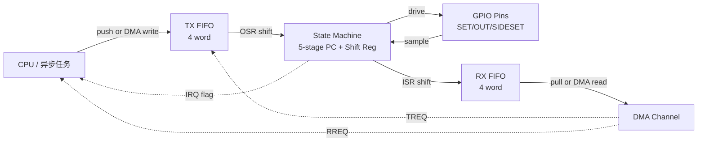

# 11 rp 平台

> 撰写:2026-06-05
> 前置:docs/08-hal-architecture.md(M3.1 HAL 通论)· docs/09-stm32.md(M3.2)· docs/10-nrf.md(M3.3)
> M3 收官篇
> 模板:ADR-004(`openspec/specs/architecture/spec.md`),7 节固定结构

---

## 目录

1. 平台概览
2. PAC 来源:rp-pac 半自动生成
3. HAL 入口:`init()` + 引导链 + 栈保护
4. 中断模型:rp2040(32 vector)vs rp235x(47 vector,含 S/NS)
5. 时间驱动:单一 TIMER 硬件,零选择
6. GPIO 外设抽象映射(rp 独有:SlewRate / Drive / Bank0 vs QSPI)
7. 平台独有特性:**PIO** / Multicore / Boot 链 / ROM 函数
8. 跨平台对比矩阵(入口)
9. 总结 + M3 系列收尾导览

---

## 1. 平台概览

### 1.1 rp 在 Embassy 生态中的位置

rp(Raspberry Pi RP 系列 SoC)是 Embassy 第三大平台 HAL,定位**极简 + PIO 灵活补外设短板**。与 stm32 / nrf 对比:

| 指标 | stm32 | nrf | rp |
|------|-------|-----|----|
| `src/` 文件数 | 216 | 60 | **64** |
| `Cargo.toml` 行数 | 1896 | 248 | **208** |
| chip feature 数量 | 800+ | 24 | **3** |
| time-driver-* feature | 18 | 2 | **0**(单一硬件,无需选)|
| 元数据生成 | stm32-data 自动 | chips/{chip}.rs 手写 | rp-pac 半自动 |
| 中断优先级位 | 4(16 级) | 3(8 级) | **2(4 级)** |

rp 是三平台中最简洁的。原因:芯片只有 RP2040 + RP2350(2024 发布的 RP235x 系列),且外设设计本身就少 — Raspberry Pi 团队的策略是**用 PIO 补少外设的短板**(详见 §7)。

### 1.2 支持的 rp 系列

`embassy-rp/Cargo.toml` 仅 3 个 chip feature:

| feature | 芯片 | 内核 | 备注 |
|---------|------|------|------|
| `rp2040` | RP2040 | Dual Cortex-M0+ @ 133MHz | 2021 发布,Raspberry Pi Pico 主流 |
| `rp235xa` | RP2350A | Dual Cortex-M33 + Dual Hazard3 RISC-V | 30 引脚封装 |
| `rp235xb` | RP2350B | 同上 | 48 引脚封装 |

`_rp235x` 是内部 cfg(`rp235xa` / `rp235xb` 共享),用来区分 rp2040 vs rp2350 的代码分支。

### 1.3 RP2350 的关键创新

RP2350(rp235x)相比 RP2040 引入两项重大变化:

- **双内核可选**:可在启动时选 Dual Cortex-M33 或 Dual Hazard3 RISC-V(同一芯片支持两种 ISA!)
- **Secure / Non-Secure 域**:基于 Cortex-M33 TrustZone,中断表分 S / NS 两套(见 §4)
- **Always-On Timer**:`aon_timer/`(53 符号),在深度睡眠下仍走
- **OTP / TRNG / PSRAM 控制**:`otp` / `trng` / `psram` / `qmi_cs1` 4 新外设
- **Boot ROM 大量扩展**:`rom_data/rp235x.rs`(34 符号 vs rp2040 17 符号)

### 1.4 src/ 子目录速览

```
pio/             PIO 状态机驱动(rp 灵魂,核心 183 符号)
pio_programs/    预制 PIO 程序库(11 个:hd44780/i2s/onewire/pwm/rotary_encoder/spi/stepper/uart/ws2812/clk/clock_divider)
float/           rp2040 软浮点(M0+ 无 FPU,7 文件,rp235x 不编译)
rom_data/        Boot ROM 中的函数(rp2040.rs 17 符号,rp235x.rs 34 符号)
aon_timer/       Always-On Timer(rp235x 独有)
datetime/        rp2040 RTC 配套(chrono 兼容,rp235x 用 aon_timer)
uart/            UART + buffered
usb/             USB device + host
rtc/             rp2040 RTC(rp235x 用 aon_timer)
+ 各外设文件:adc, dma, flash, gpio, i2c, i2c_slave, multicore, pwm, spi,
            trng, watchdog 等
+ 平台基础:lib.rs, time_driver.rs, clocks.rs, executor.rs,
        critical_section_impl.rs, spinlock.rs, spinlock_mutex.rs,
        reset.rs, fmt.rs, intrinsics.rs (rp2040), relocate.rs
+ rp235x 独有:block.rs(129 符号 IMAGE_DEF), otp, psram, qmi_cs1, trng
```

**没有 `ppi` / `dppi` 目录** — rp 没有外设互联硬件(对比 nrf §7)。
**没有 `rcc` 目录** — rp 时钟简洁,放在 `clocks.rs`(163 符号)。
**没有 chips 目录** — 用 cfg 直接在 lib.rs 区分 rp2040 vs rp235x(各自 `peripherals!` + `interrupt_mod!`)。

### 1.5 本篇关注点

- **PIO 状态机**:rp 最独特的硬件,可编程 IO,弥补外设少
- **multicore**:双核协作模型
- **boot 链**:rp2040 的 stage2 bootloader + rp235x 的 IMAGE_DEF
- **rp 寄存器特殊原子访问**:xor / set / clear 偏移寻址

---

## 2. PAC 来源:rp-pac 半自动生成

### 2.1 依赖来源

`embassy-rp/Cargo.toml`:

```toml
rp-pac = { git = "https://github.com/embassy-rs/rp-pac",
           rev = "c2e27609b021c444f634673155318977d7f0bdf6" }
rp2040-boot2 = "0.3"
rp2040 = ["rp-pac/rp2040"]
_rp235x = ["rp-pac/rp235x"]
```

- `rp-pac`:Embassy 团队维护的统一 PAC,从官方 SVD 半自动生成(类似 stm32-metapac 但只 2 个 chip 不需要 metadata 抽象层)
- `rp2040-boot2`:第 2 阶段引导库(rp2040 必需,详见 §3.4)
- `rp235xa` / `rp235xb` 都启用 `_rp235x`,后者再启用 `rp-pac/rp235x`

### 2.2 rp 寄存器特殊原子访问

rp 硬件提供一个**独家寄存器映射技巧**:`embassy-rp/src/lib.rs:719-774` 定义 `RegExt` trait,通过寄存器地址加偏移实现原子操作:

```rust
trait RegExt<T: Copy> {
    fn write_xor<R>(&self, f: impl FnOnce(&mut T) -> R) -> R;
    fn write_set<R>(&self, f: impl FnOnce(&mut T) -> R) -> R;
    fn write_clear<R>(&self, f: impl FnOnce(&mut T) -> R) -> R;
}

impl<T: Default + Copy, A: pac::common::Write> RegExt<T> for pac::common::Reg<T, A> {
    fn write_xor<R>(&self, f: impl FnOnce(&mut T) -> R) -> R {
        // ... ptr.add(0x1000) 是 XOR 别名
        let ptr = (self.as_ptr() as *mut u8).add(0x1000) as *mut T;
        ptr.write_volatile(val);
    }
    fn write_set<R>(...)   { /* 偏移 0x2000:SET   别名 */ }
    fn write_clear<R>(...) { /* 偏移 0x3000:CLEAR 别名 */ }
}
```

**RP 硬件设计**:每个寄存器的地址实际占 16 KB(0x4000),其中:
- 偏移 +0x0000:普通读/写
- 偏移 +0x1000:写入时 **XOR** 当前值
- 偏移 +0x2000:写入时 **OR**(置位)
- 偏移 +0x3000:写入时 **AND NOT**(清位)

收益:**任意位写不需要 read-modify-write**(避免中断和多核 race),硬件原子完成。Cortex-M 没有 bit-banding 的替代物,rp 这套别名映射是更优雅的方案,被 RegExt 封装后整 HAL 都能享受到。

stm32 / nrf 没有这个机制,只能用 `read | modify | write` + `cortex_m::interrupt::free` 包临界区。

### 2.3 stm32 vs nrf vs rp PAC 哲学对比

| 维度 | stm32 | nrf | rp |
|------|-------|-----|----|
| 来源 | stm32-data YAML 元数据 → 自动生成 | nrf-pac(svd2rust 半自动)+ chips/{chip}.rs 手写 | rp-pac(svd2rust 半自动) |
| 抽象层级 | 三层(SVD → 元数据 → PAC + metadata API) | 一层 PAC + 手写描述 | 一层 PAC |
| 加新 chip | 改元数据 → 自动 | 手写 chips/{chip}.rs | 改 rp-pac SVD |
| 适合场景 | SKU 极多 | SKU 少,设计差异化大 | SKU 少且高度一致 |

rp 是三平台中**最薄抽象**的 — 因为只有 3 chip,完全不需要元数据驱动那种复杂度。

---

## 3. HAL 入口:`init()` + 引导链 + 栈保护

### 3.1 极简 Config

`embassy-rp/src/lib.rs:593-617`:

```rust
pub mod config {
    use crate::clocks::ClockConfig;

    #[non_exhaustive]
    pub struct Config {
        pub clocks: ClockConfig,
    }

    impl Default for Config {
        fn default() -> Self {
            Self {
                clocks: ClockConfig::crystal(12_000_000),   // Pico 板载 12MHz 晶振
            }
        }
    }
}
```

**只有 1 个字段** `clocks`(`ClockConfig`)。对比 stm32 H7 的几十个 PLL 字段、nrf 的 HFCLK + LFCLK + DCDC 配置,rp 极简到几乎"无配置"。`ClockConfig::crystal(12_000_000)` 直接用 12MHz 晶振 + 内部默认 PLL 分频跑到 125MHz / 150MHz。

### 3.2 init() 流程

`embassy-rp/src/lib.rs:624-638`:

```rust
pub fn init(config: config::Config) -> Peripherals {
    // 先取单例,这样第二次 init() 会 panic(早期检测)
    let peripherals = Peripherals::take();

    unsafe {
        clocks::init(config.clocks);      // 配 PLL + 系统时钟
        #[cfg(feature = "time-driver")]
        time_driver::init();              // 启动 TIMER
        dma::init();                      // DMA 初始化
        gpio::init();                     // GPIO 整体初始化
    }

    peripherals
}
```

注意 `Peripherals::take()` 放在最前 — **早期检测重复 init**。stm32 / nrf 是最后取。设计取舍:rp 想让"重入"立刻 panic 而非走完所有 init 之后才报错。

### 3.3 `pre_init` 钩子:SIO 重置 quirk

源码 `embassy-rp/src/lib.rs:640-702` 用 `#[cortex_m_rt::pre_init]` 注入启动前钩子,处理 rp **硬件特有 quirk**:

```rust
#[cfg(feature = "rt")]
#[cortex_m_rt::pre_init]
unsafe fn pre_init() {
    // SIO does not get reset when core0 is reset with either `scb::sys_reset()` or with SWD.
    // 引用注释:"This is considered Working As Intended"

    #[cfg(feature = "rp2040")]
    {
        pac::PSM.frce_on().write_and_wait(|w| { w.set_proc0(true); });
        pac::PSM.frce_off().write_and_wait(|w| {
            w.set_sio(true);
            w.set_proc1(true);
        });
        pac::PSM.frce_off().write_and_wait(|_| {});
        pac::PSM.frce_on().write_and_wait(|_| {});
    }

    #[cfg(feature = "_rp235x")]
    {
        pac::SIO.spinlock(31).write_value(1);   // 直接解锁 spinlock31(critical-section 用)
        pac::PSM.frce_off().write_and_wait(|w| w.set_proc1(true));
        enable_actlr_extexclall();                // 允许跨核原子操作
    }
}
```

**问题背景**(注释):SIO 在 `sys_reset()` 后**不会自动重置**,导致 critical-section 用的 spinlock 31 可能在重启后仍处于"locked"状态,新 boot 会卡死。`pre_init` 强制重置 SIO 解决。

这种 chip 特有 quirk 用 `pre_init` 在 Rust 标准 entry 之前接管,体现了 rp 硬件设计的"够用但不完美",HAL 需要主动补救。

### 3.4 rp2040 引导链:Stage2 Bootloader

rp2040 启动时从 ROM 跳到 flash 第 256 字节 — 这就是 **Stage2 bootloader**,任务是配置 XIP flash 控制器(QSPI 参数因 flash 厂商而异)。Embassy 用 `select_bootloader!` 宏让用户按 flash 厂商选(`lib.rs:453-480`):

```rust
select_bootloader! {
    "boot2-at25sf128a"  => BOOT_LOADER_AT25SF128A,
    "boot2-gd25q64cs"   => BOOT_LOADER_GD25Q64CS,
    "boot2-generic-03h" => BOOT_LOADER_GENERIC_03H,
    "boot2-is25lp080"   => BOOT_LOADER_IS25LP080,
    "boot2-ram-memcpy"  => BOOT_LOADER_RAM_MEMCPY,
    "boot2-w25q080"     => BOOT_LOADER_W25Q080,         // 默认,Pico 板载
    "boot2-w25x10cl"    => BOOT_LOADER_W25X10CL,
    default => BOOT_LOADER_W25Q080
}
```

用户在 Cargo.toml 选 feature,bootloader 自动放在 link section `.boot2`(链接脚本指定到 flash 起始的 256 字节)。

### 3.5 rp235x 引导链:IMAGE_DEF

rp235x 用 ARM Cortex-M33 TrustZone,有自己的可执行镜像格式 `IMAGE_DEF`(`embassy-rp/src/block.rs`,129 符号)。`lib.rs:482-504`:

```rust
select_imagedef! {
    "imagedef-secure-exe"    => secure_exe,
    "imagedef-nonsecure-exe" => non_secure_exe,
    default => secure_exe
}
```

用户选 Secure 或 Non-Secure 入口,镜像头自动放在 `.start_block` section。Boot ROM 验证镜像签名后跳转。

### 3.6 栈保护:`install_core0_stack_guard()`

`embassy-rp/src/lib.rs:506-572` 提供栈溢出保护工具:

```rust
pub fn install_core0_stack_guard() -> Result<(), ()> {
    unsafe extern "C" {
        static mut _stack_end: usize;
    }
    unsafe { install_stack_guard(core::ptr::addr_of_mut!(_stack_end)) }
}
```

实现因 chip 而异:

- **rp2040**(M0+):用 MPU region 0(`_stack_end` 处 32 字节"绝不可访问"区,踩到立刻 HardFault)
- **rp235x**(M33):用 `MSPLIM` 寄存器(M33 新增,硬件检测栈指针下越界)

`CORE1` 栈保护**自动配置**,只 CORE0 需用户手动调。这种"每核独立栈保护"是 rp 多核场景的关键安全设计。

---

## 4. 中断模型:rp2040(32 vector)vs rp235x(47 vector,含 S/NS)

M3.1 §5 / M3.2 §4 / M3.3 §4 已讲过 typelevel 三件套和 `bind_interrupts!`,本节只补 **rp 特有**:两套互斥中断表 + RP2350 安全域 + SWI。

### 4.1 两套独立中断表

rp 的 `interrupt_mod!` 因 chip 不同分两套(`embassy-rp/src/lib.rs:78-162`):

```rust
#[cfg(feature = "rp2040")]
embassy_hal_internal::interrupt_mod!(
    TIMER_IRQ_0, TIMER_IRQ_1, TIMER_IRQ_2, TIMER_IRQ_3,   // 4 个 timer 通道
    PWM_IRQ_WRAP,
    USBCTRL_IRQ,
    PIO0_IRQ_0, PIO0_IRQ_1, PIO1_IRQ_0, PIO1_IRQ_1,        // 2 PIO × 2 IRQ
    DMA_IRQ_0, DMA_IRQ_1,
    IO_IRQ_BANK0, IO_IRQ_QSPI,                              // GPIO 中断:Bank0 + QSPI
    SIO_IRQ_PROC0, SIO_IRQ_PROC1,                           // 双核通信
    SPI0_IRQ, SPI1_IRQ, UART0_IRQ, UART1_IRQ,
    I2C0_IRQ, I2C1_IRQ, ADC_IRQ_FIFO, RTC_IRQ,
    SWI_IRQ_0 ... SWI_IRQ_5,                                // 6 个 software interrupt
);   // 共 32 个

#[cfg(feature = "_rp235x")]
embassy_hal_internal::interrupt_mod!(
    TIMER0_IRQ_0..3, TIMER1_IRQ_0..3,                       // 2 个 timer × 4 通道
    PWM_IRQ_WRAP_0, PWM_IRQ_WRAP_1,
    PIO0_IRQ_0, PIO0_IRQ_1, PIO1_IRQ_0..1, PIO2_IRQ_0..1,   // 3 PIO!(rp2040 只 2)
    IO_IRQ_BANK0, IO_IRQ_BANK0_NS,                          // GPIO 中断:Secure + Non-Secure
    IO_IRQ_QSPI, IO_IRQ_QSPI_NS,
    SIO_IRQ_FIFO, SIO_IRQ_BELL,                             // 新设计:不区分 core
    SIO_IRQ_FIFO_NS, SIO_IRQ_BELL_NS,                       // 同上 Secure 版
    PLL_SYS_IRQ, PLL_USB_IRQ,                               // 新外设
    POWMAN_IRQ_POW, POWMAN_IRQ_TIMER,
    TRNG_IRQ,
    SWI_IRQ_0 ... SWI_IRQ_5,
);   // 共 47 个
```

**主要差异**:

- **3 PIO 块**(rp2040 只 2):rp235x 多一个 PIO,可同时跑更多 PIO 状态机
- **TIMER 翻倍**:`TIMER0` + `TIMER1`,各 4 通道
- **Secure / Non-Secure 域**:`IO_IRQ_BANK0` + `IO_IRQ_BANK0_NS`(TrustZone 隔离),同名外设两个 vector
- **新外设中断**:`POWMAN`(电源管理)、`TRNG`、独立 `PLL_SYS_IRQ`/`PLL_USB_IRQ`(rp2040 没有 PLL 中断)
- **SIO 中断结构变化**:rp2040 是 `SIO_IRQ_PROC0` / `SIO_IRQ_PROC1`(按核分),rp235x 是 `SIO_IRQ_FIFO` / `SIO_IRQ_BELL`(按功能分),更通用

### 4.2 SWI(软件中断):InterruptExecutor 的载体

两套都有 `SWI_IRQ_0 ... SWI_IRQ_5` 共 6 个软件中断。这些是 ARM Cortex-M 提供的"无硬件源"中断 vector,**用户可通过 `NVIC::pend(SWI_IRQ_X)` 主动触发**。

在 Embassy 中典型用途:**`InterruptExecutor` 借用 SWI vector** 实现"软件触发的优先级化任务调度"。回顾 M2.1 §5,`InterruptExecutor` 是相对 `ThreadMode` 的高优先级执行器,绑定到中断 vector 上跑。rp 上典型代码:

```rust
use embassy_rp::interrupt;

static EXECUTOR_HIGH: InterruptExecutor = InterruptExecutor::new();

#[interrupt]
unsafe fn SWI_IRQ_0() {
    EXECUTOR_HIGH.on_interrupt()
}
```

6 个 SWI 让 rp 应用可同时配多个不同优先级 InterruptExecutor(用于实时控制 / 网络处理 / 业务逻辑等不同响应需求)。

### 4.3 中断优先级:`prio-bits-2`(4 级)

`embassy-rp/Cargo.toml`:

```toml
embassy-hal-internal = { ..., features = ["cortex-m", "prio-bits-2"] }
```

2 位 = 4 级。**三平台中最少**(stm32 16 / nrf 8 / rp 4),Cortex-M0+ 限制。RP2350 的 M33 硬件支持 8 位,但 Embassy 仍取 2 位以保持 rp2040 兼容性(优先级值在两 chip 间可移植)。

实际应用:4 级通常足够分(P0 系统/RT、P1 高 IO、P2 普通 IO、P3 低优)。

### 4.4 `bind_interrupts!` 宏:与 stm32/nrf 一致

`embassy-rp/src/lib.rs:184-225` 定义 `bind_interrupts!` 宏,机制与 stm32 / nrf 完全一致(M3.2 §4.1 已讲 `$crate` 宏卫生原因)。用户用法:

```rust
bind_interrupts!(struct Irqs {
    USBCTRL_IRQ => usb::InterruptHandler<peripherals::USB>;
    I2C0_IRQ    => i2c::InterruptHandler<peripherals::I2C0>;
    PIO0_IRQ_0  => pio::InterruptHandler<peripherals::PIO0>;
});
```

---

## 5. 时间驱动:单一 TIMER 硬件,零选择

### 5.1 0 个 time-driver-* feature

`embassy-rp/Cargo.toml` 没有任何 `time-driver-*` feature。Cargo.toml 中只有一个开关:

```toml
time-driver = []   # 启用 time driver(默认开)
```

对比:stm32 18 个、nrf 2 个、rp 0 个(单一实现,无选择空间)。

### 5.2 直接用 TIMER 硬件

`embassy-rp/src/time_driver.rs:1-35`(只 35 符号,极简):

```rust
use embassy_time_driver::Driver;
use embassy_time_queue_utils::Queue;
#[cfg(feature = "rp2040")]
use pac::TIMER;
#[cfg(feature = "_rp235x")]
use pac::TIMER0 as TIMER;   // rp235x 用 TIMER0(还有 TIMER1 可给用户)

struct TimerDriver {
    alarms: Mutex<CriticalSectionRawMutex, AlarmState>,
    queue:  Mutex<CriticalSectionRawMutex, RefCell<Queue>>,
}

embassy_time_driver::time_driver_impl!(static DRIVER: TimerDriver = TimerDriver { ... });

impl Driver for TimerDriver {
    fn now(&self) -> u64 {
        loop {
            let hi  = TIMER.timerawh().read();
            let lo  = TIMER.timerawl().read();
            let hi2 = TIMER.timerawh().read();
            if hi == hi2 {                          // 防止 high half 在两次读之间翻转
                return ((hi as u64) << 32) | (lo as u64);
            }
        }
    }
    // schedule_wake: 写 ALARM 寄存器 + 排队 waker
}
```

**TIMER 硬件**已经是 64-bit 计数器(高 32 位 + 低 32 位),不需要 software 扩展。`now()` 只是组合两个寄存器读 — 经典"double read 防 race"模式确保拿到一致的 64-bit 值。

### 5.3 频率与 alarm 数

- **频率**:1 MHz(固定,由 watchdog 子系统提供 1us tick)
- **Alarm 数量**:rp2040 有 4 个(`TIMER_IRQ_0~3`),rp235x 有 4 个 × 2 timer = 8 个

Embassy 用 1 个 alarm 给 time driver(其余留给用户)。`embassy-time-queue-utils::Queue` 负责把多个 pending `Timer::after(...)` 排队,只把最近一个写到硬件 alarm。

### 5.4 rp235x 的 AON Timer(独立电源域)

rp235x 额外有 **Always-On Timer**(`embassy-rp/src/aon_timer/mod.rs`,53 符号),在深度睡眠 / Power Down 模式下仍走 — 类似 nrf 的 RTC 但精度更高。Embassy 时间驱动目前**仍用 TIMER0**(简单 + 可移植),AON Timer 留给用户直接用(典型场景:RTC、长时间睡眠唤醒)。

### 5.5 RTC 子系统(rp2040 独有)

rp2040 有专门 RTC 外设(`embassy-rp/src/rtc/`,3 文件),挂在 32.768 kHz 低速时钟下。仅用于"日期时间"语义,不用于 `Timer::after`(那是 TIMER 的工作)。rp235x 去掉了 RTC,改用 AON Timer 兼任时间和日历。

---

## 6. GPIO 外设抽象映射(rp 独有部分)

M3.1 §7 已讲共性,M3.2 §6 / M3.3 §6 已讲 stm32 / nrf 独有,本节只补 **rp 独有**:`SlewRate` / `Drive` 强度 / Bank0 vs QSPI 引脚。

### 6.1 `SlewRate`:翻转速率 2 档

```rust
// embassy-rp/src/gpio.rs 内部
pub enum SlewRate {
    Fast,    // 快速翻转,适合高速信号(SPI、PIO 高速)
    Slow,    // 慢速翻转,降低 EMI(普通 IO、按键)
}
```

只 2 档,比 stm32 的 4 档 `Speed`(M3.2 §6.1)粗粒度,但够用。

### 6.2 `Drive`:驱动电流 4 档

```rust
pub enum Drive {
    _2mA,
    _4mA,
    _8mA,
    _12mA,
}
```

4 档驱动强度,类似 nrf 的 `OutputDrive` 但接口更直白(直接给电流值)。`Drive::_12mA` 推 LED 或要驱动较强阻抗负载。

### 6.3 Bank0 vs QSPI 引脚分类

rp 把 GPIO 物理分两个 bank:

- **Bank0**:`PIN_0 ~ PIN_29`(rp2040)/ `PIN_0 ~ PIN_47`(rp235xb)— 通用 GPIO,用户主战场
- **QSPI**:`PIN_QSPI_SCLK / SS / SD0 ~ SD3` — 默认接外部 flash,做 GPIO 通常意味着"不用 flash 跑代码,程序在 RAM"

两 bank 在 NVIC 中是**独立中断**(`IO_IRQ_BANK0` / `IO_IRQ_QSPI`,见 §4.1)。用户碰 QSPI bank 需要明白后果(必须 boot to RAM)。

源码 `embassy-rp/src/gpio.rs` 215 符号(比 stm32 / nrf 都大),原因之一是要处理 PIO 占用 GPIO(详见 §7)、bank 切换、SWD 引脚保护(PIN_SWCLK / SWDIO 默认拒绝普通 GPIO 使用,需 unsafe 解锁)。

### 6.4 GPIO 中断:走 `IO_IRQ_BANK0` 共享 vector

rp 不像 stm32 给每个 EXTI 独立 vector,也不像 nrf 用 8 个 GPIOTE channel — **整个 Bank0 共享一个 `IO_IRQ_BANK0` 中断**,handler 自己读 INTR 寄存器找出哪个引脚触发。

代价:多引脚同时触发时 handler 需逐个检查;收益:节省 vector 数量(rp 总 vector 才 32),硬件资源约束下的合理设计。

API 上仍是 `pin.wait_for_rising_edge().await` 一样的语法,实现细节对用户透明。

### 6.5 PIO 抢占 GPIO 引脚

rp 最大的 GPIO 特性差异:**PIO 可以把某些引脚劫持去跑状态机程序**(参 §7)。被 PIO 占用的引脚由 PIO 的 PINCTRL 寄存器控制,普通 GPIO API 写它们无效。Embassy HAL 用 `PioPin` 类型把 PIO 借用的引脚标记出来,防止用户在两侧同时操作。

---

## 7. 平台独有特性:PIO / Multicore / Boot 链 / ROM 函数

### 7.1 PIO:rp 的灵魂

**PIO**(Programmable I/O)是 RP 系列最独特的硬件 — **用户可编写汇编程序在 PIO 状态机内跑,实现任意 IO 协议**。这弥补了 rp 外设少(只有 SPI / I2C / UART / PWM 这些基础)的短板。

#### 7.1.1 PIO 硬件简介

```
RP2040:  2 个 PIO block × 4 个 state machine each = 8 个 SM
RP2350:  3 个 PIO block × 4 个 state machine each = 12 个 SM
```

每个 state machine 是一个 **5-instruction-deep program counter + 32-bit shift register + TX/RX FIFO** 的小型可编程引擎,跑 PIO 汇编(9 条指令,每条 16 bit)。可以:

- 任意位/字节模式输入输出引脚
- 独立时钟分频(2 字节精度 + 8 bit fraction)
- 通过 DMA 与 CPU 解耦,持续吞吐数据
- 互相同步(IRQ 标志位互通)

典型用途:**WS2812 RGB LED 时序、HD44780 LCD、I2S 音频、1-Wire、SDIO、HDMI 信号生成、伺服编码器** — 凡是芯片没原生支持的协议,都能用 PIO 跑。

#### 7.1.2 Embassy PIO 抽象层

`embassy-rp/src/pio/mod.rs:1-30` 引入 PIO 汇编 crate `pio` 并提供 Rust 安全包装:

```rust
use embassy_hal_internal::{Peri, PeripheralType};
use embassy_sync::waitqueue::AtomicWaker;
use fixed::FixedU32;
use fixed::types::extra::U8;
use pio::{Program, SideSet, Wrap};

use crate::dma::{self, Transfer, Word};
use crate::gpio::{self, AnyPin, Drive, Level, Pull, SealedPin, SlewRate};
use crate::interrupt::typelevel::{Binding, Handler, Interrupt};
use crate::relocate::RelocatedProgram;

pub struct Wakers([AtomicWaker; 12]);
// 4 个 FIFO IN waker + 4 个 FIFO OUT waker + 4 个 IRQ waker
```

`Wakers` 数组是 12 个 — 4 FIFO IN(每 SM 一个)+ 4 FIFO OUT + 4 IRQ。每个 SM 等待 FIFO 空/满或 IRQ 时都注册自己的 waker,由 PIO 中断 handler 触发 wake。

#### 7.1.3 PIO 数据流



`OSR`(Output Shift Register)+ `ISR`(Input Shift Register)是 SM 内部寄存器,PIO 汇编通过 `OUT` / `IN` / `PULL` / `PUSH` 指令操作。FIFO 与 DMA 的 TREQ/RREQ 信号让 DMA 自动按 SM 节奏搬数据,**CPU 完全旁观**(类似 nrf PPI 的思路,但实现方式更灵活)。

#### 7.1.4 PIO API 形状

```rust
// 用户视角(简化):
let Pio { mut common, sm0, sm1, sm2, sm3, .. } = Pio::new(p.PIO0, Irqs);

// 加载 PIO 程序到 PIO block 内存
let prg = common.load_program(&assembled_program);

// 配置一个 state machine
let mut cfg = Config::default();
cfg.use_program(&prg, &[/* side-set pins */]);
cfg.set_out_pins(&[common.make_pio_pin(p.PIN_25)]);
cfg.shift_in.direction = ShiftDirection::Left;
sm0.set_config(&cfg);
sm0.set_enable(true);

// 与 DMA 配合传数据
sm0.tx().dma_push(p.DMA_CH0.reborrow(), &mut tx_buf).await;
```

`Common` 持有 PIO block 的"共享资源"(指令存储器、IRQ),`StateMachine` 持有单个 SM。Embassy 借生命周期保证用户不会同时用一个 SM 跑两个程序。

#### 7.1.4 `pio_programs/`:预制 PIO 程序库

`embassy-rp/src/pio_programs/`(11 文件)是开箱即用的 PIO 程序集合:

| 文件 | 实现 |
|------|------|
| `ws2812.rs`(27 符号)| WS2812B RGB / RGBW LED 控制 |
| `i2s.rs`(26 符号)| I2S 音频(rp 无 I2S 外设,必须 PIO)|
| `uart.rs`(23 符号)| 软件 UART(rp 只 2 个硬件 UART,扩展用)|
| `spi.rs`(50 符号)| 软件 SPI |
| `onewire.rs`(20 符号)| Dallas 1-Wire(DS18B20 等)|
| `hd44780.rs`(11 符号)| 字符 LCD 时序 |
| `stepper.rs`(18 符号)| 步进电机驱动 |
| `rotary_encoder.rs`(13 符号)| 旋转编码器 |
| `pwm.rs`(17 符号)| 软件 PWM(扩展硬件 PWM)|
| `clk.rs` + `clock_divider.rs` | 时钟输出 / 分频 |

**这就是 rp 的"外设补全"策略** — 硬件不够,PIO 补,且 Embassy 把流行需求做成预制库,用户直接用。

#### 7.1.5 与 nrf PPI 的思路对比

| 维度 | nrf PPI/DPPI | rp PIO |
|------|--------------|--------|
| 目的 | 外设互联,event → task | 用户可编程 IO 协议 |
| 灵活性 | 硬件固定:连接已有 event/task | 软件可编程:任意时序 |
| 谁出力 | 硬件全自动 | PIO 状态机(独立 CPU)|
| 资源占用 | PPI channel(32)+ GPIOTE channel(8) | PIO 程序内存(每 block 32 指令)+ SM(4 个/block)|
| 学习成本 | 低(配置即可)| 高(要学 PIO 汇编)|

两者都属"减少 CPU 介入"的设计哲学,但**实现层次不同**:nrf 在硬件电路层让外设互联,rp 在指令层让用户编程 IO。

### 7.2 Multicore:双核 + Stack 隔离

rp 是三平台中**唯一原生支持多核应用框架**的(stm32 只 H7 / WB 系列有双核且 Embassy 未集成,nrf 53 也有双核但走 IPC)。源码 `embassy-rp/src/multicore.rs`(35 符号)。

#### 7.2.1 用户视角

```rust
use embassy_rp::multicore::{spawn_core1, Stack};
use static_cell::StaticCell;

static mut CORE1_STACK: Stack<4096> = Stack::new();
static EXECUTOR0: StaticCell<Executor> = StaticCell::new();
static EXECUTOR1: StaticCell<Executor> = StaticCell::new();

#[cortex_m_rt::entry]
fn main() -> ! {
    let p = embassy_rp::init(Default::default());

    spawn_core1(p.CORE1, unsafe { &mut *addr_of_mut!(CORE1_STACK) }, move || {
        let executor1 = EXECUTOR1.init(Executor::new());
        executor1.run(|spawner| spawner.spawn(core1_task()).unwrap());
    });

    let executor0 = EXECUTOR0.init(Executor::new());
    executor0.run(|spawner| spawner.spawn(core0_task()).unwrap())
}
```

`spawn_core1` 是个**普通函数**而不是 async — 它实际是底层启动 SIO 的 core1 启动序列,把闭包入口写进 FIFO,core1 启动后从 FIFO 取入口跳转。

#### 7.2.2 跨核通信

`embassy-rp/src/multicore.rs:8-10` 注释:

> Enable the `critical-section-impl` feature in embassy-rp when sharing data across cores using the `embassy-sync` primitives and `CriticalSectionRawMutex`.

**核间共享数据需要 critical-section 实现**(SIO spinlock 31 兜底)。`embassy-sync::Channel<CriticalSectionRawMutex, T, N>` 等原语就能跨核工作。这建立在 §3.3 `pre_init` 重置 SIO 的 quirk 处理之上。

#### 7.2.3 CoreId 查询

```rust
pub enum CoreId {
    Core0 = 0x0,
    Core1 = 0x1,
}

// embassy-rp::multicore::core_id() 返回当前正在执行的核
```

任务可以查自己跑在哪个核上(典型应用:核绑定的日志染色、性能计数器)。

#### 7.2.4 RP2350 多核 + 多 ISA

rp235x 更复杂:同一芯片上有 **Dual Cortex-M33 + Dual Hazard3 RISC-V**,启动时只能用一种(由 IMAGE_DEF 中的 entry 选)。Embassy 当前只支持 Cortex-M33 模式,RISC-V 模式留给未来。

### 7.3 ROM 函数:节省 flash 的官方策略

rp 在 Boot ROM 中预置了一组常用函数(memcpy / popcount / 平方根 等),`embassy-rp/src/rom_data/`(2 文件)提供 Rust 包装:

- `rp2040.rs`(17 符号):basic ROM functions
- `rp235x.rs`(34 符号):扩展集(rp235x ROM 提供更多)

用户调用如 `rom_data::memcpy44(...)` 不占用 flash 空间(函数体在 ROM 里)。对极小 flash 应用(rp235x 只有 0~520KB on-die flash + 外部 QSPI flash)是重要优化。

### 7.4 软浮点:rp2040 必备

rp2040 是 Cortex-M0+,**无 FPU**。`embassy-rp/src/float/`(7 文件)提供软件浮点实现,绑定到 `__addsf3` / `__mulsf3` 等 LLVM 标准符号上(通过 `intrinsics.rs` 暴露)。这样应用代码写 `f32 + f32` 编译后自动用这套实现,**无需 libm 依赖**。

rp235x 是 Cortex-M33 + FPU,float 子模块 `#[cfg(feature = "rp2040")]` 不编译。

### 7.5 外设模块快速概览

| 类别 | 模块 |
|------|------|
| 通信 | `uart`(+ buffered)、`spi`、`i2c` / `i2c_slave`、`usb`(device + host) |
| 模拟 | `adc`、`trng`(rp235x 独有 TRNG)|
| 计时 | `pwm`、`watchdog`、`rtc`(rp2040)、`aon_timer`(rp235x)|
| 存储 | `flash`(XIP 内嵌)、`otp`(rp235x)、`psram`(rp235x)、`qmi_cs1`(rp235x 第二 QMI)|
| 系统 | `multicore`、`reset`、`bootsel`、`rom_data`、`block`(rp235x IMAGE_DEF)|
| 同步 | `spinlock`(SIO 32 个硬件 spinlock)、`spinlock_mutex` |

详见 `embassy-rp/src/lib.rs:23-66`。

---

## 8. 跨平台对比矩阵(入口)

完整对比表见 ADR-004(`openspec/specs/architecture/spec.md`)。rp 在 4 个对比维度上的位置:

| 维度 | rp 位置 |
|------|---------|
| 异步化策略 | 中断 + waker 为主;PIO 状态机可独立运行减少 CPU 介入;dual-core 用 SIO_FIFO 通信 |
| 时钟与时间驱动 | 极简:0 个 time-driver feature(单一 TIMER 硬件,1MHz);rp2040 RTC / rp235x AON Timer 备用 |
| DMA 抽象 | 单 DMA controller,12 channel(rp2040)/ 16 channel(rp235x);简单 `Channel` 抽象 |
| PAC 生成 | rp-pac 半自动(svd2rust + 少量手补),无元数据驱动 |

特别亮点(三平台中独有):

- **PIO**:可编程 IO 状态机,弥补外设少(stm32 / nrf 无等价物)
- **Stage2 bootloader**(rp2040):用户按 flash 厂商选 boot loader
- **Multicore**:Embassy 原生支持双核应用框架(stm32 / nrf 双核需走 IPC,集成度不如 rp)
- **ROM 函数**:节省 flash(rp 独有官方策略)
- **寄存器 XOR/SET/CLEAR 别名**:硬件原子位写,无需 read-modify-write
- **dual-ISA**(rp235x):Cortex-M33 / Hazard3 RISC-V 任选

---

## 9. 总结 + M3 系列收尾导览

### 9.1 本篇核心要点

| 要点 | 一句话总结 |
|------|------------|
| 极简体量 | 64 文件 / 208 行 Cargo / 3 chip(rp2040 + rp235xa/b)|
| `RegExt` xor/set/clear | rp 硬件别名映射实现原子位写,Cortex-M 通用替代 bit-banding |
| Stage2 bootloader | rp2040 用户按外部 flash 厂商选 boot loader,链接到 .boot2 |
| IMAGE_DEF | rp235x Cortex-M33 + TrustZone,镜像头放 .start_block,选 Secure/NonSecure |
| `pre_init` SIO 重置 | rp 硬件 quirk:sys_reset 不重置 SIO,需 pre_init 钩子修复 |
| 双中断表 | rp2040 32 vector / rp235x 47 vector(含 S/NS 域)|
| time-driver 0 feature | 单一 TIMER 硬件 64-bit,no choice no headache |
| `PIO` | rp 灵魂,可编程 IO 状态机,弥补外设少(配 pio_programs 库)|
| Multicore | 原生双核框架,`spawn_core1` + 跨核 channel(critical-section-impl)|
| ROM functions | Boot ROM 提供 memcpy / popcount 等,节省 flash |
| 软浮点 | rp2040 (M0+ 无 FPU) 自带 `float/` 实现,自动绑 LLVM 符号 |

### 9.2 M3 系列(3 平台)横向对比总结

| 维度 | stm32 | nrf | rp |
|------|-------|-----|----|
| **设计哲学** | 外设全 + 世代多 + 抽象厚 | 集成度高 + 互联强 + 外设异步原生 | 极简 + PIO 灵活补外设短板 |
| **代码体量** | 216 文件 / 1896 Cargo / 3042 build | 60 文件 / 248 Cargo / 0 build | 64 文件 / 208 Cargo / build.rs |
| **chip 数** | 800+ | 24 | 3 |
| **元数据机制** | stm32-data 自动 | chips/{chip}.rs 手写 | rp-pac 半自动 |
| **time-driver feature** | 18 | 2 | 0 |
| **优先级位** | 4 (16级) | 3 (8级) | 2 (4级) |
| **外设互联** | 无硬件互联(全 CPU) | PPI/DPPI(无 CPU) | 无硬件 + PIO 状态机替代 |
| **DMA** | DMA/BDMA/GPDMA 三栈 + aligned | EasyDMA(外设自带) | 单 DMA(12/16 channel)|
| **集成无线** | 仅 STM32WB | nrf52/53/54L 全集成 BLE/802.15.4 | 无(需外挂 cyw43)|
| **多核** | 仅 H7/WB(未原生集成) | nrf53 双核 + IPC | 原生 spawn_core1 框架 |
| **可编程 IO** | 无 | 无 | **PIO**(独家) |
| **Bootloader** | 简单(片内 ROM) | 简单(片内 ROM) | rp2040 stage2 选 flash 厂商 |

### 9.3 M3 完结,接下来读哪里

**M3 系列 4 篇全部完成(M3.1 + M3.2 + M3.3 + M3.4)**:

```
docs/08-hal-architecture.md  M3.1 HAL 通论
docs/09-stm32.md             M3.2 stm32 平台
docs/10-nrf.md               M3.3 nrf 平台
docs/11-rp.md                M3.4 rp 平台(本篇)
```

接下来:

- **M4 外设驱动**(`docs/12-gpio.md` ~ `docs/16-timer.md`):聚焦"同一外设在 3 平台的实现差异",带着 M3 的横向对比意识读
- **M5 网络通信**(`docs/17-net.md` ~ `docs/20-lora.md`):embassy-net / embassy-usb / BLE / LoRa
- **examples/**:挑你想要的 chip(rp 推荐 rp2040 + Pico,nrf 推荐 nrf52840-DK,stm32 推荐 stm32f4-discovery 或 stm32h7)上手

---

## 参考

源码:

- `embassy-rp/src/lib.rs`(顶层入口、双中断表、`bind_interrupts!`、`peripherals!`、`select_bootloader!`、`select_imagedef!`、`pre_init`、`install_core0_stack_guard`、`RegExt` xor/set/clear)
- `embassy-rp/Cargo.toml`(208 行,3 chip feature)
- `embassy-rp/src/pio/{mod,instr}.rs`(PIO 驱动核心,183 + 12 符号)
- `embassy-rp/src/pio_programs/{ws2812,i2s,uart,spi,onewire,hd44780,stepper,rotary_encoder,pwm,clk,clock_divider}.rs`(预制 PIO 程序库)
- `embassy-rp/src/multicore.rs`(35 符号,`spawn_core1` + `CoreId`)
- `embassy-rp/src/time_driver.rs`(35 符号,TIMER / TIMER0 + 64-bit 直读)
- `embassy-rp/src/gpio.rs`(215 符号,SlewRate + Drive + Bank0/QSPI)
- `embassy-rp/src/rom_data/{rp2040,rp235x}.rs`(Boot ROM 函数包装)
- `embassy-rp/src/float/{*}.rs`(rp2040 软浮点)
- `embassy-rp/src/block.rs`(rp235x IMAGE_DEF,129 符号)
- `embassy-rp/src/aon_timer/mod.rs`(rp235x AON Timer)

规划与平行篇:

- ADR-004(`openspec/specs/architecture/spec.md`,M3 文档系列统一规划)
- `docs/08-hal-architecture.md`(M3.1 HAL 通论)
- `docs/09-stm32.md`(M3.2 stm32)
- `docs/10-nrf.md`(M3.3 nrf)

