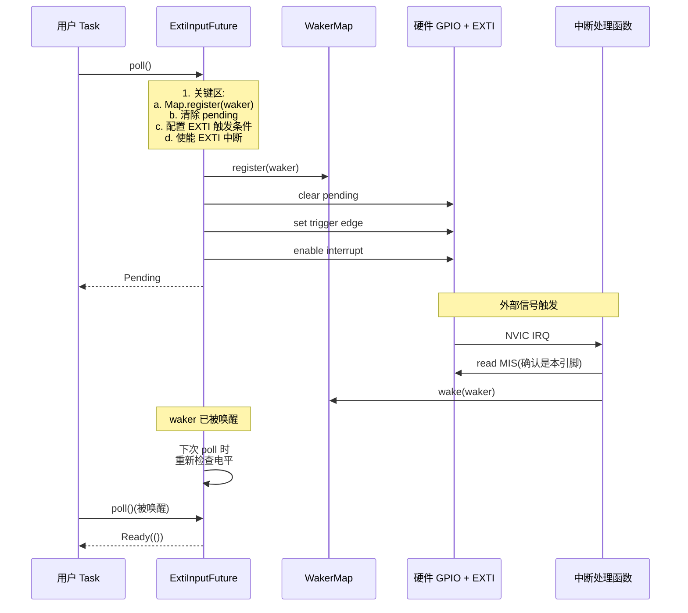

# 12. GPIO 与中断机制

> 撰写:2026-06-05
> 前置:`docs/08-hal-architecture.md`(M3.1 HAL 架构,§7 已铺垫 GPIO 统一模式)
> 关联:`docs/09-stm32.md` §6 / `docs/10-nrf.md` §6 / `docs/11-rp.md` §6 平台独有 GPIO 实现
> 范围:GPIO 异步化机制(`wait_for_xxx`)+ 实战模式 + 跨平台对照
> 不在范围:UART / SPI / I2C / Timer(M4.2-M4.5);平台独有 GPIO 硬件特性(M3.2-M3.4 §6 已覆盖)

---

## 目录

1. GPIO 在 Embassy 中的位置
2. `embedded-hal` GPIO trait 体系
3. 跨平台统一抽象:`Input` / `Output` / `Flex`
4. 输入模式:`Pull` + 滤波
5. 输出模式:`Speed` + `Drive` + 开漏
6. 异步化核心:`wait_for_xxx` 的 waker 机制
7. 平台实现差异:`EXTI` vs `GPIOTE` vs rp `io_irq`
8. 实战 1:LED 闪烁 + 异步 `yield`
9. 实战 2:按键中断唤醒 + 软件防抖
10. 跨平台对比矩阵 + 调试技巧
11. 总结 + M4.2 UART 导览

---

## 1. GPIO 在 Embassy 中的位置

GPIO(General-Purpose Input/Output)是 MCU 最基础的外设,也是理解 Embassy HAL 异步化模型的最佳切入点。Embassy 三平台 `stm32` / `nrf` / `rp` 都把 GPIO 抽象成几乎一致的 API 形状(`Input` / `Output` / `Flex` 三种 struct + 共同的 `Pull` / `Level` / `Speed` 枚举),这是 M3.1 §7 "外设抽象的统一模式" 在 GPIO 上的具体兑现。

**Embassy GPIO 的几个关键事实**:

- 编译时类型系统保证一个 `Peri<'d, Pin>` 只能被一个 driver 持有(RAII 单例),运行时零开销
- 所有 GPIO 状态机通过 `Flex` + `Mode` phantom type 表达(`Input` / `Output` 是 `Flex` 的窄化包装)
- 中断 → async waker 的桥接由 `AtomicWaker` / `WaitMap` 完成,与 M3.1 §5 中断模型一脉相承
- 跨平台不靠 `embassy-hal-internal` 共享代码(M3.1 §7 已明确),而是靠"软约定"——三个 HAL 各自实现但保持 API 形状一致

**本章不重复 M3.1 §7 和 M3.2-M3.4 §6**:M3.1 §7 已讲过 `Input` struct 形状 + `Flex` 模式 + `Drop` 行为;M3.2/M3.3/M3.4 §6 已讲过各平台硬件特性(STM32 EXTI 多路复用、nRF GPIOTE channel 分配、RP pad overrides)。本章聚焦于:

| 主题 | 本章位置 |
|------|----------|
| `embedded-hal` trait 体系(0.2 / 1.0 / async 三轨) | §2 |
| 跨平台 `Input` / `Output` / `Flex` 对照表 | §3 |
| `Pull` / `Speed` / `Drive` 跨平台矩阵 | §4-5 |
| 异步化 waker 机制(深度展开) | §6 |
| 三平台中断硬件路径对照 | §7 |
| 实战模式(LED / 按键 / 防抖) | §8-9 |
| 10 维跨平台对比矩阵 | §10 |

---

## 2. `embedded-hal` GPIO trait 体系

Embassy GPIO 驱动必须同时实现三套 `embedded-hal` trait,这是上层可移植性的基础。

### 2.1 三套 trait 概览

| 套件 | 版本 | 同步/异步 | 关键 trait |
|------|------|-----------|------------|
| `embedded-hal` | 0.2 | 同步 | `digital::v2::OutputPin` / `InputPin` / `StatefulOutputPin` / `ToggleableOutputPin` |
| `embedded-hal` | 1.0 | 同步 | `digital::OutputPin` / `InputPin` / `StatefulOutputPin` / `ErrorType` |
| `embedded-hal-async` | 0.3 / 1.0 | 异步 | `digital::Wait`(`wait_for_high` / `wait_for_low` / 4 个 edge) |

### 2.2 Embassy 的双重实现策略

所有 5 个 Embassy HAL(`stm32` / `nrf` / `rp` / `imxrt` / `mcxa` / `mspm0`)都对 `Input` / `Output` / `Flex` 三种类型实现了 0.2 和 1.0 两套同步 trait,**调用同一份原生方法**。例如 `embassy-rp/src/gpio.rs:1135-1145`:

```rust
impl<'d> embedded_hal_02::digital::v2::InputPin for Input<'d> {
    type Error = Infallible;

    fn is_high(&self) -> Result<bool, Self::Error> {
        Ok(self.is_high())
    }

    fn is_low(&self) -> Result<bool, Self::Error> {
        Ok(self.is_low())
    }
}

impl<'d> embedded_hal_1::digital::InputPin for Input<'d> {
    fn is_high(&mut self) -> Result<bool, Self::Error> {
        Ok((*self).is_high())
    }

    fn is_low(&mut self) -> Result<bool, Self::Error> {
        Ok((*self).is_low())
    }
}
```

> 注意 `&self` vs `&mut self` 的差异:0.2 trait 用 `&self`,1.0 trait 用 `&mut self`(为未来扩展预留可变性)。Embassy 的原生方法本身是 `&self`,通过 `(*self).is_high()` 强制重新借用,避免克隆。

### 2.3 异步 trait:`embedded_hal_async::digital::Wait`

5 平台都实现了 `Wait` trait,签名固定:

```rust
impl<'d> embedded_hal_async::digital::Wait for Flex<'d> {
    async fn wait_for_high(&mut self) -> Result<(), Self::Error> { ... }
    async fn wait_for_low(&mut self) -> Result<(), Self::Error> { ... }
    async fn wait_for_rising_edge(&mut self) -> Result<(), Self::Error> { ... }
    async fn wait_for_falling_edge(&mut self) -> Result<(), Self::Error> { ... }
    async fn wait_for_any_edge(&mut self) -> Result<(), Self::Error> { ... }
}
```

`Error` 类型固定为 `Infallible`(GPIO 读不会失败),`Result` 仅为了 trait 形状统一。**这与同步 trait 的 `type Error = Infallible` 一致**。

### 2.4 为什么需要 0.2 和 1.0 共存

- 旧生态 crate 仍依赖 0.2(传感器驱动、显示驱动等)
- 新 crate 正在迁向 1.0
- Embassy 不做"破坏性升级",而是两套都实现,让用户自己选
- 这种"软兼容"是 Embassy 的一个设计原则:不强行推动上游迁移

### 2.5 `Wait` trait 的替代路径

`embedded_hal_async::digital::Wait` 是 0.3 引入的,在某些 Embassy HAL(`mspm0`、`mcxa`)中,`Wait` 实现内部还做了"debloat 优化"(用 `-> impl Future` 替代 `async fn`,避免编译器为每个调用点生成独立状态机),参考 [tweedegolf: Debloat your async Rust](https://tweedegolf.nl/en/blog/235/debloat-your-async-rust):

```rust
// embassy-mspm0/src/gpio.rs:317-322
pub fn wait_for_rising_edge(&mut self) -> impl Future<Output = ()> {
    // Per https://tweedegolf.nl/en/blog/235/debloat-your-async-rust
    // We match the async pass-through suggestion to reduce async bloat.
    self.wait_inner(Polarity::RISE)
}
```

---

## 3. 跨平台统一抽象:`Input` / `Output` / `Flex`

三平台 GPIO 都暴露三种核心 struct:`Input` / `Output` / `Flex`。本节做跨平台对照。

### 3.1 `Input` struct 形状对照

| 平台 | 文件 | 字段 | 关键方法 |
|------|------|------|----------|
| stm32 | `embassy-stm32/src/gpio.rs` | `pin: Peri<'d, AnyPin>` | `new(pin, pull)` / `is_high` / `wait_for_*` |
| nrf | `embassy-nrf/src/gpio.rs:49-57` | `pin: Flex<'d>`(包装) | `new(pin, pull)` / `is_high` / `wait_for_*` |
| rp | `embassy-rp/src/gpio.rs:117-120` | `pin: Flex<'d>`(包装) | `new(pin, pull)` / `is_high` / `wait_for_*` |
| mspm0 | `embassy-mspm0/src/gpio.rs:397-405` | `pin: Flex<'d>`(包装) | `new(pin, pull)` / `is_high` / `wait_for_*` |
| mcxa | `embassy-mcxa/src/gpio.rs:978-980` | `flex: Flex<'d, M>`(泛型 Mode) | `new(pin, pull)` / `is_high` / `wait_for_*` |

**共性**:`Input` 内部都包装一个 `Flex`,提供的方法几乎完全相同——这正是 M3.1 §7 提到的"软约定"。

**差异**:
- `mcxa` 显式带 `Mode` phantom type(`Input<'d, M: Mode = Blocking>`),允许编译期区分阻塞与异步
- 其他 4 个 HAL 的 `Input` 不带 `Mode` 区分,通过 `Wait` trait impl 的存在与否区分
- `nrf` 内部 `Flex` 没有显式 `Mode` 但通过 `gpiote` 通道关联(见 §7)

### 3.2 `Output` struct 形状对照

```rust
// 4 平台几乎完全一致的模式
impl<'d> Output<'d> {
    pub fn new(pin: Peri<'d, impl Pin>, initial_output: Level, drive: OutputDrive) -> Self {
        let mut pin = Flex::new(pin);
        match initial_output {
            Level::High => pin.set_high(),
            Level::Low => pin.set_low(),
        }
        pin.set_as_output(drive);
        Self { pin }
    }
}
```

来源:
- nrf:`embassy-nrf/src/gpio.rs:219-231`
- microchip:`embassy-microchip/src/gpio.rs:389-403`
- lpc55:`embassy-nxp/src/gpio/lpc55.rs:53-67`
- mcxa:`embassy-mcxa/src/gpio.rs:480-495`(带 Mode 泛型)

### 3.3 `Flex` struct:三态 GPIO 的核心

`Flex` 是 GPIO 的"完全体",可动态在 input / output / analog 之间切换。本节是 M3.1 §7 的深化。

**`Flex` 的两种实现哲学**:

| 哲学 | 代表平台 | 关键字段 |
|------|----------|----------|
| 简单包装 | `stm32`, `nrf`, `rp`, `mspm0` | `pin: Peri<'d, AnyPin>`(单一字段,运行时确定模式) |
| 编译期状态 | `imxrt`, `mcxa` | `pin: Peri<...>` + `Mode: Mode` 或 `Sense: Sense` phantom type(编译期防止越界使用) |

#### 3.3.1 stm32 风格(简单)

```rust
// embassy-stm32/src/gpio.rs(简化,实际更复杂)
pub struct Flex<'d> {
    pin: Peri<'d, AnyPin>,
}
```

模式切换靠运行时调用 `set_as_input()` / `set_as_output()`,编译器不阻止先调 `set_high()` 再调 `set_as_input()`(虽然在运行时可能是错误顺序)。

#### 3.3.2 imxrt 风格(编译期 Sense)

```rust
// embassy-imxrt/src/gpio.rs:214
impl<S: Sense> Drop for Flex<'_, S> {
    fn drop(&mut self) { ... }
}

pub struct Flex<'d, S: Sense = SenseDisabled> {
    pin: Peri<'d, impl GpioPin>,
    _sense_mode: PhantomData<S>,
}
```

`Sense` 类型参数(`SenseEnabled` / `SenseDisabled`)决定是否启用电平感应,`Drop` 实现确保清理。**这防止了"动态修改后忘记恢复"的常见 bug**。

#### 3.3.3 mcxa 风格(编译期 Mode)

```rust
// embassy-mcxa/src/gpio.rs:561-564
pub struct Flex<'d, M: Mode = Blocking> {
    pin: Peri<'d, AnyPin>,
    _phantom: PhantomData<&'d mut M>,
}

pub trait Mode: SealedMode {}
pub struct Blocking;
pub struct Async;
impl Mode for Blocking {}
```

**`Async` 模式下 `Flex` 可调用 `wait_for_*`**,`Blocking` 模式则不能。`M` 通过 `degrade_async()` 切换,且只能从 `Blocking` → `Async`(单方向)。

### 3.4 `Drop` 行为对照

| 平台 | Drop 时行为 | 目的 |
|------|-------------|------|
| stm32 | 恢复为浮空输入(防止输出短路) | 安全 |
| nrf | 恢复为浮空输入 + 释放 GPIOTE channel(若占用) | 资源回收 |
| rp | 恢复为浮空输入 | 安全 |
| imxrt | 按 `Sense` 状态清理(若 `SenseEnabled`,禁用) | 资源回收 |
| mspm0 | 禁用中断 + 恢复为浮空 | 资源回收 + 安全 |

`Drop` 行为在 5 平台间高度一致——"释放后必须恢复浮空"是 Embassy 的隐式约定。

---

## 4. 输入模式:`Pull` + 滤波

### 4.1 `Pull` enum 跨平台对照

| 平台 | `Pull` enum 形状 | 备注 |
|------|------------------|------|
| stm32 | `{ None, Up, Down }` | 标准 |
| nrf | `{ None, Up, Down }` | 标准 |
| rp | `{ None, Up, Down }` | 标准 |
| mspm0 | `{ None, Up, Down }` | 标准 |
| mcxa | `{ Disabled, Up, Down, BusKeep, BusPull }` | 5 种,多 `BusKeep`/`BusPull`(总线保持) |
| imxrt | `{ None, Up, Down }` | 标准 |
| lpc55 | `{ None, Up, Down }` | 标准 |

**注**:mcxa 的 5 种 `Pull` 是 NXP 平台特性,其它平台用 3 种。

### 4.2 stm32 `Pull` 硬件实现

`embassy-stm32/src/gpio.rs` 中 `set_pull` 通过配置 `PUPDR`(Pull-up/Pull-down Register)实现:

- `Pull::None` → `PUPDR = 00`(无上拉下拉)
- `Pull::Up` → `PUPDR = 01`(上拉)
- `Pull::Down` → `PUPDR = 10`(下拉)

### 4.3 输入滤波

**5 平台均不暴露软件滤波 API**,但部分平台提供硬件滤波选项:

- `rp` 提供 `set_schmitt(&mut self, enable: bool)`(`embassy-rp/src/gpio.rs:132-136`)控制 Schmitt 触发器
- 其他平台依赖硬件默认滤波(芯片 datasheet 规定)
- **软件防抖** 必须在 `wait_for_*` 之后自己做(见 §9 实战)

### 4.4 输入模式的资源占用

| 平台 | 占用 1 个 GPIO 引脚 | 备注 |
|------|---------------------|------|
| stm32 | + 可选 EXTI line(若使用中断) | EXTI 复用有限,见 M3.2 §4 |
| nrf | + 可选 GPIOTE channel(若使用中断) | 8 个 channel,见 M3.3 §4 |
| rp | + 可选 io_irq(若使用中断) | 全部 30 个 GPIO 都可独立中断,见 M3.4 §4 |
| mspm0 | + 可选 CPU interrupt(若使用中断) | 按 port 分组中断 |
| mcxa | + 可选 PORT interrupt(若使用中断) | 全部 32 个 GPIO 都可独立中断 |

**对比观察**:
- rp 和 mcxa 是"全 GPIO 可独立中断",灵活但资源消耗大
- nrf 限制为 8 个 GPIOTE channel,需要 channel 池管理(见 §7)
- stm32 EXTI 是 16 + 1(0-15 + 16 = PVD 输出),且多个 pin 共享一个 EXTI line(M3.2 §4 已说明)

---

## 5. 输出模式:`Speed` + `Drive` + 开漏

### 5.1 `Speed` 跨平台对照

| 平台 | `Speed` enum | 档位数 | 硬件意义 |
|------|--------------|--------|----------|
| **stm32** | `Low` / `Medium` / `High` / `VeryHigh` | 4 | GPIO 翻转速度(2/10/50/100 MHz 区间) |
| nrf | (不暴露) | — | 硬件不可配 |
| rp | (不暴露) | — | 硬件不可配 |
| mspm0 | (不暴露) | — | 硬件不可配 |
| mcxa | (不暴露) | — | 硬件不可配 |
| imxrt | (不暴露,有 `SlewRate`) | — | 通过 `SlewRate` 单独配置 |

**`Speed` 是 stm32 独有概念**——STM32 GPIO 驱动器有 4 档速度可配,影响 EMI 性能与功耗。其他平台要么不可配,要么用其他参数(如 imxrt 的 `SlewRate`)表达类似概念。

### 5.2 stm32 `Speed` 选型建议

| 场景 | 推荐 Speed | 原因 |
|------|-----------|------|
| LED 指示灯 | `Low` 或 `Medium` | 减少 EMI,功耗更低 |
| UART 通信 | `High` 或 `VeryHigh` | 满足信号上升时间要求 |
| SPI 高速模式 | `VeryHigh` | 关键,低速会限制 SPI 速率 |
| 复位/控制信号 | `Low` 或 `Medium` | 一般无速率要求 |
| 按键输入 | (无关) | `Speed` 只影响输出 |

> **注意**:`Speed` 影响的是 **输出翻转速度**(`Output::set_high` 后信号从低到高的爬升时间),不影响输入采样速度。

### 5.3 `Drive` 跨平台对照

| 平台 | `Drive` 类型 | 选项 | 含义 |
|------|--------------|------|------|
| **nrf** | `OutputDrive` | `Standard` / `High` | 拉电流能力(标准 0.5mA / 高 5mA) |
| **imxrt** | `DriveStrength` + `DriveMode` + `SlewRate` | 多档 | 完整驱动控制(类似 stm32 Speed + nrf Drive 组合) |
| **stm32** | (通过 `Speed` 间接控制) | — | 不直接暴露 Drive 强度 |
| rp | (不暴露) | — | 硬件不可配 |
| mspm0 | (不暴露) | — | 硬件不可配 |
| mcxa | (不暴露) | — | 硬件不可配 |

### 5.4 开漏输出(Open-Drain)

| 平台 | API 形式 | 备注 |
|------|----------|------|
| **nrf** | `OutputOpenDrain<'d>`(独立 struct) | `embassy-nrf/src/gpio.rs`(独立于 `Output`) |
| **rp** | `OutputOpenDrain<'d>`(独立 struct) | `embassy-rp/src/gpio.rs`(独立于 `Output`) |
| stm32 | (通过 `Flex` 配置成开漏) | 无独立 struct |
| mspm0 | (不暴露) | 需查 PAC 寄存器 |
| mcxa | `Flex::set_open_drain(&mut self, enable: bool)` | 运行时切换 |
| imxrt | 通过 `DriveMode` 选择 | 编译时确定 |

**开漏典型应用**:
- I2C 总线(必须,见 M4.4)
- 多设备共享的 GPIO(如片选)
- 电平转换(5V ↔ 3.3V)

### 5.5 初始电平设置

`Output::new(pin, initial_output, drive)` 的 `initial_output` 参数允许在配置为输出前预设电平,避免"毛刺脉冲":

```rust
// 正确顺序:先 Flex::new,设电平,再 set_as_output
let mut pin = Flex::new(peri);
pin.set_level(Level::High);  // 先设电平
pin.set_as_output(drive);    // 再切输出模式(电平已就绪)
```

如果直接调用 `set_as_output()` 而不预设,芯片上电瞬间电平是未定义的,可能导致外部电路误触发。

---

## 6. 异步化核心:`wait_for_xxx` 的 waker 机制

本章核心。GPIO 异步等待的本质是:用户 `await` 一个 future,future 第一次 `poll` 时把自己注册到中断服务的 waker 表,硬件中断触发时调用 `wake()`,future 再次被 poll 并返回 `Ready`。

### 6.1 通用状态机

无论 stm32 / nrf / rp / mspm0 / mcxa,`wait_for_xxx` 都遵循同一份伪代码状态机:

```text
1. 检查当前电平(若已满足,直接 return)
2. 关键区(critical_section)内:
   a. 注册 waker 到 per-pin 映射表
   b. 清除 pending 中断标志
   c. 配置中断触发条件(rising/falling/level)
   d. 使能中断(向 IMASK 寄存器写 1)
3. 等待(waker 还没 wake,future 返回 Pending)
4. ISR 触发 → 读 MIS 寄存器 → 调 wake()
5. future 被 poll → 重新检查电平 → 返回 Ready
```

**关键设计**:
- **Waker 注册在使能中断之前**(步骤 2a 在 2d 之前)——避免"中断已使能但 waker 还没注册"的窗口期内丢失唤醒
- **重新检查电平** 在 步骤 5——防止"waker 唤醒但电平又变回去"的边沿丢失
- **关键区保护** waker 注册——waker 表是 `&'static` 共享状态,需要 `critical_section` 互斥

### 6.2 完整流程图(Mermaid)



### 6.3 stm32 `ExtiInputFuture` 详细实现

文件:`embassy-stm32/src/exti/mod.rs:179-188`

```rust
pub async fn wait_for_high(&mut self) {
    let fut = ExtiInputFuture::new(&self.pin, TriggerEdge::Rising, true);
    if self.is_high() {
        return;
    }
    fut.await
}
```

`ExtiInputFuture` 的实现关键点:
- 构造时把 `Waker` 存入 `EXTI_WAKERS[line]`
- EXTI 全局中断处理函数读 `PR`(Pending Register)→ 调 `EXTI_WAKERS[line].wake()`
- 关键区保护:`critical_section::with(|cs| { ... })`

**stm32 EXTI 的特点**:多个 pin 共享一个 EXTI line(PA0 / PB0 / PC0 / ... 共享 EXTI0),通过 `SYSCFG` 寄存器选择当前哪个 port 触发——M3.2 §4 已详细说明。

### 6.4 nrf `Input` `wait_for_high` 详细实现

文件:`embassy-nrf/src/gpiote.rs:369-382`

```rust
pub fn wait_for_high(&mut self) -> impl Future<Output = ()> {
    // NOTE: This is `-> impl Future` and not an `async fn` on purpose.
    // Otherwise, events will only be detected starting at the first poll of the returned future.

    // Subscribe to the event before checking the pin level.
    let wait = Self::wait_internal(&mut self.ch);
    let pin = &self.pin;
    async move {
        if pin.is_high() {
            return;
        }
        wait.await;
    }
}
```

**关键观察**:
- **用 `-> impl Future` 而非 `async fn`**:这正是 tweedegolf 博客提到的"debloat 优化"——避免编译器为每个调用点生成独立状态机
- **先 subscribe 再 check level**:`subscribe` 必须在 `is_high()` 检查之前,因为 `subscribe` 会注册到通道的 event 订阅者列表,之后任何 IN 事件都会触发它;如果反过来,可能在 check 和 subscribe 之间错过一次上升沿
- **注释 "If an even occurs in the mean time, the future will immediately report ready"**:即使在 check 和 subscribe 之间发生事件,`subscribe` 内部会记录"LATCH"状态,后续 await 立即返回

### 6.5 rp `Flex` `wait_for_high` 详细实现

文件:`embassy-rp/src/gpio.rs:812-816`

```rust
pub async fn wait_for_high(&mut self) {
    InputFuture::new(self.pin.reborrow(), InterruptTrigger::LevelHigh).await;
}
```

rp 的 `InputFuture` 直接是 `async fn`,没有 debloat 优化(因为 rp 工具链对状态机优化的支持较好)。`InterruptTrigger` 枚举是 `{ LevelLow, LevelHigh, EdgeLow, EdgeHigh }` 4 种,直接对应 RP235x / RP2040 的 4 个 IRQ 触发条件。

### 6.6 mspm0 `wait_inner` 详细实现(关键区 + WaitMap)

文件:`embassy-mspm0/src/gpio.rs:336-382`

```rust
async fn wait_inner(&mut self, polarity: Polarity) {
    let pin = &self.pin;
    let block = pin.block();

    // Selecting the event to trigger. A RMW operation.
    critical_section::with(|_cs| {
        if pin.bit_index() >= 16 {
            block.polarity31_16().modify(|w| {
                w.set_dio(pin.bit_index() - 16, polarity);
            });
        } else {
            block.polarity15_0().modify(|w| {
                w.set_dio(pin.bit_index(), polarity);
            });
        };
    });

    // Clear previous edge events. This is done after setting the event to listen for
    // to avoid a redundant write.
    block.cpu_int().iclr().write(|w| {
        w.set_dio(pin.bit_index(), true);
    });

    let key = pin.pin_port();
    let result = GPIO_WAIT_MAP
        .wait_for(key, || {
            if pin.block().cpu_int().ris().read().dio(pin.bit_index()) {
                return true;
            }

            // Because pin singletons are Send, unmasking interrupts must be guarded by critical section.
            critical_section::with(|_cs| {
                self.pin.block().cpu_int().imask().modify(|w| {
                    w.set_dio(self.pin.bit_index(), true);
                });
            });

            false
        })
        .await;

    debug_assert!(result.is_ok(), "GPIO wait map should never result in error");
}
```

**关键观察**:
- **`GPIO_WAIT_MAP` 是 embassy-time crate 的 `WaitMap`**:key = `pin_port()`,value = `()`(空数据)
- **closure 内的"二次检查"**:closure 在 subscribe 时被调用,先读 `RIS`(Raw Interrupt Status)看是否已有事件;若有,直接 `return true` 不再 arm interrupt
- **顺序:`polarity` → `iclr` → `wait_for`**:先配置触发条件,再清 pending,最后 subscribe——避免"清完 pending 后被新事件干扰"的窗口
- **`debug_assert!(result.is_ok())`**:WaitMap 的 `wait_for` 内部错误不可能发生(永不 close、key 唯一),用 `debug_assert` 即可

### 6.7 mcxa `wait_for_inner`(PORT_WAIT_MAPS)

文件:`embassy-mcxa/src/gpio.rs:755-787`

```rust
async fn wait_for_inner(&mut self, level: crate::pac::gpio::Irqc) {
    // First, ensure that we have a waker that is ready for this port+pin
    let w = PORT_WAIT_MAPS[usize::from(self.pin.port)].wait(self.pin.pin.into());
    let mut w = pin!(w);
    // Wait for the subscription to occur, which requires polling at least once
    _ = w.as_mut().subscribe().await;

    // Now that our waker is in the map, we can enable the appropriate interrupt
    // Clear any existing pending interrupt on this pin
    self.pin.gpio().isfr(0).write(|w| w.0 = 1 << self.pin.pin());
    self.pin.gpio().icr(self.pin.pin().into()).write(|w| w.set_isf(Isf::Isf1));

    // Pin interrupt configuration
    self.pin.gpio().icr(self.pin.pin().into()).modify(|w| w.set_irqc(level));

    // Finally, we can await the matching call to `.wake()` from the interrupt.
    _ = w.await;
}
```

**关键观察**:
- **PORT_WAIT_MAPS 数组**:`[WaitMap; N]`,每个 PORT 一个 map(比 mspm0 多了"按 port 隔离"的层次)
- **`subscribe().await` 单独 await**:确保 subscribe 完成(可能要 1 个 poll 周期)再 arm interrupt
- **`ISFR`(Interrupt Status Flag Register)写 1 清 0**:典型 ARM GPIO 设计,写 1 清除 pending

### 6.8 imxrt `InputFuture::new`(单 key,无 LATCH)

文件:`embassy-imxrt/src/gpio.rs:410-437`

```rust
impl<'d> InputFuture<'d> {
    fn new(pin: Peri<'d, impl GpioPin>, int_type: InterruptType, level: Level) -> Self {
        critical_section::with(|_| {
            // Clear any existing pending interrupt on this pin
            pin.block()
                .intstata(pin.port())
                .write(|w| unsafe { w.status().bits(1 << pin.pin()) });

            /* Pin interrupt configuration */
            pin.block().intedg(pin.port()).modify(|r, w| match int_type {
                InterruptType::Edge => unsafe { w.bits(r.bits() | (1 << pin.pin())) },
                InterruptType::Level => unsafe { w.bits(r.bits() & !(1 << pin.pin())) },
            });

            pin.block().intpol(pin.port()).modify(|r, w| match level {
                Level::High => unsafe { w.bits(r.bits() & !(1 << pin.pin())) },
                Level::Low => unsafe { w.bits(r.bits() | (1 << pin.pin())) },
            });

            // Enable pin interrupt on GPIO INT A
            pin.block()
                .intena(pin.port())
                .modify(|w| unsafe { w.int_en().bits(r.int_en().bits() | (1 << pin.pin())) });
        });

        Self { pin: pin.into() }
    }
}
```

**关键观察**:
- **三个独立寄存器**:`intstata`(清 pending)、`intedg`(边沿/电平)、`intpol`(高/低)——分别配置
- **read-modify-write 操作**:`modify(|r, w| w.bits(r.bits() | bit))` 标准 PAC 用法
- **`unsafe { w.bits(...) }` 绕过 PAC 类型安全**:因为 PAC 不知道具体想改哪一位,需手动写位掩码

### 6.9 waker 机制平台对照

| 维度 | stm32 | nrf | rp | mspm0 | mcxa | imxrt |
|------|-------|-----|-----|-------|------|-------|
| Waker 容器 | `AtomicWaker` 数组 | channel event subscriber | `AtomicWaker` 数组 | `WaitMap` 全局静态 | `WaitMap` 数组(每 port) | `AtomicWaker` 数组 |
| 中断源 | EXTI(多 pin 共享 line) | GPIOTE(8 channels) | io_irq(每 pin 独立) | GPIO IRQ(按 port) | GPIO IRQ(每 port) | GPIO INT A/B/C(每 port) |
| Debloat 优化 | 否 | 是 | 否 | 是 | 是 | 否 |
| 关键区保护 | 是 | 否(channel 自带) | 是 | 是 | 是 | 是 |
| 二次检查电平 | 是 | 是(subscribe 内置) | 是 | 是(closure 内) | 否(依赖 ISFR 清) | 否(依赖 intstata 清) |
| 失败重试 | 否 | 否 | 否 | 否 | 否 | 否 |

**重点观察**:
- **nrf 的 channel 抽象最特殊**:不用 `AtomicWaker`/`WaitMap`,而是用 `Event` 订阅者列表(`subscribe` 返回值),channel 自身管理订阅
- **mspm0 / mcxa 用 `WaitMap`**:是 embassy-time 的标准 `WaitMap`,key 是 pin 编号,value 是空
- **stm32 / rp / imxrt 用 `AtomicWaker` 数组**:直接存储 waker,ISR 触发时调用

---

## 7. 平台实现差异:`EXTI` vs `GPIOTE` vs rp `io_irq`

本节是 M3.2-M3.4 §6 平台独有 GPIO 的横向对照。

### 7.1 stm32:EXTI 多路复用

**架构**:GPIO pin → SYSCFG/EXTICR 选择器 → EXTI 0-15 line → NVIC

- **共享限制**:`PA0` / `PB0` / `PC0` / ... / `PI0` 共享 `EXTI0`,同一时刻只能让一个 pin 触发 EXTI0
- **配对规则**:`EXTI0-15` 对应 pin 编号,`EXTI16` 是 PVD 输出,`EXTI17` 是 RTC Alarm 等
- **ISR 共享**:`EXTI0` 和 `EXTI1` 共享 `EXTI0_IRQn` / `EXTI1_IRQn`(独立 NVIC 号),ISR 内需要读 `PR` 寄存器判断具体哪个 line 触发

**代码引用**:`embassy-stm32/src/exti/mod.rs`(完整 EXTI 抽象层)

### 7.2 nrf:GPIOTE channel 池

**架构**:GPIO pin → GPIOTE channel 0-7 → PPI → 内部 event

- **数量限制**:nRF52840 有 8 个 GPIOTE channel,数量有限
- **通道分配**:需要"用时申请,用完释放"——`Input::new(pin, pull)` 隐式申请一个 channel
- **三种 channel 类型**:`Event` / `Port` / `Task`,其中 `Input` 内部用 `Event` channel

**代码引用**:`embassy-nrf/src/gpiote.rs:1-665`(完整 GPIOTE 抽象)

**应用提示**:在 nrf 上,若要同时等待 8 个以上 GPIO,需要用 `PORT` 事件(共享一个 channel)而非 `Input`(独占一个 channel)。`PortInputFuture` 是 `wait_for_any_edge` 的实现路径(`embassy-nrf/src/gpiote.rs:655-663`):

```rust
pub async fn wait_for_any_edge(&mut self) {
    if self.is_high() {
        self.pin.conf().modify(|w| w.set_sense(Sense::Low));
    } else {
        self.pin.conf().modify(|w| w.set_sense(Sense::High));
    }
    PortInputFuture::new(self.pin.reborrow()).await
}
```

### 7.3 rp:每 pin 独立 io_irq

**架构**:GPIO pin → pad → IO IRQ → NVIC

- **独立性**:RP2040/RP235x 每个 GPIO pad 都有独立 IRQ 触发,不需要 channel 池
- **数量**:RP2040 有 30 个 GPIO(0-29),RP235x 有 48 个(QFN-60 封装有 30)
- **PADS_BANK0 寄存器**:每 pin 一个 `IRQ` 配置位 + 触发条件

**代码引用**:`embassy-rp/src/gpio.rs:560-820`(Flex 完整实现)

**应用提示**:rp 是"全 GPIO 都能独立中断"的友好平台,适合多按键 / 多传感器场景。

### 7.4 mspm0:GPIO 按 port 共享 IRQ

**架构**:GPIO pin → port IRQ(每 port 1 个 NVIC IRQ)→ 读 MIS 找具体 pin

- **分组**:MSPM0G350x 有 GPIOA / GPIOB / GPIOC / ...(典型 4-6 个 port),每 port 独立 IRQ
- **优先级**:`gpioa_interrupt` 和 `gpioa_group` 互斥(见 `embassy-mspm0/src/gpio.rs:1064-1065` 的 `compile_error!`)

### 7.5 mcxa:PORT interrupt + 32 pin 全可中断

**架构**:GPIO pin → PORT interrupt → 读 ISFR 找具体 pin

- **数量**:NXP MCX A 系列有 5 个 port(A-E),每 port 最多 32 pin
- **灵活性**:所有 pin 都可独立中断,按 port 分组 IRQ

### 7.6 imxrt:GPIO INT A/B/C + DMA 触发

**架构**:GPIO pin → GPIO INT A/B/C → NVIC 或 DMA

- **3 个独立中断源**:`INT A` / `INT B` / `INT C` 对应 3 种用途(普通 / 高优先级 / DMA)
- **DMA 触发**:`INT A` 触发后可同时通过 DMA 读 GPIO 值,适合"按键 + 数据采集"组合

### 7.7 平台资源对比

| 维度 | stm32 | nrf | rp | mspm0 | mcxa | imxrt |
|------|-------|-----|-----|-------|------|-------|
| 独立中断 GPIO 数 | 16(PIN 0-15) | 8(GPIOTE channels) | 30/48(全 pin) | 32/port(全 pin) | 32/port(全 pin) | 全 pin(3 类 INT) |
| 中断 NVIC 数 | 16 + 1(EXTI0-15) | 1(GPIOTE 共享) | 1(IO_IRQ 共享) | 1/port | 1/port | 3(GPIO INT A/B/C) |
| channel 池 | 否 | 是(8 channels) | 否 | 否 | 否 | 否 |
| 共享 pin 限制 | 是(EXTI line) | 否 | 否 | 否 | 否 | 否 |
| 中断向量 | 16+1 | 1 | 1 | N ports | N ports | 3 |
| DMA 触发 | 否 | 否 | 否 | 否 | 否 | 是(INT A → DMA) |

### 7.8 选型建议

- **多按键场景**:`rp` / `mcxa` / `mspm0` / `imxrt` > `nrf` > `stm32`
- **超低功耗按键唤醒**:`nrf`(`GPIOTE` + `SENSE` + `LATCH` 支持深度睡眠唤醒) > `rp`(`DormantWake`) > 其他
- **大量 GPIO 中断**:`rp` / `mcxa` 全 pin 独立 > `stm32` 16 line
- **GPIO + DMA 联动**:`imxrt` 独有(其他平台需外设配置)
- **高速中断响应**:`rp`(`IO_IRQ` 直接到 NVIC) > `nrf`(`GPIOTE` + PPI) > `stm32`(EXTI 经 SYSCFG 路由)

---

## 8. 实战 1:LED 闪烁 + 异步 `yield`

最简 GPIO 实战:控制一个 LED 周期性翻转。Embassy 的实现与阻塞式 `loop` 完全不同——通过 `Timer::after_millis` 让出 CPU。

### 8.1 stm32 版本

参考 `examples/stm32f1/src/bin/input_capture.rs:17-29`:

```rust
#[embassy_executor::task]
async fn blinky(led: Peri<'static, peripherals::PC13>) {
    let mut led = Output::new(led, Level::High, Speed::Low);

    loop {
        info!("high");
        led.set_high();
        Timer::after_millis(300).await;

        info!("low");
        led.set_low();
        Timer::after_millis(300).await;
    }
}
```

### 8.2 nrf 版本

参考 `examples/nrf52840/src/bin/blinky.rs`(同模式):

```rust
#[embassy_executor::task]
async fn blink(pin: Peri<'static, impl Pin>) {
    let mut led = Output::new(pin, Level::Low, OutputDrive::Standard);
    loop {
        led.set_high();
        Timer::after_millis(300).await;
        led.set_low();
        Timer::after_millis(300).await;
    }
}
```

### 8.3 rp 版本

参考 `examples/rp/src/bin/blinky.rs`:

```rust
#[embassy_executor::task]
async fn blink(pin: Peri<'static, impl Pin>) {
    let mut led = Output::new(pin, Level::Low);
    loop {
        led.set_high();
        Timer::after_millis(500).await;
        led.set_low();
        Timer::after_millis(500).await;
    }
}
```

### 8.4 三平台代码对比

| 维度 | stm32 | nrf | rp |
|------|-------|-----|----|
| 初始电平 | `Level::High` | `Level::Low` | `Level::Low` |
| Speed/Drive | `Speed::Low` | `OutputDrive::Standard` | (无) |
| 周期 | 300ms | 300ms | 500ms |
| Timer API | `Timer::after_millis` | 同 | 同 |
| 共同点 | 全部用 `#[embassy_executor::task]` + `Peri<'static>` | | |

**观察**:
- `Peri<'static, impl Pin>` 是 RP/nRF 的写法,比 stm32 显式写 `peripherals::PC13` 更通用
- 3 平台 `Output::new` 签名差异:stm32 需要 `Speed`,nrf 需要 `OutputDrive`,rp 都不需要(硬件不可配)
- **行为完全一致**——这正是 Embassy "软约定" 的胜利

### 8.5 性能与功耗观察

**翻转速度瓶颈**:不是 GPIO 翻转速度(STM32 `Speed::VeryHigh` 可达 100 MHz),而是 `Timer` 精度。`embassy-time` 的 `Timer::after_millis` 精度受 time driver 限制:
- stm32 默认 `time-driver-tim2`(1ms tick)
- nrf 默认 `time-driver-rtc1`(1ms tick)
- rp 默认 `time-driver-timer0`(1µs tick,精度更高)

**功耗**:LED 翻转本身不耗电(数字输出 < 10mA),但 `loop { await }` 会持续运行。如果要低功耗,需配合 `Wfi` 指令或深度睡眠(见 M6.3)。

---

## 9. 实战 2:按键中断唤醒 + 软件防抖

按键输入是 GPIO 异步化最有价值的实战——`wait_for_falling_edge` 让 Task 真的"等"按钮按下,而不是忙等。

### 9.1 stm32 EXTI 按钮

参考 `examples/stm32f4/src/bin/button_exti.rs`:

```rust
#[embassy_executor::task]
async fn button_task(mut button: ExtiInput<'static, PA0>) {
    loop {
        button.wait_for_falling_edge().await;
        info!("Button pressed!");
        // ... 业务处理 ...
        button.wait_for_rising_edge().await;
        info!("Button released");
    }
}
```

注意 `ExtiInput<'static, PA0>` 是 `ExtiInput<特定 pin>` 而非通用 `Pin`——EXTI 绑死在具体 pin 上(SYSCFG 路由决定)。

### 9.2 nrf 按钮

参考 `examples/nrf52840/src/bin/button.rs`:

```rust
#[embassy_executor::task]
async fn button(mut btn: Input<'static, AnyPin>) {
    loop {
        btn.wait_for_low().await;
        info!("Pressed");
        // ...
        btn.wait_for_high().await;
    }
}
```

nrf 的 `Input` 是通用的(不绑死 pin),因为 `Flex` 内部用 GPIOTE channel 池。

### 9.3 rp 按钮

参考 `examples/rp/src/bin/button.rs`:

```rust
#[embassy_executor::task]
async fn button(mut btn: Input<'static, AnyPin>) {
    loop {
        btn.wait_for_low().await;
        info!("Pressed");
        // ...
        btn.wait_for_high().await;
    }
}
```

### 9.4 软件防抖 pattern

按键抖动是机械按钮的物理特性(典型 5-20ms),不防抖会触发多次 `wait_for_*`。Embassy 不提供硬件防抖 API(各平台实现差异太大),需在用户层做:

```rust
// 推荐:时间窗防抖
async fn debounced_press(btn: &mut Input<'static, AnyPin>) {
    loop {
        btn.wait_for_falling_edge().await;
        Timer::after_millis(20).await;  // 等待抖动稳定
        if btn.is_low() {  // 二次确认
            // 确认按下,处理业务
            return;
        }
    }
}

// 推荐:窗口期抑制
async fn debounced_press_v2(btn: &mut Input<'static, AnyPin>) {
    btn.wait_for_falling_edge().await;
    Timer::after_millis(20).await;
    // 在 20ms 窗口内不再处理任何按下事件
    btn.wait_for_rising_edge().await;
}
```

**关键点**:
- **20ms 是经验值**(典型机械按钮抖动 < 10ms,留余量)
- **二次确认**(`is_low()`)是必要——防抖期内电平可能又回去
- **可中断性**:`wait_for_*` 是可中断的(其他 task 可抢占),但 `Timer::after_millis` 不会被打断

### 9.5 矩阵键盘扫描

4x4 矩阵键盘需要 8 个 GPIO(4 行 + 4 列),通过扫描法识别按键:

```rust
// 4 行输出,4 列输入
let rows: [Output; 4] = [...];  // 4 个 Output
let cols: [Input; 4] = [...];  // 4 个 Input(下拉)

async fn scan() -> Option<(usize, usize)> {
    for (i, row) in rows.iter_mut().enumerate() {
        row.set_high();  // 选中本行
        Timer::after_micros(10).await;  // 等待信号稳定
        for (j, col) in cols.iter().enumerate() {
            if col.is_high() {
                // (i, j) 键被按下
                row.set_low();
                return Some((i, j));
            }
        }
        row.set_low();
    }
    None
}
```

**关键点**:
- **必须下拉** `cols`(`Pull::Down`)——否则浮空输入电平不确定
- **行扫描间延时** 10µs——给列输入信号足够稳定时间
- **IO 翻转速率限制**:STM32 `Speed::Low` 翻转 ~2 MHz,扫描 4 行只需 ~2µs,远低于 10µs 延时——`Speed::Low` 足够

### 9.6 超低功耗按键唤醒

对于电池供电设备,按键需要从深度睡眠唤醒 MCU。Embassy 支持:

| 平台 | 深度睡眠 API | GPIO 唤醒能力 |
|------|--------------|----------------|
| stm32 | `Wfi` / `Wfe` 指令 + STOP 模式 | EXTI line 可作为唤醒源 |
| nrf | `System::sleep` + `__WFE` | `GPIOTE` + `SENSE` + `LATCH` 支持 RAM retention 唤醒 |
| rp | `core::asm::wfi` + DORMANT 模式 | `DormantWake` 边缘触发唤醒(`embassy-rp/src/gpio.rs:194`) |

**nrf 是超低功耗按键唤醒的王者**——`LATCH` 机制让 RAM 完全断电,唤醒后从 0x00 重启;`GPIOTE::SENSE` 在 System OFF 模式下仍能感知电平变化。

---

## 10. 跨平台对比矩阵 + 调试技巧

### 10.1 10 维跨平台对比矩阵

| 维度 | stm32 | nrf | rp | mspm0 | mcxa | imxrt |
|------|-------|-----|-----|-------|------|-------|
| 1. `Pull` 选项 | 3 | 3 | 3 | 3 | 5 | 3 |
| 2. `Speed` 暴露 | 4 档 | 否 | 否 | 否 | 否 | 否(有 `SlewRate`) |
| 3. `Drive` 暴露 | 否 | 2 档 | 否 | 否 | 否 | 3 档(`DriveMode`+`Strength`+`SlewRate`) |
| 4. 开漏独立 struct | 否(`Flex`) | 是(`OutputOpenDrain`) | 是(`OutputOpenDrain`) | 否 | 否(`Flex::set_open_drain`) | 否 |
| 5. 独立中断 GPIO | 16(EXTI 共享) | 8(GPIOTE 池) | 30/48(全 pin) | 32/port | 32/port | 全 pin(3 类 INT) |
| 6. 中断源数量 | 16 NVIC | 1 共享 | 1 共享 | 1/port | 1/port | 3(GPIO INT A/B/C) |
| 7. 编译期 Mode 类型 | 否 | 否 | 否 | 否 | 是(`Flex<'d, M>`) | 是(`Flex<'d, S>`) |
| 8. Waker 容器 | `AtomicWaker[]` | `Event` channel | `AtomicWaker[]` | `WaitMap` | `WaitMap[]` | `AtomicWaker[]` |
| 9. Debloat 优化 | 否 | 是 | 否 | 是 | 是 | 否 |
| 10. DMA 联动 | 否 | 否 | 否 | 否 | 否 | 是 |

### 10.2 调试技巧

#### 10.2.1 平台无关的"5 步 GPIO 排查"

1. **检查 pin 定义**:是否在 `embassy-xxx/src/pins.rs` 或 `pac::Peripherals` 中暴露?是否用 `Peri<'static, ...>` 持有?
2. **检查 pull 配置**:浮空输入(无外部电路)时,`is_high` / `is_low` 可能返回随机值
3. **检查初始化顺序**:`Output::new(pin, initial, drive)` 的 `initial` 必须与外部电平兼容(否则触发毛刺)
4. **检查中断配置**:`EXTI` / `GPIOTE` / `io_irq` 是否在 `bind_interrupts!` 中声明?
5. **检查 waker 注册**:`wait_for_*` 必须在中断使能 **之前** 注册 waker(见 §6.1 状态机)

#### 10.2.2 平台特定陷阱

- **stm32**:`EXTI` line 共享——PA0 和 PB0 不能同时用 EXTI0。`SYSCFG` 选择具体哪个 port 触发
- **nrf**:`GPIOTE` channel 用尽(8 个)——`Input::new` 会失败或 panic。看 `Gpiote::init()` 启动时的 channel 配置
- **rp**:RP235x 才有 `set_pad_isolation`(`#[cfg(feature = "_rp235x")]`)——RP2040 不支持 pad isolation
- **mspm0**:`gpioa_interrupt` 和 `gpioa_group` 互斥——不能同时配置为"独立中断"和"分组中断"
- **mcxa**:`degrade_async` 只能从 `Blocking` → `Async`——不能反向
- **imxrt**:`Flex::new(pin)` 不预设电平,需手动 `set_level()` 后再 `set_as_output()`

#### 10.2.3 `wait_for_*` 不返回的排查

```rust
// 1. 确认中断使能
rprintln!("IMASK: {:032b}", imask.read().bits());
// 2. 确认触发条件正确(边沿 vs 电平)
rprintln!("POLARITY: {:?}", polarity.read());
// 3. 确认 waker 已注册
let cnt = WAIT_MAP.len();  // mspm0/mcxa
rprintln!("Waker count: {}", cnt);
// 4. 手动触发一次中断测试
unsafe { interrupt::Pend(); }  // NVIC 软触发
```

#### 10.2.4 性能分析

- **GPIO 翻转速度测试**: `loop { led.toggle(); }`,用示波器测量频率
- **中断响应延迟**:用 `DWT->CYCCNT` 在 ISR 入口和出口各读一次
- **waker 唤醒延迟**:从 ISR `wake()` 调用到用户 task 再次 `poll()` 的时间

---

## 11. 总结 + M4.2 UART 导览

### 11.1 核心要点回顾

1. **三平台 `Input` / `Output` / `Flex` 形状一致**——这是 Embassy 的"软约定"在 GPIO 上的兑现,跨平台应用可平滑迁移
2. **`wait_for_xxx` 的本质**是"waker 注册 + 中断触发 + 二次检查"的状态机,5 平台各有不同实现细节但遵循同一模式
3. **平台差异最大** 在中断路径——`EXTI`(多 pin 共享) / `GPIOTE`(channel 池) / `io_irq`(全 pin 独立),资源权衡各异
4. **nrf 的 `GPIOTE` + `LATCH`** 是超低功耗按键唤醒的标杆,RP2040 的 `DormantWake` 是次优解
5. **`embedded-hal` 0.2 / 1.0 / async 三套 trait 同时实现**是 Embassy 的兼容策略,让用户自由选择生态

### 11.2 与 M3 系列的衔接

| 已学 | 本章深化 | M4.2+ 拓展 |
|------|----------|-----------|
| M3.1 §7 GPIO 统一模式 | 异步 waker 完整机制(§6) | 异步外设的共性:Timer/UART/SPI 同样走 waker |
| M3.2 §6 stm32 GPIO 特有 | 三平台 EXTI 对照(§7) | 通信外设的 DMA 联动 |
| M3.3 §6 nrf GPIO + GPIOTE | channel 池资源管理(§7.2) | nrf PPI 在通信外设的扩展应用 |
| M3.4 §6 rp GPIO + PIO | PIO 替代 GPIO(§7.3) | PIO 在 M4.5 PWM 中的高级用法 |

### 11.3 M4.2 UART 导览

下一章 `docs/13-uart.md` 将讨论:

- **UART 异步收发**:`read()` / `write()` / `read_until_idle()` 的 waker 实现
- **DMA 传输**:`embassy-stm32/src/usart/v2/` 的 DMA 模式
- **缓冲区管理**:`ReadHalf` / `WriteHalf` 的 split 模式
- **硬件流控**:`RTS` / `CTS` 的 GPIO + 外设联动
- **三平台 UART 差异**:stm32 复杂 DMA 栈、nrf UARTE + EasyDMA、rp UART + TX/RX FIFO

UART 的异步化深度依赖本章 §6 的 waker 机制——`read()` 的本质是"等待 RX FIFO 非空"或"等待 DMA 完成",与 `wait_for_high` 的状态机同构。

---

## 参考

### Embassy 源码

- `embassy-stm32/src/gpio.rs`(主入口,`Input` / `Output` / `Flex`)
- `embassy-stm32/src/exti/mod.rs:179-188`(`ExtiInputFuture::new` 异步等待实现)
- `embassy-nrf/src/gpio.rs`(主入口,`Input` / `Output` / `Flex`)
- `embassy-nrf/src/gpiote.rs:1-665`(GPIOTE channel 池 + `wait_internal`)
- `embassy-nrf/src/gpiote.rs:369-382`(`wait_for_high` debloat 优化)
- `embassy-rp/src/gpio.rs:117-204`(`Input` struct 完整定义)
- `embassy-rp/src/gpio.rs:560-820`(`Flex` 完整实现 + 异步等待)
- `embassy-mspm0/src/gpio.rs:336-382`(`wait_inner` 关键区 + `WaitMap` 模式)
- `embassy-mcxa/src/gpio.rs:561-787`(`Flex<'d, M>` 编译期 Mode + `PORT_WAIT_MAPS`)
- `embassy-imxrt/src/gpio.rs:410-437`(`InputFuture::new` 多寄存器配置)

### Embassy examples/

- `examples/stm32f1/src/bin/input_capture.rs:17-29`(LED 翻转 + `Speed::Low`)
- `examples/stm32f4/src/bin/button_exti.rs`(`ExtiInput<'static, PA0>` 按键)
- `examples/nrf52840/src/bin/blinky.rs`(nrf LED 翻转)
- `examples/nrf52840/src/bin/button.rs`(nrf 按键)
- `examples/rp/src/bin/blinky.rs`(rp LED 翻转)
- `examples/rp/src/bin/button.rs`(rp 按键)
- `examples/rp/src/bin/gpio_async.rs`(`async wait_for_*` 综合示例)

### embedded-hal

- `embedded-hal` 0.2:`digital::v2::{OutputPin, InputPin, StatefulOutputPin, ToggleableOutputPin}`
- `embedded-hal` 1.0:`digital::{OutputPin, InputPin, StatefulOutputPin, ErrorType}`
- `embedded-hal-async` 0.3+:`digital::Wait`(`wait_for_high/low/rising_edge/falling_edge/any_edge`)

### 外部资源

- [tweedegolf: Debloat your async Rust](https://tweedegolf.nl/en/blog/235/debloat-your-async-rust)— `-> impl Future` 优化技术
- STM32 Reference Manual(RM0008 / RM0090 等):`GPIO` + `EXTI` + `SYSCFG` 章节
- nRF52840 Product Specification:`GPIO` + `GPIOTE` 章节
- RP2040 Datasheet:`IO` + `Pads` + `Interrupts` 章节
- RP235x Datasheet:同上 + 新增 `pad isolation` 特性

### 上游文档

- `embassy-rs/embassy` GitHub:`docs/` + `examples/`
- 各 HAL 子 crate README

### 本项目其他文档

- `docs/01-overview.md` ~ `docs/07-futures.md`:M1-M2 基础
- `docs/08-hal-architecture.md`:M3.1 HAL 架构(§7 GPIO 统一模式)
- `docs/09-stm32.md` §6 / `docs/10-nrf.md` §6 / `docs/11-rp.md` §6:平台独有 GPIO
- 下一章:`docs/13-uart.md`(M4.2)
