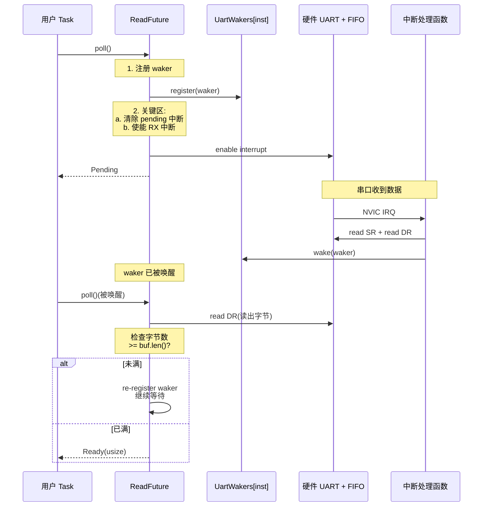

# 13. UART 串口通信

> 撰写:2026-06-05
> 前置:`docs/12-gpio.md`(M4.1 GPIO 与中断机制,§6 waker 机制为基础)
> 关联:`docs/09-stm32.md` §7 / `docs/10-nrf.md` §7 / `docs/11-rp.md` §7 平台 UART 硬件特性
> 范围:UART 异步收发(`read`/`write` waker)+ split(Rx/Tx)模式 + DMA 传输 + 三平台对照
> 不在范围:SPI / I2C / Timer(M4.3-4.5);M3.2/3.3/3.4 §7 平台 USART/UARTE/UART 硬件

---

## 目录

1. UART 在 Embassy 中的位置
2. UART trait 体系(`embedded-hal-nb` / `embedded-io` / `embedded-io-async`)
3. 跨平台统一抽象:`Uart` / `UartTx` / `UartRx` split
4. UART 配置:`Config` 三平台对照
5. 异步读写:`read` / `write` 的 waker 机制
6. DMA 传输:通道 + 双缓冲 + 中断
7. 平台实现差异:USART vs UARTE(EasyDMA)vs UART(FIFO)
8. 实战 1:echo 循环(read + write)
9. 实战 2:RX 协议解析(行分隔 / 长度前缀)
10. 跨平台对比矩阵 + 调试技巧
11. 总结 + M4.3 SPI 导览

---

## 1. UART 在 Embassy 中的位置

UART(Universal Asynchronous Receiver-Transmitter)是嵌入式最常用的异步串行通信协议。Embassy 三平台 `stm32` / `nrf` / `rp` 都把 UART 抽象成一致的 API 形状:

- **`Uart` struct**(组合):`new` 时同时持有 TX + RX 资源,适合 echo / 全双工场景
- **`UartTx` / `UartRx` struct**(split):通过 `split()` / `split_by_ref()` 拆成两个独立 handle,适合"两个 task 独立读写"场景
- **`BufferedUart`**:在 `Uart` 基础上加用户态 TX/RX 环形缓冲,把"等 FIFO 不空"等同步等待异步化,适合协议解析

**Embassy UART 的几个关键事实**:

- **Waker 机制同构于 GPIO `wait_for_xxx`**(M4.1 §6):底层都是"硬件中断 → waker 唤醒"模式
- **TX 主动、RX 被动**:TX 是用户驱动(写 `TDR`/`FIFO` 触发中断),RX 是硬件驱动(收数据触发中断)
- **DMA 是优化非必需**:小数据用 `Uart` 直发,大数据用 `BufferedUart` 或 DMA
- **三平台对 `embedded-io` / `embedded-hal-nb` trait 覆盖不同**:见 §2 决策表

**本章不重复 M3.2/3.3/3.4 §7**:M3.2 §7 已讲过 stm32 USART 三套(v1/v2/v3)硬件;M3.3 §7 已讲过 nrf UARTE EasyDMA;M3.4 §7 已讲过 rp UART FIFO。本章聚焦于:

| 主题 | 本章位置 |
|------|----------|
| 3 套 trait 选型 | §2 |
| `Uart` / `UartTx` / `UartRx` 跨平台对照 | §3 |
| `Config` 跨平台字段 | §4 |
| 异步 `read` / `write` waker 实现 | §5 |
| DMA + 双缓冲 | §6 |
| 三平台硬件路径 USART vs UARTE vs UART | §7 |
| 实战:echo + 协议解析 | §8-9 |
| 10 维跨平台对比矩阵 | §10 |

---

## 2. UART trait 体系

Embassy UART 必须实现至少 2 套 trait:同步阻塞(`embedded-io` / `embedded-hal-nb`)+ 异步(`embedded-io-async`)。三平台覆盖情况不同。

### 2.1 三套 trait 概览

| 套件 | 同步/异步 | 关键 trait | 用途 |
|------|-----------|------------|------|
| `embedded-hal-nb` 0.2 | 同步(非阻塞) | `serial::Read` / `serial::Write` | 旧式 poll 风格 |
| `embedded-hal` 0.2 | 同步(阻塞) | `blocking::serial::Write` | 已弃用 |
| `embedded-io` 0.6 | 同步(阻塞) | `Read` / `Write` | 当前推荐 |
| `embedded-io-async` 0.6 | 异步 | `Read` / `Write` | Embassy 主用 |

### 2.2 三平台 trait 覆盖对照

| 平台 | `embedded-io` 同步 | `embedded-io-async` 异步 | `embedded-hal-nb` 同步 |
|------|---------------------|--------------------------|------------------------|
| stm32 | (部分,通过 `Uart` blocking API) | 是(USART v2/v3 主流) | 是(兼容旧 API) |
| nrf | 是(`blocking_read` / `blocking_write`) | 是(`read` / `write`) | (较少使用) |
| rp | 是(`blocking_read` / `blocking_write`) | 是(`read` / `write`) | 是(`embedded_hal_nb::serial`) |

**关键观察**:
- **nrf / rp 同时实现 3 套**(见 `embassy-rp/src/uart/buffered.rs:681-846`)
- **stm32 USART v2/v3 实现 `embedded-io-async` 为主**,blocking API 在 `blocking.rs`
- **新代码统一用 `embedded-io-async`**,旧代码用 `embedded-io` blocking

### 2.3 选型决策表

| 场景 | 推荐 trait | 原因 |
|------|-----------|------|
| Embassy task 异步 | `embedded-io-async` | 唯一支持 `async` 关键字的 trait |
| 一次性同步脚本 | `embedded-io` blocking | 简单 |
| 旧生态传感器驱动 | `embedded-hal-nb` | 兼容性 |
| 测试桩 | 任意 | 看测试框架 |

### 2.4 `embedded-io-async` 关键 trait 签名

```rust
pub trait Read {
    type Error;
    async fn read(&mut self, buf: &mut [u8]) -> Result<usize, Self::Error>;
}

pub trait Write {
    type Error;
    async fn write(&mut self, buf: &[u8]) -> Result<usize, Self::Error>;
    async fn flush(&mut self) -> Result<(), Self::Error>;
}
```

**关键观察**:
- 返回 `Result<usize, Error>` 而非 `Result<(), Error>`——表示"实际读/写的字节数"(短读/短写)
- **`Error` 类型不是 `Infallible`**——UART 通信有真实失败模式(帧错误 / 校验错误 / 溢出)

### 2.5 `Uart::read` 三平台签名差异

| 平台 | 签名 | 短读行为 |
|------|------|----------|
| stm32 | `read(&mut self, buf: &mut [u8]) -> Result<(), Error>` | 读满 `buf.len()` 才返回 |
| nrf | `read(&mut self, buffer: &mut [u8]) -> Result<(), Error>` | 读满 `buffer.len()` 才返回(EasyDMA 必须)|
| rp | `read(&mut self, buf: &mut [u8]) -> Result<usize, Error>` | 读到任何字节立即返回 |

**关键差异**:
- **stm32 / nrf 的 `read` 必须填满 `buf`**——典型 8 字节,常用于"读 1 字节命令"
- **rp 的 `read` 返回实际字节数**——更灵活,但需要循环

---

## 3. 跨平台统一抽象:`Uart` / `UartTx` / `UartRx` split

三平台都暴露三种 struct:`Uart`(组合)/ `UartTx` / `UartRx`(split)。本节做跨平台对照。

### 3.1 `Uart` struct 形状对照

| 平台 | 文件 | 字段 | 关键方法 |
|------|------|------|----------|
| stm32 | `embassy-stm32/src/usart/{v1,v2,v3,v4}/mod.rs` | `tx: UartTx` + `rx: UartRx` | `new()` / `read()` / `write()` / `split()` |
| nrf | `embassy-nrf/src/uarte.rs:139-142` | `tx: UarteTx` + `rx: UarteRx` | `new()` / `read()` / `write()` / `split()` |
| rp | `embassy-rp/src/uart/mod.rs:147` | `tx: UartTx` + `rx: UartRx` | `new()` / `read()` / `write()` / `split()` |
| imxrt | `embassy-imxrt/src/flexcomm/uart.rs:40` | `tx: UartTx<'a, M>` + `rx: UartRx<'a, M>`(带 Mode 泛型) | `new()` / `read()` / `write()` / `split()` |
| microchip | `embassy-microchip/src/uart.rs:407` | `tx: UartTx` + `rx: UartRx` | `new()` / `read()` / `write()` / `split()` |
| mspm0 | `embassy-mspm0/src/uart/mod.rs:196` | `tx: BufferedUartTx` + `rx: BufferedUartRx` | `new()` / `read()` / `write()` / `split()` |

**共性**:所有 `Uart` struct 内部都是 `tx + rx` 组合,外部 API 一致(`new` / `split` / `read` / `write`)。

**关键观察**:
- **stm32 4 套 v1/v2/v3/v4**:历史包袱(USART 早期版本在 stm32f1/v2/v3/v4 不同芯片)
- **nrf 用 EasyDMA**:UARTE 自带 DMA 引擎,不需要外部 DMA 通道
- **rp 用 FIFO**:32 字节 TX/RX FIFO,无外部 DMA

### 3.2 `split` 模式三平台对照

| 平台 | API | 返回 | 用途 |
|------|-----|------|------|
| stm32 | `u.split() -> (UartTx, UartRx)` | owned 拆分 | 两个 task 各自持一份 |
| nrf | `u.split() -> (UarteTx, UarteRx)` | owned 拆分 | 同上 |
| nrf | `u.split_by_ref() -> (&mut UarteTx, &mut UarteRx)` | 借用拆分 | 临时 split,用完合并 |
| nrf | `u.split_with_idle(timer, ppi) -> (UarteTx, UarteRxWithIdle)` | idle 感知拆分 | RX 加 TIMER 测超时 |
| rp | `u.split() -> (UartTx, UartRx)` | owned 拆分 | 两个 task 各自持一份 |
| mspm0 | `u.split() -> (BufferedUartTx, BufferedUartRx)` | owned 拆分(buffered) | 同上 |
| lpc55 | `u.split() -> (UsartTx, UsartRx)` | owned 拆分 | 同上 |

**重点:nrf 的 `split_with_idle`**:
- 通过 PPI(Peripheral-to-Peripheral Interconnect)把 TIMER 事件接到 UARTE 的 RX timeout
- 接收数据 + 测量字节间间隔(line idle 检测)
- 用于行分隔协议(如 Modbus、AT 命令)

### 3.3 `BufferedUart` 与裸 `Uart` 的对比

| 维度 | `Uart`(裸) | `BufferedUart`(缓冲) |
|------|-------------|----------------------|
| 用户提供 buffer | 否 | 是(应用层 `&mut [u8]` 切片) |
| 数据存储位置 | 硬件 FIFO(16-32 字节) | 硬件 FIFO + 软件环形缓冲 |
| 阻塞 read 时丢数据风险 | 高(FIFO 满则覆盖) | 低(软件缓冲可达 KB) |
| 适用场景 | 命令/响应(短数据) | 协议解析(长数据/不定长) |
| 性能 | 每次 read 都要 DMA/中断 | 中断节流,系统开销低 |

**`BufferedUart` 实例化模式**(rp,`embassy-rp/src/uart/buffered.rs:90-114`):

```rust
pub fn new<'d, T: Instance>(
    _uart: Peri<'d, T>,
    tx: Peri<'d, impl TxPin<T>>,
    rx: Peri<'d, impl RxPin<T>>,
    _irq: impl Binding<T::Interrupt, BufferedInterruptHandler<T>>,
    tx_buffer: &'d mut [u8],   // 用户态 TX 缓冲
    rx_buffer: &'d mut [u8],   // 用户态 RX 缓冲
    config: Config,
) -> Self
```

`tx_buffer` / `rx_buffer` 必须是 `&'static mut [u8]`(从 `static mut` 数组借用),不能用栈分配。

### 3.4 流控(RTS / CTS)三平台支持

| 平台 | `new_with_rtscts` | 引脚绑定 |
|------|-------------------|----------|
| stm32 | 是(在 `usart` 各种版本) | `rts: Peri<...>` + `cts: Peri<...>` |
| nrf | 是(`Uarte::new_with_rtscts`,`embassy-nrf/src/uarte.rs:176`)| 同上 |
| nrf | 是(UarteTx 版,`embassy-nrf/src/uarte.rs:412`)| 同上 |
| nrf | 是(UarteRx 版,`embassy-nrf/src/uarte.rs:597`)| 同上 |
| rp | 是(`BufferedUart::new_with_rtscts`,`embassy-rp/src/uart/buffered.rs:117-148`)| 同上 |
| mspm0 | 是(`BufferedUart::new_with_rtscts`) | 同上 |
| imxrt | 是(在 flexcomm 框架) | 同上 |

**硬件流控必要性**:
- 高波特率(> 1 Mbaud)且数据量大——避免 RX FIFO 溢出
- 半双工 RS-485——需要 DE 引脚配合

---

## 4. UART 配置:`Config` 三平台对照

### 4.1 stm32 `Config` 字段

```rust
// embassy-stm32/src/usart/v2/mod.rs(简化)
pub struct Config {
    pub baudrate: u32,
    pub data_bits: DataBits,         // 8 / 9
    pub parity: Parity,              // None / Even / Odd
    pub stop_bits: StopBits,         // 1 / 2(0.5 / 1.5 仅部分支持)
    pub flow_control: FlowControl,   // None / RTS / CTS / RTS+CTS
    pub match_id: Option<u8>,        // 9-bit 地址匹配
    pub rx_timeout: Option<u16>,     // RX 超时(0xFFF = 禁用)
}
```

(`embassy-stm32/src/usart/v2/mod.rs` `Config` struct)

### 4.2 nrf `Config` 字段

```rust
// embassy-nrf/src/uarte.rs(简化)
pub struct Config {
    pub parity: Parity,              // None / Even / Odd(embassy-nrf/src/uarte.rs:99)
    pub baudrate: Baudrate,          // 枚举:Baud1200 / Baud9600 / ... / Baud1M
    pub hardware_flow_control: bool, // 单字段(非 FlowControl enum)
}
```

**关键观察**:
- nrf **只支持 8 位数据位**(在 `_nrf54l` 之前),无 `data_bits` 字段
- nrf **无 `stop_bits` 字段**——硬件固定 1 stop bit
- nrf **baudrate 是枚举**,不是 `u32`(避免无意义的非标称值)
- nrf **无 RX timeout**——但有 `events_rxto`(独立机制)

### 4.3 rp `Config` 字段

```rust
// embassy-rp/src/uart/mod.rs(简化)
pub struct Config {
    pub baudrate: u32,               // 任意 u32(baud clock / 16 整数分频)
    pub data_bits: DataBits,         // 5 / 6 / 7 / 8
    pub stop_bits: StopBits,         // 1 / 2
    pub parity: Parity,              // None / Even / Odd
    pub flow_control: FlowControl,   // None / RTS / CTS / RTS+CTS
    pub clock_source: ClockSource,   // PCLK / PIO / PLL
    pub tx_fifo_size: u8,            // 0-32(自定义阈值)
    pub rx_fifo_size: u8,            // 0-32
}
```

**关键观察**:
- rp **支持 5/6/7/8 数据位**(8 是常用)
- rp **可配 FIFO 阈值**——影响中断触发频率
- rp **clock_source** 灵活——PCLK / PIO 都能驱动

### 4.4 `Config` 字段对比矩阵

| 字段 | stm32 | nrf | rp | 默认值 |
|------|-------|-----|----|----|
| `baudrate` | `u32` | `Baudrate` 枚举 | `u32` | 115200(各平台不同)|
| `data_bits` | 8 / 9 | (固定 8) | 5 / 6 / 7 / 8 | 8 |
| `parity` | None / Even / Odd | 同 | 同 | None |
| `stop_bits` | 1 / 2 | (固定 1) | 1 / 2 | 1 |
| `flow_control` | 4 选 1 | `bool` | 4 选 1 | None |
| `rx_timeout` | `Option<u16>` | 否 | 否 | 禁用 |
| `clock_source` | 否 | 否 | 3 选 1 | PCLK |
| `tx_fifo_size` | (固定) | (固定) | `u8` | 32 |
| `match_id` | `Option<u8>` | 否 | 否 | None |

**重要:nrf 配置最简**——因为 nRF52840 等芯片没有这些可选功能,默认值即最优。

### 4.5 baud rate 计算

| 平台 | 公式 | 误差 |
|------|------|------|
| stm32 | `fck / (16 * (BRR 值))` 整数分频 | 通常 0-2% |
| nrf | 16 MHz 固定基频,枚举到最接近值 | 0% |
| rp | `baud_clock / (16 * (IBRD + FBRD/64))` 双整数分频 | 通常 < 1% |

**最佳实践**:
- 115200 baud 是事实标准(大多数 USB-serial 适配器都支持)
- 高速(> 921600)需要硬件流控
- nrf `Baudrate::Baud1M` 用于高速模组(如 GPS、LoRa)

---

## 5. 异步读写:`read` / `write` 的 waker 机制

本章核心。UART 异步 `read` / `write` 的本质是"等硬件 FIFO 状态变化"——同构于 GPIO `wait_for_xxx`。

### 5.1 通用状态机

无论 stm32 / nrf / rp,UART 异步读写的状态机都遵循同一份模式:

```text
read:
  1. 配置硬件(RX 中断 / DMA / FIFO 阈值)
  2. 注册 waker 到 per-instance 映射表
  3. 等待(数据未到,future 返回 Pending)
  4. RX 中断触发 → ISR 读 FIFO → waker.wake()
  5. future 被 poll → 从 FIFO 读数据 → 返回 Ready(usize)

write:
  1. 把数据写入 TX 缓冲(用户态或硬件 FIFO)
  2. 注册 waker
  3. 等待(TX FIFO 满,future 返回 Pending)
  4. TX 中断触发(TC / TXE)→ ISR 写 FIFO → waker.wake()
  5. future 被 poll → 继续写 → 返回 Ready(usize)
```

**关键观察**:
- **TX 比 RX 简单**:TX 用户主动控制,只需"等 FIFO 不满"
- **RX 关键挑战**:何时算"读完"?——stm32/nrf 是"读满 buf",rp 是"读到任意字节"
- **错误处理**:所有平台都在 ISR 中检查 `PE` / `FE` / `ORE` / `NE` 标志,设置 waker 后由 future 检查

### 5.2 完整流程图(Mermaid)



### 5.3 stm32 `BufferedUartRx::on_interrupt` 详细实现

文件:`embassy-stm32/src/usart/buffered.rs:34-161`

```rust
unsafe fn on_interrupt(r: Regs, state: &'static State) {
    if state.tx_rx_refcount.load(Ordering::Relaxed) == 0 {
        return;
    }

    // RX
    let sr_val = sr(r).read();
    // On v1 & v2, reading DR clears the rxne, error and idle interrupt
    // flags. Keep this close to the SR read to reduce the chance of a
    // flag being set in-between.
    let dr = if sr_val.rxne() || cfg!(any(usart_v1, usart_v2)) && (sr_val.ore() || sr_val.idle()) {
        Some(rdr(r).read_volatile())
    } else {
        None
    };
    clear_interrupt_flags(r, sr_val);

    if sr_val.pe() { warn!("Parity error"); }
    if sr_val.fe() { warn!("Framing error"); }
    if sr_val.ne() { warn!("Noise error"); }
    if sr_val.ore() { warn!("Overrun error"); }

    // RX
    if sr_val.rxne() {
        let mut rx_writer = state.rx_buf.writer();
        {
            let mut rx_iter = rx_writer.iter();
            if let Some(data) = dr
                && let Some(byte) = rx_iter.next()
            {
                *byte = data;
            }
            // v4 持续读直到 FIFO 空
            #[cfg(usart_v4)]
            while sr(r).read().rxne() && let Some(byte) = rx_iter.next() {
                *byte = rdr(r).read_volatile();
            }
        }

        // 唤醒策略:eager_reads 优先唤醒,否则半满唤醒
        let eager = state.eager_reads.load(Ordering::Relaxed);
        if eager > 0 {
            if state.rx_buf.available() >= eager {
                state.rx_waker.wake();
            }
        } else {
            if state.rx_buf.is_half_full() {
                state.rx_waker.wake();
            }
        }
    }

    if sr_val.idle() {
        state.rx_waker.wake();
    }

    // TX
    if sr(r).read().txe() {
        // 把 tx_buf 数据搬到 TDR(直到 FIFO 满或无数据)
        // ...
    }
}
```

**关键观察**:

- **关键区保护的"refcount"**:`tx_rx_refcount` 决定是否处理中断(0 = 没人用,跳过)——避免 split 后一边的中断"骚扰"另一边
- **SR 读后立即读 DR**(`v1`/`v2`):防止"读 SR 后又来数据"的窗口期丢失
- **eager vs half_full 唤醒策略**:`eager_reads` 优先唤醒(短数据快响应),否则半满唤醒(长数据低开销)
- **v4 hardware FIFO 持续读**:`while sr(r).read().rxne()` 一次性把 FIFO 抽空
- **错误标志检查后 `warn!`**:不返回 `Error`,只警告(因为错误处理复杂,留给上层读 byte 后自己处理)

### 5.4 nrf `UarteRx::read` 详细实现

文件:`embassy-nrf/src/uarte.rs:693-759`

```rust
pub async fn read(&mut self, buffer: &mut [u8]) -> Result<(), Error> {
    if buffer.is_empty() {
        return Ok(());
    }
    if buffer.len() > EASY_DMA_SIZE {
        return Err(Error::BufferTooLong);
    }

    let ptr = buffer.as_ptr();
    let len = buffer.len();

    let r = self.r;
    let s = self.state;

    let drop = OnDrop::new(move || {
        trace!("read drop: stopping");
        r.intenclr().write(|w| {
            w.set_dmarxend(true);
            w.set_error(true);
        });
        r.events_error().write_value(0);
        r.tasks_dma().rx().stop().write_value(1);
        while r.events_dma().rx().end().read() == 0 {}
        trace!("read drop: stopped");
    });

    r.dma().rx().ptr().write_value(ptr as u32);
    r.dma().rx().maxcnt().write(|w| w.set_maxcnt(len as _));

    self.rx_on = true;
    r.events_rxto().write_value(0);
    r.events_dma().rx().end().write_value(0);
    r.events_error().write_value(0);
    r.intenset().write(|w| {
        w.set_dmarxend(true);
        w.set_error(true);
    });

    compiler_fence(Ordering::SeqCst);

    trace!("startrx");
    r.tasks_dma().rx().start().write_value(1);

    let result = poll_fn(|cx| {
        s.rx_waker.register(cx.waker());

        if let Err(e) = self.check_and_clear_errors() {
            r.tasks_dma().rx().stop().write_value(1);
            return Poll::Ready(Err(e));
        }
        if r.events_dma().rx().end().read() != 0 {
            return Poll::Ready(Ok(()));
        }
        Poll::Pending
    })
    .await;

    compiler_fence(Ordering::SeqCst);
    r.events_dma().rx().ready().write_value(0);
    drop.defuse();

    result
}
```

**关键观察**:

- **`EASY_DMA_SIZE` 限制**:nRF52840 是 256 字节,超过会立即 `Err(BufferTooLong)`
- **`OnDrop` 守卫**:`drop` 闭包保证 future 被取消时正确停止 DMA(防止"半途取消"留下 ISR 残留)
- **三事件源**:`dmarxend`(DMA 完成)+ `error`(总线错误)+ `rxto`(接收超时)
- **DMA ptr / maxcnt 写入**:这是 EasyDMA 的关键——告诉硬件"数据写到哪、最多收多少"
- **`compiler_fence(SeqCst)`**:防止编译器重排 DMA 启动与后续代码
- **`drop.defuse()`**:成功完成后 defuse OnDrop(否则会重复 stop)

### 5.5 rp `BufferedUart::on_interrupt` 详细实现

文件:`embassy-rp/src/uart/buffered.rs:516-616`

```rust
unsafe fn on_interrupt() {
    let r = T::info().regs;
    if r.uartdmacr().read().rxdmae() {
        return;  // DMA 模式时跳过
    }

    let s = T::buffered_state();

    // 清 TX 和错误中断标志(RX 标志读 FIFO 即清)
    let ris = r.uartris().read();
    r.uarticr().write(|w| {
        w.set_txic(ris.txris());
        w.set_feic(ris.feris());
        w.set_peic(ris.peris());
        w.set_beic(ris.beris());
        w.set_oeic(ris.oeris());
    });

    // 错误
    if ris.feris() { warn!("Framing error"); }
    if ris.peris() { warn!("Parity error"); }
    if ris.beris() { warn!("Break error"); }
    if ris.oeris() { warn!("Overrun error"); }

    // RX
    if s.rx_buf.is_available() {
        let mut rx_writer = unsafe { s.rx_buf.writer() };
        let rx_buf = rx_writer.push_slice();
        let mut n_read = 0;
        let mut error = false;
        for rx_byte in rx_buf {
            if r.uartfr().read().rxfe() { break; }  // FIFO 空
            let dr = r.uartdr().read();
            if (dr.0 >> 8) != 0 {
                // 错误位
                critical_section::with(|_| {
                    let val = s.rx_error.load(Ordering::Relaxed);
                    s.rx_error.store(val | ((dr.0 >> 8) as u8), Ordering::Relaxed);
                });
                error = true;
                break;
            }
            *rx_byte = dr.data();
            n_read += 1;
        }
        if n_read > 0 {
            rx_writer.push_done(n_read);
            s.rx_waker.wake();
        } else if error {
            s.rx_waker.wake();
        }
        // 缓冲满或出错时,禁用 RX 中断(让 FIFO 保留错误状态)
        if s.rx_buf.is_full() || error {
            r.uartimsc().write_clear(|w| {
                w.set_rxim(true);
                w.set_rtim(true);
            });
        }
    }

    // TX
    if s.tx_buf.is_available() {
        let mut tx_reader = unsafe { s.tx_buf.reader() };
        let tx_buf = tx_reader.pop_slice();
        let mut n_written = 0;
        for tx_byte in tx_buf.iter_mut() {
            if r.uartfr().read().txff() { break; }  // FIFO 满
            r.uartdr().write(|w| w.set_data(*tx_byte));
            n_written += 1;
        }
        if n_written > 0 {
            tx_reader.pop_done(n_written);
            s.tx_waker.wake();
        }
    }
}
```

**关键观察**:

- **DMA 模式时跳过**:`rxdmae()` 置位时整个 ISR 不处理(由 DMA ISR 接管)
- **UARTRIS(原始中断状态)**:不屏蔽的中断状态——读一次可同时检查多个
- **UARTICR(写 1 清 0)**:典型 ARM 风格,写 1 清中断
- **FIFO 检查**:`rxfe`(RX FIFO empty)和 `txff`(TX FIFO full)——决定读/写循环退出
- **错误码位**(dr.0 >> 8):rp UART 数据寄存器高字节藏 4 个错误位(framing/parity/break/overrun)
- **错误时禁用 RX 中断**:保留 FIFO 错误状态供上层读取
- **TX 中断"再触发"现象**:`uartimsc` 不需要禁用 TX 中断(评论明确说"再触发问题已解决")

### 5.6 waker 机制平台对照

| 维度 | stm32 | nrf | rp |
|------|-------|-----|----|
| Waker 容器 | `AtomicWaker[inst]`(RX + TX) | `UartWakers[inst]`(RX + TX) | `UartWakers[inst]`(RX + TX) |
| 中断源 | RXNE / TXE / TC / IDLE | DMA_RX_END / DMA_TX_END / ERROR / RXTO | RX / TX / RXRIS / TXRIS |
| 错误处理 | ISR 中 `warn!`,留给上层 | `check_and_clear_errors` 检查 events_error | 错误码位 in dr,disable RX int |
| 取消/超时 | OnDrop 处理 | OnDrop defuse | 无显式 drop 守卫 |
| 双缓冲 | 否(单缓冲) | 否(但 EasyDMA 自带) | 否(单缓冲) |
| 唤醒策略 | eager / half_full | DMA 完成(固定) | 任意字节(动态) |

---

## 6. DMA 传输:通道 + 双缓冲 + 中断

### 6.1 三平台 DMA 架构对照

| 平台 | DMA 引擎 | 触发方式 | 双缓冲 |
|------|----------|----------|--------|
| stm32 | 独立 DMA 控制器(DMA1/DMA2 + BDMA/GPDMA)| 软件请求(USART TX/RX 请求线)| 需手动配置(双 stream) |
| nrf | EasyDMA(每个外设内置)| 硬件自动 | 否(单缓冲) |
| rp | 独立 DMA 控制器| DREQ 触发(数据级)| 否(单缓冲) |
| imxrt | 独立 DMA 控制器 + flexcomm DMA | 软件 + 硬件 | 否 |
| mcxa | 独立 DMA 控制器 | 软件 | 否 |

**关键观察**:
- **nrf 的 EasyDMA 是"内置 DMA"**——UARTE 自带 DMA 引擎,无外部 DMA 通道
- **stm32 的 DMA 是"外部 DMA"**——USART 通过请求线触发 DMA1/DMA2
- **rp 也是"外部 DMA"**——DREQ 触发

### 6.2 nrf EasyDMA 双缓冲(伪)

nrf 的 UARTE 没有传统双缓冲,但有以下"伪双缓冲"机制:
- **`flush_rx(buffer)`**(`embassy-nrf/src/uarte.rs:275-277`):不启动接收,只 flush FIFO 到 RAM——用于"读出已收到的字节而不等待新数据"
- **`with_idle`**:把 TIMER 接到 RX timeout 事件,通过 PPI 实现"超时 = 帧结束"语义

### 6.3 stm32 DMA 双缓冲实现要点

```rust
// embassy-stm32/src/usart/v2/dma.rs(简化)
pub struct UartRxDma<'d, T: Instance, RxDma: Dma<T, Rx>> {
    rx_dma: RxDma,
    _phantom: PhantomData<&'d mut T>,
}

impl<'d, T: Instance, RxDma: Dma<T, Rx>> UartRxDma<'d, T, RxDma> {
    pub async fn read(&mut self, buf: &mut [u8]) -> Result<(), Error> {
        // 启动 DMA 循环传输(后台)
        self.rx_dma.start_loop();
        // 等待 buf 填满(DMA 中断)
        // ...
    }
}
```

**关键**:
- `Dma::start_loop()` 启动循环传输(DMA 自动从硬件 FIFO 拉数据到 buf)
- 适用于"连续数据流"(如音频、传感器高速采样)
- 单次传输用 `start_once()`

### 6.4 缓冲区大小经验

| 场景 | 推荐缓冲 | 理由 |
|------|----------|------|
| 命令/响应(< 16 字节) | 64-256 字节 | 防短数据 + 留余量 |
| AT 命令解析 | 256-1024 字节 | 容纳完整响应 |
| 协议帧(已知最大长度) | 2 × 帧长 | 防 DMA 双缓冲冲突 |
| 音频流 | 8-16 KB | 减中断频率 |
| 高速 GPRS/NB-IoT | 4-8 KB | 网络抖动缓冲 |

### 6.5 DMA 错误的处理

| 平台 | 错误源 | 处理 |
|------|--------|------|
| stm32 | ORE(overrun)/FE/PE/NE | ISR 中清标志,warn 日志 |
| nrf | events_error | check_and_clear_errors → return Err |
| rp | dr.0 >> 8 错误位 | rx_error 原子变量,disable RX int |

---

## 7. 平台实现差异:USART vs UARTE(EasyDMA)vs UART(FIFO)

### 7.1 stm32 USART:多版本兼容

**架构**:`Peripheral Trigger → RXNE / TXE / TC → NVIC`

- **多版本**:v1 / v2 / v3 / v4,主要差异在寄存器命名
- **v1/v2/v3** 标准 USART:1 字节硬件 FIFO
- **v4**(H7 / G4 部分型号):多字节硬件 FIFO(典型 8-16 字节)
- **DMA**:通过 DMA 控制器(DMA1 / DMA2 / BDMA / GPDMA)
- **中断**:RXNE / TXE / TC / IDLE / ORE / FE / PE / NE

**关键观察**:
- stm32 是"寄存器层抽象"最薄——直接操作 SR / DR 寄存器
- v1/v2 与 v3/v4 的差异靠 `#[cfg(usart_v1)]` 等 cfg 屏蔽

### 7.2 nrf UARTE:EasyDMA 内置

**架构**:`UARTE → EasyDMA → RAM`

- **UARTE 是 UART + EasyDMA** 的组合
- **无独立 DMA 通道**——UARTE 自带
- **EASY_DMA_SIZE 限制**:nRF52840 是 256 字节,nRF54L 是 1024 字节
- **PPI 联动**:UARTE 事件可被 PPI 路由到其他外设(timer、GPIOTE、SAADC 等)

**关键观察**:
- nrf 是"硬件最抽象"——应用层完全不见 DMA 配置
- 限制:每次 `read`/`write` 不能超过 EASY_DMA_SIZE(若数据大,需手动分片)

### 7.3 rp UART:软件 FIFO + 32 字节硬件 FIFO

**架构**:`UART → 32 字节 FIFO → NVIC / DMA`

- **硬件 FIFO**:TX 32 字节 + RX 32 字节
- **软件缓冲**(BufferedUart):用户态环形缓冲,典型 256-1024 字节
- **DMA**:通过外部 DMA 控制器 + DREQ 触发
- **中断**:RX / TX / RXRIS(超时) / TXRIS(空) / 错误

**关键观察**:
- rp 是"中间层"——硬件 FIFO 比 stm32 大,比 nrf 灵活(可配阈值)
- 适合"短帧 + 中等吞吐"场景(GPS、AT 命令、传感器)

### 7.4 平台特性对照矩阵

| 特性 | stm32 | nrf | rp |
|------|-------|-----|----|
| 硬件 FIFO | v1/v2/v3: 1B,v4: 8-16B | 无(FIFO 由 EasyDMA 实现) | 32B(可配阈值) |
| DMA 引擎 | 外部(DMA1/2/BDMA/GPDMA)| 内置(EasyDMA) | 外部(DREQ) |
| 单次传输最大 | 无(由 DMA 通道决定) | 256B / 1024B(EASY_DMA_SIZE) | 无 |
| 硬件流控(RTS/CTS) | 是 | 是 | 是 |
| RS-485 模式 | 是(部分) | 否 | 是(部分) |
| 单线(half-duplex) | 是(部分) | 否 | 是(部分) |
| 9-bit data | 是(match_id) | 否 | 否 |
| 红外(IrDA) | 是(部分) | 否 | 否 |
| LIN bus | 是(部分) | 否 | 否 |
| 9 字节地址匹配 | 是(match_id) | 否 | 否 |

### 7.5 选型建议

- **nRF 协议最优**——EasyDMA 自动,无 DMA 配置
- **stm32 最灵活**——多版本 + 9-bit + LIN + IrDA
- **rp 最简单上手**——FIFO 大,API 干净

---

## 8. 实战 1:echo 循环(read + write)

最简 UART 实战:读什么就回什么(典型开发板 hello 演示)。

### 8.1 stm32 版本

参考 `examples/stm32f4/src/bin/usart_dma.rs`:

```rust
#[embassy_executor::task]
async fn echo(uart: Peri<'static, USART3>, tx: Peri<'static, PB10>, rx: Peri<'static, PB11>) {
    let mut uart = Uart::new(
        uart, tx, rx, Irqs, Config::default()
    ).unwrap();
    
    let mut buf = [0u8; 1];
    loop {
        uart.read(&mut buf).await.unwrap();
        uart.write(&buf).await.unwrap();
    }
}
```

### 8.2 nrf 版本

参考 `examples/nrf52840/src/bin/uart.rs`:

```rust
#[embassy_executor::task]
async fn echo(p: Peripherals) {
    let mut uart = Uarte::new(
        p.UARTE0,
        p.P0_08,  // rxd
        p.P0_06,  // txd
        Irqs,
        Config::default(),
    );
    
    let mut buf = [0u8; 1];
    loop {
        uart.read(&mut buf).await.unwrap();
        uart.write(&buf).await.unwrap();
    }
}
```

### 8.3 rp 版本

参考 `examples/rp/src/bin/uart.rs`:

```rust
#[embassy_executor::task]
async fn echo(p: Peripherals) {
    let mut uart = BufferedUart::new(
        p.UART0,
        p.PIN_0,  // tx
        p.PIN_1,  // rx
        Irqs,
        &mut TX_BUF,
        &mut RX_BUF,
        Config::default(),
    );
    
    let mut buf = [0u8; 1];
    loop {
        uart.read(&mut buf).await.unwrap();
        uart.write(&buf).await.unwrap();
    }
}
```

### 8.4 三平台代码对比

| 维度 | stm32 | nrf | rp |
|------|-------|-----|----|
| 资源 | `USART3` | `UARTE0` | `UART0` |
| TX pin | `PB10` | `P0_06` | `PIN_0` |
| RX pin | `PB11` | `P0_08` | `PIN_1` |
| 中断绑定 | `Irqs`(bind_interrupts!宏) | 同 | 同 |
| 缓冲 | 无 | 无 | `&mut TX_BUF / RX_BUF` |
| 共同点 | 全部 `loop { read 1 byte → write 1 byte }` | | |

### 8.5 性能观察

**单字节 echo 极限**:
- 115200 baud,8N1 → 1 字节 ≈ 87 µs
- 处理延迟 < 1 ms(单 task,无阻塞)
- 实际可达 ~10 000 echo/s(1 字节 / 100 µs)

**优化**:
- 用 `BufferedUart` 一次读 16 字节 → 16x 提升
- 用 DMA → 释放 CPU 给其他 task

---

## 9. 实战 2:RX 协议解析(行分隔 / 长度前缀)

真实应用:UART 接收"变长"协议帧(AT 命令、JSON、Modbus 等)。

### 9.1 行分隔(AT 命令)

```rust
async fn process_at(uart: &mut Uart<'static>) {
    let mut line_buf = [0u8; 256];
    let mut len = 0;
    let mut byte = [0u8; 1];
    
    loop {
        uart.read(&mut byte).await.unwrap();
        match byte[0] {
            b'\r' => { /* 忽略 */ }
            b'\n' => {
                // 处理一行
                let cmd = core::str::from_utf8(&line_buf[..len]).unwrap();
                info!("AT cmd: {}", cmd);
                len = 0;
            }
            _ => {
                if len < line_buf.len() {
                    line_buf[len] = byte[0];
                    len += 1;
                }
            }
        }
    }
}
```

**问题**:行长度无界(恶意数据)→ 用 `BufferedUart` + `\n` 唤醒更安全

### 9.2 长度前缀协议(自定义)

```rust
async fn process_framed(uart: &mut BufferedUartRx<'static>) {
    loop {
        // 读 2 字节长度头
        let mut len_bytes = [0u8; 2];
        uart.read_exact(&mut len_bytes).await.unwrap();
        let len = u16::from_le_bytes(len_bytes) as usize;
        
        // 读 len 字节数据
        let mut payload = [0u8; 256];
        let to_read = len.min(payload.len());
        uart.read_exact(&mut payload[..to_read]).await.unwrap();
        
        // 处理帧
        info!("Frame: {} bytes", to_read);
    }
}
```

**关键辅助 trait**:`read_exact` 是 `embedded-io-async::Read` 扩展,读到指定长度才返回

### 9.3 Modbus RTU(3.5 字符间隔)

需要"超时"机制——nrf 的 `split_with_idle` 专门为此设计:

```rust
let (tx, rx) = uart.split_with_idle(p.TIMER0, p.PPI_CH0, p.PPI_CH1);

async fn modbus_poll(rx: &mut UarteRxWithIdle<'static>, tx: &mut UarteTx<'static>) {
    loop {
        let mut frame = [0u8; 256];
        // read_until_idle 会在字节间超过 3.5 字符时间后返回
        let n = rx.read_until_idle(&mut frame).await.unwrap();
        info!("Modbus frame: {} bytes", n);
        // ... 处理 ...
    }
}
```

**PPI + TIMER + UARTE**:硬件级"无编程器介入"超时——比软件轮询高效

### 9.4 错误处理 pattern

```rust
loop {
    match uart.read(&mut buf).await {
        Ok(n) => { /* 正常处理 */ }
        Err(e) if e == Error::Overrun => {
            // 硬件 FIFO 溢出,清错误标志
            warn!("UART overrun, resetting");
            uart.flush_rx().await.ok();
        }
        Err(e) => {
            error!("UART error: {:?}", e);
            break;
        }
    }
}
```

**关键**:
- 错误不 panic——嵌入式可能无人值守
- Overrun 单独处理(常见)
- 其他错误 `break` 重启(避免死循环)

---

## 10. 跨平台对比矩阵 + 调试技巧

### 10.1 10 维跨平台对比矩阵

| 维度 | stm32 | nrf | rp | mspm0 | mcxa | imxrt |
|------|-------|-----|-----|-------|------|-------|
| 1. 硬件 FIFO | 1-16B(版本依赖)| 无(EasyDMA) | 32B(可配阈值)| 1-8B | 16B | 16-32B |
| 2. DMA 引擎 | 外部 | 内置 EasyDMA | 外部 DREQ | 外部 | 外部 | 外部 + 内置 |
| 3. 单次最大传输 | 无(由 DMA 决定) | 256-1024B | 无 | 无 | 无 | 无 |
| 4. `embedded-io-async` 实现 | 是(USART v2/v3) | 是 | 是 | 是 | 是 | 是 |
| 5. 硬件流控(RTS/CTS) | 是 | 是 | 是 | 是 | 是 | 是 |
| 6. RS-485 模式 | 部分 | 否 | 部分 | 否 | 部分 | 是 |
| 7. 单线 half-duplex | 部分 | 否 | 部分 | 否 | 否 | 是 |
| 8. 9-bit data | 是(`match_id`) | 否 | 否 | 否 | 否 | 否 |
| 9. TX/RX 唤醒策略 | eager / half_full | DMA 完成(固定) | 任意字节 | 阈值 | 阈值 | 阈值 |
| 10. OnDrop 守卫 | 是(USART v2)| 是(EasyDMA)| 否(无 drop) | 否 | 否 | 是 |

### 10.2 调试技巧

#### 10.2.1 平台无关的"5 步 UART 排查"

1. **检查引脚复用**:`tx` / `rx` 是否正确绑定?是否被其他外设占用?
2. **检查 bind_interrupts!**:是否在中断绑定宏中声明 USART/UARTE/UART 中断?
3. **检查 baud 兼容性**:主从两端 baud 一致?是否用错 `Baudrate` 枚举值(nrf 严格)?
4. **检查流控**:`new_with_rtscts` 双方一致?引脚绑对?
5. **检查缓冲大小**:`BufferedUart` 的 buffer 是否太小导致丢数据?

#### 10.2.2 平台特定陷阱

- **stm32**:`USART1` 的中断在 `bind_interrupts!` 中需正确映射 APB 时钟
- **nrf**:`Uarte::new` 的 buffer 超过 `EASY_DMA_SIZE` 会立即 `Err(BufferTooLong)`,不分片
- **rp**:`BufferedUart::new` 的 `tx_buffer` / `rx_buffer` 必须是 `&'static mut [u8]`,栈分配会编译失败

#### 10.2.3 `read` 不返回的排查

```rust
// 1. 确认中断使能
rprintln!("IMSC: {:032b}", imsc.read().bits());
// 2. 确认 FIFO 不溢出
rprintln!("RIS: {:08b}", ris.read().bits());
// 3. 手动软触发
unsafe { interrupt::Pend(); }
```

#### 10.2.4 性能分析

- **吞吐量**:`loop { write 1 byte }`,用示波器测量 TX 引脚频率
- **中断频率**:用 `DWT->CYCCNT` 测量 ISR 入口 / 出口时间间隔
- **waker 唤醒延迟**:从 ISR `wake()` 到用户 task 再次 `poll()` 的时间

---

## 11. 总结 + M4.3 SPI 导览

### 11.1 核心要点回顾

1. **`Uart` / `UartTx` / `UartRx` 三平台形状一致**——同 M4.1 GPIO 的"软约定"
2. **waker 机制同构于 GPIO `wait_for_xxx`**(M4.1 §6)——状态机:注册 → 关键区保护 → 硬件启动 → ISR 唤醒
3. **TX 主动 / RX 被动**——TX 是用户驱动(写 FIFO),RX 是硬件驱动(收数据)
4. **平台差异最大** 在硬件路径——stm32 寄存器层、nrf EasyDMA、rp FIFO
5. **3 套 trait 选型**:`embedded-io-async` 异步为主,`embedded-io` 阻塞兼容,`embedded-hal-nb` 旧生态

### 11.2 与 M3 系列的衔接

| 已学 | 本章深化 | M4.3+ 拓展 |
|------|----------|-----------|
| M3.2 §7 stm32 USART 三套版本 | 异步 read/write waker(§5) | 同样模式适用于 SPI/I2C |
| M3.3 §7 nrf UARTE EasyDMA | DMA + OnDrop 守卫(§6) | nrf SPIM 也是 EasyDMA |
| M3.4 §7 rp UART FIFO | 32B FIFO + 错误码位(§5.5) | rp SPI 用类似 FIFO |

### 11.3 M4.3 SPI 导览

下一章 `docs/14-spi.md` 将讨论:

- **SPI 全双工**:`read_write()` 一次交换输入输出
- **DMA 双向传输**:`embassy-stm32/src/spi/v2/` 的 dual-DMA
- **片选管理**:`SetConfig` trait + CS 引脚控制
- **三种 SPI 模式**(CPOL/CPHA):三平台 Config 字段差异
- **三平台 SPI 差异**:stm32 多版本(spi v1/v2/v3)+ nrf SPIM(EasyDMA)+ rp SPI(FIFO)

SPI 异步化是 UART 模式的高阶版本——不仅有"读 N 字节"还有"写 N 字节"且时钟同步更复杂。

---

## 参考

### Embassy 源码

- `embassy-stm32/src/usart/mod.rs`(`Uart` 抽象层)
- `embassy-stm32/src/usart/buffered.rs:34-161`(`on_interrupt` 完整 ISR 逻辑)
- `embassy-stm32/src/usart/v1/v2/v3/v4/`(各版本实现)
- `embassy-nrf/src/uarte.rs:139-308`(`Uarte` struct + split 模式)
- `embassy-nrf/src/uarte.rs:693-759`(`UarteRx::read` EasyDMA + OnDrop)
- `embassy-nrf/src/buffered_uarte/v1.rs` / `v2.rs`(buffered 变体)
- `embassy-rp/src/uart.rs` / `embassy-rp/src/uart/buffered.rs`(rp 主入口)
- `embassy-rp/src/uart/buffered.rs:516-616`(`on_interrupt` 完整 ISR)
- `embassy-rp/src/uart/buffered.rs:681-846`(3 套 trait 实现)
- `embassy-imxrt/src/flexcomm/uart.rs`(`Uart` 通用 flexcomm 框架)
- `embassy-mspm0/src/uart/buffered.rs` / `embassy-mcxa/src/uart.rs` / `embassy-nxp/src/usart/lpc55.rs`

### Embassy examples/

- `examples/stm32f4/src/bin/usart_dma.rs`(stm32 echo)
- `examples/nrf52840/src/bin/uart.rs`(nrf echo)
- `examples/nrf52840/src/bin/uart_split.rs`(`Uarte::split` 用法)
- `examples/rp/src/bin/uart.rs`(rp echo)
- `examples/rp/src/bin/uart_split.rs`(rp split)
- `examples/stm32f4/src/bin/usart_irda.rs`(stm32 IrDA 模式)

### embedded-io 系列

- `embedded-io` 0.6:`Read` / `Write` 同步阻塞
- `embedded-io-async` 0.6:`Read` / `Write` 异步(Embassy 主用)
- `embedded-hal-nb` 0.2:`serial::Read` / `Write` 旧式 nb 风格
- `embedded-hal` 0.2:`blocking::serial::Write` 已弃用

### 外部资源

- ARM PrimeCell UART(PL011)Technical Reference Manual
- nRF52840 Product Specification:`UARTE` 章节
- RP2040 Datasheet:`UART` 章节
- STM32 Reference Manual(RM0008 / RM0090 / RM0433 等):`USART` 章节

### 上游文档

- `embassy-rs/embassy` GitHub:`docs/` + `examples/`
- 各 HAL 子 crate README

### 本项目其他文档

- `docs/01-overview.md` ~ `docs/07-futures.md`:M1-M2 基础
- `docs/08-hal-architecture.md`:M3.1 HAL 架构
- `docs/12-gpio.md`:M4.1 GPIO(§6 waker 机制是本章基础)
- 下一章:`docs/14-spi.md`(M4.3)
