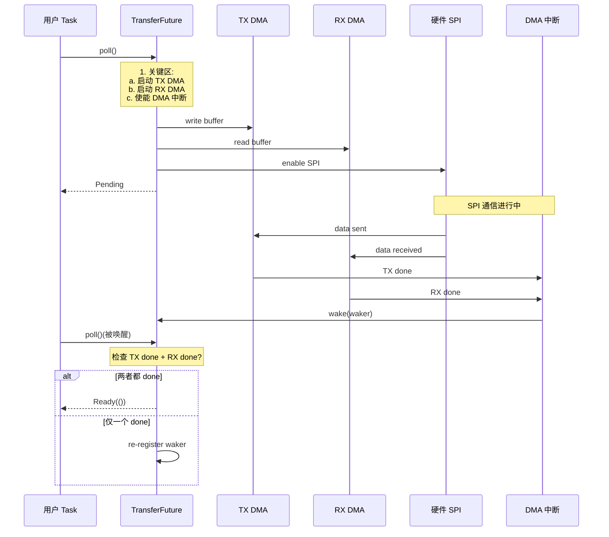

# 14. SPI 总线通信

> 撰写:2026-06-05
> 前置:`docs/12-gpio.md`(M4.1)+ `docs/13-uart.md`(M4.2)
> 关联:`docs/09-stm32.md` §8 / `docs/10-nrf.md` §8 / `docs/11-rp.md` §8 平台 SPI 硬件特性
> 范围:SPI 全双工 `read_write` + dual-DMA + CS 片选管理 + 4 模式(CPOL/CPHA)
> 不在范围:I2C / Timer(M4.4-4.5);M3.2/3.3/3.4 §8 平台 SPI 硬件

---

## 目录

1. SPI 在 Embassy 中的位置
2. SPI trait 体系(`SpiBus` / `SpiDevice` / `SetConfig`)
3. 跨平台统一抽象:`Spi` / `SpiTx` / `SpiRx` split
4. SPI 配置:`Config` + 4 模式(0-3)+ bit_order
5. 异步 `read_write` / `transfer` waker 机制
6. DMA 双向(dual-DMA)+ 异步 CS 控制
7. 平台实现差异:SPI vs SPIM(EasyDMA)vs SPI(PIO+FIFO)
8. 实战 1:传感器读写(初始化 + 读寄存器)
9. 实战 2:SD 卡 / 闪存(命令 + 数据)
10. 跨平台对比矩阵 + 调试技巧
11. 总结 + M4.4 I2C 导览

---

## 1. SPI 在 Embassy 中的位置

SPI(Serial Peripheral Interface)是嵌入式最常用的同步串行通信协议,广泛用于传感器、闪存、显示屏、SD 卡、LoRa 模组等。Embassy 三平台 `stm32` / `nrf` / `rp` 都把 SPI 抽象成一致的 API 形状:

- **`Spi` struct**(组合):`new` 时同时持有 SCK + MOSI + MISO + CS,适合单设备场景
- **`SpiTx` / `SpiRx` struct**(split):通过 `split()` 拆成两个独立 handle,适合"只写"或"只读"场景
- **`SetConfig` trait**(`embassy-embedded-hal/src/lib.rs:21-30`):运行时切换 SPI 配置(频率、模式),用于"多设备共享总线"
- **`SpiBus` + `SpiDevice` 抽象**(`embassy-embedded-hal/src/shared_bus/`):多设备共享 SPI 总线,每个设备独立 CS

**Embassy SPI 的几个关键事实**:

- **Waker 机制同构于 UART `read`/`write`**(M4.2 §5):底层都是"硬件中断 → waker 唤醒"
- **全双工 vs 半双工**:`transfer` 是全双工(同时收发),`write` 是只发送(`MOSI` only),`read` 是只接收(`MISO` only)
- **CS 片选管理**:3 种方式——(1) `SetConfig` + `SpiDevice` 抽象(共享总线,自动 CS);(2) `Spi` 自带 CS 引脚(单设备);(3) 手动 GPIO 控制(自定义时序)
- **dual-DMA**:stm32 v2/v3 + rp + nrf EasyDMA 都支持"同时 TX + RX DMA",最大化吞吐

**本章不重复 M3.2/3.3/3.4 §8**:M3.2 §8 已讲过 stm32 SPI 多版本(v1/v2/v3);M3.3 §8 已讲过 nrf SPIM + EasyDMA;M3.4 §8 已讲过 rp SPI(普通 FIFO + PIO 双方案)。本章聚焦于:

| 主题 | 本章位置 |
|------|----------|
| 3 套 trait 选型(`SpiBus` / `SpiDevice` / `SetConfig`)| §2 |
| `Spi` / `SpiTx` / `SpiRx` 跨平台对照 | §3 |
| `Config` + 4 模式(CPOL/CPHA)跨平台对照 | §4 |
| 异步 `read_write` / `transfer` waker 实现 | §5 |
| dual-DMA 双向传输 | §6 |
| 三平台硬件路径 SPI vs SPIM vs SPI(PIO) | §7 |
| 实战:传感器 / SD 卡 | §8-9 |
| 10 维跨平台对比矩阵 | §10 |

---

## 2. SPI trait 体系

Embassy SPI 涉及 3 套关键 trait:总线级(`SpiBus` / `SpiDevice`)+ 配置级(`SetConfig`)+ 操作级(`SpiBus::Operation`)。

### 2.1 三套 trait 概览

| 套件 | 层级 | 关键 trait | 用途 |
|------|------|------------|------|
| `embedded-hal` 0.2 + 1.0 | 总线 | `spi::SpiBus` / `spi::SpiDevice` | 多设备共享 |
| `embedded-hal` 1.0 | 总线 | `spi::SpiBus::Operation`(枚举)| 一次 `transaction` 内多种操作 |
| `embassy-embedded-hal` | 配置 | `SetConfig` | 运行时切换 SPI 配置 |
| `embassy-embedded-hal` | 共享 | `SpiDeviceWithConfig` | 多设备独立配置 |

### 2.2 `SpiBus` vs `SpiDevice`

**设计动机**:一个 SPI 总线(如 `SPI1`)可挂多个设备(传感器 + 闪存 + LCD),每个设备独立 CS 引脚。`SpiBus` 拥有硬件总线,`SpiDevice` 是某个设备的视图。

```rust
// 伪代码
let bus = SpiBus::new(spi1, sck, mosi, miso, Irqs, Config::default());
let sensor = SpiDevice::new(bus.split(), sensor_cs);
let flash = SpiDevice::new(bus.split(), flash_cs);

// 同时只能有一个 device 操作(通过内部锁)
sensor.transaction(|bus| { /* ... */ }).await?;
flash.transaction(|bus| { /* ... */ }).await?;
```

**关键观察**:
- **`SpiBus` 是 `!Sync`**——同一时刻只能一个 device 操作(通过 async 锁)
- **`SpiDevice` 自带 CS 控制**——`transaction` 进入时 CS 拉低,退出时 CS 拉高
- **`SpiBus::transaction(|bus| { ... })` 是 `async` 闭包**——可在闭包内多次 read/write

### 2.3 `SetConfig` trait

文件:`embassy-embedded-hal/src/lib.rs:21-30`

```rust
pub trait SetConfig {
    type Config;
    type ConfigError;
    fn set_config(&mut self, config: &Self::Config) -> Result<(), Self::ConfigError>;
}
```

**关键观察**:
- **`Spi` / `SpiDevice` / `I2c` / `I2cDevice` 都实现 `SetConfig`**
- **同一总线不同设备用不同 `Config`**:传感器 1MHz + Mode 0,闪存 50MHz + Mode 3
- **`SpiDeviceWithConfig`**:在 `transaction` 时根据 `Config` 切换 `SpiBus` 的配置
- 详见 `embassy-embedded-hal/src/shared_bus/asynch/spi.rs`

### 2.4 `SpiBus::Operation` 枚举(`embedded-hal` 1.0)

```rust
pub enum Operation<'a, T: 'a + Sized> {
    Read(&'a mut [T]),
    Write(&'a [T]),
    Transfer(&'a mut [T], &'a [T]),
    TransferInPlace(&'a mut [T]),
    DelayNs(u32),
}
```

**关键观察**:
- **新式 API**:`transaction` 接受 `Operation` 序列,一次调用完成多种操作
- **`DelayNs`**:插入纳秒级延时(用于 CS 拉高到下次拉低的建立时间)
- **`Transfer` vs `TransferInPlace`**:前者分 RX/TX 缓冲,后者同址交换(节省内存)
- **替代旧 API**:`read` / `write` / `transfer` 直接调用——新代码推荐 `transaction`

### 2.5 选型决策表

| 场景 | 推荐 trait | 原因 |
|------|-----------|------|
| 单设备 SPI | `Spi` 直发 | 简单 |
| 多设备共享 | `SpiBus` + `SpiDevice` | 自动 CS 锁 |
| 多设备不同 Config | `SpiDeviceWithConfig` | `SetConfig` 切换 |
| 复杂协议(CS 时序自定义) | 手动 GPIO 控制 CS | 灵活 |

---

## 3. 跨平台统一抽象:`Spi` / `SpiTx` / `SpiRx` split

三平台都暴露三种 struct:`Spi`(组合)/ `SpiTx` / `SpiRx`(split)。

### 3.1 `Spi` struct 形状对照

| 平台 | 文件 | 关键方法 |
|------|------|----------|
| stm32 | `embassy-stm32/src/spi/{v1,v2,v3}/mod.rs` | `new()` / `read()` / `write()` / `transfer()` / `split()` |
| nrf | `embassy-nrf/src/spim.rs:206` | `new()` / `read()` / `write()` / `transfer()` / `split()` / `set_config()` |
| rp | `embassy-rp/src/spi.rs` | `new()` / `read()` / `write()` / `transfer()` / `split()` |
| rp(PIO)| `embassy-rp/src/pio_programs/spi.rs:90` | 同上(`Spi<'d, PIO, SM, M>` 泛型) |
| mcxa | `embassy-mcxa/src/spi/controller.rs:132` | `new_async()` / `blocking_*()` / `set_configuration()` |

### 3.2 split 模式

| 平台 | `split` 返回 | 用途 |
|------|-------------|------|
| stm32 | `(SpiTx, SpiRx)` | 两个 task 各自持一份 |
| nrf | `(SpimTx, SpimRx)` | 同上 |
| rp | `(SpiTx, SpiRx)` | 同上 |
| mspm0 | `(BufferedSpiTx, BufferedSpiRx)` | buffered 变体 |

### 3.3 半双工 / TX-only / RX-only

| 平台 | TX-only | RX-only | 半双工(3 线) |
|------|---------|---------|----------------|
| stm32 | 是(USART SPI 单向) | 是 | 部分 |
| nrf | 是(无需 MISO)| 是(无需 MOSI)| 否(标准 4 线) |
| rp | 是 | 是 | 部分 |
| mcxa | 是(`new_async_txonly`)| 是(`new_async_rxonly`)| 部分 |

**典型应用**:
- **TX-only**:驱动 WS2812 LED(只需 MOSI,无反馈)
- **RX-only**:读 ADC 数据流(无反馈)
- **3 线半双工**:某些传感器(SI/O 共享)

### 3.4 引脚 trait 约束

三平台用 phantom type 约束引脚合法性——编译期检查:

```rust
// rp 风格
let spi = Spi::new(
    p.SPI0,
    p.PIN_2,  // SCK:实现 SckPin<SPI0>
    p.PIN_3,  // MOSI:实现 MosiPin<SPI0>
    p.PIN_4,  // MISO:实现 MisoPin<SPI0>
    Irqs,
    Config::default(),
);
```

**关键观察**:
- **不能用 `PIN_5` 当 SCK**——编译期失败(没有 `SckPin<SPI0>` 实现)
- 避免运行时"引脚配错"的尴尬

---

## 4. SPI 配置:`Config` + 4 模式(0-3)+ bit_order

### 4.1 4 模式(CPOL/CPHA)对照

| 模式 | CPOL | CPHA | 时钟空闲 | 数据采样 |
|------|------|------|----------|----------|
| 0 | 0 | 0 | Low | 第一个边沿(上升沿) |
| 1 | 0 | 1 | Low | 第二个边沿(下降沿) |
| 2 | 1 | 0 | High | 第一个边沿(下降沿) |
| 3 | 1 | 1 | High | 第二个边沿(上升沿) |

**ASCII 时序图**(Mode 0):

```
SCK:    ___|‾|___|‾|___|‾|___  (空闲低,前边沿采样)
MOSI:   X__7__6__5__4__3__2__  (位 7 在 SCK 上升沿前稳定)
MISO:   _____7_____6_____5___  (从机在 SCK 上升沿后驱动)
```

**关键观察**:
- **Mode 0 最常用**——大多数传感器(MPU6050、SSD1306、SPI Flash 默认 Mode 0)
- **Mode 3 次常用**——SD 卡初始化后是 Mode 3
- **Mode 1 / 2 较少见**——某些特殊外设

### 4.2 stm32 `Config` 字段

```rust
// embassy-stm32/src/spi/v2/mod.rs(简化)
pub struct Config {
    pub frequency: u32,           // Hz(如 1_000_000)
    pub mode: Mode,               // MODE_0 / MODE_1 / MODE_2 / MODE_3
    pub bit_order: BitOrder,      // LSBFirst / MSBFirst
    pub pull: Option<Pull>,       // 内部上拉下拉(部分平台)
    pub slave: bool,              // 主/从模式
}
```

具体实现位于 `embassy-stm32/src/spi/{v1,v2,v3}/mod.rs`(三套历史版本)。

### 4.3 nrf `Config` 字段

```rust
// embassy-nrf/src/spim.rs(简化)
pub struct Config {
    pub mode: Mode,               // MODE_0 / MODE_1 / MODE_2 / MODE_3
    pub bit_order: BitOrder,      // LSBFirst / MSBFirst
    pub frequency: Frequency,     // 枚举:K125 / K250 / K500 / M1 / M2 / M4 / M8
}
```

**关键观察**:
- nrf `Frequency` 是**枚举**(`K125` = 125 kHz,`M1` = 1 MHz 等)
- 不支持任意 `u32`——避免非标称值
- nRF52840 最大 8 MHz SPI(标准模式),高速模式 32 MHz

### 4.4 rp `Config` 字段

```rust
// embassy-rp/src/spi.rs(简化)
pub struct Config {
    pub frequency: u32,           // 任意 u32(baud clock / 整数分频)
    pub phase: Phase,             // CaptureOnFirstTransition / CaptureOnSecondTransition
    pub polarity: Polarity,       // IdleLow / IdleHigh
    pub bit_order: BitOrder,      // MsbFirst / LsbFirst
}
```

(`embassy-rp/src/spi/mod.rs:Config`,`Phase` + `Polarity` 在 `embassy-rp/src/pio_programs/spi.rs:118`)

**关键观察**:
- rp 用 **`Phase` + `Polarity` 两个独立 enum**,而非 `Mode {0,1,2,3}`——更清晰
- `Phase::CaptureOnFirstTransition` = CPHA=0
- `Phase::CaptureOnSecondTransition` = CPHA=1

### 4.5 `Config` 字段跨平台对照

| 字段 | stm32 | nrf | rp |
|------|-------|-----|----|
| `frequency` | `u32` | `Frequency` 枚举 | `u32` |
| `mode` / `phase` + `polarity` | `Mode {0,1,2,3}` | `Mode {0,1,2,3}` | `Phase` + `Polarity` |
| `bit_order` | `LSBFirst` / `MSBFirst` | 同 | `LsbFirst` / `MsbFirst` |
| `slave` | `bool` | 否 | 否 |
| `pull` | `Option<Pull>` | 否 | 否 |

### 4.6 频率计算

| 平台 | 公式 | 范围 |
|------|------|------|
| stm32 | `fck / (2 * (BR + 1))` | 由 APB 时钟定 |
| nrf | 固定基频(16 MHz)+ 整数分频 | 125 kHz - 8 MHz |
| rp | `clk_peri / (2 * (prescale + 1))` 整数 | 由 clk_peri 定 |

**关键观察**:
- 实际频率可能不精确——`fck` 不是 SPI 专用时钟
- 高频 SPI (> 10 MHz)需要硬件支持 + 信号完整性

---

## 5. 异步 `read_write` / `transfer` waker 机制

本章核心。SPI 异步 `transfer` 的本质是"等硬件 FIFO / DMA 完成"——同构于 UART `read`/`write`(M4.2 §5)。

### 5.1 通用状态机

无论 stm32 / nrf / rp,SPI 异步 transfer 的状态机都遵循:

```text
read:
  1. 配置硬件(RX 中断 / DMA / EasyDMA)
  2. 启动 transfer(写 MOSI / 读 MISO)
  3. 注册 waker
  4. 等待(数据未到,future 返回 Pending)
  5. 硬件完成中断 → ISR 读 FIFO → waker.wake()
  6. future 被 poll → 返回 Ready

write:
  1. 把数据写入 TX 缓冲(用户态或硬件 FIFO)
  2. 注册 waker
  3. 等待(TX FIFO 满,future 返回 Pending)
  4. TX 中断触发 → ISR 写 FIFO → waker.wake()
  5. future 被 poll → 继续写 → 返回 Ready

transfer (read_write):
  1. 同时启动 TX + RX(dual-DMA)
  2. 注册 waker
  3. 等待两者都完成
  4. 任意一个 DMA 完成 → ISR wake
  5. future 确认两者都 done → 返回 Ready
```

**关键观察**:
- **transfer 必定 dual-DMA**——TX 和 RX 必须同时进行(全双工本质)
- **错误处理**:overflow / underrun 通常在 ISR 中清标志,留给上层重试

### 5.2 完整流程图(Mermaid)



### 5.3 stm32 SPI v2/v3 `transfer` 详细实现

stm32 SPI v2/v3 通过 `embassy-stm32/src/spi/v2/` 实现,核心是"两个 DMA 通道并行"——一个写 TX,一个读 RX。具体实现见 `embassy-stm32/src/spi/v2/async.rs`。

```rust
// embassy-stm32/src/spi/v2/async.rs(简化)
pub async fn transfer<'a, T: Instance, Tx, Rx>(
    &mut self,
    tx: Tx,
    rx: Rx,
) -> Result<(), Error>
where
    Tx: Dma<T, Tx>,
    Rx: Dma<T, Rx>,
{
    let tx_transfer = unsafe { tx.write(channels.tx, tx_buffer, tdr_addr()) };
    let rx_transfer = unsafe { rx.read(channels.rx, rdr_addr(), rx_buffer) };
    join(tx_transfer, rx_transfer).await;
    Ok(())
}
```

**关键观察**:
- **`join` 并行等待**——两个 DMA 通道同时启动,future 在两者都 done 后返回
- **TDR / RDR 寄存器地址**:DMA 目标/源是 SPI 数据寄存器(非内存)
- **`unsafe { tx.write(...) }`**:调用方需确保 SPI 引脚复用正确
- **DMA 通道约束**:TX 和 RX 必须在 `embassy-stm32/src/spi/v2/mod.rs` 的 `Channel` 实现表中对应

### 5.4 nrf `Spim::transfer` EasyDMA 实现

nrf 的 SPIM 内部已集成 EasyDMA,无外部 DMA 通道:

```rust
// embassy-nrf/src/spim.rs(简化)
pub async fn transfer(&mut self, rd: &mut [u8], wr: &[u8]) -> Result<(), Error> {
    // 1. 设置 TX EasyDMA 指针 + 长度
    r.txd().ptr().write_value(wr.as_ptr() as u32);
    r.txd().maxcnt().write(|w| w.set_maxcnt(wr.len() as _));

    // 2. 设置 RX EasyDMA 指针 + 长度
    r.rxd().ptr().write_value(rd.as_mut_ptr() as u32);
    r.rxd().maxcnt().write(|w| w.set_maxcnt(rd.len() as _));

    // 3. 关键区保护
    critical_section::with(|_| {
        r.intenset().write(|w| {
            w.set_endrx(true);
            w.set_endtx(true);
            w.set_error(true);
        });
    });

    // 4. 启动
    r.tasks_start().write_value(1);

    // 5. poll_fn 等待完成
    poll_fn(|cx| {
        s.waker.register(cx.waker());
        if r.events_endrx().read() != 0 && r.events_endtx().read() != 0 {
            Poll::Ready(Ok(()))
        } else {
            Poll::Pending
        }
    }).await
}
```

**关键观察**:
- **`tasks_start` 启动双 EasyDMA**——硬件并行处理
- **EASY_DMA_SIZE 限制**(nRF52840 256B, nRF54L 1024B)——超出会立即 `Err(BufferTooLong)`
- **双事件同步**:`events_endrx` + `events_endtx` 都需触发——保证全双工完整

### 5.5 rp PIO SPI `transfer` 实现(`embassy-rp/src/pio_programs/spi.rs:359-397`)

rp 的 PIO SPI 用 DMA + PIO 状态机实现:

```rust
// embassy-rp/src/pio_programs/spi.rs:360
pub async fn transfer(&mut self, rx_buffer: &mut [u8], tx_buffer: &[u8]) -> Result<(), Error> {
    self.transfer_inner(rx_buffer, tx_buffer).await
}

async fn transfer_inner(&mut self, rx_buffer: *mut [u8], tx_buffer: *const [u8]) -> Result<(), Error> {
    let (rx, tx) = self.sm.rx_tx();
    let mut rx_ch = self.rx_dma.as_mut().unwrap().reborrow();
    let rx_transfer = async {
        rx.dma_pull(&mut rx_ch, unsafe { &mut *rx_buffer }, false).await;
        if tx_buffer.len() > rx_buffer.len() {
            let read_bytes_len = tx_buffer.len() - rx_buffer.len();
            rx.dma_pull_discard::<u8>(&mut rx_ch, read_bytes_len).await;
        }
    };

    let mut tx_ch = self.tx_dma.as_mut().unwrap().reborrow();
    let tx_transfer = async {
        tx.dma_push(&mut tx_ch, unsafe { &*tx_buffer }, false).await;
        if rx_buffer.len() > tx_buffer.len() {
            let write_bytes_len = rx_buffer.len() - tx_buffer.len();
            tx.dma_push_zeros::<u8>(&mut tx_ch, write_bytes_len).await;
        }
    };

    join(tx_transfer, rx_transfer).await;
    Ok(())
}
```

**关键观察**:
- **异步 `join`**——TX 和 RX 各自 DMA 独立完成
- **不对称缓冲区处理**:`rx_buffer.len() != tx_buffer.len()` 时,长的方向用 zeros / discard 补齐
- **PIO 状态机**(`sm.rx_tx()`,`embassy-rp/src/pio_programs/spi.rs:329`)——rp 用 PIO 模拟 SPI 协议,比硬件 SPI 更灵活
- **`unsafe` 指针借用**——`*mut [u8]` 和 `*const [u8]` 用 `unsafe` 解除
- **DMA 通道约束**:`tx_dma: Peri<'d, TxDma>` + `rx_dma: Peri<'d, RxDma>`(`embassy-rp/src/pio_programs/spi.rs:315-316`)

### 5.6 waker 机制平台对照

| 维度 | stm32 | nrf | rp(PIO)|
|------|-------|-----|--------|
| Waker 容器 | DMA 通道 + SPI 中断 | `spim_wakers[inst]` | DMA 通道 + PIO 中断 |
| DMA 引擎 | 外部(DMA1/2/BDMA/GPDMA)| 内置 EasyDMA | 外部(DREQ) |
| 双 DMA 启动 | `join(tx, rx)` | 一次 `tasks_start` | `join(tx, rx)` |
| 错误处理 | DMA 错误 ISR | events_error | DMA 错误 ISR |
| 短读容忍 | 否(必须读满) | 否(EasyDMA)| 是(`dma_pull_discard`) |
| EASY_DMA 限制 | 否 | 是(256/1024)| 否 |

---

## 6. DMA 双向(dual-DMA)+ 异步 CS 控制

### 6.1 dual-DMA 架构对照

| 平台 | TX DMA | RX DMA | 启动方式 |
|------|--------|--------|----------|
| stm32 | `Tx: Dma<T, Tx>` | `Rx: Dma<T, Rx>` | 两个 channel 并行 |
| nrf | 内置(共一个 SPIM)| 内置(共一个 SPIM)| `tasks_start` 一次启动 |
| rp | 外部 + DMA channel | 外部 + DMA channel | `join(tx_ch, rx_ch)` |
| mcxa | `tx_dma: Channel` | `rx_dma: Channel` | `setup_*_to_peripheral` |

**关键观察**:
- **stm32 需要 2 个独立 DMA channel**——TX 走 channel X, RX 走 channel Y
- **nrf 共用一个 SPIM**——内部 EasyDMA 拆 TX/RX
- **rp 共用一个 PIO state machine**——`rx_tx()` 拆 RX FIFO / TX FIFO
- **mcxa 类似 rp**——`mode.tx_dma` / `mode.rx_dma` 字段

### 6.2 mcxa `transfer_dma_chunk` 详细实现(`embassy-mcxa/src/spi/controller.rs:649-690`)

```rust
// embassy-mcxa/src/spi/controller.rs:649
async fn transfer_dma_chunk(&mut self, read: &mut [u8], write: &[u8]) -> Result<(), IoError> {
    let rx_peri_addr = self.info.regs().rdr().as_ptr() as *mut u8;
    let tx_peri_addr = self.info.regs().tdr().as_ptr() as *mut u8;

    unsafe {
        // 清理 channel  状态(`embassy-mcxa/src/spi/controller.rs:655-662`)
        self.mode.rx_dma.disable_request();
        self.mode.rx_dma.clear_done();
        self.mode.rx_dma.clear_interrupt();
        self.mode.tx_dma.disable_request();
        self.mode.tx_dma.clear_done();
        self.mode.tx_dma.clear_interrupt();

        // 配置 RX:peripheral -> memory(`embassy-mcxa/src/spi/controller.rs:674`)
        self.mode.rx_dma.setup_read_from_peripheral(rx_peri_addr, read, false, TransferOptions::COMPLETE_INTERRUPT)?;
        // 配置 TX:memory -> peripheral(`embassy-mcxa/src/spi/controller.rs:667`)
        self.mode.tx_dma.setup_write_to_peripheral(write, tx_peri_addr, false, TransferOptions::COMPLETE_INTERRUPT)?;

        fence(Ordering::Release);

        // 使能 SPI DMA 请求(`embassy-mcxa/src/spi/controller.rs:687-690`)
        self.info.regs().der().modify(|w| {
            w.set_rdde(true);
            w.set_tdde(true);
        });
    }

    // 等待两个 DMA 都完成
    join(
        async { self.wait_for_rx().await; },
        async { self.wait_for_tx().await; },
    ).await;

    Ok(())
}
```

**关键观察**:
- **`setup_read_from_peripheral` + `setup_write_to_peripheral`**——mcxa 风格 API
- **`TransferOptions::COMPLETE_INTERRUPT`**——触发 DMA 完成中断
- **`der` 寄存器**——DMA enable register(`rdde` = RX DMA enable,`tdde` = TX DMA enable)
- **`fence(Release)`**——保证 CPU 写 DMA 配置后,DMA 能立即看到

### 6.3 异步 CS 控制(`SpiDevice` 抽象)

`SpiDevice::transaction` 内部自动控制 CS:

```rust
// embassy-embedded-hal/src/shared_bus/asynch/spi.rs(简化)
async fn transaction<F, R>(&mut self, f: F) -> R
where
    F: for<'a> FnOnce(&'a mut Self::Bus) -> ...,
{
    self.cs.set_low();
    let result = f(&mut self.bus).await;
    self.cs.set_high();
    result
}
```

**关键观察**:
- **CS 拉低 → 闭包内 transfer → CS 拉高**——标准 SPI 协议
- **闭包内可多次 transfer**——CS 保持低电平,适合"寄存器读 + 数据读"等场景
- **手动 CS 控制**——若需自定义时序,直接控制 `Output` GPIO(M4.1 §3)

### 6.4 多设备共享 + `SpiDeviceWithConfig`

```rust
let bus = SpiBus::new(spi1, sck, mosi, miso, Irqs, Config::default());
let mut sensor = SpiDeviceWithConfig::new(bus.split(), sensor_cs, Config::default());
let mut flash = SpiDeviceWithConfig::new(bus.split(), flash_cs, Config::default());

// sensor 1MHz Mode 0
sensor.transaction(|bus| { bus.transfer(...).await }).await?;
// flash 50MHz Mode 3 (自动切换 Config!)
flash.transaction(|bus| { bus.transfer(...).await }).await?;
```

**关键观察**:
- **`SpiDeviceWithConfig` 包装 `SpiBus` + CS + `Config`**
- **`transaction` 进入时 `set_config`**——同一总线下不同设备不同速率
- **共享总线互斥**——同一时刻只能一个 device 操作

---

## 7. 平台实现差异:SPI vs SPIM(EasyDMA)vs SPI(PIO+FIFO)

### 7.1 stm32 SPI:多版本兼容

**架构**:`Peripheral Trigger → TX/RX → DMA1/DMA2 + BDMA + GPDMA`

- **v1 / v2 / v3**:不同芯片系列(STM32F1 / F4 / F7 / H7 / L4)
- **v1 / v2** 较简单:1 字节硬件 FIFO
- **v3 + v4** 支持 4 字节 + 多主机
- **DMA**:外部 DMA 通道(1 个 TX + 1 个 RX 通道)
- **中断**:TXE / RXNE / EOT / 错误

### 7.2 nrf SPIM:EasyDMA 内置

**架构**:`SPIM → TX EasyDMA + RX EasyDMA → RAM`

- **SPIM = SPI Master + EasyDMA**
- **无独立 DMA 通道**——SPIM 自带
- **EASY_DMA_SIZE 限制**:nRF52840 256B, nRF54L 1024B
- **PPI 联动**:可被 PPI 路由到 GPIOTE / TIMER(高级用法)

**nrf 的 SPIS**(SPI Slave,`embassy-nrf/src/spis.rs`)也是 EasyDMA,适合"MCU 当从机"场景。

### 7.3 rp SPI:两套实现

**架构 1(普通 SPI)**:`SPI → TX/RX FIFO(8 字节)+ DMA 控制器`
- 简单,标准 SPI 协议
- 适合低速(< 10 MHz)+ 1-2 个设备
- 代码入口:`embassy-rp/src/spi.rs`

**架构 2(PIO SPI)**:`PIO State Machine → 模拟 SPI 时序 + DMA`
- 高度可配——`Phase` / `Polarity` / clock divider 都可调
- 可用任意 GPIO 引脚(不仅限 SPI 默认引脚)
- 适合多 SPI 总线(> 2 个)或特殊协议(如双线 SPI、菊花链)
- 代码入口:`embassy-rp/src/pio_programs/spi.rs:90`(`Spi<'d, PIO, SM, M>` 泛型)

**关键观察**:
- rp 提供 **两套 SPI**——选择根据需求
- PIO 模式更灵活但占用 PIO 资源
- 普通模式更省 PIO 但引脚受限
- 详见 RP2040 Datasheet §SPI + §PIO 章节

### 7.4 平台特性对照矩阵

| 特性 | stm32 | nrf | rp(普通)| rp(PIO)| mcxa |
|------|-------|-----|---------|--------|------|
| 1. 硬件 FIFO | 1-4 字节 | 无(EasyDMA)| 8 字节 | 8 字节(PIO)| 16-32 字节 |
| 2. DMA 引擎 | 外部 | 内置 | 外部 | 外部 | 外部 |
| 3. dual-DMA | 是(需 2 channel) | 是(内置) | 是(需 2 channel) | 是(需 2 channel)| 是(需 2 channel) |
| 4. `SpiBus` 抽象 | 是 | 是 | 是 | 是 | 是 |
| 5. `SetConfig` | 是 | 是 | 是 | 是 | 是 |
| 6. TX-only | 是 | 是 | 是 | 是 | 是 |
| 7. RX-only | 是 | 是 | 是 | 是 | 是 |
| 8. 3 线半双工 | 部分 | 否 | 部分 | 是(可配) | 部分 |
| 9. 任意 GPIO 模拟 | 否 | 否 | 否 | 是(PIO) | 否 |
| 10. 最大频率 | 由 APB | 8 MHz | clk_peri 整数分频 | clk_sys 整数分频 | 由 clock config |

### 7.5 选型建议

- **stm32 适合工业 / 复杂协议**——多版本兼容 + DMA 灵活
- **nrf 适合简单传感器**——EasyDMA 无配置
- **rp 普通模式适合标准 SPI**——FIFO 8 字节
- **rp PIO 模式适合高级协议**——多总线 / 特殊时序 / 任意 GPIO

---

## 8. 实战 1:传感器读写(初始化 + 读寄存器)

最简 SPI 实战:读传感器 WHO_AM_I 寄存器。

### 8.1 stm32 版本

参考 `examples/stm32f4/src/bin/spi.rs`:

```rust
#[embassy_executor::task]
async fn spi_task(spi: Peri<'static, SPI1>, sck: Peri<'static, PA5>, mosi: Peri<'static, PA7>, miso: Peri<'static, PA6>, cs: Peri<'static, PA4>) {
    let mut spi = Spi::new(
        spi, sck, mosi, miso, Irqs,
        Config::default(),
    );
    let mut cs = Output::new(cs, Level::High, Speed::VeryHigh);

    loop {
        let mut buf = [0u8; 2];
        buf[0] = 0x80 | 0x0F;  // WHO_AM_I 读命令
        cs.set_low();
        spi.transfer(&mut buf, &[buf[0]]).await.unwrap();
        cs.set_high();
        info!("WHO_AM_I: 0x{:02x}", buf[1]);
        Timer::after_millis(500).await;
    }
}
```

### 8.2 nrf 版本

参考 `examples/nrf52840/src/bin/spim.rs`:

```rust
let mut config = Config::default();
config.frequency = Frequency::M1;
let mut spi = Spim::new(p.SPIM0, p.P0_19, p.P0_21, p.P0_20, Irqs, config);
let mut cs = Output::new(p.P0_17, Level::High, OutputDrive::Standard);
```

### 8.3 rp 版本

参考 `examples/rp/src/bin/spi.rs`:

```rust
let mut config = Config::default();
config.frequency = 1_000_000;
let mut spi = Spi::new(p.SPI0, p.PIN_2, p.PIN_3, p.PIN_4, Irqs, config);
let mut cs = Output::new(p.PIN_5, Level::High);
```

### 8.4 三平台代码对比

| 维度 | stm32 | nrf | rp |
|------|-------|-----|----|
| 资源 | `SPI1` | `SPIM0` | `SPI0` |
| 频率 | 默认(1 MHz) | `Frequency::M1` | `1_000_000` |
| 模式 | 默认(Mode 0)| 默认(Mode 0)| 默认(Mode 0)|
| bit order | MSB first | MSB first | MSB first |
| 共同点 | `cs.set_low() → transfer → cs.set_high()` | | |

### 8.5 性能观察

**单字节寄存器读**:
- SPI 1 MHz,1 字节 = 8 时钟周期 = 8 µs
- 完整 2 字节 transaction ≈ 20 µs(含 CS 拉低延时 + 命令 + 数据 + CS 拉高)
- 实际可达 ~50 000 寄存器读/s

**优化**:
- 提升频率到 10 MHz → 5x 提升
- 减少 `set_low` / `set_high` 间隔(标准 SPI 至少 1 µs)

---

## 9. 实战 2:SD 卡 / 闪存(命令 + 数据)

SD 卡是 SPI 设备的典型"复杂协议"——多字节命令 + 数据块 + CRC + 状态机。

### 9.1 SD 卡 SPI 初始化(简化)

```rust
// 1. 慢速初始化(< 400 kHz)
config.frequency = 400_000;
let mut spi = Spi::new(...);

// 2. 拉低 CS + 发送 80 个时钟脉冲(dummy bytes)
cs.set_low();
for _ in 0..10 {
    spi.write(&[0xFF]).await.unwrap();
}
cs.set_high();

// 3. CMD0 (GO_IDLE_STATE)
cs.set_low();
spi.write(&[0x40, 0x00, 0x00, 0x00, 0x00, 0x95]).await.unwrap();  // CMD0 + CRC
let mut resp = [0xFF];
spi.transfer(&mut resp, &[0xFF]).await.unwrap();
cs.set_high();
// resp[0] 应为 0x01 (idle)

// 4. CMD1 (SEND_OP_COND) 轮询直到 ready
// 5. CMD16 (SET_BLOCKLEN) 512 bytes
// 6. 切换到高速(> 25 MHz)
// ...
```

### 9.2 W25Q 闪存读 JEDEC ID

```rust
cs.set_low();
let mut buf = [0x9F, 0, 0, 0];  // CMD + 3 dummy bytes
spi.transfer(&mut buf, &buf).await.unwrap();
cs.set_high();
info!("JEDEC ID: {:02x} {:02x} {:02x}", buf[1], buf[2], buf[3]);
// 典型输出: EF 40 18 (Winbond W25Q128)
```

### 9.3 SD 卡块读(512 字节)

```rust
async fn read_block(spi: &mut Spi<'static>, cs: &mut Output<'static>, block: u32, buf: &mut [u8; 512]) {
    cs.set_low();
    // CMD17 (READ_SINGLE_BLOCK)
    spi.write(&[0x51 | 0x40, (block >> 24) as u8, (block >> 16) as u8, (block >> 8) as u8, block as u8, 0xFF]).await.unwrap();
    // 等待 0xFE (data token)
    loop {
        let mut b = [0xFF];
        spi.transfer(&mut b, &[0xFF]).await.unwrap();
        if b[0] == 0xFE { break; }
    }
    // 读 512 字节数据
    spi.read(buf).await.unwrap();
    // 跳过 2 字节 CRC
    let mut crc = [0u8; 2];
    spi.transfer(&mut crc, &[0xFF, 0xFF]).await.unwrap();
    cs.set_high();
}
```

### 9.4 实战陷阱

- **CS 拉高需要"等待 1 字节时间"**——让最后字节发完再拉高
- **频率切换必须先 CS 拉高**——某些设备(MCP2515 CAN)在通信中切频率会损坏状态
- **长传输需考虑 FIFO 溢出**——大块数据用 DMA,不要 `transfer` 一字节
- **多设备共享总线**——必须用 `SpiDevice` 抽象,避免 CS 冲突

---

## 10. 跨平台对比矩阵 + 调试技巧

### 10.1 10 维跨平台对比矩阵

| 维度 | stm32 | nrf | rp(普通)| rp(PIO)| mcxa |
|------|-------|-----|---------|--------|------|
| 1. 硬件 FIFO | 1-4 字节 | 无(EasyDMA)| 8 字节 | 8 字节(PIO)| 16-32 字节 |
| 2. DMA 引擎 | 外部 | 内置 EasyDMA | 外部 | 外部 | 外部 |
| 3. dual-DMA | 是(需 2 ch) | 是(内置) | 是(需 2 ch) | 是(需 2 ch) | 是(需 2 ch) |
| 4. EASY_DMA_SIZE | 否 | 256/1024B | 否 | 否 | 否 |
| 5. 模式 0-3 | 是 | 是 | 是(`Phase`+`Polarity`)| 是 | 是 |
| 6. `SpiBus` 抽象 | 是 | 是 | 是 | 是 | 是 |
| 7. `SetConfig` | 是 | 是 | 是 | 是 | 是 |
| 8. 任意 GPIO 模拟 | 否 | 否 | 否 | 是(PIO)| 否 |
| 9. 多 SPI 总线 | 6+(STM32)| 4(SPIM0-3) | 2(标准)+ 多(PIO) | (见左)| 4 |
| 10. 主/从模式 | 主 + 从 | 仅主 | 仅主 | 仅主 | 主 + 从 |

### 10.2 调试技巧

#### 10.2.1 平台无关的"5 步 SPI 排查"

1. **检查引脚复用**:SCK/MOSI/MISO 是否正确绑定?是否被其他外设占用?
2. **检查 `bind_interrupts!`**:SPI / SPIM / SPI0 中断是否声明?
3. **检查 `Config.frequency`**:双方一致?是否用错 `Frequency` 枚举(nrf 严格)?
4. **检查 `mode`**:CPOL/CPHA 与从机一致?默认是 Mode 0(最常见)
5. **检查 `bit_order`**:MSB first 是默认,但某些从机用 LSB first

#### 10.2.2 平台特定陷阱

- **stm32**:DMA 通道冲突——USART 1 的 TX 和 SPI 1 的 TX 都用 DMA1 channel 1,需手动分配
- **nrf**:`EASY_DMA_SIZE` 限制——单次 `transfer` 不能超过 256/1024 字节
- **rp**:普通 SPI 引脚受限——只能用 SPI0 的特定 GPIO;复杂场景用 PIO 模式
- **mcxa**:`set_configuration` 每次都重置 FIFO——频繁切换会丢数据

#### 10.2.3 `transfer` 不返回的排查

```rust
// 1. 确认 SPI 时钟使能
rprintln!("RCC: APBxENR = 0x{:08x}", rcc_apbxenr.read());
// 2. 确认 CS 拉低
rprintln!("CS: {}", cs.is_set_low());
// 3. 手动软触发 SPI
unsafe { spi.pend(); }
```

#### 10.2.4 性能分析

- **吞吐量**:`loop { transfer 256 bytes }`,用示波器测量 SCK 频率
- **DMA 完成延迟**:用 `DWT->CYCCNT` 测量 DMA 中断到 waker 唤醒的时间
- **CS 切换开销**:测 `set_low` 到第一次 SCK 边沿的时间

---

## 11. 总结 + M4.4 I2C 导览

### 11.1 核心要点回顾

1. **`Spi` / `SpiTx` / `SpiRx` 三平台形状一致**——同 M4.1 / M4.2 的"软约定"
2. **waker 机制同构于 UART `read`/`write`**(M4.2 §5)——状态机:注册 → 关键区保护 → 硬件启动 → ISR 唤醒
3. **dual-DMA 是 SPI 性能关键**——TX + RX 同时进行,`join` 等待
4. **`SpiBus` / `SpiDevice` 是多设备共享的标准**——自动 CS 控制 + Config 切换
5. **rp 双实现(普通 + PIO)**——多 SPI 总线或任意 GPIO 模拟时选 PIO

### 11.2 与 M3 系列的衔接

| 已学 | 本章深化 | M4.4+ 拓展 |
|------|----------|-----------|
| M3.2 §8 stm32 SPI 三套版本 | dual-DMA `join` 模式(§5) | 同样模式适用于 I2C |
| M3.3 §8 nrf SPIM EasyDMA | EASY_DMA_SIZE 限制(§6) | I2C 也有单次最大限制 |
| M3.4 §8 rp SPI + PIO | PIO 双模式选型(§7) | I2C 没有 PIO 替代 |

### 11.3 M4.4 I2C 导览

下一章 `docs/15-i2c.md` 将讨论:

- **I2C 异步 read/write**:`read` / `write` / `write_read` 的 waker 实现
- **DMA 模式**:st/nrf/rp 三平台 DMA 路径
- **7-bit / 10-bit 地址**:三平台 Config 字段
- **时钟拉伸(Clock Stretching)**:从机拉低 SCL 等待,主机必须容忍
- **多主机仲裁**:st/nrf/rp 仲裁机制差异
- **3 套 trait**:`embedded-hal` 同步 + `embedded-hal-async` 异步 + `Smbus` 扩展

I2C 与 SPI 最大差异:I2C 是开漏 + 上拉,需要 `OpenDrain` GPIO(M4.1 §5.4)+ 仲裁机制。

---

## 参考

### Embassy 源码

- `embassy-embedded-hal/src/lib.rs:21-30`(`SetConfig` trait)
- `embassy-embedded-hal/src/shared_bus/asynch/spi.rs`(`SpiDevice` + `SpiDeviceWithConfig`)
- `embassy-stm32/src/spi/{v1,v2,v3}/mod.rs`(各版本实现)
- `embassy-stm32/src/spi/v2/async.rs`(`transfer` 异步 + dual-DMA)
- `embassy-nrf/src/spim.rs:206`(`Spim` struct)
- `embassy-nrf/src/spim.rs`(EasyDMA + 双事件同步)
- `embassy-rp/src/spi.rs` / `embassy-rp/src/pio_programs/spi.rs:90`(`Spi` 普通 + PIO 双方案)
- `embassy-rp/src/pio_programs/spi.rs:359-397`(`transfer_inner` PIO + dual-DMA)
- `embassy-mcxa/src/spi/controller.rs:132-690`(`Spi` struct + `set_configuration` + dual-DMA)
- `embassy-mspm0/src/spi/`

### Embassy examples/

- `examples/stm32f4/src/bin/spi.rs`(stm32 传感器读 WHO_AM_I)
- `examples/stm32f4/src/bin/spi_dma.rs`(stm32 SPI + DMA)
- `examples/nrf52840/src/bin/spim.rs`(nrf sensor)
- `examples/nrf52840/src/bin/ethernet_enc28j60.rs`(nrf SPI 设备)
- `examples/rp/src/bin/spi.rs`(rp 普通 SPI)
- `examples/rp/src/bin/pio_spi.rs`(rp PIO SPI)
- `examples/rp/src/bin/spi_sdmmc.rs`(rp SPI + SD 卡)

### embedded-hal

- `embedded-hal` 0.2 + 1.0:`spi::SpiBus` / `spi::SpiDevice` / `SpiBus::Operation`
- `embassy-embedded-hal`:`SetConfig` / `SpiDeviceWithConfig` / `shared_bus`

### 外部资源

- SPI Mode 0-3 时序图:见各芯片 datasheet
- SD Card Physical Layer Specification v9
- W25Q 闪存 datasheet
- ARM PrimeCell SSP(PL022)Technical Reference Manual
- nRF52840 Product Specification:`SPIM` 章节
- RP2040 Datasheet:`SPI` + `PIO` 章节

### 上游文档

- `embassy-rs/embassy` GitHub:`docs/` + `examples/`
- 各 HAL 子 crate README

### 本项目其他文档

- `docs/01-overview.md` ~ `docs/07-futures.md`:M1-M2 基础
- `docs/08-hal-architecture.md`:M3.1 HAL 架构
- `docs/12-gpio.md`:M4.1 GPIO(OpenDrain 概念)
- `docs/13-uart.md`:M4.2 UART(waker 机制)
- 下一章:`docs/15-i2c.md`(M4.4)
