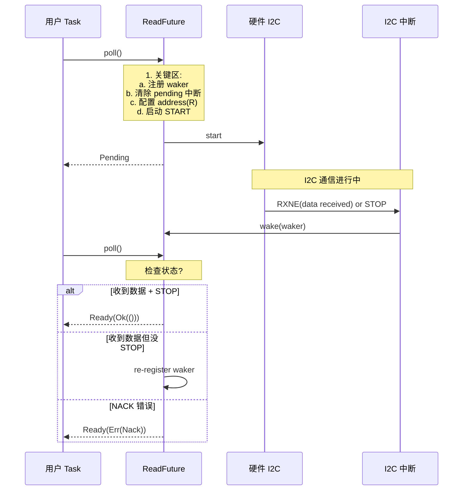

# 15. I2C 总线通信

> 撰写:2026-06-05
> 前置:`docs/12-gpio.md`(M4.1,OpenDrain 概念)+ `docs/13-uart.md`(M4.2)+ `docs/14-spi.md`(M4.3)
> 关联:`docs/09-stm32.md` §9 / `docs/10-nrf.md` §9 / `docs/11-rp.md` §9 平台 I2C 硬件特性
> 范围:I2C 异步 read/write + 时钟拉伸 + 仲裁 + 7/10-bit 地址 + 多设备
> 不在范围:Timer(M4.5);M3.2/3.3/3.4 §9 平台 I2C 硬件

---

## 目录

1. I2C 在 Embassy 中的位置
2. I2C trait 体系(`I2c` / `I2cDevice` / `Smbus`)
3. 跨平台统一抽象:`I2c` / `I2cMaster` / `I2cSlave` split
4. I2C 配置:`Config` + SCL 频率 + 7/10-bit 地址
5. 异步 `read` / `write` / `write_read` waker 机制
6. 时钟拉伸(Clock Stretching)三平台处理
7. 平台实现差异:I2C vs TWIM(EasyDMA)vs I2C(block)
8. 实战 1:传感器读写(地址 + 寄存器)
9. 实战 2:多设备 + 总线扫描
10. 跨平台对比矩阵 + 调试技巧
11. 总结 + M4.5 Timer 导览

---

## 1. I2C 在 Embassy 中的位置

I2C(Inter-Integrated Circuit)是嵌入式最常用的双线同步串行协议,由 Philips(现 NXP)发明,广泛用于 EEPROM、传感器、RTC、IO 扩展器等低速外设。Embassy 三平台 `stm32` / `nrf` / `rp` 都把 I2C 抽象成一致的 API 形状:

- **`I2c` struct**(组合):`new` 时同时持有 SCL + SDA 资源
- **`I2cMaster` / `I2cSlave` struct**(split):通过 `into_master()` / `into_slave()` 切换主从
- **基于 OpenDrain GPIO**(M4.1 §5.4)——SCL/SDA 必须开漏 + 上拉
- **`SetConfig` trait**(同 SPI)——运行时切换 `Config` 用于多设备不同速率

**Embassy I2C 的几个关键事实**:

- **Waker 机制同构于 UART/SPI**——状态机:注册 → 关键区保护 → 硬件启动 → ISR 唤醒
- **时钟拉伸(Clock Stretching)**:从机可拉低 SCL 等待准备好(很多传感器在 ADC 转换时使用)
- **总线仲裁**:多主机场景下需冲突检测(典型应用:多 MCU 共享 I2C 总线)
- **7-bit 地址为主,10-bit 极少用**——大多数外设 7-bit 地址足够
- **开源集合线 open-drain**——SCL 和 SDA 都用 OpenDrain GPIO(M4.1 §5.4)

**本章不重复 M3.2/3.3/3.4 §9**:M3.2 §9 已讲过 stm32 I2C v1/v2;M3.3 §9 已讲过 nrf TWIM;M3.4 §9 已讲过 rp I2C block。本章聚焦于:

| 主题 | 本章位置 |
|------|----------|
| 3 套 trait 选型(`I2c` / `I2cDevice` / `Smbus`)| §2 |
| `I2c` / `I2cMaster` / `I2cSlave` 跨平台对照 | §3 |
| `Config` + 7/10-bit 地址跨平台 | §4 |
| 异步 `read` / `write` / `write_read` waker 实现 | §5 |
| 时钟拉伸三平台处理 | §6 |
| 三平台硬件路径 I2C vs TWIM vs I2C(block)| §7 |
| 实战:传感器 / 总线扫描 | §8-9 |
| 10 维跨平台对比矩阵 | §10 |

---

## 2. I2C trait 体系

Embassy I2C 涉及 3 套关键 trait:同步(`embedded-hal` 0.2 / 1.0)+ 异步(`embedded-hal-async`)+ 总线扫描专用。

### 2.1 三套 trait 概览

| 套件 | 同步/异步 | 关键 trait | 用途 |
|------|-----------|------------|------|
| `embedded-hal` 0.2 | 同步阻塞 | `blocking::i2c::{Read, Write, WriteRead, Iter, Transactional}` | 旧式 |
| `embedded-hal` 1.0 | 同步阻塞 | `i2c::{I2c, ErrorType, Error, Operation}` | 当前推荐 |
| `embedded-hal-async` | 异步 | `i2c::I2c`(`async fn read/write/write_read`)| Embassy 主用 |
| `Smbus` 扩展 | 同步 | `Smbus` | PMBus / SMBus 设备(电池管理等) |

### 2.2 `embedded-hal-async::i2c::I2c` trait

```rust
pub trait I2c<A: AddressMode = SevenBitAddress> {
    type Error;
    async fn read(&mut self, address: A, read: &mut [u8]) -> Result<(), Self::Error>;
    async fn write(&mut self, address: A, write: &[u8]) -> Result<(), Self::Error>;
    async fn write_read(&mut self, address: A, write: &[u8], read: &mut [u8]) -> Result<(), Self::Error>;
    async fn transaction(
        &mut self,
        address: A,
        operations: &mut [Operation<'_>],
    ) -> Result<(), Self::Error>;
}

pub enum Operation<'a> {
    Read(&'a mut [u8]),
    Write(&'a [u8]),
}
```

**关键观察**:
- **`AddressMode` 泛型**——`SevenBitAddress` 或 `TenBitAddress`
- **`transaction` 一次发送多种操作**——避免 STOP 间断(关键!)
- **`write_read` 不发 STOP**——保持 `Repeated Start`,适合"先写寄存器地址再读数据"
- **`Error` 不再是 `Infallible`**——NACK / 仲裁失败 / 总线错误

### 2.3 `I2cDevice` 抽象(共享总线)

`embassy-embedded-hal` 提供 `I2cDevice` 用于共享总线,同 `SpiDevice` 模式:

```rust
let bus = I2c::new(i2c1, scl, sda, Irqs, Config::default());
let sensor = I2cDevice::new(bus.split(), sensor_addr);
let eeprom = I2cDevice::new(bus.split(), eeprom_addr);
```

**关键观察**:
- **共享总线互斥**——同一时刻只能一个 device 操作
- **不需要 CS**——I2C 寻址自带从机地址

### 2.4 `Smbus` 扩展

PMBus(电源管理总线)是 I2C 的子集,常用 SMBus 协议:
- 快速读/写
- 块读/写(32 字节)
- 字节读写
- PEC(Packet Error Checking)校验

Embassy 暂未提供完整 SMBus trait(2026-06 截止)。

### 2.5 选型决策表

| 场景 | 推荐 trait | 原因 |
|------|-----------|------|
| 异步读写(7-bit) | `embedded-hal-async::i2c::I2c<SevenBitAddress>` | 唯一支持 async |
| 同步阻塞 | `embedded-hal-async::i2c` blocking | 旧式 |
| 10-bit 地址 | `<TenBitAddress>` 泛型 | 极少用 |
| Repeated Start | `write_read` | 一次 `transaction` 不发 STOP |
| PMBus 设备 | (暂用 `embedded_hal::i2c` 同步)| Embassy 未提供 async Smbus |

---

## 3. 跨平台统一抽象:`I2c` / `I2cMaster` / `I2cSlave` split

三平台都暴露 `I2c` struct,通过 phantom type 区分主/从。

### 3.1 `I2c` struct 形状对照

| 平台 | 文件 | 关键方法 |
|------|------|----------|
| stm32 | `embassy-stm32/src/i2c/mod.rs:130` | `new` (含 DMA) / `new_no_dma` / `new_blocking` |
| stm32 v1 | `embassy-stm32/src/i2c/v1.rs` | `on_interrupt` at L31 |
| stm32 v2 | `embassy-stm32/src/i2c/v2.rs` | `on_interrupt` at L72 |
| nrf | `embassy-nrf/src/twim.rs:115-120` | `new` (含 EasyDMA) / `blocking_*` |
| rp | `embassy-rp/src/i2c.rs` | `new` (block 模式) / `blocking_*` |
| mspm0 | `embassy-mspm0/src/i2c/` | 同 stm32 模式 |
| mcxa | `embassy-mcxa/src/i2c/` | 同 stm32 模式 |

### 3.2 主/从模式 split

| 平台 | API | 备注 |
|------|-----|------|
| stm32 | `I2c<'d, Async, Master>` / `I2c<'d, Async, Slave>` | 编译期 Mode + MasterMode 泛型 |
| stm32 | `i2c.into_slave_multimaster()` | 转多主机从模式 |
| nrf | `Twim` = master only;`Twis` = slave only | nrf TWIM/TWIS 是独立外设 |
| rp | `I2c` = master only(无 slave)| rp 没有 I2C slave 外设 |

**关键观察**:
- **stm32 最灵活**——编译期区分主/从 + 多主机从模式
- **nrf / rp 仅 master**——简单但无法当从机
- **多主机从**(stm32 独有)——适合"多 MCU 共享总线"场景

### 3.3 stm32 `I2c<'d, M, IM>` 详细 struct

文件:`embassy-stm32/src/i2c/mod.rs:130-141`

```rust
pub struct I2c<'d, M: Mode, IM: MasterMode> {
    info: &'static Info,
    state: &'static State,
    kernel_clock: Hertz,
    tx_dma: Option<ChannelAndRequest<'d>>,
    rx_dma: Option<ChannelAndRequest<'d>>,
    #[cfg(feature = "time")]
    timeout: Duration,
    _marker: PhantomData<M>,
    _marker2: PhantomData<IM>,
    _drop_guard: I2CDropGuard<'d>,
}
```

**关键观察**:
- **2 个 PhantomData**:`M` (Blocking/Async) + `IM` (Master/Slave)——编译期 4 种组合
- **`tx_dma` / `rx_dma` 是 `Option`**——支持 no-DMA 模式(`new_no_dma`)
- **`I2CDropGuard`**——Drop 时清理 SCL/SDA 状态
- **`kernel_clock`**——记录 APB 时钟(用于 baud 计算)

### 3.4 nrf `Twim<'d>` 详细 struct

文件:`embassy-nrf/src/twim.rs:115-120`

```rust
pub struct Twim<'d> {
    r: pac::twim::Twim,
    state: &'static State,
    tx_ram_buffer: &'d mut [u8],   // RAM 缓冲(EasyDMA 不能直接访问 flash)
    _p: PhantomData<&'d ()>,
}
```

**关键观察**:
- **`tx_ram_buffer` 必须 `&'d mut`**——EasyDMA 限制(只能 RAM)
- **`'d` 生命周期**——保证 buffer 存活
- **`tx_ram_buffer` 大小 = 255B(nRF52832)/ 65535B(nRF52840)**——单次 `write` 上限

### 3.5 引脚 trait 约束

三平台用 phantom type 约束 SCL/SDA 引脚合法性:

```rust
let i2c = I2c::new(
    p.I2C1,
    p.PB8,   // SCL:实现 SclPin<I2C1>
    p.PB9,   // SDA:实现 SdaPin<I2C1>
    tx_dma,
    rx_dma,
    Irqs,
    Config::default(),
);
```

**关键观察**:
- **不能用 `PB10` 当 SCL**——编译期失败
- **SCL/SDA 必须开漏**——Embassy 内部自动配置(M4.1 §5.4)

---

## 4. I2C 配置:`Config` + SCL 频率 + 7/10-bit 地址

### 4.1 stm32 `Config` 字段

```rust
// embassy-stm32/src/i2c/mod.rs(简化)
pub struct Config {
    pub scl_af: Option<AfType>,     // 引脚复用类型(部分芯片)
    pub sda_af: Option<AfType>,     // 同上
    pub timeout: Duration,          // 总线超时(防死锁)
    pub analog_filter: bool,        // 模拟滤波器
    pub digital_filter: u8,         // 数字滤波器(0-15)
    pub primary_address: Option<u8>,// slave 模式地址
    pub secondary_address: Option<u8>,// 双地址模式
}
```

### 4.2 nrf `Config` 字段

```rust
// embassy-nrf/src/twim.rs(简化)
pub struct Config {
    pub frequency: Frequency,       // 枚举:K100 / K250 / K400 / K1000
    pub sda_pullup: bool,           // 内部上拉(若 SDA 上拉电阻缺失)
    pub scl_pullup: bool,           // 同上
    pub address: u8,                // slave 模式地址(若支持)
}
```

**关键观察**:
- nrf `Frequency` 是枚举(`K100` = 100 kHz 标准模式,`K400` = 400 kHz 快速模式,`K1000` = 1 MHz 快速+)
- **nrf 支持内部上拉**——SDA/SCL 上拉电阻可省略(部分应用)
- **nrf 频率标准值**——避免非标称值

### 4.3 rp `Config` 字段

```rust
// embassy-rp/src/i2c.rs(简化)
pub struct Config {
    pub frequency: u32,             // 任意 u32(baud clock / 整数分频)
    pub sda_pullup: bool,           // 内部上拉
    pub scl_pullup: bool,           // 内部上拉
}
```

**关键观察**:
- rp `frequency` 是 `u32`——灵活(任意频率)
- rp 内部上拉强度可选(50kΩ/100kΩ 取决于芯片)

### 4.4 7-bit vs 10-bit 地址

| 地址类型 | 格式 | 范围 | 用途 |
|----------|------|------|------|
| 7-bit | 1 字节(高 7 位)| 0x03-0x77(0x00/0x7F 保留) | 主流(99% 设备)|
| 10-bit | 2 字节(`11110xx` 前缀)| 0x000-0x3FF | 极少用(扩展寻址) |

**关键观察**:
- **0x00** 通用广播地址(需特殊处理)
- **0x7F** 保留(I2C 规范)
- **10-bit 地址的 I2C 设备**——如某些 TI 的 IO 扩展器

### 4.5 SCL 频率计算

| 平台 | 公式 | 标准值 |
|------|------|--------|
| stm32 | `fck / ((CCR + 1) * 2)`(标准)/ 16 / 3 | 100k / 400k / 1M |
| nrf | 固定基频(16 MHz)+ 整数分频 | 100k / 250k / 400k / 1M |
| rp | `clk_peri / 整数分频` | 任意 u32 |

**关键观察**:
- **100 kHz 是标准模式**——大多数传感器支持
- **400 kHz 是快速模式**——EEPROM / 高带宽传感器
- **1 MHz 是快速+模式**——新设备,需要从机支持

### 4.6 上拉电阻

| 场景 | 推荐阻值 |
|------|----------|
| 100 kHz 短距离(< 10 cm)| 4.7 kΩ |
| 100 kHz 长距离 / 多设备 | 2.2 kΩ |
| 400 kHz | 2.2 kΩ(必)|
| 1 MHz | 1 kΩ |
| 多设备 | 1 kΩ(限流考虑) |

**关键观察**:
- **上拉过强**——限流过大,低电平拉不下来
- **上拉过弱**——上升沿慢,频率上不去
- **典型选择**:4.7 kΩ(100k)/ 2.2 kΩ(400k)/ 1 kΩ(1M)

---

## 5. 异步 `read` / `write` / `write_read` waker 机制

本章核心。I2C 异步 `read` / `write` 的本质是"等硬件完成总线 transaction"——同构于 UART/SPI 的 waker 模式。

### 5.1 通用状态机

```text
write:
  1. 关键区保护:waker 注册
  2. 配置硬件:START + address(W) + data
  3. 启动传输
  4. 等待 TX 中断(数据已发)→ ISR wake
  5. 等 ACK + STOP 中断 → ISR wake
  6. future 被 poll → 验证 NACK → 返回 Ready

read:
  1. 关键区:waker 注册
  2. START + address(R)
  3. 等待 RX 中断 → ISR wake → 读 data
  4. 等 STOP → ISR wake
  5. future 验证 → 返回 Ready

write_read:
  1. write 完整流程(到 STOP 之前)
  2. Repeated Start(无 STOP)
  3. read 完整流程
  4. STOP
  5. 整体 wake → 返回 Ready
```

**关键观察**:
- **错误处理**:NACK(从机不应答)立即返回 `Err(Nack)`
- **总线超时**:`Config.timeout` 防止死锁(M4.1 §10.2 类似)
- **仲裁失败**:多主机场景下,ISR 检测到仲裁失败 wake + 错误码

### 5.2 完整流程图(Mermaid)



### 5.3 nrf `Twim::transaction` EasyDMA 实现

文件:`embassy-nrf/src/twim.rs:700-720`

```rust
pub async fn read(&mut self, address: u8, buffer: &mut [u8]) -> Result<(), Error> {
    self.transaction(address, &mut [Operation::Read(buffer)]).await
}

pub async fn write(&mut self, address: u8, buffer: &[u8]) -> Result<(), Error> {
    self.transaction(address, &mut [Operation::Write(buffer)]).await
}

pub async fn write_read(&mut self, address: u8, wr_buffer: &[u8], rd_buffer: &mut [u8]) -> Result<(), Error> {
    self.transaction(
        address,
        &mut [Operation::Write(wr_buffer), Operation::Read(rd_buffer)],
    ).await
}
```

**关键观察**:
- **`read` / `write` / `write_read` 都通过 `transaction` 统一实现**——DRY
- **`write_read` 一次 transaction**——自动不发 STOP,保持 `Repeated Start`
- **三方法签名同构**——易于记忆

### 5.4 nrf `Twim::on_interrupt`(关键)

文件:`embassy-nrf/src/twim.rs:94-112`

```rust
unsafe fn on_interrupt() {
    let r = T::regs();
    let s = T::state();

    if r.events_suspended().read() != 0 {
        s.end_waker.wake();
        r.intenclr().write(|w| w.set_suspended(true));
    }
    if r.events_stopped().read() != 0 {
        s.end_waker.wake();
        r.intenclr().write(|w| w.set_stopped(true));
    }
    if r.events_error().read() != 0 {
        s.end_waker.wake();
        r.intenclr().write(|w| w.set_error(true));
    }
}
```

**关键观察**:
- **三事件**:`suspended`(暂停)/ `stopped`(停止)/ `error`(错误)
- **`suspended` 触发场景**:时钟拉伸(从机拉低 SCL)
- **`stopped` 触发场景**:正常完成 + STOP
- **`error` 触发场景**:NACK / 仲裁失败 / 总线错误
- **共用一个 waker**——`s.end_waker`——future 需检查具体原因

### 5.5 nrf `Operation` 枚举(同上)

`transaction` 方法接受 `&mut [Operation]`,可一次发送多个操作而不发 STOP:

```rust
pub enum Operation<'a> {
    Read(&'a mut [u8]),
    Write(&'a [u8]),
}
```

**关键观察**:
- **`&mut [Operation]` 而非 `&[Operation]`**——`Read` 持可变引用,需 `&mut`
- **支持任意多 operation**——nrf 硬件支持 Repeated Start 链

### 5.6 waker 机制平台对照

| 维度 | stm32 | nrf | rp |
|------|-------|-----|----|
| Waker 容器 | `AtomicWaker[]`(per instance) | `state.end_waker` | `AtomicWaker[]` |
| 中断源 | `EventInterrupt` + `ErrorInterrupt` | `events_suspended` / `events_stopped` / `events_error` | I2C 块 ISR |
| 时钟拉伸 | 软件轮询 + 超时 | 硬件 `suspended` 事件 | 块轮询 |
| 仲裁 | 硬件检测 + ISR | 硬件 `error` 事件 | 硬件块 + ISR |
| 错误类型 | `Nack` / `Bus` / `Arbitration` | `Error` 枚举 | `Error` 枚举 |
| DMA | 是(`tx_dma` / `rx_dma`)| 是(EasyDMA)| 否(block 模式) |
| `SetConfig` 实现 | 是 | 是(`embassy-nrf/src/twim.rs:848`)| 是 |

---

## 6. 时钟拉伸(Clock Stretching)三平台处理

时钟拉伸是 I2C 从机的"我还没准备好,请等等"机制——从机可在 SCL 低电平时继续拉低,主机必须等待 SCL 释放。

### 6.1 时序示意

```
主机 SCL:    ___|‾|___|‾|__|‾‾‾‾‾‾‾|‾|___|‾|___  (暂停!)
从机拉低:   ________|____________|______________
                              ↑                ↑
                          主机等              释放
```

**关键观察**:
- **从机拉低 SCL**——主机释放后,SCL 仍为低(从机继续拉)
- **主机必须等待**——SCL 释放后才继续发送下一位
- **超时机制**——若从机永远不释放,主机需超时复位

### 6.2 三平台时钟拉伸处理

| 平台 | 实现 | 优缺点 |
|------|------|--------|
| stm32 | 硬件自动 + 软件超时 | 灵活(可配超时) |
| nrf | 硬件 `events_suspended` 事件 | 高效(无需轮询) |
| rp | block 轮询(等待 SCL 高)| 简单但 CPU 占用 |

**关键观察**:
- **nrf 最优**——`suspended` 事件 = 硬件自动等 SCL 高,future 直接 wake
- **stm32 中等**——硬件检测,但需 ISR 配合
- **rp 最弱**——纯软件轮询(无 DMA + 无硬件事件)

### 6.3 nrf 时钟拉伸细节

文件:`embassy-nrf/src/twim.rs:99-102`

```rust
if r.events_suspended().read() != 0 {
    s.end_waker.wake();
    r.intenclr().write(|w| w.set_suspended(true));
}
```

**关键观察**:
- **`events_suspended`** 事件触发条件:从机拉低 SCL 暂停传输
- **`intenclr` 清除中断**——避免重复 wake
- **future 检测**:`transaction` 中检测 `suspended` → 重新 `tasks_resume` 继续

### 6.4 时钟拉伸实战例子

```rust
// 读温度传感器(典型 100ms ADC 转换)
async fn read_temperature(i2c: &mut Twim<'static>) -> Result<u16, Error> {
    i2c.write_read(0x48, &[0x00], &mut [0u8; 2]).await?;
    // 从机拉低 SCL 等待 ADC 转换(~100 ms)
    // nrf 硬件自动等,stm32 配 timeout,rp 轮询
    Ok(u16::from_be_bytes([buf[0], buf[1]]))
}
```

**关键观察**:
- **典型应用**:温度传感器(MAX31855)、ADC(ADS1115)
- **延时范围**:几微秒(寄存器读)到几百毫秒(ADC 转换)
- **无时钟拉伸**——某些廉价从机(永远不拉 SCL)用固定延时

---

## 7. 平台实现差异:I2C vs TWIM(EasyDMA)vs I2C(block)

### 7.1 stm32 I2C:多版本兼容

**架构**:`Peripheral → TX/RX shift register → EventInterrupt + ErrorInterrupt + DMA`

- **v1 / v2**:不同芯片系列(STM32F0/F1/F3/F4/F7/H7/L0/L1/L4/G4/WB 等)
- **v1** 老式:1 字节缓冲 + 软件状态机
- **v2** 新式:多字节 + 状态机(更高效)
- **DMA**:外部 DMA1/DMA2 通道
- **中断**:`EventInterrupt`(传输事件)+ `ErrorInterrupt`(错误/超时)
- **关键差异**:`on_interrupt` 在 v1 = L31,v2 = L72(寄存器命名不同)

**关键观察**:
- stm32 是"最复杂 I2C"——多版本 + 多 DMA + 双中断
- 适合需要从机模式 / 多主机仲裁 / 复杂协议场景

### 7.2 nrf TWIM:EasyDMA 内置

**架构**:`TWIM → EasyDMA → RAM`

- **TWIM = TWI Master + EasyDMA**
- **无独立 DMA 通道**——TWIM 自带
- **Buffer 限制**:nRF52832 255B,nRF52840 65535B
- **PPI 联动**:可被 PPI 路由到其他外设
- **`tx_ram_buffer` 必须 `&'d mut`**——EasyDMA 只能 RAM
- **关键事件**:`suspended` / `stopped` / `error`

**关键观察**:
- nrf 是"最易 I2C"——EasyDMA 无 DMA 配置 + 硬件事件优雅
- 适合传感器 / EEPROM 等标准应用

### 7.3 rp I2C:block 模式

**架构**:`I2C → Block(PIO 状态机)→ 软件轮询`

- **Block = RP2040/RP235x 的可编程 I2C block**
- **无 DMA**——纯软件 block + PIO 状态机
- **CPU 占用高**——block 轮询每次 transfer 占用 CPU
- **简单**——`new` 不需要 DMA 通道
- **`on_interrupt` at `embassy-rp/src/i2c.rs:366`**

**关键观察**:
- rp 是"最朴素 I2C"——block + PIO,无 DMA
- 适合低频(100 kHz)+ 短数据(< 32B)

### 7.4 平台特性对照矩阵

| 特性 | stm32 | nrf | rp | mspm0 | mcxa |
|------|-------|-----|-----|-------|------|
| 1. 内部上拉 | 部分(取决于芯片)| 是 | 是 | 部分 | 部分 |
| 2. DMA 引擎 | 外部(DMA1/2) | 内置 EasyDMA | 否(block)| 外部 | 外部 |
| 3. 单次最大传输 | 无(由 DMA)| 255/65535B | 无(短)| 无 | 无 |
| 4. 硬件事件优雅性 | 中(双中断) | 高(3 事件)| 低(轮询)| 中 | 中 |
| 5. 时钟拉伸处理 | 中 | 优 | 弱 | 中 | 中 |
| 6. 仲裁 | 是 | 是(自动) | 是 | 部分 | 部分 |
| 7. Slave 模式 | 是 | 是(TWIS) | 否 | 部分 | 部分 |
| 8. 多主机从 | 是 | 否 | 否 | 否 | 否 |
| 9. 7-bit 地址 | 是 | 是 | 是 | 是 | 是 |
| 10. 10-bit 地址 | 部分 | 否 | 否 | 否 | 否 |

### 7.5 选型建议

- **stm32 适合复杂场景**——多版本 + 从机 + 多主机 + 仲裁
- **nrf 适合简单应用**——EasyDMA 无配置 + 硬件事件优雅
- **rp 适合低频低速**——block 模式简单但 CPU 占用高
- **I2C 总线扫描 / EEPROM / RTC** —— 三平台都适合
- **多主机仲裁 / 复杂协议** —— 仅 stm32 完整支持

---

## 8. 实战 1:传感器读写(地址 + 寄存器)

最简 I2C 实战:读温度 / 光照 / 加速度等传感器。

### 8.1 stm32 版本

参考 `examples/stm32f3/src/bin/i2c.rs`:

```rust
let mut i2c = I2c::new(
    p.I2C1, p.PB8, p.PB9, Irqs, Config::default()
);

let mut data = [0u8; 6];
i2c.write_read(0x68, &[0x3B], &mut data).await.unwrap();
// 解析 MPU6050 加速度数据
let ax = i16::from_be_bytes([data[0], data[1]]);
```

### 8.2 nrf 版本

参考 `examples/nrf52840/src/bin/twim.rs`:

```rust
let mut config = Config::default();
config.frequency = Frequency::K400;
let mut i2c = Twim::new(p.TWIM0, p.P0_26, p.P0_27, Irqs, config);

let mut data = [0u8; 2];
i2c.write_read(0x68, &[0x00], &mut data).await.unwrap();
```

### 8.3 rp 版本

参考 `examples/rp/src/bin/i2c.rs`:

```rust
let mut config = Config::default();
config.frequency = 400_000;
let mut i2c = I2c::new(p.I2C0, p.PIN_5, p.PIN_4, Irqs, config);

let mut data = [0u8; 2];
i2c.write_read(0x68, &[0x00], &mut data).await.unwrap();
```

### 8.4 三平台代码对比

| 维度 | stm32 | nrf | rp |
|------|-------|-----|----|
| 资源 | `I2C1` | `TWIM0` | `I2C0` |
| SCL pin | `PB8` | `P0_26` | `PIN_5` |
| SDA pin | `PB9` | `P0_27` | `PIN_4` |
| 频率 | 默认 100k | `K400` | `400_000` |
| 地址 | `0x68`(MPU6050) | 同 | 同 |
| 共同点 | `write_read(addr, [reg], &mut buf)` | | |

### 8.5 寄存器读模式(常用)

大多数 I2C 传感器读写模式:
1. **写寄存器地址**(1 字节,无 STOP)
2. **读 N 字节数据**(Repeated Start,无 STOP)
3. **STOP**

`write_read(addr, &[reg], &mut buf)` 一次完成。

### 8.6 性能观察

**单寄存器读 1 字节**:
- I2C 100 kHz,1 字节 = 9 时钟(8 数据 + 1 ACK)= 90 µs
- 含 START + 地址 + STOP ≈ 130 µs
- 实际可达 ~7 500 寄存器读/s

**优化**:
- 提升频率到 400 kHz → 4x 提升
- 批量读(多字节)→ 减少 START/STOP 开销

---

## 9. 实战 2:多设备 + 总线扫描

### 9.1 总线扫描 pattern

**用途**:发现总线上所有 I2C 设备地址(0x03-0x77,跳过 0x00/0x7F):

```rust
async fn scan(i2c: &mut Twim<'static>) {
    info!("I2C bus scan:");
    for addr in 0x03u8..=0x77 {
        let result = i2c.write(addr, &[]).await;  // 写 0 字节 = 仅发送地址
        if result.is_ok() {
            info!("  Found device at 0x{:02X}", addr);
        }
    }
}
```

**关键观察**:
- **`write(addr, &[])` 写 0 字节**——仅发送地址 + ACK
- **跳过 0x00/0x7F**——保留地址
- **重复地址可能**——某些传感器有多个地址(配置引脚选择)

### 9.2 多设备共享

```rust
let bus = I2c::new(...);
let bus = Mutex::new(bus);  // embassy_sync::Mutex

// task 1: 读温度
async fn temp_task(bus: &'static Mutex<...>) {
    let mut bus = bus.lock().await;
    let mut data = [0u8; 2];
    bus.write_read(0x48, &[0x00], &mut data).await.unwrap();
}

// task 2: 读 EEPROM
async fn eeprom_task(bus: &'static Mutex<...>, page: u8) {
    let mut bus = bus.lock().await;
    bus.write(0x50, &[page << 4, 0x00]).await.unwrap();
    // ...
}
```

**关键观察**:
- **共享 mutex**——同一时刻只能一个 task 操作总线
- **I2C 总线本身支持多主机**——但 Embassy 抽象更简单
- **`I2cDevice` 替代**——更优雅(见 §2.3)

### 9.3 多主机仲裁

**应用**:两个 MCU 共享同一 I2C 总线(如主控 + 协处理器)。

**仲裁机制**:
- 两个主机同时 START → 总线冲突
- 各自发地址 → 优先级由地址决定(0 优先于 1)
- 优先级低的主机检测到 SDA 与自己输出不一致 → 仲裁失败
- 仲裁失败的主机停止传输,等待下次 START

**三平台支持**:
| 平台 | 仲裁支持 |
|------|----------|
| stm32 | 完整(`SS` 引脚 + 硬件仲裁)|
| nrf | 是(自动 `error` 事件)|
| rp | 是(块机制)|

### 9.4 实战陷阱

- **上拉电阻缺失**——总线上拉不到高电平,通信失败
- **地址搞错**——常见 0x68 vs 0x69(AD0 引脚选择)
- **频率不匹配**——主机 100kHz, 从机只支持 400kHz → 通信错误
- **Repeated Start 误用**——某些从机不支持 → 数据错误
- **总线死锁**——SDA 被从机拉低不复位 → 需硬件 watchdog

---

## 10. 跨平台对比矩阵 + 调试技巧

### 10.1 10 维跨平台对比矩阵

| 维度 | stm32 | nrf | rp | mspm0 | mcxa |
|------|-------|-----|-----|-------|------|
| 1. 内部上拉 | 部分 | 是 | 是 | 部分 | 部分 |
| 2. DMA 引擎 | 外部 | 内置 EasyDMA | 否(block)| 外部 | 外部 |
| 3. 单次最大传输 | 无(由 DMA)| 255/65535B | 无 | 无 | 无 |
| 4. 硬件事件优雅性 | 中 | 高(3 事件) | 低(轮询)| 中 | 中 |
| 5. 时钟拉伸 | 中(双中断) | 优(自动) | 弱(轮询)| 中 | 中 |
| 6. 仲裁 | 完整(SS 引脚)| 是(error) | 是 | 部分 | 部分 |
| 7. Slave 模式 | 是 | 是(TWIS)| 否 | 部分 | 部分 |
| 8. 多主机从 | 是 | 否 | 否 | 否 | 否 |
| 9. 7-bit 地址 | 是 | 是 | 是 | 是 | 是 |
| 10. 10-bit 地址 | 部分 | 否 | 否 | 否 | 否 |

### 10.2 调试技巧

#### 10.2.1 平台无关的"5 步 I2C 排查"

1. **检查上拉电阻**——SCL/SDA 必须有上拉(典型 4.7kΩ @ 100k, 2.2kΩ @ 400k)
2. **检查引脚复用**——SCL/SDA 是否正确绑定?OpenDrain 模式?
3. **检查 `bind_interrupts!`**——I2C1 event + error 中断是否声明?(stm32)
4. **检查设备地址**——总线扫描验证(§9.1)
5. **检查 `Config.frequency`**——与从机匹配?(标准 100k / 400k / 1M)

#### 10.2.2 平台特定陷阱

- **stm32**:`on_interrupt` 在 v1 (L31) 和 v2 (L72) 寄存器命名不同,需 `#[cfg(i2c_v1)]` 区分
- **nrf**:`tx_ram_buffer` 必须 `&'d mut`,且大小不超过 EASY_DMA_SIZE(255/65535B)
- **rp**:I2C block 模式无 DMA,长 transfer 占用 CPU 严重
- **mspm0 / mcxa**:部分平台内部上拉仅 50kΩ,需外加 4.7kΩ 增强

#### 10.2.3 总线扫描无应答的排查

```rust
// 1. 验证硬件
let mut scl = Output::new(...);  // 测试 SCL 输出
scl.set_high();
scl.set_low();
Timer::after_millis(1).await;

// 2. 验证上拉
let mut sda = Input::new(...);  // 无上拉则 sda 一直低
let sda_high = sda.is_high();
info!("SDA high: {}", sda_high);

// 3. 验证地址
for addr in 0x03..=0x77 {
    let result = i2c.write(addr, &[]).await;
    if result.is_ok() {
        info!("Found 0x{:02X}", addr);
    }
}
```

#### 10.2.4 性能分析

- **总线利用率**:`loop { read 1 byte }`,用逻辑分析仪测量 SCL 频率
- **超时**:`Config.timeout` 默认 1ms,慢设备(EEPROM 写)需调大到 5-10ms
- **时钟拉伸延时**:`scope` 测量 SCL 拉低到释放的间隔

---

## 11. 总结 + M4.5 Timer 导览

### 11.1 核心要点回顾

1. **`I2c` / `I2cMaster` / `I2cSlave` 三平台形状不一致**——stm32 支持主/从/多主机,nrf/rp 仅主
2. **waker 机制同构于 UART/SPI**——状态机:注册 → 关键区保护 → 硬件启动 → ISR 唤醒
3. **时钟拉伸三平台差异大**——nrf 硬件事件最优,stm32 双中断,rp 纯软件轮询
4. **仲裁仅 stm32 完整支持**——多主机场景下 stm32 是唯一选择
5. **`embedded-hal-async` 异步 + `SevenBitAddress` 泛型**是当前推荐 API

### 11.2 与 M3 系列的衔接

| 已学 | 本章深化 | M4.5+ 拓展 |
|------|----------|-----------|
| M3.2 §9 stm32 I2C v1/v2 | 双中断模式(§5)| 同样适用于 TIMER 计数器 |
| M3.3 §9 nrf TWIM EasyDMA | suspended 事件 + 时钟拉伸(§6)| nrf TIMER 也是 PPI 联动 |
| M3.4 §9 rp I2C block | block 模式 CPU 占用(§7)| rp TIMER 也有 block 模式 |

### 11.3 M4.5 Timer 导览

下一章 `docs/16-timer.md` 将讨论:

- **硬件定时器分类**:PWM / Counter / Capture / Compare / QEI(正交编码器)
- **PWM 输出**:频率 + 占空比控制
- **PWM 输入捕获**:测量外部信号频率 / 占空比
- **异步定时器驱动**:`Pwm::set_duty()` / `Counter::start()` 的 waker 机制
- **三平台定时器差异**:stm32 复杂分类 + nrf PPI 联动 + rp PIO 替代

Timer/PWM 是输出控制的核心(电机、舵机、LED 调光),与 I2C 的"通信"性质完全不同。

---

## 参考

### Embassy 源码

- `embassy-stm32/src/i2c/mod.rs:130-141`(`I2c<'d, M, IM>` struct + 4 种 Mode 组合)
- `embassy-stm32/src/i2c/v1.rs:31`(`on_interrupt` v1 版)
- `embassy-stm32/src/i2c/v2.rs:72`(`on_interrupt` v2 版)
- `embassy-stm32/src/i2c/mod.rs:143-206`(`new` / `new_no_dma` / `new_blocking` 工厂方法)
- `embassy-stm32/src/i2c/mod.rs:366-388`(`embedded_hal_02::blocking::i2c` trait 实现)
- `embassy-nrf/src/twim.rs:94-112`(`on_interrupt` 3 事件: suspended/stopped/error)
- `embassy-nrf/src/twim.rs:115-120`(`Twim<'d>` struct)
- `embassy-nrf/src/twim.rs:700-720`(`read` / `write` / `write_read` 统一通过 `transaction`)
- `embassy-nrf/src/twim.rs:787-810`(`embedded_hal_02::blocking::i2c` 同步实现)
- `embassy-nrf/src/twim.rs:848`(`SetConfig` for `Twim`)
- `embassy-rp/src/i2c.rs:366`(`on_interrupt`)
- `embassy-rp/src/i2c.rs`(`I2c` block 模式)
- `embassy-mspm0/src/i2c/` / `embassy-mcxa/src/i2c/`(其他平台)

### Embassy examples/

- `examples/stm32f3/src/bin/i2c.rs`(stm32 I2C sensor)
- `examples/stm32f3/src/bin/i2c_dma.rs`(stm32 I2C + DMA)
- `examples/nrf52840/src/bin/twim.rs`(nrf TWIM sensor)
- `examples/nrf52840/src/bin/twim_lowpower.rs`(nrf TWIM + 低功耗)
- `examples/rp/src/bin/i2c.rs`(rp I2C block)
- `examples/rp/src/bin/i2c_slave.rs`(rp I2C block 模式 demo)

### embedded-hal 系列

- `embedded-hal-async`:`i2c::I2c<AddressMode>(read/write/write_read/transaction)`
- `embedded-hal` 0.2:`blocking::i2c::{Read, Write, WriteRead, Iter, Transactional}`
- `embedded-hal` 1.0:`i2c::{I2c, ErrorType, Error, Operation}`
- `embassy-embedded-hal`:`I2cDevice` + `I2cDeviceWithConfig`(共享总线)

### 外部资源

- I2C 规范(NXP UM10204):最权威的协议细节
- NXP I2C-bus specification and user manual
- STM32 Reference Manual(RM0008 / RM0090 等):`I2C` 章节
- nRF52840 Product Specification:`TWIM` + `TWIS` 章节
- RP2040 Datasheet:`I2C` 章节

### 上游文档

- `embassy-rs/embassy` GitHub:`docs/` + `examples/`
- 各 HAL 子 crate README

### 本项目其他文档

- `docs/01-overview.md` ~ `docs/07-futures.md`:M1-M2 基础
- `docs/08-hal-architecture.md`:M3.1 HAL 架构
- `docs/12-gpio.md`:M4.1 GPIO(OpenDrain 概念)
- `docs/13-uart.md`:M4.2 UART
- `docs/14-spi.md`:M4.3 SPI
- 下一章:`docs/16-timer.md`(M4.5)
