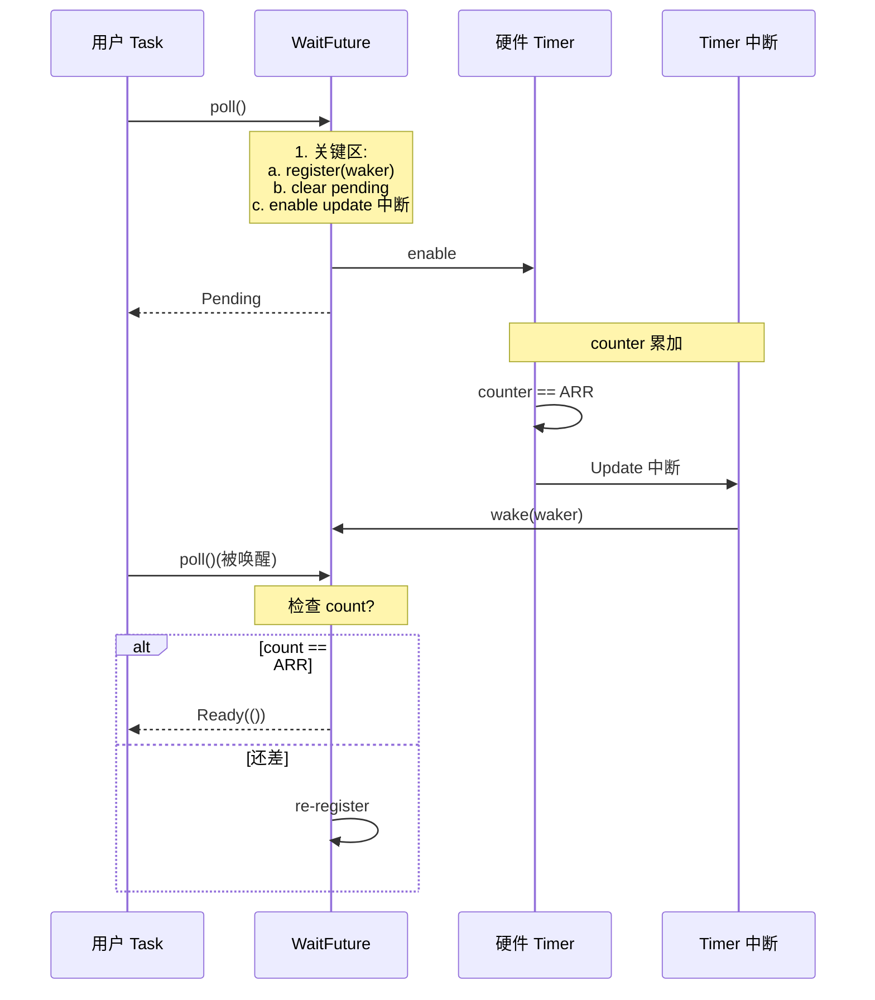

# 16. 硬件定时器与 PWM

> 撰写:2026-06-05
> 前置:`docs/12-gpio.md`(M4.1)+ `docs/13-uart.md`(M4.2)+ `docs/14-spi.md`(M4.3)+ `docs/15-i2c.md`(M4.4)
> 关联:`docs/09-stm32.md` §10 / `docs/10-nrf.md` §10 / `docs/11-rp.md` §10 平台 Timer 硬件特性
> 范围:PWM 输出(频率/占空比)+ Counter + Input Capture + QEI
> 不在范围:网络 / USB(M5);M3.2/3.3/3.4 §10 平台 Timer 硬件

---

## 目录

1. Timer 在 Embassy 中的位置
2. Timer trait 体系(`SetDutyCycle` / `Pwm` / `Counter`)
3. 跨平台统一抽象:`Pwm` / `SimplePwm` / `Counter`
4. PWM 配置:`Config` + 频率 + 占空比 + 对齐模式
5. 异步 `set_duty` / `capture_value` waker 机制
6. DMA 模式(Input Capture + Burst)
7. 平台实现差异:stm32 TIM vs nrf PWM(EasyDMA)vs rp PWM(Slice + PIO)
8. 实战 1:LED 调光 + 呼吸效果
9. 实战 2:舵机控制 + QEI 测速
10. 跨平台对比矩阵 + 调试技巧
11. 总结 + M5 网络导览

---

## 1. Timer 在 Embassy 中的位置

硬件定时器(Timer / Counter / PWM / Capture / QEI)是 MCU 的"输出控制"核心,广泛用于:
- **PWM 输出**:LED 调光、舵机控制、电机调速、音频
- **PWM 输入捕获**:测量外部信号频率 / 占空比(超声波、红外解码)
- **Counter / 定时**:周期性 task 唤醒(配合 M3.1 §6 time-driver)
- **QEI / Encoder**:电机转速 / 位置反馈(正交编码器)

Embassy 三平台 `stm32` / `nrf` / `rp` 都把 Timer 抽象成一致的 API 形状:

- **`Pwm` struct**:PWM 输出,提供 `set_duty()` / `set_frequency()` 等
- **`SimplePwm` struct**:简化版,仅 `set_duty()`(不可改频率)
- **`Counter<'d, T>` struct**:通用计数器,提供 `start()` / `wait()` / `now()`
- **`InputCapture` struct**:输入捕获,记录外部边沿时刻

**Embassy Timer 的几个关键事实**:

- **Waker 机制同构于 UART/SPI/I2C**——Counter 的 `wait()` 是典型应用
- **stm32 TIM 分类极其复杂**——通用 / 高级 / 基本 / 低功耗 + HRTIM(高分辨率)
- **nrf PWM 简化但有 PPI 联动**——PPI 触发其他外设动作
- **rp PWM Slice 灵活**——每个 Slice 含 2 个 channel,phase-correct + free-running 模式
- **`embedded_hal::Pwm` trait**——新旧两套(0.2 + 1.0)双实现

**本章不重复 M3.2/3.3/3.4 §10**:M3.2 §10 已讲过 stm32 TIM 复杂分类;M3.3 §10 已讲过 nrf PWM + PPI;M3.4 §10 已讲过 rp PWM Slice + PIO 替代。本章聚焦于:

| 主题 | 本章位置 |
|------|----------|
| 4 套 trait 选型(`SetDutyCycle` / `Pwm` / `Counter` / `embedded_hal::Pwm`)| §2 |
| `Pwm` / `SimplePwm` / `Counter` 跨平台对照 | §3 |
| `Config` + 频率计算跨平台 | §4 |
| 异步 `set_duty` / `wait` waker 实现 | §5 |
| Input Capture + DMA | §6 |
| 三平台硬件路径 TIM vs PWM vs Slice + PIO | §7 |
| 实战:LED 调光 + 舵机 + QEI | §8-9 |
| 10 维跨平台对比矩阵 | §10 |

---

## 2. Timer trait 体系

Embassy Timer 涉及 4 套 trait:输出控制(`Pwm` / `SetDutyCycle`)+ 计数(`Counter`)+ 捕获(`InputCapture`)+ 旧版(`embedded_hal::Pwm`)。

### 2.1 四套 trait 概览

| 套件 | 用途 | 关键 trait |
|------|------|------------|
| `embedded_hal` 0.2 + 1.0 | PWM 输出 | `Pwm` / `SetDutyCycle` |
| `embedded_hal` 0.2 | 计数 | `CountDown` / `Periodic` |
| `embedded_hal_async` | 异步计数 | `CountDown` (async) |
| Embassy 自定义 | 输入捕获 + QEI | `InputCapture` / `Qei` |

### 2.2 `SetDutyCycle` trait(基础)

```rust
pub trait SetDutyCycle {
    type Error;
    type Duty;
    fn set_duty(&mut self, duty: Self::Duty) -> Result<(), Self::Error>;
    fn get_max_duty(&self) -> Self::Duty;
}
```

**关键观察**:
- **Duty 类型**——`u8` / `u16` / `u32` 平台各异
- **`get_max_duty` 返回分辨率**——`u16` 通常 0-65535
- **同步操作**——`set_duty` 不阻塞(立即生效)

### 2.3 `embedded_hal::Pwm` trait(高级)

```rust
pub trait Pwm {
    type Channel;
    type Time;
    type Duty;

    fn enable(&mut self, channel: Self::Channel);
    fn disable(&mut self, channel: Self::Channel);
    fn set_duty(&mut self, channel: Self::Channel, duty: Self::Duty);
    fn set_duty_fraction(&mut self, channel: Self::Channel, num: u16, denom: u16);
    fn get_duty(&self, channel: Self::Channel) -> Self::Duty;
    fn get_max_duty(&self) -> Self::Duty;
    fn set_period(&mut self, period: Self::Time);
    fn get_period(&self) -> Self::Time;
}
```

**关键观察**:
- **多 channel**——每个 Pwm 实例有多个 channel
- **`set_duty_fraction(num, denom)`**——用分数表示占空比(0-65535/65535)
- **`set_period`**——运行时改频率
- **`embedded_hal` 1.0 的 `Pwm` trait 略有不同**——有 `ErrorType`

### 2.4 `Counter` trait(异步计数)

```rust
pub struct Counter<'d, T: Instance> {
    tim: Peri<'d, T>,
    freq: Hertz,
}

impl<'d, T: Instance> Counter<'d, T> {
    pub fn new(p: Peri<'d, T>, freq: Hertz) -> Self;
    pub fn start(&mut self) -> T::Interrupt;
    pub fn wait(&mut self) -> impl Future<Output = ()>;  // 等待 1 tick
    pub fn now(&self) -> u32;  // 读当前计数
    pub fn cancel(&mut self) -> bool;
}
```

**关键观察**:
- **`wait()` 是 async**——到下个 tick 唤醒(M3.1 §6 time-driver 的同构)
- **`now()` 是同步**——读当前计数值
- **`cancel()`**——取消等待(返回 true 表示取消了)

### 2.5 选型决策表

| 场景 | 推荐 trait | 原因 |
|------|-----------|------|
| LED 调光(只需 set_duty) | `SetDutyCycle` | 简单 |
| 电机调速(需 set_period) | `Pwm` | 频率/占空比都要调 |
| 周期性 task | `Counter::wait()` | 异步 |
| 测频 / 测占空比 | `InputCapture` | 输入捕获 |
| QEI 测速 | `Qei::count()` | 编码器 |

---

## 3. 跨平台统一抽象:`Pwm` / `SimplePwm` / `Counter` split

三平台都暴露 `Pwm` / `Counter` 等核心 struct。

### 3.1 `Pwm` struct 形状对照

| 平台 | 文件 | 关键方法 |
|------|------|----------|
| stm32 | `embassy-stm32/src/timer/{pwm,simple_pwm}.rs` | `new` / `set_duty` / `set_frequency` / `enable` |
| nrf | `embassy-nrf/src/pwm.rs` | `new` / `set_duty` / `set_period` / `set_seq` |
| rp | `embassy-rp/src/pwm.rs` | `new` / `set_duty` / `set_freq` / `split` |
| mspm0 | `embassy-mspm0/src/timer/pwm.rs` | 同 stm32 模式 |
| mcxa | `embassy-mcxa/src/ctimer/pwm.rs:58` | `enable` / `disable` / `set_duty` |
| microchip | `embassy-microchip/src/pwm.rs:72` | `new` / `set_duty` (频率不可变) |
| nxp | `embassy-nxp/src/pwm/lpc55.rs:69` | `new` / `set_duty` / `set_config` / `counter` |

### 3.2 `Pwm` vs `SimplePwm` 对比

| 维度 | `Pwm` | `SimplePwm` |
|------|-------|-------------|
| 频率运行时改 | 是 | 否 |
| 多个 channel 共享 timer | 是 | 否 |
| 死区 / 互补输出 | 是(高级 timer) | 否 |
| 资源消耗 | 高(占 1 个 timer + 多 channel) | 低 |
| 适用 | 电机 / 复杂波形 | LED / 简单调光 |

**关键观察**:
- **stm32 独有 `SimplePwm`**——为节省资源(多 LED 共享 timer)
- **nrf / rp 仅 `Pwm`**——PWM Slice 本身就支持频率可变
- **microchip 仅 `Pwm` 但频率固定**——`embassy-microchip/src/pwm.rs:74` 注释"Can change duty cycle, but not frequency"

### 3.3 stm32 `FullBridgeConverter` 高级 timer

文件:`embassy-stm32/src/hrtim/fullbridge.rs:9-16`

```rust
pub struct FullBridgeConverter<T: Instance, CH1: AdvancedChannel<T>, CH2: AdvancedChannel<T>> {
    timer: PhantomData<T>,
    ch1: PhantomData<CH1>,
    ch2: PhantomData<CH2>,
    dead_time: u16,
    duty: u16,
    minimum_duty: u16,
}
```

**关键观察**:
- **HRTIM**(High-Resolution Timer)是 stm32 独有外设
- **Full-Bridge Converter**——驱动 H 桥电路(电机控制核心)
- **`dead_time` 字段**——上下管切换的死区时间(防直通)
- **`minimum_duty`**——最小脉宽(防 MOSFET 损坏)
- **超出本篇范围**——详见 HRTIM 专题

### 3.4 microchip `Pwm` 详细(`embassy-microchip/src/pwm.rs:31-43`)

```rust
pub struct Config {
    pub invert: bool,         // 反相输出
    pub enable: bool,         // 使能 PWM slice
    pub frequency: u32,       // 目标频率
    pub duty_cycle: u16,      // 0-10000(0.01% 精度)
}
```

**关键观察**:
- **`duty_cycle` 精度 0.01%**——比 `u16` 0-65535 更高
- **`compute_parameters` 内部算法**(`embassy-microchip/src/pwm.rs:115-141`):
  - 优先用 48 MHz 高时钟(高频需求)
  - 否则用 100 kHz 低时钟(低频需求)
  - 选最优 1-16 divider

### 3.5 引脚 trait 约束

三平台用 phantom type 约束 PWM 输出引脚合法性:

```rust
let mut pwm = SimplePwm::new(
    p.TIM2,    // 实例
    Irqs,      // 中断
    p.PA0,     // Channel 1:实现 Channel1Pin<TIM2>
    p.PA1,     // Channel 2:实现 Channel2Pin<TIM2>
    1_000_000, // 1 MHz
);
```

**关键观察**:
- **不能用 `PA15` 当 Channel 1**——编译期失败
- **通道编号顺序**——每个 timer 有 1-4 个 channel
- **同一 timer 不同 channel 可独立占空比**

---

## 4. PWM 配置:`Config` + 频率 + 占空比 + 对齐模式

### 4.1 stm32 `SimplePwmBuilder`

```rust
// embassy-stm32/src/timer/simple_pwm.rs(简化)
pub struct SimplePwmBuilder<'d, T: Instance> {
    pub frequency: Hertz,   // 频率 Hz
    pub duty: u16,         // 占空比 0-65535
    pub pin_a: Peri<'d, ...>,
    pub pin_b: ...,
}

impl<'d, T: Instance> SimplePwmBuilder<'d, T> {
    pub fn new(p: Peri<'d, T>, freq: Hertz, ...) -> Self;
    pub fn build(self) -> SimplePwm<'d, T>;
}
```

### 4.2 nrf `Pwm` Builder

文件:`embassy-nrf/src/pwm.rs`

```rust
impl<'d> Pwm<'d> {
    pub fn new(
        pwm: Peri<'d, impl Instance>,
        p0: Peri<'d, impl PwmPin>,
        config: Config,
        sequence: PwmSequence,
    ) -> Self;
    pub fn set_duty(&mut self, channel: u8, duty: u16);
    pub fn set_period(&mut self, period: u16);
    pub fn set_seq(&mut self, seq: PwmSequence);
}
```

**关键观察**:
- nrf **PWM 序列**(`PwmSequence`)概念独特——一组 channel + duty 值
- **占空比步进 1/period**——period 越大,精度越高
- **`Pwm::set_period` 改频率**——影响所有 channel

### 4.3 rp `Pwm` Builder

文件:`embassy-rp/src/pwm.rs`

```rust
// embassy-rp/src/pwm.rs(Pwm impl)
impl<'d, T: Instance> Pwm<'d, T> {
    pub fn new(
        pwm: Peri<'d, T>,
        a: Peri<'d, impl PwmPinA<T>>,
        b: Peri<'d, impl PwmPinB<T>>,
        config: Config,
    ) -> Self;
    pub fn set_duty(&mut self, channel: PwmChannel, duty: u8);
    pub fn set_freq(&mut self, freq: Hertz);
    pub fn split(self) -> (PwmOutput<'d, T, A>, PwmOutput<'d, T, B>);
}
```

**关键观察**:
- rp **每个 Slice 有 2 个 channel**(A / B)
- **`PwmChannel` enum**:`A` / `B` 替代 `u8`
- **`split` 拆成两个独立 `PwmOutput`**——两 task 各自调占空比
- **`Pwm::set_freq` 改频率**——slice 内两 channel 同步
- **`Pwm::set_duty` 直接写 `pwm().ch(slice).cc`**——同步操作,无 waker

### 4.4 频率计算公式

| 平台 | 公式 | 范围 |
|------|------|------|
| stm32 | `fck / ((PSC + 1) * (ARR + 1))` | 由 APB 决定 |
| nrf | 固定基频(16 MHz)+ 整数分频 | 16 Hz - 500 kHz |
| rp | `clk_sys / (8 * (TOP + 1))` 整数 | 由 clk_sys 决定 |
| microchip | `(target_freq > MIN_HIGH) ? 48M : 100k` 切换时钟 + divider | 100 kHz - 48 MHz |

**关键观察**:
- 实际频率 = 目标频率的最近整数分频值
- 高频精度损失大(如 1 MHz ± 1%)
- 舵机 50 Hz 是低频(易精确),电机 25 kHz 是高频(精度可放宽)

### 4.5 占空比表示

| 平台 | 占空比类型 | 精度 |
|------|------------|------|
| stm32 | `u16`(0-65535) | 1/65535 ≈ 0.0015% |
| nrf | `u16`(`period` 决定)| 1/period |
| rp | `u8`(0-255) | 1/255 ≈ 0.39% |
| microchip | `u16`(0-10000)| 0.01% |
| lpc55 | `u32` + `top` | 1/top |

**关键观察**:
- **rp 精度最低**(u8)——但够用(LED 调光)
- **microchip 精度最高**——0.01% 用于电源管理
- **stm32 u16 是标准**——大多数场景够用

### 4.6 对齐模式

| 模式 | 描述 | 用途 |
|------|------|------|
| 边沿对齐(Edge-aligned) | 计数器从 0 累加到 TOP,立即重置 | 简单(默认)|
| 中心对齐(Center-aligned / Phase-correct) | 计数 0→TOP→0,正反两段输出 | 电机 / 音频(对称噪声)|

**关键观察**:
- **rp 独有 phase_correct**——`embassy-rp/src/pwm.rs` 中 `phase_correct: true` 设置
- **stm32 仅边沿对齐**——如需中心对齐,需 complex 模式
- **nrf 不支持**——硬件固定边沿对齐
- **中心对齐优点**——PWM 切换点对称,EMI 更好
- **中心对齐缺点**——频率减半(2x 周期 = 1 个完整周期)

---

## 5. 异步 `set_duty` / `wait` waker 机制

本章核心。PWM `set_duty` 本身是同步操作(无 waker),但 `Counter::wait` 是典型异步 waker 应用——同构于 GPIO `wait_for_xxx`(M4.1 §6)。

### 5.1 通用状态机(`Counter::wait`)

```text
1. 检查当前计数是否已到 tick
   - 已到 → 立即返回 Ready
   - 未到 → 继续
2. 关键区保护:
   a. 注册 waker
   b. 清除 pending 中断
   c. 使能 counter 溢出中断
3. 等待(waker 未唤醒,future 返回 Pending)
4. counter 计数到 ARR → 溢出 → ISR 触发 → waker.wake()
5. future 被 poll → 重新检查计数 → 返回 Ready
```

**关键观察**:
- **PWM 输出**无 waker(同步写寄存器)
- **Counter `wait()`** 是典型 waker 应用
- **Input Capture** 也用 waker(等待边沿事件)

### 5.2 完整流程图(Mermaid)



### 5.3 stm32 `Counter::wait` 详细实现

```rust
// embassy-stm32/src/timer/counter.rs(简化)
pub async fn wait(&mut self) {
    // 关键区:waker 注册
    self.tim.cnt().reset();
    self.waker.register(cx.waker());
    // 清除 pending + 使能中断
    self.tim.dier().modify(|w| {
        w.set_uie(true);  // Update Interrupt Enable
    });
    // 等 ISR wake
}
```

**关键观察**:
- **`UIE`(Update Interrupt Enable)**:counter 溢出时触发
- **ISR 内清 pending + wake**
- **重新检查** `wait` 的边界条件

### 5.4 nrf `Pwm::set_duty` 同步

nrf `Pwm::set_duty` 是同步操作——直接写 `seq[channel].duty` 寄存器:

```rust
// embassy-nrf/src/pwm.rs(Pwm::set_duty)
pub fn set_duty(&mut self, channel: u8, duty: u16) {
    self.seq.values[channel as usize].duty = duty;
    // 触发 PWM 更新
    self.tasks_seqstart(0).write_value(1);
}
```

**关键观察**:
- **nrf PWM 是"序列"**——一组 channel + duty 值 + 重复次数
- **改 duty 需重启序列**——`tasks_seqstart` 触发
- **无 waker**——纯寄存器操作
- **`PwmSequence::new` 构造**——4 values + period 计数

### 5.5 rp `Pwm::set_duty` 同步

```rust
// embassy-rp/src/pwm.rs(Pwm::set_duty)
pub fn set_duty(&mut self, channel: PwmChannel, duty: u8) {
    let slice = self.slice_number();
    match channel {
        PwmChannel::A => pwm().ch(slice).cc.write(|w| w.set_a(duty as u16)),
        PwmChannel::B => pwm().ch(slice).cc.write(|w| w.set_b(duty as u16)),
    }
}
```

**关键观察**:
- **直接写 `cc`(Compare Control)寄存器**——`a` 和 `b` 字段对应两个 channel
- **无 waker**——立即生效(下一个 PWM 周期)
- **`set_duty_fraction`** 等同——计算 `duty * max_duty / 65535`

### 5.6 waker 应用汇总

| 操作 | 异步? | Waker 容器 |
|------|-------|-----------|
| `Pwm::set_duty` | 否(同步) | — |
| `Pwm::set_freq` | 否(同步) | — |
| `Counter::wait` | 是 | `AtomicWaker[inst]` |
| `Counter::now` | 否(同步读 CNT)| — |
| `InputCapture::wait_for_rising_edge` | 是 | `AtomicWaker[inst]` |
| `Qei::count` | 否(同步读 CNT)| — |

**关键观察**:
- **PWM 输出是同步**(直接写寄存器)
- **计数 / 捕获是异步**(等硬件事件)
- **QEI 是同步读**(硬件自动计数)

---

## 6. DMA 模式(Input Capture + Burst)

Input Capture 是"用 DMA 抓取多个边沿时刻"的高阶应用。

### 6.1 Input Capture 基础

**Input Capture** 记录外部边沿(上升/下降/双)发生的时刻,用于:
- 超声波测距(测 Echo 脉宽)
- 红外解码(测高低电平持续时间)
- PWM 输入模式(测外部 PWM 的频率和占空比)

### 6.2 stm32 Input Capture + DMA

参考 `examples/stm32f1/src/bin/input_capture.rs`:

```rust
// examples/stm32f1/src/bin/input_capture.rs
let ch3 = CapturePin::new(p.PA2, Pull::None);
let mut ic = InputCapture::new::<AfioRemap<0>>(
    p.TIM2, None, None, Some(ch3), None, Irqs,
    khz(1000), Default::default()
);

loop {
    ic.wait_for_rising_edge(Channel::Ch3).await;
    let capture_value = ic.get_capture_value(Channel::Ch3);
    info!("new capture! {}", capture_value);
}
```

**关键观察**:
- **TIM2_CH3** (`embassy-stm32/src/timer/input_capture.rs`)接受外部 PWM
- **`wait_for_rising_edge`** 异步等下一个上升沿
- **`get_capture_value`** 读捕获寄存器(CCR3)
- **频率 1 kHz**——TIM2 计数频率

### 6.3 多 capture + DMA

```rust
// embassy-stm32/src/timer/input_capture.rs(简化)
pub async fn capture_dma(
    &mut self,
    channel: Channel,
    dma_buf: &mut [u16],
) -> Result<(), Error> {
    let cc = self.tim.cc(channel.index());
    let request = self.dma_config.request;

    let transfer = unsafe {
        dma::read(
            self.dma,
            request,
            &mut *cc,
            dma_buf,
            Default::default(),
        )
    };

    transfer.await
}
```

**关键观察**:
- **DMA 从 CCR(捕获寄存器)读 N 个值**——每次捕获触发一次 DMA
- **典型应用**:测 1000 个边沿,自动填充缓冲
- **无需 CPU 介入**——DMA 完成中断唤醒

### 6.4 PWM 输入模式

**PWM 输入模式** 同时测频率和占空比——捕获 IC1(上升沿)和 IC2(下降沿):

| 通道 | 触发 | 测量 |
|------|------|------|
| IC1 | 上升沿 | 周期 |
| IC2 | 下降沿 | 高电平时间 |
| 占空比 | = IC2 / IC1 | — |

**关键观察**:
- **stmf1 IC1 + IC2 配对**(`embassy-stm32/src/timer/input_capture.rs:1-100`)
- **测外部 PWM 频率/占空比**——典型应用
- **精度 = TIM 时钟**——72 MHz → 13.89 ns 分辨率

---

## 7. 平台实现差异:stm32 TIM vs nrf PWM vs rp PWM(Slice + PIO)

### 7.1 stm32 TIM:多版本 + 复杂分类

**架构**:`Peripheral → Counter + CCR + DMA + 中断`

- **通用 TIM**(TIM2-TIM5):16/32 位,基础 PWM / Counter / Capture
- **高级 TIM**(TIM1 / TIM8):带互补输出 + 死区,适合电机
- **基本 TIM**(TIM6 / TIM7):仅基础定时,DAC 触发
- **低功耗 TIM**(LPTIM):在低功耗模式运行
- **HRTIM**(High-Resolution):184 ps 精度,适合开关电源
- **PWM / Counter / Input Capture / OnePulse / Encoder / QEI**——所有功能

**关键观察**:
- stm32 是"最复杂 Timer"——分类繁多
- 适合需要精细 PWM 控制(电机、电源、音频)
- 资源多但学习曲线陡

### 7.2 nrf PWM:序列驱动 + PPI 联动

**架构**:`PWM 外设 → 序列(Seq0/1/2)+ 重复计数`

- **nRF52840 4 个 PWM 外设**——每个 4 channel(共 16 channel)
- **PWM 序列**(`PwmSequence`)——一组值
- **PPI 联动**——PWM 事件触发其他外设(GPIOTE / SAADC / TIMER)
- **无 DMA**——序列值在 RAM 中,自动循环
- **频率范围**:16 Hz - 500 kHz

**关键观察**:
- nrf 是"最易 PWM"——序列 + 重复
- **PPI 联动优势**——音频 + LED + 蜂鸣器一气呵成
- 缺点:无中心对齐,无死区控制

### 7.3 rp PWM:Slice + PIO 替代

**架构 1(普通 PWM)**:`PWM Slice → 16-bit Counter + 2 channel A/B`
- 每个 Slice 2 channel
- 8 Slice(共 16 channel)
- 16 位 counter
- 中心对齐(`phase_correct`)
- 自由运行 / 一次性模式

**架构 2(PIO PWM)**:`PIO State Machine → 模拟 PWM + DMA`
- 任意 GPIO 引脚
- 任意频率(无限制)
- 多 channel(每个 PIO block 4 SM × 多个 PIO 指令)

**关键观察**:
- rp 是"最灵活 PWM"——Slice + PIO 双方案
- 普通 Slice 适合标准 PWM
- PIO 适合特殊需求(多通道 / 任意 GPIO / 任意协议)

### 7.4 平台特性对照矩阵

| 特性 | stm32 | nrf | rp | microchip | lpc55 |
|------|-------|-----|-----|----------|-------|
| 1. PWM channel 数 | 1-4 / TIM | 4 / PWM 外设 | 2 / Slice | 1 / PWM | 1 / SCT |
| 2. 频率范围 | 1 Hz - MHz | 16 Hz - 500 kHz | 1 Hz - MHz | 100 k - 48 M | 96 M / 256 |
| 3. 占空比精度 | u16 | u16 | u8(0.39%) | u16(0.01%) | u32 |
| 4. 中心对齐 | 部分 | 否 | 是 | 否 | 是 |
| 5. 死区控制 | 是(高级 TIM)| 否 | 否 | 否 | 否 |
| 6. 互补输出 | 是(高级 TIM)| 否 | 否 | 否 | 否 |
| 7. DMA | 是(CCR)| 否(序列) | 是(PIO)| 否 | 否 |
| 8. PPI / 等价 | 是(DMA 触发)| 是(PPI)| 否 | 否 | 否 |
| 9. QEI / Encoder | 是 | 否(用 GPIOTE)| 是(PIO)| 否 | 是 |
| 10. Input Capture | 是 | 否(用 PPI + TIMER)| 否(PIO)| 否 | 是 |

### 7.5 关键入口 file:line 速查

| 平台 | 文件:行 | 类型 |
|------|---------|------|
| stm32 | `embassy-stm32/src/hrtim/fullbridge.rs:9` | `FullBridgeConverter` struct |
| stm32 | `embassy-stm32/src/hrtim/fullbridge.rs:137` | `set_duty` |
| nrf | `embassy-nrf/src/pwm.rs` | `Pwm` 完整实现 |
| nrf | `embassy-nrf/src/pwm.rs:PwmSequence` | 序列类型 |
| rp | `embassy-rp/src/pwm.rs:Pwm` | Slice 入口 |
| microchip | `embassy-microchip/src/pwm.rs:72` | `Pwm` struct |
| microchip | `embassy-microchip/src/pwm.rs:115` | `compute_parameters` |
| lpc55 | `embassy-nxp/src/pwm/lpc55.rs:69` | `Pwm` struct |
| lpc55 | `embassy-nxp/src/pwm/lpc55.rs:236` | `counter` |
| mcxa | `embassy-mcxa/src/ctimer/pwm.rs:58` | `Pwm` struct |

### 7.5 选型建议

- **stm32 适合电机 / 电源**——高级 TIM + 死区 + 互补输出 + HRTIM
- **nrf 适合 LED / 蜂鸣器 / 音频**——PPI 联动 + 多 PWM 外设
- **rp 适合通用 PWM**——Slice + PIO 双方案灵活
- **microchip 适合电源管理**——0.01% 精度 + 48 MHz
- **lpc55 适合工业**——SCTimer 多状态机

---

## 8. 实战 1:LED 调光 + 呼吸效果

最简 PWM 实战:控制 LED 亮度渐变(呼吸效果)。

### 8.1 stm32 版本

参考 `examples/stm32f4/src/bin/pwm.rs`:

```rust
let mut pwm = SimplePwm::new(p.TIM2, Irqs, p.PA0, p.PA1, 1_000_Hz);
let max = pwm.get_max_duty();
pwm.channel(Channel::Ch1).set_duty(max / 2);

loop {
    for i in 0..max {
        pwm.channel(Channel::Ch1).set_duty(i);
        Timer::after_millis(5).await;
    }
}
```

### 8.2 nrf 版本

参考 `examples/nrf52840/src/bin/pwm.rs`:

```rust
let mut pwm = Pwm::new(
    p.PWM0,
    p.P0_08,  // channel 0
    Config::default(),
    PwmSequence::new([
        PwmValue::Normal(0),     // channel 0: 0% duty
    ], 1000),  // 1000 ticks period
);
pwm.set_duty(0, 50);  // 50% duty
```

### 8.3 rp 版本

参考 `examples/rp/src/bin/pwm.rs`:

```rust
let mut pwm = Pwm::new(
    p.PWM_CH0,  // slice 0
    p.PIN_0,    // channel A
    p.PIN_1,    // channel B
    Config::default(),
);

pwm.set_duty(PwmChannel::A, 128);  // 50% (128/255)
```

### 8.4 三平台代码对比

| 维度 | stm32 | nrf | rp |
|------|-------|-----|----|
| 资源 | `TIM2` | `PWM0` | `PWM_CH0` |
| Pin | `PA0` | `P0_08` | `PIN_0` |
| 占空比 | `max / 2`(`u16`)| `50`(`u16`)| `128`(`u8`) |
| 共同点 | `set_duty(...)` | | |

### 8.5 呼吸效果 pattern

```rust
async fn breathe(pwm: &mut Pwm, max_duty: u16) {
    // 渐亮
    for i in 0..max_duty {
        pwm.set_duty(0, i);
        Timer::after_micros(5000).await;  // 5 ms × 256 = 1.28s
    }
    // 渐暗
    for i in (0..max_duty).rev() {
        pwm.set_duty(0, i);
        Timer::after_micros(5000).await;
    }
}

loop { breathe(&mut pwm, max).await; }
```

**关键观察**:
- **`Timer::after_micros` 异步阻塞**——不浪费 CPU
- **总周期 = 256 × 5 ms × 2 = 2.56 秒**——慢呼吸
- **PWM 周期远小于呼吸周期**——PWM 1 kHz,呼吸 0.4 Hz

### 8.6 性能观察

**PWM 1 kHz,呼吸 2.5 秒**:
- PWM 占空比变化 256 阶 → 每阶 5 ms
- CPU 占用低(主要是 `Timer::after_micros` 等待)
- 适合 LED 调光

**优化**:
- 用指数曲线而非线性(更自然)
- 查表(预计算 sin 曲线)节省 CPU

---

## 9. 实战 2:舵机控制 + QEI 测速

### 9.1 舵机控制

**舵机原理**:接收 50 Hz PWM(20 ms 周期),脉宽 1-2 ms 对应 0-180 度。
- 1.0 ms = 0 度
- 1.5 ms = 90 度
- 2.0 ms = 180 度

```rust
async fn set_servo_angle(pwm: &mut Pwm, angle: u8) {
    // 50 Hz 周期 20 ms,pulse_us: 1000-2000
    let pulse_us = 1000 + (angle as u32) * 1000 / 180;
    let duty = (pulse_us * pwm.max_duty() as u32 / 20_000) as u16;
    pwm.set_duty(0, duty);
}

loop {
    set_servo_angle(&mut pwm, 0).await;
    Timer::after_millis(1000).await;
    set_servo_angle(&mut pwm, 90).await;
    Timer::after_millis(1000).await;
    set_servo_angle(&mut pwm, 180).await;
    Timer::after_millis(1000).await;
}
```

**关键观察**:
- **50 Hz PWM 周期 = 20 ms**
- **duty 精度 0.0015%**(u16 / 65535)——足够 0.5 度精度
- **典型应用**:机器人、机械臂、摄像头云台

### 9.2 电机 PWM + QEI 测速

**直流电机控制**:PWM 调速 + QEI 测转速 + 闭环控制

```rust
// PWM 调速
let mut motor_pwm = Pwm::new(p.TIM1, p.PA8, p.PA9, 25_000_Hz);  // 25 kHz
motor_pwm.set_duty(0, 200);  // 200/65535 ≈ 0.3%

// QEI 测速
let mut qei = Qei::new(p.TIM2, p.PA0, p.PA1);  // A 相 + B 相
loop {
    Timer::after_millis(100).await;
    let count = qei.count();  // 当前计数
    let rpm = count * 60 * 10 / ENCODER_PPR;  // 100 ms × 10 = 1 s → rpm
    info!("RPM: {}", rpm);

    // PID 控制
    let target = 1500;  // 目标 1500 rpm
    let error = target as i32 - rpm as i32;
    let new_duty = pid_update(error);
    motor_pwm.set_duty(0, new_duty as u16);
}
```

**关键观察**:
- **PWM 25 kHz**——超出人耳听觉(避免噪声)
- **QEI 4x 解码**——每个脉冲 4 个计数(精度 × 4)
- **PID 控制**——`error * Kp + integral * Ki + derivative * Kd`
- **闭环周期 100 ms**——不能太快(噪声敏感)

### 9.3 电机驱动电路

```
PWM ────> DRV8871/DRV8833 ────> 直流电机
QEI A/B ─> STM32 TIM Encoder
```

**关键观察**:
- **H 桥电路**——控制电机正反转
- **驱动芯片**——如 DRV8871(单芯片 H 桥)
- **PWM + 方向引脚**——控制速度和方向
- **PWM 互补 + 死区**——高端 stm32 TIM 支持(见 §3.3)

### 9.4 实战陷阱

- **PWM 频率太低(< 20 kHz)**——电机噪声
- **PWM 频率太高(> 100 kHz)**——开关损耗大
- **QEI 抖动**——硬件滤波或软件平均
- **PWM 占空比 0% / 100%**——某些电机驱动器需要 > 0% / < 100% 才行
- **电磁干扰**——电机电源与信号线分离

---

## 10. 跨平台对比矩阵 + 调试技巧

### 10.1 10 维跨平台对比矩阵

| 维度 | stm32 | nrf | rp | microchip | lpc55 |
|------|-------|-----|-----|----------|-------|
| 1. PWM channel 数 / 实例 | 1-4 | 4 | 2 | 1 | 1 |
| 2. 频率范围 | 1 Hz - MHz | 16 Hz - 500 kHz | 1 Hz - MHz | 100 k - 48 M | 96 M / 256 |
| 3. 占空比精度 | u16 | u16 | u8 | u16(0.01%)| u32 |
| 4. 中心对齐 | 部分 | 否 | 是 | 否 | 是 |
| 5. 死区控制 | 是(高级)| 否 | 否 | 否 | 否 |
| 6. 互补输出 | 是(高级)| 否 | 否 | 否 | 否 |
| 7. DMA | 是(CCR)| 否(序列)| 是(PIO)| 否 | 否 |
| 8. PPI / 联动 | 是(DMA)| 是(PPI)| 否(PIO)| 否 | 否 |
| 9. QEI / Encoder | 是 | 否(GPIOTE)| 是(PIO)| 否 | 是 |
| 10. Input Capture | 是 | 否(PPI + TIMER)| 否(PIO)| 否 | 是 |

### 10.2 调试技巧

#### 10.2.1 平台无关的"5 步 PWM 排查"

1. **检查 pin 配置**——是否被其他外设占用?是否需要 `afio` 配置(stm32)?
2. **检查 `bind_interrupts!`**——TIM / PWM 中断是否声明?
3. **检查 `Config.frequency`**——是否超出硬件能力?
4. **检查 `set_duty` 值**——`u8` / `u16` 范围?(不能超 `max_duty`)
5. **用示波器测实际输出**——验证占空比与代码一致

#### 10.2.2 平台特定陷阱

- **stm32**:高级 TIM(TIM1 / TIM8)有 4 channel,通用 TIM(TIM2-5)有 4 channel,基本 TIM(TIM6/7)无 PWM
- **nrf**:`PwmSequence` 最多 4 values,改 duty 需重启序列
- **rp**:`Pwm::set_duty` 接收 `u8`(0-255),不是 `u16`
- **microchip**:PWM 频率不可变(在 `embassy-microchip/src/pwm.rs:74` 注释说明)

#### 10.2.3 Input Capture 精度调试

```rust
// 1. 验证 TIM 时钟
rprintln!("APB1 freq: {}", apb1_freq());
// 2. 检查 CCER (capture enable)
rprintln!("CCER: {:032b}", ccer.read());
// 3. 读 CCR 值
rprintln!("CCR: {}", ccr.read().data());
```

#### 10.2.4 性能分析

- **PWM 频率**:`scope` 测输出引脚频率
- **占空比精度**:`scope` 测量 + 与代码值对比
- **Counter 精度**:`DWT->CYCCNT` 测量 `wait()` 实际间隔
- **QEI 抖动**:连续读 100 次取平均

---

## 11. 总结 + M5 网络导览

### 11.1 核心要点回顾

1. **`Pwm` / `SimplePwm` / `Counter` 三平台形状相似**——同 M4.1-M4.4 的"软约定"
2. **PWM 输出是同步操作**(`set_duty` 无 waker),`Counter::wait` 才是异步 waker 模式
3. **stm32 TIM 分类最复杂**——通用 / 高级 / 基本 + HRTIM,适合精细控制
4. **nrf PWM 序列 + PPI**——音频 / LED / 蜂鸣器一气呵成
5. **rp PWM Slice + PIO 双方案**——灵活度高
6. **占空比精度差异**:`u8`(rp) / `u16`(stm32 / nrf) / `u16 0.01%`(microchip)

### 11.2 与 M3 系列的衔接

| 已学 | 本章深化 | M5+ 拓展 |
|------|----------|-----------|
| M3.2 §10 stm32 TIM 分类 | HRTIM / 死区控制(§3.3)| M5 网络时间戳也用 TIM |
| M3.3 §10 nrf PWM | 序列驱动 + PPI(§7.2)| nrf PPI + Radio + TIMER |
| M3.4 §10 rp PWM Slice | PIO 替代 + QEI(§7.3)| rp PIO 网络协议(以太网)|

### 11.3 M5 网络导览

下一里程碑 M5 将讨论:

- **embassy-net 网络栈**:`Stack` / `TcpSocket` / `UdpSocket` / `DhcpConfig`
- **TCP / UDP 异步连接**:同构于 UART/SPI 的 waker 模式
- **DNS / mDNS / DHCP**:自动化网络配置
- **embassy-usb 设备栈**:`UsbDevice` / `Endpoint` / 描述符
- **蓝牙低功耗(ble)**:nrf 专属 BLE 栈
- **LoRa 远程通信**:长距离低功耗通信

Timer/PWM 是输出控制核心,M5 进入"网络 + 通信协议"——同样是 waker 模式的扩展。

---

## 参考

### Embassy 源码

- `embassy-stm32/src/timer/{pwm,simple_pwm,counter,input_capture}.rs`
- `embassy-stm32/src/hrtim/fullbridge.rs:9-180`(HRTIM 完整实现)
- `embassy-stm32/src/hrtim/fullbridge.rs:137`(`set_duty` 实现)
- `embassy-nrf/src/pwm.rs`
- `embassy-nrf/src/pwm.rs:PwmSequence`(`PwmSequence` 序列类型)
- `embassy-nrf/src/pwm.rs`(`Pwm::set_duty` 同步实现)
- `embassy-rp/src/pwm.rs`(`Pwm` Slice 完整实现)
- `embassy-rp/src/pwm.rs`(`Pwm::set_duty` 同步,`cc.a` / `cc.b` 字段)
- `embassy-microchip/src/pwm.rs:72`(`Pwm` struct)
- `embassy-microchip/src/pwm.rs:31`(`Config` struct)
- `embassy-microchip/src/pwm.rs:115`(`compute_parameters` 频率计算)
- `embassy-nxp/src/pwm/lpc55.rs:69`(`Pwm` struct)
- `embassy-nxp/src/pwm/lpc55.rs:236`(`counter` 方法)
- `embassy-mcxa/src/ctimer/pwm.rs:58`(`Pwm` struct)
- `embassy-mspm0/src/timer/pwm.rs`

### Embassy examples/

- `examples/stm32f4/src/bin/pwm.rs`(stm32 SimplePwm)
- `examples/stm32f4/src/bin/pwm_complementary.rs`(stm32 高级 TIM)
- `examples/stm32f1/src/bin/input_capture.rs`(stm32 Input Capture)
- `examples/nrf52840/src/bin/pwm.rs`(nrf PWM 序列)
- `examples/rp/src/bin/pwm.rs`(rp PWM Slice)
- `examples/rp/src/bin/pio_pwm.rs`(rp PIO PWM)

### embedded-hal 系列

- `embedded_hal::Pwm` 0.2 + 1.0:`Pwm` / `SetDutyCycle`
- `embedded_hal::CountDown`(同步计数)
- `embedded_hal_async::CountDown`(异步计数)

### 外部资源

- STM32 Reference Manual:`TIM` 章节(每个 timer 变体独立章节)
- nRF52840 Product Specification:`PWM` 章节
- RP2040 Datasheet:`PWM` + `PIO` 章节
- 舵机控制标准:50 Hz PWM, 1-2 ms 脉宽
- QEI 协议:正交编码 4x 解码

### 上游文档

- `embassy-rs/embassy` GitHub:`docs/` + `examples/`
- 各 HAL 子 crate README

### 本项目其他文档

- `docs/01-overview.md` ~ `docs/07-futures.md`:M1-M2 基础
- `docs/08-hal-architecture.md`:M3.1 HAL 架构
- `docs/12-gpio.md`:M4.1 GPIO(PWM 输出引脚)
- `docs/13-uart.md`:M4.2 UART
- `docs/14-spi.md`:M4.3 SPI
- `docs/15-i2c.md`:M4.4 I2C
- 下一里程碑:M5 网络与通信栈(`docs/17-net.md` 起)
