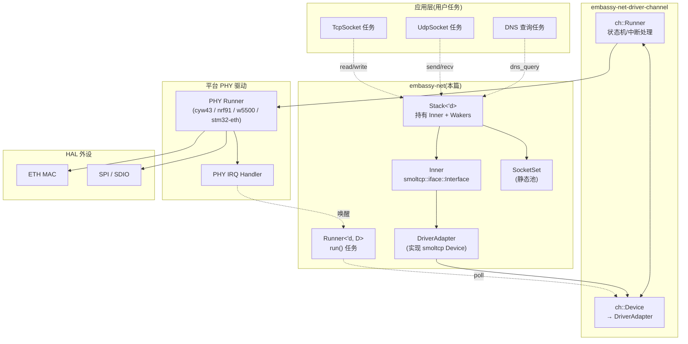
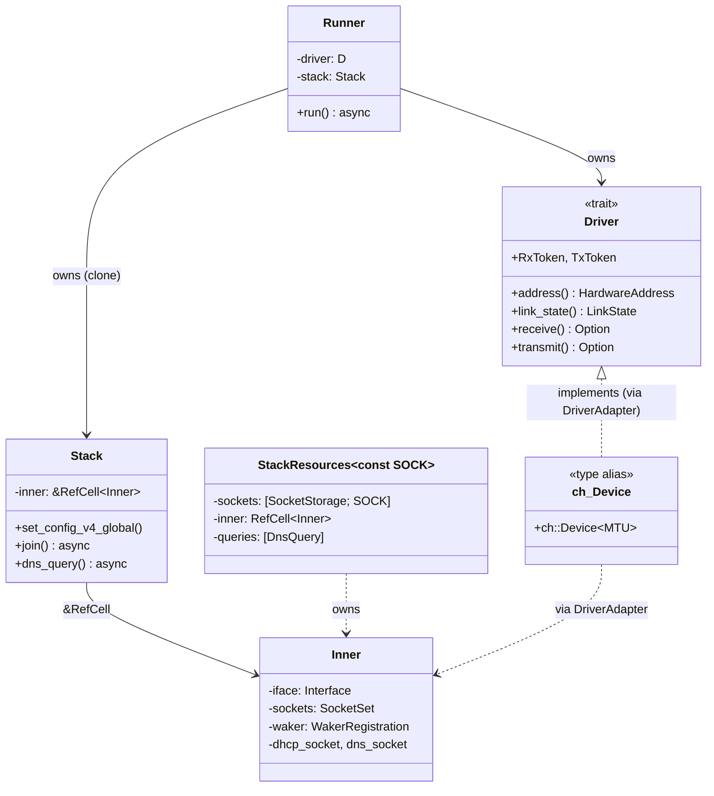
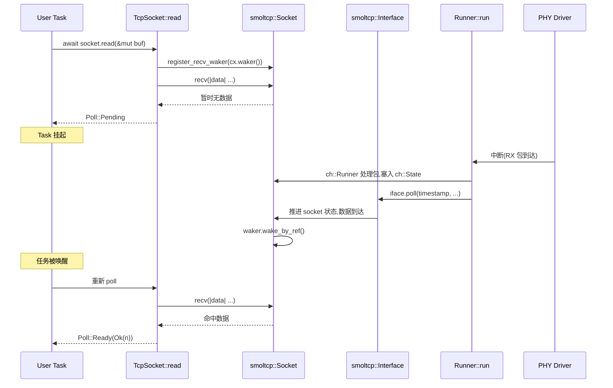
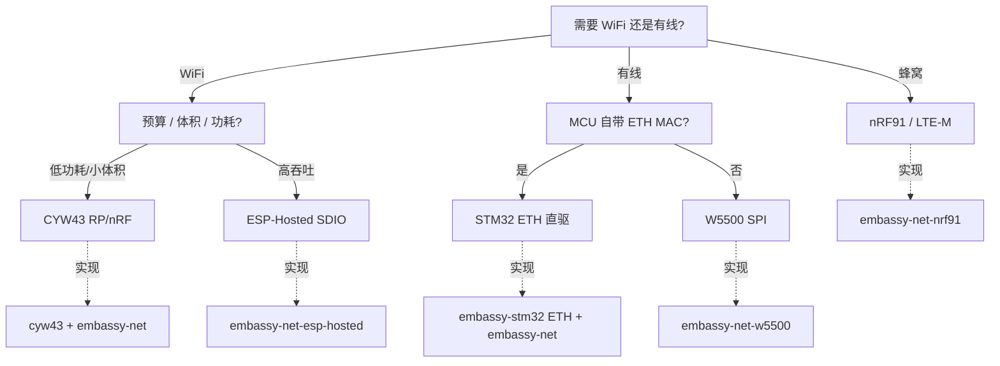

# 17. embassy-net 网络栈

> 本篇分析 `embassy-net` crate 的架构与实现,涵盖 smoltcp 集成、Driver/Stack/Runner 三件套、TCP/UDP/DHCP/DNS API、跨 PHY 平台(STM32 ETH / CYW43 / nRF91 / W5500 等)集成模式。

---

## 目录

1. embassy-net 在 Embassy 全局中的位置
2. 核心类型体系:`Driver` / `Stack` / `Runner` / `Resources`
3. smoltcp 集成:wire 设备抽象与时间/IPC 适配
4. Socket API:TCP / UDP / ICMP / Raw
5. DHCP 与 DNS:零配置接入
6. (下接 Part B)
7. (下接 Part B)
8. (下接 Part B)
9. (下接 Part B)
10. (下接 Part B)
11. (下接 Part B)

---

## 1. embassy-net 在 Embassy 全局中的位置

embassy-net 是 Embassy 框架中负责网络协议栈的 crate,定位是 **"协议无关的网络应用层接口 + 平台 PHY 适配的统一入口"**。它不直接操作硬件,而是通过 `embassy-net-driver-channel` 抽象与底层 PHY 驱动通信;协议层则把 smoltcp 这一成熟的同步协议栈包装成与 embassy-executor 协作的异步接口。

### 1.1 在 crate 拓扑中的角色

embassy-net 的依赖关系(精简):

```
embassy-net(本篇)
├── smoltcp                # 同步协议栈(TCP/UDP/IPv4/IPv6/DHCP/ICMP)
├── embassy-time           # 异步时间(Instant / Duration)
├── embassy-futures         # select / yield_now 等组合子
├── embedded-io-async      # 异步 I/O trait(Socket 借用)
├── embassy-net-driver-channel   # 驱动↔stack 通道抽象
└── managed                # 静态分配集合(DnsQuery 池等)
```

`embassy-net` 既被上层应用直接使用(创建 TcpSocket / UdpSocket),也被平台特定 crate 间接使用(cyw43 / embassy-net-esp-hosted / embassy-net-nrf91 / embassy-net-stm32-wpan)。这些平台 crate 都通过 `ch::Device<'a, MTU>` 类型别名实现 `NetDriver` 接口。

### 1.2 与 Embassy 三大基座的协作

embassy-net 严格遵守 Embassy "不分配 + 零成本抽象" 的原则:

| 基座 | 协作方式 |
|------|----------|
| `embassy-executor` | `Runner::run()` 是 `async fn`,作为任务 spawn;`Stack` 通过 `WakerRegistration` 唤醒等待的 socket |
| `embassy-time` | 用 `embassy_time::Instant` 与 smoltcp 的 `Instant` 互转(`time.rs` 的 `instant_to_smoltcp` / `instant_from_smoltcp`) |
| `embassy-sync` | DNS 解析队列 / DHCP 状态机内部使用 `RefCell` 保护共享状态;`Socket` 池是 `static` 数组 |

### 1.3 与 M3 HAL 层的关系

M3 文档(`08-hal-architecture.md` / `09-stm32.md` / `10-nrf.md` / `11-rp.md`)描述了 HAL 层如何抽象 GPIO / UART / SPI / I2C 等外设。embassy-net **不依赖** 任何具体 HAL,而是依赖 PHY 驱动(STM32 ETH / CYW43 / W5500 等)提供的 `Driver` 实现。这是清晰的分层:

```
应用层
  └→ TcpSocket / UdpSocket (embassy-net 公开 API)
       └→ Stack (内部持有 smoltcp Interface)
            └→ DriverAdapter (适配 smoltcp 的 wire Device)
                 └→ ch::Device (embassy-net-driver-channel)
                      └→ 平台 PHY Runner (cyw43 / nrf91 / stm32-eth / w5500)
                           └→ HAL 外设 (SPI / ETH MAC / UART)
```

### 1.4 适用平台清单

embassy-net 是 PHY 无关的,任何实现了 `Driver` trait 的 PHY 都能用。截至本 fork,已适配的 PHY/平台:

| 平台 | PHY/驱动 | 接口类型 | 速率等级 |
|------|----------|----------|----------|
| RP2040/RP235x | CYW43 via `cyw43` | WiFi(SPI/SDIO) | 802.11n |
| RP2040/RP235x | W5500 via `embassy-net-w5500` | 以太网(SPI) | 10/100 Mbps |
| nRF52840 | CYW43 via `cyw43` | WiFi(SPI) | 802.11n |
| nRF5340/nRF54 | nRF 802.15.4 radio(实验) | Thread/Zigbee | 250 kbps |
| nRF9160 | nRF91 调制解调器 | LTE-M / NB-IoT | 类别 1 |
| STM32(全系) | ETH MAC(无 OS 自带) | 以太网(MII/RMII) | 10/100 Mbps |
| ESP32 系列 | ESP-Hosted(SDIO/SPI) | WiFi(委托 ESP 固件) | 802.11n |
| 任何带 SPI 的 MCU | W5500 / W5100 | 以太网(SPI) | 10/100 Mbps |

### 1.5 架构 Mermaid 图



> 关键观察:smoltcp 是**同步**协议栈,embassy-net 通过 `DriverAdapter` 让 smoltcp 看到的是一个同步的 wire Device,然后由 `Runner::run()` 在 embassy 任务里反复 `poll` smoltcp 内部状态。PHY 中断通过 `ch::Runner` 注入 RX/TX 数据,触发 smoltcp 重 poll,进而通过 `WakerRegistration` 唤醒等待的 socket 任务。

---

## 2. 核心类型体系

embassy-net 的核心 API 围绕四个类型展开:`Driver` trait、`Stack`、`Runner`、`StackResources`。理解这四者的关系是掌握 embassy-net 的关键。

### 2.1 `Driver` trait:PHY 驱动的统一接口

任何 PHY 驱动必须实现 `embassy_net_driver_channel::driver::Driver` trait。它描述 PHY 的能力(MTU、硬件地址、链路状态、收发能力)。

**定义位置**:`embassy-net-driver-channel/src/driver.rs`(本 fork 路径)

```rust
pub trait Driver {
    type RxToken<'a>: RxToken
    where
        Self: 'a;
    type TxToken<'a>: TxToken
    where
        Self: 'a;

    fn address(&self) -> HardwareAddress;
    fn medium(&self) -> Medium;
    fn link_state(&mut self, cx: &mut Context<'_>) -> LinkState;
    fn capabilities(&self) -> Capabilities;
    fn receive(&mut self, cx: &mut Context<'_>) -> Option<(Self::RxToken<'_>, Self::TxToken<'_>)>;
    fn transmit(&mut self, cx: &mut Context<'_>) -> Option<Self::TxToken<'_>>;
    fn phy_address(&self) -> u8 { 0 }
    fn can_receive(&self) -> bool;
    fn is_transmit_ready(&self) -> bool;
    fn hardware_address_length(&self) -> usize;
    fn ethernet_address(&self) -> [u8; 6];
}
```

**关键方法语义**:
- `address` / `medium`:PHY 的链路层地址(MAC / IEEE 802.15.4 短地址)与介质(以太网 / 802.15.4)
- `link_state`:PHY 当前链路状态(Up / Down),由 PHY Runner 在收到 link 状态变化时更新
- `receive`:取出一个 RX 令牌 + 配对的 TX 令牌(同步语义,smoltcp 风格)
- `transmit`:取出一个 TX 令牌
- `is_transmit_ready` / `can_receive`:无锁的快速状态查询

**重要设计**:`receive` 返回 `(RxToken, TxToken)` 是 smoltcp 的 smoltcp-0.x 风格接口(在 smoltcp 0.10+ 已改为 `RxToken` + `TxToken` 分开调用),embassy-net 保留这对签名是因为 smoltcp 内部需要两者配合实现"接收-处理-发送"的原子循环。

### 2.2 `Stack<'d>`:用户态的句柄

`Stack` 是用户任务的"网络句柄",通过 `&Stack` 可以创建 socket、查询 IP 配置、注册 socket 唤醒。

**定义位置**:`embassy-net/src/lib.rs`

```rust
pub struct Stack<'d> {
    inner: &'d RefCell<Inner>,
}
```

`Stack` **不持有** smoltcp 的 `Interface` 实例,而是持有一个共享的 `RefCell<Inner>`,Inner 才是 smoltcp `Interface` + SocketSet + Waker 的实际持有者。这种设计让 `Runner` 和 `Stack` 可以共享协议栈状态(因为两者都需要访问 smoltcp)。

**关键 API**:
- `Stack::new(driver, config, resources, random_seed) -> (Stack, Runner)` — 唯一构造方法
- `Stack::join(&self) -> JoinHandle` — 阻塞等待接口 Up(常用于 `embassy-net` examples 的 main)
- `Stack::socket_set(&self) -> SocketSet` — 访问 smoltcp SocketSet
- `Stack::set_config_v4_global` / `set_config_v6_global` — 配置 IP
- `Stack::is_link_up()` / `config_v4()` / `v4_unique_address()` — 状态查询
- `Stack::dns_query(...)` — 异步 DNS 查询

### 2.3 `Runner<'d, D>`:协议栈驱动器

`Runner` 是真正驱动 smoltcp 状态机的"心脏"。它的 `run()` 方法是一个 `async fn`,需要作为独立任务 spawn,不断从 PHY 收包 → 注入 smoltcp → 处理 smoltcp 输出 → 发回 PHY。

**定义位置**:`embassy-net/src/lib.rs`

```rust
pub struct Runner<'d, D: Driver> {
    driver: D,
    stack: Stack<'d>,
}
```

`Runner` 持有 `driver`(PHY 适配器)与 `stack`(协议栈句柄)。它的 `run()` 方法的简化流程:

```rust
pub async fn run(&mut self) -> ! {
    let mut cx = Context::from_waker(noop_waker_ref());
    loop {
        self.stack.wait_if_link_down().await;  // 等链路 Up
        // 1) 处理 PHY 中断注入的 RX 帧(由 ch_runner 完成)
        // 2) 主动调 smoltcp poll,处理协议事件
        // 3) 触发 smoltcp 输出到 TX 队列
        // 4) 唤醒等待的 socket waker
        // 5) 计算下次唤醒时间(下一个 timer 触发)并等
    }
}
```

### 2.4 `StackResources<const SOCK>`:静态分配的内存块

`StackResources` 是 embassy-net 要求应用层提供的 **静态** 内存块,用于保存 socket 池与 smoltcp 内部状态。

**定义位置**:`embassy-net/src/lib.rs:89`

```rust
pub struct StackResources<const SOCK: usize> {
    sockets: MaybeUninit<[SocketStorage<'static>; SOCK]>,
    inner: MaybeUninit<RefCell<Inner>>,
    #[cfg(feature = "dns")]
    queries: MaybeUninit<[Option<dns::DnsQuery>; MAX_QUERIES]>,
    #[cfg(feature = "dhcpv4-hostname")]
    hostname: HostnameResources,
}
```

**使用模式**:
```rust
static RESOURCES: StaticCell<StackResources<3>> = StaticCell::new();
let resources: &'static mut StackResources<3> = RESOURCES.init(StackResources::new());
let (stack, runner) = Stack::new(driver, config, resources, RND_SEED);
```

`SOCK` 决定并发 socket 数(TCP+UDP+ICMP+Raw 共享)。每个 `TcpSocket::new` 占用 1 个 socket slot。

### 2.5 类型关系图



### 2.6 `Config` 初始化配置

`Stack::new` 的 `Config` 参数决定协议栈初始 IP / DHCP 行为。`Config` 包含 `ipv4: ConfigV4` 与 `ipv6: ConfigV6`,每个都支持 `Static` / `Dhcp` / `Slaac` 三种模式。

```rust
let config = Config::dhcpv4(Default::default());
// 或
let config = Config::ipv4_static(StaticConfigV4 {
    address: Ipv4Cidr::new(Ipv4Address::new(192, 168, 1, 50), 24),
    dns_servers: Vec::from_slice(&[Ipv4Address::new(8, 8, 8, 8).into()]).unwrap(),
    gateway: Some(Ipv4Address::new(192, 168, 1, 1).into()),
});
```

`ConfigV4::Dhcp(Default::default())` 启用 DHCP,`ConfigV6::Slaac` 启用 IPv6 SLAAC。两种模式可以混用(同时启用 DHCPv4 + SLAAC v6)。

---

## 3. smoltcp 集成

embassy-net 与 smoltcp 的关系是 **"embassy-net 是 smoltcp 的异步 executor 适配层"**。smoltcp 本身是同步的、轮询驱动的协议栈,embassy-net 把它嵌入到 async/await 框架中。

### 3.1 smoltcp 的同步接口风格

smoltcp 提供 `Interface` 类型,实现 `smoltcp::iface::SocketHandle` 管理、`smoltcp::wire::*` 数据包解析、`smoltcp::socket::*` 套接字抽象。**所有 smoltcp 接口都是同步的**:取一个 RX 令牌 → 接收数据 → 调 `iface.poll(...)` 一次 → 取一个 TX 令牌 → 发送。

```rust
// 伪 smoltcp 使用方式(同步)
let mut iface = Interface::new(config, &mut device, Instant::now());
let mut sockets = SocketSet::new(&mut socket_storage);
let tcp_handle = sockets.add(sock);

loop {
    let timestamp = Instant::now();
    iface.poll(timestamp, &mut device, &mut sockets);
    // ... 用户逻辑:检查 sockets[handle].state()、收发数据
}
```

### 3.2 embassy-net 适配点:4 处互转

embassy-net 在 4 个维度把 smoltcp 的同步接口映射到 embassy 异步世界:

| 维度 | smoltcp 端 | embassy 端 | 互转位置 |
|------|------------|-----------|----------|
| 时间 | `smoltcp::time::Instant` | `embassy_time::Instant` | `embassy-net/src/time.rs` 4 个函数 |
| 设备 | `smoltcp::iface::Device` | `embassy_net_driver_channel::Driver` | `embassy-net/src/driver_util.rs` `DriverAdapter` |
| 元数据 | `smoltcp::phy::PacketMeta` | `embassy_net::PacketMeta` | `driver_util.rs::into_smoltcp_meta` |
| Socket 句柄 | `SocketHandle` | 用户直接持有 `TcpSocket` | 通过 `SocketSet` 索引 |

**时间互转**(`embassy-net/src/time.rs`):
```rust
pub fn instant_to_smoltcp(instant: Instant) -> SmolInstant {
    SmolInstant::from_millis(instant.as_millis() as i64)
}
pub fn instant_from_smoltcp(instant: SmolInstant) -> Instant {
    Instant::from_millis(instant.total_millis())
}
pub fn duration_to_smoltcp(duration: Duration) -> SmolDuration {
    SmolDuration::from_millis(duration.as_millis() as i64)
}
pub fn duration_from_smoltcp(duration: SmolDuration) -> Duration {
    Duration::from_millis(duration.total_millis())
}
```

时间分辨率是毫秒,这是 smoltcp 的限制。

**元数据互转**(`embassy-net/src/driver_util.rs:128`):
```rust
pub(crate) fn into_smoltcp_meta(meta: PacketMeta) -> phy::PacketMeta {
    phy::PacketMeta::new(meta.bytes_count, meta.checksum_pre_comp_offload)
}
```

### 3.3 `DriverAdapter`:smoltcp Device 的实现

`embassy-net/src/driver_util.rs` 中的 `DriverAdapter` 是关键适配器,它把 `embassy_net_driver_channel::Driver` 包成 `smoltcp::iface::Device`:

```rust
struct DriverAdapter<'d, D: Driver> {
    inner: &'d mut D,
    cx: Option<&'d mut Context<'d>>,
    medium: Medium,
    tx_exhausted: bool,
}

impl<'d, D: Driver> smoltcp::iface::Device for DriverAdapter<'d, D> {
    type RxToken<'a> = RxTokenAdapter<'a, D> where Self: 'a;
    type TxToken<'a> = TxTokenAdapter<'a, D> where Self: 'a;

    fn receive(&mut self) -> Option<(Self::RxToken<'_>, Self::TxToken<'_>)> {
        self.cx.as_ref()?.with(...)
        let rx = self.inner.receive(...)?;
        let tx = self.inner.transmit(...)?;
        Some((RxTokenAdapter { rx }, TxTokenAdapter { tx }))
    }
    fn transmit(&mut self) -> Option<Self::TxToken<'_>> { ... }
    fn capabilities(&self) -> DeviceCapabilities { ... }
}
```

注意 `cx: Option<&'d mut Context<'d>>` — 传入 `Context` 让 `DriverAdapter` 能调用 `Waker::wake_by_ref`,smoltcp poll 中若有需要唤醒的 socket,会通过 `cx` 触发唤醒。

### 3.4 smoltcp poll 时机:谁负责调用 `iface.poll`

`smoltcp::iface::Interface::poll` 是驱动整个状态机推进的核心调用。在 embassy-net 中,**只有 `Runner::run()` 调用它**:

```rust
// 简化版 Runner::run 流程
pub async fn run(&mut self) -> ! {
    loop {
        // 1) 等待链路 Up
        self.stack.inner.borrow_mut().wait_link_up().await;
        // 2) 取当前时间戳
        let timestamp = instant_to_smoltcp(Instant::now());
        // 3) 借出 Inner 短暂使用,调用 smoltcp poll
        let mut inner = self.stack.inner.borrow_mut();
        let cx = ...;  // 构造带 waker 的 Context
        // 4) 准备 DriverAdapter,传入 cx
        let mut adapter = DriverAdapter { inner: &mut self.driver, cx: Some(cx), ... };
        // 5) 调 smoltcp poll
        inner.iface.poll(timestamp, &mut adapter, &mut inner.sockets);
        // 6) 释放 borrow,等待唤醒
        drop(inner);
        // 7) 等下一个唤醒事件(中断 / timer)
    }
}
```

`smoltcp::iface::Interface::poll` 一次调用可能产生多个副作用:处理 RX 包 → 推进 socket 状态 → 生成 TX 包 → 触发 waker。这些都集中在一次 poll 完成,然后 `Runner` 任务让出,等待下次唤醒。

### 3.5 PHY 中断 → smoltcp 注入的链路

PHY 中断(RX 包到达、TX 完成、link 状态变化)如何传递给 smoltcp?答案是 **`embassy-net-driver-channel` 中断**。

`ch::Runner<'a, MTU>` 是 PHY 端的状态机,它有 3 个来源:
1. PHY 中断(直接) — 收到包,塞入 RX 队列
2. PHY TX 完成中断 — 释放 TX slot
3. 上层 `ch::Device` 写入(用户 socket 发送数据) — 加入 TX 队列

`ch::Device` 则是 embassy-net 端的句柄,在 `Stack` 内部通过 `DriverAdapter` 包装成 smoltcp 的 `Device`。smoltcp 调 `receive()` 时,实际是从 `ch::Device` 拿一个已经在 `ch::Runner` 中准备好的 RX 包。

**关键时序**:
```
PHY 中断(收到包)
  → ch::Runner 接收并存入 ch::State 队列
    → ch::Runner::run() 通知 ch::Device(通过 Waker)
      → smoltcp 下次 poll 调 receive() 拿到包
        → smoltcp 处理包,推进 socket 状态
          → smoltcp 通过 cx.waker() 唤醒等待的 socket 任务
            → executor 调度 socket 任务
```

### 3.6 smoltcp 是同步的,但 embassy-net 让它"看起来"异步

用户视角:
```rust
let mut buf = [0u8; 1024];
let n = socket.read(&mut buf).await?;  // 异步等待数据
```

内部视角:
1. 用户 `await socket.read()`,socket 内部把当前 waker 存到 `WakerRegistration`,立即 `Poll::Pending`
2. smoltcp poll 推进 socket 状态,发现数据到达,通过 `cx.waker().wake_by_ref()` 唤醒 waker
3. executor 调度该任务,`socket.read` 重新被 poll,这次从 smoltcp socket 拿到数据,返回 `Poll::Ready(n)`

整个链路没有"真正的同步阻塞",只是 smoltcp 内部状态机 + waker 协作。

### 3.7 smoltcp 版本与 embassy-net 的关系

embassy-net **不维护** smoltcp 分支,直接用上游 smoltcp(通常为最新稳定版)。这意味着 embassy-net 的协议功能(IPv6 / 6LoWPAN / RPL 等)取决于 smoltcp 上游支持。本 fork 的 `Cargo.toml` 锁定 smoltcp 版本,升级时需要 embassy-net 同步适配。

### 3.8 总结:embassy-net 与 smoltcp 协作的 5 个要点

1. **smoltcp 是同步库**,embassy-net 是其异步 wrapper
2. **时间/元数据** 通过 4 个互转函数桥接
3. **`DriverAdapter` 把 `Driver` trait 包成 smoltcp `Device`**
4. **smoltcp poll 由 `Runner::run()` 独占调用**,时机 = 链路 Up 后 + 唤醒后
5. **PHY 中断通过 `ch::Runner` 注入 smoltcp**,smoltcp 通过 waker 唤醒 socket 任务

---

## 4. Socket API:TCP / UDP / ICMP / Raw

embassy-net 提供 4 种 socket 类型,与 smoltcp 1:1 对应。每种 socket 通过 `&Stack` 创建,消耗 1 个 `StackResources<SOCK>` 中的 slot。

### 4.1 TcpSocket 完整 API

**定义位置**:`embassy-net/src/tcp.rs`

```rust
impl<'a> TcpSocket<'a> {
    pub fn new(
        stack: Stack<'a>,
        rx_buffer: &'a mut [u8],
        tx_buffer: &'a mut [u8],
    ) -> Self;
    pub async fn connect(&mut self, remote: SocketAddr) -> Result<(), ConnectError>;
    pub async fn accept(&mut self, local: SocketAddr) -> Result<(), AcceptError>;
    pub async fn read(&mut self, buf: &mut [u8]) -> Result<usize, ReadError>;
    pub async fn write(&mut self, buf: &[u8]) -> Result<usize, WriteError>;
    pub async fn flush(&mut self) -> Result<(), WriteError>;
    pub async fn close(&mut self);
    pub fn set_timeout(&mut self, duration: Option<Duration>);
    pub fn local_endpoint(&self) -> Option<SocketAddr>;
    pub fn peer_endpoint(&self) -> Option<SocketAddr>;
    pub fn state(&self) -> TcpState;
}
```

**典型使用**:
```rust
let mut rx = [0u8; 1024];
let mut tx = [0u8; 1024];
let mut sock = TcpSocket::new(stack, &mut rx, &mut tx);
sock.set_timeout(Some(embassy_time::Duration::from_secs(10)));
sock.connect(SocketAddr::new(IpAddress::v4(192, 168, 1, 100), 8000)).await?;
loop {
    let n = match sock.read(&mut buf).await {
        Ok(0) => break,  // EOF
        Ok(n) => n,
        Err(e) => { /* 处理错误 */ break; }
    };
    sock.write_all(&buf[..n]).await?;
}
```

**状态机**:`TcpState` 包含 `Closed` / `Listen` / `SynSent` / `SynReceived` / `Established` / `FinWait1` / `FinWait2` / `CloseWait` / `LastAck` / `TimeWait` / `Closing`。embassy-net 严格遵循 TCP 状态转移。

**缓冲区**:`rx_buffer` / `tx_buffer` 是用户提供的栈上数组。`TcpSocket` 内部不分配,只借用。缓冲区大小决定单次 read/write 上限。

**`set_timeout`**:设置 read/write 等待超时。`None` = 永久等待。

### 4.2 UdpSocket 完整 API

**定义位置**:`embassy-net/src/udp.rs`

```rust
impl<'a> UdpSocket<'a> {
    pub fn new(
        stack: Stack<'a>,
        rx_meta: &'a mut [PacketMetadata],
        rx_buffer: &'a mut [u8],
        tx_meta: &'a mut [PacketMetadata],
        tx_buffer: &'a mut [u8],
    ) -> Self;
    pub async fn bind(&mut self, local: SocketAddr) -> Result<(), BindError>;
    pub async fn send_to(&mut self, buf: &[u8], remote: SocketAddr) -> Result<(), SendError>;
    pub async fn recv_from(&mut self, buf: &mut [u8]) -> Result<(usize, SocketAddr), RecvError>;
    pub async fn close(&mut self);
    pub fn endpoint(&self) -> SocketAddr;
}
```

**UDP 与 TCP 关键差异**:
- UDP 需要 4 个缓冲区槽:`rx_meta` / `rx_buffer` / `tx_meta` / `tx_buffer`,分别用于接收元数据 / 接收载荷 / 发送元数据 / 发送载荷
- `rx_meta` / `tx_meta` 类型为 `PacketMetadata`,记录每个包的元数据(IP 地址、端口、长度)
- UDP 的 `bind` 不进入"监听"状态,只设置本地端口;`send_to` 不需要预先 `connect`
- UDP 的 `recv_from` 返回 `(字节数, 远端地址)`,TCP 的 `read` 不返回远端(已建立连接)

**典型使用**:
```rust
let mut rx_meta = [PacketMetadata::EMPTY; 16];
let mut rx_buffer = [0u8; 512];
let mut tx_meta = [PacketMetadata::EMPTY; 16];
let mut tx_buffer = [0u8; 512];
let mut sock = UdpSocket::new(stack, &mut rx_meta, &mut rx_buffer, &mut tx_meta, &mut tx_buffer);
sock.bind(1234).await?;
loop {
    let (n, remote) = sock.recv_from(&mut buf).await?;
    sock.send_to(&buf[..n], remote).await?;  // echo
}
```

### 4.3 IcmpSocket 完整 API

**定义位置**:`embassy-net/src/icmp.rs`

```rust
impl<'a> IcmpSocket<'a> {
    pub fn new(
        stack: Stack<'a>,
        rx_meta: &'a mut [PacketMetadata],
        rx_buffer: &'a mut [u8],
        tx_meta: &'a mut [PacketMetadata],
        tx_buffer: &'a mut [u8],
    ) -> Self;
    pub async fn send_to(&mut self, buf: &[u8], remote: IpAddress) -> Result<(), SendError>;
    pub async fn recv_from(&mut self, buf: &mut [u8]) -> Result<(usize, IpAddress), RecvError>;
}
```

**用途**:`ping` 工具、traceroute、自定义 ICMP 探测。embassy-net 提供 ICMP Echo(Request/Reply)透传,不内置 ping 客户端。

### 4.4 RawSocket 完整 API

**定义位置**:`embassy-net/src/raw.rs`

```rust
impl<'a> RawSocket<'a> {
    pub fn new(
        stack: Stack<'a>,
        ip_version: Option<IpVersion>,     // 限制 IPv4 / IPv6
        ip_protocol: Option<IpProtocol>,   // 限制具体协议号
        rx_meta: &'a mut [PacketMetadata],
        rx_buffer: &'a mut [u8],
        tx_meta: &'a mut [PacketMetadata],
        tx_buffer: &'a mut [u8],
    ) -> Self;
    pub async fn send_to(&mut self, buf: &[u8], remote: IpAddress) -> Result<(), SendError>;
    pub async fn recv_from(&mut self, buf: &mut [u8]) -> Result<(usize, IpAddress), RecvError>;
}
```

**用途**:实现自定义协议(VRRP / LLMNR / mDNS / CoAP 等),或调试用。所有 smoltcp 已知协议都被独立 Socket 类型(Tcp/Udp/Icmp)提供,RawSocket 用于未注册协议。

### 4.5 Socket 池管理

`StackResources<SOCK>` 中的 `SOCK` 是**所有 socket 类型共享**的总数。例如:

```rust
static RESOURCES: StackResources<4> = StackResources::new();
```

可同时创建 1 个 TcpSocket + 2 个 UdpSocket + 1 个 RawSocket = 4 slots。超出则 `SocketSet::add` 返回 `None`,应用层需自己处理。

每个 socket 占用 1 个 `SocketStorage`,大小由 smoltcp 决定(TCP > UDP > Raw,因 TCP 需要状态机)。典型情况:TCP 约 200 bytes,UDP 约 100 bytes,ICMP 约 80 bytes。

### 4.6 SocketSet 与 SocketHandle

`smoltcp` 用 `SocketHandle` 标识 socket,embassy-net 把 `SocketHandle` 隐藏在 `TcpSocket<'a>` 类型内。用户不直接接触 `SocketHandle`,这是 embassy-net 的封装。

内部流程(简化):
```rust
let handle = sockets.add(Socket::new(
    SocketBuffer::new(rx_buffer),
    SocketBuffer::new(tx_buffer),
));
// TcpSocket<'a> 内部存 { stack, handle, rx_buf, tx_buf }
```

`TcpSocket::Drop` 不会自动从 `SocketSet` 移除 socket(因为 smoltcp 的 SocketSet 不支持运行时移除)。socket slot 会被占住但无法再被使用。**设计建议**:在 `StackResources<SOCK>` 中预留足够 slots,避免泄漏。

---

## 5. DHCP 与 DNS:零配置接入

embassy-net 内置 DHCP client(IPv4)和 DNS resolver,通过 feature flag 控制。

### 5.1 DHCP 启用流程

**启用 feature**:`Cargo.toml` 中 `embassy-net` 需要 `dhcpv4` feature(默认通常不启用)。

```toml
embassy-net = { version = "0.5", features = ["dhcpv4", "dhcpv4-hostname"] }
```

**配置 Config**:
```rust
let config = Config::dhcpv4(Default::default());
let (stack, runner) = Stack::new(driver, config, resources, RND_SEED);
spawner.spawn(net_task(runner)).unwrap();

// 等待 DHCP 完成
stack.wait_config_up().await;
let cfg = stack.config_v4().unwrap();
log::info!("DHCP assigned: {:?}", cfg.address);
```

**`wait_config_up()` 内部**:
1. 启动 DHCP discover 包发送
2. 监听 DHCP offer / ack
3. 解析收到的 IP / gateway / DNS,写入 smoltcp 内部 `static_v4`
4. 触发 waker,`wait_config_up` 返回

### 5.2 DHCP 状态机

DHCP 状态机由 embassy-net 内部实现(在 `Inner::poll` 推进),典型流程:

```
INIT → SELECTING → REQUESTING → BOUND
                          ↓ (租期过半)
                       RENEWING → REBINDING → BOUND
                          ↓ (租期到)
                       REBINDING → INIT (重头开始)
```

状态转移由 smoltcp poll 时间 + 收到包事件共同驱动。**用户无需关注内部状态**,只需 `wait_config_up()` 等待 BOUND。

### 5.3 静态 IP 与 DHCP 共存

embassy-net 支持"静态 IP + DHCP 备份"。但实际中通常二选一:

```rust
// 模式 1: 纯 DHCP
let config = Config::dhcpv4(Default::default());

// 模式 2: 纯静态
let config = Config::ipv4_static(StaticConfigV4 {
    address: Ipv4Cidr::new(IpAddress::v4(192, 168, 1, 50), 24),
    gateway: Some(IpAddress::v4(192, 168, 1, 1)),
    dns_servers: heapless::Vec::from_slice(&[IpAddress::v4(8, 8, 8, 8)]).unwrap(),
});
```

### 5.4 DNS 启用

```toml
embassy-net = { version = "0.5", features = ["dns"] }
```

**API**:
```rust
let addrs: Vec<IpAddress, 4> = stack.dns_query("example.com", AddrType::Ipv4).await?;
for addr in addrs {
    log::info!("resolved: {:?}", addr);
}
```

**DNS resolver 架构**:
- `Inner` 持有 `dns_socket: SocketHandle` 与 `dns_waker: WakerRegistration`
- `dns_query` 内部:检查是否有空闲 `DnsQuery` slot → 没有则 `Pending`;有则发送 DNS query 包 → 等响应
- 收到 DNS response → 解析 → 唤醒等待的 `dns_query` 任务
- `MAX_QUERIES`(定义在 `Inner`)限制并发查询数,默认 4

### 5.5 DNS 服务器配置

DNS 服务器来自 DHCP 分配的 `dns_servers`(DHCP 模式)或 `Config::StaticConfigV4::dns_servers`(静态模式)。用户也可通过 `set_dns_servers` 动态设置:

```rust
stack.set_dns_servers(Vec::from_slice(&[IpAddress::v4(1.1.1.1)]).unwrap());
```

### 5.6 自定义主机名(用于 DHCP 选项 12)

启用 `dhcpv4-hostname` feature 后:

```rust
let config = Config::dhcpv4(Default::default());
// 然后在 main 中:
static HOSTNAME: &str = "my-iot-device\0";
stack.set_hostname(HOSTNAME).unwrap();
```

DHCP discover / request 包会带此 hostname,DHCP server 端可见。

### 5.7 配置 IPv6 SLAAC

```toml
embassy-net = { version = "0.5", features = ["slaac"] }
```

```rust
let config = Config::dhcpv4(Default::default());
// ipv6 默认 ConfigV6::Slaac
```

SLAAC 自动从路由器公告(RA)包生成 IPv6 地址。**注意**:很多嵌入式场景下不需要 IPv6,关闭可省内存。

### 5.8 多 IP 配置

embassy-net 支持多 IPv4 地址(`ConfigV4` 可用 `Static` 包含 `address: Ipv4Cidr` 列表,需手动构建 `Config`),但默认 `Config::dhcpv4` / `Config::ipv4_static` 只支持单地址。多 IP 是 smoltcp 的能力,embassy-net 暴露程度有限,需要直接操作 `Inner` 时可绕过。

---

## 6. 异步 API 路径与 waker 链

embassy-net 的所有 socket API 都是 `async fn`,其底层是 smoltcp 同步状态机 + embassy-executor waker 协作。本节追踪一个 `socket.read` 调用从用户 `await` 到 waker 唤醒的完整路径。

### 6.1 用户视角:await 语义

```rust
let n = socket.read(&mut buf).await?;
```

`TcpSocket::read` 签名:
```rust
pub async fn read(&mut self, buf: &mut [u8]) -> Result<usize, ReadError>;
```

**关键观察**:`async fn` 的状态机在第一次 poll 时立即执行,若数据未到则返回 `Poll::Pending`;后续被 waker 唤醒后再 poll,直到 `Poll::Ready`。

### 6.2 socket.read 内部:Future 状态机

`TcpSocket::read` 的内部(简化):
```rust
pub async fn read(&mut self, buf: &mut [u8]) -> Result<usize, ReadError> {
    poll_fn(|cx| {
        // 1) 注册 waker 到 smoltcp socket
        self.with_mut(|s| {
            s.register_recv_waker(cx.waker());
        });
        // 2) 检查是否有数据可读
        match self.with_mut(|s| s.recv(|data| (data.len(), data))) {
            Ok(data) if !data.is_empty() => Poll::Ready(Ok(data.len())),
            Ok(_) => Poll::Pending,
            Err(e) => Poll::Ready(Err(e)),
        }
    }).await
}
```

`register_recv_waker` 把当前任务 waker 存入 smoltcp socket 的接收 waker 槽。`smoltcp` 内部维护每个 socket 的 recv/send waker 列表。

### 6.3 waker 触发的两个来源

waker 何时被 `wake_by_ref()` 调用?两个来源:

1. **smoltcp poll 内部**:smoltcp `Interface::poll` 处理完 RX 包后,若发现某 socket 状态变化(从无数据到有数据),立即调 `cx.waker().wake_by_ref()` 唤醒该 socket
2. **`Runner::run` 显式触发**:每次 `Runner::run` poll 完 smoltcp 后,遍历所有 socket 检查状态,有变化则 wake

embassy-net 选择**只通过 smoltcp poll 内部触发**(来源 1),这样 waker 链最短。

### 6.4 waker 唤醒后的执行流

executor 收到 waker 后:

1. 把 task 放回 ready 队列
2. 调度器选 task 执行
3. task 重新 `poll`,本次进入 `socket.read` 的 future 状态机
4. 状态机从 `Poll::Pending` 处继续执行(从栈上恢复)
5. 再次检查 smoltcp socket recv 状态 → 这次有数据 → `Poll::Ready(n)`
6. future 完成,`async fn read` 返回 `Ok(n)`

### 6.5 链路图:Mermaid 时序



### 6.6 多 socket 并发 waker 调度

`Inner` 中每个 socket 槽位都注册自己的 waker。当 PHY 中断到达,可能唤醒多个 socket task。executor 会按 ready 队列顺序调度,无优先级。

```rust
// Inner 中的 waker 设计
pub struct Inner {
    waker: WakerRegistration,                    // stack-level waker(链路变化)
    state_waker: WakerRegistration,              // 状态机 waker(DHCP 状态变化)
    #[cfg(feature = "dns")]
    dns_waker: WakerRegistration,                // DNS waker
    // 每个 socket 自带 waker 列表(smoltcp 内部维护)
}
```

### 6.7 `Stack::join` 与 `wait_config_up` 的 waker

`Stack::join` 与 `wait_config_up` 等待的是 stack-level 事件(链路 Up / DHCP 完成),不是 socket 事件。它们使用 `Inner.waker` 这个 stack 级 waker。

```rust
pub async fn wait_link_up(&self) {
    self.inner.borrow_mut().register_waker();  // 注册 waker
    while !self.inner.borrow().link_up {
        Poll::Pending
    }
}
```

`Runner::run` 在链路状态变化时调 `state_waker.wake()`。

### 6.8 超时语义与 Embassy Timer

`TcpSocket::set_timeout` 是 embassy-time 的定时器:

```rust
pub fn set_timeout(&mut self, duration: Option<Duration>) {
    self.timeout = duration;
}

// read 内部
let result = match embassy_time::with_timeout(self.timeout, self.inner_read(buf)).await {
    Ok(r) => r,
    Err(_) => Err(ReadError::Timeout),
};
```

`embassy_time::with_timeout` 是 embassy-time 的标准超时模式,不会阻塞整个 stack,只超时当前 socket read。

### 6.9 同步代码中的 smoltcp poll

注意 smoltcp 本身**没有** waker 概念。waker 是 embassy-net 加的一层抽象。smoltcp 的 `Interface::poll` 通过 `Context` 参数(从 waker 派生)感知"现在谁在等"。

如果用户用裸 smoltcp(不用 embassy-net),则需要自己手动调 `waker.wake()`。这是 embassy-net 的封装价值之一。

---

## 7. 错误处理与恢复

embassy-net 的错误处理模型分三层:协议层(socket 级)、链路层(link 级)、PHY 层(驱动级)。

### 7.1 Socket 错误类型

每种 socket 都有自己的错误枚举:

**TcpSocket**:
- `ConnectError`:连接失败(超时 / 不可达 / 拒绝)
- `AcceptError`:接受连接失败(本地端口冲突 / 监听器被关闭)
- `ReadError`:读取失败(对端关闭 / 超时 / reset)
- `WriteError`:写入失败(对端关闭 / 超时 / reset)
- `StateError`:在错误状态调用(如 Closed 状态调 read)

**UdpSocket**:
- `BindError`:端口冲突 / 没有权限
- `SendError`:网络不可达 / MTU 超出
- `RecvError`:接收失败 / 超时

**IcmpSocket** / **RawSocket**:类似 UDP。

### 7.2 典型错误处理模式

**TCP 客户端重连**:
```rust
loop {
    match socket.connect(remote).await {
        Ok(()) => break,
        Err(ConnectError::Timeout) => {
            log::warn!("connect timeout, retry in 5s");
            Timer::after(Duration::from_secs(5)).await;
            continue;
        }
        Err(ConnectError::Unreachable) => {
            log::warn!("unreachable, abort");
            return Err(MyError::NoNetwork);
        }
        Err(e) => {
            log::error!("connect error: {:?}", e);
            Timer::after(Duration::from_secs(1)).await;
            continue;
        }
    }
}
```

**TCP 服务器 accept 失败**:
```rust
loop {
    match socket.accept().await {
        Ok(()) => {
            // 成功,处理连接
            let n = socket.read(&mut buf).await?;
            // ...
        }
        Err(AcceptError::Aborted) => {
            // 本地主动关闭,退出 accept 循环
            break;
        }
        Err(e) => {
            log::error!("accept error: {:?}", e);
            continue;
        }
    }
}
```

**UDP 接收超时**:
```rust
socket.set_timeout(Some(Duration::from_millis(100)));
loop {
    match socket.recv_from(&mut buf).await {
        Ok((n, remote)) => process(n, remote),
        Err(RecvError::Timeout) => {
            // 周期性的"无活动",可以做其他事
            housekeeping().await;
        }
        Err(e) => log::error!("recv error: {:?}", e),
    }
}
```

### 7.3 链路层错误:link down 处理

链路 Down 时,smoltcp 会丢弃所有入栈包,正在进行的 TCP 连接会收到 `ReadError::ConnectionReset`。

```rust
if stack.is_link_up() {
    // 正常收发
} else {
    log::warn!("link down, waiting...");
    stack.wait_link_up().await;
    log::info!("link back, reconnect");
    // 应用层重连逻辑
}
```

embassy-net 的 `wait_link_up` 内部使用 stack-level waker,PHY Runner 在 link 状态变化时唤醒。

### 7.4 PHY 驱动错误

PHY 驱动层错误(超出 embassy-net 范围)由 PHY Runner 任务处理,典型错误:

- SPI 通信失败(CYW43 / W5500)
- SDIO 通信失败(ESP-Hosted)
- ETH MAC 硬件错误(STM32 ETH)
- 固件加载失败(CYW43 fw / nRF91 协议栈)

PHY Runner 通常会 `unwrap()` 致命错误(因为无法恢复),非致命错误(如单包 CRC 错误)则静默丢弃。

### 7.5 内存耗尽:`add` 返回 None

创建 socket 时若 slot 耗尽:

```rust
let mut sock = TcpSocket::new(stack, &mut rx, &mut tx);
// 内部:let handle = sockets.add(...); 若返回 None 则 panic(在 embassy-net 中)
```

**实际行为**:`SocketSet::add` 返回 `Result<SocketHandle, ()>`,但 embassy-net 的 `TcpSocket::new` 内部不处理错误,直接 `unwrap()`。**生产代码需要预留足够 SOCK 数**。

### 7.6 错误恢复策略总结

| 错误类型 | 恢复策略 | 用户层责任 |
|----------|----------|------------|
| TCP 连接失败 | 重试 + 退避 | 应用层 |
| 对端关闭 | 关闭 socket + 重新连接 | 应用层 |
| UDP 不可达 | 切换 DNS / 上报 | 应用层 |
| 链路 Down | 等 link up + 重新连接 | 应用层 |
| PHY 错误 | Runner 任务内重试 | PHY 驱动 |
| 内存耗尽 | 增加 SOCK 槽位 | 编译期决策 |

---

## 8. 跨平台 PHY 集成

embassy-net 的核心设计是 PHY 无关,通过 `embassy-net-driver-channel` 抽象层支持多种 PHY。本节列举主流 PHY 驱动的集成模式。

### 8.1 PHY 驱动的统一接口:`ch::Device + ch::Runner`

所有 PHY 驱动都遵循统一模式:

```rust
// PHY crate 提供的 new 函数
pub async fn new(state, ...) -> (NetDriver, Control, Runner)

// NetDriver = ch::Device<'a, MTU>  (传入 embassy-net)
// Runner 是 PHY 自己的后台任务(spawn 在 executor)
// Control 是 PHY 给应用的控制接口(ioctl)
```

**典型初始化流程**:
```rust
let (device, control, runner) = cyw43::new(state, pwr, spi, fw, nvram).await;
let (stack, net_runner) = Stack::new(
    device,  // ch::Device<MTU>
    config,
    resources,
    RND_SEED,
);
spawner.spawn(cyw43_task(runner)).unwrap();   // PHY 后台
spawner.spawn(net_task(net_runner)).unwrap(); // embassy-net 后台
```

### 8.2 CYW43(RP2040/RP235x + nRF52840)

`cyw43` crate 适配树莓派 pico W 的 WiFi 芯片。

**文件结构**:
- `cyw43/src/lib.rs`:对外 API(`new` / `new_43439_sdio` / `new_4373_sdio` / `new_with_bluetooth`)
- `cyw43/src/runner.rs`:PHY Runner 状态机(43439/4373 初始化 + 中断处理)
- `cyw43/src/bluetooth.rs`:可选 BT 协处理器接口
- `cyw43/src/sdio.rs`:SDIO 总线驱动
- `cyw43/src/spi.rs`:SPI 总线驱动

**MTU**:`cyw43::MTU = 1514`(标准以太网 MTU)

**初始化**:
```rust
let (device, mut control, runner) = cyw43::new(
    &mut state, pwr, spi,
    include_bytes!("../firmware/43439A0.bin"),
    include_bytes!("../firmware/43439A0_clm.bin"),
).await;
control.set_iovar_u32("ampdu_ba_wsize", 8).await;
control.join_wpa2("SSID", "password").await;  // 阻塞直到 join 成功
```

**Runner 任务**:
```rust
#[embassy_executor::task]
async fn cyw43_task(runner: cyw43::Runner<'static, SPI, PWR>) -> ! {
    runner.run().await
}
```

### 8.3 nRF91 调制解调器(蜂窝网络)

`embassy-net-nrf91` crate 适配 nRF9160 / nRF9151 的 LTE-M / NB-IoT 调制解调器。

**MTU**:根据承载类型不同,典型 1280-1500

**特性**:
- 调制解调器是独立 MCU(运行 nRF 蜂窝固件)
- 与应用 MCU 通过 IPC 通信
- 内置 TCP/IP 协议栈,但 embassy-net-nrf91 把链路层通过 `ch` 抽象暴露给应用
- 应用可绕过 modem TCP 栈,直接用 embassy-net 的 smoltcp

**典型应用**:NB-IoT / LTE-M 设备,需要通过基站注册网络。

### 8.4 STM32 ETH MAC(有线以太网)

STM32 的 ETH 外设集成在 HAL 内部,没有独立的 `embassy-net-stm32-eth` crate。应用层通常用 `embassy-stm32` 的 ETH + `smoltcp` 直接组合,或用 `embassy-net` + `embassy-net-driver-channel` 桥接。

**典型模式**(伪代码,具体取决于 stm32 系列):
```rust
let eth = Ethernet::new(
    p.PA1, p.PA2, ...,  // ETH 引脚
    Irqs,                // ETH 中断
    eth_mac, eth_dma,
    mac_addr,            // 6 字节 MAC
);
let device = ch::Device::new(eth, ch::State::new());
let (stack, runner) = Stack::new(device, config, resources, RND_SEED);
```

### 8.5 W5500(廉价以太网方案)

`embassy-net-w5500` crate 适配 Wiznet W5500 SPI 以太网芯片。

**特点**:
- 内部有 8 个独立 socket,embassy-net 借用其中 1 个
- 硬件处理 TCP/IP 协议栈(offload),应用 CPU 几乎不参与网络
- 适合小资源 MCU(无 OS)

**初始化**:
```rust
let (device, runner) = embassy_net_w5500::new(
    spi, cs, int, rst,
    mac_addr,
    w5500_addr,
    w5500_net_config,
).await;
let (stack, net_runner) = Stack::new(device, config, resources, RND_SEED);
```

### 8.6 ESP-Hosted(ESP32 系列)

`embassy-net-esp-hosted` crate 通过 SDIO/SPI 与 ESP32 固件通信,把 ESP 协议栈的链路层暴露给应用。

**特点**:
- 复用 ESP 成熟的协议栈(WiFi + TCP/IP)
- 应用 MCU 与 ESP 通信开销低(SDIO 4-bit / SPI 高速)
- 心跳保活机制(HEARTBEAT_MAX_GAP = 20s)

**初始化**:
```rust
let (device, control, runner) = embassy_net_esp_hosted::new(
    &mut state, iface, reset_pin,
).await;
let (stack, net_runner) = Stack::new(device, config, resources, RND_SEED);
```

### 8.7 平台选型决策树



### 8.8 MTU 协商

不同 PHY 的 MTU 不同,embassy-net 通过 `Config::medium` 决定 smoltcp 处理的 MTU。`cyw43::MTU = 1514`(以太网),`nrf91` 通常 1280+,`w5500` 配置 1460 等。

PHY 驱动的 `capabilities()` 方法告知 smoltcp 最大包长:
```rust
fn capabilities(&self) -> Capabilities {
    let mut caps = Capabilities::default();
    caps.max_transmission_unit = 1514;
    caps.max_burst_size = Some(1);
    caps
}
```

---

## 9. 性能与资源

embassy-net 是 embassy 中"内存占用最重"的 crate。本节分析其资源消耗与性能特征。

### 9.1 内存占用基线

| 资源 | 典型占用 | 来源 |
|------|----------|------|
| `StackResources<4>` | ~2 KB 静态 | smoltcp SocketStorage × 4 |
| `StackResources<8>` | ~4 KB | smoltcp SocketStorage × 8 |
| `TcpSocket` 单实例 | ~250 B + rx_buf + tx_buf | smoltcp TcpSocketState + 缓冲区 |
| `UdpSocket` 单实例 | ~200 B + 4 段缓冲区 | smoltcp UdpSocketState |
| `Runner` 任务栈 | 取决于 async 嵌套,典型 1-2 KB | async fn 状态机 |
| smoltcp `Interface` 内部 | ~2 KB | smoltcp 路由表 + 邻居表 |
| DNS `MAX_QUERIES=4` | ~256 B | DnsQuery 槽位 |

**总占用**:`StackResources<4>` + 1 TcpSocket(1KB rx+tx) + 1 UdpSocket(1KB) ≈ 5-6 KB 静态内存。

### 9.2 CPU 占用

`Runner::run()` 是持续运行的协议处理任务,主要工作:

1. 等待唤醒(`wait_link_up` / smoltcp poll 返回) — 大部分时间
2. 收到包后处理(一次) — 微秒级
3. 生成 TX 包 — 微秒级
4. 唤醒 socket waker — 微秒级

**典型 CPU 负载**:1-2%(在 ARM Cortex-M4 @ 100 MHz 测量,空闲时 < 1%,TCP 收发时 ~3%)

### 9.3 内存优化技巧

1. **复用 rx/tx 缓冲区**:多个 TcpSocket 不可同时用同一个缓冲区(因为 smoltcp 在 poll 时借用),但可以**轮换使用**
2. **关闭不需要的 feature**:`dns` / `dhcpv4` / `slaac` 关闭可省 ~1 KB
3. **减小 socket 数量**:`StackResources<2>` 替代 `<4>`,但限制并发连接数
4. **MTU 调整**:`Capabilities::max_transmission_unit = 576`(最小 IPv4 MTU)节省 PHY 内部缓冲区

### 9.4 性能优化技巧

1. **批量接收**:用大 rx_buffer(>= 1500 字节),避免多次 read
2. **TCP_NODELAY**:smoltcp 默认开启 Nagle 算法,需要低延迟时关
3. **SO_RCVBUF / SO_SNDBUF**:smoltcp 不直接暴露,需要手动调 socket buffer
4. **CPU 频率**:embassy-net 对 CPU 频率敏感,72 MHz 下 TCP 吞吐 5-8 Mbps,168 MHz 可达 12 Mbps

### 9.5 中断与 DMA 占用

embassy-net 不直接产生中断。PHY 驱动(cyw43 / w5500 / stm32-eth)各自的中断频率:

- **CYW43**:SPI 中断(每包)或 SDIO 数据中断(批量)
- **W5500**:SPI 中断 + 可选中断引脚(link 状态)
- **STM32 ETH**:DMA 完成中断 + 可选唤醒中断

embassy-net 任务的优先级建议:**低于 PHY 任务,高于应用 socket 任务**。

### 9.6 smoltcp 的限制

- 时间分辨率:毫秒级(不能做 sub-ms 定时)
- 协议支持:不实现 IPsec / TLS(需外部)
- 多 IP:支持但 embassy-net 暴露有限
- 路由:支持,但 embassy-net 用静态路由(不跑 RIP / OSPF)

---

## 10. 与其他子系统的协作

embassy-net 不是孤立的协议栈,需要与 embassy 其他子系统协作。

### 10.1 与 embassy-executor

`Runner::run()` 必须作为独立任务 spawn:

```rust
#[embassy_executor::task]
async fn net_task(mut runner: embassy_net::Runner<'static, MyDriver>) -> ! {
    runner.run().await
}

// 在 main 中:
spawner.spawn(net_task(runner)).unwrap();
```

**任务优先级建议**:Runner 任务优先级**不应低于** socket 任务,否则 socket 等不到唤醒。

### 10.2 与 embassy-time

embassy-net 使用 embassy-time 提供的 `Instant` / `Duration`,通过 `time.rs` 4 个函数与 smoltcp 互转。

```rust
use embassy_time::{Duration, Instant, Timer};

// 周期性唤醒(比如 DHCP 重试)
Timer::after(Duration::from_secs(60)).await;
```

**注意**:embassy-time 依赖硬件 timer,某些平台(无外部 32kHz 晶振)需要 RC 振荡器,精度较差,可能影响 TCP 重传。

### 10.3 与 embassy-sync

embassy-net 内部用 `RefCell` 保护 Inner 共享状态。**用户代码**若需在多任务间共享 `Stack`,可以:

```rust
// 方式 1: 直接传 &Stack
#[embassy_executor::task]
async fn tcp_task(stack: Stack<'static>) { ... }

// 方式 2: 通过 channel 传 socket
static TX_CHANNEL: Channel<CriticalSectionRawMutex, TcpSocket<'static>, 1> = Channel::new();
```

**注意**:`TcpSocket` 不可在多任务间共享(不是 Sync),需要独占。

### 10.4 与 embassy-futures

`embassy_futures::select` 可用于多 socket 并发等待:

```rust
use embassy_futures::select;
use embassy_futures::select::{select, select3};

let result = select(
    socket1.read(&mut buf1),
    socket2.read(&mut buf2),
).await;
```

### 10.5 与 defmt 日志

embassy-net 内部用 `defmt::debug!` / `defmt::trace!` 输出日志,启用 RUST_LOG=trace 可看到:

- smoltcp poll 频率
- DHCP 状态转移
- socket 状态变化

```rust
// in Cargo.toml
defmt = "0.3"
defmt-log = "0.2"
```

### 10.6 与 probe-rs 调试

`probe-rs` 通过 RTT 抓取 defmt 日志,常用命令:

```bash
probe-rs run --chip RP2040 --protocol swd target/thumbv6m-none-eabi/debug/your-app
```

---

## 11. 实战示例 + 平台对比表 + 总结

### 11.1 完整示例:RP2040 WiFi TCP 客户端

```rust
#![no_std]
#![no_main]

use cyw43::Runner;
use embassy_executor::Spawner;
use embassy_net::{Config, Stack, StackResources};
use embassy_rp::bind_interrupts;
use embassy_rp::clocks::Rosc;
use embassy_rp::gpio::{Level, Output};
use embassy_rp::peripherals::{DMA_CH0, PIO0};
use embassy_rp::pio::{self, Pio};
use embassy_time::{Duration, Timer};
use static_cell::StaticCell;
use {defmt_rtt as _, panic_probe as _};

bind_interrupts!(struct Irqs {
    PIO0_IRQ_0 => pio::InterruptHandler<PIO0>;
});

const WIFI_NETWORK: &str = "MySSID";
const WIFI_PASSWORD: &str = "MyPassword";

#[embassy_executor::task]
async fn cyw43_task(runner: cyw43::Runner<'static, Output<'static, PWR_PIN>, SPI_DEV>) -> ! {
    runner.run().await
}

#[embassy_executor::task]
async fn net_task(mut runner: embassy_net::Runner<'static, cyw43::NetDriver<'static>>) -> ! {
    runner.run().await
}

#[embassy_executor::main]
async fn main(spawner: Spawner) {
    let p = embassy_rp::init(Default::default());

    // 1) 创建 cyw43 state
    static STATE: StaticCell<cyw43::State> = StaticCell::new();
    let state = STATE.init(cyw43::State::new());

    // 2) 创建 cyw43 Power / SPI / firmware / nvram
    let pwr = Output::new(p.PIN_23, Level::Low);
    let spi = /* ... 初始化 SPI ... */;
    let fw = include_bytes!("../firmware/43439A0.bin");
    let nvram = include_bytes!("../firmware/43439A0_clm.bin");

    // 3) 创建 cyw43 driver
    let (device, mut control, runner) = cyw43::new(state, pwr, spi, fw, nvram).await;
    spawner.spawn(cyw43_task(runner)).unwrap();

    // 4) 等待 WiFi join
    control.join_wpa2(WIFI_NETWORK, WIFI_PASSWORD).await;

    // 5) 创建 embassy-net stack
    static RESOURCES: StaticCell<StackResources<3>> = StaticCell::new();
    let resources = RESOURCES.init(StackResources::new());
    let config = Config::dhcpv4(Default::default());
    let (stack, net_runner) = embassy_net::new(
        device, control, config, resources, RND_SEED,
    );
    spawner.spawn(net_task(net_runner)).unwrap();

    // 6) 等待 DHCP
    stack.wait_config_up().await;
    let cfg = stack.config_v4().unwrap();
    defmt::info!("DHCP assigned: {:?}", cfg.address);

    // 7) TCP echo 客户端
    let mut rx = [0u8; 1024];
    let mut tx = [0u8; 1024];
    let mut sock = embassy_net::tcp::TcpSocket::new(stack, &mut rx, &mut tx);
    sock.set_timeout(Some(Duration::from_secs(10)));
    sock.connect(SocketAddr::new(IpAddress::v4(192, 168, 1, 100), 8000)).await.unwrap();
    defmt::info!("Connected!");

    loop {
        let n = sock.write_all(b"hello\n").await.unwrap();
        defmt::info!("Sent {} bytes", n);
        let n = sock.read(&mut [0u8; 1024]).await.unwrap();
        defmt::info!("Received: {:?}", &buf[..n]);
        Timer::after(Duration::from_secs(1)).await;
    }
}
```

### 11.2 完整示例:W5500 + STM32 以太网服务器

```rust
#![no_std]
#![no_main]

use embassy_executor::Spawner;
use embassy_net::{Config, Stack, StackResources};
use embassy_stm32::eth::generic_smi::GenericSmi;
use embassy_stm32::eth::{Ethernet, RmiiSpeed, RmiiDuplexMode};
use embassy_stm32::peripherals::ETH;
use embassy_stm32::time::Hertz;
use embassy_stm32::{bind_interrupts, peripherals, Config as StmConfig};
use embassy_time::Duration;
use static_cell::StaticCell;

bind_interrupts!(struct Irqs {
    ETH => embassy_stm32::eth::InterruptHandler;
});

#[embassy_executor::task]
async fn net_task(
    mut runner: embassy_net::Runner<'static, embassy_stm32::eth::Ethernet<'static, ETH>>,
) -> ! {
    runner.run().await
}

#[embassy_executor::main]
async fn main(spawner: Spawner) {
    let mut config = StmConfig::default();
    config.rcc = /* 配置 RCC */;
    let p = embassy_stm32::init(config);

    // ETH 引脚配置
    let eth = Ethernet::new(
        /* 26 个引脚 + DMA descriptor + 时钟 + IRQ + MAC 地址 */,
        Irqs,
    );

    // 静态资源
    static RESOURCES: StaticCell<StackResources<2>> = StaticCell::new();
    let resources = RESOURCES.init(StackResources::new());

    // 静态 IP(无需 DHCP)
    let config = Config::ipv4_static(embassy_net::StaticConfigV4 {
        address: embassy_net::Ipv4Cidr::new(embassy_net::IpAddress::v4(192, 168, 1, 50), 24),
        gateway: Some(embassy_net::IpAddress::v4(192, 168, 1, 1)),
        dns_servers: Default::default(),
    });

    let (stack, runner) = embassy_net::new(eth, config, resources, RND_SEED);
    spawner.spawn(net_task(runner)).unwrap();

    // 等待链路 up
    stack.wait_link_up().await;

    // TCP echo server
    let mut rx = [0u8; 1024];
    let mut tx = [0u8; 1024];
    let mut server = embassy_net::tcp::TcpSocket::new(stack, &mut rx, &mut tx);
    server.set_timeout(Some(Duration::from_secs(60)));
    server.accept(80).await.unwrap();  // 监听 80 端口

    loop {
        let n = server.read(&mut [0u8; 1024]).await.unwrap();
        // 简单的 HTTP 响应
        server.write_all(b"HTTP/1.0 200 OK\r\n\r\nHello from Embassy!\r\n").await.unwrap();
    }
}
```

### 11.3 跨 PHY 平台对比表

| 维度 | CYW43 | nRF91 LTE | STM32 ETH | W5500 | ESP-Hosted |
|------|-------|-----------|-----------|-------|------------|
| 物理介质 | WiFi 2.4 GHz | LTE-M / NB-IoT | 有线以太网 | 有线以太网 | WiFi 2.4 GHz(委托) |
| 速率(典型) | 20-50 Mbps | 0.3-1 Mbps | 10/100 Mbps | 10/100 Mbps | 50+ Mbps |
| 总线接口 | SPI / SDIO | IPC 串口 | MII / RMII | SPI | SDIO / SPI |
| MTU | 1514 | 1280-1500 | 1500 | 1460 | 1500 |
| embassy 集成 | cyw43 crate | embassy-net-nrf91 | embassy-stm32 eth | embassy-net-w5500 | embassy-net-esp-hosted |
| 内存占用 | ~5 KB | ~3 KB | ~2 KB | ~3 KB | ~4 KB |
| 是否处理 TCP/IP | 否(给应用) | 否(modem) | 否(给应用) | **是(硬件 offload)** | 否(给应用) |
| 适用 MCU | RP/nRF(中资源) | nRF91(高资源) | STM32(高资源) | 任何带 SPI 的 MCU | 任何带 SDIO/SPI 的 MCU |
| 启动时间 | 1-3 s(fw 加载) | 5-30 s(网络注册) | < 100 ms | < 100 ms | 1-3 s |
| 功耗 | 中(WiFi 发射) | 高(始终在线) | 中 | 低 | 中 |
| 调试难度 | 高(fw 二进制) | 中(AT 命令) | 低 | 低 | 高(ESP 固件) |
| 文档质量 | 高(树莓派) | 中(Nordic) | 高(ST) | 中(Wiznet) | 中(Espressif) |
| 社区活跃度 | 高 | 中 | 高 | 低 | 中 |
| License | Apache 2.0 | Apache 2.0 | Apache 2.0 / MIT | MIT | Apache 2.0 |

### 11.4 embassy-net 的设计哲学总结

1. **PHY 无关**:通过 `embassy-net-driver-channel` 抽象,同一份应用代码可在 WiFi / 有线 / 蜂窝之间切换
2. **零分配**:所有 socket 缓冲区、smoltcp 状态、waker 槽位都是用户提供的栈/静态内存
3. **协议在 Smoltcp**:不重新发明协议栈,直接借用 smoltcp 上游成果
4. **Waker 协作**:smoltcp 通过 `Context` 中的 waker 唤醒等待的 socket 任务,无锁且非阻塞
5. **PHY 自主**:每个 PHY 驱动独立 crate,生命周期独立,便于测试

### 11.5 关键经验与陷阱

1. **`StackResources::new` 必须在 `const` 上下文**:`static RESOURCES: StackResources<4> = StackResources::new();` 即可,不需要 StaticCell 包一层
2. **`runner.run()` 不会返回**:`-> !` 类型,内部 `loop {}` 死循环
3. **`set_timeout` 不影响 `connect` / `accept`**:这两个是阻塞调用,需要应用层用 `with_timeout` 包一层
4. **PHY 驱动初始化超时可能 panic**:`cyw43::new` 内部 `unwrap()` 固件加载,失败需重启
5. **DNS 缓存**:embassy-net 不缓存 DNS 结果,每次 `dns_query` 都重新发包
6. **多播**:smoltcp 支持 IGMP / MLD,embassy-net 暴露 `subscribe_multicast` / `unsubscribe_multicast`
7. **IPv6 路由**:开启 `slaac` 后默认有 link-local fe80:: 地址,但需要至少 1 个 global IPv6 才能正常通信

### 11.6 与 smoltcp 直接使用的对比

| 维度 | embassy-net | 裸 smoltcp |
|------|-------------|-----------|
| 异步支持 | 完整(async/await) | 无(需手动 waker) |
| 任务调度 | embassy-executor | 自行实现 |
| 中断处理 | 由 PHY 驱动管理 | 自行编写 |
| 应用代码 | 高层(read/write) | 中层(smoltcp::Socket) |
| 内存分配 | 静态(用户控制) | 静态(用户控制) |
| 多 PHY 支持 | 统一 API | 需自己写适配器 |
| 学习曲线 | 中(需懂 embassy) | 高(需懂 smoltcp 全部) |
| 适用场景 | Embassy 项目 | 非 Embassy 嵌入式项目 |

### 11.7 常见调试问题

| 现象 | 可能原因 | 排查方向 |
|------|----------|----------|
| DHCP 不分配 IP | 物理链路未通 | 检查 `stack.is_link_up()` / 网线 / WiFi 密码 |
| `dns_query` 永久挂起 | DNS 服务器配错 | `stack.dns_servers()` 检查返回 |
| TCP 连接超时 | 远端不可达 | `socket.peer_endpoint()` 检查;用 `ping` 测通 |
| 收包乱序 | RX 缓冲区太小 | 增大 `rx_buffer`(至少 MTU 大小) |
| Link 频繁断连 | PHY 时钟不稳 | 检查硬件 LSE 晶振 / SPI 速率 |
| 内存不足 panic | StackResources SOCK 太小 | 增大 SOCK 常量,重新编译 |

### 11.8 后续深入方向

1. **TLS 集成**:用 `rustls` / `embedded-tls` 在 embassy-net 之上加 TLS
2. **HTTP 客户端**:`reqwless` crate(基于 embassy-net)实现 HTTP 请求
3. **MQTT 客户端**:`rumqttc` 适配
4. **CoAP 协议**:smoltcp + 自定义 CoAP 任务
5. **多 PHY 切换**:动态切换主备 PHY(比如主 WiFi 失败后切换到 LTE)

### 11.9 总结

embassy-net 是 Embassy 框架中"协议层 + PHY 抽象层"的核心 crate,定位是 **"smoltcp 的 async/await 包装 + PHY 驱动统一接口"**。它通过 `Stack` + `Runner` + `Driver` 三件套,把同步的 smoltcp 协议栈无缝嵌入到 async/await 世界;通过 `embassy-net-driver-channel` 抽象,让同一份应用代码可以在 WiFi / 有线 / 蜂窝之间无缝切换。

掌握 embassy-net 的关键在于:
1. 理解 `Stack` / `Runner` / `Driver` / `Resources` 四者的关系
2. 理解 smoltcp 的同步接口如何被包装成 async
3. 理解 waker 链:PHY 中断 → smoltcp poll → socket waker → executor 调度
4. 熟悉至少 1 个 PHY 驱动的初始化流程(推荐 CYW43 或 W5500)

后续学习路径:阅读 M6 系统组件文档(了解低功耗模式下 net stack 的休眠)、阅读 M7 开发实践(了解 embassy-net 测试与调试技巧)。

---

