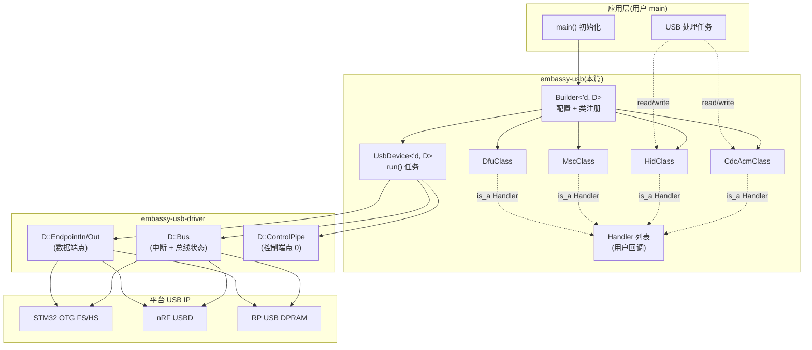
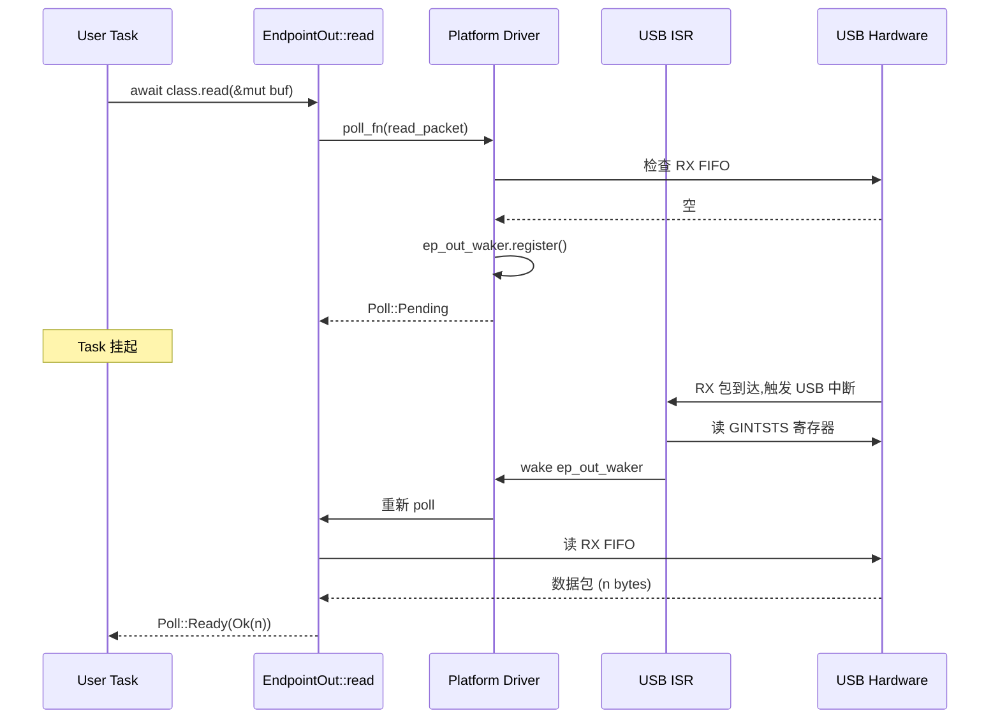

# 18. embassy-usb 设备栈

> 本篇分析 `embassy-usb` crate 的架构与实现,涵盖 USB 描述符体系、端点机制、设备类(CDC/MSC/HID/DFU/WebUSB)、Builder 模式、跨 USB IP 平台适配(STM32 USB / nRF USBD / RP USB)。

---

## 目录

1. embassy-usb 在 Embassy 全局中的位置
2. 描述符体系:Device → Configuration → Interface → Endpoint
3. 端点机制:Control / Bulk / Interrupt / ISO
4. 设备类(Device Class):CDC ACM / HID / MSC / DFU / WebUSB
5. Builder 模式与 Handler 回调
6. 异步 API 路径与 waker 链
7. 错误处理与恢复
8. 跨 USB IP 平台集成
9. 性能与资源
10. 与其他子系统的协作
11. 实战示例 + 平台对比表 + 总结

---

## 1. embassy-usb 在 Embassy 全局中的位置

embassy-usb 是 Embassy 框架中负责 USB 设备(device)协议栈的 crate,定位是 **"USB 设备栈的统一抽象 + 跨 USB IP 适配"**。它不直接与硬件交互,而是通过 `embassy-usb-driver` trait 与各平台 USB IP 通信;用户用 Builder 模式构造设备,提供 Handler 回调处理 USB 事件。

### 1.1 在 crate 拓扑中的角色

embassy-usb 的依赖关系(精简):

```
embassy-usb(本篇)
├── embassy-usb-driver      # USB 驱动抽象 trait
├── defmt                   # 日志(defmt feature)
├── heapless                # Vec / String 静态集合
└── cortex-m / embassy-time # 中断 / 定时器(可选)
```

被使用的典型路径:
- 应用层:`embassy-usb::Builder` 构造设备
- 平台层:`embassy-stm32::usb` / `embassy-nrf::usb` / `embassy-rp::usb` 提供 `embassy-usb-driver` 实现
- 设备类:`embassy-usb::class::cdc_acm::CdcAcmClass` / `hid::*` / `msc::*` / `dfu::*` / `web_usb::*`

### 1.2 与 Embassy 三大基座的协作

embassy-usb 的"零分配" + "异步协作" 原则:

| 基座 | 协作方式 |
|------|----------|
| `embassy-executor` | `UsbDevice::run()` 是 `async fn`,作为任务 spawn;Handler 回调由 `run()` 内部触发 |
| `embassy-time` | 不直接依赖,USB 协议本身是事件驱动而非时间驱动 |
| `embassy-sync` | 不直接使用,所有状态由 `UsbDevice` 内部 `RefCell` 保护 |

### 1.3 与 M3 HAL 层的关系

M3 文档(`08-hal-architecture.md`)描述了 HAL 层如何抽象外设。embassy-usb 处于 HAL 之上:

```
应用层(用户 main)
  └→ embassy-usb::Builder (构造设备)
       └→ embassy-usb::UsbDevice (协议栈)
            └→ D::Bus + D::ControlPipe (embassy-usb-driver 抽象)
                 └→ 平台 USB IP 驱动(embassy-stm32 / embassy-nrf / embassy-rp)
                      └→ USB 外设(USB OTG FS / USBD / USB DPRAM)
```

embassy-usb **不依赖** 任何具体 HAL,只依赖 `embassy-usb-driver` trait。这是清晰的分层。

### 1.4 适用平台清单

截至本 fork,已适配的 USB 平台:

| 平台 | USB IP | 最大速度 | 端点数 |
|------|--------|----------|--------|
| STM32F0/F1/F4/L4/H7 | USB OTG FS / OTG HS | Full-Speed(12 Mbps) / High-Speed(480 Mbps) | 4-9 |
| STM32G0/G4/U5/WB | USB OTG FS | Full-Speed | 8 |
| nRF52840 | USBD | Full-Speed | 8 |
| nRF5340 | USBD | Full-Speed | 8 |
| RP2040/RP235x | USB DPRAM | Full-Speed / Low-Speed | 16 |
| SAMD11/SAMD21 | USB | Full-Speed | 8 |
| ESP32-S2/S3 | USB OTG | Full-Speed / High-Speed | 6-9 |

### 1.5 架构 Mermaid 图



> 关键观察:embassy-usb 是**纯协议层**,不直接操作硬件。平台 USB IP 通过 `embassy-usb-driver` trait 暴露统一接口(中断 + 端点 + 控制管道),由 embassy-usb 完成枚举 + 描述符 + 类管理 + 控制传输。

---

## 2. 描述符体系

USB 描述符是设备与主机通信的"名片"。主机(Host)在枚举(enumeration)过程中读取这些描述符,了解设备的能力。embassy-usb 通过 Builder 模式让用户声明式地构造描述符树。

### 2.1 USB 描述符层级

USB 描述符是树形结构:

```
Device Descriptor(设备级,1 个)
  └→ Configuration Descriptor(配置级,1+ 个)
       └→ Interface Association Descriptor(IAD,可选,复合设备)
       └→ Interface Descriptor(接口级,1+ 个)
            └→ Endpoint Descriptor(端点级,1+ 个)
            └→ HID Class Descriptor(类特定)
            └→ CDC Functional Descriptor(类特定)
  └→ BOS Descriptor(USB 3.0+ 扩展,可选)
       └→ WebUSB / Microsoft OS 2.0 Capability
  └→ String Descriptor(字符串,0+ 个,lang ID + 文本)
  └→ Device Qualifier Descriptor(高速设备,可选)
```

每种描述符都有标准化的 bLength / bDescriptorType / 后续字段,主机解析时按 bDescriptorType 路由。

### 2.2 关键描述符字段

**Device Descriptor**(18 字节):
| 字段 | 含义 | 典型值 |
|------|------|--------|
| bLength | 描述符长度 | 18 |
| bDescriptorType | 描述符类型 | 1 (DEVICE) |
| bcdUSB | USB 版本 | 0x0200 (USB 2.0) |
| bDeviceClass | 设备类 | 0x00(接口级)/ 0xEF(复合) |
| bDeviceSubClass | 子类 | 0x00 / 0x02 |
| bDeviceProtocol | 协议 | 0x00 / 0x01 |
| idVendor | VID | 0x1234 (示例) |
| idProduct | PID | 0x5678 |
| bcdDevice | 设备版本 | 0x0100 |
| iManufacturer | 厂商字符串索引 | 1 |
| iProduct | 产品字符串索引 | 2 |
| iSerialNumber | 序列号字符串索引 | 3 |
| bNumConfigurations | 配置数 | 1 |

**Configuration Descriptor**(9 字节头 + 后接子描述符):
| 字段 | 含义 | 典型值 |
|------|------|--------|
| bLength | 长度 | 9 |
| bDescriptorType | 类型 | 2 (CONFIGURATION) |
| wTotalLength | 配置总长(包含子描述符) | 动态 |
| bNumInterfaces | 接口数 | 动态 |
| bConfigurationValue | 配置值(1-based) | 1 |
| iConfiguration | 配置描述字符串索引 | 0 (无) |
| bmAttributes | 属性(self-powered / bus-powered / remote wakeup) | 0x80 / 0xC0 |
| bMaxPower | 最大电流(2 mA 单位) | 50 (100 mA) |

**Interface Descriptor**(9 字节):
| 字段 | 含义 | 典型值 |
|------|------|--------|
| bInterfaceClass | 接口类 | 0x02 (CDC) / 0x03 (HID) / 0x08 (MSC) |
| bInterfaceSubClass | 子类 | 类特定 |
| bInterfaceProtocol | 协议 | 类特定 |
| bNumEndpoints | 端点数(不含 EP0) | 1 / 2 / 3 |

**Endpoint Descriptor**(7 字节):
| 字段 | 含义 | 典型值 |
|------|------|--------|
| bEndpointAddress | 地址(高 bit 方向) | 0x81 (IN EP1) / 0x01 (OUT EP1) |
| bmAttributes | 类型(Ctrl/Bulk/Interrupt/ISO) | 0x02 (Bulk) / 0x03 (Interrupt) |
| wMaxPacketSize | 最大包大小 | 64 / 512 / 1024 |
| bInterval | 轮询间隔(ms) | 1-255 |

### 2.3 embassy-usb 中描述符的构造

embassy-usb 用 Builder 模式**声明式**构造描述符树。用户不直接写描述符字节,而是声明接口 / 端点 / 类:

```rust
let mut builder = Builder::new(
    driver,
    Config {
        vid: 0x1234,
        pid: 0x5678,
        manufacturer: Some("MyCompany"),
        product: Some("MyDevice"),
        serial_number: Some("123456"),
        max_power: 100,
        ..Default::default()
    },
    &mut device_descriptor_buf,  // 静态缓冲区
    &mut bos_descriptor_buf,     // 静态缓冲区
    &mut msos_descriptor_buf,    // 静态缓冲区
    &mut control_buf,            // 控制传输缓冲
);

let mut class = CdcAcmClass::new(&mut builder, &mut state, 64);
let mut func = builder.function(0xFF, 0x00, 0x00);  // Vendor specific function
let mut iface = func.interface();
let mut alt = iface.alt_setting(0xFF, 0x00, 0x00, None);
let mut ep_out = alt.endpoint_bulk_out(64, BulkOutSize::Single);
let mut ep_in = alt.endpoint_bulk_in(64, BulkInSize::Single);

let device = builder.build();
```

每个 `endpoint_bulk_out/in` 调用都会生成一个 Endpoint Descriptor,并拼接到 Configuration Descriptor 后面。

### 2.4 复合设备(IAD)

USB 复合设备 = 多个独立功能(如 CDC + MSC)。USB 2.0 后用 **Interface Association Descriptor(IAD)** 描述:

```
Configuration Descriptor
  ├─ Interface Association Descriptor
  │   ├─ Interface 0 (CDC Communication)
  │   │   ├─ Endpoint 0x82 (Notification IN, Interrupt)
  │   │   └─ CDC Functional Descriptors
  │   └─ Interface 1 (CDC Data)
  │       ├─ Endpoint 0x03 (Bulk OUT)
  │       └─ Endpoint 0x83 (Bulk IN)
  ├─ Interface 2 (MSC)
  │   ├─ Endpoint 0x04 (Bulk OUT)
  │   └─ Endpoint 0x84 (Bulk IN)
  └─ ... 其他接口
```

embassy-usb 中通过 `composite_with_iads: true` 启用 IAD 模式。

### 2.5 描述符缓冲区分配

`Builder::new` 需要 4 个静态缓冲区:

```rust
let mut config_descriptor_buf = [0u8; 256];
let mut bos_descriptor_buf = [0u8; 256];
let mut msos_descriptor_buf = [0u8; 256];
let mut control_buf = [0u8; 64];
```

**典型大小**:
- Configuration:128-512 字节(取决于接口 / 端点数)
- BOS:64-128 字节
- MSOS:64-128 字节
- Control:64 字节(标准 SETUP 包是 8 字节 + 数据阶段)

embassy-usb 提供 `UsbBufferReport` 结构让用户在运行时查询实际使用量:
```rust
let report = device.buffer_report();
log::info!("config desc used: {}", report.config_descriptor_used);
```

### 2.6 字符串描述符

字符串描述符(0-indexed)由 Builder 自动管理,用户只需提供 `&str` 字面量:

```rust
Config {
    manufacturer: Some("MyCompany"),  // → STRING index 1
    product: Some("MyDevice"),         // → STRING index 2
    serial_number: Some("123456"),     // → STRING index 3
    ..Default::default()
}
```

`Builder` 内部用 `next_string_index` 分配索引。用户自定义字符串通过 Handler trait 的 `get_string` 回调提供。

### 2.7 BOS 描述符(WebUSB / Microsoft OS)

BOS(Binary Object Store)是 USB 3.0 引入的描述符容器,用于扩展能力。典型用途:
- **WebUSB Platform Capability**:告诉浏览器此设备是 WebUSB 设备
- **Microsoft OS 2.0 Descriptor**:Windows 自动识别设备

embassy-usb 自动生成 BOS 描述符(若启用了 WebUSB / MSOS):

```rust
// WebUSB 启用
WebUsb::configure(&mut builder, &mut web_usb_state, &web_usb_config);
// MSOS 启用
MsOs::register(&mut builder, &mut msos_state);
```

---

## 3. 端点机制

USB 端点是 USB 设备与主机通信的"管道"。每个端点有方向(IN / OUT)、类型(Control / Bulk / Interrupt / ISO)、最大包大小。embassy-usb 抽象出统一的 `Endpoint` / `ControlPipe` API。

### 3.1 端点类型对比

| 类型 | 用途 | 速率 | 包大小 | 应用 |
|------|------|------|--------|------|
| Control | 枚举、配置、命令 | 慢 | 8-64 | 标准请求、类请求、vendor 请求 |
| Bulk | 大块数据,无保证 | 高速 | 8-512 | CDC 数据、MSC、vendor 数据 |
| Interrupt | 小数据,定时保证 | 中速 | 1-64 | HID 键盘/鼠标、CDC 通知 |
| ISO(同步) | 实时流,可能丢包 | 最高 | 0-1024 | 音频、视频、UVC(本 fork 未实现) |

### 3.2 端点地址编码

8 bit 端点地址:
- bit 7:方向(0 = OUT 主机→设备,1 = IN 设备→主机)
- bit 0-3:端点号(1-15,0 保留为控制端点)

示例:
- `0x01` = EP1 OUT
- `0x81` = EP1 IN
- `0x82` = EP2 IN
- `0x03` = EP3 OUT

### 3.3 embassy-usb 端点 API

**`EndpointOut`**(OUT 方向,接收主机数据):
```rust
pub struct EndpointOut<'d, D: Driver<'d>> { /* private */ }

impl<'d, D: Driver<'d>> EndpointOut<'d, D> {
    pub fn max_packet_size(&self) -> u16;
    pub async fn read(&mut self, buf: &mut [u8]) -> Result<usize, EndpointError>;
    pub async fn ready(&mut self) -> Result<(), EndpointError>;  // 等待新数据可用
    pub fn set_enabled(&mut self, enabled: bool);                // STALL 控制
    pub fn is_stalled(&self) -> bool;
}
```

**`EndpointIn`**(IN 方向,发送数据到主机):
```rust
pub struct EndpointIn<'d, D: Driver<'d>> { /* private */ }

impl<'d, D: Driver<'d>> EndpointIn<'d, D> {
    pub fn max_packet_size(&self) -> u16;
    pub async fn write(&mut self, buf: &[u8]) -> Result<usize, EndpointError>;
    pub async fn flush(&mut self) -> Result<(), EndpointError>;  // 等 FIFO 空
    pub fn set_enabled(&mut self, enabled: bool);
    pub fn is_stalled(&self) -> bool;
}
```

**`ControlPipe`**(端点 0,处理控制传输):
```rust
pub struct ControlPipe<'d, D: Driver<'d>> { /* private */ }

impl<'d, D: Driver<'d>> ControlPipe<'d, D> {
    pub fn max_packet_size(&self) -> u8;
    pub async fn setup(&mut self) -> [u8; 8];  // 等待下一个 SETUP 包
    pub async fn data_out(&mut self, buf: &mut [u8], first: bool, last: bool) -> Result<usize, EndpointError>;
    pub async fn data_in(&mut self, data: &[u8], first: bool, last: bool) -> Result<usize, EndpointError>;
    pub async fn accept(&mut self);
    pub async fn reject(&mut self);
    pub fn set_address(&mut self, addr: u8);
    pub fn configure(&mut self, configured: bool);
}
```

### 3.4 端点声明方式

embassy-usb 中,端点通过 Builder 链式调用声明:

```rust
let mut func = builder.function(0xFF, 0x00, 0x00);
let mut iface = func.interface();
let mut alt = iface.alt_setting(0xFF, 0x00, 0x00, None);

// Bulk OUT(主机→设备)
let mut ep_out = alt.endpoint_bulk_out(64, BulkOutSize::Single);

// Bulk IN(设备→主机)
let mut ep_in = alt.endpoint_bulk_in(64, BulkInSize::Single);

// Interrupt OUT
let mut ep_int_out = alt.endpoint_interrupt_out(8, InterruptOutSize::Single);

// Interrupt IN
let mut ep_int_in = alt.endpoint_interrupt_in(8, InterruptInSize::Single);
```

`BulkOutSize::Single` / `Double` 决定双缓冲(USB 硬件支持 2 倍缓冲以提升吞吐)。

### 3.5 控制传输(Control Transfer)

控制传输是 USB 最复杂的传输类型,用于枚举、配置、命令。它有 3 个阶段:
1. **SETUP 阶段**:主机发 8 字节 SETUP 包(请求类型、请求码、wValue、wIndex、wLength)
2. **DATA 阶段**:可选,主机发(OUT)或收(IN)数据
3. **STATUS 阶段**:1 次握手包(ACK / STALL)

`ControlPipe` 的 `setup()` 方法等待 SETUP 包,返回 8 字节的 SETUP 数据。然后用 `data_in` / `data_out` 处理数据阶段,最后 `accept` / `reject` 触发 STATUS 阶段。

**用户视角**(通过 Handler trait):
```rust
impl Handler for MyClass {
    fn control_out(&mut self, req: Request, data: &[u8]) -> Option<OutResponse> {
        // 主机发数据给设备
        if req.request == MY_CUSTOM_REQUEST {
            self.process_command(data);
            Some(OutResponse::Accepted)
        } else {
            None  // 不处理,让 embassy-usb 找其他 Handler
        }
    }

    fn control_in<'a>(&'a mut self, req: Request, buf: &'a mut [u8]) -> Option<InResponse<'a>> {
        // 主机从设备读数据
        if req.request == MY_GET_STATUS {
            buf[0] = self.status;
            Some(InResponse::Accepted(&buf[..1]))
        } else {
            None
        }
    }
}
```

### 3.6 端点状态机

每个端点有 3 个状态:
- **Disabled**:未配置,主机不识别
- **Active**:配置后,正常收发
- **Halted**(STALL):端点拒绝所有包,需主机发 CLEAR_FEATURE 清除

`set_enabled(false)` 让端点进入 Disabled(不影响 STALL)。`STALL` 通过硬件自动或 `is_stalled()` 查询。

### 3.7 端点缓冲区

每个端点需要 1 个 FIFO(USB 硬件内部) + 用户侧的 rx/tx 缓冲区。Bulk 端点最大包 512 字节(HS),但 USB 硬件 FIFO 通常只有 64-512 字节双缓冲,需要软件层在用户缓冲区拼接大包。

embassy-usb 内部不直接管理用户缓冲区,而是由 `Endpoint::read/write` 方法一次最多读/写一个包。**用户侧的大缓冲区**由应用层维护(如 `read(&mut [0u8; 1024])` 一次最多读 1 个包,后续需要循环)。

### 3.8 中断与端点

USB 端点中断通常按"包到达"触发。在 embassy-usb 中:
- **`Endpoint::ready()`** = 等待 OUT 端点有新数据
- **`Endpoint::flush()`** = 等待 IN 端点 FIFO 空
- **`ControlPipe::setup()`** = 等待 SETUP 包

这些方法返回 `Future`,内部用 waker 通知。

---

## 4. 设备类(Device Class)

embassy-usb 内置 5 个常用设备类,每个是 `Handler` 的具体实现,处理类特定的请求与数据流。

### 4.1 CDC ACM(虚拟串口)

`embassy-usb::class::cdc_acm::CdcAcmClass` 提供 USB CDC(Communication Device Class)ACM(Abstract Control Model)子类的实现,即虚拟串口(USB-Serial)。

**典型应用**:`/dev/ttyACM0` (Linux) / COMx (Windows) 出现一个串口,可与终端 / 串口工具通信。

**关键 API**:
```rust
pub struct CdcAcmClass<'d, D: Driver<'d>> { /* private */ }

impl<'d, D: Driver<'d>> CdcAcmClass<'d, D> {
    pub fn new(builder: &mut Builder<'d, D>, state: &'d mut State<'d>, max_packet_size: u16) -> Self;
    pub async fn write(&mut self, buf: &[u8]) -> Result<usize, EndpointError>;
    pub async fn read(&mut self, buf: &mut [u8]) -> Result<usize, EndpointError>;
    pub fn max_packet_size(&self) -> u16;
}
```

**实现要点**:
- 创建 3 个接口:CDC Communication(control + interrupt IN) + CDC Data(bulk IN + bulk OUT)
- 内部维护一个 16-byte 通知端点(用于 line state / serial state 通知)
- 符合 USB CDC PSTN 1.20 子集

**典型用法**:
```rust
let mut state = CdcAcmClass::new_state();
let mut class = CdcAcmClass::new(&mut builder, &mut state, 64);

// 发送
class.write(b"Hello, World!\n").await?;

// 接收(异步)
let n = class.read(&mut buf).await?;
```

### 4.2 HID(人机接口设备)

`embassy-usb::class::hid::HidClass` 提供 USB HID 子类支持,常用于键盘、鼠标、自定义 HID 设备。

**关键 API**:
```rust
pub struct HidClass<'d, D: Driver<'d>, T: HidProtocol> { /* private */ }

impl<'d, D: Driver<'d>> HidClass<'d, D, Keyboard<'static>> { /* Keyboard 子类 */ }
impl<'d, D: Driver<'d>> HidClass<'d, D, Mouse<'static>> { /* Mouse 子类 */ }

pub trait HidProtocol {
    const REPORT_DESCRIPTOR: &'static [u8];
    const PREFIX: u8;  // 0x01 (Keyboard) / 0x02 (Mouse)
}
```

**实现要点**:
- 创建 1 个接口 + 1 个 Interrupt IN 端点
- Report Descriptor 描述报告格式(键盘 8 字节 / 鼠标 5+ 字节)
- `write_report` 发送 HID 报告

**自定义 HID**:
用户可以实现 `HidProtocol` trait,提供自己的 Report Descriptor。

### 4.3 MSC(大容量存储)

`embassy-usb::class::msc::MscClass` 提供 USB MSC 子类支持,常用于 U 盘 / SD 卡读卡器。

**关键 API**:
```rust
pub struct MscClass<'d, D: Driver<'d>, const MAX_PACKET_SIZE: u8> { /* private */ }

impl<'d, D: Driver<'d>, const MAX_PACKET_SIZE: u8> MscClass<'d, D, MAX_PACKET_SIZE> {
    pub fn new(builder: &mut Builder<'d, D>, state: &'d mut State<'d>, block_device: impl BlockDevice) -> Self;
}
```

**实现要点**:
- 创建 1 个接口 + Bulk IN + Bulk OUT 端点
- 实现 SCSI 命令集(READ(10) / WRITE(10) / INQUIRY / READ_CAPACITY / REQUEST_SENSE 等)
- 接受 `BlockDevice` trait(用户实现,通常是 SD 卡 / Flash)

**BlockDevice trait**:
```rust
pub trait BlockDevice {
    async fn read(&mut self, block: u32, buf: &mut [u8]) -> Result<(), Error>;
    async fn write(&mut self, block: u32, buf: &[u8]) -> Result<(), Error>;
    fn block_size(&self) -> u32;
    fn block_count(&self) -> u32;
}
```

### 4.4 DFU(设备固件升级)

`embassy-usb::class::dfu::DfuClass` 提供 USB DFU 子类支持(常用于 bootloader)。

**两种模式**:
- **Runtime mode**(`app_mode.rs`):在应用程序中通过 USB 进入 DFU 模式
- **DFU mode**(`dfu_mode.rs`):在 bootloader 中接收固件

**关键 API**:
```rust
pub fn usb_dfu<'d, D: Driver<'d>>(
    builder: &mut Builder<'d, D>,
    state: &'d mut State<'d>,
    func: &'d mut impl DFUMemEraser + DFUMemWriter + DFUMemReader,
) -> DfuClass<'d, D>;
```

**实现要点**:
- 创建 1 个接口(DFU 1.1 子类)
- 4 个命令:DETACH / DNLOAD / UPLOAD / GETSTATUS
- 用户实现 `DFUMemEraser` / `DFUMemWriter` / `DFUMemReader`,操作 Flash 区域

### 4.5 WebUSB

`embassy-usb::class::web_usb::WebUsb` 提供 WebUSB 能力(浏览器直接访问 USB 设备)。

**实现要点**:
- 在 BOS 描述符中添加 Platform Capability(3408b638-09a9-47a0-8bfd-a0768815b665)
- 提供 1 个 vendor 接口 + bulk IN/OUT
- 浏览器可通过 `navigator.usb.requestDevice()` 找到设备

**典型场景**:
- 嵌入式设备的 Web 配置界面
- 浏览器内调试工具

### 4.6 自定义类

用户可实现 `Handler` trait 自定义类:

```rust
struct MyCustomClass {
    // 状态字段
}

impl Handler for MyCustomClass {
    fn enabled(&mut self, enabled: bool) {
        // 主机启用 / 禁用设备
    }
    fn reset(&mut self) {
        // 主机发 BUS RESET
    }
    fn configured(&mut self, configured: bool) {
        // 主机设置配置
    }
    fn control_out(&mut self, req: Request, data: &[u8]) -> Option<OutResponse> {
        // 处理类特定请求
        None
    }
    fn control_in<'a>(&'a mut self, req: Request, buf: &'a mut [u8]) -> Option<InResponse<'a>> {
        None
    }
}
```

然后在 Builder 中注册:
```rust
let mut my_class = MyCustomClass { /* ... */ };
builder.handler(my_class);
```

embassy-usb 内部维护 `Vec<&mut dyn Handler, MAX_HANDLER_COUNT>`,所有 Handler 的回调都会在合适时机被调用。

### 4.7 类的多实例与冲突

embassy-usb 允许注册多个 Handler(同一类可多次实例化):

```rust
let mut cdc1 = CdcAcmClass::new(&mut builder, &mut state1, 64);
let mut cdc2 = CdcAcmClass::new(&mut builder, &mut state2, 64);
// 主机看到 2 个 CDC ACM 设备(2 个 COM 端口)
```

**限制**:`MAX_HANDLER_COUNT` / `MAX_INTERFACE_COUNT` / `MAX_ENDPOINT_COUNT` 编译期常量,默认 4 / 8 / 12,可通过 Builder 的 const generic 参数调整。

---

## 5. Builder 模式与 Handler 回调

embassy-usb 的核心抽象是 Builder 模式 + Handler trait。本节详解这两个抽象的协作。

### 5.1 Builder 的生命周期

```rust
let mut builder = Builder::new(driver, config, &mut config_buf, &mut bos_buf, &mut msos_buf, &mut ctrl_buf);
// ... 注册类、声明端点 ...
let device = builder.build();  // 消耗 builder,产出 UsbDevice
```

Builder 持有所有配置 + 类注册 + 端点分配,在 `build()` 时生成 `UsbDevice` 句柄。

### 5.2 Builder 的内部结构

```rust
pub struct Builder<'d, D: Driver<'d>> {
    config: Config<'d>,
    handlers: Vec<&'d mut dyn Handler, MAX_HANDLER_COUNT>,
    interfaces: Vec<Interface, MAX_INTERFACE_COUNT>,
    control_buf: &'d mut [u8],

    driver: D,
    next_string_index: u8,

    config_descriptor: DescriptorWriter<'d>,
    bos_descriptor: BosWriter<'d>,
    msos_descriptor: MsOsDescriptorWriter<'d>,
}
```

- `config` 设备级配置(VID/PID/字符串)
- `handlers` Handler 列表(类、自定义 Handler)
- `interfaces` 接口元数据
- `config_descriptor` 描述符写入器(自动计算长度)
- `bos_descriptor` BOS 描述符写入器

### 5.3 链式 API 详解

```rust
// 创建 Function(物理功能组,对应一个 device class)
let mut func = builder.function(class, subclass, protocol);

// 创建 Interface(属于某个 function)
let mut iface = func.interface();

// 创建 Alternate Setting(接口的某个设置)
let mut alt = iface.alt_setting(class, subclass, protocol, interface_name);

// 声明端点
let mut ep_out = alt.endpoint_bulk_out(max_packet_size, bulk_out_size);
let mut ep_in = alt.endpoint_bulk_in(max_packet_size, bulk_in_size);
```

每个 `endpoint_*` 方法都会:
1. 从 platform driver 分配 1 个端点
2. 把 EndpointDescriptor 写入 `config_descriptor`
3. 返回 `EndpointIn` / `EndpointOut` 句柄

### 5.4 Handler trait 全方法列表

```rust
pub trait Handler {
    fn enabled(&mut self, _enabled: bool) {}
    fn reset(&mut self) {}
    fn addressed(&mut self, _addr: u8) {}
    fn configured(&mut self, _configured: bool) {}
    fn suspended(&mut self, _suspended: bool) {}
    fn remote_wakeup_enabled(&mut self, _enabled: bool) {}
    fn set_alternate_setting(&mut self, iface: InterfaceNumber, alternate_setting: u8) {
        let _ = (iface, alternate_setting);
    }
    fn control_out(&mut self, req: Request, data: &[u8]) -> Option<OutResponse> { None }
    fn control_in<'a>(&'a mut self, req: Request, buf: &'a mut [u8]) -> Option<InResponse<'a>> { None }
    fn get_string(&mut self, index: StringIndex, lang_id: u16) -> Option<&str> { None }
    fn get_descriptor_requested(&mut self, _descriptor_type: u8, _index: u8, _wlength: u16) {}
}
```

**关键回调触发时机**:
- `enabled`:设备地址分配后(主机把设备从 Address 0 移到分配的地址)
- `reset`:主机发 BUS RESET
- `addressed`:主机设置设备地址
- `configured`:主机发送 SET_CONFIGURATION
- `suspended`:总线进入 suspend(3 ms 无活动)
- `control_out` / `control_in`:SETUP 数据阶段
- `get_string`:主机请求字符串描述符
- `set_alternate_setting`:主机发 SET_INTERFACE(切换 alt setting)

### 5.5 Handler 注册顺序与优先级

embassy-usb 按 Handler 注册顺序调用 `control_out` / `control_in`:

```rust
builder.handler(my_class_1);  // 先注册
builder.handler(my_class_2);  // 后注册
```

收到 SETUP 时,先调 `my_class_1.control_out`,若返回 `Some(OutResponse)`,则停止;否则调 `my_class_2.control_out`。

**设计建议**:把"通用" Handler 放前面,具体 Handler 放后面;确保 `control_*` 返回 `None` 表示"不处理"。

### 5.6 静态 vs 动态 Handler 数量

```rust
// 编译期常量(embassy-usb/src/lib.rs 顶部)
pub const MAX_HANDLER_COUNT: usize = 4;
pub const MAX_INTERFACE_COUNT: usize = 8;
pub const MAX_ENDPOINT_COUNT: usize = 12;
```

这些常量定义在 `heapless::Vec` 的容量上,超过会编译期错误。**如需更多**,需要修改 embassy-usb 源码(本 fork 不允许,所以需选小规模设备)。

### 5.7 UsbDevice 句柄

```rust
let device = builder.build();

// 启动 USB 任务
spawner.spawn(usb_task(device)).unwrap();

#[embassy_executor::task]
async fn usb_task(mut device: UsbDevice<'static, MyDriver>) -> ! {
    device.run().await
}
```

`UsbDevice::run()` 是核心循环,内部:
1. 等待 USB 中断(总线 reset / suspend / resume / SETUP)
2. 解析 SETUP 包,路由到对应 Handler
3. 处理数据阶段
4. 触发状态机更新

---

## 6. 异步 API 路径与 waker 链

embassy-usb 把 USB 中断事件包装成 async/await 接口。本节追踪 `Endpoint::read` 的完整调用链。

### 6.1 用户视角

```rust
let n = class.read(&mut buf).await?;
```

`CdcAcmClass::read` 内部会调底层 `EndpointOut::read`。`EndpointOut::read` 是 `async fn`,返回 `Future`。

### 6.2 read 内部

```rust
pub async fn read(&mut self, buf: &mut [u8]) -> Result<usize, EndpointError> {
    let mut rx_buf = [0u8; 64];  // 单包大小
    let mut total = 0;
    while total < buf.len() {
        let chunk_size = (buf.len() - total).min(rx_buf.len());
        let n = self.read_packet(&mut rx_buf[..chunk_size]).await?;
        if n == 0 { break; }
        buf[total..total + n].copy_from_slice(&rx_buf[..n]);
        total += n;
    }
    Ok(total)
}

async fn read_packet(&mut self, buf: &mut [u8]) -> Result<usize, EndpointError> {
    self.inner.read(buf).await  // 委托给 driver 的 endpoint
}
```

### 6.3 平台 Driver 的 read

`embassy-usb-driver::EndpointOut::read` 是 `async fn`,由平台 USB IP 驱动实现。

**典型实现**(STM32 OTG FS):
```rust
async fn read(&mut self, buf: &mut [u8]) -> Result<usize, EndpointError> {
    poll_fn(|cx| {
        // 1) 检查 RX FIFO 是否有数据
        if self.rxfifo_word_count() > 0 {
            let n = self.read_fifo(buf);
            return Poll::Ready(Ok(n));
        }
        // 2) 无数据,注册 waker
        self.ep_out_waker.register(cx.waker());
        // 3) 启用 OUT 端点中断
        self.enable_out_interrupt();
        // 4) 再次检查(防止竞态)
        if self.rxfifo_word_count() > 0 {
            let n = self.read_fifo(buf);
            return Poll::Ready(Ok(n));
        }
        Poll::Pending
    }).await
}
```

### 6.4 USB 中断处理

USB 中断触发时(平台 ISR):
1. 读 USB 中断状态寄存器
2. 识别中断类型(RX / TX / Reset / Suspend / ...)
3. 唤醒对应 waker

```rust
#[interrupt]
fn USB() {
    let intr = regs().gintsts.read();
    if intr.rxflvl() {  // RX FIFO 非空
        // 找出端点号,唤醒对应 ep_out_waker
        let ep = rx_status_ep();
        let waker = ep_out_wakers[ep].take();
        if let Some(w) = waker { w.wake(); }
    }
    if intr.nptxfe() {  // TX FIFO 空
        // 找出端点号,唤醒对应 ep_in_waker
        let ep = tx_status_ep();
        let waker = ep_in_wakers[ep].take();
        if let Some(w) = waker { w.wake(); }
    }
}
```

### 6.5 waker 唤醒路径



### 6.6 多端点并发 waker

`embassy-usb-driver` 中每个端点独立 waker。多个端点并发等待时,各自的中断独立唤醒,executor 按 ready 队列顺序调度。

```rust
// 平台 driver 内部
struct UsbBus {
    ep_out_wakers: [Option<Waker>; MAX_ENDPOINTS],
    ep_in_wakers: [Option<Waker>; MAX_ENDPOINTS],
}
```

### 6.7 Suspend / Resume 路径

USB 总线 suspend(3 ms 无活动)时,平台 ISR 触发:
1. 调用所有 Handler 的 `suspended(true)` 回调
2. 暂停收发

resume(总线活动恢复):
1. 调用所有 Handler 的 `suspended(false)` 回调
2. 恢复收发

这两个回调由 `UsbDevice::run()` 内部调度,与 socket 风格不同,不是 async。

---

## 7. 错误处理与恢复

embassy-usb 的错误处理模型主要在端点层 + 控制传输层。

### 7.1 端点错误类型

```rust
pub enum EndpointError {
    Disabled,    // 端点未启用
    BufferOverflow,  // write 数据超 FIFO
}
```

**典型处理**:
```rust
match ep.write(&data).await {
    Ok(n) => log::info!("wrote {} bytes", n),
    Err(EndpointError::BufferOverflow) => {
        log::warn!("buffer overflow, dropping data");
    }
    Err(EndpointError::Disabled) => {
        log::warn!("endpoint disabled, host not configured?");
    }
}
```

### 7.2 STALL 处理

主机发 `CLEAR_FEATURE(ENDPOINT_HALT)` 时,平台 driver 清除 STALL 状态:
```rust
fn set_enabled(&mut self, enabled: bool) {
    if enabled {
        self.bus.clear_stall(self.ep_num);
    } else {
        self.bus.set_stall(self.ep_num);
    }
}
```

`is_stalled()` 供应用查询。**用户通常不需要主动 STALL**,只有 host 期望设备拒绝请求时才用。

### 7.3 BUS RESET 处理

BUS RESET 由主机发起,设备必须重新枚举。embassy-usb 内部:
1. 设备地址回到 0
2. 所有端点回到 Disabled
3. 触发 `Handler::reset()` 回调
4. 重新等待主机 SET_ADDRESS

**应用层责任**:在 `reset()` 回调中清理状态(清空缓冲区、关闭连接)。

### 7.4 Suspend 处理

总线 suspend(3 ms 无活动):
1. 触发 `Handler::suspended(true)` 回调
2. 应用可在此进入低功耗

**Resume**:
1. 触发 `Handler::suspended(false)` 回调
2. 恢复收发

**注意点**:suspend 期间所有 waker 不会被触发,host 唤醒后才会触发。

### 7.5 控制传输错误

控制传输有 3 种终止方式:
- **ACK**:正常完成
- **STALL**:拒绝请求(Request Error / condition)
- **DATA 错误**:硬件检测到 PID 错误

`ControlPipe::reject()` 主动 STALL。`accept()` 主动 ACK。

### 7.6 detach / 拔线处理

设备物理拔线后,平台 driver 检测到 VBUS 丢失:
1. STM32:USB OTG 中断触发 `disconnected` 事件
2. RP2040:USB VBUS detect 脚电平变化
3. nRF:USBD 内部检测

不同平台行为不一致,**应用层通常不直接处理**,而是通过 `configured(false)` 回调感知。

### 7.7 错误恢复策略

| 错误类型 | 恢复策略 | 用户层责任 |
|----------|----------|------------|
| 端点 disabled | 等 host 重新配置 | 等待 `configured(true)` 回调 |
| STALL | host 主动清除 | 应用无需操作 |
| BUS RESET | 自动重新枚举 | 在 `reset()` 清理状态 |
| 拔线 | 自动等待重连 | 应用可通知上层 |
| 控制传输错误 | host 重试 | 应用无需操作 |
| 总线 suspend | 进入低功耗 | `suspended(true)` 回调 |

---

## 8. 跨 USB IP 平台集成

embassy-usb 的核心设计是 USB IP 无关,通过 `embassy-usb-driver` 抽象支持各平台。本节列举主流平台 USB IP 驱动的集成模式。

### 8.1 USB 驱动的统一接口:`Driver` trait

`embassy-usb-driver` 提供统一 trait,所有平台 USB IP 驱动都实现它:

```rust
pub trait Driver<'d> {
    type Bus: Bus;
    type EndpointIn: EndpointIn<Self>;
    type EndpointOut: EndpointOut<Self>;
    type ControlPipe: ControlPipe<Self>;
    type ResetFuture: Future<Output = ()>;
    type EnableFuture: Future<Output = ()>;

    fn alloc_endpoint_out(&mut self, ep_type: EndpointType, max_packet_size: u16, interval_ms: u8) -> Result<Self::EndpointOut, EndpointAllocError>;
    fn alloc_endpoint_in(&mut self, ep_type: EndpointType, max_packet_size: u16, interval_ms: u8) -> Result<Self::EndpointIn, EndpointAllocError>;
    fn alloc_control_pipe(&mut self, max_packet_size: u8) -> Self::ControlPipe;
    fn into_bus(self) -> Self::Bus;
    fn reset(&mut self) -> Self::ResetFuture;
    fn enable(&mut self) -> Self::EnableFuture;
    fn disable(&mut self) -> Self::EnableFuture;
    fn remote_wakeup(&mut self) -> Self::EnableFuture;
}
```

**典型初始化**:
```rust
let driver = embassy_stm32::usb::Driver::new(
    p.USB_OTG_FS,    // USB 外设
    Irqs,            // USB 中断
    p.PA12, p.PA11,  // DP / DM 引脚
    &mut ep_out_buffer,
);
let mut builder = embassy_usb::Builder::new(
    driver,
    config,
    &mut config_desc_buf,
    &mut bos_desc_buf,
    &mut msos_desc_buf,
    &mut control_buf,
);
```

### 8.2 STM32 USB OTG

STM32 的 USB OTG FS / HS 是基于 Synopsys DesignWare IP 的复杂外设。

**特点**:
- 内部 DMA,支持 scatter-gather
- 多端点(FS 4 in + 4 out,HS 5 in + 5 out,带 EP0)
- 内部 FIFO(各端点独立,可配置大小)
- 支持 OTG(可作 host / device),本 fork 仅用 device 模式

**初始化**:
```rust
let driver = embassy_stm32::usb_otg::Driver::new_fs(
    p.USB_OTG_FS,
    Irqs,
    p.PA12,    // DP
    p.PA11,    // DM
    &mut ep_out_buffer,  // 端点 FIFO 数据缓冲
);
```

**中断**:`OTG_FS_IRQHandler` 处理 RX / TX / Reset / Suspend。

### 8.3 nRF USBD

nRF52840 / nRF5340 的 USBD 是 Nordic 自研的 USB device IP。

**特点**:
- 简化版,易于实现
- 8 个端点(EP0 + EP1-7 IN/OUT)
- 内部 RAM-based FIFO
- EasyDMA(自动 DMA 收发)

**初始化**:
```rust
let driver = embassy_nrf::usb::Driver::new(
    p.USBD,
    Irqs,
    &mut out_buffer,  // OUT 端点 RAM 缓冲
);
```

**与 STM32 OTG 差异**:
- USBD 的端点 RAM 由用户分配(`out_buffer`)
- EasyDMA 自动搬移数据
- 无 OTG 模式(纯 device)

### 8.4 RP USB

RP2040 / RP235x 的 USB 是基于 PicoQuirk 的 USB device IP。

**特点**:
- 双 USB(USB0 / USB1),可任选或同时启用
- 16 个端点(EP0 + EP1-15)
- 双缓冲端点(可同时收 2 包)
- Host / device 双模式

**初始化**:
```rust
let driver = embassy_rp::usb::Driver::new(
    p.USB,
    Irqs,
    p.PIN_15,    // DP
    p.PIN_14,    // DM
    &mut out_buffer,
);
```

### 8.5 其他平台

- **SAMD11/SAMD21**:Microchip SAM USB device,8 端点
- **ESP32-S2/S3**:ESP-IDF USB 栈(不直接用 embassy-usb),或 Xtensa USB 适配
- **H7 OTG HS**:高速模式 480 Mbps,需要外部 PHY
- **RP235x**:同 RP2040,但支持 USB 3.0 测试模式

### 8.6 平台选型决策树

```mermaid
graph TD
    Q1[需要 Full-Speed 还是 High-Speed?]
    Q1 -->|FS(12 Mbps)| Q2[MCU 系列?]
    Q1 -->|HS(480 Mbps)| Q3[有外部 PHY?]

    Q2 -->|STM32F/L/G| A1[STM32 OTG FS]
    Q2 -->|nRF52/53| A2[nRF USBD]
    Q2 -->|RP2040/235| A3[RP USB]
    Q2 -->|SAMD21| A4[SAMD USB]

    Q3 -->|有| A5[STM32 OTG HS + ULPI PHY]
    Q3 -->|无| A6[降级到 FS]

    A1 -.实现.-> emba[embassy-stm32 + embassy-usb]
    A2 -.实现.-> embb[embassy-nrf + embassy-usb]
    A3 -.实现.-> embc[embassy-rp + embassy-usb]
    A4 -.实现.-> embd[不支持 / 自行实现]
    A5 -.实现.-> embe[embassy-stm32 OTG HS]
```

### 8.7 端点资源分配

不同平台的端点数:

| 平台 | 端点总数(EP0 + EP1-N) | 双缓冲 |
|------|------------------------|--------|
| STM32 OTG FS | 4 IN + 4 OUT(EP0 共享) | 支持 |
| STM32 OTG HS | 5 IN + 5 OUT(EP0 共享) | 支持 |
| nRF USBD | 7 IN + 7 OUT | 不支持 |
| RP USB | 15 IN + 15 OUT | 支持(部分) |

embassy-usb 通过 `alloc_endpoint_*` 动态分配,**应用层无感知**。但单片机端点有限,设计时需要考虑。

---

## 9. 性能与资源

embassy-usb 的资源消耗主要在描述符缓冲区 + 端点 RAM。

### 9.1 内存占用基线

| 资源 | 典型占用 | 来源 |
|------|----------|------|
| Config Descriptor buf | 256-512 B | 取决于接口/端点数 |
| BOS Descriptor buf | 64-128 B | WebUSB / MSOS |
| MSOS Descriptor buf | 64-128 B | Windows 自动识别 |
| Control buf | 64 B | SETUP + 数据 |
| Handler Vec | 4 × 16 B = 64 B | Handler 指针数组 |
| 端点 RAM(OUT buffer) | 64-512 B × 端点数 | platform driver |
| 字符串描述符 | 100-300 B | manufacturer / product / serial |
| `UsbDevice` 状态 | ~1 KB | 内部状态机 |

**总占用(典型 CDC 设备)**:~2-3 KB 静态 + 64 B × 端点数 端点 RAM。

### 9.2 CPU 占用

`UsbDevice::run()` 是核心循环,主要工作:

1. 等待 USB 中断 — 大部分时间
2. 解析 SETUP 包 — 微秒级
3. 路由到 Handler — 微秒级
4. 状态机更新 — 微秒级

**典型 CPU 负载**:< 1%(在 ARM Cortex-M4 @ 100 MHz,空闲时)

### 9.3 性能优化技巧

1. **大 MAX_PACKET_SIZE**:Bulk 端点使用 512 B(HS)或 64 B(FS)单包,减少包头开销
2. **双缓冲(Bulk)**:BulkInSize::Double / BulkOutSize::Double,允许 USB 硬件预取下一包
3. **减少类数量**:每个类增加 1 个接口 + 描述符,增大描述符大小
4. **关闭不用的描述符**:BOS / MSOS 不用时关闭
5. **批量写**:用大 write 而非多个小 write,降低 ISR 触发次数

### 9.4 中断与 DMA 占用

USB 中断频率:
- **Bulk IN 写**:每包一次中断(FS:1 ms 内可达 19 个包,HS:250 us 内可达 58 个包)
- **Bulk OUT 读**:每包一次中断
- **控制传输**:1-2 次中断(SETUP + STATUS)

**优先级建议**:USB 中断应低于 timer / DMA 完成中断,高于应用 IO。

### 9.5 描述符大小的限制

USB 协议规定:
- Configuration Descriptor 总长 ≤ 65535 字节(2 字节 wTotalLength)
- Single 描述符 ≤ 255 字节(bLength 是 1 字节)
- String Descriptor 文本 ≤ 126 字符(unicode, bLength 限制)

实际设计:
- 复合设备(2-3 类)总描述符 200-400 B
- 复杂复合设备(5+ 类)总描述符 800-1500 B

### 9.6 USB 性能基准

| 操作 | FS 吞吐 | HS 吞吐 |
|------|---------|---------|
| Bulk 写 | 1.0 MB/s | 40 MB/s |
| Bulk 读 | 1.0 MB/s | 40 MB/s |
| Interrupt | 64 KB/s(64 B × 1 ms) | 8 MB/s(1024 B × 125 us) |
| Control | ~10 KB/s(协议开销) | ~50 KB/s |

实际吞吐受应用层 + DMA + CPU 频率影响,典型 FS Bulk 实际 0.8-1.2 MB/s。

---

## 10. 与其他子系统的协作

embassy-usb 需要与 embassy 其他子系统协作完成应用功能。

### 10.1 与 embassy-executor

`UsbDevice::run()` 必须作为独立任务 spawn:

```rust
#[embassy_executor::task]
async fn usb_task(mut device: UsbDevice<'static, MyDriver>) -> ! {
    device.run().await
}
```

**任务优先级建议**:USB 任务优先级**应高于**应用任务,确保 USB 中断快速处理。

### 10.2 与 embassy-time

embassy-usb 不直接依赖 embassy-time。但应用层常用 `Timer::after(...)` 实现 debounce:

```rust
match class.read(&mut buf).await {
    Ok(0) => {
        // 主机断开,等待 1s 后重新检测
        Timer::after(Duration::from_secs(1)).await;
    }
    Ok(n) => { /* 处理 */ }
    Err(e) => { /* 错误 */ }
}
```

### 10.3 与 embassy-sync

embassy-usb 不直接使用 embassy-sync。但应用层常用 `Channel` 把 USB 数据从 USB 任务转发到处理任务:

```rust
static USB_TO_APP: Channel<CriticalSectionRawMutex, [u8; 64], 4> = Channel::new();

#[embassy_executor::task]
async fn usb_reader_task(mut class: CdcAcmClass<'static, MyDriver>) {
    loop {
        let mut buf = [0u8; 64];
        match class.read(&mut buf).await {
            Ok(n) => {
                let _ = USB_TO_APP.try_send(buf);  // 注:这里简化,实际需要切片
            }
            Err(_) => {}
        }
    }
}
```

### 10.4 与 embassy-futures

`embassy_futures::select` 用于多源并发处理:

```rust
use embassy_futures::select::select;

loop {
    select(
        cdc_class.read(&mut buf),
        hid_class.read_report(&mut report),
    ).await;
}
```

### 10.5 与 defmt 日志

embassy-usb 内部用 `defmt::trace!` / `defmt::debug!` 输出日志:

- 描述符解析
- 状态机转移
- 端点中断

启用 `RUST_LOG=trace` 可看到详细信息。

### 10.6 与 probe-rs 调试

`probe-rs` 通过 RTT 抓 defmt 日志,常用命令:

```bash
probe-rs run --chip STM32F4 --protocol swd target/thumbv7em-none-eabihf/debug/your-app
```

USB 中断日志密度大,建议只启用 `RUST_LOG=info`。

---

## 11. 实战示例 + 平台对比表 + 总结

### 11.1 完整示例:RP2040 CDC 串口

```rust
#![no_std]
#![no_main]

use embassy_executor::Spawner;
use embassy_rp::bind_interrupts;
use embassy_rp::peripherals::USB;
use embassy_rp::usb::Driver as UsbDriver;
use embassy_usb::class::cdc_acm::{CdcAcmClass, State as CdcState};
use embassy_usb::{Builder, Config};
use static_cell::StaticCell;
use {defmt_rtt as _, panic_probe as _};

bind_interrupts!(struct Irqs {
    USBCTRL_IRQ => embassy_rp::usb::InterruptHandler<USB>;
});

const VID: u16 = 0x1234;
const PID: u16 = 0x5678;

#[embassy_executor::task]
async fn usb_task(mut device: embassy_usb::UsbDevice<'static, UsbDriver<'static, USB>>) -> ! {
    device.run().await
}

#[embassy_executor::task]
async fn echo_task(mut class: CdcAcmClass<'static, UsbDriver<'static, USB>>) {
    let mut buf = [0u8; 64];
    loop {
        match class.read(&mut buf).await {
            Ok(0) => continue,
            Ok(n) => {
                // echo back
                if let Err(e) = class.write(&buf[..n]).await {
                    defmt::error!("write error: {:?}", e);
                }
            }
            Err(e) => {
                defmt::error!("read error: {:?}", e);
                continue;
            }
        }
    }
}

#[embassy_executor::main]
async fn main(spawner: Spawner) {
    let p = embassy_rp::init(Default::default());

    // USB driver
    let driver = UsbDriver::new(p.USB, Irqs);

    // USB config
    let config = Config {
        vid: VID,
        pid: PID,
        manufacturer: Some("MyCompany"),
        product: Some("MySerial"),
        serial_number: Some("123456"),
        max_power: 100,
        ..Default::default()
    };

    // 静态描述符缓冲区
    static CONFIG_DESC: StaticCell<[u8; 256]> = StaticCell::new();
    static BOS_DESC: StaticCell<[u8; 256]> = StaticCell::new();
    static MSOS_DESC: StaticCell<[u8; 256]> = StaticCell::new();
    static CONTROL_BUF: StaticCell<[u8; 64]> = StaticCell::new();
    let config_desc = CONFIG_DESC.init([0; 256]);
    let bos_desc = BOS_DESC.init([0; 256]);
    let msos_desc = MSOS_DESC.init([0; 256]);
    let control_buf = CONTROL_BUF.init([0; 64]);

    // Builder
    let mut builder = Builder::new(
        driver,
        config,
        config_desc,
        bos_desc,
        msos_desc,
        control_buf,
    );

    // CDC ACM class
    static CDC_STATE: StaticCell<CdcState<'static>> = StaticCell::new();
    let cdc_state = CDC_STATE.init(CdcState::new());
    let class = CdcAcmClass::new(&mut builder, cdc_state, 64);

    // 构建设备
    let device = builder.build();
    spawner.spawn(usb_task(device)).unwrap();
    spawner.spawn(echo_task(class)).unwrap();

    defmt::info!("USB CDC echo ready");
}
```

### 11.2 完整示例:STM32F4 复合设备(CDC + HID)

```rust
#![no_std]
#![no_main]

use embassy_executor::Spawner;
use embassy_stm32::bind_interrupts;
use embassy_stm32::peripherals::USB_OTG_FS;
use embassy_stm32::usb_otg::Driver as UsbDriver;
use embassy_usb::class::cdc_acm::{CdcAcmClass, State as CdcState};
use embassy_usb::class::hid::{HidClass, Keyboard, State as HidState};
use embassy_usb::{Builder, Config};
use static_cell::StaticCell;
use {defmt_rtt as _, panic_probe as _};

bind_interrupts!(struct Irqs {
    OTG_FS => embassy_stm32::usb_otg::InterruptHandler<USB_OTG_FS>;
});

#[embassy_executor::task]
async fn usb_task(mut device: embassy_usb::UsbDevice<'static, UsbDriver<'static, USB_OTG_FS>>) -> ! {
    device.run().await
}

#[embassy_executor::main]
async fn main(spawner: Spawner) {
    let p = embassy_stm32::init(Default::default());

    let driver = UsbDriver::new_fs(
        p.USB_OTG_FS,
        Irqs,
        p.PA12,  // DP
        p.PA11,  // DM
        &mut [], // 端点 RAM
    );

    let config = Config {
        vid: 0x1234,
        pid: 0xABCD,
        manufacturer: Some("STM32"),
        product: Some("CompoDevice"),
        composite_with_iads: true,
        ..Default::default()
    };

    static CONFIG_DESC: StaticCell<[u8; 512]> = StaticCell::new();
    static BOS_DESC: StaticCell<[u8; 128]> = StaticCell::new();
    static MSOS_DESC: StaticCell<[u8; 128]> = StaticCell::new();
    static CONTROL_BUF: StaticCell<[u8; 64]> = StaticCell::new();
    let config_desc = CONFIG_DESC.init([0; 512]);
    let bos_desc = BOS_DESC.init([0; 128]);
    let msos_desc = MSOS_DESC.init([0; 128]);
    let control_buf = CONTROL_BUF.init([0; 64]);

    let mut builder = Builder::new(driver, config, config_desc, bos_desc, msos_desc, control_buf);

    // CDC ACM
    static CDC_STATE: StaticCell<CdcState<'static>> = StaticCell::new();
    let cdc_state = CDC_STATE.init(CdcState::new());
    let _cdc_class = CdcAcmClass::new(&mut builder, cdc_state, 64);

    // HID Keyboard
    static HID_STATE: StaticCell<HidState<'static>> = StaticCell::new();
    let hid_state = HID_STATE.init(HidState::new());
    let _hid_class = HidClass::new(&mut builder, hid_state, Keyboard::default());

    let device = builder.build();
    spawner.spawn(usb_task(device)).unwrap();
}
```

### 11.3 跨 USB IP 平台对比表

| 维度 | STM32 OTG FS | STM32 OTG HS | nRF USBD | RP USB | SAMD USB |
|------|--------------|--------------|----------|--------|----------|
| 速度 | FS(12 Mbps) | HS(480 Mbps) | FS(12 Mbps) | FS(12 Mbps) | FS(12 Mbps) |
| 端点总数 | 4 IN + 4 OUT | 5 IN + 5 OUT | 7 IN + 7 OUT | 15 IN + 15 OUT | 7 IN + 7 OUT |
| 双缓冲 | 支持 | 支持 | 不支持 | 支持(部分) | 不支持 |
| DMA | 内部 DMA | 外部 ULPI PHY | EasyDMA | PIO + DMA | 内部 DMA |
| 中断密度 | 高(每包) | 高(每包) | 中(批量) | 高(每包) | 中 |
| 典型 MCU | STM32F4/L4 | STM32H7 | nRF52840 | RP2040 | SAMD21 |
| embassy 集成 | embassy-stm32 | embassy-stm32 | embassy-nrf | embassy-rp | 不支持 |
| 文档质量 | 高(ST RM0090) | 高(ST RM0433) | 中(Nordic) | 高(RP datasheet) | 中 |
| 调试难度 | 中(STM32Cube) | 中(STM32Cube) | 低(简单 IP) | 低(USB 分析仪) | 中 |
| 社区活跃度 | 高 | 中 | 中 | 高 | 低 |
| License | Apache 2.0 | Apache 2.0 | Apache 2.0 | Apache 2.0 | - |

### 11.4 embassy-usb 的设计哲学总结

1. **USB IP 无关**:通过 `embassy-usb-driver` 抽象,同一份应用代码可在 STM32 / nRF / RP / SAMD 之间切换
2. **零分配**:所有描述符缓冲区、字符串、Handler 列表都是用户提供的栈/静态内存
3. **Builder 模式**:声明式构造描述符树,避免手写描述符字节
4. **Handler trait**:用户实现回调,embassy-usb 负责路由 SETUP 包
5. **类优先**:CDC / HID / MSC / DFU / WebUSB 5 个内置类覆盖 80% 应用场景

### 11.5 关键经验与陷阱

1. **`Config` 字段用 `Default`**:`max_power` / `self_powered` / `composite_with_iads` 默认值合理,改前先理解
2. **`max_packet_size` 选 64(FS)或 512(HS)**:超出会被 USB IP 拒绝
3. **Bulk 双缓冲用 `BulkOutSize::Double`**:提升吞吐,但占用双倍端点 RAM
4. **MSOS 描述符需要 Windows 自动识别**:macOS / Linux 不需要
5. **`set_alternate_setting` 回调**:用于多 alt setting 接口,常用在 CDC PSTN 切换
6. **字符串长度限制 126 unicode 字符**:超出会被 `next_string_index` 拒绝
7. **`UsbDevice::run()` 不会返回**:`-> !` 类型
8. **多个 Handler 顺序敏感**:`control_*` 返回 `None` 表示"不处理",让下一个 Handler 尝试

### 11.6 与 smoltcp 风格对比

| 维度 | embassy-usb | smoltcp(embassy-net) |
|------|-------------|----------------------|
| 异步支持 | 完整(async/await) | 完整(经 embassy-net 包装) |
| 任务调度 | embassy-executor | embassy-executor |
| 中断处理 | 平台 driver 内部 | 平台 driver 内部 |
| 应用代码 | 高层(Builder) | 中层(Socket) |
| 内存分配 | 静态(用户控制) | 静态(用户控制) |
| 适用场景 | USB 设备 | 网络协议栈 |

### 11.7 常见调试问题

| 现象 | 可能原因 | 排查方向 |
|------|----------|----------|
| 主机识别不到设备 | USB 线错 / 描述符错误 | 用 `lsusb -v` / USB 分析仪看描述符 |
| 枚举失败 | max_packet_size_0 错 / 描述符 CRC 错 | 改 max_packet_size_0 到 64 |
| 数据丢失 | 应用层 buffer 太小 | 增大 read buffer / 启用双缓冲 |
| 间歇断连 | 总线干扰 / 电源不稳 | 加 TVS / 改善 PCB 走线 |
| CDC 串口打开失败 | CDC 类请求处理错 | 抓 USB 协议分析 |
| STALL 持续不恢复 | host 不发 CLEAR_FEATURE | 主动调 `set_enabled(true)` |

### 11.8 后续深入方向

1. **USB 主机(Host)**:embassy-usb-host crate 实现 host 模式
2. **USB OTG**:STM32 OTG 切换 host / device
3. **USB Type-C**:PD(Power Delivery)协议
4. **USB 3.0/3.1**:SuperSpeed,5-10 Gbps
5. **UVC(USB Video Class)**:摄像头流

### 11.9 总结

embassy-usb 是 Embassy 框架中"USB 协议层 + USB IP 抽象层"的核心 crate,定位是 **"USB 协议栈的零分配异步实现 + 跨 USB IP 平台统一接口"**。它通过 Builder 模式 + Handler trait 抽象,把 USB 描述符的复杂性封装在内部,让应用层用高层 API(CdcAcmClass / HidClass / MscClass)即可完成常见 USB 设备开发。

掌握 embassy-usb 的关键在于:
1. 理解 USB 描述符层级(Device → Configuration → Interface → Endpoint)
2. 理解 Builder 模式的链式 API(function → interface → alt_setting → endpoint)
3. 理解 Handler trait 的回调机制(enabled / reset / configured / suspended / control_in / control_out)
4. 熟悉至少 1 个平台 USB IP 驱动的初始化流程(推荐 STM32 OTG FS 或 RP USB)
5. 掌握 5 个内置类(CDC / HID / MSC / DFU / WebUSB)的用法

后续学习路径:阅读 M6 系统组件文档(了解 USB bootloader + DFU 升级)、阅读 M7 开发实践(了解 USB 调试技巧与协议分析仪使用)。

---
