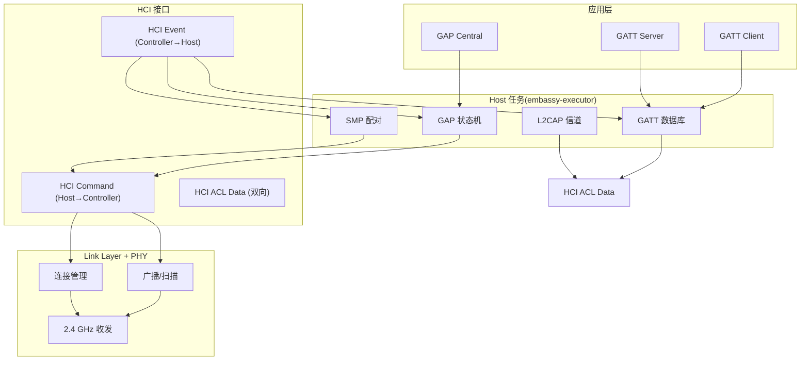
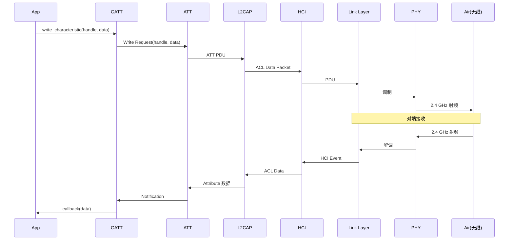
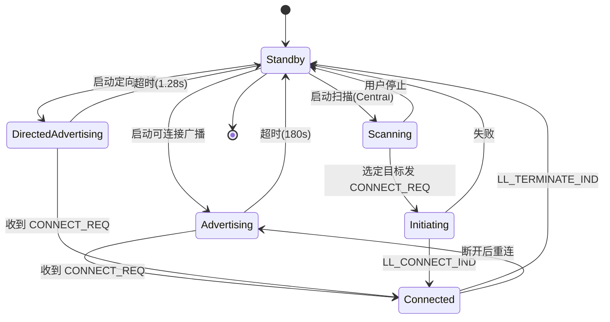
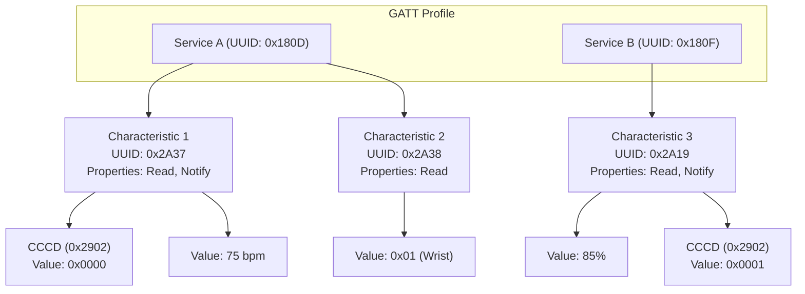
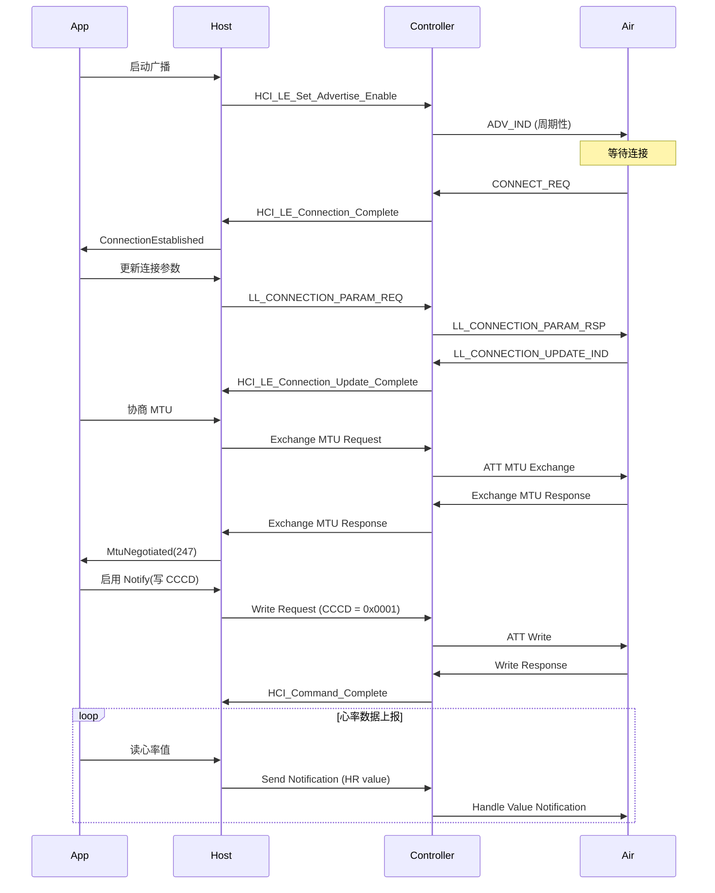

# 19. BLE 协议平台中立学习文档

> 本篇以**平台中立**方式分析 BLE(蓝牙低功耗)协议本身,以及它如何映射到 Embassy 的 Controller/Host 抽象。不深入特定 stm32-wpan / nrf softdevice 平台实现,仅引用 Embassy 抽象层(`Controller` trait 等)作为协议到应用的桥梁。

---

## 目录

1. BLE 在 Embassy 全局中的位置
2. 协议栈分层
3. GAP 角色与连接状态机
4. GATT 模型:Service / Characteristic / Descriptor
5. 广播(Advertising)
6. 连接参数与功耗权衡
7. MTU 与数据分片
8. 加密与配对
9. Embassy 抽象映射(Controller / Host 任务)
10. 实战示例(伪代码)
11. 总结 + 平台差异索引

---

## 1. BLE 在 Embassy 全局中的位置

蓝牙低功耗(Bluetooth Low Energy, BLE)是蓝牙 4.0 引入的低功耗变体,广泛用于 IoT / 可穿戴 / 传感器等场景。Embassy 框架不直接实现 BLE 协议栈(协议栈是芯片厂商闭源),而是通过 `Controller` trait 抽象出 **"Host 任务 ↔ 蓝牙 Controller"** 的接口。

### 1.1 BLE 协议的位置

```
应用层(App)
  └→ GATT Client/Server (GAP + GATT)
       └→ Host 任务 (embassy-executor 调度的 async 任务)
            └→ HCI (Host-Controller Interface,命令/事件流)
                 └→ Link Layer (广播/扫描/连接)
                      └→ PHY (2.4 GHz 无线)
```

Embassy 框架涉及:
- **Controller trait**(embassy-stm32-wpan/src/net/iface.rs:198):定义 Host → Controller 的 write / Controller → Host 的 read 异步接口
- **HostToControllerPacket / ControllerToHostPacket**:HCI 命令 / 事件的序列化封装
- **sequencer + zerocopy_channel**:底层中断 → Host 任务的事件传递

### 1.2 平台中立 vs 平台特定的边界

| 抽象层 | 平台中立(本篇) | 平台特定 |
|--------|------------------|----------|
| 协议 | GAP / GATT / ATT / SMP / L2CAP | — |
| HCI 命令 | HCI Command 组装 | 由厂商 SDK 转换 |
| Controller trait | trait 接口本身 | 由 stm32-wpan / nrf softdevice 实现 |
| 物理层 | — | 2.4 GHz radio(芯片内部) |
| 中断/调度 | — | 由 embassy 任务 + 厂商 ISR 桥接 |

本篇聚焦"协议中立"部分(GAP / GATT / MTU / 加密等),不深入某个平台的 HCI 实现细节。

### 1.3 与 Embassy 其他子系统的关系

- **`embassy-executor`**:Host 任务在 executor 中调度,与 PHY Controller 任务通过 channel 通信
- **`embassy-time`**:用于连接参数超时、广告间隔、加密超时
- **`embassy-sync`**:用于 Host 内部多任务共享 GATT 数据库
- **`embassy-net`**:无直接关系(BLE 协议栈独立于 IP)

### 1.4 适用平台

| 平台 | BLE 协议栈 | embassy 集成 |
|------|------------|--------------|
| STM32WB | 内部 Cortex-M0+ 跑 BLE 协议栈 | embassy-stm32-wpan |
| STM32WBA | Cortex-M33 + 2.4 GHz radio | embassy-stm32-wpan |
| nRF52 系列 | SoftDevice 闭源 | embassy-nrf(通过 bind 包装) |
| nRF53 系列 | SoftDevice 闭源 | embassy-nrf(网络 + BLE 双核) |
| nRF54 系列 | SoftDevice 闭源 | embassy-nrf(支持新架构) |
| ESP32 系列 | NimBLE / Bluedroid | 自行集成(不直接走 embassy) |

### 1.5 为什么本篇平台中立

用户决策:**"BLE 协议本身(平台中立)"**。

理由:
1. 协议知识相对独立,跨平台适用
2. 平台特定 HCI 命令差异大,深入任一平台不代表全部
3. 应用层开发需要协议中立知识,平台知识在初始化阶段

### 1.6 关键概念总览图



> 关键观察:Host 任务运行在应用 MCU,通过 HCI 命令/事件与 BLE Controller 通信。Controller 可以是同芯片内部(STM32WB)或独立芯片(nRF + 外置 BLE)。

---

## 2. 协议栈分层

BLE 协议栈是 7 层(7-Layer)模型,每层职责清晰。理解分层是理解 BLE 的基础。

### 2.1 7 层模型

| 层 | 全称 | 职责 | 关键概念 |
|----|------|------|----------|
| PHY | Physical Layer | 2.4 GHz 无线收发,40 信道(0-39,3 个广播 + 37 个数据) | GFSK 调制,1 Mbps / 2 Mbps PHY |
| LL | Link Layer | 广播/扫描/连接管理,PDU 构造 | 状态机,Channel Map |
| HCI | Host-Controller Interface | 主机与 Controller 命令/事件/数据通道 | HCI Command / Event / ACL |
| L2CAP | Logical Link Control & Adaptation Protocol | 协议多路复用,信道管理,分段/重组 | CID (Channel ID),SDU/PDU |
| ATT | Attribute Protocol | 属性读写协议(基于 L2CAP) | Attribute Handle, UUID |
| GATT | Generic Attribute Profile | 服务/特征/描述符抽象(基于 ATT) | Service / Characteristic / Descriptor |
| GAP | Generic Access Profile | 设备角色/广播/连接参数(基于 LL) | Role, Advertising, Connection |
| SMP | Security Manager Protocol | 配对/加密/身份验证(基于 L2CAP) | Just Works / Passkey / OOB |

注意:BLE 协议栈通常把 SMP 列为"安全层",但它是独立于 GATT/GAP 的协议,用于加密链路。

### 2.2 控制器(Controller)vs 主机(Host)边界

**Controller(链路层侧)**:PHY + LL + HCI 物理接口
- 通常运行在专用 MCU(Cortex-M0+)或硬件 IP
- 处理实时任务(广播时序、连接事件)
- 资源紧张(RAM 数十 KB,ROM 数百 KB)

**Host(应用侧)**:HCI 之上 + L2CAP + ATT + GATT + GAP + SMP
- 运行在应用 MCU(Cortex-M4 / M33 / M7)
- 资源充裕,可跑 RTOS
- 提供 BLE 协议 API 给应用

**HCI 传输**:
- UART HCI(常用,外置 BLE 模块)
- USB HCI(高速,PC 调试)
- Shared RAM + Mailbox(同芯片,STM32WB / WBA)

embassy-stm32-wpan 的 `Controller` trait 抽象 HCI 通信。

### 2.3 BLE 4.x vs 5.x 关键差异

| 特性 | BLE 4.0/4.1/4.2 | BLE 5.0/5.1/5.2/5.3/5.4 |
|------|------------------|--------------------------|
| 速率 | 1 Mbps | 1 Mbps / 2 Mbps / 500 kbps / 125 kbps |
| 距离 | ~30 m | 4x(125 kbps + 编码 PHY) |
| 广播扩展 | 31 字节 | 255 字节(Extended Advertising) |
| 多角色 | 仅 1 主角色 | 任意组合(可同时 broadcaster + observer) |
| 测向 | 无 | AoA / AoD(BLE 5.1+) |
| LE Audio | 无 | LC3 codec(BLE 5.2+) |
| 加密 | LE Privacy 1.2 | LE Privacy + Secure Connections(BLE 4.2+) |

embassy-stm32-wpan 通常基于 BLE 5.x 实现。

### 2.4 BLE 与经典蓝牙(BR/EDR)的差异

| 维度 | BLE | 经典蓝牙 |
|------|-----|----------|
| 功耗 | 极低(μA 平均) | 高(mA) |
| 速率 | 1-2 Mbps | 1-3 Mbps |
| 距离 | 30-100 m | 10 m |
| 拓扑 | 1:多(star) | 1:7(pico-net) + 散射网 |
| 配对 | LE Secure Connections | legacy + SSP |
| 音频 | LE Audio(LC3) | A2DP(SBC/AAC/aptX) |
| 应用 | IoT / 传感器 / Beacon | 耳机 / 文件传输 / 串口 |

### 2.5 协议栈数据流:从应用到 PHY



### 2.6 BLE 信道与跳频

BLE 用 2.4 GHz ISM 频段,共 40 个信道(0-39):
- **广播信道**:37(2402 MHz) / 38(2426 MHz) / 39(2480 MHz)
- **数据信道**:0-36(除广播信道外)

**跳频算法**:每连接事件(channel connection event)切换一次信道,基于:
```
channel = (last_channel + hopIncrement) mod 37
```

hopIncrement 由 Controller 在连接建立时随机生成(0-16)。

### 2.7 BLE 时间单位

- **1 个 bit(1 Mbps PHY)**:1 us
- **1 byte**:8 us
- **1 个 connection event**:7.5 ms - 4 s
- **广播间隔**:20 ms - 10.24 s
- **扫描间隔**:2.5 ms - 10.24 s
- **配对超时**:30 s(LE Legacy) / 认证超时可配

---

## 3. GAP 角色与连接状态机

GAP(Generic Access Profile)定义设备的"角色"(role)、设备发现过程、连接建立与管理。GAP 是 BLE 应用层最常用的 API。

### 3.1 4 种 GAP 角色

| 角色 | 职责 | 典型设备 |
|------|------|----------|
| **Broadcaster** | 发送广播,不可被连接 | iBeacon,环境传感器 |
| **Observer** | 扫描广播,从不发起连接 | 室内定位 scanner |
| **Peripheral**(从) | 发送可连接广播,接受连接 | 智能手环,心率带 |
| **Central**(主) | 扫描广播,发起连接 | 手机,网关 |

**4 角色命名规则**:
- Broadcaster + Observer = 一对单向通知
- Peripheral + Central = 一对双向连接

### 3.2 多角色(Multi-role)

BLE 5.0+ 支持设备同时担任多个角色,例如:
- Peripheral + Broadcaster(同时连接 + 广播非连接)
- Central + Observer(同时主动扫描 + 被动扫描)
- 所有 4 角色(复杂但可行)

embassy-stm32-wpan 通过多个 BLE Profile / ACL 连接支持多角色。

### 3.3 连接状态机(Peripheral 视角)

Peripheral 设备的状态转移:

```
Standby
  ├→ Advertising(可发现/可连接广播)
  │    ├→ Connected
  │    └→ Standby(超时无连接)
  ├→ Directed Advertising(快速重连)
  │    └→ Connected
  └→ Standby(主动停止)
```

**Advertising 状态**:
- 发送 ADV_IND(可发现可连接)
- 等待 SCAN_REQ(可选,从 scanner)
- 等待 CONNECT_REQ(从 central)
- 超时(TGAP(adv)_ADVERT_TIMEOUT=180 s)回到 Standby

**Connected 状态**:
- 周期性连接事件(connection events)
- 每次事件中心跳一次
- 数据交换 + 控制 PDU

**Terminating 状态**:
- 收到 LL_TERMINATE_IND
- 回到 Standby

### 3.4 连接状态机(Central 视角)

Central 设备的状态转移:

```
Standby
  ├→ Scanning(被动/主动扫描)
  │    └→ Initiating(收到 CONNECT_REQ)
  │         └→ Connected
  └→ Standby
```

**Scanning 状态**:
- 被动扫描:只听广播,不回 SCAN_REQ
- 主动扫描:收到广播后回 SCAN_REQ,索取 SCAN_RSP

**Initiating 状态**:
- 选定一个 Peripheral,发 CONNECT_REQ
- 等待 LL_CONNECT_IND(成功)或超时

**Connected 状态**:同 Peripheral。

### 3.5 状态机图



### 3.6 GAP 关键参数

**广播参数**(Peripheral 启动广播时设置):
- `Advertising_Interval_Min` / `Max`:20 ms - 10.24 s(0x0020 - 0x4000,单位 0.625 ms)
- `Advertising_Type`:ADV_IND / ADV_DIRECT_IND / ADV_SCAN_IND / ADV_NONCONN_IND
- `Own_Address_Type`:Public / Random / Resolvable Private
- `Peer_Address_Type`(定向广播):Public / Random
- `Channel_Map`:37/38/39 哪些信道

**扫描参数**(Central 启动扫描时设置):
- `LE_Scan_Window`:扫描窗口(10 ms - 10.24 s)
- `LE_Scan_Interval`:扫描间隔(2.5 ms - 10.24 s)
- `Scanning_Filter_Policy`:Basic / Extended

**连接参数**(连接建立后由 Central 发起更新):
- `Connection_Interval`:7.5 ms - 4 s(单位 1.25 ms)
- `Slave_Latency`:0-499
- `Supervision_Timeout`:100 ms - 32 s(单位 10 ms)

### 3.7 GAP 角色使用场景决策

| 设备类型 | 推荐角色 | 理由 |
|----------|----------|------|
| 心率带 | Peripheral | 由手机主动连接 |
| 智能手表 | Central + Peripheral | 既连手机(Peripheral),又连 BLE 耳机(Central) |
| 室内 Beacon | Broadcaster | 单向通知位置 |
| 资产追踪器 | Broadcaster + Observer | 广播自身 + 扫描其他 beacon |
| BLE 鼠标 | Peripheral | 电脑作为 Central |
| 智能门锁 | Peripheral | 手机作为 Central |
| 网关(多设备) | Central | 同时连多个传感器 |

---

## 4. GATT 模型:Service / Characteristic / Descriptor

GATT(Generic Attribute Profile)定义 BLE 设备间数据交换的格式。所有数据用"属性"(Attribute)表示,通过 UUID 标识。

### 4.1 三层模型

```
GATT Profile(整个应用)
  └→ Service(服务,1+ 个)
       └→ Characteristic(特征,1+ 个)
            └→ Descriptor(描述符,0+ 个)
                 └→ Value(实际数据)
```

**典型示例:心率服务(Heart Rate Service, 0x180D)**
- Service:Heart Rate(0x180D)
  - Characteristic:Heart Rate Measurement(0x2A37)
    - Descriptor:Client Characteristic Configuration(0x2902)
  - Characteristic:Body Sensor Location(0x2A38)

### 4.2 属性(Attribute)基础

每个属性是一个"键值对":
- **Handle**(uint16):属性唯一标识,1-65535(0x0001 - 0xFFFF)
- **Type**(UUID 128-bit):属性类型(Service / Characteristic / Descriptor)
- **Value**(可变长):属性值
- **Permissions**:Read / Write / Notify / Indicate

属性存储在 **属性表**(Attribute Table)中,GATT Server 维护这张表。

### 4.3 UUID

UUID 是 128 bit 标识符,BLE 用两种格式:
- **16-bit SIG UUID**(`0x2A37`):由 Bluetooth SIG 分配,标准服务 / 特征
- **128-bit Custom UUID**(`12345678-1234-5678-1234-567812345678`):厂商自定义

16-bit UUID 实际编码成 128-bit(0x0000xxxx-0000-1000-8000-00805F9B34FB),节省广播字节数。

### 4.4 Characteristic 属性

每个 Characteristic 包含:
- **Value**:实际数据(如心率值)
- **Properties**:bitmask,以下可组合:
  - `Broadcast`(0x01)
  - `Read`(0x02)
  - `Write Without Response`(0x04)
  - `Write`(0x08)
  - `Notify`(0x10)
  - `Indicate`(0x20)
  - `Signed Write Command`(0x40)
  - `Extended Properties`(0x80)

**Notify vs Indicate**:
- **Notify**:Server → Client 单向,无 ACK,可能丢失,吞吐高
- **Indicate**:Server → Client 单向,有 ACK(应用层重传),可靠

### 4.5 常用 Descriptor

| Descriptor | UUID | 用途 |
|------------|------|------|
| Characteristic Extended Properties | 0x2900 | Extended Properties |
| Characteristic User Description | 0x2901 | 用户可读描述 |
| Client Characteristic Configuration (CCCD) | 0x2902 | Notify/Indicate 开关 |
| Server Characteristic Configuration (SCCD) | 0x2903 | Broadcast 开关 |
| Characteristic Presentation Format | 0x2904 | 数据格式(单位、类型) |
| Characteristic Aggregate Format | 0x2905 | 多个格式组合 |

CCCD 是最常用的 Descriptor,Client 通过写 CCCD 启用 Notify/Indicate。

### 4.6 GATT Client / Server

- **GATT Server**:持有属性表,响应 Client 请求
- **GATT Client**:发起读写请求,接收 Notify/Indicate

**关系**:一个连接两端,一方是 Client(常是 Central),另一方是 Server(常是 Peripheral)。**两端可同时是 Client 和 Server**(如智能手表)。

### 4.7 GATT 操作

| 操作 | 方向 | 描述 | 响应 |
|------|------|------|------|
| Read Request | Client → Server | 读 Characteristic Value | Read Response |
| Read By Type Request | Client → Server | 按类型读 | Read By Type Response |
| Read Blob Request | Client → Server | 读长 Value 偏移段 | Read Blob Response |
| Read Multiple Request | Client → Server | 一次读多个 | Read Multiple Response |
| Read By Group Type Request | Client → Server | 读 Service 列表 | Read By Group Type Response |
| Write Request | Client → Server | 写 Value | Write Response |
| Write Command | Client → Server | 写 Value(无 ACK) | 无 |
| Prepare Write Request | Client → Server | 长 Value 分段写准备 | Prepare Write Response |
| Execute Write Request | Client → Server | 提交所有 Prepare Write | Execute Write Response |
| Handle Value Notification | Server → Client | Notify | 无 |
| Handle Value Indication | Server → Client | Indicate | Confirmation |

### 4.8 Service Discovery

Client 连接到 Server 后,需要先做 **Service Discovery** 知道 Server 提供哪些服务:

1. **Primary Service Discovery**:读 0x2800(Primary Service Declaration),获得所有 Primary Service
2. **Characteristic Discovery**:对每个 Service 读 0x2803(Characteristic Declaration),获得 Characteristic 列表
3. **Descriptor Discovery**:对每个 Characteristic 读 0x2803 后面的 Descriptors

**典型 UUID**:
- 0x2800:Primary Service
- 0x2801:Secondary Service
- 0x2802:Include
- 0x2803:Characteristic Declaration
- 0x2900-0x2905:各种 Descriptors

### 4.9 GATT 模型图



### 4.10 标准服务示例

| SIG UUID | 名称 | 用途 |
|----------|------|------|
| 0x1800 | Generic Access | 设备名 / Appearance |
| 0x1801 | Generic Attribute | Service Changed(用于 GATT 缓存失效) |
| 0x180D | Heart Rate | 心率监测 |
| 0x180F | Battery Service | 电池电量 |
| 0x1810 | Blood Pressure | 血压 |
| 0x1812 | Human Interface Device | HID(键鼠) |
| 0x181A | Environmental Sensing | 温度 / 湿度 / 气压 |
| 0x181C | User Data | 用户数据 |
| 0x181D | Weight Scale | 体重秤 |

### 4.11 GATT 与 ATT 的关系

- **ATT(Attribute Protocol)**:定义"如何读写属性"的协议,基于 L2CAP
- **GATT**:在 ATT 之上定义"服务 / 特征 / 描述符"的语义

GATT 是 ATT 的"Profile"(配置文件),规定了属性的组织方式。所有 GATT 操作本质都是 ATT 操作。

---

## 5. 广播(Advertising)

广播是 BLE 设备被发现的核心机制。Peripheral / Broadcaster 发送广播包,Scanner / Observer 接收。

### 5.1 广播信道

BLE 用 3 个固定广播信道(37 / 38 / 39),与其他 37 个数据信道分开:

- **37** = 2402 MHz(WiFi 信道 1)
- **38** = 2426 MHz(WiFi 信道 6)
- **39** = 2480 MHz(WiFi 信道 13)

**为什么用 3 个**:WiFi 占用了 2.4 GHz 频段的部分信道,3 个广播信道选在 WiFi 信道之间的"间隙",降低干扰。

### 5.2 广播包结构

**ADV_IND**(可发现可连接):
```
┌────────────────┐
│  Preamble      │ 1 byte(0xAA / 0x55)
├────────────────┤
│  Access Addr   │ 4 bytes(0x8E89BED6)
├────────────────┤
│  PDU Header    │ 2 bytes
│  (Length, Type)│
├────────────────┤
│  AdvA (6 B)    │ 设备地址
│  AdvData (≤31) │ 广播数据
│  CRC            │ 3 bytes
└────────────────┘
```

**PDU Header** (16 bits):
- bits 0-3:`PDU_Type`(0=ADV_IND, 1=ADV_DIRECT_IND, 2=ADV_NONCONN_IND, 3=SCAN_REQ, 4=SCAN_RSP, 5=CONNECT_REQ, 6=ADV_SCAN_IND)
- bits 4-5:`TxAdd`(0=Public, 1=Random)
- bits 6-7:`RxAdd`
- bit 8-13:`Length`(0-63,实际有效 6-37)
- bits 14-15:RFU

**AdvData**(≤ 31 字节,bytes 有效 0-31):
- TLV 格式:Type(1B) + Length(1B) + Value(0-29B)
- 常用 Type:
  - 0x01:Flags(LE 通用发现标志)
  - 0x02 / 0x03:16-bit / 32-bit Service UUID(部分列表)
  - 0x04 / 0x05:32-bit / 128-bit Service UUID
  - 0x06 / 0x07 / 0x08:Local Name(shortened / complete)
  - 0x09:Appearance
  - 0x0A:Advertising Interval
  - 0xFF:Manufacturer Specific Data(iBeacon / Eddystone)

### 5.3 4 种广播类型

| 类型 | 可发现 | 可连接 | 响应 SCAN_REQ | 应用 |
|------|--------|--------|---------------|------|
| ADV_IND | 是 | 是 | 是 | 标准 Peripheral 广播 |
| ADV_DIRECT_IND(高占空比) | 否 | 是(指定 Central) | 否 | 快速重连 |
| ADV_DIRECT_IND(低占空比) | 否 | 是(指定 Central) | 否 | 慢速重连 |
| ADV_NONCONN_IND | 是 | 否 | 否 | iBeacon,单向通知 |
| ADV_SCAN_IND | 是 | 否 | 是 | 自定义 Scanner 协议 |

### 5.4 Extended Advertising(BLE 5.0+)

传统广播(LEGACY)限 31 字节 AdvData。BLE 5.0 引入 Extended Advertising:
- 主广播信道 37/38/39 上发 AUX_ADV_IND 指向
- 数据信道(0-36)上发 AUX_CHAIN_IND 链式传输
- 单次广播最大 **255 字节**(Primary + Chain)
- 支持更复杂的数据(iBeacon 长 URL、固件版本等)

**embassy-stm32-wpan 支持**:是(若 Controller 固件含 BLE 5.0 能力)。

### 5.5 广播间隔(Advertising Interval)

广播间隔 = 两次 ADV_IND 之间的最小时间。范围 20 ms - 10.24 s(单位 0.625 ms):

```
interval_register = 0x0020  (20 ms)
interval_register = 0x4000  (10.24 s)
```

**权衡**:
- **短间隔**(20-100 ms):被发现快,但功耗高
- **长间隔**(1-10 s):省电,但被发现的延迟大

**典型应用**:
- iBeacon:100 ms
- HID 设备(键鼠):20-50 ms
- 温湿度传感器:1-5 s

### 5.6 定向广播(Directed Advertising)

ADV_DIRECT_IND 包含目标 Central 的地址,只有该 Central 能接受。用于快速重连(已绑定设备的快速回连)。

- 高占空比模式:3.75 ms 间隔,1.28 s 后停止(快速重连)
- 低占空比模式:100 ms 间隔,直到超时(慢速重连,省电)

### 5.7 SCAN_REQ / SCAN_RSP

主动 Scanner 收到广播后,可发 SCAN_REQ 索取更多数据:
- SCAN_REQ:6 字节 Scanner 地址 + 6 字节 Advertiser 地址
- SCAN_RSP:同 ADV_IND 的 AdvData 格式,多 31 字节

**典型用法**:ADV_IND 放"必要信息"(Service UUID, 设备名缩写),SCAN_RSP 放"次要信息"(完整设备名, 厂商数据)。

### 5.8 广播数据布局示例

```
ADV_IND (31 字节):
  - Flags: 0x06 (LE General Discoverable + BR/EDR not supported)
  - Complete Local Name: "MyDevice"
  - Service UUIDs (16-bit, complete): 0x180D, 0x180F
  - Manufacturer Data: <2 bytes company ID> <N bytes payload>

SCAN_RSP (31 字节):
  - Complete Local Name: "MyDevice (longer description)"
  - Tx Power Level: +4 dBm
  - Appearance: 0x03C1 (Heart Rate Sensor)
```

---

## 6. 连接参数与功耗权衡

连接参数是连接建立后可调整的时序参数,直接决定功耗与吞吐。**设计 BLE 应用时,80% 的功耗优化来自正确的连接参数**。

### 6.1 三个核心参数

| 参数 | 范围 | 含义 | 权衡 |
|------|------|------|------|
| Connection Interval (CI) | 7.5 ms - 4 s | 两次连接事件的时间间隔 | 短 CI → 高吞吐 + 高功耗;长 CI → 低功耗 + 低吞吐 |
| Slave Latency (SL) | 0 - 499 | Peripheral 允许跳过的连接事件数 | 大 SL → 极低功耗 + 长延迟 |
| Supervision Timeout (ST) | 100 ms - 32 s | 无活动超时,超时则断开 | 必须 > (1 + SL) × CI |

**关系**:
- **有效连接间隔** = (1 + SL) × CI
- **超时** = (1 + SL) × CI × (1 + 重试次数)
- ST 必须 > 有效 CI,避免误判断开

### 6.2 连接事件(Connection Event)

每次连接事件:
1. Peripheral 醒来,接收 central 包(或不发)
2. Peripheral 发送包(或不发)
3. 双方切换信道(跳频)
4. 等待下一事件

**空事件**(无数据):Peripheral 仍要"醒来听",产生 ~50-200 uA 电流(几 ms)
**有数据事件**:电流更高,持续 1-5 ms

### 6.3 Slave Latency 的妙用

Peripheral 可以"跳过" N 个连接事件而不断开:

```
CI = 100 ms, SL = 9
有效 CI = (1 + 9) × 100 ms = 1 s
```

每 10 个事件 Peripheral 只参与 1 个,其余时间可深度睡眠。

**典型应用**:
- 智能门锁:CI = 1 s, SL = 0(需要立即响应)
- 智能手表:CI = 50 ms, SL = 0(需要实时通知)
- 蓝牙灯泡:CI = 100 ms, SL = 9(命令不急,可 1 s 响应)
- 室内传感器:CI = 1 s, SL = 4(5 s 上报一次)

### 6.4 连接参数更新流程

Central 可主动请求更新连接参数:

```
LL_CONNECTION_PARAM_REQ (Central → Peripheral)
  ├→ LL_CONNECTION_PARAM_RSP (Peripheral → Central,接受或拒绝)
       └→ LL_CONNECTION_UPDATE_IND (应用新参数)
```

Peripheral 也可发起请求(GAP Connection Parameter Update procedure)。

**embassy-stm32-wpan**:由 GATT 服务"Generic ATT Profile"提供 Update API。

### 6.5 功耗预算示例

**心率带**(上报 1 Hz,无其他交互):
- CI = 1 s, SL = 0
- 每 1 s 一次连接事件,~1 ms 接收
- 平均电流:~10 uA
- CR2032(220 mAh)续航:**>2 年**

**蓝牙鼠标**(100 Hz 报告率):
- CI = 7.5 ms, SL = 0
- 每 7.5 ms 一次连接事件
- 平均电流:~1 mA
- AAA 电池(1000 mAh)续航:**>1000 小时**

**Beacon**(1 Hz 广播):
- 广播间隔 1 s
- 广播耗时 ~3 ms
- 平均电流:~15 uA
- CR2032 续航:**>1 年**

### 6.6 连接参数优化决策表

| 场景 | CI | SL | 理由 |
|------|----|----|------|
| 键鼠 | 15-30 ms | 0 | 高响应性 |
| 音频 | 7.5-15 ms | 0 | 低延迟 |
| 传感器(实时) | 50-100 ms | 0 | 中等响应 |
| 智能家居开关 | 100-200 ms | 0-4 | 可接受 1-2 s 延迟 |
| 智能灯 | 100-500 ms | 0-9 | 5-10 s 响应可接受 |
| 健身追踪器 | 1-2 s | 0-4 | 心率 1 Hz 报告 |
| 资产追踪(被动) | 1-4 s | 9-99 | 极低功耗 |

### 6.7 优先协商(Preferred)

当 Central 请求更新连接参数时,Peripheral 可能有"preferred"参数:

```rust
// 伪代码 - embassy-stm32-wpan 风格
preferred_conn_params: PreferredConnParams {
    min_connection_interval: 6,    // 7.5 ms (6 × 1.25 ms)
    max_connection_interval: 800,  // 1 s
    slave_latency: 0,
    supervision_timeout_multiplier: 400,  // 4 s
}
```

Central 会尽量用"preferred"范围内的参数,协商失败则用初始参数。

---

## 7. MTU 与数据分片

MTU(Maximum Transmission Unit)决定 GATT 操作单次能传多少数据。**MTU 配置错误是 BLE 性能问题最常见原因**。

### 7.1 MTU 定义

MTU = L2CAP SDU 最大长度(以 byte 计)。

**理论范围**:23 - 65535 字节
**典型值**:
- 23(默认,GATT 单包)
- 158 / 185 / 251 / 512(协商)
- 244(常用最大值,有限制)

### 7.2 默认 MTU = 23

BLE 默认 MTU 是 23 字节,意味着:
- L2CAP header:4 字节
- 留给 GATT PDU:19 字节
- 留给实际数据:**MTU 23 包含 4 字节 L2CAP header,纯 ATT PDU 19 字节**

Write Request 实际可用 20 字节(Read Response 1 字节,给 attribute value)。**早期 BLE 应用常因未协商 MTU 而限制吞吐**。

### 7.3 MTU 协商

GATT Exchange MTU Request / Response:

```
Client → Server: Exchange MTU Request (client_rx_mtu)
Server → Client: Exchange MTU Response (server_rx_mtu)
最终 MTU = min(client_rx_mtu, server_rx_mtu)
```

**注意**:`client_rx_mtu` 是 Client 能**接收**的最大 MTU(下行),`server_rx_mtu` 是 Server 能**接收**的最大 MTU(上行)。

**embassy-stm32-wpan 风格 API**:
```rust
// 伪代码
let server_mtu = stack.exchange_mtu(247).await?;
log::info!("MTU negotiated: {}", server_mtu);
```

### 7.4 MTU 限制

**ATT_MTU 实际限制**:
- 实际 ATT_MTU = MTU - 4
- 实际可写 = ATT_MTU - 3(Write Request 头 3 字节)
- 实际可读 = ATT_MTU - 1(Read Response 头 1 字节)

**最大 MTU**:
- BLE 4.0-4.1:无明确上限,实际受 Controller RAM 限制,通常 158 / 247
- BLE 4.2+:理论 65535,Controller 实际常限 247 / 512
- BLE 5.x:可更大,但应用层常限 247(IOS 早期不支持更大)

### 7.5 数据分片(Fragmentation)

MTU 协商失败时,可用 **Prepare Write** + **Execute Write** 长数据分片:

```
Client → Server: Prepare Write Request (offset 0, data 0-247)
Server → Client: Prepare Write Response
Client → Server: Prepare Write Request (offset 247, data 247-494)
Server → Client: Prepare Write Response
... (重复)
Client → Server: Execute Write Request (commit)
Server → Client: Execute Write Response
```

或反向(读长):
```
Client → Server: Read Blob Request (offset 0)
Server → Client: Read Blob Response (data 0-247)
... (重复)
```

**应用场景**:
- OTA 固件升级(数 MB)
- 长 URL 写入
- 批量配置

### 7.6 MTU 选择策略

| 设备 | 推荐 MTU | 理由 |
|------|----------|------|
| iPhone(早期) | 23 | 旧版 iOS 限制 |
| iPhone(新) | 158 / 247 | 现代 iOS |
| Android | 247(常用) | 灵活 |
| 心率带 | 23 | 数据小,无需大 MTU |
| OTA 设备 | 247+ | 减少分片次数 |
| 高吞吐设备 | 247-512 | 大数据传输 |

**经验值**:247 是兼容性最好的"最大公约数"。

### 7.7 MTU 与性能关系

| 操作 | MTU=23 | MTU=247 | 提升 |
|------|--------|---------|------|
| Write 1 KB | 44 个包,44 次响应 | 5 个包,5 次响应 | 8x |
| Read 1 KB | 44 个包,44 次请求 | 5 个包,5 次请求 | 8x |
| Notify 1 KB | 44 个包 | 5 个包 | 8x |

**注意**:MTU 增加,单包耗时增加(因数据信道最大包 255 字节,接近极限)。吞吐提升来自包头开销降低。

---

## 8. 加密与配对

加密是 BLE 安全的核心。SMP(Security Manager Protocol)定义配对(Pairing)和绑定(Bonding)过程,LE Secure Connections 提供现代加密算法。

### 8.1 3 种安全等级

| 等级 | 描述 | 加密 | MITM 保护 |
|------|------|------|-----------|
| Level 1 | 无安全 | 否 | 否 |
| Level 2 | 加密(LE Legacy 或 LE SC) | 是 | 否 |
| Level 3 | 加密 + 认证 | 是 | 是 |
| Level 4 | 加密 + 认证 + LE Secure Connections | 是 | 是 |

**MITM**(Man-In-The-Middle)保护:防止中间人攻击。

### 8.2 配对(Pairing)过程

3 个阶段:
1. **Pairing Feature Exchange**:交换 IO 能力、OOB 数据可用性、认证需求
2. **Authentication / Key Generation**:根据 IO 能力选配对算法,生成短期密钥(STK)或长期密钥(LTK)
3. **Encryption Setup**:用生成的密钥加密链路

### 8.3 配对方法

| 方法 | 适用 | MITM 保护 | 安全性 |
|------|------|-----------|--------|
| **Just Works** | 无显示器 / 无键盘 | 否 | 低 |
| **Passkey Entry** | 一方有显示器 + 一方有键盘 | 是 | 中 |
| **Numeric Comparison**(LE SC) | 双方都有显示器 | 是 | 高 |
| **OOB**(Out of Band) | NFC / QR 码等带外 | 是 | 极高 |

**Just Works**(常见,IoT 设备):
- 无任何用户交互
- 配对过程中临时密钥被攻击者可见
- 适合:无 UI 的传感器、灯泡
- 不适合:支付、医疗

**Passkey Entry**:
- 一方显示 6 位数字,另一方输入
- 适合:键盘 + 显示器组合
- 适合:手机 + 智能锁

**Numeric Comparison**(LE SC 推荐):
- 双方都显示 6 位数字
- 用户必须确认两端数字相同
- 适合:手机 + 手机 / 手机 + 智能手表
- 安全性最高(基于 ECDH P-256)

### 8.4 LE Legacy vs LE Secure Connections

| 维度 | LE Legacy(4.0/4.1) | LE Secure Connections(4.2+) |
|------|----------------------|------------------------------|
| 密钥交换 | 短密钥 + AES-128 | ECDH P-256(更安全) |
| 抗被动攻击 | 弱 | 强 |
| 抗主动攻击(MITM) | 视模式 | 强(Numeric Comparison) |
| Just Works 安全性 | 弱(无显示 + 无键盘) | 中(基于 ECDH) |
| 推荐 | 不推荐新设计 | **新设计都应使用** |

### 8.5 配对流程

**Just Works + LE SC**:
```
Phase 1: Pairing Request / Response (交换 IO 能力、OOB 标志)
Phase 2: Public Key Exchange (双方 ECDH 公钥)
         → 计算 DHKey
Phase 3: 双方各自计算 Confirm Value
         → 校验一致
Phase 4: 生成 LTK (Long Term Key)
Phase 5: 加密链路
```

**Numeric Comparison**:
```
Phase 1-2: 同上
Phase 3: 双方显示 6 位数字(基于 DHKey + nonce 哈希)
Phase 4: 用户按"匹配"按钮(确认两端数字一致)
Phase 5: 生成 LTK
```

### 8.6 绑定(Bonding)

配对完成后,设备可"绑定"(Bonding):
- 双方存储 LTK / IRK / CSRK
- 下次连接时直接用 LTK 加密(无需重新配对)
- "已绑定设备"列表(由 Host 维护)

**Bonding Data**(存储在 NVM):
- LTK(16 bytes):加密密钥
- EDIV / RAND(2 + 8 bytes):加密密钥标识
- IRK(16 bytes):Identity Resolving Key(Resolvable Private Address 解析)
- CSRK(16 bytes):Connection Signature Resolving Key(数据签名)
- Address(6 bytes):Peer 设备地址

### 8.7 隐私(Privacy)与 Resolvable Private Address

BLE 设备用 **Resolvable Private Address(RPA)** 避免被跟踪:
- 设备地址 = 哈希(IRK, random)
- 扫描时,扫描器用本地存储的 IRK 验证地址
- RPA 每 15 分钟(可配)更换一次

**LE Privacy 1.2**:
- Address Resolution:用 IRK 解出真实地址
- 双方可"隐身"广播,只有绑定的设备能识别

### 8.8 加密状态机

```
未配对
  ├→ 配对请求(从应用发起)
  │    └→ 配对中(3 阶段)
  │         ├→ 成功 → 已加密 + 已绑定
  │         └→ 失败 → 未配对
  └→ 已绑定设备发起连接
       └→ 加密请求(从 Host 发起)
            └→ 加密中(用 LTK 加密)
                 ├→ 成功 → 已加密
                 └→ 失败 → 重新配对
```

### 8.9 应用层安全最佳实践

1. **默认启用 LE SC**(BLE 4.2+)
2. **禁用 Just Works**(如可能,强制 Passkey 或 Numeric Comparison)
3. **使用 RPA**(避免被跟踪)
4. **启用 Bonding**(用户体验更好)
5. **存储 LTK 到 NVM**(Flash 或 EEPROM)
6. **绑定上限**(避免存储溢出,典型上限 8-16 个设备)
7. **LE Privacy 1.2**(扫描方需 Address Resolution)

---

## 9. Embassy 抽象映射(Controller / Host 任务)

embassy-stm32-wpan 提供了 `Controller` trait 抽象 Host ↔ Controller 通信。本节分析协议到 Embass y 抽象的映射。

### 9.1 Controller trait 定义

**位置**:`embassy-stm32-wpan/src/net/iface.rs:198`

```rust
pub trait Controller: ErrorType {
    type Packet: ControllerToHostPacketBox;

    /// Write a packet to the controller.
    fn write(&self, packet: &impl HostToControllerPacket) 
        -> impl Future<Output = Result<(), Self::Error>>;

    /// Read a valid packet from the controller.
    fn read<'a>(&self) 
        -> impl Future<Output = Result<Self::Packet, Self::Error>>;
}
```

**语义**:
- `write` 异步发送 HCI Command 到 Controller
- `read` 异步等待 Controller 事件(返回 ControllerToHostPacket)

### 9.2 HCI Packet 抽象

**HostToControllerPacket**(写方向):
```rust
pub trait HostToControllerPacket: WriteHci {
    const KIND: PacketKind;
    fn kind(&self) -> PacketKind { Self::KIND }
}
```

实现:每个 HCI Command 都是一个具体类型(如 `HCI_LE_Set_Advertising_Parameters`),实现 `WriteHci` trait 把自己序列化成字节流。

**ControllerToHostPacket**(读方向):
```rust
pub enum ControllerToHostPacket<'a> {
    Mlme(mlme::Packet<'a>),  // 802.15.4 / 私有协议
    Mcps(mcps::Packet<'a>),
}
```

注意:这是 embassy-stm32-wpan 当前的 enum,实际 BLE HCI 事件需要再分包。

### 9.3 Host 任务架构

```rust
// 伪代码 - BLE Host 任务典型结构
#[embassy_executor::task]
async fn ble_host_task(controller: impl Controller) {
    // 1) 初始化 Controller
    controller.write(&HCI_Reset {}).await.unwrap();
    let _evt = controller.read().await.unwrap();

    // 2) 设置本地地址
    controller.write(&HCI_LE_Set_Random_Address { bd_addr: ... }).await.unwrap();
    let _evt = controller.read().await.unwrap();

    // 3) 设置广播参数
    controller.write(&HCI_LE_Set_Advertising_Parameters { ... }).await.unwrap();
    let _evt = controller.read().await.unwrap();
    controller.write(&HCI_LE_Set_Advertising_Data { ... }).await.unwrap();
    let _evt = controller.read().await.unwrap();

    // 4) 启用广播
    controller.write(&HCI_LE_Set_Advertise_Enable { enable: 1 }).await.unwrap();
    let _evt = controller.read().await.unwrap();

    // 5) 事件循环
    loop {
        let event = controller.read().await.unwrap();
        match event {
            ControllerToHostPacket::HciLeAdvertisingReport(_) => {
                // 处理扫描结果
            }
            ControllerToHostPacket::HciLeConnectionComplete(_) => {
                // 处理连接完成
            }
            ControllerToHostPacket::HciDisconnectionComplete(_) => {
                // 处理断开
            }
            _ => { /* 其他事件 */ }
        }
    }
}
```

### 9.4 GATT 数据库

embassy-stm32-wpan 当前没有 GATT 数据库的"高层抽象",用户需直接构造 HCI 命令。但社区已有第三方 crate(bleasy / ble-gatt)提供 GATT 数据库宏:

```rust
// bleasy 风格(伪代码)
bleasy::gatt_server!({
    service HeartRate {
        characteristic HeartRateMeasurement {
            read: heart_rate_value,
            notify: true,
        }
    }
});
```

### 9.5 sequencer + zerocopy_channel

embassy-stm32-wpan 内部用 `sequencer` 机制把 ISR 事件传递给 Host 任务:

```rust
// 在 ISR 中
fn radio_isr() {
    util_seq::UTIL_SEQ_SetTask(TASK_LINK_LAYER_MASK, 0);
}

// 在 Host 任务中
loop {
    util_seq::seq_resume();  // 等待并处理所有 pending tasks
    // 然后 read HCI events
}
```

`zerocopy_channel` 是 Host ↔ Controller 的 zero-copy 通信通道,避免包拷贝。

### 9.6 multi-role 抽象

embassy-stm32-wpan 当前主要支持单 BLE 角色(Peripheral 或 Central)。**多角色需要应用层管理多个 HCI 连接**,通过 `ACL Connection Handle` 区分:

```rust
// 伪代码 - 多连接
let mut connections: HashMap<u16, ConnectionContext> = HashMap::new();
loop {
    let event = controller.read().await.unwrap();
    if let ControllerToHostPacket::HciLeConnectionComplete(evt) = event {
        connections.insert(evt.connection_handle, ConnectionContext::new(evt));
    }
}
```

### 9.7 GATT 事件流

GATT 操作(Read / Write / Notify)在 Host 中以事件方式处理:

```
[Client]  →  GATT Request  →  [Server Host Task]  →  [应用 Handler]  →  [Server Response]
                                                              ↓
                                                  (用户回调)
```

embassy-stm32-wpan 通过 GATT 服务的"事件队列"把请求转发给应用。

---

## 10. 实战示例(伪代码)

由于本篇是协议中立,以下示例不绑特定平台,以**伪代码 + 状态机**形式展示典型 BLE 应用模式。

### 10.1 伪代码:Peripheral 心率服务

```rust
// 伪代码 - Peripheral 角色,广播 + 心率服务

// 1) 初始化
let controller = init_ble_controller().await;
let gatt_db = build_heart_rate_gatt_db();

// 2) 启动广播
controller.set_advertising_params(
    adv_interval: 100ms,
    adv_type: ADV_IND,
    own_addr: public,
    peer_addr: any,
    channel_map: 0x7 (37/38/39),
);
controller.set_advertising_data(&[
    Flags(LE_GENERAL_DISCOVERABLE),
    CompleteServiceUUIDs(0x180D),
    CompleteLocalName("MyHeartRate"),
]);
controller.set_scan_response_data(&[
    ManufacturerData(0x004C, &[0x02, 0x15, ...]),  // iBeacon payload
]);
controller.set_advertise_enable(true);

// 3) 事件循环
loop {
    let event = controller.read_event().await;
    match event {
        ConnectionComplete { handle, peer_addr, interval, latency, timeout } => {
            // 4) 连接建立:保存连接上下文,设置连接参数
            let conn = ConnectionContext { handle, ... };
            connections.insert(handle, conn);

            // 协商 MTU
            let mtu = controller.exchange_mtu(handle, 247).await;
            conn.mtu = mtu;
        }
        DisconnectionComplete { handle, reason } => {
            connections.remove(handle);
            // 重新启用广播
            controller.set_advertise_enable(true);
        }
        AttributeRead { handle, offset, conn_handle } => {
            // 5) 处理读请求
            if let Some(value) = gatt_db.get_value(handle) {
                controller.send_read_response(conn_handle, handle, offset, value).await;
            } else {
                controller.send_read_response_error(conn_handle, handle, ATT_READ_NOT_PERMITTED).await;
            }
        }
        AttributeWrite { handle, offset, data, conn_handle, response_needed } => {
            // 6) 处理写请求
            if let Some(CCCD) = gatt_db.get_mut(handle) {
                // 客户端写 CCCD,启用 Notify
                if CCCD.value == 0x0001 {
                    notifications.insert(conn_handle, handle);
                }
            } else {
                gatt_db.set_value(handle, offset, data);
            }
            if response_needed {
                controller.send_write_response(conn_handle, handle).await;
            }
        }
        ConnectionParameterUpdateRequest { handle, interval, latency, timeout } => {
            // 7) 接受连接参数更新
            controller.accept_connection_param_update(handle, interval, latency, timeout).await;
        }
        _ => { /* 其他事件 */ }
    }

    // 8) 周期性发送 Notify(心率值)
    if let Some(conn) = connections.get_active() {
        let hr_value = read_heart_rate_sensor();
        controller.send_notification(conn.handle, HEART_RATE_MEASUREMENT_HANDLE, &hr_value).await;
    }
}
```

### 10.2 伪代码:Central 扫描 + 连接

```rust
// 伪代码 - Central 角色,扫描 + 连接 + 读 GATT

let controller = init_ble_controller().await;

// 1) 设置扫描参数
controller.set_scan_params(
    scan_type: Active,
    interval: 100ms,
    window: 50ms,
    own_addr: random,
    filter_policy: AcceptAll,
);

// 2) 启动扫描
controller.set_scan_enable(true);

// 3) 事件循环
loop {
    let event = controller.read_event().await;
    match event {
        AdvertisingReport { addr, rssi, adv_data, scan_rsp } => {
            // 4) 检查是否为目标设备(通过 Service UUID 或 Local Name)
            if let Some(uuid) = parse_service_uuid(adv_data) {
                if uuid == TARGET_SERVICE_UUID {
                    // 5) 停止扫描,发起连接
                    controller.set_scan_enable(false);
                    controller.create_connection(
                        peer_addr: addr,
                        own_addr: random,
                        conn_interval: 50ms,
                        conn_latency: 0,
                        supervision_timeout: 5s,
                    );
                }
            }
        }
        ConnectionComplete { handle, ... } => {
            // 6) 连接成功,做 Service Discovery
            let services = controller.discover_primary_services(handle).await?;
            for svc in services {
                let chars = controller.discover_characteristics(handle, svc).await?;
                for c in chars {
                    // 读 Characteristic Value
                    if c.properties.contains(READ) {
                        let value = controller.read_characteristic_value(handle, c.value_handle).await?;
                        log::info!("{}: {:?}", c.uuid, value);
                    }
                }
            }
        }
        DisconnectionComplete { handle, reason } => {
            // 7) 断开,重新扫描
            controller.set_scan_enable(true);
        }
        _ => { /* 其他 */ }
    }
}
```

### 10.3 典型时序图:连接 + Notify



### 10.4 调试 checklist

| 现象 | 可能原因 | 排查方向 |
|------|----------|----------|
| 设备不可发现 | 广播没启用 | 抓 HCI 命令,确认 Set_Advertise_Enable |
| 扫描收不到广播 | 扫描参数错 | 扫描 interval / window 是否合理 |
| 连接失败 | 设备地址 / 类型错 | 检查 peer_addr 和 own_addr |
| 连接后立即断开 | 监督超时太短 | 增大 supervision_timeout |
| Notify 收不到 | CCCD 没启用 | 抓 ATT Write 0x2902 是否成功 |
| MTU 协商失败 | Controller 不支持 | 改用小 MTU(158 或 23) |
| 配对失败 | IO 能力不匹配 | 改用 Just Works |
| 距离短 | 发射功率低 | 增大 TX Power(典型 0-8 dBm) |

---

## 11. 总结 + 平台差异索引

### 11.1 BLE 协议核心要点

1. **7 层协议栈**:PHY → LL → HCI → L2CAP → ATT → GATT → GAP + SMP
2. **4 种 GAP 角色**:Broadcaster / Observer / Peripheral / Central
3. **GATT 三层模型**:Service → Characteristic → Descriptor
4. **3 类广播**:ADV_IND(可发现可连接) / ADV_DIRECT_IND(快速重连) / ADV_NONCONN_IND(单向)
5. **3 个连接参数**:Connection Interval / Slave Latency / Supervision Timeout
6. **MTU 默认 23**:需协商以提升吞吐(247 常用最大值)
7. **3 种配对方法**:Just Works / Passkey Entry / Numeric Comparison
8. **LE Secure Connections**(BLE 4.2+):基于 ECDH P-256,新设计应使用

### 11.2 设计决策矩阵

| 设备 | GAP 角色 | 广播策略 | 连接参数 | MTU | 加密 |
|------|----------|----------|----------|-----|------|
| 心率带 | Peripheral | 1 Hz 广播 | CI 1s, SL 0 | 23 | Just Works |
| 智能手表 | Peripheral + Central | 1 Hz 广播 | CI 50ms, SL 0 | 247 | Numeric Comparison |
| 智能灯泡 | Peripheral | 低频广播 | CI 100ms, SL 9 | 23 | Just Works |
| 资产追踪 | Broadcaster | 100 ms 广播 | N/A | N/A | N/A |
| 室内扫描 | Observer | N/A | N/A | N/A | N/A |
| 网关 | Central | 主动扫描 | 多个连接 | 247 | Passkey Entry |
| HID 设备 | Peripheral | 50 ms 广播 | CI 15ms, SL 0 | 23 | Just Works |

### 11.3 平台差异索引

| 平台 | 协议栈 | embassy 集成 | BLE 5.x | Extended Adv | LE Audio | 备注 |
|------|--------|--------------|---------|--------------|----------|------|
| STM32WB | 内部 M0+ | embassy-stm32-wpan | 5.2 | 支持 | 需额外 IP | 双核,需 IPC |
| STM32WBA | M33 + 2.4GHz | embassy-stm32-wpan | 5.3 | 支持 | 支持 | 新一代 |
| nRF52840 | SoftDevice | embassy-nrf (bind) | 5.x | 支持 | 不支持 | 经典选择 |
| nRF5340 | SoftDevice | embassy-nrf | 5.x | 支持 | 不支持 | 网络 + BLE 双核 |
| nRF54 | SoftDevice | embassy-nrf | 5.4+ | 支持 | 支持 | 2025+ 新品 |
| ESP32-S3 | NimBLE | 自行集成 | 5.x | 支持 | 不支持 | WiFi + BLE |
| 任何 MCU + nRF52 | 外置 | SoftDevice | 5.x | 支持 | 视型号 | 模块化方案 |

### 11.4 与其他子系统的协作

- **embassy-executor**:Host 任务是 async/await 友好的,可在多任务中共享 GATT 状态
- **embassy-time**:用于扫描 / 广播定时、连接参数超时
- **embassy-sync**:多连接共享数据库用 Mutex 保护
- **embassy-net**:BLE 协议栈独立,无直接关系

### 11.5 关键经验与陷阱

1. **MTU 必须协商**:默认 23 字节限制吞吐,务必协商到 247
2. **广播间隔权衡**:短间隔 = 快发现 + 高功耗,长间隔 = 省电 + 慢发现
3. **从设备延迟(SL)**:利用 SL 跳过连接事件,可大幅降功耗
4. **LE SC vs LE Legacy**:新设计用 LE Secure Connections(更安全)
5. **Just Works 不安全**:无显示器 / 无键盘设备注意 MITM 风险
6. **Bonding 上限**:NVM 空间有限,典型 8-16 个绑定设备
7. **RPA 定期更换**:15 分钟换一次(可配),保护隐私
8. **HCI 调试**:用 Wireshark + HCI snoop 抓包,定位协议问题
9. **GAP 优先协商**:应用应提供 preferred 连接参数,避免中央端选错
10. **多角色资源**:同时担任 4 角色资源消耗大,需评估 MCU 能力

### 11.6 后续深入方向

1. **LE Audio / LC3**:BLE 5.2+ 音频流(耳机、助听器)
2. **Mesh(BLE Mesh)**:多对多通信(智能家居)
3. **AoA / AoD**:测向(室内定位)
4. **Coded PHY**:长距离(BLE 5.0+,125 kbps)
5. **Periodic Advertising with Responses**:BLE 5.4
6. **Isochronous Channels**:LE Audio 底层

### 11.7 总结

BLE 是 IoT / 可穿戴 / 智能家居的核心协议,Embassy 框架通过 `Controller` trait 抽象了协议到应用的桥梁。本篇以平台中立方式分析:

1. 协议栈 7 层模型与各层职责
2. GAP 4 种角色与连接状态机
3. GATT 服务/特征/描述符的三层模型
4. 广播机制(传统 + Extended)
5. 连接参数与功耗权衡
6. MTU 协商与数据分片
7. 加密与配对(LE SC 推荐)
8. Embassy 抽象映射(Controller trait + HCI 包)

掌握 BLE 协议中立知识后,具体到任一平台(stm32-wpan / nrf softdevice)只需学习 HCI 命令组装与初始化流程即可。

后续学习路径:阅读 M6 系统组件文档(了解 BLE bootloader + DFU 升级)、阅读 M7 开发实践(了解 BLE 调试与协议分析仪使用)。

---
