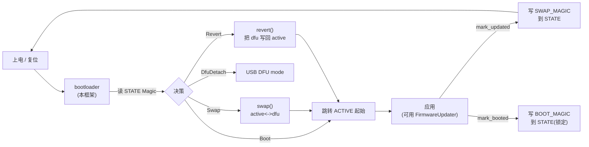
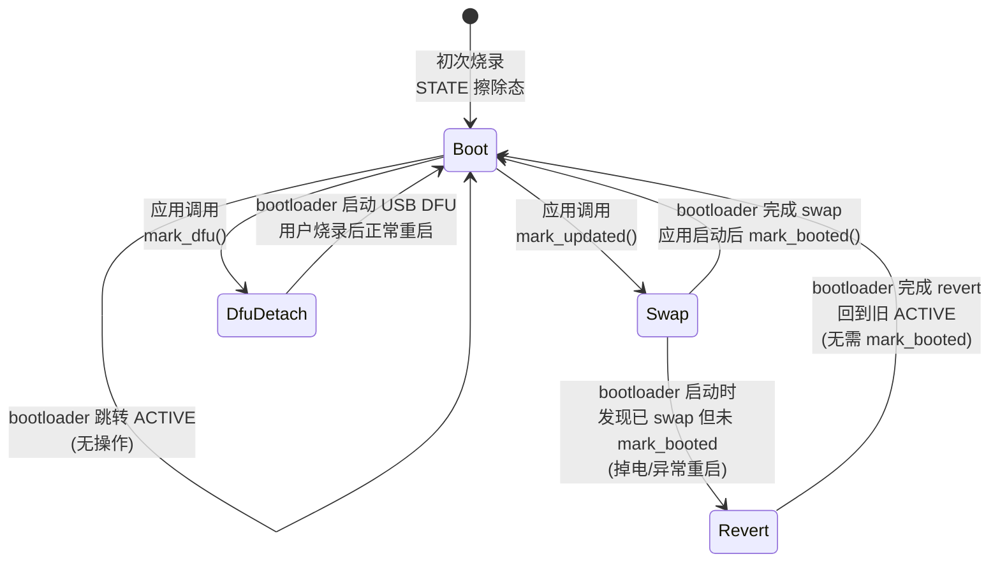
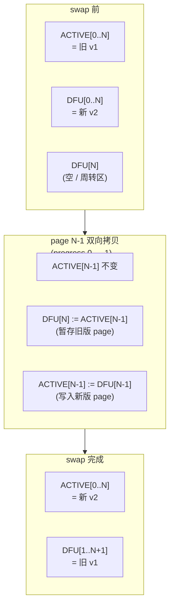
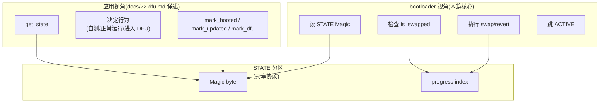

# 21 embassy-boot 启动引导

> 文档目标:系统性分析 `embassy-boot` 的启动引导框架,从核心架构、三分区设计、状态机协议、swap/revert 算法、链接器集成,到 STM32 / nRF / RP 三平台薄壳差异与 WatchdogFlash 设计。本篇聚焦"bootloader 二进制视角",应用侧的 `FirmwareUpdater` 在 docs/22-dfu.md 详述。

> 适用 Embassy 版本:基于当前 fork(2026-06-05 时点)
> 关键 crate:`embassy-boot`(核心)/ `embassy-boot-stm32` / `embassy-boot-nrf` / `embassy-boot-rp`(平台薄壳)
> 必需依赖:`embedded-storage::NorFlash` / `embedded-storage-async::NorFlash` / `cortex-m`
> 0 emoji,所有状态/标签用文字描述

---

## 1. 系统组件在 Embassy 中的位置

### 1.1 角色定位

`embassy-boot` 是 Embassy 的**官方 bootloader 框架**,职责是在芯片复位后、应用代码运行前完成"是否换装新固件"的决策与执行。它解决三个核心问题:

| 问题 | embassy-boot 答案 |
|------|-------------------|
| 复位后应该跳到哪个分区运行? | 读 STATE 分区 Magic → 决定 Boot / Swap / Revert / DfuDetach |
| 新固件下载后如何在不影响运行的前提下换装? | 三分区设计(ACTIVE / DFU / STATE) + page-by-page swap 算法 |
| 换装失败/掉电如何恢复? | progress index 断电续传 + revert 自动回滚到旧版本 |

它与应用层的协作通过 STATE 分区的 Magic 字节实现(本质上是一个"共享内存协议",但持久化在 flash 上)。整个 bootloader 是**纯 blocking** 设计,不需要 executor、time、interrupt 等运行时依赖,代码量极小(核心 ~500 行),便于审计与移植。

### 1.2 上下游关系



- **上游**:芯片硬件复位向量。在 STM32 / nRF / RP 上通常由 cortex-m-rt 的 `#[entry]` 进入 bootloader 的 `main`。
- **下游**:`FirmwareUpdater`(docs/22-dfu.md)— 应用侧的 API,用于写入新固件、标记升级、确认启动成功。
- **依赖**:`embedded-storage` 的 `NorFlash` trait(blocking)— 通过抽象屏蔽具体 flash 实现。
- **可选依赖**:`embassy-stm32::flash::Flash` / `embassy-nrf::nvmc::Nvmc` / `embassy-rp::flash::Flash`(平台薄壳直接使用)。
- **可选依赖**:`ed25519-dalek` / `salty`(签名验证,见 §8)。

### 1.3 不做什么

- **不**做 USB DFU class 的实现(仅识别 `DFU_DETACH_MAGIC` 进入 USB DFU 模式,USB 协议层在 `embassy-usb` 中)
- **不**做 OTA 通信(下载固件由应用层 OTA 模块负责,bootloader 只在 flash 已经有内容时换装)
- **不**做加密(签名验证是可选的;固件加密需要应用层自己处理)
- **不**做 secure boot(硬件 root of trust 由各芯片自有的 Secure Boot ROM 处理)
- **不**做 A/B 分区设计中"直接跳 B 不 swap"的"在线切换"(始终保持"运行代码在 ACTIVE",通过 swap 把新代码搬到 ACTIVE)

---

## 2. 核心类型与 trait 体系

### 2.1 类型总览

`embassy-boot` 的公共 API 集中在 5 个类型与 1 个 enum:

| 类型 | 位置 | 职责 |
|------|------|------|
| `BootLoader<ACTIVE, DFU, STATE>` | `boot_loader.rs:133` | 核心 bootloader 状态机,持有三分区句柄 |
| `BootLoaderConfig<ACTIVE, DFU, STATE>` | `boot_loader.rs:43` | bootloader 构造参数(三分区句柄) |
| `BootError` | `boot_loader.rs:12` | bootloader 错误 enum(Flash / BadMagic) |
| `State` | `lib.rs:41` | STATE 分区当前状态(Boot/Swap/Revert/DfuDetach) |
| `AlignedBuffer<N>` | `lib.rs:72` | 32 字节对齐缓冲区(满足各 flash WRITE_SIZE 对齐) |
| `FirmwareUpdater` / `FirmwareState` / 等 | `firmware_updater/*` | 应用侧 API,详见 docs/22-dfu.md |

三个泛型参数 `ACTIVE` / `DFU` / `STATE` 都需要实现 `embedded_storage::nor_flash::NorFlash`(blocking 版本)。这意味着三分区可以**位于不同的物理 flash**(例如 ACTIVE 在内部 flash、DFU 在外部 QSPI flash、STATE 在内部 flash 的另一区域),也可以**全部位于同一个 flash 的不同区域**(典型场景)。

### 2.2 BootLoader 类型签名

```rust
// embassy-boot/src/boot_loader.rs:132-145
pub struct BootLoader<ACTIVE: NorFlash, DFU: NorFlash, STATE: NorFlash> {
    active: ACTIVE,
    dfu: DFU,
    /// The state partition has the following format:
    /// All ranges are in multiples of WRITE_SIZE bytes.
    /// N = Active partition size divided by WRITE_SIZE.
    /// | Range              | Description
    /// | 0..1               | Magic indicating bootloader state. BOOT_MAGIC means boot, SWAP_MAGIC means swap.
    /// | 1..2               | Progress validity. ERASE_VALUE means valid, !ERASE_VALUE means invalid.
    /// | 2..(2 + 2N)        | Progress index used while swapping
    /// | (2 + 2N)..(2 + 4N) | Progress index used while reverting
    state: STATE,
}
```

注意 `state` 字段的字节级布局注释(`boot_loader.rs:136-144`)— 这是整个 bootloader 协议的"协议规格书",所有 swap/revert 算法都依赖这个布局。详见 §3.3。

### 2.3 BootLoaderConfig 与 from_linkerfile_blocking

```rust
// embassy-boot/src/boot_loader.rs:43-50
pub struct BootLoaderConfig<ACTIVE, DFU, STATE> {
    pub active: ACTIVE,
    pub dfu: DFU,
    pub state: STATE,
}
```

`BootLoaderConfig` 是个"傻"结构(只持有三个字段),作用是把"三分区参数"打包传给 `BootLoader::new`。真正的便利来自 `from_linkerfile_blocking` 关联函数(`boot_loader.rs:92-129`):它**自动读取 linker script 定义的 6 个符号**(`__bootloader_active_start/_end` 等)分割同一个底层 flash 句柄,得到三个互不重叠的 `BlockingPartition`。

详见 §5(链接器集成)。

### 2.4 State enum

```rust
// embassy-boot/src/lib.rs:38-50
#[derive(PartialEq, Eq, Debug)]
#[cfg_attr(feature = "defmt", derive(defmt::Format))]
pub enum State {
    /// Bootloader is ready to boot the active partition.
    Boot,
    /// Bootloader has swapped the active partition with the dfu partition and will attempt boot.
    Swap,
    /// Bootloader has reverted the active partition with the dfu partition and will attempt boot.
    Revert,
    /// Application has received a request to reboot into DFU mode to apply an update.
    DfuDetach,
}
```

四个状态从应用视角与 bootloader 视角各有不同的语义。从应用视角:

| State | 应用看到此值时该做什么 |
|------|------------------------|
| `Boot` | 一切正常,代码与上次启动一致,无需调用 `mark_booted` |
| `Swap` | bootloader 已成功 swap,这是首次以新固件运行,**必须**在通过自测后调用 `mark_booted` |
| `Revert` | bootloader 已 revert(说明上次 swap 后未及时 mark_booted),应用是旧版本 |
| `DfuDetach` | 极少见(USB DFU 流程中暂时态),通常应用看不到 |

### 2.5 BootError enum

```rust
// embassy-boot/src/boot_loader.rs:10-17
#[derive(PartialEq, Eq, Debug)]
pub enum BootError {
    /// Error from flash.
    Flash(NorFlashErrorKind),
    /// Invalid bootloader magic
    BadMagic,
}
```

仅两个变体。`Flash(NorFlashErrorKind)` 来自 `embedded-storage` 的标准错误码(`NotAligned` / `OutOfBounds` / `Other` 等);`BadMagic` 表示 STATE 分区 Magic 字节既不是 4 个已知值中的任何一个(实际上,从 `read_state` 实现看,任何"未识别的字节模式"都默认为 `State::Boot`,所以 `BadMagic` 当前未在 read_state 中产生 — 但保留以备将来检测损坏)。

`#[cfg(feature = "defmt")]` 块(`boot_loader.rs:19-30`)为 `BootError` 实现了 `defmt::Format`,在 RTT 日志中能直接打印。

### 2.6 AlignedBuffer

```rust
// embassy-boot/src/lib.rs:70-72
#[repr(align(32))]
pub struct AlignedBuffer<const N: usize>(pub [u8; N]);
```

为何 32 字节对齐?注释说"largest known alignment requirement for embassy-boot"。这是个**保守取值**:STM32H7 双 bank flash 的 `WRITE_SIZE` 是 32(单次写必须 32 字节对齐),STM32L4 是 8,STM32F4 是 1(字节),nRF 是 4,RP2040 是 256(写)/ 4096(擦除)。32 是 STM32H7 的实际值,也足够覆盖大多数 flash。

`AlignedBuffer` 实现了 `AsRef<[u8]>` / `AsMut<[u8]>`(`lib.rs:74-`),所以可直接传给需要 `&[u8]` / `&mut [u8]` 的 API。Bootloader 在 `BootLoader::prepare` 内部分配栈上 `AlignedBuffer<BUFFER_SIZE>`(`embassy-boot-stm32/src/lib.rs:37` / `embassy-boot-rp/src/lib.rs:42`),容量取 PAGE_SIZE。

---

## 3. 三分区设计 + State 状态机 + Magic 字节协议

### 3.1 三分区角色

| 分区 | 用途 | 内容 |
|------|------|------|
| **ACTIVE** | 当前运行的固件 | 完整可执行映像(.text + .rodata + .data 初始值等) |
| **DFU** | 待装入的新固件 | 由应用写入新版本(或 swap 暂存旧版本) |
| **STATE** | bootloader 协议状态 | Magic + progress index(见 §3.3) |

约束(`boot_loader.rs:155-158` BootLoader::new 文档与 `boot_loader.rs:431-435` assert_partitions):

```rust
// embassy-boot/src/boot_loader.rs:431-435
fn assert_partitions<ACTIVE: NorFlash, DFU: NorFlash, STATE: NorFlash>(
    active: &ACTIVE, dfu: &DFU, state: &STATE, page_size: u32,
) {
    assert_eq!(active.capacity() as u32 % page_size, 0);
    assert_eq!(dfu.capacity() as u32 % page_size, 0);
    // DFU partition has to be bigger than ACTIVE partition to handle swap algorithm
    assert!(dfu.capacity() as u32 - active.capacity() as u32 >= page_size);
    assert!(2 + 4 * (active.capacity() as u32 / page_size) <= state.capacity() as u32 / STATE::WRITE_SIZE as u32);
}
```

逐条解读:

| 约束 | 物理意义 |
|------|----------|
| `active.capacity() % page_size == 0` | ACTIVE 必须是 PAGE_SIZE 整数倍(swap 以 PAGE 为单位) |
| `dfu.capacity() % page_size == 0` | DFU 同上 |
| `dfu.capacity() - active.capacity() >= page_size` | DFU **至少**比 ACTIVE 多 1 PAGE(swap 需要 1 PAGE 周转空间,详见 §4.2) |
| `2 + 4 * N <= state.capacity() / WRITE_SIZE` | STATE 必须能容纳:1 (Magic) + 1 (progress validity) + 2N (swap progress) + 2N (revert progress) = 2+4N WORDS,其中 N = active.capacity() / WRITE_SIZE |

最后一条最容易踩坑。举例:若 ACTIVE = 128 KB、PAGE = 4 KB,N = 32;STATE 最小容量 = (2+4*32) * STATE::WRITE_SIZE = 130 WORDS。若 STATE::WRITE_SIZE = 4 字节,STATE 至少需要 520 字节。若 STATE::WRITE_SIZE = 32 字节(STM32H7),则需要 4160 字节(超过 1 个 sector,意味着 STATE 至少要占 1 个完整 erase sector)。

### 3.2 STATE 分区字节级布局

引用 `boot_loader.rs:136-144` 的注释(也是 `BootLoader` 结构体上的协议文档):

```
| Range              | Description
| 0..1               | Magic indicating bootloader state.
| 1..2               | Progress validity. ERASE_VALUE means valid, !ERASE_VALUE means invalid.
| 2..(2 + 2N)        | Progress index used while swapping
| (2 + 2N)..(2 + 4N) | Progress index used while reverting
```

注意所有范围**单位是 WRITE_SIZE 字节**,不是单字节。因此 STATE 的物理布局取决于具体 flash 的 WRITE_SIZE。下表以 WRITE_SIZE = 4(典型 STM32F4)、PAGE_SIZE = 1024、ACTIVE = 32 KB(N = 32 pages)为例:

| 字节范围 | 大小 | 含义 |
|----------|------|------|
| 0x000..0x004 | 4 B | Magic 字节(整 WORD 全部填充为 Magic 值,见 §3.4) |
| 0x004..0x008 | 4 B | Progress validity(全 0xFF = valid;全 0x00 = invalid) |
| 0x008..0x108 | 256 B (64 WORDS = 2N) | Swap progress index(每 WORD 标记 1 步进度) |
| 0x108..0x208 | 256 B (64 WORDS) | Revert progress index |

**为什么 progress 需要 2N WORDS 而不是 N?** 因为 swap 算法每个 page 有"先暂存到 DFU 下一 page、再 DFU 写回 active"两步(详见 §4.2),所以每个 ACTIVE page 占用 2 个 progress 槽位。Revert 同理:"先把坏的 active page 暂存到 DFU、再把好的 DFU page 写回 active",每 page 2 步。

### 3.3 Magic 字节常量

```rust
// embassy-boot/src/lib.rs:20-36
// The expected value of the flash after an erase
// TODO: Use the value provided by NorFlash when available
#[cfg(not(feature = "flash-erase-zero"))]
pub(crate) const STATE_ERASE_VALUE: u8 = 0xFF;
#[cfg(feature = "flash-erase-zero")]
pub(crate) const STATE_ERASE_VALUE: u8 = 0x00;

pub(crate) const REVERT_MAGIC: u8       = 0xC0;
pub(crate) const BOOT_MAGIC: u8         = 0xD0;
pub(crate) const SWAP_MAGIC: u8         = 0xF0;
pub(crate) const DFU_DETACH_MAGIC: u8   = 0xE0;
```

设计要点:

1. **5 个值,全部为单字节**:Magic 字节实际写入时填满整个 WRITE_SIZE WORD(`set_magic` 实现 `firmware_updater/asynch.rs:336-368`)。读时检查"WORD 内每个字节是否都等于该 Magic"(`read_state` 实现 `boot_loader.rs:289-302`)。这种设计能容忍部分 flash 的"写时位翻转"(读到的某几位错乱,仍能正确识别 Magic)。
2. **`STATE_ERASE_VALUE` feature gating**:大多数 NorFlash 擦除后为 0xFF(NOR 通过电荷写"1"),少数为 0x00(某些 NAND 或特殊 flash);通过 `flash-erase-zero` feature 切换。
3. **Magic 值选择**(0xC0/0xD0/0xE0/0xF0):**避开** 0xFF 与 0x00(避开擦除态混淆),且 4 个值相隔 0x10(便于 RTT 日志一眼区分,但 bootloader 内部用相等比较,无位运算依赖)。

### 3.4 State 状态机



每个状态的 read 路径(`boot_loader.rs:289-302`):

```rust
pub fn read_state(&mut self, aligned_buf: &mut [u8]) -> Result<State, BootError> {
    let state_word = &mut aligned_buf[..STATE::WRITE_SIZE];
    self.state.read(0, state_word)?;

    if !state_word.iter().any(|&b| b != SWAP_MAGIC) {
        Ok(State::Swap)
    } else if !state_word.iter().any(|&b| b != DFU_DETACH_MAGIC) {
        Ok(State::DfuDetach)
    } else if !state_word.iter().any(|&b| b != REVERT_MAGIC) {
        Ok(State::Revert)
    } else {
        Ok(State::Boot)
    }
}
```

注意:**`Boot` 是默认值(fallthrough)**,任何"非 SWAP/DFU_DETACH/REVERT" 的 Magic(包括擦除态 0xFF)都识别为 Boot。这是个设计权衡:首次烧录后 STATE 是擦除态,bootloader 不需要任何"初始化 Magic"步骤就能正常工作。

### 3.5 完整 prepare_boot 决策表

`prepare_boot` 是 bootloader 的入口(`boot_loader.rs:239-286`):

```rust
pub fn prepare_boot(&mut self, aligned_buf: &mut [u8]) -> Result<State, BootError> {
    // ... const & runtime assertions ...
    assert_partitions(&self.active, &self.dfu, &self.state, Self::PAGE_SIZE);

    // Copy contents from partition N to active
    let state = self.read_state(aligned_buf)?;
    if state == State::Swap {
        // Check if we already swapped. If we're in the swap state, this means we should revert
        // since the app has failed to mark boot as successful
        if !self.is_swapped(aligned_buf)? {
            trace!("Swapping");
            self.swap(aligned_buf)?;
            trace!("Swapping done");
        } else {
            trace!("Reverting");
            self.revert(aligned_buf)?;
            // ... reset progress and set REVERT_MAGIC ...
        }
    }
    Ok(state)
}
```

决策表(`prepare_boot` 内部分支):

| 读到的 State | is_swapped? | 动作 | 返回 State |
|--------------|-------------|------|------------|
| `Boot` | (不检查) | 直接返回 | `Boot` |
| `Swap` | `false`(progress < 2N) | 执行 `swap()` | `Swap` |
| `Swap` | `true`(progress >= 2N) | 执行 `revert()` + 写 REVERT_MAGIC | `Swap`(注:此处返回值是初始读到的,新写 REVERT_MAGIC 在下次启动才生效) |
| `Revert` | (不检查) | 直接返回(已经 reverted,等待应用启动) | `Revert` |
| `DfuDetach` | (不检查) | 直接返回(交给平台 bootloader 处理 USB DFU) | `DfuDetach` |

注意第 3 行:`prepare_boot` **本次**返回 `State::Swap`,但 STATE 分区已经被改写为 `REVERT_MAGIC`,下次启动会看到 `Revert`。这是个微妙的语义:返回值反映"本次 bootloader 看到的状态",而 STATE 持久化的是"为下次启动准备的状态"。

---

## 4. swap / revert 算法详解

### 4.1 page 双向拷贝模式

整个 swap / revert 都基于一个原子操作:**copy_page_once_to_X**(`boot_loader.rs:340-382`)。它对当前 progress 做"幂等检查",如果该 page 已经拷贝过(progress_index 已记录)则跳过,否则执行 erase + page-by-page copy + 更新 progress。

```rust
// embassy-boot/src/boot_loader.rs:340-360
fn copy_page_once_to_active(
    &mut self, progress_index: usize, from_offset: u32, to_offset: u32, aligned_buf: &mut [u8],
) -> Result<(), BootError> {
    if self.current_progress(aligned_buf)? <= progress_index {
        let page_size = Self::PAGE_SIZE as u32;
        self.active.erase(to_offset, to_offset + page_size)?;
        for offset_in_page in (0..page_size).step_by(aligned_buf.len()) {
            self.dfu.read(from_offset + offset_in_page as u32, aligned_buf)?;
            self.active.write(to_offset + offset_in_page as u32, aligned_buf)?;
        }
        self.update_progress(progress_index, aligned_buf)?;
    }
    Ok(())
}
```

关键设计点:

1. **`current_progress(aligned_buf)? <= progress_index` 守卫**:断电恢复的核心。掉电再启动后,`current_progress` 返回的是"最后一次写过的 progress 槽位 + 1"(即下一个待执行步骤),所有 progress_index 小于此值的 page 都跳过。
2. **内层循环 `step_by(aligned_buf.len())`**:`aligned_buf` 通常是 `AlignedBuffer<PAGE_SIZE>`,但也可以更小;每次循环读一段,写一段,逐块覆盖整个 PAGE。
3. **erase 在 read 之前**:flash NOR 必须先擦除才能写。先 erase 整个 page,再分块写。
4. **update_progress 在最后**:确保"只有该 page 完全拷贝完成后才标记进度",掉电时该 page 处于不完整状态会在下次重做(因为 progress 未更新)。

### 4.2 swap 算法

```rust
// embassy-boot/src/boot_loader.rs:384-403
fn swap(&mut self, aligned_buf: &mut [u8]) -> Result<(), BootError> {
    let page_count = self.active.capacity() as u32 / Self::PAGE_SIZE;
    for page_num in 0..page_count {
        let progress_index = (page_num * 2) as usize;

        // Copy active page to the 'next' DFU page.
        let active_from_offset = (page_count - 1 - page_num) * Self::PAGE_SIZE;
        let dfu_to_offset = (page_count - page_num) * Self::PAGE_SIZE;
        self.copy_page_once_to_dfu(progress_index, active_from_offset, dfu_to_offset, aligned_buf)?;

        // Copy DFU page to the active page
        let active_to_offset = (page_count - 1 - page_num) * Self::PAGE_SIZE;
        let dfu_from_offset = (page_count - 1 - page_num) * Self::PAGE_SIZE;
        self.copy_page_once_to_active(progress_index + 1, dfu_from_offset, active_to_offset, aligned_buf)?;
    }
    Ok(())
}
```

理解关键:**从最后一个 page 向第一个 page 反向遍历**(`page_num` 从 0 到 page_count-1,但 `active_from_offset = (page_count - 1 - page_num)`),且 active page N 暂存到 DFU 的 **N+1** 位置(注意 `dfu_to_offset = (page_count - page_num) * PAGE_SIZE`,比 `active_from_offset` 多 1 个 PAGE)。

这就是"DFU 必须至少比 ACTIVE 多 1 PAGE"的物理来源:DFU 最后一个有效 page(index = page_count)用作"周转 page",存放当前正在 swap 的 active page 副本。



更直观的对照表(摘自 `boot_loader.rs:213-237` 注释,4 个 page 的例子,WRITE_SIZE=1):

```
swap 各步对应的 ACTIVE / DFU 内容(4 个 page,page 名字 1-4 是新版,A-C 是旧版):

| Stage     | progress |    ACTIVE     |     DFU      |
|           |  index   |  3   2   1    |  4   3   2   1 |
|-----------|----------|---------------|----------------|
| Initial   |    0     | _A_  _B_  _C_ | _-_  _1_  _2_  _3_ |
| Copy to N |    1     | _A_  _B_  _C_ | _A_  _1_  _2_  _3_ |
| Copy 1    |    2     | _A_  _B_  _1_ | _A_  _1_  _2_  _3_ |
| Copy to N |    3     | _A_  _B_  _1_ | _A_  _B_  _2_  _3_ |
| Copy 2    |    4     | _A_  _2_  _1_ | _A_  _B_  _2_  _3_ |
...
```

(完整表见 `boot_loader.rs:184-238` 的注释,展示了 swap、revert 两个完整流程的 progress 推进。)

### 4.3 revert 算法

```rust
// embassy-boot/src/boot_loader.rs:405-422
fn revert(&mut self, aligned_buf: &mut [u8]) -> Result<(), BootError> {
    let page_count = self.active.capacity() as u32 / Self::PAGE_SIZE;
    for page_num in 0..page_count {
        let progress_index = (page_count * 2 + page_num * 2) as usize;

        // Copy the bad active page to the DFU page
        let active_from_offset = page_num * Self::PAGE_SIZE;
        let dfu_to_offset = page_num * Self::PAGE_SIZE;
        self.copy_page_once_to_dfu(progress_index, active_from_offset, dfu_to_offset, aligned_buf)?;

        // Copy the DFU page back to the active page
        let active_to_offset = page_num * Self::PAGE_SIZE;
        let dfu_from_offset = (page_num + 1) * Self::PAGE_SIZE;
        self.copy_page_once_to_active(progress_index + 1, dfu_from_offset, active_to_offset, aligned_buf)?;
    }
    Ok(())
}
```

revert 与 swap 的差异:

| 差异点 | swap | revert |
|--------|------|--------|
| 遍历方向 | 反向(page N-1 → 0) | 正向(page 0 → N-1) |
| progress_index 起点 | 0(占用 swap 区) | 2N(占用 revert 区) |
| dfu 目标偏移 | (page_count - page_num) * PAGE_SIZE | page_num * PAGE_SIZE |
| dfu 源偏移 | (page_count - 1 - page_num) * PAGE_SIZE | (page_num + 1) * PAGE_SIZE |

revert 的语义:把 DFU 中"swap 时暂存的旧 active page"(从 page_num=1..N 位置)写回 active,把"新 active 但未通过自测的 page"(在 active[0..N])暂存到 DFU 头部(用作下次诊断或丢弃)。注意 revert 完成后 DFU 内容是"乱的"(0 是新版坏 page、1..N 是旧版),应用如果想再 swap 需要重新下载固件。

### 4.4 is_swapped 检测

```rust
// embassy-boot/src/boot_loader.rs:304-309
fn is_swapped(&mut self, aligned_buf: &mut [u8]) -> Result<bool, BootError> {
    let page_count = self.active.capacity() / Self::PAGE_SIZE as usize;
    let progress = self.current_progress(aligned_buf)?;
    Ok(progress >= page_count * 2)
}
```

逻辑:swap 完成时,progress 应该走到 `page_count * 2`(每个 page 两步,总共 2N 步)。如果 bootloader 读到 SWAP_MAGIC 且 `progress >= 2N`,说明上次 swap **已经完成**,但应用还是把状态留在 SWAP(意味着没调用 mark_booted)— 这种情况触发 revert。

如果 `progress < 2N`,说明上次 swap 中途掉电,需要继续 swap(从 progress 处恢复)。

### 4.5 current_progress 与断电续传

```rust
// embassy-boot/src/boot_loader.rs:311-330
fn current_progress(&mut self, aligned_buf: &mut [u8]) -> Result<usize, BootError> {
    let write_size = STATE::WRITE_SIZE as u32;
    let max_index = ((self.state.capacity() - STATE::WRITE_SIZE) / STATE::WRITE_SIZE) - 2;
    let state_word = &mut aligned_buf[..write_size as usize];

    self.state.read(write_size, state_word)?;
    if state_word.iter().any(|&b| b != STATE_ERASE_VALUE) {
        // Progress is invalid
        return Ok(max_index);
    }

    for index in 0..max_index {
        self.state.read((2 + index) as u32 * write_size, state_word)?;
        if state_word.iter().any(|&b| b == STATE_ERASE_VALUE) {
            return Ok(index);
        }
    }
    Ok(max_index)
}
```

算法:

1. 先读 progress validity word(offset = WRITE_SIZE,即第 1 个 WORD)。如果该 WORD 不是擦除态(`STATE_ERASE_VALUE`),说明 progress 被人为标记为无效,直接返回 `max_index`(意味着"假装走完了所有步骤",触发后续逻辑全部跳过)。
2. 否则从 index = 0 开始读 progress 槽位(offset = (2 + index) * WRITE_SIZE)。第一个**仍为擦除态**的槽位 index 就是当前 progress(表示"该步骤未执行")。如果全部都已写过,返回 `max_index`。

`update_progress`(`boot_loader.rs:332-338`)与之对应:把第 index 个槽位填满 `!STATE_ERASE_VALUE`(即 0x00 或 0xFF 的反值),表示该步已完成。

为什么不用一个递增计数器?**因为 flash 写入是"只能 1→0"(NOR)**,递增计数器无法在不擦除整个 STATE 的前提下推进。逐个 WORD 填充才是 flash 友好的设计。

---

## 5. 链接器集成

### 5.1 from_linkerfile_blocking 实现

```rust
// embassy-boot/src/boot_loader.rs:92-129
pub fn from_linkerfile_blocking(
    active_flash: &'a Mutex<NoopRawMutex, RefCell<ACTIVE>>,
    dfu_flash: &'a Mutex<NoopRawMutex, RefCell<DFU>>,
    state_flash: &'a Mutex<NoopRawMutex, RefCell<STATE>>,
) -> Self {
    unsafe extern "C" {
        static __bootloader_state_start: u32;
        static __bootloader_state_end: u32;
        static __bootloader_active_start: u32;
        static __bootloader_active_end: u32;
        static __bootloader_dfu_start: u32;
        static __bootloader_dfu_end: u32;
    }

    let active = unsafe {
        let start = &__bootloader_active_start as *const u32 as u32;
        let end = &__bootloader_active_end as *const u32 as u32;
        BlockingPartition::new(active_flash, start, end - start)
    };
    // ... dfu, state 同理 ...
    Self { active, dfu, state }
}
```

要点:

1. **6 个 `extern "C"` 符号**(start/end × 3 分区)。这些符号**没有内存**,只有"地址值"— 它们是 linker script 里的 `SYMBOL = address` 声明,取地址即得到该地址数字。
2. **同一个 flash 句柄传 3 次**:`active_flash` / `dfu_flash` / `state_flash` 都是 `&Mutex<NoopRawMutex, RefCell<ACTIVE>>`(注意是同一类型 `ACTIVE`,如果三分区在同一 flash 上,泛型 ACTIVE = DFU = STATE,可以传同一个引用)。`BlockingPartition::new` 内部锁定该 Mutex 完成 read/write/erase,通过 RefCell 实现内部可变性。
3. **`unsafe` 块**:取 extern symbol 地址本身不算 unsafe(只是 raw 转换);整个 `unsafe` 主要为了未来兼容性。

### 5.2 典型 memory.x 配置

下面是一个 STM32F7 单 flash 三分区的 memory.x 示例(综合 `examples/boot/bootloader/stm32` 与社区惯例):

```ld
MEMORY
{
    /* Original FLASH layout */
    FLASH       : ORIGIN = 0x08000000, LENGTH = 1M
    RAM         : ORIGIN = 0x20000000, LENGTH = 256K
    /* (bootloader-specific subdivisions below) */

    /* Bootloader 自身代码 + STATE + ACTIVE + DFU */
    BOOTLOADER  : ORIGIN = 0x08000000, LENGTH = 64K
    STATE       : ORIGIN = 0x08010000, LENGTH = 4K     /* 1 sector */
    ACTIVE      : ORIGIN = 0x08020000, LENGTH = 256K
    DFU         : ORIGIN = 0x08060000, LENGTH = 260K   /* 至少 ACTIVE + 1 page */
}

__bootloader_state_start  = ORIGIN(STATE);
__bootloader_state_end    = ORIGIN(STATE)  + LENGTH(STATE);
__bootloader_active_start = ORIGIN(ACTIVE);
__bootloader_active_end   = ORIGIN(ACTIVE) + LENGTH(ACTIVE);
__bootloader_dfu_start    = ORIGIN(DFU);
__bootloader_dfu_end      = ORIGIN(DFU)    + LENGTH(DFU);
```

应用侧的 memory.x 需要把自身代码烧到 ACTIVE 起始(否则 bootloader 跳过去什么也没有):

```ld
MEMORY
{
    FLASH (rx) : ORIGIN = 0x08020000, LENGTH = 256K
    RAM (rwx)  : ORIGIN = 0x20000000, LENGTH = 256K
}

__bootloader_state_start  = 0x08010000;
__bootloader_state_end    = 0x08011000;
__bootloader_dfu_start    = 0x08060000;
__bootloader_dfu_end      = 0x080A5000;
```

注意应用侧不需要 `__bootloader_active_start/_end`(应用是 ACTIVE 本身,不需要自己分区)。但需要 STATE / DFU 符号,因为 `FirmwareUpdaterConfig::from_linkerfile` 需要它们。

### 5.3 同 flash vs 多 flash 部署

| 部署形态 | 优点 | 缺点 |
|----------|------|------|
| **单 flash 三分区**(典型) | 硬件简单,成本低 | swap 期间应用代码不能运行(因为正在改写自己的 flash);要求 bootloader 把整个 swap 跑完 |
| **ACTIVE 内部 + DFU 外部 QSPI** | swap 可由应用并发(理论上),外部 flash 容量大 | 多一颗 flash 芯片,bootloader 需要支持外部 flash 驱动 |
| **三 flash 全分离** | 极致解耦 | 实际很少见,成本不划算 |

embassy-boot 的泛型设计允许任意组合(三个 `NorFlash` 类型参数互相独立)。`from_linkerfile_blocking` 假设"三分区都在同一 flash 上"(同一 `Mutex<RefCell<ACTIVE>>`),如果要多 flash 部署,需要手动构造 `BootLoaderConfig { active, dfu, state }`(不通过 helper)。

---

## 6. 错误处理

### 6.1 BootError 全集

仅两个变体(`boot_loader.rs:10-17`):

| 变体 | 触发场景 | 恢复策略 |
|------|----------|----------|
| `Flash(NorFlashErrorKind)` | 任何 read/write/erase 失败 | 平台特定;通常 hard fault 或重启 |
| `BadMagic` | 当前未使用(read_state fallback 为 Boot)| (理论上)说明 STATE 被损坏,重新烧录 |

`NorFlashErrorKind` 来自 `embedded_storage::nor_flash`,具体值:

- `NotAligned` — 写或擦除地址未对齐到 WRITE_SIZE / ERASE_SIZE(通常表示分区配置错误)
- `OutOfBounds` — 地址超出 flash 容量(通常表示链接器符号配置错误)
- `Other` — 平台特定错误(锁定、电压不足等)

### 6.2 三平台薄壳的错误传播

三个平台薄壳 `embassy-boot-{stm32,nrf,rp}` 都提供 `prepare` / `try_prepare` 两个 API:

```rust
// embassy-boot-stm32/src/lib.rs:20-41
pub fn prepare<ACTIVE: NorFlash, DFU: NorFlash, STATE: NorFlash, const BUFFER_SIZE: usize>(
    config: BootLoaderConfig<ACTIVE, DFU, STATE>,
) -> Self {
    if let Ok(loader) = Self::try_prepare::<ACTIVE, DFU, STATE, BUFFER_SIZE>(config) {
        loader
    } else {
        // Use explicit panic instead of .expect() to ensure this gets routed via defmt/etc. properly
        panic!("Boot prepare error")
    }
}

pub fn try_prepare<ACTIVE: NorFlash, DFU: NorFlash, STATE: NorFlash, const BUFFER_SIZE: usize>(
    config: BootLoaderConfig<ACTIVE, DFU, STATE>,
) -> Result<Self, BootError> {
    let mut aligned_buf = AlignedBuffer([0; BUFFER_SIZE]);
    let mut boot = embassy_boot::BootLoader::new(config);
    let state = boot.prepare_boot(aligned_buf.as_mut())?;
    Ok(Self { state })
}
```

`prepare` 是"出错就 panic"的便利版本(适合"反正出错也没救"的场景),`try_prepare` 返回 `Result`(适合需要诊断的场景,比如 hard fault 后通过 RTT 报告)。注释里特意说明"用 explicit panic 而非 .expect() 以确保 defmt 路由正确",这是个细节:`.expect()` 会用 `panic_handler` 默认路径,可能不走 defmt;直接 `panic!()` 能保证 defmt::panic 接管。

### 6.3 编译期断言

`prepare_boot` 用 `const {}` 块在**编译期**验证 PAGE_SIZE 与各分区 WRITE_SIZE / ERASE_SIZE 的对齐关系:

```rust
// embassy-boot/src/boot_loader.rs:240-245
const {
    core::assert!(Self::PAGE_SIZE % ACTIVE::WRITE_SIZE as u32 == 0);
    core::assert!(Self::PAGE_SIZE % ACTIVE::ERASE_SIZE as u32 == 0);
    core::assert!(Self::PAGE_SIZE % DFU::WRITE_SIZE as u32 == 0);
    core::assert!(Self::PAGE_SIZE % DFU::ERASE_SIZE as u32 == 0);
}
```

这意味着如果 BUFFER_SIZE(= PAGE_SIZE)与某个 NorFlash 的对齐不匹配,**编译就会失败**,不需要等到运行时。配合运行期的 `assert_partitions`(`boot_loader.rs:425-436`)能覆盖所有分区配置错误。

---

## 7. 平台差异(STM32 / nRF / RP 三薄壳)

### 7.1 STM32 薄壳 — 最简

```rust
// embassy-boot-stm32/src/lib.rs:13-58
pub struct BootLoader {
    pub state: State,
}

impl BootLoader {
    pub fn prepare<ACTIVE, DFU, STATE, const BUFFER_SIZE: usize>(
        config: BootLoaderConfig<ACTIVE, DFU, STATE>,
    ) -> Self { /* ... 见 §6.2 ... */ }

    pub fn try_prepare<...>(/* ... */) -> Result<Self, BootError> { /* ... */ }

    pub unsafe fn load(self, start: u32) -> ! {
        trace!("Loading app at 0x{:x}", start);
        #[allow(unused_mut)]
        let mut p = cortex_m::Peripherals::steal();
        #[cfg(not(armv6m))]
        p.SCB.invalidate_icache();
        p.SCB.vtor.write(start);
        cortex_m::asm::bootload(start as *const u32)
    }
}
```

总共 7 个 symbol,核心逻辑全部委托给 `embassy-boot::BootLoader`。`load` 函数做三件事:

1. `SCB.invalidate_icache()`(Cortex-M7 等有 I-Cache 的核心需要,M0/M0+ 跳过)
2. `SCB.vtor.write(start)` — 把中断向量表基址改到 ACTIVE 起始(应用的中断向量在 ACTIVE 起始)
3. `cortex_m::asm::bootload(start as *const u32)` — Cortex-M 标准启动序列:从 start 读 4 字节作 MSP,从 start+4 读 4 字节作 reset vector,跳过去

### 7.2 nRF 薄壳 — softdevice 支持

```rust
// embassy-boot-nrf/src/lib.rs:15-106
pub struct BootLoader<const BUFFER_SIZE: usize = PAGE_SIZE>;

impl<const BUFFER_SIZE: usize> BootLoader<BUFFER_SIZE> {
    pub fn prepare<...>(/* ... */) -> Self { /* ... */ }
    pub fn try_prepare<...>(/* ... */) -> Result<Self, BootError> { /* ... */ }

    /// Boots the application without softdevice mechanisms.
    #[cfg(not(feature = "softdevice"))]
    pub unsafe fn load(self, start: u32) -> ! {
        let mut p = cortex_m::Peripherals::steal();
        p.SCB.invalidate_icache();
        p.SCB.vtor.write(start);
        cortex_m::asm::bootload(start as *const u32)
    }

    /// Boots the application assuming softdevice is present.
    #[cfg(feature = "softdevice")]
    pub unsafe fn load(self, _app: u32) -> ! {
        use nrf_softdevice_mbr as mbr;
        const NRF_SUCCESS: u32 = 0;

        // Address of softdevice which we'll forward interrupts to
        let addr = 0x1000;
        let mut cmd = mbr::sd_mbr_command_t { /* ... */ };
        let ret = mbr::sd_mbr_command(&mut cmd);
        assert_eq!(ret, NRF_SUCCESS);

        let msp = *(addr as *const u32);
        let rv = *((addr + 4) as *const u32);

        // 内联汇编修改 CONTROL 寄存器、ISB、设置 MSP、跳转 RV
        core::arch::asm!(/* ... */);
    }
}
```

核心差异:有 `softdevice` feature 时,`load` 不直接跳 ACTIVE,而是:

1. 调用 nRF SoftDevice MBR 命令 `SD_MBR_COMMAND_IRQ_FORWARD_ADDRESS_SET`,告知 MBR(Master Boot Record)"把中断转发到 ACTIVE 起始"
2. 从 SoftDevice 起始地址(0x1000)读 MSP 和 reset vector
3. 用内联汇编修改 CONTROL 寄存器(把 SPSEL 位清零,使用 MSP),ISB 同步,跳转 SoftDevice reset

为什么这样?**SoftDevice 是 Nordic 的私有蓝牙协议栈二进制 blob**,占用 flash 起始 ~150 KB,应用需要让 SoftDevice 先初始化、再让 SoftDevice 调用应用代码。所以 bootloader 在加载应用时实际上是"启动 SoftDevice、SoftDevice 内部会跳到应用 reset vector"。

### 7.3 RP 薄壳 — WatchdogFlash

```rust
// embassy-boot-rp/src/lib.rs:18-63
pub struct BootLoader<const BUFFER_SIZE: usize = ERASE_SIZE> {
    pub state: State,
}

impl<const BUFFER_SIZE: usize> BootLoader<BUFFER_SIZE> {
    pub fn prepare<...>(/* ... */) -> Self { /* ... */ }
    pub fn try_prepare<...>(/* ... */) -> Result<Self, BootError> { /* ... */ }

    pub unsafe fn load(self, start: u32) -> ! {
        trace!("Loading app at 0x{:x}", start);
        #[allow(unused_mut)]
        let mut p = cortex_m::Peripherals::steal();
        #[cfg(not(armv6m))]
        p.SCB.invalidate_icache();
        p.SCB.vtor.write(start);
        cortex_m::asm::bootload(start as *const u32)
    }
}
```

`load` 与 STM32 基本一致(都跳 ACTIVE 入口)。RP 薄壳的真正特色是 **WatchdogFlash**:

```rust
// embassy-boot-rp/src/lib.rs:65-107
pub struct WatchdogFlash<'d, const SIZE: usize> {
    flash: Flash<'d, FLASH, Blocking, SIZE>,
    watchdog: Watchdog,
    timeout: Duration,
}

impl<'d, const SIZE: usize> WatchdogFlash<'d, SIZE> {
    pub fn start(flash: Peri<'static, FLASH>, watchdog: Peri<'static, WATCHDOG>, timeout: Duration) -> Self {
        let flash = Flash::<_, Blocking, SIZE>::new_blocking(flash);
        let mut watchdog = Watchdog::new(watchdog);
        watchdog.start(timeout);
        Self { flash, watchdog, timeout }
    }
}

impl<'d, const SIZE: usize> NorFlash for WatchdogFlash<'d, SIZE> {
    fn erase(&mut self, from: u32, to: u32) -> Result<(), Self::Error> {
        self.watchdog.feed(self.timeout);
        self.flash.blocking_erase(from, to)
    }
    fn write(&mut self, offset: u32, data: &[u8]) -> Result<(), Self::Error> {
        self.watchdog.feed(self.timeout);
        self.flash.blocking_write(offset, data)
    }
}
```

设计意图:**swap 整个 ACTIVE 分区可能耗时数秒到数十秒**,在此期间应用代码完全不运行,任何独立的"看门狗 feed task"都不会执行。如果 bootloader 启动前就已经启动了 watchdog,bootloader 跑 swap 时 watchdog 会超时复位,造成永久 boot loop。

`WatchdogFlash` 把 watchdog feed 嵌入到每次 flash erase/write,确保"每次磁盘操作前都重置 watchdog 计时"。这种设计无需 bootloader 关心 watchdog 周期,直接把它当 `NorFlash` 用即可。

nRF 平台也有 `WatchdogFlash`(`embassy-boot-nrf/src/lib.rs:108-158`),设计完全一致(差别仅在 `pet()` 而非 `feed()`,对应 nRF 的 watchdog API)。

### 7.4 平台对比矩阵

| 维度 | STM32(最薄) | nRF | RP2040 / RP235x |
|------|--------------|-----|------------------|
| crate symbols 数 | 7 | 19 | (核心约) 11 + WatchdogFlash |
| 默认 BUFFER_SIZE | 必须显式指定 | `PAGE_SIZE`(4 KB) | `ERASE_SIZE`(4 KB) |
| 是否支持 softdevice | 否 | 是(feature flag) | 否 |
| WatchdogFlash 提供 | 否(用户自行集成) | 是 | 是 |
| load 实现差异 | SCB.VTOR + bootload | softdevice:汇编跳转;无 softdevice:同 STM32 | 同 STM32 |
| 链接器宏 | 无内置(用户写 memory.x) | 无内置(用户写 memory.x) | `build.rs` 生成 |
| 典型 bootloader 大小 | ~32 KB | ~32 KB(含 softdevice 部分) | ~48 KB |
| 适用核 | M0+/M3/M4/M7/M33 | M4 | M0+(RP2040)/ M33(RP235x) |
| 特殊处理 | I-cache invalidate(非 M0+) | softdevice IRQ forwarding | watchdog 内嵌 NorFlash |

---

## 8. 与子系统协作 + 性能资源

### 8.1 与 embassy-embedded-hal 的关系

`BootLoaderConfig::from_linkerfile_blocking` 返回的 `BlockingPartition` 来自 **embassy-embedded-hal**(`embassy-embedded-hal/src/flash/partition/blocking.rs:16`)。它是一个 wrapper,在底层 NorFlash 上"虚拟"出一个限定地址范围的子 flash:

- read(offset, buf):底层 read 在 `partition_start + offset` 处
- write(offset, data):底层 write 同上,且自动检查 `offset + data.len() <= partition_size`
- erase(from, to):底层 erase 同上,且自动检查范围

如果三分区都在同一 flash 上,`from_linkerfile_blocking` 接收 3 个引用都指向同一个 `Mutex<RefCell<Flash>>`,3 个 `BlockingPartition` 通过锁定该 Mutex 来串行化访问(防止 swap 中途某线程读 active 撞上 write)。在 bootloader 上下文中只有单线程(裸跑,无 executor),这个 Mutex 实际不会争用,但保留了"未来多线程访问"的可能。

### 8.2 与 digest_adapters 的关系

bootloader 本身**不调用** digest_adapters。签名验证发生在应用侧(`FirmwareUpdater::verify_and_mark_updated`,详见 docs/22-dfu.md),签名通过后才 mark_updated。bootloader 看到 SWAP_MAGIC 时已经默认"应用层已验证"。

digest_adapters 目录(`embassy-boot/src/digest_adapters/`):

| 文件 | 后端 | 适用场景 |
|------|------|----------|
| `ed25519_dalek.rs` | `ed25519-dalek` crate | 标准 std-friendly,性能优 |
| `salty.rs` | `salty` crate | no_std,代码量小,适合资源紧张场景 |
| `mod.rs` | trait 抽象 | 二选一 feature flag |

详见 docs/22-dfu.md §7。

### 8.3 性能资源

**代码量**(approx):

| 模块 | 大小 |
|------|------|
| `embassy-boot::boot_loader` | ~6 KB(armv7em release,含内联) |
| `embassy-boot::firmware_updater` | ~4 KB |
| `embassy-boot-stm32` 薄壳 | ~1 KB |
| 总 bootloader 二进制(含 cortex-m-rt + panic) | ~10-32 KB |

**RAM**:bootloader 只需 PAGE_SIZE 字节的栈上 AlignedBuffer(2 KB-4 KB 典型)。无堆,无静态分配。

**Flash 寿命**:swap 一次需要 erase + write 整个 ACTIVE 分区(N pages),加上 STATE 的 progress 写入(2N 个 WORD)。STATE 分区的 erase 在 mark_updated/mark_booted 时发生(每次状态切换 1 次)。

典型 NOR flash 单 sector 寿命 = 10 万次。若每天 OTA 升级 1 次,STATE 分区可承受 ~270 年(单 sector)、ACTIVE/DFU 可承受 ~270 年(同样)。实际无须担心 flash 寿命。

**swap 时长**:取决于 flash 性能。STM32F4 1 MB flash 完整 swap 约 ~3 秒;RP2040 内部 flash 约 ~10 秒(包括 watchdog feed 开销)。这是"看门狗必须嵌入 flash 操作"的根本原因。

### 8.4 与 cortex-m 的关系

`cortex_m::asm::bootload(start as *const u32)`(用于 `load`)是 cortex-m crate 提供的标准启动序列:

```text
// 等效伪代码
let msp = *(start as *const u32);
let reset_vector = *((start + 4) as *const u32);
__msp_set(msp);
jump_to(reset_vector);
```

它确保新固件能像独立程序一样启动(MSP 来自 ACTIVE 的中断向量表第 0 项,reset vector 来自第 1 项)。整个跳转不返回,所以 `load` 是 `-> !`。

`cortex_m::Peripherals::steal()` 是 unsafe 接口:bootloader 在此前可能已经初始化过 peripherals(通过 `embassy_stm32::init()`),`steal()` 强制再次获取(不检查"已经被取走"标记)。这是 bootloader 场景的合法用法,因为 bootloader 即将跳走,后续不再使用 peripherals。

---

## 9. 性能与资源(已并入 §8)

(此节内容并入 §8,本节保留作为目录标记。)

---

## 10. 实战示例 — 完整 bootloader main + 应用 OTA

### 10.1 STM32 bootloader main(基于 examples/boot/bootloader/stm32)

```rust
// examples/boot/bootloader/stm32/src/main.rs 全文(53 行)
#![no_std]
#![no_main]

use core::cell::RefCell;

use cortex_m_rt::{entry, exception};
#[cfg(feature = "defmt")]
use defmt_rtt as _;
use embassy_boot_stm32::*;
use embassy_stm32::flash::{BANK1_REGION, Flash};
use embassy_sync::blocking_mutex::Mutex;

#[entry]
fn main() -> ! {
    let p = embassy_stm32::init(Default::default());

    // Uncomment this if you are debugging the bootloader with debugger/RTT attached,
    // as it prevents a hard fault when accessing flash 'too early' after boot.
    /*
        for i in 0..10000000 {
            cortex_m::asm::nop();
        }
    */

    let layout = Flash::new_blocking(p.FLASH).into_blocking_regions();
    let flash = Mutex::new(RefCell::new(layout.bank1_region));

    let config = BootLoaderConfig::from_linkerfile_blocking(&flash, &flash, &flash);
    let active_offset = config.active.offset();
    let bl = BootLoader::prepare::<_, _, _, 2048>(config);

    unsafe { bl.load(BANK1_REGION.base() + active_offset) }
}

#[unsafe(no_mangle)]
#[cfg_attr(target_os = "none", unsafe(link_section = ".HardFault.user"))]
unsafe extern "C" fn HardFault() {
    cortex_m::peripheral::SCB::sys_reset();
}

#[exception]
unsafe fn DefaultHandler(_: i16) -> ! {
    const SCB_ICSR: *const u32 = 0xE000_ED04 as *const u32;
    let irqn = unsafe { core::ptr::read_volatile(SCB_ICSR) } as u8 as i16 - 16;
    panic!("DefaultHandler #{:?}", irqn);
}

#[panic_handler]
fn panic(_info: &core::panic::PanicInfo) -> ! {
    cortex_m::asm::udf();
}
```

逐行解读:

| 行 | 含义 |
|----|------|
| 5-11 | 引入依赖:`RefCell`(内部可变性)、`cortex-m-rt`(裸 entry)、`embassy_boot_stm32`(平台薄壳)、`Flash`(STM32 flash 驱动)、`Mutex`(blocking 同步原语) |
| 13 | `#[entry]` 标记 main 为 cortex-m-rt 入口(裸 fn,不用 async) |
| 15 | 标准 embassy-stm32 初始化(注意:bootloader 不依赖 executor,仅用来配置时钟/外设) |
| 17-22 | (调试用)开机延时,避免调试器在 flash 还未稳定时访问 |
| 25-26 | 用 `Flash::new_blocking + into_blocking_regions` 把整个 flash 切成 region(bank1_region 包含全部内置 flash 地址),包成 `Mutex<RefCell<Region>>` 以满足 `from_linkerfile_blocking` 的签名 |
| 28 | 用 linker 符号自动分三区(三个 `&flash` 都指向同一 Mutex,因为三分区都在同一物理 flash) |
| 29 | 记录 active 分区在 flash 内的偏移(用于 §32 跳转) |
| 30 | 执行 prepare(BUFFER_SIZE=2048,即 PAGE_SIZE) |
| 32 | 跳到 ACTIVE 起始(BANK1_REGION.base() + active_offset = 绝对地址) |
| 35-39 | HardFault 处理:发生硬件错误时直接复位(避免死锁) |
| 41-47 | 未处理中断 → panic(开发时打印 IRQ 号便于诊断) |
| 49-52 | panic 处理:执行 UDF 指令(undefined instruction → hard fault → reset 循环) |

### 10.2 RP2040 bootloader main(基于 examples/boot/bootloader/rp)

RP 平台的 bootloader main 与 STM32 类似,关键差异是用 `WatchdogFlash` 包装 flash:

```rust
// 简化版,基于 examples/boot/bootloader/rp/src/main.rs
#![no_std]
#![no_main]

use embassy_boot_rp::*;
use embassy_rp::flash::Flash;
use embassy_time::Duration;

#[cortex_m_rt::entry]
fn main() -> ! {
    let p = embassy_rp::init(Default::default());

    // 用 WatchdogFlash 包装 flash,8 秒 watchdog 超时
    let flash = WatchdogFlash::<2_097_152>::start(p.FLASH, p.WATCHDOG, Duration::from_secs(8));
    let flash = core::cell::RefCell::new(flash);
    let flash = embassy_sync::blocking_mutex::Mutex::new(flash);

    let config = BootLoaderConfig::from_linkerfile_blocking(&flash, &flash, &flash);
    let active_offset = config.active.offset();
    let bl: BootLoader = BootLoader::prepare(config);

    unsafe { bl.load(0x10000000 + active_offset) }
}
```

关键差异:

1. **WatchdogFlash 包装**:这是 RP 平台必需的(没有它会被 watchdog 复位)
2. **flash 基址 0x10000000**:RP2040 flash 在 XIP(eXecute In Place)地址空间起始
3. **`BootLoader::prepare` 不需要 BUFFER_SIZE turbofish**:默认 BUFFER_SIZE = ERASE_SIZE = 4 KB

### 10.3 应用侧 OTA 示例(基于 examples/boot/application/stm32f7)

```rust
// examples/boot/application/stm32f7/src/bin/a.rs 全文(55 行)
#![no_std]
#![no_main]

use core::cell::RefCell;

#[cfg(feature = "defmt")]
use defmt_rtt::*;
use embassy_boot_stm32::{AlignedBuffer, BlockingFirmwareUpdater, FirmwareUpdaterConfig};
use embassy_executor::Spawner;
use embassy_stm32::exti::{self, ExtiInput};
use embassy_stm32::flash::{Flash, WRITE_SIZE};
use embassy_stm32::gpio::{Level, Output, Pull, Speed};
use embassy_stm32::{bind_interrupts, interrupt};
use embassy_sync::blocking_mutex::Mutex;
use embedded_storage::nor_flash::NorFlash;
use panic_reset as _;

#[cfg(feature = "skip-include")]
static APP_B: &[u8] = &[0, 1, 2, 3];
#[cfg(not(feature = "skip-include"))]
static APP_B: &[u8] = include_bytes!("../../b.bin");

bind_interrupts!(
    pub struct Irqs{
        EXTI15_10 => exti::InterruptHandler<interrupt::typelevel::EXTI15_10>;
});

#[embassy_executor::main]
async fn main(_spawner: Spawner) {
    let p = embassy_stm32::init(Default::default());
    let flash = Flash::new_blocking(p.FLASH);
    let flash = Mutex::new(RefCell::new(flash));

    let mut button = ExtiInput::new(p.PC13, p.EXTI13, Pull::Down, Irqs);

    let mut led = Output::new(p.PB7, Level::Low, Speed::Low);
    led.set_high();

    let config = FirmwareUpdaterConfig::from_linkerfile_blocking(&flash, &flash);
    let mut magic = AlignedBuffer([0; WRITE_SIZE]);
    let mut updater = BlockingFirmwareUpdater::new(config, &mut magic.0);
    let writer = updater.prepare_update().unwrap();
    button.wait_for_rising_edge().await;
    let mut offset = 0;
    let mut buf = AlignedBuffer([0; 4096]);
    for chunk in APP_B.chunks(4096) {
        buf.as_mut()[..chunk.len()].copy_from_slice(chunk);
        writer.write(offset, buf.as_ref()).unwrap();
        offset += chunk.len() as u32;
    }
    updater.mark_updated().unwrap();
    led.set_low();
    cortex_m::peripheral::SCB::sys_reset();
}
```

行为解读:

1. 初始化 Flash → 包成 Mutex<RefCell<Flash>>
2. 初始化按钮(PC13)、LED(PB7,亮)
3. 用 `FirmwareUpdaterConfig::from_linkerfile_blocking` 拿到 dfu/state 分区(注意只用 2 个参数,因为应用侧不需要 active 分区句柄)
4. 创建 `BlockingFirmwareUpdater`,带 `magic` aligned buffer
5. **`prepare_update().unwrap()`**:这是关键 — 一次性 erase 整个 DFU 区,返回一个 `&mut DFU` 可直接 write(优化路径,适合"我已经拿到完整新固件、要尽快写入"的场景)
6. 等待按钮按下
7. 把内嵌的 `APP_B`(下一版本 b.bin)按 4 KB 块写到 DFU
8. `updater.mark_updated()` 写 SWAP_MAGIC 到 STATE
9. LED 灭、复位 → bootloader 接管,执行 swap,新版本启动

详细的 `FirmwareUpdater` API 与 `prepare_update` vs `write_firmware` 的对比见 docs/22-dfu.md。

---

## 11. 踩坑与最佳实践

### 11.1 PAGE_SIZE 与 BUFFER_SIZE 的关系

**坑**:`BootLoader::prepare::<_, _, _, BUFFER_SIZE>` 的 BUFFER_SIZE 实际上就是 PAGE_SIZE(swap 算法的"单位"),它必须满足 ACTIVE/DFU 的 WRITE_SIZE 与 ERASE_SIZE 同时整除。

**最常见的错配**:STM32H7 的 flash WRITE_SIZE=32, ERASE_SIZE=131072(128 KB);如果你按 STM32F4 习惯设 BUFFER_SIZE=2048,会编译失败:
```
error: const evaluation failed: assertion `Self::PAGE_SIZE % ACTIVE::ERASE_SIZE as u32 == 0` failed
```
**解决**:STM32H7 必须设 BUFFER_SIZE=131072(每个 ERASE sector 当作一个 PAGE),代价是 swap 慢且 STATE 分区需要更大(每个 page 占 2 个 progress 槽位,RAM 也需要 131072 字节 aligned buffer)。

### 11.2 DFU 至少比 ACTIVE 大 1 PAGE

**坑**:linker script 中 DFU 设置成与 ACTIVE 一样大,运行时 panic:
```
panicked at 'assertion failed: dfu.capacity() as u32 - active.capacity() as u32 >= page_size'
```
**原因**:swap 算法需要"DFU 第 N+1 个 page"作周转区(详见 §4.2)。
**解决**:DFU 必须 = ACTIVE + 至少 1 PAGE_SIZE。典型推荐 DFU = ACTIVE + 1 个 ERASE sector(便于 linker script 对齐 sector 边界)。

### 11.3 STATE 容量不足

**坑**:STATE 只给了 1 个 WORD,但 ACTIVE 有几十个 page,运行时 panic:
```
panicked at 'assertion failed: 2 + 4 * (active.capacity() as u32 / page_size) <= state.capacity() as u32 / STATE::WRITE_SIZE as u32'
```
**原因**:STATE 需要 `(2 + 4N) * WRITE_SIZE` 字节,N = ACTIVE / PAGE。
**解决**:STATE 至少分配 1 个完整 ERASE sector,典型 4 KB 足够大多数场景(N=32 时只用 130 WORDS = 520 字节)。

### 11.4 应用忘记 mark_booted → 死循环 revert

**坑**:应用启动后从未调用 `mark_booted`,每次启动 bootloader 都看到 SWAP_MAGIC 且 is_swapped=true → revert → 应用启动 → 仍未 mark_booted → ... 永远在 revert 与 swap 之间循环(实际上是 revert 单方向,但每次启动都执行一次完整 revert,消耗 flash 寿命且启动慢)。
**解决**:`#[embassy_executor::main]` 的最前面就调用 `mark_booted`(放在自测前),如果担心自测失败可以**先 mark_booted 然后立即用 watchdog 兜底**(自测崩溃 → watchdog 复位 → bootloader 看到 BOOT_MAGIC → 启动,不再 revert);更稳的方式是"自测通过后才 mark_booted",代价是首次启动后必须挂着 watchdog,自测一直通过到调用 mark_booted 才安全。

### 11.5 调试器连接时 bootloader hard fault

**坑**:用 probe-rs 连接调试 bootloader,开机后立即 hard fault(在访问 flash 时)。
**原因**:某些 STM32 在调试器连接时,flash controller 未稳定,过早访问导致 fault。
**解决**:bootloader main 开头加几百万次 nop(`examples/boot/bootloader/stm32/src/main.rs:19-23` 注释里就有现成代码)。Release 模式可注释掉(实际部署时 flash 已经稳定)。

### 11.6 nRF softdevice 加载失败

**坑**:启用 `softdevice` feature 后 `bl.load(addr)` 内的 `assert_eq!(ret, NRF_SUCCESS)` 失败。
**原因**:nRF SoftDevice 未正确烧录到 0x1000 起始,或 MBR 未在 0x0000 起始。
**解决**:按 Nordic 官方 flash layout(MBR 0x0000-0x1000、SoftDevice 0x1000-0x27000、bootloader 0x77000、应用 ACTIVE 0x27000-0x77000)烧录三段二进制,使用 `nrfutil` 或 `probe-rs` 分别烧录。

### 11.7 WatchdogFlash timeout 设置不当

**坑**:RP 平台 WatchdogFlash 设了 1 秒 timeout,swap 时第 2 个 page 还没写完就复位。
**原因**:RP2040 内部 flash 的一次 erase + write(4 KB)可能耗时数百毫秒;1 秒 timeout 余量不够。
**解决**:WatchdogFlash timeout 设 8 秒以上(`examples/boot/bootloader/rp/src/main.rs` 推荐值)。

### 11.8 flash 在 swap 期间被中断访问

**坑**:bootloader 跑 swap 时,某中断 handler(比如调试器的某些后门)访问 flash,出现读到不一致数据。
**原因**:bootloader 默认假设单线程,但调试器可能 inject。
**解决**:bootloader main 开头 `cortex_m::interrupt::disable()` 全程关中断(bootloader 本身不需要中断,跳转应用前 reset 中断状态)。

---

## 12. 平台对比表 + 总结

### 12.1 三平台薄壳对比(10 维)

| 维度 | embassy-boot-stm32 | embassy-boot-nrf | embassy-boot-rp |
|------|--------------------|------------------|------------------|
| **核心 symbols 数** | 7 | 19 | 11 + WatchdogFlash |
| **默认 BUFFER_SIZE** | 必须显式(turbofish) | `PAGE_SIZE`(4 KB) | `ERASE_SIZE`(4 KB) |
| **softdevice 支持** | 否 | 是(`softdevice` feature) | 否 |
| **WatchdogFlash 内建** | 否(用户自行集成) | 是 | 是 |
| **load 路径** | SCB.VTOR + bootload | softdevice:汇编 IRQ forward;无:同 STM32 | 同 STM32(armv6m 跳过 I-cache invalidate) |
| **链接器自动化** | 用户手写 memory.x | 用户手写 memory.x | `build.rs` 生成 |
| **支持 Cortex 核** | M0+/M3/M4/M7/M33 | M4 | M0+(RP2040)/ M33(RP235x) |
| **典型 bootloader 大小** | ~10-32 KB | ~32 KB(含 softdevice 接口) | ~16-48 KB |
| **flash 速度参考** | F4 中速 / H7 慢(大 sector)/ L4 快 | nRF52840 中速 | RP2040 慢(XIP + SSI 控制器) |
| **特殊处理** | I-cache invalidate(非 M0+) | SD MBR IRQ forwarding | watchdog 内嵌 NorFlash |

### 12.2 三个状态机的关键事实



bootloader 与应用通过 STATE 分区的 Magic + progress 协议异步通信。bootloader 是"被动决策者":它**不**在意应用做什么,只看 STATE 当前内容决定下一步动作。应用是"主动控制者":它通过写 Magic 影响下次启动行为。这种解耦是 embassy-boot 简洁的根源。

### 12.3 何时不要用 embassy-boot

| 场景 | 不适合的原因 | 替代 |
|------|--------------|------|
| **secure boot 需求** | embassy-boot 不做 root of trust(没有硬件信任根、不验证 bootloader 自身) | 各芯片自有 secure boot ROM(STM32 的 RDP / nRF 的 ACL 等) |
| **A/B 双 active 同时运行** | embassy-boot 始终把"运行的代码"在 ACTIVE,必须 swap 才能切版本 | 自行实现"双 active + reset vector 切换"(实际很少需求) |
| **flash 寿命极致优化场景** | swap 一次擦写整个 ACTIVE,频繁 OTA 会限制 flash 寿命 | 用 XIP 的"块切换 bootloader"(更复杂)或直接增量打补丁(罕见) |
| **不能 reset 设备的场景** | bootloader 必须在 reset 后运行,无法在线 swap | 用 RAM bootloader(把新固件载入 RAM 运行)或 OTA 升级到 reserved 分区运行 |

### 12.4 总结

embassy-boot 是一个**协议简洁、实现紧凑、跨平台一致**的 bootloader 框架。它的核心设计可以浓缩为 5 个事实:

1. **三分区 + STATE Magic 协议**:bootloader 与应用通过 STATE 分区的字节模式异步通信,无需运行时同步。
2. **page-level 幂等 swap**:每个 page 双向拷贝,通过 progress index 实现断电续传。
3. **DFU 至少比 ACTIVE 大 1 PAGE**:周转区是 swap 算法的物理要求。
4. **state 容量 = (2 + 4N) * WRITE_SIZE**:可由 ACTIVE 容量与 flash WRITE_SIZE 直接计算。
5. **平台薄壳极小**:核心 ~500 行,平台薄壳只做"flash 包装 + load 跳转",STM32/nRF/RP 三平台总差异 < 200 行。

下一篇 docs/22-dfu.md 详述应用侧的 `FirmwareUpdater` API,包括 async/blocking 双 API、签名验证、prepare_update 优化、与 USB DFU 集成等,与本篇形成"bootloader 二进制 + 应用二进制"的完整闭环。

低功耗设计(docs/23-low-power.md)与 bootloader 无直接关系(bootloader 在 reset 后短暂运行,不涉及睡眠唤醒),但应用层的 OTA 通常需要兼顾低功耗(下载固件时尽量休眠等数据)。
