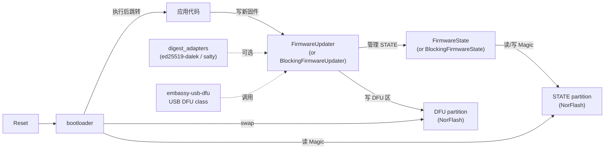
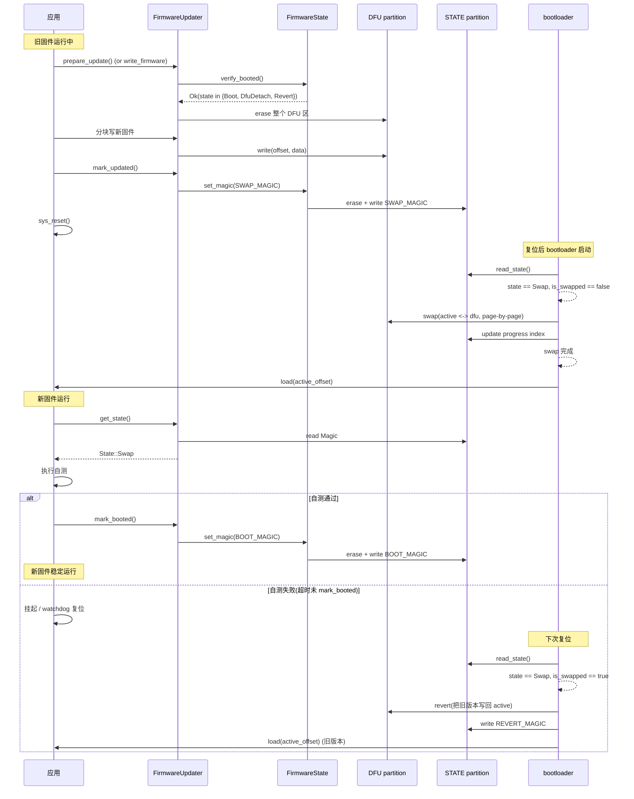
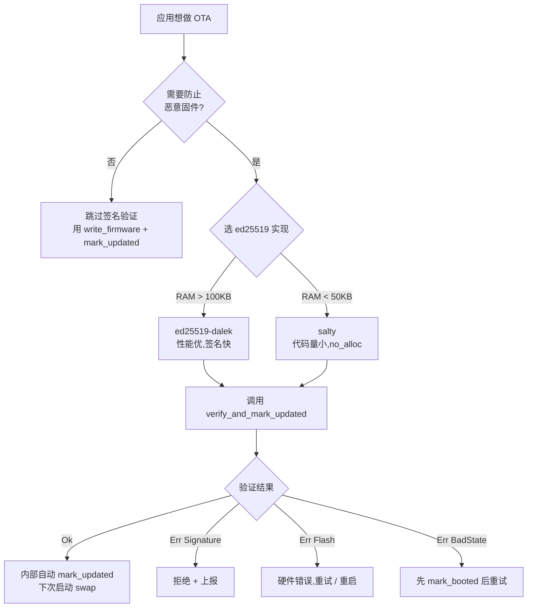
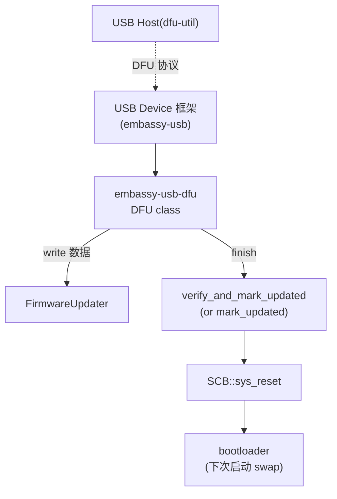

# 22 embassy-boot FirmwareUpdater 与 DFU 机制

> 文档目标:从应用二进制视角系统性分析 `FirmwareUpdater` 的设计与使用。覆盖 async/blocking 双 API 对称、完整 OTA 状态机、签名验证、写入优化(`prepare_update` vs `write_firmware`、sector 去重)、与 USB DFU class 的集成。bootloader 二进制侧的 swap/revert 算法见 docs/21-boot.md。

> 适用 Embassy 版本:基于当前 fork(2026-06-05 时点)
> 关键 crate:`embassy-boot`(`firmware_updater` 模块) / `embassy-usb-dfu`(USB DFU class)
> 可选依赖:`ed25519-dalek` / `salty`(签名验证 feature 二选一)
> 0 emoji,所有状态/标签用文字描述

---

## 1. 系统组件在 Embassy 中的位置

### 1.1 应用视角与 bootloader 视角的分工

| 视角 | 二进制 | 关注点 | 主要 API |
|------|--------|--------|----------|
| **bootloader** | 独立 bootloader 二进制 | flash 分区分割、swap/revert 算法、复位决策 | `BootLoader` / `prepare_boot` / `load` |
| **应用**(本篇) | 用户应用二进制 | 写入新固件、标记状态、签名验证、确认启动成功 | `FirmwareUpdater` / `FirmwareState` |

两者通过 **STATE 分区 + Magic 字节协议**异步通信(协议规格见 docs/21-boot.md §3)。应用只能写 Magic / 读 State / 写 DFU 区,**不可**直接操作 ACTIVE / STATE 的 progress 部分(避免 mess up bootloader)。这种约束由 `FirmwareUpdater` 的公共 API 保证(没有暴露 active 分区,也没有暴露 progress 操作)。

### 1.2 模块结构



- **核心**:`FirmwareUpdater` 持有 `DFU` flash 句柄 + `FirmwareState`,后者持有 `STATE` flash 句柄。
- **对偶**:`BlockingFirmwareUpdater` + `BlockingFirmwareState`,API 与 async 版本几乎对称(详见 §5)。
- **可选**:
  - 签名验证 — `digest_adapters` 与 `verify_and_mark_updated` 方法(`ed25519-dalek` 或 `salty` 二选一,feature flag)
  - USB DFU class — `embassy-usb-dfu` crate(USB device 实现,调用 `FirmwareUpdater` 写 firmware + mark_updated)

### 1.3 不做什么

- **不**做 OTA 通信:固件下发由应用层负责(可用 TCP/UDP/MQTT/HTTPS/CoAP 等任意通道,或 USB DFU)
- **不**做加密:固件加密/解密由应用层完成(`write_firmware` 只是把字节写到 flash)
- **不**做 secure boot:bootloader 自身的完整性由芯片硬件 root of trust 保障
- **不**做 incremental patch(增量补丁):每次升级都写完整新固件
- **不**管 ACTIVE 分区:bootloader 在 swap 时操作 ACTIVE,应用永远看不到 ACTIVE 句柄

---

## 2. 核心类型与 trait 体系

### 2.1 类型总览

| 类型 | 位置 | 职责 |
|------|------|------|
| `FirmwareUpdater<'d, DFU, STATE>` | `firmware_updater/asynch.rs:13` | async 版本主 API,持有 DFU + FirmwareState |
| `BlockingFirmwareUpdater<'d, DFU, STATE>` | `firmware_updater/blocking.rs:13` | blocking 版本,与 async 对称 |
| `FirmwareState<'d, STATE>` | `firmware_updater/asynch.rs:274` | 独立的 STATE 管理器,可单独使用 |
| `BlockingFirmwareState<'d, STATE>` | `firmware_updater/blocking.rs:309` | blocking 版 STATE 管理器 |
| `FirmwareUpdaterConfig<DFU, STATE>` | `firmware_updater/mod.rs:13` | 构造参数,持有 2 个分区(无 active!) |
| `FirmwareUpdaterError` | `firmware_updater/mod.rs:22` | 错误 enum(Flash / Signature / BadState) |

### 2.2 与 BootLoader 的类型差异

注意:`FirmwareUpdater` 只有 **2 个泛型参数**(DFU + STATE),而 `BootLoader` 有 **3 个**(ACTIVE + DFU + STATE)。这反映了应用与 bootloader 的能力差异:

| 能力 | BootLoader | FirmwareUpdater |
|------|------------|-----------------|
| 持有 ACTIVE 分区句柄 | 是 | **否** |
| 执行 swap/revert | 是 | 否(由 bootloader 在下次启动时完成) |
| 写 STATE Magic | 间接(prepare_boot 内部) | 是(mark_updated / mark_booted / mark_dfu) |
| 写 STATE progress | 是 | 否(应用无权访问 progress 字段) |
| 写 DFU 数据 | 否(只读;swap 时写) | 是(主要工作) |

### 2.3 FirmwareUpdaterConfig 与 from_linkerfile

```rust
// embassy-boot/src/firmware_updater/mod.rs:13-18
pub struct FirmwareUpdaterConfig<DFU, STATE> {
    /// The dfu flash partition
    pub dfu: DFU,
    /// The state flash partition
    pub state: STATE,
}
```

`from_linkerfile` 与 `from_linkerfile_blocking` 类似 BootLoader 的同名 helper,通过 linker 符号自动获取 DFU/STATE 分区句柄(注意应用侧不需要 `__bootloader_active_start/_end`):

```rust
// embassy-boot/src/firmware_updater/asynch.rs:24-51
pub fn from_linkerfile(
    dfu_flash: &'a embassy_sync::mutex::Mutex<NoopRawMutex, DFU>,
    state_flash: &'a embassy_sync::mutex::Mutex<NoopRawMutex, STATE>,
) -> Self {
    unsafe extern "C" {
        static __bootloader_state_start: u32;
        static __bootloader_state_end: u32;
        static __bootloader_dfu_start: u32;
        static __bootloader_dfu_end: u32;
    }
    // ... 分别构造 dfu/state Partition ...
    Self { dfu, state }
}
```

注意 `_blocking` 版本用 `embassy_sync::blocking_mutex::Mutex<NoopRawMutex, RefCell<DFU>>`(带 RefCell),非 blocking 版本用 `embassy_sync::mutex::Mutex<NoopRawMutex, DFU>`(直接持有);两者的 mutex 类型不同(blocking_mutex vs 异步 mutex),内部可变性来源也不同。

### 2.4 FirmwareUpdaterError

```rust
// embassy-boot/src/firmware_updater/mod.rs:20-29
#[derive(Debug)]
pub enum FirmwareUpdaterError {
    /// Error from flash.
    Flash(NorFlashErrorKind),
    /// Signature errors.
    Signature(signature::Error),
    /// Bad state.
    BadState,
}

impl<E> From<E> for FirmwareUpdaterError
where
    E: NorFlashError,
{
    fn from(error: E) -> Self {
        FirmwareUpdaterError::Flash(error.kind())
    }
}
```

三个变体的语义:

| 变体 | 触发场景 |
|------|----------|
| `Flash(NorFlashErrorKind)` | 任意 read/write/erase 失败(对齐错误、超界、硬件故障) |
| `Signature(signature::Error)` | `verify_and_mark_updated` 中签名验证失败(public_key 解析、signature 解析、验证不通过) |
| `BadState` | `verify_booted` 检测到当前不是已启动的合法状态(详见 §6) |

通过 blanket impl `From<E: NorFlashError>`,所有 flash 操作可以用 `?` 直接传播错误,无需手动转换。

### 2.5 与 STATE 共享的协议

`FirmwareUpdater` 与 BootLoader **共用同一个 STATE 分区**(物理位置 + 字节布局完全一致,见 docs/21-boot.md §3.2)。应用侧能读写的部分:

| STATE 字段 | bootloader 操作 | 应用操作(via FirmwareState/FirmwareUpdater) |
|------------|----------------|---------------------------------------------|
| Magic byte(offset 0) | read / write(swap 完成时写 SWAP→BOOT,revert 完成时写 REVERT) | read(get_state)/ write(mark_updated, mark_booted, mark_dfu) |
| Progress validity(offset WRITE_SIZE) | read / write(标记无效) | write(set_magic 内部,触发 erase 前先写无效) |
| Progress index(offset 2*WRITE_SIZE..) | read / write(执行 swap/revert 时记录进度) | 仅 erase(set_magic 内部,通过 erase 整个 STATE 清空) |

**应用不会直接访问 progress 字段**:应用通过 `set_magic` 间接 erase 整个 STATE 分区(将所有 progress 槽位归零/全 0xFF),不是逐 slot 操作。这种粗粒度操作的代价是每次 mark_* 都要 erase + write,但避免了应用 mess up progress 的可能性。

---

## 3. FirmwareUpdater / FirmwareState 分离与构造

### 3.1 为什么分离?

`FirmwareUpdater` 负责"写 DFU 数据 + 调用 FirmwareState 改 STATE",`FirmwareState` 负责"读写 STATE Magic + 校验当前状态合法性"。分离的好处:

1. **细粒度控制**:某些场景应用只需要查询/修改 STATE(比如周期性检查"是否处于 Revert 后等待诊断状态"),不需要写 DFU,可以单独构造 `FirmwareState`。
2. **测试便利**:`FirmwareState` 可以单独 mock STATE 分区做单元测试,不需要构造完整 DFU。
3. **资源复用**:`FirmwareUpdater::new(config, aligned)` 把 aligned buffer 传给 FirmwareState,FirmwareUpdater 不持有 aligned buffer(节省一份内存)。

### 3.2 FirmwareUpdater::new

```rust
// embassy-boot/src/firmware_updater/asynch.rs:54-62
impl<'d, DFU: NorFlash, STATE: NorFlash> FirmwareUpdater<'d, DFU, STATE> {
    /// Create a firmware updater instance with partition ranges for the update and state partitions.
    pub fn new(config: FirmwareUpdaterConfig<DFU, STATE>, aligned: &'d mut [u8]) -> Self {
        Self {
            dfu: config.dfu,
            state: FirmwareState::new(config.state, aligned),
            last_erased_dfu_sector_index: None,
        }
    }
}
```

三个字段:

| 字段 | 类型 | 用途 |
|------|------|------|
| `dfu` | `DFU: NorFlash` | DFU 分区句柄 |
| `state` | `FirmwareState<'d, STATE>` | STATE 管理器(持有 STATE flash + aligned buffer) |
| `last_erased_dfu_sector_index` | `Option<usize>` | sector 去重缓存(详见 §8) |

`aligned` 缓冲区**必须**满足:
- 大小 = `STATE::WRITE_SIZE`(或更大,但通常正好取 WRITE_SIZE)
- 对齐:满足 STATE flash 的对齐要求(用 `AlignedBuffer<N>` 包装)

如果 STATE::READ_SIZE > 2 * STATE::WRITE_SIZE,`set_magic` 内部会用 `aligned.rotate_left(STATE::WRITE_SIZE)`(详见 §5.4 双 API 微妙差异),所以 aligned 大小要至少 READ_SIZE。

### 3.3 FirmwareState::new

```rust
// embassy-boot/src/firmware_updater/asynch.rs:286-299
impl<'d, STATE: NorFlash> FirmwareState<'d, STATE> {
    pub fn from_config<DFU: NorFlash>(config: FirmwareUpdaterConfig<DFU, STATE>, aligned: &'d mut [u8]) -> Self {
        Self::new(config.state, aligned)
    }

    pub fn new(state: STATE, aligned: &'d mut [u8]) -> Self {
        assert_eq!(aligned.len(), STATE::WRITE_SIZE.max(STATE::READ_SIZE));
        Self { state, aligned }
    }
}
```

`assert_eq!(aligned.len(), STATE::WRITE_SIZE.max(STATE::READ_SIZE))` 是运行时断言,要求 aligned 大小**精确等于** WRITE_SIZE 与 READ_SIZE 的较大者。这看起来严格,实际上避免了"用户传太大 buffer 导致逻辑错误"(set_magic 用 `&self.aligned[..STATE::WRITE_SIZE]` 截取 WRITE_SIZE,如果 aligned 过大会丢弃多余部分;过小会 panic)。

### 3.4 从 BootLoader 视角看应用何时能写

bootloader 在跳转应用前调用 `prepare_boot` 返回 State。应用启动后用 `get_state` 看到的状态由 bootloader 上次决策结果决定:

| bootloader prepare_boot 返回 | 应用 get_state 看到 | 应用应做的事 |
|------------------------------|---------------------|--------------|
| `Boot`(BOOT_MAGIC,或擦除态) | `Boot` | 正常运行,无需 mark_booted |
| `Swap`(swap 已完成,BOOT_MAGIC 未写) | `Swap` | **必须**通过自测后调用 `mark_booted`(否则下次会被 revert) |
| `Revert`(revert 已完成) | `Revert` | 你是旧版本,可以记录"上次升级失败"诊断信息 |
| `DfuDetach`(罕见) | `DfuDetach` | 通常应用看不到(bootloader 已转 USB DFU 入口) |

应用何时能调用 `write_firmware` / `mark_updated`?见 §6 verify_booted。

### 3.5 FirmwareState 独立使用场景

`FirmwareState` 可以脱离 `FirmwareUpdater` 单独使用,适合"只查询状态、不想持有 DFU 句柄"的场景。典型用例:

**场景 1:轻量诊断任务**

```rust
// 只读取状态,不需要 DFU 分区
let state_partition = /* 仅 STATE 分区 */;
let mut aligned = AlignedBuffer([0u8; WRITE_SIZE]);
let mut fs = FirmwareState::new(state_partition, &mut aligned.0);
let state = fs.get_state().await?;
if state == State::Revert {
    log_diagnostic("Last upgrade failed");
}
```

**场景 2:多任务架构,STATE 与 DFU 分离访问**

```rust
// Task A: 仅监控 STATE 状态(每秒检查)
async fn state_monitor(fs: &mut FirmwareState<'_, State>) {
    loop {
        let state = fs.get_state().await.unwrap();
        update_display(state);
        Timer::after_secs(1).await;
    }
}

// Task B: 偶尔做 OTA(需要完整 FirmwareUpdater)
async fn ota_task(updater: &mut FirmwareUpdater<'_, Dfu, State>) {
    // ...
}
```

这种分离要求两个 task 共享同一个 STATE 分区句柄(通过 Mutex 包装),代码复杂度提升,实际项目较少使用。**大多数应用直接用 FirmwareUpdater 即可**,FirmwareState 通常作为内部实现细节。

**场景 3:测试与 mock**

`FirmwareState` 只依赖 `NorFlash` trait,可以传入 mock 实现(`embassy-boot/src/mem_flash.rs` 提供的 `MemFlash` 类型)做单元测试:

```rust
#[cfg(test)]
fn test_mark_booted() {
    let state_mem = MemFlash::<4096, 4, 4>::new(0xFF);
    let mut aligned = [0u8; 4];
    let mut fs = BlockingFirmwareState::new(state_mem, &mut aligned);
    fs.mark_booted().unwrap();
    assert_eq!(fs.get_state().unwrap(), State::Boot);
}
```

embassy-boot 自身的 `firmware_updater/asynch.rs:371-` 测试模块就用了这种模式。

---

## 4. 完整 OTA 状态机

### 4.1 OTA 完整流程时序图



### 4.2 关键决策点

| 决策点 | 触发条件 | 后果 |
|--------|----------|------|
| **bootloader 看到 Swap 但未 swapped** | reset 后 STATE 是 SWAP_MAGIC,progress < 2N | 执行 swap |
| **bootloader 看到 Swap 且已 swapped** | reset 后 STATE 是 SWAP_MAGIC,progress >= 2N | 执行 revert(应用未及时 mark_booted) |
| **应用看到 Swap** | get_state 返回 Swap | 必须自测,通过后 mark_booted |
| **应用看到 Revert** | get_state 返回 Revert | 旧版本,可记录"上次升级失败" |
| **应用看到 Boot** | get_state 返回 Boot | 正常,无需 mark_booted |

注意 "**ed mark_booted**" 的时机:**应用启动后越早 mark_booted 越安全**,但越早 mark_booted 也意味着"自测还没做就锁定了新版本"。两种典型策略:

- **保守**:启动 → mark_booted → 自测 → 若失败手动重启(下次启动看到 Boot,不触发 revert)— 失去 revert 保护
- **激进**:启动 → 自测 → 若通过 mark_booted → 若失败挂起 → watchdog 复位 → bootloader revert
- **混合**:启动 → 关键路径自测(几秒内) → mark_booted → 持续自测(若失败重启,但已不会 revert)

### 4.3 STATE 三种回滚路径对比

| 回滚路径 | 触发 | 时长 | 数据丢失 |
|----------|------|------|----------|
| **bootloader revert**(应用未 mark_booted) | 应用启动后未及时 mark_booted | swap 长度 ~3-10s | 否(旧版本完整保留) |
| **mark_dfu 进入 USB DFU**(应用主动) | mark_dfu → reset → bootloader 进 DFU | 取决于 USB DFU 协议 | 否(可重新烧录任意版本) |
| **手动 erase DFU + reset**(应急) | 用户在调试器中 erase DFU 区 + reset | 即时 | 否(bootloader 见 Boot,不 swap) |

---

## 5. async + blocking 双 API 对称

### 5.1 整体对称表

| 方法 | FirmwareUpdater(async) | BlockingFirmwareUpdater(blocking) |
|------|------------------------|-----------------------------------|
| `new(config, aligned)` | `firmware_updater/asynch.rs:56` | `firmware_updater/blocking.rs:91` |
| `from_linkerfile` | `asynch.rs:24` | (无,仅 `from_linkerfile_blocking` `blocking.rs:54`) |
| `get_state()` | `async`,通过 FirmwareState | 同步,通过 BlockingFirmwareState |
| `write_firmware(offset, data)` | `async fn ... .await?` `asynch.rs:217` | `fn ... ?` `blocking.rs:252` |
| `prepare_update() -> &mut DFU` | `async` `asynch.rs:263` | 同步 `blocking.rs:298` |
| `mark_updated()` | `async`,通过 FirmwareState | 同步,通过 BlockingFirmwareState |
| `mark_booted()` | `async` | 同步 |
| `mark_dfu()` | `async` | 同步 |
| `verify_and_mark_updated(pk, sig, len)` | `async` `asynch.rs:85` | 同步 `blocking.rs:120` |
| `hash::<D>(len, chunk_buf, out)` | `async` `asynch.rs:148` | 同步 `blocking.rs:183` |

API 命名、签名、语义**完全一致**,差异只在 `.await` 与 trait 类型(`embedded_storage_async::NorFlash` vs `embedded_storage::NorFlash`)。

### 5.2 何时选 async,何时选 blocking?

| 场景 | 推荐 | 原因 |
|------|------|------|
| **常见 NorFlash 驱动**(STM32 内部 flash、nRF NVMC、RP XIP) | blocking | 这些 flash 本身就是 blocking,封装成 async 没好处(还多一层 wrapper) |
| **nRF SoftDevice flash**(必须通过 SoftDevice API) | async | SoftDevice flash 操作通过 SVCALL 回调,天然 async |
| **外部 QSPI flash 通过 DMA + IRQ**(异步驱动) | async | 高吞吐场景,async 能让 CPU 在 flash 操作时处理其他任务 |
| **bootloader 二进制** | blocking | bootloader 无 executor,只能 blocking |
| **裸 main 应用**(不用 executor) | blocking | 无 executor,只能 blocking |

实际项目中,STM32 / RP 用 blocking 是绝大多数选择;nRF 因为 SoftDevice 强制 async。

### 5.3 set_magic 双版本微妙差异

async 版本 `asynch.rs:336-368` 与 blocking 版本 `blocking.rs:371-394` 的核心逻辑一致,但 async 有个优化路径:

```rust
// embassy-boot/src/firmware_updater/asynch.rs:341-345
if STATE::READ_SIZE <= 2 * STATE::WRITE_SIZE {
    self.state.read(STATE::WRITE_SIZE as u32, &mut self.aligned).await?;
} else {
    self.aligned.rotate_left(STATE::WRITE_SIZE);
}
```

意图:某些 async flash 的 READ_SIZE 远大于 WRITE_SIZE(比如 QSPI 一次 read 64 字节但 write 4 字节),"读 progress validity word(offset = WRITE_SIZE)"如果直接 read 可能要 read 整个 READ_SIZE 区域,效率低。代替方案:**利用 `self.aligned` 中已有的"上一次 read 0 时拿到的"数据**,把 progress validity 字段(在 WRITE_SIZE..2*WRITE_SIZE 范围内)通过 rotate_left 移到 aligned 头部使用,避免一次额外的 read。

blocking 版本不做这个优化(`blocking.rs:376`):`self.state.read(STATE::WRITE_SIZE as u32, &mut self.aligned)?;` — 因为 blocking flash 通常 READ_SIZE = 1(任意字节都能读),不需要这种优化。

### 5.4 write_firmware 双版本对称

```rust
// embassy-boot/src/firmware_updater/asynch.rs:217-256(async)
pub async fn write_firmware(&mut self, offset: usize, data: &[u8]) -> Result<(), FirmwareUpdaterError> {
    self.state.verify_booted().await?;
    let mut remaining_data = data;
    let mut offset = offset;
    while !remaining_data.is_empty() {
        let current_sector = offset / DFU::ERASE_SIZE;
        let sector_start = current_sector * DFU::ERASE_SIZE;
        let sector_end = sector_start + DFU::ERASE_SIZE;
        let need_erase = self.last_erased_dfu_sector_index
            .map_or(true, |last_erased_sector| current_sector != last_erased_sector);
        if need_erase {
            self.dfu.erase(sector_start as u32, sector_end as u32).await?;
            self.last_erased_dfu_sector_index = Some(current_sector);
        }
        let write_size = core::cmp::min(remaining_data.len(), sector_end - offset);
        let (data_chunk, rest) = remaining_data.split_at(write_size);
        self.dfu.write(offset as u32, data_chunk).await?;
        remaining_data = rest;
        offset += write_size;
    }
    Ok(())
}
```

```rust
// embassy-boot/src/firmware_updater/blocking.rs:252-291(blocking)
pub fn write_firmware(&mut self, offset: usize, data: &[u8]) -> Result<(), FirmwareUpdaterError> {
    self.state.verify_booted()?;
    // ... 完全相同的循环逻辑,只是少了 .await ...
}
```

对称程度:几乎 1:1,只是 `.await?` 与 `?` 的差异。这是 Embassy 项目"asynch/blocking 双副本"惯例的典型例子。

---

## 6. 错误处理

### 6.1 verify_booted 状态检查

所有改变 STATE 的方法都先调用 `verify_booted` 检查当前状态合法:

```rust
// embassy-boot/src/firmware_updater/asynch.rs:301-309
async fn verify_booted(&mut self) -> Result<(), FirmwareUpdaterError> {
    let state = self.get_state().await?;
    if state == State::Boot || state == State::DfuDetach || state == State::Revert {
        Ok(())
    } else {
        Err(FirmwareUpdaterError::BadState)
    }
}
```

接受的状态集:`{ Boot, DfuDetach, Revert }`。拒绝的状态:`{ Swap }`。

**为何拒绝 Swap?** 如果当前是 Swap,说明 bootloader 刚刚完成 swap、应用还没 mark_booted。此时:
- 调用 `write_firmware` 会写入第三份固件,把"用于 revert 的旧版本副本"破坏(因为 DFU 此时存的是旧版本,见 docs/21-boot.md §4.2 swap 后 DFU 内容)。一旦应用挂起,bootloader 无法 revert(DFU 已被覆盖)。
- 调用 `mark_updated` 会再次写 SWAP_MAGIC(虽然实际没事,因为 Magic 已经是 SWAP_MAGIC),但语义混乱。
- 调用 `prepare_update` 同样会 erase DFU 区,毁掉旧版本副本。

verify_booted 把这些场景统一拒绝,强制应用先 `mark_booted` 把状态切到 Boot,再做后续操作。

**为何接受 Revert?** Revert 状态下应用是旧版本(刚回滚),允许应用再尝试升级是合理的(没准这次升级会成功)。但应用应该先检查 Revert 状态做诊断/上报。

**为何接受 DfuDetach?** DfuDetach 通常只在 USB DFU 流程的极短窗口内出现,应用通常不会看到;但如果应用恰好在 mark_dfu 与 reset 之间,允许它继续操作是合理的。

### 6.2 mark_booted 与 mark_updated 调用先后

逻辑等价的两种调用顺序,但安全性不同:

**安全顺序**:
```rust
// 应用启动后
let state = updater.get_state().await?;
if state == State::Swap {
    // 自测...
    if test_passed {
        updater.mark_booted().await?;  // 现在 STATE = Boot
    } else {
        // 不 mark_booted,等 watchdog 复位 → bootloader revert
    }
}
// 后续升级
updater.write_firmware(0, new_firmware).await?;  // verify_booted 通过(Boot)
updater.mark_updated().await?;
```

**不安全顺序**(漏 mark_booted 检查):
```rust
// 应用启动后立即升级,不检查 state
updater.write_firmware(0, new_firmware).await?;  // BadState 错误!
```

第二种会失败:启动后如果 state 是 Swap(刚 swap 完未 mark_booted),verify_booted 拒绝。应用必须先处理 Swap 状态(mark_booted 或等 revert)。

### 6.3 mark_* 方法没有副作用语义

`set_magic` 的实现有个细节(`asynch.rs:336-368`):

```rust
async fn set_magic(&mut self, magic: u8) -> Result<(), FirmwareUpdaterError> {
    self.state.read(0, &mut self.aligned).await?;

    if self.aligned[..STATE::WRITE_SIZE].iter().any(|&b| b != magic) {
        // ... 实际执行 erase + write ...
    }
    Ok(())
}
```

注意 `if self.aligned[..].iter().any(|&b| b != magic)`:**如果当前 Magic 已经是目标值,直接返回 Ok,不做任何 flash 操作**。

这是个**幂等性优化**:重复调用 mark_booted 不会触发额外的 STATE erase/write,保护 flash 寿命。应用可以放心在多个地方"防御性地"调用 mark_booted(比如自测每个子模块通过后都调一次),不必担心 flash 损耗。

### 6.4 错误传播路径

```mermaid
flowchart TD
    Flash["flash 操作"] -->|失败| NorFlashError["embedded_storage::NorFlashError"]
    NorFlashError -->|?| From["From<E: NorFlashError>"]
    From --> FUE_Flash["FirmwareUpdaterError::Flash"]

    Sig["签名解析/验证"] -->|失败| SigError["signature::Error"]
    SigError --> Wrap["手动 wrap"]
    Wrap --> FUE_Sig["FirmwareUpdaterError::Signature"]

    State["verify_booted"] -->|state in {Swap}| BadStateBranch["FirmwareUpdaterError::BadState"]
```

应用代码统一用 `Result<(), FirmwareUpdaterError>`,通过 match 区分三种错误类型;match 模式参考:

```rust
match result {
    Ok(()) => { /* 成功 */ }
    Err(FirmwareUpdaterError::Flash(e)) => { /* 硬件/对齐错误,通常无法恢复,重启 */ }
    Err(FirmwareUpdaterError::Signature(e)) => { /* 签名错误,要求重新下载或上报 */ }
    Err(FirmwareUpdaterError::BadState) => { /* 状态机错误,先 mark_booted 再重试 */ }
}
```

---

## 7. 签名验证

### 7.1 verify_and_mark_updated 完整源码

```rust
// embassy-boot/src/firmware_updater/asynch.rs:85-145
pub async fn verify_and_mark_updated(
    &mut self,
    _public_key: &[u8; 32],
    _signature: &[u8; 64],
    _update_len: u32,
) -> Result<(), FirmwareUpdaterError> {
    assert!(_update_len <= self.dfu.capacity() as u32);

    self.state.verify_booted().await?;

    #[cfg(feature = "ed25519-dalek")]
    {
        use ed25519_dalek::{Signature, SignatureError, Verifier, VerifyingKey};
        use crate::digest_adapters::ed25519_dalek::Sha512;

        let into_signature_error = |e: SignatureError| FirmwareUpdaterError::Signature(e.into());
        let public_key = VerifyingKey::from_bytes(_public_key).map_err(into_signature_error)?;
        let signature = Signature::from_bytes(_signature);

        let mut chunk_buf = [0; 2];
        let mut message = [0; 64];
        self.hash::<Sha512>(_update_len, &mut chunk_buf, &mut message).await?;

        public_key.verify(&message, &signature).map_err(into_signature_error)?;
        return self.state.mark_updated().await;
    }
    #[cfg(feature = "ed25519-salty")]
    {
        use salty::{PublicKey, Signature};
        use crate::digest_adapters::salty::Sha512;

        fn into_signature_error<E>(_: E) -> FirmwareUpdaterError {
            FirmwareUpdaterError::Signature(signature::Error::default())
        }
        let public_key = PublicKey::try_from(_public_key).map_err(into_signature_error)?;
        let signature = Signature::try_from(_signature).map_err(into_signature_error)?;

        let mut message = [0; 64];
        let mut chunk_buf = [0; 2];
        self.hash::<Sha512>(_update_len, &mut chunk_buf, &mut message).await?;

        let r = public_key.verify(&message, &signature);
        trace!(/* ... */);
        r.map_err(into_signature_error)?;
        return self.state.mark_updated().await;
    }
    #[cfg(not(any(feature = "ed25519-dalek", feature = "ed25519-salty")))]
    {
        Err(FirmwareUpdaterError::Signature(signature::Error::new()))
    }
}
```

5 步逻辑:

| 步骤 | 行为 | 失败处理 |
|------|------|----------|
| 1. assert update_len | 验证 update_len 不超过 DFU 容量 | panic(开发期错误) |
| 2. verify_booted | 检查当前 state 合法 | 返回 BadState |
| 3. 解析 public_key | 32 字节 → VerifyingKey | 返回 Signature 错误 |
| 4. 解析 signature | 64 字节 → Signature | (dalek 不返回错误;salty 可能返回) |
| 5. hash + verify | 计算 DFU 内容的 SHA-512,然后 ed25519 验证 | 返回 Signature 错误 |
| 6. mark_updated | 写 SWAP_MAGIC | 返回 Flash 错误 |

注意:**chunk_buf 只有 2 字节**(`let mut chunk_buf = [0; 2];`)。这是个意外极小的值,后面 `hash` 会以 2 字节为步长循环读 DFU,通过 SHA-512 update 累积。看似低效,但 SHA-512 本身是内部 buffer 累积(每 128 字节才 compress 一次),所以 chunk_buf 大小不影响最终性能(只影响 flash read 的次数与开销)。如果用户想优化,可以 fork 这段代码用更大的 chunk_buf。

### 7.2 hash 通用接口

```rust
// embassy-boot/src/firmware_updater/asynch.rs:148-162
pub async fn hash<D: Digest>(
    &mut self,
    update_len: u32,
    chunk_buf: &mut [u8],
    output: &mut [u8],
) -> Result<(), FirmwareUpdaterError> {
    let mut digest = D::new();
    for offset in (0..update_len).step_by(chunk_buf.len()) {
        self.dfu.read(offset, chunk_buf).await?;
        let len = core::cmp::min((update_len - offset) as usize, chunk_buf.len());
        digest.update(&chunk_buf[..len]);
    }
    output.copy_from_slice(digest.finalize().as_slice());
    Ok(())
}
```

`D: Digest` 来自 `digest` crate 的标准 trait。这是个**完全通用**的 hash 接口,不限于 SHA-512:可以传入 SHA-256 / SHA-1 / Blake2 / MD5 等任何实现 `Digest` 的类型。

实际限制:`verify_and_mark_updated` 内部固定用 `Sha512`(ed25519 强制要求 SHA-512 作 hash);如果用户想做"自定义 hash + 自定义签名算法",需要直接调用 `hash::<MyHash>(...)` 然后手动验证签名,跳过 `verify_and_mark_updated`。

### 7.3 digest_adapters 二选一

```rust
// embassy-boot/src/digest_adapters/mod.rs(简化)
#[cfg(feature = "ed25519-dalek")]
pub mod ed25519_dalek;

#[cfg(feature = "ed25519-salty")]
pub mod salty;
```

**ed25519_dalek** 与 **salty** 是两个 ed25519 实现:

| 维度 | ed25519-dalek | salty |
|------|---------------|-------|
| 代码量 | 较大(~30-50 KB) | 较小(~10-20 KB) |
| 性能 | 较快(用 SIMD 优化) | 较慢(可移植 C 风格代码) |
| 内存 | 较大(签名验证 ~3 KB 栈) | 较小(~1 KB 栈) |
| std 依赖 | 可 no_std,但默认有 alloc | 完全 no_std + no_alloc |
| 维护 | dalek-cryptography 项目,活跃 | nickray/salty,维护一般 |
| 适用 | RAM 充裕的 STM32H7 / nRF52840 / RP2350 | RAM 紧张的 STM32L0 / nRF52810 / STM32WL |

两个 feature 都用 `Sha512` 作 hash 算法(在各自 digest_adapters 文件中实现 `Digest` trait wrapper)。

### 7.4 签名验证决策树



### 7.5 公钥分发

应用代码中如何拿到 public_key?三种典型方式:

1. **编译期嵌入**:`const PUBLIC_KEY: [u8; 32] = include_bytes!("public_key.pem").try_into().unwrap();` — 最简单,但更换公钥需要重新编译
2. **OTP 区(One Time Programmable)**:写到芯片 OTP 区一次,bootloader 与应用都读 OTP — 最安全(硬件防写)
3. **secure element**:用 SE 存储密钥,签名验证通过 SE 完成 — 最复杂但最安全

embassy-boot 不规定方式,只要应用能把 `&[u8; 32]` 传给 `verify_and_mark_updated` 即可。

---

## 8. 关键优化

### 8.1 last_erased_dfu_sector_index 去重

`write_firmware` 的核心优化是**避免重复 erase 同一 sector**:

```rust
// embassy-boot/src/firmware_updater/asynch.rs:228-240
let current_sector = offset / DFU::ERASE_SIZE;
// ...
let need_erase = self
    .last_erased_dfu_sector_index
    .map_or(true, |last_erased_sector| current_sector != last_erased_sector);

if need_erase {
    self.dfu.erase(sector_start as u32, sector_end as u32).await?;
    self.last_erased_dfu_sector_index = Some(current_sector);
}
```

场景:OTA 下载固件分多个小块(比如 TCP 流分 1 KB 一段,DFU sector = 4 KB),应用每收到 1 KB 就调一次 `write_firmware(offset, &chunk)`。如果没有去重:每次 write_firmware 都会 erase 当前 sector,导致同一 sector 被 erase 4 次(每 1 KB 一次,总 4 KB),flash 寿命被大幅消耗。

有了 `last_erased_dfu_sector_index` 缓存:第一次写 sector 0(offset 0)→ erase + write;第二次写 sector 0(offset 1024)→ 跳过 erase,直接 write;... 第五次写 sector 1(offset 4096)→ erase + write(因为 current_sector 变了)。

注意:**这个去重假设 offset 单调递增**。如果应用以任意顺序写(比如先 offset=4096 再 offset=0),`last_erased_dfu_sector_index` 缓存就失效了(第二次会因 current_sector 不同而 erase sector 0,但 sector 0 之前已经写过,erase 会"清零"已写数据)。所以应用必须按 offset 升序写。

### 8.2 prepare_update 一次性 erase

`prepare_update` 是 `write_firmware` 的替代路径:

```rust
// embassy-boot/src/firmware_updater/asynch.rs:263-268
pub async fn prepare_update(&mut self) -> Result<&mut DFU, FirmwareUpdaterError> {
    self.state.verify_booted().await?;
    self.dfu.erase(0, self.dfu.capacity() as u32).await?;
    Ok(&mut self.dfu)
}
```

行为:**一次性 erase 整个 DFU 区**(所有 sector),返回 `&mut DFU` 让应用直接调用 NorFlash::write。

适用场景:

| 场景 | prepare_update | write_firmware |
|------|---------------|----------------|
| 高速 USB DFU(MS class 写) | **优**(一次 erase 比每次写都判断快) | 中等(去重缓存有效但仍 N 次判断) |
| 慢速 OTA(TCP/UDP 几 KB/s) | 中等(单次 erase 数百毫秒 → 阻塞用户操作) | **优**(随收随写,erase 分摊) |
| 不确定 update 大小 | 不适用(需要先 erase 全部) | **适用**(按需写,不浪费) |
| 已知 update_len(签名场景) | 适用(verify_and_mark_updated 也假设 update_len 已知) | 同样适用 |

### 8.3 二者对比

| 维度 | prepare_update | write_firmware |
|------|---------------|----------------|
| **erase 模型** | 一次性 erase 整个 DFU 区 | 增量 erase,按 sector 去重 |
| **写入责任** | 应用直接调 NorFlash::write(返回 `&mut DFU`)| 内部 write,带 sector 边界检测 |
| **复杂度** | 应用需自己处理 offset / 边界 | 内部全包,应用只传 offset 与 data |
| **优势** | 一次 erase 比多次 erase 总时间短(顺序 read/write 也更快) | 适合数据流,内存占用小 |
| **典型用例** | USB DFU(批量写)| TCP OTA(流式写) |

### 8.4 性能数据(参考)

以 STM32F7(96 MHz,内部 flash)为例:

| 操作 | 时间(单 sector,4 KB) |
|------|---------------------------|
| erase 1 sector | ~300 ms |
| write 4 KB(对齐 1 字节,逐 byte 写) | ~100 ms |
| read 4 KB | ~50 µs(XIP)|

如果 DFU 区是 256 KB(64 sectors):
- prepare_update:erase 64 * 300 ms = 19.2 s(连续阻塞)
- write_firmware(8 KB 块下载,带去重):erase 32 次 * 300 ms = 9.6 s + write 间隙时间 → 总用时取决于网络;实际感受是"网络快慢决定"

---

## 9. 跨平台

### 9.1 嵌入式 flash 差异对 FirmwareUpdater 的影响

FirmwareUpdater 完全基于 `embedded_storage::NorFlash` trait,所以跨平台无差异。但**底层 flash 的 WRITE_SIZE / ERASE_SIZE / 速度差异**会直接影响应用层 OTA 体验:

| 平台 | WRITE_SIZE | ERASE_SIZE | erase 速度 | 备注 |
|------|------------|------------|------------|------|
| STM32F4 | 1 字节 | 16 KB-128 KB(变长) | 500 ms-2 s/sector | 大 sector 需要重新规划 OTA 块大小 |
| STM32F7 | 32 字节 | 32 KB-256 KB(变长) | 200 ms-2 s/sector | WRITE 必须 32 字节对齐 |
| STM32L4 | 8 字节 | 2 KB | 60 ms/sector | 速度最快 |
| STM32H7 | 32 字节 | 128 KB | 2-4 s/sector | sector 巨大,适合 prepare_update |
| nRF52840 | 4 字节 | 4 KB | 90 ms/sector | 经典 4K 设计 |
| RP2040 | 256 字节 | 4 KB | 45 ms/sector | XIP 写慢,但 sector 小 |

OTA 块大小建议设为 ERASE_SIZE 的整数倍,且至少与 WRITE_SIZE 对齐。AlignedBuffer<N> 提供了对齐保证。

### 9.2 外部 QSPI flash

某些应用 DFU 区放在外部 QSPI flash 上(典型 W25Q128,16 MB)。这种场景:

- WRITE_SIZE = 256 字节(典型)
- ERASE_SIZE = 4 KB(典型 sector)
- 读速度:50-100 MB/s(XIP DMA 模式)
- 写速度:0.5-1 MB/s(取决于 SPI 时钟)
- erase 速度:50-300 ms/sector

外部 flash 容量大(几十 MB),适合存放多个 firmware slot、应用资源(图片、字体、固件包等),与内部 flash 配合可以实现 A/B 升级 + 多版本备份。

### 9.3 nRF SoftDevice 模式

启用 `softdevice` feature 后,SoftDevice 拦截所有 flash 操作通过 SVCALL 完成,与 BLE 协议栈竞争 flash 总线。`async` API 是 SoftDevice 模式的**唯一选择**(blocking 会与 BLE 调度冲突):

```rust
// 伪代码,nRF52 + SoftDevice
use nrf_softdevice::Flash;
let sd = Softdevice::enable(&config);
let flash = Flash::take(sd);
// flash 实现 embedded_storage_async::NorFlash
let updater = FirmwareUpdater::new(config, &mut aligned);
updater.write_firmware(0, &data).await?;  // 通过 SoftDevice 排队,与 BLE 并发
```

SoftDevice flash 的额外约束:

| 约束 | 来源 | 应用影响 |
|------|------|----------|
| flash 操作只能在主线程上下文调用 | SoftDevice SVCALL 不支持中断上下文 | OTA task 不能在中断 handler 里直接写 |
| 单次 erase 阻塞 BLE radio ~85 ms | SoftDevice 串行化 radio 与 flash | BLE 连接间隔需要 >100ms,否则掉链 |
| 一次只能进行一个 flash 操作 | SoftDevice 单 flash 状态机 | 必须等前一个 future 完成才能发下一个 |
| flash 写入失败要重试 | SoftDevice 可能因 timing 拒绝 | 应用层需要 retry loop |

典型的 nRF SoftDevice OTA 任务结构(简化):

```rust
#[embassy_executor::task]
async fn ota_task(flash: &'static mut Flash, mut sock: TcpSocket<'_>) {
    let mut aligned = AlignedBuffer([0u8; 4]);  // nRF52 STATE WRITE_SIZE = 4
    let config = FirmwareUpdaterConfig { dfu: /* ... */, state: /* ... */ };
    let mut updater = FirmwareUpdater::new(config, &mut aligned.0);
    
    let mut offset = 0;
    let mut chunk = AlignedBuffer([0u8; 256]);  // 较小 chunk 减少 BLE 干扰
    while let Ok(n) = sock.read(&mut chunk.as_mut()[..]).await {
        if n == 0 { break; }
        // 重试 3 次,SoftDevice 偶尔会因 timing 拒绝
        for _ in 0..3 {
            match updater.write_firmware(offset, &chunk.as_ref()[..n]).await {
                Ok(()) => break,
                Err(_) => Timer::after_millis(50).await,  // 等 SoftDevice 空闲
            }
        }
        offset += n;
    }
    // 验证 + mark_updated
    updater.verify_and_mark_updated(&PK, &sig, offset as u32).await.unwrap();
    cortex_m::peripheral::SCB::sys_reset();
}
```

### 9.4 RP235x 双核场景

RP235x(Cortex-M33,Pico 2)有两个核心,FirmwareUpdater 在 OTA 时需要注意:

- **flash 写入会暂停整个 XIP**(包括其他核心的代码执行)
- **多核 task 协调**:如果 core0 在做 OTA,core1 必须放在 RAM(`#[link_section = ".data"]`)或停止
- **embassy-rp 的 Flash 驱动会自动 lockout 第二个核心**(`embassy-rp/src/flash.rs` 内部 critical_section + multicore::Stack)

参考 `examples/boot/application/rp235x/src/bin/a.rs` 与 `b.rs` 看实际的双核 OTA 模式。

---

## 10. 实战示例 — 完整 OTA 升级

### 10.1 STM32F7 USB-style 升级(基于 examples/boot/application/stm32f7)

```rust
// 基于 examples/boot/application/stm32f7/src/bin/a.rs
#![no_std]
#![no_main]

use core::cell::RefCell;

#[cfg(feature = "defmt")]
use defmt_rtt::*;
use embassy_boot_stm32::{AlignedBuffer, BlockingFirmwareUpdater, FirmwareUpdaterConfig};
use embassy_executor::Spawner;
use embassy_stm32::exti::{self, ExtiInput};
use embassy_stm32::flash::{Flash, WRITE_SIZE};
use embassy_stm32::gpio::{Level, Output, Pull, Speed};
use embassy_stm32::{bind_interrupts, interrupt};
use embassy_sync::blocking_mutex::Mutex;
use embedded_storage::nor_flash::NorFlash;
use panic_reset as _;

#[cfg(feature = "skip-include")]
static APP_B: &[u8] = &[0, 1, 2, 3];
#[cfg(not(feature = "skip-include"))]
static APP_B: &[u8] = include_bytes!("../../b.bin");

bind_interrupts!(
    pub struct Irqs{
        EXTI15_10 => exti::InterruptHandler<interrupt::typelevel::EXTI15_10>;
});

#[embassy_executor::main]
async fn main(_spawner: Spawner) {
    let p = embassy_stm32::init(Default::default());
    let flash = Flash::new_blocking(p.FLASH);
    let flash = Mutex::new(RefCell::new(flash));

    let mut button = ExtiInput::new(p.PC13, p.EXTI13, Pull::Down, Irqs);

    let mut led = Output::new(p.PB7, Level::Low, Speed::Low);
    led.set_high();

    let config = FirmwareUpdaterConfig::from_linkerfile_blocking(&flash, &flash);
    let mut magic = AlignedBuffer([0; WRITE_SIZE]);
    let mut updater = BlockingFirmwareUpdater::new(config, &mut magic.0);
    let writer = updater.prepare_update().unwrap();
    button.wait_for_rising_edge().await;
    let mut offset = 0;
    let mut buf = AlignedBuffer([0; 4096]);
    for chunk in APP_B.chunks(4096) {
        buf.as_mut()[..chunk.len()].copy_from_slice(chunk);
        writer.write(offset, buf.as_ref()).unwrap();
        offset += chunk.len() as u32;
    }
    updater.mark_updated().unwrap();
    led.set_low();
    cortex_m::peripheral::SCB::sys_reset();
}
```

行为分析:

| 行 | 行为 |
|----|------|
| 31-32 | 初始化 STM32 flash,包成 Mutex<RefCell<>> 满足 from_linkerfile_blocking 签名 |
| 34 | 配置按钮(PC13) |
| 36-37 | 配置 LED 亮起表示"正在等待升级触发" |
| 39 | 用 linker 符号自动拿 dfu + state 分区(注意只 2 个参数,无 active) |
| 40 | aligned buffer(STATE WRITE_SIZE 字节) |
| 41 | 构造 BlockingFirmwareUpdater |
| 42 | **prepare_update**:一次性 erase 整个 DFU 区 — 注意这是 USB DFU 风格,适合"已有完整固件" |
| 43 | 等待按钮 |
| 44-50 | 把内嵌的 APP_B 按 4 KB 块写入 DFU |
| 51 | mark_updated 写 SWAP_MAGIC |
| 52 | LED 灭表示"升级标记已写" |
| 53 | sys_reset → bootloader 接管,swap → 新版本启动 |

注意这个示例**没有签名验证**(`verify_and_mark_updated`),因为是开发示例。生产代码应该:
1. 用 `verify_and_mark_updated(pk, sig, len)` 替代 `mark_updated`
2. pk 来自 OTP / 编译期常量
3. sig 与 firmware 一起下发(通过 TCP/USB/SD 等)
4. len 是 firmware 长度

### 10.2 网络 OTA 升级(伪代码)

```rust
// 完整 OTA: 从 TCP 接收 firmware + signature,签名验证后 mark_updated
async fn ota_task(stack: &Stack<'_>, updater: &mut FirmwareUpdater<'_, Dfu, State>) -> Result<(), OtaError> {
    let mut sock = TcpSocket::new(stack, &mut rx_buf, &mut tx_buf);
    sock.connect(server_addr).await?;
    
    // 1. 读 firmware 长度(4 字节 little-endian)
    let mut len_buf = [0u8; 4];
    sock.read_exact(&mut len_buf).await?;
    let fw_len = u32::from_le_bytes(len_buf);
    
    // 2. 流式写 firmware 到 DFU(用 write_firmware,不用 prepare_update)
    let mut offset = 0;
    let mut chunk = AlignedBuffer([0u8; 1024]);
    while offset < fw_len as usize {
        let n = sock.read(&mut chunk.as_mut()[..1024]).await?;
        updater.write_firmware(offset, &chunk.as_ref()[..n]).await?;
        offset += n;
    }
    
    // 3. 读签名(64 字节 ed25519)
    let mut sig = [0u8; 64];
    sock.read_exact(&mut sig).await?;
    
    // 4. 签名验证 + mark_updated(原子操作)
    const PUBLIC_KEY: [u8; 32] = *include_bytes!("../public_key.bin");
    updater.verify_and_mark_updated(&PUBLIC_KEY, &sig, fw_len).await?;
    
    // 5. 主动重启
    cortex_m::peripheral::SCB::sys_reset();
}
```

关键设计:

1. **先 firmware 后 signature**:这样在 firmware 写完后再读 signature,避免应用启动后才发现签名失败(此时 firmware 已经在 DFU,虽然没 mark_updated 但占用空间)。
2. **`verify_and_mark_updated` 是原子操作**:它内部会 hash DFU 全部内容、验证签名、然后才 mark_updated。任一步失败都不会 mark,DFU 中的固件就"无效化"了(下次 reboot 不会 swap)。
3. **chunk 大小用 1 KB**:与 TCP MTU 接近,避免内存浪费;`last_erased_dfu_sector_index` 自动去重。
4. **PUBLIC_KEY 编译期嵌入**:适合开发场景;生产用 OTP 或 secure element。

### 10.3 启动后 mark_booted 自测模板

```rust
#[embassy_executor::main]
async fn main(spawner: Spawner) {
    let p = embassy_stm32::init(Default::default());
    let flash = Flash::new_blocking(p.FLASH);
    let flash = Mutex::new(RefCell::new(flash));
    
    // 1. 先看状态,决定是否需要自测
    let config = FirmwareUpdaterConfig::from_linkerfile_blocking(&flash, &flash);
    let mut magic = AlignedBuffer([0; WRITE_SIZE]);
    let mut updater = BlockingFirmwareUpdater::new(config, &mut magic.0);
    let state = updater.get_state().unwrap();
    
    match state {
        State::Swap => {
            // 刚 swap,执行关键路径自测
            info!("New firmware, running self-test");
            if self_test() {
                updater.mark_booted().unwrap();
                info!("Self-test passed, marked booted");
            } else {
                error!("Self-test failed, awaiting watchdog reset");
                // 不 mark_booted,等 watchdog 复位 → bootloader revert
            }
        }
        State::Boot => {
            info!("Normal boot");
        }
        State::Revert => {
            warn!("Just reverted from failed upgrade, sending diagnostic");
            send_revert_diagnostic();
        }
        State::DfuDetach => {
            // 罕见,通常应用不会看到
            warn!("DfuDetach state, unexpected");
        }
    }
    
    // 2. 继续正常运行
    // ... 业务逻辑 ...
}

fn self_test() -> bool {
    // 验证关键模块: flash CRC、RAM 测试、外设回环、传感器响应等
    true
}
```

---

## 11. 踩坑与最佳实践

### 11.1 prepare_update + 部分写 → DFU 内容残缺

**坑**:调用了 `prepare_update`(erase 整个 DFU),后续 `writer.write(offset, chunk)` 中途网络断开,DFU 区只写了部分。如果此时调 `mark_updated`,bootloader 会 swap 一个**残缺的固件**到 ACTIVE,系统 hard fault。
**解决**:**只有在所有数据完整写入后才调 `mark_updated`**(理想是用 `verify_and_mark_updated` + 签名,签名失败会自动跳过 mark_updated)。如果中途失败,不调 mark_updated,DFU 内容下次重启会被 swap 跳过(STATE 仍是 Boot)。

### 11.2 write_firmware 乱序写 → erase 缓存失效

**坑**:应用以非升序 offset 调 `write_firmware`(比如先 offset=4096,再 offset=0)。第二次写 offset=0 时 `current_sector=0`,与缓存的 `last_erased_dfu_sector_index=1` 不同,会 erase sector 0(把之前 offset=4096 写过的数据破坏掉?— 实际不会,sector 0 与 sector 1 是不同 sector,但应用会以为"我写过 sector 1 还在",其实没事;但缓存失效导致 sector 0 被多余 erase 一次)。
**解决**:**永远按 offset 升序写**;若必须乱序,自己跟踪已写 sector 集合,或使用 `prepare_update` 一次性 erase。

### 11.3 write_firmware 在 Swap 状态下被拒

**坑**:刚 swap 完启动,应用没意识到要 mark_booted,直接调 `write_firmware` 想做下一轮 OTA → 报错 `FirmwareUpdaterError::BadState`。
**解决**:**应用启动后第一件事是 `get_state` 判断状态**,Swap 状态下先 `mark_booted` 才能继续。

### 11.4 ed25519 公钥/签名格式

**坑**:从外部工具拷贝的 public_key 是 hex 字符串(64 字符)或 base64,直接当 `[u8; 32]` 用会错。
**解决**:`verify_and_mark_updated` 要求 32 字节**原始字节**。从 hex/base64 解码后传入。常见命令:`openssl pkey -in private.pem -pubout -outform DER | tail -c 32 > public_key.bin`(注意 DER 编码前缀,需取最后 32 字节)。

### 11.5 chunk_buf = 2 字节的性能

**坑**:`verify_and_mark_updated` 内部 `let mut chunk_buf = [0; 2];`,看起来效率极低(每次 read 2 字节)。
**实际**:SHA-512 内部有 128 字节缓冲(64 字节 block,处理一次 compress)。即使 chunk_buf 是 2 字节,SHA-512 只在累积到 128 字节时才执行 compress。性能瓶颈在 **flash read 次数**(每 read 是 ~10 µs+),而非 SHA-512 计算。若 firmware 256 KB,需要 256 KB / 2 = 128 K 次 read,每次 10 µs = 1.28 s 仅用于 read overhead。
**解决**:如果性能敏感,fork `verify_and_mark_updated`,把 chunk_buf 加大到 256 或 1024 字节(典型加速 100x)。

### 11.6 aligned buffer 大小错配

**坑**:`AlignedBuffer([0; 4])` 用作 magic 但 STATE::WRITE_SIZE = 32(STM32H7)→ `FirmwareState::new` panic:`assertion failed: aligned.len() == STATE::WRITE_SIZE.max(STATE::READ_SIZE)`。
**解决**:用平台 crate 提供的 `WRITE_SIZE` 常量:`AlignedBuffer([0; embassy_stm32::flash::WRITE_SIZE])`。

### 11.7 from_linkerfile 与裸 Mutex 类型不匹配

**坑**:async 版本 `from_linkerfile` 用 `embassy_sync::mutex::Mutex<NoopRawMutex, DFU>`(异步 mutex),blocking 版本用 `embassy_sync::blocking_mutex::Mutex<NoopRawMutex, RefCell<DFU>>`(blocking mutex + RefCell)。混用会编译错。
**解决**:async 用 `embassy_sync::mutex::Mutex::new(flash)`,blocking 用 `embassy_sync::blocking_mutex::Mutex::new(RefCell::new(flash))`。

### 11.8 反复 mark_booted 不会损坏 flash

**好消息**:`set_magic` 内部有幂等检查(`asynch.rs:339`),如果当前 Magic 已经是目标值,直接返回 Ok 不做 flash 操作。所以可以**安全地在多个地方调 mark_booted**(比如自测每完成一项调一次),不会重复 erase STATE。

### 11.9 mark_dfu 后必须 reset 才能进 USB DFU

**坑**:调用 `mark_dfu` 后,应用以为"现在就能用 USB DFU 模式接收新固件"。实际上 `mark_dfu` 只是写 DFU_DETACH_MAGIC 到 STATE,**下次复位后** bootloader 才会看到这个 Magic 并启动 USB DFU。
**解决**:`mark_dfu` 后立即 `cortex_m::peripheral::SCB::sys_reset()`(参考 `examples/boot/application/stm32wb-dfu/src/main.rs`)。

### 11.10 USB DFU class 集成调用关系

**事实**:`embassy-usb-dfu` 的 USB DFU class 内部会调用 `FirmwareUpdater`:用户在 USB host 发起 DFU 升级 → USB class 接收数据 → 调 `write_firmware` 写到 DFU → 全部数据接收完调 `verify_and_mark_updated` 或 `mark_updated` → reset。
**参考**:`embassy-usb-dfu/src/dfu.rs:91` 的 `finish` 方法调用 `verify_and_mark_updated`。docs/18-usb.md 详述了 USB device 框架,USB DFU class 是其上的应用层。

### 11.11 OTA 期间任务阻塞与喂狗

**坑**:STM32H7 单次 erase 一个 128 KB sector 耗时 ~4 秒。OTA 任务在 `prepare_update` 调用 erase 期间**完全阻塞**,任何独立的 watchdog feed task 也会被 starve(若它们与 OTA 在同一 executor)。
**解决三选一**:
- (推荐)使用 `write_firmware` 增量 erase,每次 erase 单个 sector 后让出控制权
- 把 watchdog feed 放到中断 handler 里(独立于 executor)
- 用 `embassy-boot-rp` 风格的 `WatchdogFlash` wrapper(STM32 平台需自行实现 wrapper,把 feed 嵌入 `NorFlash::erase` / `write`)

### 11.12 OTA 失败后清理 DFU 区

**坑**:OTA 中途失败(网络断、签名验证失败),DFU 区残留部分新固件数据,占用空间但无用。
**实际**:**通常不需要清理**。bootloader 只在 STATE = SWAP_MAGIC 时才看 DFU,失败后 STATE 仍是 Boot,bootloader 跳过 DFU。下次 OTA 时 `prepare_update` 或 `write_firmware` 会自动 erase 覆盖,无需额外操作。
**例外**:如果安全策略要求"失败立即清空",可手动调 `updater.prepare_update()` 触发整区 erase(注意会消耗 flash 寿命)。

---

## 12. 平台对比表 + 与 USB DFU 集成 + 总结

### 12.1 跨平台 FirmwareUpdater 实施差异

| 维度 | STM32(典型) | nRF + SoftDevice | RP2040 | 外部 QSPI flash |
|------|---------------|-------------------|--------|------------------|
| 推荐版本 | Blocking | **Async**(SoftDevice 强制) | Blocking | Async(DMA + IRQ) |
| from_linkerfile_blocking | 内部 flash | (用 from_linkerfile + 异步 SoftDevice flash) | 内部 XIP flash | 自行构造 Partition |
| AlignedBuffer 大小 | WRITE_SIZE(1/8/32 字节) | 4 字节 | 256 字节 | 256 字节 |
| 典型 chunk size | 4 KB(sector) | 4 KB | 4 KB | 4 KB-64 KB |
| 是否需要 mark_booted | 是 | 是 | 是 | 是 |
| 签名验证 RAM 占用 | dalek 3 KB / salty 1 KB | salty 推荐(RAM 紧) | dalek 推荐(RAM 充裕) | 任选 |
| OTA 典型耗时(256 KB) | 5-15 s | 8-20 s(BLE 并发慢) | 8-15 s | 取决于 SPI 时钟 |

### 12.2 与 USB DFU class 集成

`embassy-usb-dfu` 提供 USB DFU 1.1 class 实现,内部调用 `FirmwareUpdater` 完成实际的 flash 写入。架构:



应用代码典型流程(简化):

```rust
// 1. 应用启动后检查 state == DfuDetach (从应用 mode 进入 USB DFU mode)
//    或者 state == Boot 但用户主动按按键
// 2. 构造 USB DFU class
let config = FirmwareUpdaterConfig::from_linkerfile_blocking(&flash, &flash);
let mut magic = AlignedBuffer([0; WRITE_SIZE]);
let updater = BlockingFirmwareUpdater::new(config, &mut magic.0);

let dfu = embassy_usb_dfu::usb_dfu_class::DfuClass::new(builder, updater, /* ... */);

// 3. USB device 运行 → host 发起 DFU 升级 → DfuClass 内部调用 write_firmware + verify_and_mark_updated
device.run().await;
```

完整 USB DFU 集成的细节(描述符、状态机、控制端点等)见 docs/18-usb.md。

### 12.3 两个常见的 OTA 形态对比

| 维度 | "USB DFU 模式"(stm32wb-dfu 风格) | "应用层 OTA"(网络下发) |
|------|------------------------------------|-------------------------|
| 触发 | 用户主动重启进 DFU 模式 + USB 工具(dfu-util) | 应用接收网络指令(MQTT/HTTPS) |
| bootloader 角色 | 看 DFU_DETACH_MAGIC 进 USB DFU 入口 + 调用 USB DFU class | 仅 swap(应用全权负责下载 + 验证) |
| Application 角色 | 主要为业务,DFU 由 bootloader 处理 | 业务 + OTA 任务(并发下载 + 写) |
| 签名验证位置 | bootloader(USB DFU class 调用 verify_and_mark_updated) | 应用 OTA 任务 |
| 适合场景 | 现场升级(USB 线接电脑) | 远程升级(LoRa / 蜂窝 / WiFi) |

### 12.4 总结

`FirmwareUpdater` 是 Embassy 应用侧的 OTA 主接口,与 `BootLoader`(bootloader 侧)通过 STATE 分区 Magic 协议异步通信。核心设计可浓缩为 6 个事实:

1. **2 个泛型参数(DFU + STATE)**:应用不持有 ACTIVE 分区句柄,无法 mess up bootloader。
2. **async + blocking 双 API 对称**:除 `.await` 与 mutex 类型外完全一致,选择依平台 flash 驱动类型而定。
3. **verify_booted 拒绝 Swap 状态**:防止应用在 swap 完成但未 mark_booted 的窗口破坏 DFU 备份。
4. **mark_* 幂等**:重复调用不写 flash,可以放心做防御性调用。
5. **write_firmware sector 去重 + prepare_update 一次性 erase**:两种 erase 策略适合不同 OTA 形态(流式 vs 批量)。
6. **verify_and_mark_updated 是原子操作**:验证不通过不会 mark_updated,DFU 中残缺/恶意固件自然失效。

bootloader 侧的算法细节(swap/revert/progress)见 docs/21-boot.md。低功耗设计(docs/23-low-power.md)与 OTA 在长时间下载中可以协同(下载间隙休眠,接收数据时唤醒),但 FirmwareUpdater 本身不涉及低功耗 API。

整体来看,Embassy OTA = bootloader(简洁的 swap/revert) + FirmwareUpdater(完整的应用 API)+ digest_adapters(可选签名)+ embassy-usb-dfu(可选 USB 集成)。各组件正交、可独立替换,符合 Embassy 一贯的"小组件、强组合"风格。
