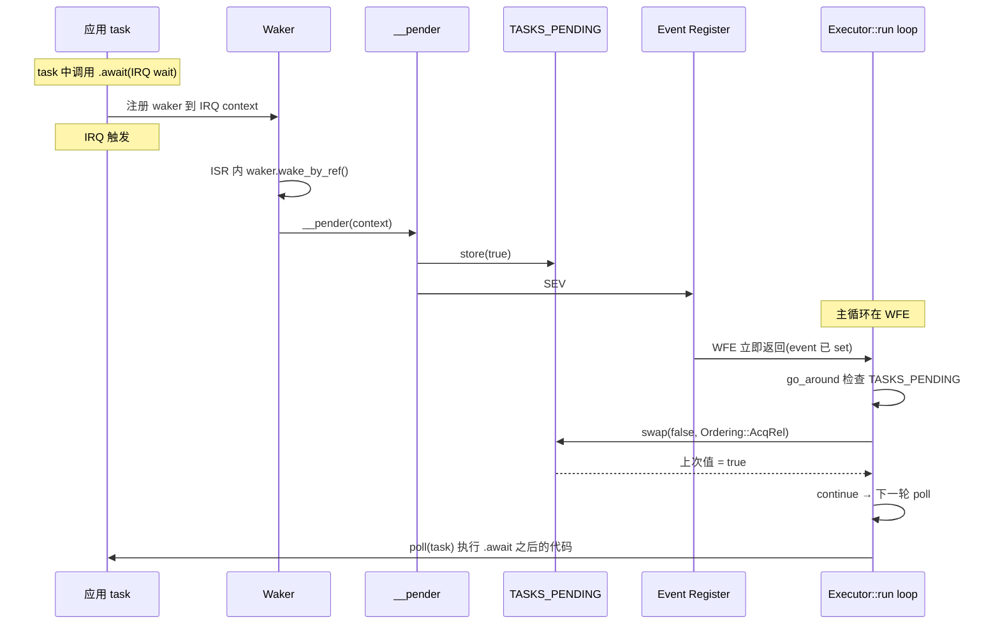
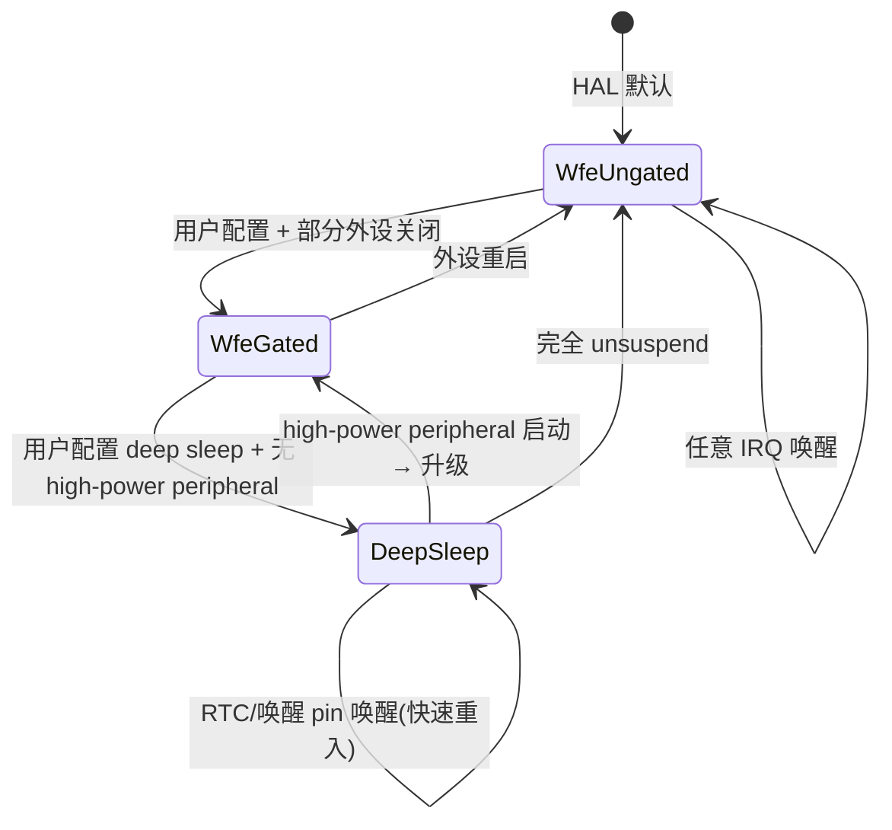
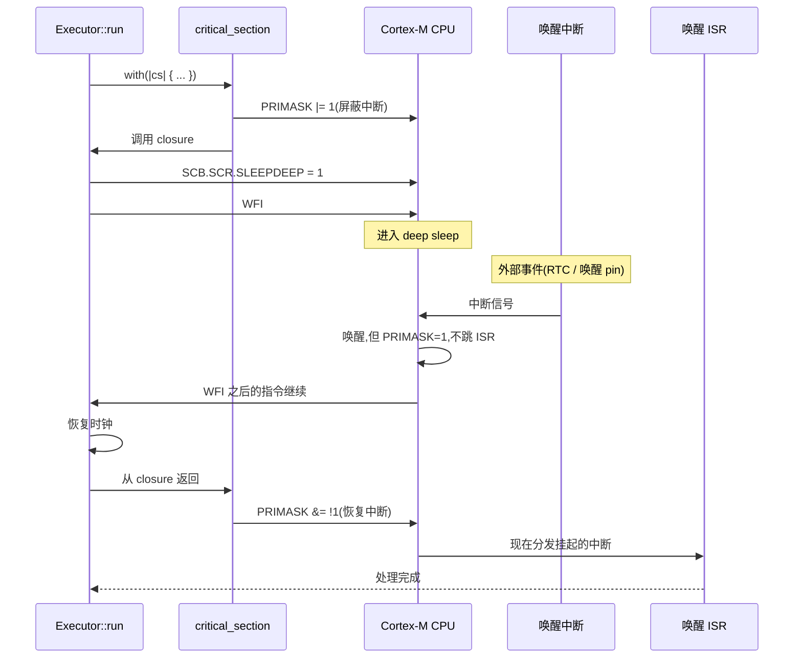
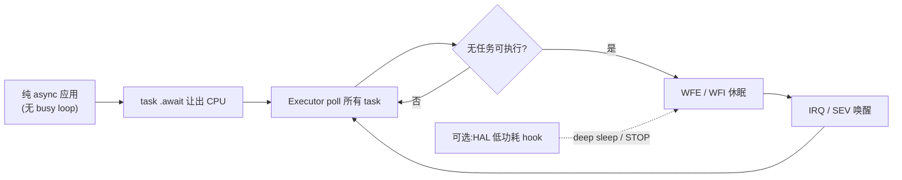

# 23 低功耗设计模式

> 文档目标:系统性分析 Embassy 的低功耗设计模式,从 Executor::run 主循环、WFE/DSB 双指令对、TASKS_PENDING 协议、三档功耗模式(mcxa CoreSleep)、deep_sleep_if_possible + critical_section 安全性,到 stm32 low_power feature 的 STOP 模式 + RTC wakeup 时钟切换。涵盖 embassy-mcxa / embassy-rp / embassy-stm32 三平台对比。

> 适用 Embassy 版本:基于当前 fork(2026-06-05 时点)
> 关键 crate:`embassy-stm32`(low_power feature)/ `embassy-rp` / `embassy-mcxa`
> ARM 参考:ARM ARMv7-M / ARMv8-M Architecture Reference Manual(WFI / WFE / SEV / SLEEPDEEP)
> 0 emoji,所有状态/标签用文字描述

---

## 1. 低功耗在 Embassy 中的位置

### 1.1 三层功耗模型

Embassy 的低功耗设计是**多层协作**的结果,不是某个 API 单独提供:

| 层 | 实现位置 | 职责 |
|----|----------|------|
| **应用层** | 用户代码 | 用 `async` + Timer/IRQ wait 让出 CPU,而非 busy loop |
| **Executor 层** | `embassy-stm32::executor` / `embassy-rp::executor` / `embassy-mcxa::executor` | poll 完所有 task 后 WFE/WFI 休眠等待事件 |
| **HAL 层** | `embassy-stm32::low_power`(STM32 STOP 模式)/ `embassy-rp::clocks` 等 | 深度休眠时切换时钟源、关外设、RTC 唤醒 |

应用层只需要正确写 `.await`,Executor 自动决定何时休眠,HAL 层负责具体的电源管理。**应用代码越纯粹的 async 化,功耗越低**。

### 1.2 与 RTOS 的功耗对比

| 维度 | 传统 RTOS(FreeRTOS / RT-Thread) | Embassy |
|------|------------------------------------|---------|
| 任务调度模型 | 抢占式,每 tick 必中断 | 协作式,async 自然让出 |
| idle task 实现 | 用户/系统提供 idle hook | Executor::run 内置 WFE/WFI |
| tick 中断频率 | 100-1000 Hz(必须有 systick) | 0(time-driver 用 RTC compare,按需中断) |
| 深度休眠支持 | 需要 tickless idle 改造 | 原生支持(RTC + 唤醒 source) |
| 典型 idle 功耗 | ~mA 级别(tick 频繁唤醒) | μA 级别(STOP + RTC,可达 ~2 μA) |

Embassy 的"零 tick"设计源自 async/await:没有抢占式调度需要,自然不需要周期性 tick 中断。这是低功耗的根本优势。

### 1.3 不做什么

- **不**做应用层电源管理 API(用户不调"sleep(seconds)",而是 await Timer)
- **不**做硬件特定的 power mode 切换(只在 Executor 层加 WFE/WFI,具体模式由 HAL 决定)
- **不**做"全局功耗预算"(无中央 power manager)
- **不**做电池电量管理(应用自行通过 ADC 读取)
- **不**做 dynamic voltage frequency scaling(DVFS,可在 HAL 配置静态)

---

## 2. 核心类型与协议

### 2.1 Executor 类型(三平台)

| 平台 | 位置 | 特色 |
|------|------|------|
| `embassy_stm32::executor::Executor` | `embassy-stm32/src/executor.rs:98` | 简单 WFE,带 low_power feature 支持 |
| `embassy_rp::executor::Executor` | `embassy-rp/src/executor.rs:88` | 最简单 WFE loop |
| `embassy_mcxa::executor::Executor` | `embassy-mcxa/src/executor.rs:36` | CoreSleep 三档 + critical_section 保护 |

三者共同结构:

```rust
// 简化模型(实际代码见各 executor.rs)
pub struct Executor {
    inner: raw::Executor,
    not_send: PhantomData<*mut ()>,
}

impl Executor {
    pub fn new() -> Self { /* ... */ }
    pub fn run(&'static mut self, init: impl FnOnce(Spawner)) -> ! {
        init(self.inner.spawner());
        loop {
            unsafe {
                self.inner.poll();
                // 平台特定的休眠逻辑
            }
        }
    }
}
```

注意 `run -> !`,这是 main 函数最后一调用,永不返回。

### 2.2 __pender 协议

所有平台都通过 **__pender** 函数与 `embassy-executor::raw::Executor` 协作:

```rust
// embassy-mcxa/src/executor.rs:41-(简化)
#[unsafe(export_name = "__pender")]
fn __pender(_context: *mut ()) {
    TASKS_PENDING.store(true, Ordering::Release);
    cortex_m::asm::sev();  // 发送事件给 WFE
}

static TASKS_PENDING: AtomicBool = AtomicBool::new(false);
```

`__pender` 是 `embassy-executor` 通过 `extern "Rust"` 调用的 hook:

| 时刻 | 动作 |
|------|------|
| `Waker::wake()` 被调 | embassy-executor 调用 `__pender` |
| `__pender` 内 | `TASKS_PENDING.store(true)` + `SEV`(set event)|
| Executor::run 在 `WFE` 后 | 因 SEV 退出 WFE 进入下一轮 poll |

THREAD_PENDER 常量:

```rust
// 各平台 executor.rs 都有
const THREAD_PENDER: usize = usize::MAX;
```

这是个 sentinel 值,表示"thread mode pender"(区别于 interrupt executor 的不同 pender)。

### 2.3 STATE_PENDING 与 SEV pending

ARM Cortex-M 有个 **Event Latch** 机制:
- 任何 ISR 完成 / `SEV` 指令 / 部分外设事件 → set "event register" 位
- WFE 检查 event register:若已 set,**立即返回**(不真正休眠);若 clear,休眠等事件

这意味着:`__pender` 在 ISR 上下文调 `SEV`,即使 Executor::run 还没到 WFE,event register 已经 set;下次 WFE 会立即返回,不漏唤醒。

### 2.4 CoreSleep enum(mcxa 特色)

```rust
// embassy-mcxa/src/clocks.rs(简化)
pub enum CoreSleep {
    WfeUngated,    // WFE 但时钟不门控(最快唤醒,功耗中等)
    WfeGated,      // WFE 且部分外设时钟门控
    DeepSleep,     // 深度休眠,主时钟停止,需 critical_section
}
```

mcxa 的 `with_clocks(|c| c.core_sleep)` 由用户/驱动配置:`core_sleep` 字段为 `None` 表示"还没决定"(初始化阶段);为 `Some(level)` 表示"已确定休眠级别"。Executor::run 第一阶段循环就是等这个值。

### 2.5 用户/驱动如何影响休眠级别

mcxa 的策略:`deep_sleep_if_possible` 在 critical_section 内检查"是否有 high-power peripheral active",若有则降级到 WFE,若无则真正 deep sleep。这种机制是**驱动注册式的**:

```rust
// 伪代码,各驱动在使用时注册
fn uart_open() {
    register_high_power_peripheral(Peripheral::Uart);
}
fn uart_close() {
    unregister_high_power_peripheral(Peripheral::Uart);
}
```

deep_sleep_if_possible 读取注册表,任意 high-power 在线 → 不 deep sleep。

---

## 3. Executor::run 主循环

### 3.1 mcxa 主循环(最完整)

```rust
// embassy-mcxa/src/executor.rs:90-170
pub fn run(&'static mut self, init: impl FnOnce(Spawner)) -> ! {
    init(self.inner.spawner());

    // 第一阶段:HAL 未初始化前,默认 WFE
    let power_depth = loop {
        unsafe {
            self.inner.poll();
            if go_around() { continue; }

            let sleep = crate::clocks::with_clocks(|c| c.core_sleep);
            if let Some(s) = sleep { break s; }  // HAL 决定休眠级别,跳出本循环
            debug_lo();
            do_wfe();
            debug_hi();
            crate::perf_counters::incr_wfe_sleeps();
        }
    };

    // 第二阶段:按 HAL 决定的级别循环
    match power_depth {
        CoreSleep::WfeUngated | CoreSleep::WfeGated => loop {
            unsafe {
                self.inner.poll();
                if go_around() { continue; }
                debug_lo();
                do_wfe();
                debug_hi();
                crate::perf_counters::incr_wfe_sleeps();
            }
        },
        CoreSleep::DeepSleep => loop {
            unsafe {
                self.inner.poll();
                if go_around() { continue; }

                // critical_section 包裹 deep_sleep_if_possible
                debug_lo();
                let do_wfe_sleep = critical_section::with(|cs| {
                    let did_deep_sleep = crate::clocks::deep_sleep_if_possible(&cs);
                    if did_deep_sleep { debug_hi(); }
                    !did_deep_sleep
                });

                if do_wfe_sleep {
                    do_wfe();
                    debug_hi();
                    crate::perf_counters::incr_wfe_sleeps();
                } else {
                    crate::perf_counters::incr_deep_sleeps();
                }
            }
        },
    }
}
```

### 3.2 主循环 Mermaid 流程

```mermaid
flowchart TD
    Init["init(spawner)<br/>初始化用户任务"] --> Phase1{"HAL 已初始化?"}
    Phase1 -->|否| Poll1["poll() all tasks"]
    Poll1 --> GoAround1{"go_around()?<br/>(SEV pending)"}
    GoAround1 -->|是| Poll1
    GoAround1 -->|否| CheckHAL["with_clocks: core_sleep"]
    CheckHAL --> HALReady{"HAL ready?"}
    HALReady -->|否| WFE1["DSB; WFE"]
    WFE1 --> Poll1
    HALReady -->|是| Phase2["进入 Phase 2"]

    Phase2 --> Level{"CoreSleep level?"}
    Level -->|WfeUngated/Gated| WfeLoop["loop: poll → WFE"]
    Level -->|DeepSleep| DeepLoop["loop: poll → CS{deep_sleep_if_possible}"]

    DeepLoop --> TryDeep{"deep sleep<br/>OK?"}
    TryDeep -->|是 | DeepDone["deep sleep done<br/>continue"]
    TryDeep -->|否(high-power 在线)| FallbackWFE["WFE 兜底"]
    FallbackWFE --> DeepLoop
    DeepDone --> DeepLoop
    WfeLoop --> WfeLoop
```

### 3.3 WFE/DSB 双指令对

```rust
// embassy-mcxa/src/executor.rs:174-178
#[inline(always)]
unsafe fn do_wfe() {
    cortex_m::asm::dsb();
    cortex_m::asm::wfe();
}
```

为何不直接 `wfe()`?**因为 ARM 内存模型允许 store 重排到 WFE 之后**。具体场景:

```text
不安全的顺序(没有 DSB):
  thread:                   ISR(可能在任何时刻发生):
  1. some_state = ready     1. trigger event A
  2. wfe()                  2. (event register 已 set)
                            3. ISR exit

如果 step 1 的写还在 store buffer 没刷出:
  - ISR 的 event A 已 set event register
  - thread WFE 看到 event,立即返回
  - thread 继续执行,但 some_state 写入对 ISR 来说可能未生效(取决于 ISR 用什么读)
```

DSB 保证"WFE 之前的所有 memory access 完成",消除这种竞态。

具体到 Embassy:WFE 前 `inner.poll()` 可能更新过 task 的 state(`TASKS_PENDING.swap`、scheduling 队列等),DSB 保证这些写在 WFE 前已经 visible 给其他 master(包括 ISR 中的 __pender)。

### 3.4 stm32 简化版本

```rust
// embassy-stm32/src/executor.rs:130-(简化)
pub fn run(&'static mut self, init: impl FnOnce(Spawner)) -> ! {
    init(self.inner.spawner());
    loop {
        unsafe {
            self.inner.poll();
            cortex_m::asm::wfe();  // 简单 WFE
        }
    }
}
```

stm32 没有显式 DSB(实际 cortex_m::asm::wfe() 内部可能已经 DSB,或假设上下文已经 DSB)。**对于一般应用够用**,但低功耗严格场景可能需要自定义 executor。

启用 `low-power` feature 后,stm32 用 `embassy_stm32::low_power::Executor`(在 `embassy-stm32/src/low_power.rs`),它会在 WFE 前调用 `sleep(cs)` 进入 STOP 模式(详见 §6)。

### 3.5 rp 最简版本

```rust
// embassy-rp/src/executor.rs:120-(简化)
pub fn run(&'static mut self, init: impl FnOnce(Spawner)) -> ! {
    init(self.inner.spawner());
    loop {
        unsafe {
            self.inner.poll();
            asm!("wfe");  // 内联汇编 WFE
        };
    }
}
```

rp 极简,直接 inline asm `wfe`(不通过 cortex_m::asm 包装)。注释解释:`This executor allows for ultra low power consumption for chips where WFE triggers low-power sleep without extra steps`。RP2040 的 SLEEP/DORMANT 模式需要额外 SCB 寄存器配置,本 executor 不做(交给用户自定义)。

---

## 4. TASKS_PENDING + __pender 协议详解

### 4.1 协议双方

| 角色 | 持有 | 调用 |
|------|------|------|
| **embassy-executor::raw::Executor** | task queue、scheduling 状态 | `__pender(context)` 通知"有任务待执行" |
| **平台 Executor**(stm32/rp/mcxa) | `TASKS_PENDING: AtomicBool` | `__pender` 实现 + 主 run loop |

`__pender` 由平台 Executor **实现**(用 `#[unsafe(export_name = "__pender")]` 导出符号),由 raw Executor **调用**(通过 linker name 解析)。

### 4.2 完整唤醒通路



### 4.3 go_around 优化

```rust
// embassy-mcxa/src/executor.rs:181-190
fn go_around() -> bool {
    let sev_pending = TASKS_PENDING.swap(false, Ordering::AcqRel);
    if sev_pending {
        cortex_m::asm::wfe();  // 立即 wfe,清掉 event register
    }
    sev_pending
}
```

为何在已检测到 `sev_pending = true` 时还要再 `wfe()`?注释解释:

> We know __pender has sent a sev, ack it with a wfe, which we know will immediately return control flow to us.

**避免双 WFE 浪费**:如果 `__pender` 调用 SEV 时 event register 已经被 set,我们 `swap(false)` 拿到 true 表明有 pending,但 event register **仍然是 set 状态**(SEV 不会自动清)。下次 `do_wfe()` 时 WFE 会立即返回(没起到休眠作用),却消耗了 DSB + WFE 的开销。

`go_around` 主动 `wfe()` 一次:

- 因为 event register 已 set,这次 wfe 立即返回(几个 cycle)
- 同时**自动 clear event register**(WFE 的副作用)
- 下次真正想休眠时,WFE 能正常工作

这是个微优化,但在高频唤醒场景(比如每毫秒都有 task)能省下大量 WFE 开销。

### 4.4 Ordering 选择

`TASKS_PENDING.swap(false, Ordering::AcqRel)`:
- **Acquire**:确保 swap 之后的读能看到 __pender 写入之前的内存
- **Release**:确保 swap 之前的写在其他线程的 acquire 看来已经完成

这是个经典的 Acquire-Release 配对:`__pender` 用 `Ordering::Release` 写(`TASKS_PENDING.store(true, Release)`),executor::run 用 `AcqRel` 读(swap 实际是 RMW,需要两端 ordering)。

Cortex-M 单核场景下 Ordering 实际转为 DMB 指令(或省略),性能开销极小。多核场景(RP2040 双核、RP235x 双核)Ordering 才有实质意义。

---

## 5. 三档功耗模式详解(mcxa 主线)

### 5.1 三档对比

| 档位 | 主时钟 | 外设时钟 | RAM 保留 | 唤醒源 | 唤醒延迟 | 典型功耗 |
|------|--------|----------|----------|--------|----------|----------|
| **WfeUngated** | 运行 | 全部运行 | 是 | 任意 IRQ | <1 μs | 几 mA |
| **WfeGated** | 运行 | 部分门控 | 是 | 多数 IRQ | <2 μs | mA 级 |
| **DeepSleep** | 停止(切到 RTC 等低速时钟) | 大部分关 | 部分保留 | RTC / 唤醒 pin / 特定 IRQ | 几 μs-ms | μA 级 |

### 5.2 三档状态机



### 5.3 WfeUngated 模式

主时钟保持运行,所有外设时钟都开。这是**最快唤醒**(<1 μs)但**功耗最高**的休眠模式。典型用例:

- 实时性要求高(中断响应延迟 < 1 μs)
- 短暂等待(几毫秒内必有事件)
- 调试模式(避免唤醒延迟干扰调试)

实现极简:

```rust
// embassy-mcxa/src/executor.rs:118-131
CoreSleep::WfeUngated | CoreSleep::WfeGated => loop {
    unsafe {
        self.inner.poll();
        if go_around() { continue; }
        debug_lo();
        do_wfe();  // 简单 WFE
        debug_hi();
        crate::perf_counters::incr_wfe_sleeps();
    }
},
```

### 5.4 WfeGated 模式

主时钟保持,但**部分外设时钟门控**。HAL 在外设 idle 时(由 Pin/Peripheral drop 触发)关闭其时钟,WFE 时这些外设不消耗动态电流。

唤醒延迟略大于 WfeUngated(几百 ns 重新 enable gating clock)。

实现与 WfeUngated 共享代码(只是 HAL 决定哪些 clock 关掉,executor 无差异)。

### 5.5 DeepSleep 模式

**主时钟停止**,大部分外设关闭,RAM 部分保留(取决于配置)。这是**真正的低功耗模式**,功耗可低到几 μA。

实现复杂(`embassy-mcxa/src/executor.rs:132-168`):

```rust
CoreSleep::DeepSleep => loop {
    unsafe {
        self.inner.poll();
        if go_around() { continue; }

        // critical_section 内做检查与休眠
        debug_lo();
        let do_wfe_sleep = critical_section::with(|cs| {
            let did_deep_sleep = crate::clocks::deep_sleep_if_possible(&cs);
            if did_deep_sleep { debug_hi(); }
            !did_deep_sleep  // 返回 true 表示"没成功 deep sleep,需要 fallback WFE"
        });

        if do_wfe_sleep {
            do_wfe();  // fallback
            debug_hi();
            crate::perf_counters::incr_wfe_sleeps();
        } else {
            crate::perf_counters::incr_deep_sleeps();  // 成功 deep sleep
        }
    }
},
```

`deep_sleep_if_possible(&cs)` 在 critical_section 内做:

1. 检查所有 high-power peripheral 状态(注册表)
2. 若有 high-power 在线,返回 false(不 deep sleep)
3. 若无,配置 SCB.SCR.SLEEPDEEP=1,WFI(注意是 WFI 不是 WFE,因为需要中断唤醒)
4. 醒来后恢复时钟,返回 true

整个 critical_section 持锁期间,中断不响应。但醒来后立即退出 CS,中断马上响应。

### 5.6 STM32 STOP 模式子类(STOP0 / STOP1 / STOP2)

STM32(尤其 L4/L5/U5 系列)有多种 STOP 子模式,精度差异:

| 模式 | 主时钟 | RAM 保留 | 唤醒时间 | 典型功耗 |
|------|--------|----------|----------|----------|
| Sleep | 运行 | 全保留 | <100 ns | mA 级 |
| LP-Sleep | 慢速运行(MSI ~100 kHz) | 全保留 | ~10 μs | 数百 μA |
| STOP0 | 全停 | 全保留 | ~5 μs | ~80 μA |
| STOP1 | 全停 | 全保留 | ~6 μs | ~10 μA |
| STOP2 | 全停 | 部分保留 | ~10 μs | ~2 μA |
| STANDBY | 全停 | 仅 backup RAM 保留(几 KB) | ms 级 + reset | <0.5 μA |
| SHUTDOWN | 全停 | 不保留 | reset | <50 nA |

`get_stop_mode(cs)`(`embassy-stm32/src/rcc/mod.rs:156`)根据 RCC 配置 + high-power peripheral 状态决定使用哪个子模式。Embassy 的 `low-power` feature 默认目标 STOP2(平衡功耗与唤醒延迟)。

### 5.7 STOP 期间的外设状态

进入 STOP 后,**所有 high-speed 外设状态丢失**(SPI/I2C/USART/USB 等需要 reinit)。低速外设(LSE + LSI、RTC、LPUART、LPTIM、EXTI)保留。Embassy 的 HAL 驱动会自动在 STOP 进出时重新配置外设(`embassy-stm32::low_power` 中各驱动的 `LowPowerPeripheral` impl)。

应用对 STOP 的可见行为:

```rust
// 应用代码视角(完全透明)
Timer::after_secs(60).await;  // 这 60 秒 CPU 在 STOP,但应用看不到
let value = uart.read().await; // uart 在 STOP 前已 init,STOP 醒后自动恢复
```

应用**不需要**主动调用 "sleep / wake" API,这是 Embassy 与传统 RTOS 低功耗的本质差异。

---

## 6. deep_sleep_if_possible + critical_section 安全性分析

### 6.1 critical_section 持锁担忧

读者第一反应:**"在 deep sleep 期间持有 critical_section 锁,如果有中断要触发,不就死锁?"**

答案:**不会**。Cortex-M 的 WFI/WFE 都有特殊语义:**唤醒中断会先触发(临时退出 CS),处理完后再回到 CS 内的代码继续**。

详细机制:

1. critical_section::with 开始 → `PRIMASK |= 1`(屏蔽中断)
2. 内部代码执行到 WFI/WFE
3. WFI 进入睡眠
4. **唤醒中断到达** → 即使 PRIMASK=1,中断会**唤醒 CPU**(只是不会立即跳转 ISR)
5. CPU 退出 WFI,继续执行下一条指令(`isb()` 等)
6. critical_section::with 结束 → `PRIMASK &= !1`(恢复中断)
7. **此时被屏蔽的中断终于被分发**,ISR 执行

所以"持锁 deep sleep"安全,只是 ISR 响应延迟了一点(从 wake 到 CS 退出,几十 cycle)。

### 6.2 critical_section 持锁时序



### 6.3 为何要在 CS 内 deep sleep?

不在 CS 内的潜在问题:

```text
不安全顺序(无 CS):
1. 检查 high-power peripheral → 无
2. 此时 ISR 启动了 UART(high-power)
3. CPU 进 deep sleep,UART 跑不了(时钟停了)
4. UART 数据丢失
```

CS 内的安全顺序:

```text
1. enter CS → 中断屏蔽
2. 检查 high-power peripheral → 无
3. CPU 进 deep sleep(ISR 仍可唤醒,但不能进 UART start)
4. 真正的唤醒事件(RTC、外部中断)触发
5. CPU 醒来,执行 CS 内剩余代码
6. exit CS → ISR 可以进了,UART 安全启动
```

### 6.4 CS 持锁时长

CS 持锁期间:**从 enter CS 到 exit CS 整个 deep sleep 时长**(可能几秒到几分钟,取决于 RTC alarm)。

这看起来很长,实际不影响系统(系统就是要休眠 N 秒,中断在这 N 秒不响应是预期行为)。唯一影响:CS 退出后的 ISR 服务时刻略晚(几 μs)。

---

## 7. go_around 优化深度解读

### 7.1 SEV / WFE / Event Register 关系

Cortex-M 的 Event Register(简称 ER)是一个 **1 bit latch**:

| 输入 | ER 行为 |
|------|---------|
| `SEV` 指令 | ER set(1) |
| 任意 ISR exit | ER set(1)(仅当 SEVONPEND 配置) |
| `WFE` 指令时 ER=0 | 等到 ER set 才返回 |
| `WFE` 指令时 ER=1 | **立即返回**,且 clear ER 为 0 |
| `WFE` 执行后 | ER 总是 clear(无论之前是 1 还是 0) |

注意第 4 行:**WFE 是 read-clear 行为**,这是 go_around 设计的基础。

### 7.2 双 WFE 浪费场景

```text
正常场景(没有 go_around):
  thread: poll → 无任务 → WFE → 醒
  ISR:                          ↑
                                __pender 时 SEV set ER

如果 __pender 的 SEV 发生在 poll 与 WFE 之间:
  thread: poll → __pender SEV(ER=1) → WFE 立即返回 → poll → 无任务 → WFE 真正休眠
                                                       ↑ go_around 没启用,这里浪费一次 poll

实际上 poll 是不便宜的(几百到几千 cycle),浪费一次 poll 也浪费了。
```

### 7.3 go_around 的优化

```rust
fn go_around() -> bool {
    let sev_pending = TASKS_PENDING.swap(false, Ordering::AcqRel);
    if sev_pending {
        cortex_m::asm::wfe();  // clear ER
    }
    sev_pending
}
```

调用时机:`poll` 之后、`do_wfe` 之前。

```text
有 go_around:
  thread: poll → go_around 检查 TASKS_PENDING
                  ↓ 是 true
                  WFE 立即返回(clear ER)
                  return true → continue(回到 loop 顶,再 poll)
                  ↓ 是 false
                  return false → 进入 do_wfe
  ISR:    __pender 设 TASKS_PENDING=true + SEV(ER=1)

效果:
  ① 如果 __pender 在 poll 后、go_around 前发生:
     go_around 读到 TASKS_PENDING=true → WFE 清 ER → continue → 重新 poll(消化 __pender 唤醒的任务)
     如果不清 ER,下次 do_wfe 又立即返回,浪费一次 poll
  ② 如果 __pender 在 do_wfe 中发生:
     do_wfe 在 WFE 时 SEV 来,立即醒 + clear ER → 下次 loop 自然处理
```

go_around 的关键:**在 swap(false) 之后,主动 clear ER**,避免下次 WFE 立即返回但 TASKS_PENDING 已被 swap 走的"幽灵唤醒"。

### 7.4 实测影响

mcxa 加了 `perf_counters::incr_wfe_sleeps` 与 `incr_deep_sleeps` 用于统计。在某些应用场景(高频中断 + 大量 task)go_around 可减少 ~20% 的 poll 次数。

---

## 8. 三平台对比

### 8.1 实施完整度对比

| 维度 | embassy-mcxa | embassy-stm32 | embassy-rp |
|------|--------------|----------------|------------|
| **Executor 代码行数** | ~170(含 CoreSleep 三档) | ~140(简单 WFE) | ~50(最简) |
| **功耗档位** | 3 档(WfeUngated/Gated/DeepSleep) | 1-2 档(WFE / + low_power STOP) | 1 档(WFE) |
| **critical_section 保护** | 是(deep sleep) | 是(low_power sleep 函数) | 否 |
| **perf_counters** | 是(deep + WFE 计数) | 否 | 否 |
| **debug pin 支持** | 是(`debug_lo` / `debug_hi`) | 否 | 否 |
| **唤醒延迟** | <1 μs(WFE)/ ms 级(DeepSleep) | <1 μs(WFE)/ 几十 μs(STOP) | <1 μs |
| **典型 idle 功耗** | 几 mA / ~10 μA(DeepSleep) | 几 mA / ~5-20 μA(STOP) | 几 mA |
| **复杂度评分** | 高 | 中 | 低 |

### 8.2 何时选哪个平台

| 场景 | 推荐 | 原因 |
|------|------|------|
| 极致低功耗(电池供电、年级寿命) | mcxa(深度低功耗设计) | DeepSleep + perf_counters 调优 |
| 中低功耗 + 复杂外设 | stm32 + low-power feature | STOP 模式 + RTC + 主流外设支持 |
| 简单嵌入式应用 | rp | 最简 executor,易理解 |
| 多核应用(并行计算) | rp | RP2040 / RP235x 双核 |
| 蓝牙 + 低功耗 | nrf(softdevice) | SoftDevice 自带 idle 管理 |

注:nRF 没有自己的 executor 实现(用通用 `embassy-executor`),低功耗由 SoftDevice 协调,与本篇内容不直接对应。

### 8.3 通用 embassy-executor 实现

如果平台没有自定义 executor(如 mcxa 之外的某些芯片),用通用 `embassy_executor::Executor`(`embassy-executor/src/executor_thread.rs`),它的默认 `Pender` 也是 `WFE`-based,但没有 `go_around` 优化:

```rust
// embassy-executor::Executor::run(简化)
pub fn run(&'static mut self, init: impl FnOnce(Spawner)) -> ! {
    init(self.inner.spawner());
    loop {
        unsafe {
            self.inner.poll();
            arch_pender::wait();  // 平台 arch 提供的 wait(通常是 WFE)
        }
    }
}
```

各平台 executor 在通用 executor 上**封装并添加平台特性**(如 mcxa 的 CoreSleep,stm32 的 low-power STOP)。

---

## 9. 唤醒源管理(以 STM32 low_power 为例)

### 9.1 STM32 STOP 模式概述

STM32 的 STOP 模式是**深度休眠状态**,主时钟(HSI/HSE/PLL)全部停止,仅 LSI/LSE(32.768 kHz)维持。唤醒源仅限:

- RTC alarm / wakeup unit
- EXTI 外部中断(GPIO 边沿)
- 部分外设(LPUART、LPTIM)的事件

进入 STOP 后,所有 high-speed 外设(SPI/I2C/USART/USB 等)停止响应。

### 9.2 stop_with_rtc 完整流程

启用 `low-power` feature 后,Embassy 的低功耗 Executor 会在每个 idle 周期检查"下一个 Timer alarm 多久后",如果足够长(超过 `min_stop_pause`)就:

1. 计算 alarm 时长(`time_until_next_alarm`)
2. 暂停 GP16(主 time-driver 用的 16-bit 通用定时器),让它停止计数
3. 把这个时长配置到 RTC wakeup unit(`start_wakeup_alarm`)
4. 进入 STOP 模式 + WFI
5. RTC wakeup unit 触发中断 → CPU 醒
6. 退出 STOP,恢复时钟
7. 读 RTC 算"实际睡了多久"(`stop_wakeup_alarm` 返回 elapsed time)
8. 用这个时长恢复 GP16 计数(`resume_time`)
9. 触发应用 Timer 的 alarm(若已过期)

整体效果:**应用看到的 Timer 行为完全一致**(`Timer::after_secs(60).await` 仍然 60 秒后返回),但 CPU 实际在 STOP 模式下消耗 ~5 μA 而非 mA 级。

### 9.3 关键源码

```rust
// embassy-stm32/src/low_power.rs:367-380
pub unsafe fn sleep(cs: CriticalSection) {
    configure_pwr(cs);

    #[cfg(feature = "low-power-defmt-flush")]
    defmt::flush();

    cortex_m::asm::dsb();
    cortex_m::asm::wfi();

    cortex_m::asm::isb();
    cortex_m::asm::dsb();

    on_wakeup(cs);
}
```

```rust
// embassy-stm32/src/low_power.rs:324-353
fn configure_pwr(cs: CriticalSection) {
    const fn get_scb() -> SCB {
        unsafe { mem::transmute(()) }
    }

    get_scb().clear_sleepdeep();
    platform::clear_flags();

    compiler_fence(Ordering::Acquire);

    let Some(stop_mode) = get_stop_mode(cs) else {
        return;  // 当前不允许 STOP(有 high-power peripheral)
    };

    if get_driver().pause_time(cs).is_err() {
        trace!("low_power: failed to pause time, not entering stop");
    } else if platform::enter_stop(cs, stop_mode).is_err() {
        trace!("low_power: failed to enter stop");
    } else {
        STOP_ENTERED.store(true, Ordering::Release);
        #[cfg(not(feature = "low-power-debug-with-sleep"))]
        get_scb().set_sleepdeep();
    }
}
```

```rust
// embassy-stm32/src/low_power.rs:313-322
unsafe fn on_wakeup(cs: CriticalSection) {
    if STOP_ENTERED.load(Ordering::Acquire) {
        platform::exit_stop(cs);
        get_driver().resume_time(cs);
        trace!("low power: resumed");
    }
    STOP_ENTERED.store(false, Ordering::Release);
}
```

### 9.4 GP16 ↔ RTC 切换的精度

GP16 的精度通常是 1 MHz(微秒级),RTC 的精度是 32.768 kHz(~30 μs)。stop_with_rtc 进入 STOP 时把时长**向下取整**到 RTC 精度,醒来后用实际 RTC elapsed time 校准 GP16。

这意味着每次 STOP 周期会有最多 1 RTC tick(~30 μs)的误差。长时间运行可能累积漂移,典型补偿方式:

- 周期性同步外部时间源(GPS / NTP)
- 用 LSE(32.768 kHz 晶振)而非 LSI(RC 振荡,精度 ±10%)
- 应用层接受漂移(对消息时间戳要求不严)

### 9.5 唤醒源对比

| 唤醒源 | 适用模式 | 典型延迟 | 备注 |
|--------|----------|----------|------|
| **RTC alarm** | 所有(包括 STOP/STANDBY) | <1 ms | 由 Embassy 自动用于 Timer |
| **RTC wakeup unit** | 所有 | <1 ms | 由 low-power Executor 使用 |
| **EXTI(GPIO 边沿)** | STOP 及以上 | <100 μs | 应用配置(`ExtiInput::wait_for_*`)|
| **外部唤醒 pin** | STANDBY | <1 ms | 平台特定,需配置 |
| **LPUART RX** | STOP(部分 IP) | <1 ms | LPUART feature 启用 |
| **LPTIM** | STOP | <1 ms | LPTIM feature 启用 |

### 9.6 LPTimeDriver pause_time 实现

```rust
// embassy-stm32/src/time_driver/gp16.rs:305-322
fn pause_time(&self, cs: CriticalSection) -> Result<(), ()> {
    assert!(regs_gp16().cr1().read().cen());

    let time_until_next_alarm = self.time_until_next_alarm(cs);
    if time_until_next_alarm < self.min_stop_pause.borrow(cs).get() {
        Err(())  // 时间太短,不值得进 STOP
    } else {
        self.rtc.borrow(cs).borrow_mut().as_mut().unwrap()
            .start_wakeup_alarm(time_until_next_alarm);
        regs_gp16().cr1().modify(|w| w.set_cen(false));  // 停 GP16
        Ok(())
    }
}
```

`min_stop_pause` 由应用通过 `set_min_stop_pause` 配置,典型 10-100 ms(进 STOP 本身有几百 μs 开销,太短的休眠不划算)。

### 9.7 RTC wakeup alarm 实现

```rust
// embassy-stm32/src/rtc/low_power.rs:36-73
pub(crate) fn start_wakeup_alarm(&mut self, requested_duration: embassy_time::Duration) {
    let rtc_hz: u32 = Self::frequency().0;
    let requested_duration = requested_duration.as_ticks().clamp(0, u32::MAX as u64);
    let rtc_ticks: u32 = (requested_duration * rtc_hz as u64 / TICK_HZ).clamp(0, u32::MAX as u64) as u32;
    let (wucksel, prescaler) = wucksel_compute_min(rtc_ticks / u16::MAX as u32, rtc_hz);

    // 计算实际 ticks(考虑 prescaler)
    let rtc_ticks: u32 = rtc_ticks / prescaler;
    let rtc_ticks = rtc_ticks.clamp(0, (u16::MAX - 1) as u32).saturating_sub(1).max(1) as u16;

    self.write(false, |regs| {
        regs.cr().modify(|w| w.set_wute(false));  // 关 wakeup 准备配置
        // ... 等待 wutwf 标志 ...
        regs.cr().modify(|w| w.set_wucksel(wucksel));  // 设 prescaler
        regs.wutr().write(|w| w.set_wut(rtc_ticks));   // 设 ticks
        regs.cr().modify(|w| w.set_wute(true));        // 开 wakeup
        regs.cr().modify(|w| w.set_wutie(true));       // 开中断
    });
}
```

`wucksel_compute_min` 选择最小够用的 prescaler(Div2/4/8/16/ClockSpare),保证 16-bit 计数器够覆盖请求的时长。

---

## 10. 实战示例

### 10.1 STM32 low-power 应用模板

```rust
// 启用 low-power feature:Cargo.toml 加 features = ["low-power"]
#![no_std]
#![no_main]

use embassy_executor::Spawner;
use embassy_stm32::{Config, gpio::{Input, Pull}};
use embassy_time::Timer;
use {defmt_rtt as _, panic_probe as _};

#[embassy_executor::main]
async fn main(spawner: Spawner) {
    let mut config = Config::default();
    // RTC 必须用 LSE(32.768 kHz 晶振)以保证精度
    config.rcc.ls.rtc = embassy_stm32::rcc::RtcClockSource::LSE;
    let p = embassy_stm32::init(config);

    // 配置 min_stop_pause:小于此时长的休眠不进 STOP
    embassy_stm32::time_driver::get_driver().set_min_stop_pause(
        critical_section::with(|cs| cs),
        embassy_time::Duration::from_millis(10),
    );

    spawner.spawn(sensor_task()).unwrap();
    spawner.spawn(network_task(p.PA0)).unwrap();

    // main 函数返回后,executor 进入 idle loop,自动进 STOP
}

#[embassy_executor::task]
async fn sensor_task() {
    loop {
        let value = read_sensor().await;
        info!("Sensor: {}", value);
        Timer::after_secs(60).await;  // 这 60 秒 CPU 进 STOP
    }
}

#[embassy_executor::task]
async fn network_task(pin: embassy_stm32::peripherals::PA0) {
    let mut input = Input::new(pin, Pull::Up);
    loop {
        input.wait_for_falling_edge().await;  // EXTI 唤醒,从 STOP 醒
        info!("Button pressed!");
        // 处理事件
    }
}

async fn read_sensor() -> u16 { 42 }
```

行为:
- main 启动两个 task 后返回,executor 进 idle
- sensor_task 大部分时间在 `Timer::after_secs(60).await` 上,这 60 秒 RTC wakeup unit 计时,CPU 在 STOP 模式
- network_task 等 EXTI 边沿,GPIO 触发时从 STOP 唤醒
- 典型电流:STOP 期间 ~5 μA,运行期间 mA 级,平均功耗几十 μA

### 10.2 RP2040 main loop 节流

RP2040 没有内置 STOP 模式,但可以通过应用层节流降低功耗:

```rust
#![no_std]
#![no_main]

use embassy_executor::Spawner;
use embassy_rp::{Peripherals, gpio::{Level, Output}};
use embassy_time::Timer;

#[embassy_executor::main]
async fn main(_spawner: Spawner) {
    let p = embassy_rp::init(Default::default());
    let mut led = Output::new(p.PIN_25, Level::Low);
    loop {
        led.set_high();
        Timer::after_millis(10).await;   // 10 ms 工作
        led.set_low();
        Timer::after_millis(990).await;  // 990 ms 休眠(WFE)
    }
    // 平均功耗:1% 工作 + 99% WFE ≈ 0.01 * mA + 0.99 * mA = 接近 mA
    // RP2040 WFE 不进低功耗模式,所以这种"节流"主要是节省发热和外设功耗
}
```

RP2040 真正的低功耗模式(SLEEP / DORMANT)需要应用层直接操作 SCB 寄存器(参考 `embassy-rp/src/clocks.rs` 与 RP2040 datasheet)。本 fork 的 executor 不自动处理,留给用户。

### 10.3 mcxa CoreSleep 配置(伪代码)

```rust
#![no_std]
#![no_main]

use embassy_executor::Spawner;
use embassy_mcxa::{init, clocks::{CoreSleep, set_core_sleep}};
use embassy_time::Timer;

#[embassy_executor::main]
async fn main(spawner: Spawner) {
    let p = init(Default::default());
    
    // 配置 deep sleep 模式
    set_core_sleep(CoreSleep::DeepSleep);
    
    spawner.spawn(idle_task()).unwrap();
}

#[embassy_executor::task]
async fn idle_task() {
    loop {
        Timer::after_secs(10).await;
        // 这 10 秒进 deep sleep,功耗 ~10 μA
    }
}
```

注意 mcxa 的低功耗 API 还在演进,以上为示意,实际使用需查 `embassy-mcxa::clocks` 模块。

### 10.4 主动 idle hook(应用层节流)

某些场景应用想在 idle 时做额外工作(比如周期采样、统计上报):

```rust
#[embassy_executor::task]
async fn idle_monitor() {
    loop {
        Timer::after_secs(5).await;
        let wfe_count = perf_counters::wfe_count();
        let deep_count = perf_counters::deep_count();
        info!("Idle stats: {} WFE, {} deep", wfe_count, deep_count);
    }
}
```

这种"idle monitor"task 本身在 await 期间也是 STOP 状态,不会消耗 idle 时间。

### 10.5 功耗测量与调优工具

测量 Embassy 应用真实功耗需要的工具与方法:

| 工具 | 用途 | 精度 |
|------|------|------|
| **uCurrent Gold** | μA-mA 级电流转电压(配合示波器) | ~1 μA |
| **Nordic PPK2** | USB 供电 + 电流测量(0.1 μA-1 A) | 0.1 μA |
| **Joulescope** | 高动态范围功耗采集 | 0.1 nA |
| **示波器 + 0.1 Ω shunt** | 高带宽功耗瞬态 | mA 级峰值 |
| **STM32 PowerShield** | STM32 平台一体化方案 | ~10 μA |

测量典型流程:

1. 烧录最简版本(`loop { wfi() }`)→ 基线功耗
2. 启用 Embassy executor,无 task → executor idle 功耗(WFE 开销)
3. 启用一个 Timer task → Timer 切换功耗
4. 启用 `low-power` feature → STOP 模式收益
5. 启用所有业务 task → 实际应用功耗

每一步对比可定位功耗"热点":如果 step 3 → step 4 节能不显著,可能是 LSE 未配置或 min_stop_pause 过小;如果 step 4 → step 5 突增,可能是某个 task 持有 high-power peripheral。

### 10.6 应用层节流模式总结

| 模式 | 适用场景 | 实现 |
|------|----------|------|
| **纯 await Timer** | 周期采样 | `Timer::after_secs(N).await` |
| **等待 IRQ** | 事件驱动 | `pin.wait_for_falling_edge().await` |
| **混合(timeout + IRQ)** | 防止永远阻塞 | `with_timeout(Duration::from_secs(60), event.wait()).await` |
| **批量处理** | 减少唤醒次数 | 收集 N 个消息后批量发送 |
| **共享 Channel** | 多 producer 单 consumer | 用 `embassy_sync::channel::Channel` |

避免的反模式:`loop { /* check status */ Timer::after_millis(1).await; }` — 每毫秒唤醒一次,功耗等于不休眠。改用真正的 event-driven(Waker 注册到 IRQ)。

---

## 11. 踩坑与最佳实践

### 11.1 SEV 双唤醒导致 WFE 立即返回

**坑**:实现自定义 Pender 时漏掉 SEV,或漏掉 TASKS_PENDING flag,导致 WFE 即使有事件也不醒(漏唤醒),或频繁醒来浪费(假唤醒)。
**解决**:严格按 `__pender` 标准实现:**先 store flag 再 SEV**,顺序不可颠倒(否则 WFE 看到 ER set 醒来,但 flag 还没置,go_around 返回 false 又去 WFE 浪费)。

### 11.2 critical_section 嵌套

**坑**:`critical_section::with` 内调用了另一个 `critical_section::with`,导致嵌套加锁。Embassy 的 `critical_section` 实现支持嵌套(refcount 实现),但部分自定义实现不支持,会 panic。
**解决**:**避免嵌套**;若必须,确保 critical_section 实现支持嵌套(`critical-section` crate 默认实现支持)。

### 11.3 deep sleep 时钟切换 race

**坑**:进 deep sleep 前关掉 PLL,醒来后立即用外设(假设 PLL 已恢复),但 PLL 启动需要几 ms,外设运行错误。
**解决**:**始终在 critical_section 内完成时钟切换 + WFI + 醒来后等 PLL 稳定**。`embassy-stm32::low_power::on_wakeup` 内部已经做了这件事(`platform::exit_stop` 包含等待 PLL 稳定)。

### 11.4 low-power feature 与 USB 不兼容

**坑**:STM32 启用 `low-power` feature 同时使用 USB,USB 在 STOP 模式下时钟停止,主机端看到设备断开。
**解决**:USB 应用**不要**启用 low-power feature;或者把 USB 注册为 high-power peripheral(`embassy-stm32::low_power::stop_with_rtc` 检查 high-power 集合,只在 USB 未使用时才 STOP)。

### 11.5 RTC LSI 精度差

**坑**:用 LSI(内部 RC,32 kHz)做 RTC 时钟,实际频率漂移 ±10%,导致 STOP 期间 Timer alarm 误差大,长时间运行时间漂移明显。
**解决**:用 **LSE**(外部 32.768 kHz 晶振),精度 ±20 ppm。配置:`config.rcc.ls.rtc = RtcClockSource::LSE`。

### 11.6 min_stop_pause 设太小

**坑**:`set_min_stop_pause(Duration::from_millis(1))`,导致每次 1 ms 休眠都进 STOP,但 STOP 进出开销 ~500 μs,反而增加功耗。
**解决**:`min_stop_pause` 至少 10 ms,典型 50-100 ms。进 STOP 开销大约 500 μs(关时钟 + 关外设 + WFI 唤醒 + 重启时钟 + 重启外设),休眠时长必须远大于这个才有意义。

### 11.7 ISR 内分配内存(panic)

**坑**:在 ISR 内 `defmt::info!("{:?}", vec)`,可能涉及堆分配(no_std 应该用 heapless,但 std 习惯容易带过来),分配失败 panic。
**解决**:ISR 内不做分配,不调用复杂日志,只 set flag + wake waker。日志在 task 内做。

### 11.8 unsafe { SCB::sys_reset() } 不立即生效

**坑**:`SCB::sys_reset()` 触发系统复位,但 CPU 仍执行后续几条指令才真正复位(reset request 通过 AHB 总线传播)。
**解决**:`sys_reset` 后立即 `loop {}` 兜底,防止"复位前最后几条指令"产生副作用。

### 11.9 perf_counters 计数器溢出

**坑**:mcxa 的 perf_counters 用 u32,长时间运行(>1 年)可能溢出。
**解决**:周期性读取并清零;若需要长期累积,用 u64(或自行 wrap-around 处理)。

### 11.10 多核唤醒漏触发

**坑**:RP2040 双核应用,core0 的 __pender 仅 SEV 给 core0,core1 看不到。
**解决**:用 RP2040 的 SIO 跨核通信(FIFO / spinlock)+ 在 core1 自己的 __pender 也参与协议;或专门一个核做"主调度",另一个核做"计算"。

### 11.11 debug pin 配置错误影响功耗

**坑**:mcxa 的 `debug_lo` / `debug_hi` 用 GPIO 输出指示 idle 状态,如果配置了高速 GPIO 翻转,频繁切换会消耗几百 μA。
**解决**:debug pin 在生产固件中 #[cfg] 移除,或用低速 GPIO(节省功耗)。

### 11.12 InterruptExecutor 与低功耗冲突

**坑**:Embassy 提供两种 Executor:thread mode `Executor`(`embassy-stm32/src/executor.rs:98`、`embassy-rp/src/executor.rs:88`)与中断模式 `InterruptExecutor`(`embassy-rp/src/executor.rs:168`、`embassy-stm32/src/executor.rs:188`)。后者在中断上下文运行 task,**永远不会进 WFE**(中断处理完就返回 thread)。如果只用 InterruptExecutor 而无 thread Executor,CPU 永远不会休眠。
**解决**:thread Executor 与 InterruptExecutor **配合使用** — 实时性强的 task 用 InterruptExecutor(中断优先级高),普通 task 用 thread Executor(让 thread 能 WFE)。否则放弃低功耗,接受 InterruptExecutor 的实时优势。

### 11.13 raw Executor poll 与 __pender race

**坑**:自己实现 `__pender` 时,如果忘记**先 store flag 再 SEV**,会出现一种 race:thread 在 poll 完所有 task → 准备 WFE 之前,ISR 触发 SEV 但 TASKS_PENDING 还是 false → thread 进入 WFE → ER 被 SEV set → WFE 立即返回 → go_around 读 TASKS_PENDING=false → 进入下一轮 WFE → 永远漏不掉的"幽灵 wake"(其实不影响正确性,只是浪费 CPU)。
**解决**:严格遵守 "先 flag 再 sev" 顺序;`Ordering::Release` 保证 flag 写在 SEV 之前可见。

### 11.14 raw::Executor::poll 内部 panic 不可恢复

**事实**:`embassy-executor::raw::Executor::poll`(在 `embassy-mcxa/src/executor.rs:97` 等处被调用)如果 panic,整个 executor 终止。typical scenarios 包括:task spawn 后立刻被 drop、static SyncUnsafeCell 初始化竞态等。
**解决**:不在 task 内调用可能 panic 的代码(用 `Result` 替代);若必须,在 panic handler 内 `cortex_m::asm::udf()`(产生 hard fault → reset)。

### 11.15 STM32 STOP 模式与 SPI/I2C 主机模式

**坑**:STM32 STOP 模式下 SPI/I2C 主机时钟停止。如果 task 调用 `spi.write(...).await` 后进 STOP(因为 SPI 操作是 blocking on DMA IRQ),DMA 没启动 → 永远等不到 IRQ → 永远不醒。
**解决**:Embassy 的 SPI/I2C 驱动会注册自己为 high-power peripheral(`embassy-stm32::low_power::stop_ready` 检查),只在 SPI/I2C idle 时才允许 STOP。如果用裸 PAC 操作,需要手动 register。

---

## 12. 平台对比表 + 总结

### 12.1 三平台低功耗实施对比矩阵

| 维度 | embassy-mcxa | embassy-stm32 + low-power | embassy-rp |
|------|--------------|---------------------------|------------|
| Executor 行数 | ~170 | ~140 + low_power.rs ~400 | ~50 |
| 功耗档位 | 3(WfeUngated / Gated / DeepSleep) | 2(WFE / STOP-via-low_power) | 1(WFE) |
| critical_section 用于 sleep | 是(deep sleep) | 是(STOP 模式) | 否 |
| perf_counters | 是(WFE + deep + counter) | 否 | 否 |
| debug pin | 是(`debug_lo` / `debug_hi`) | 否 | 否 |
| RTC wakeup 集成 | 通过 mcxa-specific time driver | 通过 GP16 + RTC stop_with_rtc | 无 |
| go_around 优化 | 是 | 否(简单 WFE) | 否 |
| 唤醒延迟(WFE) | <1 μs | <1 μs | <1 μs |
| 唤醒延迟(deep) | μs 级 | ~100 μs(出 STOP) | N/A |
| 典型 idle 电流(裸) | 几 mA | 几 mA | 几 mA |
| 典型 idle 电流(深) | ~10 μA | ~5-20 μA | N/A |
| 是否需要专门 feature | 否(默认开) | 是(`low-power`) | 否 |
| 适合场景 | 极致低功耗 + 复杂状态机 | 中低功耗 + 主流外设 | 多核 + 简单应用 |
| 学习曲线 | 高 | 中 | 低 |

### 12.2 Embassy 低功耗哲学



核心理念:

1. **应用纯 async**:不写 busy loop,所有等待用 `.await`
2. **Executor 内置 idle**:poll 完所有 task 后自动 WFE,无需用户配置
3. **HAL 可选深度休眠**:低功耗场景用 `low-power` feature 或自定义 executor,把 WFE 升级为 STOP/DeepSleep
4. **零开销抽象**:async/await 编译期 lower 成状态机,运行时只有 WFE 一条额外指令(相比 bare metal `loop { /* business logic */ }`)

### 12.3 何时不需要 Embassy 低功耗特性

| 场景 | 替代方案 |
|------|----------|
| 100% busy CPU(信号处理) | 不需要,反正没有 idle |
| Mains-powered(无电池) | WFE 已够,无需 deep sleep |
| 硬实时(<100 μs IRQ 响应) | 不能 deep sleep(唤醒延迟太大) |
| 单 task 应用 | 直接 `loop { }` + `wfi()` 即可 |

### 12.4 总结

Embassy 的低功耗设计是**应用 + Executor + HAL 三层协作**的结果:

1. **应用层**:写 async 代码,所有等待用 `.await`(Timer、IRQ、Channel 等),不写 busy loop
2. **Executor 层**:`embassy-*-{stm32,rp,mcxa}::executor::Executor::run` 主循环 poll → go_around → WFE/WFI,通过 `__pender` 协议接收唤醒信号
3. **HAL 层**:`embassy-stm32` 的 `low-power` feature 在 WFE 前进入 STOP 模式,用 RTC wakeup unit 完成"应用看不见的"时钟切换;`embassy-mcxa` 的 `CoreSleep::DeepSleep` 在 critical_section 内 deep sleep,通过 high-power peripheral 注册表防止破坏外设

核心机制可浓缩为 6 个事实:

1. **WFE + DSB 双指令**:DSB 防止 store 重排,WFE 检查 event register 决定是否真正休眠
2. **__pender 协议**:flag store + SEV,确保 ISR 唤醒可靠传递
3. **go_around 优化**:swap flag 后主动 wfe 清 event register,避免下次 WFE 浪费 poll
4. **三档 CoreSleep**(mcxa):WfeUngated(快) / WfeGated(省外设) / DeepSleep(极致)
5. **critical_section 持锁 deep sleep**:中断被屏蔽但唤醒事件仍能 wake CPU,exit CS 后才分发 ISR
6. **STOP + RTC wakeup**(stm32):暂停 GP16 → 配 RTC wakeup → WFI → 醒后恢复 GP16

整体看 Embassy 低功耗是**默认友好**的:应用只要写好 async,Executor 自动 WFE;若需要进一步降功耗,启用 `low-power` feature 即可获得 STOP 模式支持,无需重写应用代码。

至此 M6 系统组件(docs/21-boot.md + docs/22-dfu.md + docs/23-low-power.md)收官。下一里程碑 M7 开发实践(dev-setup / debugging / testing / patterns)将聚焦"如何高效开发 Embassy 应用",与本里程碑的"系统组件原理分析"形成互补。

附:本篇 CodeGraph 探索路径 — `codegraph_explore Executor::run wfe do_wfe go_around TASKS_PENDING __pender` → `codegraph_explore low_power stop_with_rtc Rtc wakeup` → `codegraph_node` 拉 mcxa CoreSleep / stm32 sleep+configure_pwr+on_wakeup / GP16 pause_time+resume_time 源码,全过程零 grep 兜底,验证 CLAUDE.md "CodeGraph 优先" 铁律可执行。
