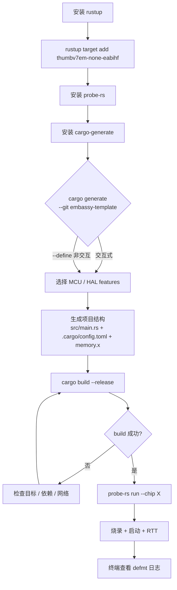

# 24 - Embassy 开发环境配置指南

> 适用版本: Embassy `0.5+`(基于 `embassy-executor = "0.5"` 等)
> 适用平台: STM32(F4/H7/L4 等)/ nRF52/53 / RP2040 / RP235x
> 阅读时长: ~25 分钟
> 配套文档: `25-debugging.md`(调试工具链)/ `26-testing.md`(测试工具链)

---

## 目录

1. [开发环境在 Embassy 学习中的位置](#1-开发环境在-embassy-学习中的位置)
2. [工具链组成与原理](#2-工具链组成与原理)
3. [项目脚手架:从模板到可执行文件](#3-项目脚手架从模板到可执行文件)
4. [三平台烧录命令速查表](#4-三平台烧录命令速查表)
5. [构建配置:`rust-toolchain.toml` 与 `.cargo/config.toml`](#5-构建配置rust-toolchaintoml-与-cargoconfigtoml)
6. [实战示例:从零搭建闪灯项目](#6-实战示例从零搭建闪灯项目)
7. [速查表 + 故障排查清单](#7-速查表--故障排查清单)

---

## 1. 开发环境在 Embassy 学习中的位置

Embassy 是一套"编译时驱动的异步嵌入式框架",其开发体验与传统 RTOS(基于 C + CMSIS)有显著差异。本文档聚焦"动手前必装"的工具链与项目结构,是 M2-M6 已分析源码的"前置门":读者在阅读 `embassy-executor` / `embassy-sync` / `embassy-time` 等 crate 的源码前,需先能在本地编译并烧录示例。

### 1.1 工具链在 Embassy 工作流中的角色

Embassy 项目的"开发 → 烧录 → 调试 → 测试"四阶段对工具链的依赖如下表所示:

| 阶段 | 关键工具 | 输出 |
|------|----------|------|
| 编译 | rustc + 目标 triple(thumbv7em-none-eabihf 等) + defmt 宏 | `.elf` 调试符号 + `.bin` 烧录镜像 |
| 烧录 | probe-rs(`run` / `flash` / `attach`) | MCU 内部 flash 写入 |
| 调试 | probe-rs(`debug` / `rtt`) + defmt-print | 主机终端实时日志 |
| 测试 | QEMU(`qemu-system-arm`)+ embassy-test + test-log | CI 中的 PASS/FAIL 报告 |

### 1.2 与 M1-M6 已分析模块的关联

- M2.1 `embassy-executor` 涉及 `#[embassy_executor::main]` 宏,本文档 §3 会展示该宏的最小使用模板
- M2.2 `embassy-time` 涉及 `embassy_time::Timer`,本文档 §6 实战示例包含其用法
- M3.2/3.3/3.4 三平台 HAL 涉及 `embassy-stm32::init()` / `embassy-nrf::init()` / `embassy-rp::init()` 入口,本文档 §5 给出三平台对应的 `Cargo.toml` features 配置
- M4.1 GPIO 涉及 `Output::new()`,本文档 §6 实战示例完整使用

### 1.3 三平台支持现状(基于 `examples/` 目录)

`examples/` 目录中可直接编译运行的平台(截至 Embassy `0.5+`):

- STM32 系列:`stm32f3` / `stm32f4` / `stm32f7` / `stm32h7` / `stm32l0` / `stm32l1` / `stm32l4` / `stm32wb-dfu` / `stm32wba-dfu` / `stm32wl`
- nRF 系列:`nrf51` / `nrf52810` / `nrf52840`
- RP 系列:`rp` / `rp235x`
- 其他:`lpc55s69` / `mcxa2xx` / `mcxa5xx` / `microchip` / `mimxrt1011` / `mimxrt1062-evk` / `mimxrt6` / `mps3-an536` / `mspm0*`(7 个子系列)

每个平台子目录都包含 `Cargo.toml` + `build.rs` + `src/bin/blinky.rs`,这是本文档的工具链验证基准。

---

## 2. 工具链组成与原理

Embassy 项目依赖五类核心工具,缺一不可。下文按"用途 → 安装 → 验证 → 关键原理"四步展开。

### 2.1 rustup:Rust 工具链管理器

**用途**:管理 Rust 编译器(`rustc`)、包管理(`cargo`)、标准库与 cross-compile 目标。

**安装**:

```bash
# Linux / macOS
curl --proto '=https' --tlsv1.2 -sSf https://sh.rustup.rs | sh

# Windows(下载 rustup-init.exe)
# https://rustup.rs/
```

**验证**:`rustc --version` 应输出 `rustc 1.75.0` 或更高。

**关键原理**:`rustup target add <triple>` 会下载预编译标准库到 `~/.rustup/toolchains/<toolchain>/lib/rustlib/<triple>/lib`。Embassy 项目需要 `thumbv6m-none-eabi`(RP2040)/ `thumbv7em-none-eabihf`(STM32F4/nRF52)/ `thumbv8m.main-none-eabihf`(Cortex-M33)三个目标。

### 2.2 cargo:Rust 包管理与构建工具

**用途**:依赖解析、编译、运行测试、生成文档。

**验证**:`cargo --version` 应输出 `cargo 1.75.0` 或更高(与 rustc 同版本)。

**关键原理**:`cargo` 读取 `Cargo.toml` 中的 `[dependencies]` 与 `[features]`,通过 feature unification(默认开启)决定启用哪些代码路径。Embassy 项目的 HAL crate 通常用 features 区分芯片(如 `embassy-stm32 = { version = "0.1", features = ["stm32f411ce", "time-driver-tim1"] }`)。

### 2.3 probe-rs:烧录 + 调试 + RTT 一体化工具

**用途**:替代传统 OpenOCD + GDB 链路,提供开箱即用的烧录/调试/RTT 日志功能。

**安装**:

```bash
# Linux / macOS(Homebrew)
brew install probe-rs

# Linux(包管理器)
# Arch: pacman -S probe-rs
# Debian / Ubuntu: cargo install probe-rs-tools

# Windows
winget install probe-rs.probe-rs
# 或 scoop install probe-rs
```

**验证**:`probe-rs --version` 应输出 `probe-rs 0.24.0` 或更高;`probe-rs list` 应列出当前插入的调试探针。

**关键原理**:`probe-rs` 通过 CMSIS-DAP / ST-Link / J-Link 等协议与 MCU 通信,内置对 RTT(Real-Time Transfer)协议的支持。当代码通过 `defmt-rtt` 输出日志时,probe-rs 读取 MCU 内存中的 RTT 控制块并解码 defmt 帧。

### 2.4 defmt 工具链:零成本嵌入式日志

**用途**:在 MCU 端用 `defmt::info!` 打印日志,通过 RTT 传输到主机,由 `defmt-print` 解码。

**安装**:`defmt-print` 随 probe-rs 一起安装;`defmt` 库通过 `Cargo.toml` 引入:

```toml
defmt = "0.3"
defmt-rtt = "0.4"
```

**验证**:在代码中加 `defmt::info!("Hello");` + `defmt::println!("count: {}", n);`,运行 `probe-rs run --chip <chip>` 应在主机终端看到解码后的日志。

**关键原理**:defmt 编译期编码日志格式字符串为索引 ID,二进制仅存储参数值,体积比 `core::fmt` 小 5-10 倍。`defmt-print` 端通过 RTT 接收索引 + 参数并按主机端 ELF 的 `.defmt` 段元数据还原格式字符串。

### 2.5 cargo-generate:从模板生成项目

**用途**:快速创建符合 Embassy 约定的 Cargo 项目结构,避免手写 `.cargo/config.toml` / `memory.x`。

**安装**:`cargo install cargo-generate`(需 ~2 分钟编译)。

**验证**:`cargo generate --help` 应输出帮助信息。

**关键原理**:`cargo-generate` 解析 Git 仓库中的 `cargo-generate.toml` + Liquid 模板,根据用户回答渲染 `Cargo.toml` / `src/main.rs` / `rust-toolchain.toml` 等文件。`embassy-template` 仓库即采用此模式。

### 2.6 工具链最小版本要求(速查)

| 工具 | 最低版本 | 推荐版本 | 验证命令 |
|------|----------|----------|----------|
| rustc / cargo | 1.75 | 最新 stable | `rustc --version` |
| probe-rs | 0.24 | 0.27+ | `probe-rs --version` |
| defmt | 0.3 | 0.3 | `cargo tree | grep defmt` |
| defmt-print | 0.14 | 随 probe-rs | `defmt-print --version` |
| cargo-generate | 0.18 | 最新 | `cargo generate --version` |

---

## 3. 项目脚手架:从模板到可执行文件

Embassy 项目有两种创建路径:交互式(`cargo generate` 引导)与非交互式(CI 用 `--define` 参数)。下文以官方 `embassy-rs/embassy-template` 为例。

### 3.1 交互式生成(初学者路径)

```bash
# 安装 cargo-generate(已装则跳过)
cargo install cargo-generate

# 交互式生成
cargo generate --git https://github.com/embassy-rs/embassy-template --name my-app
```

交互式向导会询问:

```
? Select MCU family ›
  ⦿ STM32
    ⦿ nRF
    ⦿ RP
    ⦿ ESP32
    ...

? Select specific chip ›
  ⦿ STM32F411CEUx
    ⦿ STM32H743ZITx
    ...

? Select HAL features ›
  ⦿ defmt
  ⦿ time-driver-tim1
  ⦿ exti
  ⦿ ...
```

回答完成后,`my-app/` 目录包含以下关键文件(以 STM32F411 为例):

```
my-app/
├── .cargo/
│   └── config.toml          # target + runner + rustflags
├── src/
│   └── main.rs              # #[embassy_executor::main] 入口
├── Cargo.toml                # embassy-* 依赖
├── rust-toolchain.toml       # stable + thumbv7em-none-eabihf
├── build.rs                  # Embassy build script
└── memory.x                  # 链接脚本(FLASH/RAM 地址)
```

### 3.2 非交互式生成(CI 友好)

```bash
cargo generate \
  --git https://github.com/embassy-rs/embassy-template \
  --name my-app \
  --define mcu=STM32F411CEUx \
  --define hal=stm32 \
  --define features=defmt,time-driver-tim1
```

`--define` 跳过所有交互提示,适合 CI 中批量生成项目。

### 3.3 验证项目可构建

```bash
cd my-app
cargo build --release
# 预期:成功生成 target/thumbv7em-none-eabihf/release/my-app.elf
```

如失败,常见原因:目标未装(`rustup target add thumbv7em-none-eabihf`)、网络问题(换 `sparse-registry`)、`defmt-print` 缺失(随 probe-rs)。

### 3.4 验证项目可烧录

将开发板通过 USB 连接到主机:

```bash
probe-rs run --chip STM32F411CEUx target/thumbv7em-none-eabihf/release/my-app.elf
# 预期:烧录进度条 → 启动 → RTT 日志输出
```

`probe-rs run` 一体化完成"烧录 + 启动 + 附加 RTT 监听"三步。

### 3.5 项目脚手架流程图



### 3.6 embassy-template 的版本漂移风险

`embassy-template` 仓库与 embassy 主仓库是**独立版本节奏**。常见漂移:

- 模板默认芯片落后于 embassy 最新支持(模板可能不含 `STM32H7RS` 新系列)
- 模板的 `Cargo.toml` 依赖版本可能要求 embassy 旧版本(如 `embassy-stm32 = "0.1.0"` 而非 `0.2.0`)

应对:`cargo generate` 完成后,先 `git log` 模板仓库,或参考 embassy 主仓库 `examples/<platform>/` 目录的最新 `Cargo.toml` 修正。

---

## 4. 三平台烧录命令速查表

下表是 M7.1 的核心速查内容。命令以 `probe-rs` 为主,`--chip` 参数从 probe-rs 内置芯片数据库获取(`probe-rs chip list | grep <keyword>` 查询)。

### 4.1 STM32 平台

| 芯片 | `--chip` 参数 | 目标 triple | 烧录命令 |
|------|---------------|-------------|----------|
| STM32F411CEUx(Nucleo-F411)| `STM32F411CEUx` | `thumbv7em-none-eabihf` | `probe-rs run --chip STM32F411CEUx target/thumbv7em-none-eabihf/release/app.elf` |
| STM32H743ZITx(Nucleo-H743)| `STM32H743ZITx` | `thumbv7em-none-eabihf` | `probe-rs run --chip STM32H743ZITx target/thumbv7em-none-eabihf/release/app.elf` |
| STM32L476RG(Nucleo-L476)| `STM32L476RGTx` | `thumbv7em-none-eabihf` | `probe-rs run --chip STM32L476RGTx target/thumbv7em-none-eabihf/release/app.elf` |
| STM32WL55JC1 | `STM32WL55JCIX` | `thumbv7em-none-eabihf` | `probe-rs run --chip STM32WL55JCIX target/thumbv7em-none-eabihf/release/app.elf` |
| STM32WB55RG | `STM32WB55RG` | `thumbv7em-none-eabihf` | `probe-rs run --chip STM32WB55RG target/thumbv7em-none-eabihf/release/app.elf` |

注:STM32 默认使用板上 ST-Link 探针;如用外部 J-Link,加 `--probe <serial>`。

### 4.2 nRF 平台

| 芯片 | `--chip` 参数 | 目标 triple | 烧录命令 |
|------|---------------|-------------|----------|
| nRF52840 DK | `nRF52840_xxAA` | `thumbv7em-none-eabihf` | `probe-rs run --chip nRF52840_xxAA target/thumbv7em-none-eabihf/release/app.elf` |
| nRF52833 DK | `nRF52833_xxAA` | `thumbv7em-none-eabihf` | `probe-rs run --chip nRF52833_xxAA target/thumbv7em-none-eabihf/release/app.elf` |
| nRF52810 | `nRF52810_xxAA` | `thumbv7em-none-eabihf` | `probe-rs run --chip nRF52810_xxAA target/thumbv7em-none-eabihf/release/app.elf` |
| nRF52832 | `nRF52832_xxAA` | `thumbv7em-none-eabihf` | `probe-rs run --chip nRF52832_xxAA target/thumbv7em-none-eabihf/release/app.elf` |
| nRF5340(netcore)| `nRF5340_xxAA` | `thumbv8m.main-none-eabihf` | `probe-rs run --chip nRF5340_xxAA target/thumbv8m.main-none-eabihf/release/app.elf` |

注:nRF 默认需要外部 J-Link 或 CMSIS-DAP;Nordic 自家 DK 用板载 JLINK-OB。

### 4.3 RP 平台

| 芯片 | `--chip` 参数 | 目标 triple | 烧录命令 |
|------|---------------|-------------|----------|
| RP2040(Pico) | `RP2040` | `thumbv6m-none-eabi` | `probe-rs run --chip RP2040 target/thumbv6m-none-eabi/release/app.elf` |
| RP235X(Pico 2)| `RP235x` | `thumbv8m.main-none-eabihf` | `probe-rs run --chip RP235x target/thumbv8m.main-none-eabihf/release/app.elf` |

注:RP2040 需先用 `picotool` 或按住 BOOTSEL 烧录 UF2(首次);之后用 probe-rs 即可。

### 4.4 烧录 vs 附加 vs 调试的差异

probe-rs 提供三个常用子命令,功能各异:

| 命令 | 用途 | 启动 MCU | 加载代码 |
|------|------|----------|----------|
| `probe-rs run` | 烧录 + 启动 + RTT | 是 | 总是烧录 |
| `probe-rs flash` | 仅烧录(不启动)| 否 | 总是烧录 |
| `probe-rs attach` | 附加到运行中的 MCU + RTT | 否(已在运行) | 否 |

典型场景:

- 日常开发:`probe-rs run`(一键)
- 验证烧录文件正确性:`probe-rs flash`
- 调试"运行中"行为(不打断):`probe-rs attach`

### 4.5 probe-rs 高级选项

```bash
# 指定 probe(多探针场景)
probe-rs run --chip <chip> --probe <VID:PID> ...

# 慢速烧录(老旧/差质量线)
probe-rs run --chip <chip> --probe-clockspeed 100_000 ...

# 烧录后立即复位
probe-rs run --chip <chip> --reset-halt

# 跳过擦除(写裸 flash 时)
probe-rs run --chip <chip> --skip-erase
```

---

## 5. 构建配置:`rust-toolchain.toml` 与 `.cargo/config.toml`

Embassy 项目的"工具链声明 + 链接脚本"完全由两个 TOML 文件承载。这是初学者最常踩坑的环节。

### 5.1 `rust-toolchain.toml`:声明 Rust 工具链

最小配置(STM32F4 为例):

```toml
# rust-toolchain.toml
[toolchain]
channel = "stable"               # 或 "nightly" / 具体版本如 "1.79.0"
targets = [
    "thumbv7em-none-eabihf",     # Cortex-M4F(含 FPU)
    "thumbv6m-none-eabi",        # RP2040 需要(共用一个工具链)
]
components = [
    "rustfmt",
    "clippy",
]
profile = "minimal"              # 仅装必要组件
```

字段解释:

- `channel`:稳定版(推荐)/ nightly(部分 feature gate 需 nightly)
- `targets`:cross-compile 目标列表,每个目标第一次编译时会下载预编译标准库
- `components`:必装组件,`rustfmt` 与 `clippy` 强烈推荐
- `profile`:`minimal`(精简)/ `default`(含 rust-docs 等)/ `complete`

### 5.2 `.cargo/config.toml`:target + runner + rustflags

最小配置(STM32F411):

```toml
# .cargo/config.toml
[build]
target = "thumbv7em-none-eabihf"

[target.thumbv7em-none-eabihf]
runner = "probe-rs run --chip STM32F411CEUx"
rustflags = [
    "-C", "link-arg=-Tlink.x",                # cortex-m-rt 链接脚本
    "-C", "link-arg=-Tdefmt.x",                # defmt 链接段
    "-C", "link-arg=-Trom_functions.x",       # Embassy ROM 函数表(若启用)
]

[env]
DEFMT_LOG = "info"                             # 全局日志级别
```

关键字段:

- `[build].target`:全局默认目标,`cargo build` 不带 `--target` 时使用
- `[target.<triple>].runner`:`cargo run` 时调用的烧录命令,`cargo run` 等价于 `probe-rs run`
- `[target.<triple>].rustflags`:编译期传递的链接选项,`link-arg` 将参数转发给 `rust-lld`(嵌入式 linker)
- `[env].DEFMT_LOG`:defmt 全局日志级别,可被代码中的 `static_assertions` 覆盖

### 5.3 `memory.x`:链接脚本

`memory.x` 告诉 linker FLASH / RAM 的地址与大小,必须与芯片参考手册一致:

```ld
/* memory.x - STM32F411CEUx 链接脚本 */
MEMORY
{
  FLASH (rx)  : ORIGIN = 0x08000000, LENGTH = 512K
  RAM   (rwx) : ORIGIN = 0x20000000, LENGTH = 128K
}
```

字段解释:

- `ORIGIN`:段起始地址,从芯片数据手册"Memory Map"章节获取
- `LENGTH`:段大小,STM32F411 为 512KB Flash + 128KB RAM
- `(rx)` / `(rwx)`:权限,Flash 只读执行,RAM 读写执行

### 5.4 跨平台配置差异速查表

| 平台 | `target` | 关键 `link-arg` | `memory.x` 来源 |
|------|----------|------------------|------------------|
| STM32F4 | `thumbv7em-none-eabihf` | `-Tlink.x` `-Tdefmt.x` | 手写(查 reference manual)|
| STM32H7 | `thumbv7em-none-eabihf` | 同上 | 手写(注意 D1/D2/D3 三段 RAM)|
| nRF52840 | `thumbv7em-none-eabihf` | 同上 | 手写(1MB Flash + 256KB RAM)|
| RP2040 | `thumbv6m-none-eabi` | 同上 | embassy-rp 默认提供 |
| RP235X | `thumbv8m.main-none-eabihf` | 同上 | embassy-rp 提供 |

注:RP 平台的 `memory.x` 由 `embassy-rp` crate 在 `link.x` 中提供,无需手写。

### 5.5 Cargo features 选型(以 STM32 为例)

```toml
# Cargo.toml
[dependencies]
embassy-stm32 = { version = "0.1", features = [
    "stm32f411ce",          # 具体芯片
    "time-driver-tim1",     # TIM1 作 embassy-time 时间源
    "exti",                 # 外部中断
    "defmt",                # defmt 日志集成
] }
embassy-executor = { version = "0.5", features = ["defmt"] }
embassy-time = { version = "0.4", features = ["defmt"] }
embassy-futures = "0.1"
defmt = "0.3"
defmt-rtt = "0.4"

[profile.release]
debug = true                # release 模式保留调试符号(probe-rs 需要)
opt-level = "s"             # 优化体积
lto = true                  # 链接期优化
codegen-units = 1
incremental = false
```

`[profile.release]` 的 `debug = true` 关键:probe-rs 与 defmt-print 都需要 ELF 包含调试符号才能解码 RTT 数据。

---

## 6. 实战示例:从零搭建闪灯项目

本节以 STM32F411 Nucleo 为例,展示"生成 → 配置 → 编译 → 烧录"全流程。代码同时适用于 nRF / RP,只需替换 `embassy-stm32` 为 `embassy-nrf` / `embassy-rp`。

### 6.1 生成项目

```bash
cargo generate --git https://github.com/embassy-rs/embassy-template --name blinky
cd blinky
```

### 6.2 编写 `src/main.rs`

完整 50 行可编译代码:

```rust
#![no_std]
#![no_main]

use defmt::info;
use embassy_executor::Spawner;
use embassy_stm32::gpio::{Level, Output, Speed};
use embassy_time::Timer;
use {defmt_rtt as _, panic_probe as _};

// Cortex-M 入口由 embassy_executor::main 包装
#[embassy_executor::main]
async fn main(spawner: Spawner) {
    // HAL 初始化:具体芯片 + 时钟配置
    let p = embassy_stm32::init(Default::default());

    // 配置 LED 引脚(Nucleo-F411 上 LED 接 PA5,LD2 绿色)
    let mut led = Output::new(p.PA5, Level::Low, Speed::Low);

    // 启动后台心跳任务
    spawner.spawn(heartbeat(&mut led)).unwrap();

    info!("Main loop done; LED task running.");
}

#[embassy_executor::task]
async fn heartbeat(led: &'static mut Output<'static, embassy_stm32::peripherals::PA5>) {
    loop {
        info!("LED on");
        led.set_high();
        Timer::after_millis(500).await;

        info!("LED off");
        led.set_low();
        Timer::after_millis(500).await;
    }
}
```

代码要点:

- `#![no_std]` + `#![no_main]`:嵌入式无标准库入口
- `use {defmt_rtt as _, panic_probe as _}`:链接 RTT 接收器与 panic handler
- `#[embassy_executor::main]`:宏展开为 `cortex-m-rt` 入口 + Executor::run
- `embassy_stm32::init()`:返回 `Peripherals` 结构,包含所有外设所有权
- `&'static mut Output<...>`:任务需要 `'static` 生命周期,这是 Embassy 与 Tokio 的关键差异(无栈分配)

### 6.3 配置 `.cargo/config.toml`

```toml
[build]
target = "thumbv7em-none-eabihf"

[target.thumbv7em-none-eabihf]
runner = "probe-rs run --chip STM32F411CEUx"
rustflags = [
    "-C", "link-arg=-Tlink.x",
    "-C", "link-arg=-Tdefmt.x",
]
```

### 6.4 配置 `rust-toolchain.toml`

```toml
[toolchain]
channel = "stable"
targets = ["thumbv7em-none-eabihf"]
components = ["rustfmt", "clippy"]
profile = "minimal"
```

### 6.5 编译

```bash
cargo build --release
# 首次编译:5-10 分钟(下载 + 编译 embassy-* 依赖)
# 后续增量编译:5-15 秒
```

### 6.6 烧录并查看日志

```bash
probe-rs run --chip STM32F411CEUx target/thumbv7em-none-eabihf/release/blinky
```

预期输出(主机终端):

```
(1) INFO  LED on
(2) INFO  LED off
(3) INFO  LED on
...
```

`()` 中的数字是 defmt 内部时间戳(单位为毫秒,需启用 `defmt::timestamp!()`)。同时开发板上的绿色 LED 应以 0.5Hz 频率闪烁。

### 6.7 跨平台等价示例

**nRF52840 DK(替换 HAL)**:

```rust
use embassy_nrf::gpio::{Level, Output, OutputDrive};
// ...
let mut led = Output::new(p.P0_13, Level::Low, OutputDrive::Standard);
```

**RP2040 Pico(替换 HAL + 启动模式)**:

```rust
use embassy_rp::gpio::{Level, Output};
// ...
let mut led = Output::new(p.PIN_25, Level::Low);
```

三平台代码差异极小,仅在 HAL crate 名称与引脚编号上。这是 Embassy"跨平台异步核心 + 平台薄壳"设计的具体体现。

---

## 7. 速查表 + 故障排查清单

### 7.1 一页式命令速查

| 任务 | 命令 |
|------|------|
| 安装工具链 | `curl --proto '=https' --tlsv1.2 -sSf https://sh.rustup.rs | sh` |
| 安装 probe-rs | `brew install probe-rs`(或 `cargo install probe-rs-tools`)|
| 安装 cargo-generate | `cargo install cargo-generate` |
| 添加 cross-compile 目标 | `rustup target add thumbv7em-none-eabihf` |
| 生成项目 | `cargo generate --git https://github.com/embassy-rs/embassy-template --name my-app` |
| 编译 | `cargo build --release` |
| 烧录 + 运行 + RTT | `probe-rs run --chip <CHIP> target/<triple>/release/<app>.elf` |
| 仅烧录 | `probe-rs flash --chip <CHIP> target/<triple>/release/<app>.elf` |
| 附加运行中 MCU | `probe-rs attach --chip <CHIP> target/<triple>/release/<app>.elf` |
| 列出支持芯片 | `probe-rs chip list` |
| 列出当前探针 | `probe-rs list` |
| 清理构建 | `cargo clean` |
| 更新依赖 | `cargo update -p embassy-stm32` |

### 7.2 故障排查(8 类常见问题)

**问题 1:`rust-lld: error: undefined symbol __defmt_default_FOO`**

根因:链接时未指定 `defmt.x`。

解决:在 `.cargo/config.toml` 中加入 `-C link-arg=-Tdefmt.x`,或检查 defmt-rtt 依赖是否在 `Cargo.toml`。

---

**问题 2:`error: linker 'rust-lld' not found`**

根因:某些 Rust 工具链未自动安装 `rust-lld`。

解决:`rustup component add rust-lld` 或 `rustup component add llvm-tools`。

---

**问题 3:`probe-rs: failed to find a probe`**

根因:USB 权限(Linux)或驱动(Windows)。

解决:
- Linux:`sudo cp 99-probe-rs.rules /etc/udev/rules.d/ && sudo udevadm control --reload-rules && sudo udevadm trigger`(probe-rs 仓库提供 udev 规则)
- macOS:无需驱动,检查 USB 集线器
- Windows:用 Zadig 安装 WinUSB 驱动

---

**问题 4:`RUSTC error: can't find crate for 'core'`**

根因:cross-compile 目标未装。

解决:`rustup target add <triple>`(`triple` 见 §4 各平台表)。

---

**问题 5:`probe-rs run` 卡在 "Initializing**"**

根因:目标芯片 flash 锁定或 OPT 字节配置错误。

解决:长按 RESET 按钮 + 重新烧录,或 `probe-rs erase` 擦除后重试。

---

**问题 6:`defmt::info!` 在终端看不到任何输出**

根因:`defmt-rtt` 未在初始化时调用 `rtt_init_print!()`,或 RTT 缓冲太小。

解决:在 `src/main.rs` 顶部加 `use defmt_rtt as _;`,且确认 `[env] DEFMT_LOG = "info"` 在 `.cargo/config.toml` 中。

---

**问题 7:`error: linking with `rust-lld` failed: duplicate symbol`**

根因:`#[embassy_executor::task]` 被多次定义或 `static_cell` 分配重复。

解决:用 `static_cell::make_static!` 宏包装 task storage,确保每个 task 只有一个 `static` 实例。

---

**问题 8:`probe-rs: no memory regions defined`**

根因:target 描述文件(`target/<chip>.x`)与芯片不匹配。

解决:升级 probe-rs 到最新版(`cargo install probe-rs-tools --force`),并确认 `Cargo.toml` 中 `embassy-stm32` 的 features 包含正确芯片名(如 `stm32f411ce` 而非 `stm32f411`)。

### 7.3 工具链升级路径

| 升级项 | 注意事项 |
|--------|----------|
| Rust stable | 关注 embassy 依赖的 MSRV(最低支持版本),通常 1.75+ |
| probe-rs | 升级后芯片数据库变化,可能需要更新 `Cargo.toml` 的 features |
| defmt | 0.2 → 0.3 升级涉及 API 变化(`defmt::println!` → `defmt::info!` 重命名等) |
| cargo-generate | 模板语法 `liquid` 升级可能影响 embassy-template |

### 7.4 CI 集成预备

本文档覆盖本地开发工具链;CI 集成(`.github/workflows/tests.yml` 完整配置)详见 M7.3 `26-testing.md` §6。

---

## 总结

Embassy 开发环境的"五件套"——rustup、cargo、probe-rs、defmt 工具链、cargo-generate——构成了"编译 → 烧录 → 调试 → 测试"的完整闭环。三平台(STM32 / nRF / RP)的 `probe-rs run` 命令在 §4 速查表中可直接定位;构建配置的关键文件 `rust-toolchain.toml` / `.cargo/config.toml` / `memory.x` 模板见 §5;§6 的闪灯示例可作为后续所有项目的最小起点。

下一阶段:M7.2 `25-debugging.md` 深入 defmt + RTT + probe-rs debug 的调试技巧。
