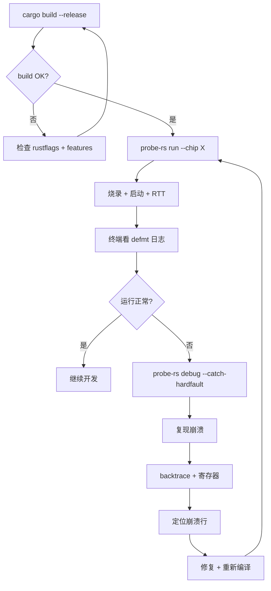

# 25 - Embassy 调试与日志最佳实践

> 适用版本: Embassy `0.5+`
> 适用平台: STM32(F4/H7/L4 等)/ nRF52/53 / RP2040 / RP235x
> 阅读时长: ~22 分钟
> 前置阅读: `24-dev-setup.md`(工具链基础)
> 配套文档: `26-testing.md`(测试集成)

---

## 目录

1. [调试在 Embassy 开发中的位置](#1-调试在-embassy-开发中的位置)
2. [defmt 框架:零成本嵌入式日志](#2-defmt-框架零成本嵌入式日志)
3. [RTT 链路:MCU 内存到主机终端](#3-rtt-链路mcu-内存到主机终端)
4. [三平台 RTT 与调试器配置差异](#4-三平台-rtt-与调试器配置差异)
5. [probe-rs 调试会话:断点 / 单步 / 观察](#5-probe-rs-调试会话断点--单步--观察)
6. [故障排查清单(8 类常见问题)](#6-故障排查清单8-类常见问题)
7. [实战:HardFault 栈回溯 + panic_handler 集成](#7-实战hardfault-栈回溯--panic_handler-集成)

---

## 1. 调试在 Embassy 开发中的位置

调试是 M7 学习里程碑的第二环。`24-dev-setup.md` 解决了"代码能烧到板子并跑起来",本文档解决"跑起来后怎么知道内部发生了什么"。Embassy 的调试模式与传统 RTOS(基于 C + printf + GDB)有显著差异:无标准库、无操作系统、无 `printf`、无 GDB 命令链;取而代之的是 defmt + RTT + probe-rs 三件套。

### 1.1 调试 vs 测试的边界

| 维度 | 调试 | 测试 |
|------|------|------|
| 目标 | 找出"运行中"代码的 bug | 提前发现"未运行"代码的 bug |
| 工具 | defmt + RTT + probe-rs debug | QEMU + embassy-test + test-log |
| 时机 | 运行时(开发板上)| 编译期 / CI 期(主机或 QEMU) |
| 反馈延迟 | 即时(秒级) | 异步(分钟级 CI) |
| 适用场景 | 实时性、异步交互、外设时序 | 单元逻辑、状态机、协议解析 |

详细测试策略见 M7.3 `26-testing.md`。本文档聚焦"开发板正在运行时"。

### 1.2 调试在 Embassy 异步上下文中的特殊性

Embassy 是单线程协作式调度,所有任务在主线程上通过 `Future::poll` 切换。这意味着:

- 调试时**无线程切换**:断点停在某 `await`,仅该任务让出,其他任务不抢占
- 调试时**无中断竞争**:大部分 `defmt::info!` 在任务上下文中执行,不会与中断日志交错
- 调试时**栈帧较深**:每个任务有自己的栈,但主循环栈帧包含 executor + 当前 poll 的任务

这三点使 Embassy 调试比传统 RTOS 简单——没有锁、没有优先级反转、没有中断嵌套需要操心。

### 1.3 与 M1-M6 已分析模块的关联

- M2.1 `embassy-executor` 的 `Executor::run` 主循环是"任务切换点",调试时观察此处可理解"为什么这个任务没运行"
- M2.2 `embassy-time` 的 `Timer::after()` 涉及 alarm 机制,RTT 日志可看到定时器触发时序
- M2.3 `embassy-sync` 的 `Channel` / `Signal` / `PubSubChannel` 在调试时需要确认"谁在等谁"(见 `examples/nrf52840/src/bin/multiprio.rs:59` 等多优先级示例)
- M4.1 GPIO 中断的 `#[interrupt]` 函数可能调用 `defmt::error!` 报告异常,本文档 §7 给出与 `panic_handler` 的协作
- M4.2 UART 异步接收:在 RTT 日志中可观察"哪些字节被丢弃"以排查协议错(M5.1 `17-net.md` 也有 defmt 网络日志参考)
- M6.1 `embassy-boot` 在 panic 时的复位路径:本节 §7.4 的栈回溯与 boot 状态机回滚的关联
- M6.3 低功耗:在 WFE / deep sleep 期间的 RTT 日志会被"冻结",唤醒后批量输出,这是 M6.3 与本文档的交叉点

---

## 2. defmt 框架:零成本嵌入式日志

defmt(发音 "de-fmt")是 Embassy 生态默认的日志框架,设计目标是"在资源受限的 MCU 上提供近乎零成本的格式化输出"。

### 2.1 defmt 与 core::fmt 的对比

| 维度 | `core::fmt` | defmt |
|------|-------------|-------|
| 编译期体积 | 格式字符串保留在二进制 | 格式字符串编码为 ID,二进制仅存参数 |
| 体积开销 | 5-50 KB | < 1 KB |
| 运行时开销 | 每次 print 都格式化 | 仅序列化参数值 |
| 主机端解码 | 无需解码 | 需要 defmt-print 配合 ELF |
| 适用场景 | 通用 Rust | 嵌入式 / 资源受限 |

### 2.2 基础 API

```rust
use defmt::{info, warn, error, debug, trace, panic};

defmt::info!("Booting Embassy");
defmt::warn!("Battery low: {}%", battery);
defmt::error!("I2C timeout after {} ms", timeout_ms);
defmt::debug!("SPI transfer: rx_len={} tx_len={}", rx.len(), tx.len());
defmt::trace!("task wake: count={}", count);
defmt::panic!("unreachable");  // 类似 panic!() 但通过 defmt 报告
```

日志级别:`trace` < `debug` < `info` < `warn` < `error`。运行时级别通过环境变量 `DEFMT_LOG` 控制(在 `.cargo/config.toml` 中设置或编译时 `-C link-arg=-DDEFMT_LOG=info`)。

### 2.3 格式化占位符

defmt 的占位符语义与 `core::fmt` 略有差异:

| 形式 | 含义 | 示例 |
|------|------|------|
| `{}` | 推断类型 | `defmt::info!("{}", 42)` |
| `{=u8}` / `{=u16}` / `{=u32}` / `{=u64}` | 显式指定无符号类型 | `defmt::info!("count={=u32}", n)` |
| `{=i8}` ... `{=i64}` | 显式指定有符号类型 | |
| `{=str}` | 字符串字面量(编译期已知) | `defmt::info!("msg={=str}", "boot")` |
| `{=?}` | Debug 格式化 | `defmt::info!("data={=?}", buffer)` |
| `{=vec}` | 数组/Vec 元素 | `defmt::info!("buf={=vec}", &buf)` |
| `{=bool}` | 布尔 | `defmt::info!("ready={=bool}", is_ready)` |

`{=u32}` 这类显式占位符是 defmt 的特色:无需在主机端持有类型元数据,体积更小。

### 2.4 时间戳

defmt 默认无时间戳,需手动接入 `defmt::timestamp!()`:

```rust
// 自定义时间戳源(以 embassy-time 为例)
defmt::timestamp!("{=u64}", {
    // 返回自启动以来的微秒数
    embassy_time::Instant::now().as_micros()
});
```

在 `.cargo/config.toml` 中启用:

```toml
[env]
DEFMT_LOG = "info"
```

时间戳格式:`(1234567) INFO message`,括号内为时间戳值。

### 2.5 defmt 与 panic_handler 集成

`#[panic_handler]` 是 `core::panic` 要求的符号,需用户提供(参考 `examples/microchip/src/bin/blinky.rs:8` 与 `examples/lpc55s69/src/bin/blinky_embassy_time.rs:8` 的不同 panic handler 选型):

```rust
use defmt::panic;
use cortex_m::asm;

#[panic_handler]
fn panic(info: &core::panic::PanicInfo) -> ! {
    defmt::panic!("PANIC: {}", defmt::Display2Format(info));
    // Display2Format 让 PanicInfo 可被 defmt 格式化
    asm::udf()  // udf 触发 HardFault,方便 probe-rs 抓取 PC
}
```

或使用 `panic-probe` / `panic-halt` / `panic-reset` 等现成 crate:

| 库 | 行为 | 适用场景 |
|----|------|----------|
| `panic-halt` | 立即进入死循环 | 资源极受限 |
| `panic-reset` | 软复位 MCU | 简单恢复 |
| `panic-probe` | 打印栈回溯 + 进入死循环 | 开发期推荐 |

import 写法:

```rust
use {defmt_rtt as _, panic_probe as _};  // 开发期
use {defmt_rtt as _, panic_halt as _};   // 发布期
```

embassy 的 `examples/` 目录两种都有,如 `examples/microchip/src/bin/blinky.rs:8` 用 `panic_probe`,`examples/lpc55s69/src/bin/blinky_embassy_time.rs:8` 用 `panic_halt`。

### 2.6 二进制体积影响

`#[derive(defmt::Format)]` 让自定义类型可被 defmt 格式化:

```rust
use defmt::Format;

#[derive(Format)]
struct SensorReading {
    temperature_c: f32,
    humidity_pct: f32,
}

defmt::info!("reading: {:?}", SensorReading { temperature_c: 23.5, humidity_pct: 65.2 });
// 输出:reading: SensorReading { temperature_c: 23.5, humidity_pct: 65.2 }
```

未派生的类型只能用 `{=?}` 打印其 Debug 形式,且仅当 defmt 支持(基本类型 + 数组 + 字符串)。

---

## 3. RTT 链路:MCU 内存到主机终端

RTT(Real-Time Transfer)是 SEGGER 设计的轻量级日志传输协议,在 Embassy 中通过 `defmt-rtt` 实现 MCU 端,`probe-rs` 实现主机端。

### 3.1 RTT 协议原理

RTT 不使用 UART/SWO 等外设,而是:

1. MCU 在 RAM 中划分一段缓冲区(RTT 控制块 + 上行/下行数据块)
2. 主机(probe-rs)通过调试器(Mem-AP)直接读取 MCU 内存
3. MCU 写入缓冲即返回,主机轮询并解码

优势:

- **零引脚占用**:不占用 UART/SPI 等外设
- **低延迟**:从写入到主机显示 < 1ms
- **双向**:可同时用于日志 + 命令通道
- **零拷贝**:MCU 端无需 memcpy

### 3.2 三方组件:MCU 端 + 主机端

```text
+-----------------+     RTT 协议      +-----------------+
|  MCU 内存区     | <---------------> |  主机 (probe-rs)|
|                 |   (Mem-AP 访问)   |                 |
| defmt-rtt 写    |                   | 读取 + defmt-   |
| → 上行缓冲      |                   | print 解码      |
+-----------------+                   +-----------------+
```

`defmt-rtt`:MCU 端,提供 RTT 后端 + defmt 编码。
`defmt-print` / `probe-rs rtt`:主机端,读取 + 解码 + 输出。
`probe-rs run`:一体化命令,自动启 RTT 监听。

### 3.3 启动 RTT 监听

最简方法:用 `probe-rs run`(同时烧录 + 启动 + RTT)。

```bash
probe-rs run --chip STM32F411CEUx target/thumbv7em-none-eabihf/release/app.elf
# 烧录 → 启动 → RTT 日志自动输出
```

分离烧录与监听:

```bash
# 终端 1:烧录 + 运行
probe-rs run --chip STM32F411CEUx --no-rtt target/.../app.elf

# 终端 2:单独 RTT 监听
probe-rs rtt --chip STM32F411CEUx
```

### 3.4 probe-rs rtt 高级选项

```bash
# 指定 RTT 缓冲扫描范围(默认足够)
probe-rs rtt --rtt-scan-memory

# 启用 RTT 命令通道(双向)
probe-rs rtt --rtt-control-block-address 0x20000000

# 设置日志刷新间隔
probe-rs rtt --rtt-poll-interval-ms 10
```

### 3.5 RTT vs ITM/SWO vs UART 对比

| 维度 | RTT | ITM/SWO | UART |
|------|-----|---------|------|
| 引脚占用 | 无 | 1(SWO)| 2(TX/RX) |
| 带宽 | 高(内存带宽)| 中(ITM FIFO)| 低(115200-921600)|
| 阻塞性 | 无(写入即返回) | 无 | 半双工需等待 |
| 跨调试器 | probe-rs / J-Link / pyOCD | 仅 J-Link / CMSIS-DAP | 任意串口工具 |
| 断电影响 | 缓冲丢失 | FIFO 满后丢失 | 半双工可能阻塞 |
| Embassy 集成 | defmt-rtt(官方)| 不直接支持 | embassy-uart(见 M4.2) |

推荐:**RTT** 是 Embassy 项目的默认选择(已集成在 embassy-template 中)。

---

## 4. 三平台 RTT 与调试器配置差异

三平台在 RTT 实现细节上有微小差异,主要源于 RAM 布局与调试器协议。

### 4.1 STM32 平台

- **RTT 控制块地址**:由 `defmt-rtt` 自动放置在 `.bss` 段(链接器决定)
- **探针**:ST-Link(v2-1 / v3)或外部 J-Link
- **probe-rs 协议**:`--protocol swd`(默认)
- **RTT 内存大小**:默认 1024 字节(可在 `Cargo.toml` 用 `defmt-rtt = { version = "0.4", features = ["buffer-size-512"] }` 调整)

```bash
# 典型 STM32 命令
probe-rs run --chip STM32F411CEUx target/thumbv7em-none-eabihf/release/app.elf
```

### 4.2 nRF 平台

- **RTT 控制块地址**:同 STM32(`.bss` 段)
- **探针**:Nordic nRF DK 板载 JLINK-OB,或外部 CMSIS-DAP
- **probe-rs 协议**:`--protocol swd`
- **RTT 限制**:nRF52832 / nRF52833 的 RAM 较小(64KB / 128KB),需注意 RTT 缓冲与 embassy-sync Channel 不冲突

```bash
# 典型 nRF52840 命令
probe-rs run --chip nRF52840_xxAA target/thumbv7em-none-eabihf/release/app.elf
```

nRF5340(netcore)需用 `thumbv8m.main-none-eabihf` 目标,probe-rs chip 名为 `nRF5340_xxAA` 或 `nRF5340_xxAA_APP` / `nRF5340_xxAA_NET` 区分双核。

### 4.3 RP 平台

- **RTT 控制块地址**:同 STM32
- **探针**:Raspberry Pi Debug Probe(CMSIS-DAP)或 Picoprobe(用第二个 Pico 做探针)
- **probe-rs 协议**:`--protocol swd`
- **RTT 限制**:RP2040 仅有 264KB RAM,无明显限制

```bash
# 典型 RP2040 命令
probe-rs run --chip RP2040 target/thumbv6m-none-eabi/release/app.elf
```

RP235X 类似,目标为 `thumbv8m.main-none-eabihf`,chip 为 `RP235x`。

### 4.4 跨平台 RTT 配置差异速查表

| 平台 | 探针 | probe-rs 协议 | 目标 triple | RTT 缓冲默认 |
|------|------|---------------|-------------|---------------|
| STM32F4/H7/L4 | ST-Link / J-Link | swd | `thumbv7em-none-eabihf` | 1024 B |
| nRF52840/833/832 | JLINK-OB / CMSIS-DAP | swd | `thumbv7em-none-eabihf` | 1024 B |
| nRF5340 | JLINK-OB | swd | `thumbv8m.main-none-eabihf` | 1024 B |
| RP2040 | Picoprobe / Debug Probe | swd | `thumbv6m-none-eabi` | 1024 B |
| RP235X | Picoprobe / Debug Probe | swd | `thumbv8m.main-none-eabihf` | 1024 B |

---

## 5. probe-rs 调试会话:断点 / 单步 / 观察

probe-rs 提供 REPL 风格的调试接口 `probe-rs debug`,类似 gdb 但更简洁。

### 5.1 启动调试会话

```bash
probe-rs debug --chip STM32F411CEUx target/thumbv7em-none-eabihf/release/app.elf
```

进入调试器 REPL,提示符类似 `(gdb)` 风格:

```
probe-rs-debug> 
```

### 5.2 常用命令

| 命令 | 用途 |
|------|------|
| `break <file>:<line>` | 在某行设断点 |
| `break <symbol>` | 在某符号处设断点 |
| `info breakpoints` | 列出所有断点 |
| `delete <num>` | 删除断点 |
| `continue` / `c` | 继续执行到下个断点 |
| `step` / `s` | 单步进入 |
| `next` / `n` | 单步跳过 |
| `print <var>` / `p <var>` | 打印变量 |
| `backtrace` / `bt` | 栈回溯 |
| `info registers` | 寄存器 |
| `quit` | 退出 |

### 5.3 断点示例

```text
probe-rs-debug> break src/main.rs:42
[0] 0x08001234 src/main.rs:42

probe-rs-debug> break embassy_executor::Executor::poll
[1] 0x08002000 embassy_executor::Executor::poll

probe-rs-debug> continue
Hit breakpoint 0 at src/main.rs:42

probe-rs-debug> print count
count = 17

probe-rs-debug> next
Hit breakpoint 0 at src/main.rs:43

probe-rs-debug> continue
```

### 5.4 `#[defmt::dbg]` 自动断点

defmt 提供 `#[defmt::dbg]` 宏,自动打印表达式值,无需手写断点:

```rust
fn complex_function(x: u32, y: u32) -> u32 {
    let z = x * 2;
    defmt::dbg!(z);  // 输出 "z = 42" 到 RTT
    let w = y + z;
    defmt::dbg!(w);  // 输出 "w = 73"
    w
}
```

`defmt::dbg!` 在 release 构建中仍生效,适合"打印中间值而不打断运行"。

### 5.5 异常与 HardFault 排查

当 MCU 进入 HardFault(空指针、未对齐访问、栈溢出、非法指令等),probe-rs 可在异常入口处自动断点:

```bash
probe-rs debug --chip STM32F411CEUx --catch-hardfault target/.../app.elf
```

异常时 REPL 输出:

```
HardFault occurred!
CFSR = 0x00020000
  Unaligned access (UFSR)
HFSR = 0x40000000
  Forced (escalation)
```

`CFSR` / `HFSR` / `BFAR` / `MMFAR` 寄存器值结合栈回溯(`backtrace`)可定位崩溃行。

### 5.6 复位与附加

```bash
# 软复位 MCU
probe-rs reset --chip STM32F411CEUx

# 附加到运行中 MCU(不打断)
probe-rs attach --chip STM32F411CEUx
```

`attach` 不触发复位,适合调试"运行中行为"(如定时器周期、传感器数据流)。

---

## 6. 故障排查清单(8 类常见问题)

### 6.1 链接错误

**症状**:`rust-lld: error: undefined symbol __defmt_default_FOO` 或 `duplicate symbol _defmt_Default_*`

**根因**:

- 未在 `.cargo/config.toml` 中加 `-C link-arg=-Tdefmt.x`
- `defmt-rtt` 未在 `Cargo.toml` 依赖中
- 多个 crate 同时启用 `defmt-default` 宏

**解决**:

```toml
# .cargo/config.toml
[target.thumbv7em-none-eabihf]
rustflags = [
    "-C", "link-arg=-Tlink.x",
    "-C", "link-arg=-Tdefmt.x",   # 关键:必须加
]
```

```toml
# Cargo.toml
defmt-rtt = "0.4"   # 关键:必须依赖
```

### 6.2 烧录失败

**症状**:`probe-rs: failed to find a probe` 或 `probe-rs: error: Probe could not be opened`

**根因**:

- USB 权限不足(Linux)
- 驱动未安装(Windows)
- 多探针冲突(`--probe` 未指定)
- 探针固件需升级

**解决**:

```bash
# Linux:加 udev 规则(probe-rs 仓库提供)
sudo cp probe-rs/udev/*.rules /etc/udev/rules.d/
sudo udevadm control --reload-rules && sudo udevadm trigger

# 验证
probe-rs list   # 应看到探针列表

# Windows:用 Zadig 安装 WinUSB 驱动
# https://zadig.akeo.ie/

# 多探针:指定
probe-rs list --json | jq '.[].identifier'
probe-rs run --probe <VID:PID:SN> --chip <CHIP> ...
```

### 6.3 RTT 无输出

**症状**:`probe-rs run` 启动后,终端看不到任何 `defmt::info!` 输出

**根因**:

- `defmt-rtt` 未在 `src/main.rs` 顶部 `use {defmt_rtt as _, ...};`
- 日志级别设置过高(`DEFMT_LOG=off`)
- RTT 缓冲与 RAM 分配冲突
- chip 不在 probe-rs 数据库

**解决**:

```rust
// src/main.rs 顶部必须有:
use {defmt_rtt as _, panic_probe as _};
```

```bash
# 验证 RTT 控制块
probe-rs rtt --chip STM32F411CEUx --rtt-scan-memory

# 检查环境变量
echo $DEFMT_LOG   # 应为 info / debug 等
```

### 6.4 HardFault 与栈溢出

**症状**:MCU 突然停止响应,LED 不再闪烁,RTT 不再有新输出

**根因**:空指针、未对齐访问、栈溢出、非法指令

**排查**:

```bash
# 启动调试器,catch HardFault
probe-rs debug --chip STM32F411CEUx --catch-hardfault target/.../app.elf

# 触发 HardFault 后,REPL 中:
# backtrace
# info registers
# print CFSR / HFSR
```

栈溢出常见场景:任务栈分配不足。`static_cell::make_static!` 包装的栈大小需根据任务实际深度估算。

### 6.5 Watchdog 复位

**症状**:MCU 周期性重启,RTT 日志每隔 N 秒重复打印首条

**根因**:独立看门狗(IWDG)未及时喂狗

**解决**:

```rust
// 在主循环中定期喂狗
let mut wdt = IndependentWatchDog::new(p.IWDG, 1_000.millis());
loop {
    embassy_time::Timer::after_millis(100).await;
    wdt.feed();   // 必须每个 < 1s 调用一次
}
```

或关闭看门狗用于调试:`wdt.pause()`(部分平台支持)。

### 6.6 外设配置错

**症状**:`defmt::error!("I2C error: {:?}", e);` 或 GPIO 输出无效

**排查**:

- 引脚编号(STM32: `PA5`; nRF: `P0_13`; RP: `PIN_25`)
- HAL features(`embassy-stm32 = { features = ["stm32f411ce"] }`)
- 时钟配置(`embassy_stm32::init(Default::default())` 是否需要 `Config` 参数)
- 中断优先级(高优先级中断不能调用阻塞 API)

### 6.7 RUSTC 找不到 core

**症状**:`error[E0463]: can't find crate for 'core'`

**根因**:cross-compile 目标未装

**解决**:

```bash
rustup target add thumbv7em-none-eabihf
rustup target add thumbv6m-none-eabi
rustup target add thumbv8m.main-none-eabihf
```

### 6.8 调试器断点不命中

**症状**:`probe-rs debug` 中 `break src/main.rs:42` 但 `continue` 后不停在该行

**根因**:

- `release` 模式优化(行号错位):用 `cargo build --release` 时确保 `[profile.release] debug = true`
- 优化激进(`opt-level = 3`):降低到 `opt-level = "s"`
- 链接期优化(LTO):设为 `lto = false` 或保留 `debug = true`

**解决**(`Cargo.toml`):

```toml
[profile.release]
debug = true          # 关键:保留调试符号
opt-level = "s"       # 优化体积,保留可调试性
lto = true
codegen-units = 1
incremental = false
```

---

## 7. 实战:HardFault 栈回溯 + panic_handler 集成

本节以 STM32F4 为例,展示"崩溃时可定位"的完整方案:用 `panic-probe` 打印栈回溯,`probe-rs debug` catch HardFault,定位崩溃行。

### 7.1 引入依赖

`Cargo.toml`:

```toml
[dependencies]
defmt = "0.3"
defmt-rtt = "0.4"
panic-probe = { version = "0.3", features = ["print-defmt"] }
cortex-m = "0.7"
cortex-m-rt = "0.7"
```

### 7.2 `src/main.rs` 启动

```rust
#![no_std]
#![no_main]

use defmt::info;
use embassy_executor::Spawner;
use embassy_stm32::gpio::{Level, Output, Speed};
use embassy_time::Timer;

// 链接 RTT 接收器与 panic handler
use {defmt_rtt as _, panic_probe as _};

#[embassy_executor::main]
async fn main(spawner: Spawner) {
    let p = embassy_stm32::init(Default::default());
    let mut led = Output::new(p.PA5, Level::Low, Speed::Low);

    spawner.spawn(blink(&mut led)).unwrap();
    info!("Main started, blink task spawned");
}

#[embassy_executor::task]
async fn blink(led: &'static mut Output<'static, embassy_stm32::peripherals::PA5>) {
    let mut counter: u32 = 0;
    loop {
        led.toggle();
        counter = counter.wrapping_add(1);
        info!("counter = {}", counter);
        Timer::after_millis(500).await;

        // 模拟崩溃(测试用)
        if counter == 10 {
            // 故意触发空指针解引用
            let ptr: *const u32 = 0x0000_0000 as *const u32;
            unsafe { core::ptr::read_volatile(ptr); }
        }
    }
}
```

### 7.3 编译并烧录

```bash
cargo build --release
probe-rs run --chip STM32F411CEUx target/thumbv7em-none-eabihf/release/app.elf
```

正常运行时应看到:

```
(1) INFO  Main started, blink task spawned
(2) INFO  counter = 1
(3) INFO  counter = 2
...
(10) INFO  counter = 9
(11) INFO  counter = 10
=== HARD FAULT ===
```

### 7.4 用 `probe-rs debug` 定位

```bash
probe-rs debug --chip STM32F411CEUx --catch-hardfault target/.../app.elf
```

运行到 `counter == 10` 触发崩溃后,REPL 中:

```text
HardFault occurred!
Backtrace:
  0x08001234  src/main.rs:35
  0x08002000  embassy_executor::Executor::poll
  0x08002400  embassy_executor::Executor::run
  0x08003000  cortex_m_rt::start
CFSR = 0x00010000
  Precise data bus error (BFSR)
HFSR = 0x40000000
  Forced (escalation from BFAR)
BFAR = 0x00000000   ← 空指针!
```

定位:`src/main.rs:35` 的 `core::ptr::read_volatile(0x0000_0000)` 触发空指针解引用。

### 7.5 平台差异:RP 平台的崩溃处理

RP 平台(RP2040 / RP235X)的 HardFault 处理略有不同——无 BFAR 寄存器(平台特定),需用 `psp` / `msp` + 栈回溯推断崩溃位置:

```rust
#[panic_handler]
fn panic(info: &core::panic::PanicInfo) -> ! {
    defmt::panic!("{}", defmt::Display2Format(info));
    loop {
        cortex_m::asm::wfe();
    }
}
```

栈回溯精度依赖 `[profile.release] debug = true` 与 `opt-level = "s"`,否则栈帧信息会因优化失真。

### 7.6 自动化:异常时 dump RTT 日志

`probe-rs run` 在异常退出时会打印最后的 RTT 日志,适合 CI 调试:

```bash
probe-rs run --chip STM32F411CEUx target/.../app.elf 2>&1 | tee app.log
# 崩溃后用 `grep PANIC app.log` 找到异常
```

### 7.7 调试会话完整流程图



---

## 总结

Embassy 调试的"三件套"——defmt、RTT、probe-rs——构成了"零成本日志 + 实时传输 + 一体化烧录/调试"的完整链路。defmt 编译期编码节省 5-10 倍体积,RTT 协议零引脚占用低延迟,probe-rs 替代传统 OpenOCD + GDB 链路提供 REPL 体验。§6 的 8 类故障排查是开发期最高频问题的速查;§7 的 HardFault 实战可作为后续所有项目的调试模板。

下一阶段:M7.3 `26-testing.md` 深入 embassy-test + QEMU + GitHub Actions 的测试策略。
