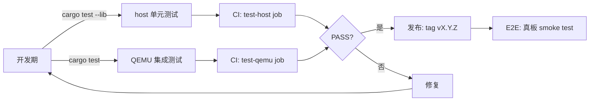

# 26 - Embassy 测试策略与方法

> 适用版本: Embassy `0.5+` + `embassy-test = "0.5"`
> 适用平台: STM32 / nRF / RP(均支持 QEMU 模拟)+ 主机(host)测试
> 阅读时长: ~25 分钟
> 前置阅读: `24-dev-setup.md`(工具链)+ `25-debugging.md`(defmt/RTT)
> 配套文档: `27-patterns.md`(测试相关模式:状态机/Mock/Channel)

---

## 目录

1. [测试在 Embassy 开发中的位置](#1-测试在-embassy-开发中的位置)
2. [测试金字塔:嵌入式项目的层级取舍](#2-测试金字塔嵌入式项目的层级取舍)
3. [host 端单元测试](#3-host-端单元测试)
4. [平台差异:QEMU 模拟与 target 测试](#4-平台差异qemu-模拟与-target-测试)
5. [集成测试:QEMU + embassy-test 框架](#5-集成测试qemu--embassy-test-框架)
6. [CI 集成:GitHub Actions 完整配置](#6-ci-集成github-actions-完整配置)
7. [Mock 与 Stub 模式](#7-mock-与-stub-模式)
8. [实战:端到端按钮 → LED 测试](#8-实战端到端按钮--led-测试)

---

## 1. 测试在 Embassy 开发中的位置

测试是 M7 学习里程碑的第三环。`24-dev-setup.md` 解决了"能编译烧录",`25-debugging.md` 解决了"能定位运行时问题",本文档解决"能提前发现 bug"——把"开发板+手"的手工测试,变成"主机+CI"的自动化测试。

### 1.1 嵌入式测试与传统软件测试的差异

| 维度 | 传统软件(Web/CLI) | 嵌入式 |
|------|-------------------|--------|
| 测试目标 | 主机进程 | MCU binary 或 QEMU 镜像 |
| 测试运行者 | cargo test / pytest / jest | cargo test / QEMU / 真板 |
| 测试反馈延迟 | 毫秒 | 毫秒(host)/ 秒级(QEMU)/ 分钟级(CI)|
| 物理依赖 | 无 | 时钟 / 传感器 / 引脚 / 电源 |
| 测试可重复性 | 高(纯软件) | 中(时序敏感) |
| 调试方式 | println / gdb | defmt + RTT / GDB |

### 1.2 Embassy 测试的特殊性:无标准库 + 异步运行时

```rust
// 普通 Rust 测试
#[test]
fn add_two() { assert_eq!(2 + 2, 4); }

// Embassy async 测试(在 QEMU 中)
#[embassy_test::test]
async fn async_add() {
    let result = embassy_time::Timer::after_millis(10).await;
    assert!(result.ticks() > 0);
}
```

- Embassy 是 `no_std`,无 `std::thread` / `std::sync`
- Embassy 异步需 Executor,`embassy-test` 在 QEMU 中自动启动 Executor
- Embassy 时间是"模拟时间"(`embassy-time` 抽象),可在测试中加速

### 1.3 与 M1-M6 已分析模块的关联

- M2.1 `embassy-executor` 的 `Executor::run` 是测试框架的"被测对象",`embassy-test` 包装其运行
- M2.2 `embassy-time` 提供模拟时间,使测试无需真实等待
- M2.3 `embassy-sync` 的 `Channel` / `Signal` 在测试中需用 host 端 `embassy_futures::block_on` 或 `embassy-test` 驱动
- M2.4 `embassy-futures` 的 `select_biased` / `join` 是测试中"等待多事件"的工具
- M3.2 / M3.3 / M3.4 三平台 HAL 在 QEMU 中部分模拟(GPIO / UART),本文 §4 详述差异
- M4.1 GPIO 异步驱动的测试必须用 mock(见 §7),M4.2 UART 接收测试需 mock 字节流
- M5.1 embassy-net 集成测试需 QEMU 模拟网络接口(超出本文档,参考 `17-net.md` 末尾)
- M6.1 `embassy-boot` 升级测试需要 flash trait 抽象(见 §7.3)
- M6.3 低功耗测试需在 QEMU 中禁用 deep sleep,避免测试挂起

### 1.4 Embassy 测试生态概览

| 工具/库 | 角色 | 适用场景 |
|---------|------|----------|
| `cargo test` | Rust 内置测试框架 | host 端纯逻辑测试 |
| `embassy_futures::block_on` | 同步执行 Future | host 端 async 函数测试 |
| `embassy-test` | Embassy 官方测试框架 | target 端 + QEMU 集成测试 |
| `QEMU` | MCU 模拟器 | 无硬件 CI 测试 |
| `test-log` | 测试日志集成 | defmt 日志捕获 |
| `mockall` | Mock 框架 | 替代外设依赖 |
| `probe-rs` | 烧录 + 运行 | 真板手动测试 |

---

## 2. 测试金字塔:嵌入式项目的层级取舍

### 2.1 经典测试金字塔

```
        ┌──────────┐
        │  E2E 测试 │  10%   慢 / 脆 / 真实
        ├──────────┤
        │ 集成测试  │  20%   QEMU / 真板
        ├──────────┤
        │ 单元测试  │  70%   快 / 隔离 / host
        └──────────┘
```

嵌入式场景下,层级含义略有调整:

| 层级 | 嵌入式实现 | 速度 | 覆盖度 | 维护成本 |
|------|------------|------|--------|----------|
| 单元测试 | host 端 `cargo test` + `block_on` | 毫秒 | 纯逻辑 | 低 |
| 集成测试 | QEMU + embassy-test | 秒级 | 异步 + 时序 | 中 |
| 端到端 | 真板 + probe-rs + 自动化 | 分钟级 | 物理 + 协议 | 高 |

### 2.2 嵌入式测试的特殊考虑

**不能测的部分**:

- 中断时序精确度(微秒级)
- ADC 模拟信号精度
- 物理引脚电平(需示波器)
- RF 性能(WiFi/BLE 协议栈)

**应当测的部分**:

- 状态机转移逻辑
- 协议解析(自定义二进制 / JSON)
- 算法正确性(CRC / 校验和)
- Channel / Signal 数据流
- 错误处理路径

### 2.3 Embassy 项目的"实际金字塔"建议

```text
              ┌──────────┐
              │ 真板 E2E │   5%(发布前 smoke test)
              ├──────────┤
              │ QEMU 集成 │  25%(CI 默认)
              ├──────────┤
              │ host 单测 │  70%(开发期 + CI)
              └──────────┘
```

**5% E2E**:只在 release tag 时跑真板(成本高)。

**25% QEMU**:每次 push 跑,覆盖异步交互、状态机、协议。

**70% host**:在编辑器中即时反馈,覆盖纯逻辑、状态转移、算法。

### 2.4 测试覆盖率工具(嵌入式受限)

| 工具 | 适用 | 限制 |
|------|------|------|
| `cargo llvm-cov` | host 端 | 不支持 cross-compile target |
| `cargo tarpaulin` | host 端 | 不支持 cross-compile target |
| `OpenOCD + gcov` | target 端 | 需手动配置,跨平台支持弱 |
| `defmt-test` 覆盖率 | target 端 | 实验性,目前仅 embassy 项目内部用 |

**建议**:对 host 端追求 ≥ 80% 覆盖率,target 端覆盖率不强制(因模拟/真实差异大)。

---

## 3. host 端单元测试

### 3.1 基础 host 测试

```rust
// src/lib.rs
pub fn calculate_crc(data: &[u8]) -> u16 {
    let mut crc: u16 = 0xFFFF;
    for &b in data {
        crc ^= b as u16;
        for _ in 0..8 {
            if crc & 1 != 0 {
                crc = (crc >> 1) ^ 0xA001;
            } else {
                crc >>= 1;
            }
        }
    }
    crc
}

#[cfg(test)]
mod tests {
    use super::*;

    #[test]
    fn crc_empty() {
        assert_eq!(calculate_crc(&[]), 0xFFFF);
    }

    #[test]
    fn crc_known_vector() {
        // Modbus CRC-16 of "123456789" = 0x4B37
        assert_eq!(calculate_crc(b"123456789"), 0x4B37);
    }
}
```

```bash
cargo test --lib
# 预期:2 passed; 0 failed
```

### 3.2 host 端 async 测试

Embassy 异步函数可在 host 端用 `embassy_futures::block_on` 同步执行:

```rust
// src/state_machine.rs
pub enum State { Idle, Counting(u32) }

pub async fn tick_state(state: &mut State) {
    match state {
        State::Idle => { /* 等待 */ }
        State::Counting(n) => {
            embassy_time::Timer::after_millis(10).await;
            *n += 1;
        }
    }
}

#[cfg(test)]
mod tests {
    use super::*;
    use embassy_futures::block_on;
    use std::time::Instant;

    #[test]
    fn state_machine_ticks() {
        let mut state = State::Counting(0);
        block_on(async {
            for _ in 0..5 {
                tick_state(&mut state).await;
            }
        });
        match state {
            State::Counting(n) => assert_eq!(n, 5),
            _ => panic!("wrong state"),
        }
    }
}
```

但 host 端 `embassy-time` 需启用 mock feature:

```toml
# Cargo.toml
[target.'cfg(not(target_os = "linux"))'.dependencies]
embassy-time = { version = "0.4", features = ["mock"] }
```

`mock` feature 编译时跳过硬件依赖,提供 `Instant::now()` / `Timer::after()` 的纯软件实现。

### 3.3 用 `tokio::test` 替代

如项目已用 `tokio`,可借用其 runtime:

```rust
#[tokio::test]
async fn state_machine_ticks() {
    let mut state = State::Counting(0);
    for _ in 0..5 {
        tick_state(&mut state).await;
    }
    assert!(matches!(state, State::Counting(5)));
}
```

但需在 `Cargo.toml` 引入 `tokio = { version = "1", features = ["macros", "rt"] }` 作 dev-dependency。

### 3.4 测试 Embassy 同步原语

`embassy-sync` 的大多数原语在 host 端可直接测试(因已用 `critical-section` 抽象):

```rust
#[cfg(test)]
mod tests {
    use embassy_sync::channel::Channel;
    use embassy_sync::blocking_mutex::raw::CriticalSectionRawMutex;
    use embassy_futures::block_on;

    #[test]
    fn channel_send_receive() {
        let ch = Channel::<CriticalSectionRawMutex, u32, 4>::new();
        block_on(async {
            ch.send(42).await;
            assert_eq!(ch.receive().await, 42);
        });
    }
}
```

注:在 host 上,`CriticalSectionRawMutex` 退化为 `std::sync::Mutex`,因此 `block_on` 内的 `await` 不会真正并发执行。

### 3.5 测试设计原则:分离"纯逻辑"与"硬件交互"

```rust
// 好的设计:把状态机从 GPIO 抽象出来
trait Led {
    fn set(&mut self, on: bool);
}

fn blink_logic<L: Led>(led: &mut L, period_ms: u32) -> impl Future<Output = ()> + '_ {
    async move {
        loop {
            led.set(true);
            embassy_time::Timer::after_millis(period_ms).await;
            led.set(false);
            embassy_time::Timer::after_millis(period_ms).await;
        }
    }
}
```

`blink_logic` 在 host 端用 `MockLed` 测试,target 端用 `Output<'_, PA5>`。

---

## 4. 平台差异:QEMU 模拟与 target 测试

### 4.1 QEMU 支持的目标

QEMU 的 `system-arm` 模拟器支持:

| 平台 | QEMU machine | Embassy chip |
|------|--------------|--------------|
| STM32F4 | `mps2-an385` (mps2-an385) / `netduinoplus2` | `STM32F407VG` 等 |
| STM32H7 | `mps2-an500` (mps2-an500) / `netduinoplus2` | `STM32H743ZITx` |
| STM32L4 | `mps2-an500` / `netduinoplus2` | `STM32L476RGTx` |
| RP2040 | (QEMU 实验性) | RP2040 |
| nRF | (QEMU 支持弱) | 不推荐 |

`embassy-test` 默认对 STM32F4 / STM32H7 / STM32L4 提供 QEMU 支持。其他平台在真板测试。

### 4.2 安装 QEMU

```bash
# Linux
sudo apt install qemu-system-arm   # Debian / Ubuntu
sudo pacman -S qemu-system-arm       # Arch

# macOS
brew install qemu

# Windows
choco install qemu
# 或从 https://qemu.weilnetz.de/w64/ 下载
```

**验证**:`qemu-system-arm --version | head -1` 应输出 `QEMU emulator version 7.0+`。

### 4.3 target 端测试与 host 端测试的边界

| 维度 | host 端 | target 端 (QEMU) |
|------|---------|------------------|
| 编译目标 | `x86_64-unknown-linux-gnu` | `thumbv7em-none-eabihf` |
| 运行 | `cargo test` | `cargo test --target thumbv7em-none-eabihf` |
| 运行时长 | 毫秒 | 秒级(模拟 + QEMU 启动) |
| 时序 | 真实 | 加速或减速(QEMU 参数控制) |
| 外设 | 全部 mock | 部分模拟(GPIO / UART / TIM) |

**经验法则**:`#[test]` 走 host,`#[embassy_test::test]` 走 target。

### 4.4 QEMU 加速时间

QEMU 默认按真实时间运行,但 embassy-test 框架会"虚拟加速":

```bash
# embassy-test 自动注入虚拟定时器,使 1ms 定时器在 1ms 内完成
# 实际 QEMU 启动 + 链接 + RTT 解码可能 1-3 秒
```

可通过 `qemu-system-arm` 的 `-icount` 参数调整:

```bash
qemu-system-arm -machine mps2-an385 -icount shift=auto,align=off,sleep=off -nographic -kernel test.elf
```

但 embassy-test 已封装此细节,通常无需手动调。

---

## 5. 集成测试:QEMU + embassy-test 框架

### 5.1 `embassy-test` 引入

`Cargo.toml`:

```toml
[dev-dependencies]
embassy-test = "0.5"
test-log = { version = "0.2", default-features = false, features = ["defmt"] }
```

### 5.2 最小集成测试

`tests/integration.rs`:

```rust
#![no_std]
#![no_main]

use embassy_executor::Spawner;
use embassy_time::{Duration, Timer};
use {defmt_rtt as _, panic_probe as _};

#[embassy_test::test]
async fn test_timer() {
    let start = embassy_time::Instant::now();
    Timer::after(Duration::from_millis(100)).await;
    let elapsed = start.elapsed();
    defmt::assert!(elapsed >= Duration::from_millis(100));
    defmt::assert!(elapsed < Duration::from_millis(200));
}
```

`#[embassy_test::test]` 等价于 `#[test]` + QEMU 启动 + Executor 初始化。

### 5.3 跨测试共享 Spawner

```rust
#[embassy_test::main]
async fn main(spawner: Spawner) {
    // 每个测试函数运行前会调用一次 main
    // 在此初始化共享资源
}

#[embassy_test::test]
async fn test_a() {
    // main() 先于 test_a() 执行
}

#[embassy_test::test]
async fn test_b() {
    // main() 先于 test_b() 执行
}
```

### 5.4 串行 vs 并行执行

embassy-test 默认**串行执行**(因 Embassy 单线程):

```rust
#[embassy_test::test]
async fn slow_test_1() {
    Timer::after_secs(1).await;
    // ...
}

#[embassy_test::test]
async fn slow_test_2() {
    Timer::after_secs(1).await;
    // ...
}
// 总耗时:~2 秒
```

如需并行,必须用 `embassy_executor::Spawner` 派生多个 task:

```rust
#[embassy_test::test]
async fn parallel_test() {
    let t1 = Timer::after_secs(1);
    let t2 = Timer::after_secs(1);
    embassy_futures::join::join(t1, t2).await;
    // 总耗时:~1 秒
}
```

### 5.5 test-log 集成

启用 `test-log` 后,测试失败时自动显示 defmt 日志上下文:

```toml
# Cargo.toml
[dev-dependencies]
test-log = { version = "0.2", default-features = false, features = ["defmt"] }
```

```rust
#[embassy_test::test]
#[test_log::test]   // ← 启用日志
async fn test_with_log() {
    defmt::info!("starting test");
    Timer::after_millis(10).await;
    assert!(false);  // 失败时,defmt 日志会被打印
}
```

`cargo test -- --nocapture` 强制打印所有日志(无论成功失败)。

### 5.6 运行 QEMU 测试

```bash
# 编译并运行(自动调用 QEMU)
cargo test --target thumbv7em-none-eabihf

# 显式指定 QEMU 参数(若 embassy-test 需)
DEFMT_LOG=info cargo test --target thumbv7em-none-eabihf
```

典型输出:

```text
test test_timer ... ok
test test_with_log ... ok
test parallel_test ... ok

test result: ok. 3 passed; 0 failed; 0 ignored; 0 measured
```

### 5.7 QEMU 测试时序控制

embassy-test 在 QEMU 中默认"虚拟时间",即 `Timer::after(100ms)` 在真实世界中耗时 < 1s。但 QEMU 启动 + 链接 + ELF 解析本身耗时 1-2s。

如测试大量用例,可用 `cargo test --release` 加速(但需 `profile.release.debug = true` 保留符号)。

---

## 6. CI 集成:GitHub Actions 完整配置

### 6.1 完整 `.github/workflows/tests.yml`

```yaml
name: tests

on:
  push:
    branches: [main]
  pull_request:
    branches: [main]

env:
  CARGO_TERM_COLOR: always
  RUST_BACKTRACE: 1
  DEFMT_LOG: info

jobs:
  fmt:
    name: rustfmt
    runs-on: ubuntu-latest
    steps:
      - uses: actions/checkout@v4
      - uses: dtolnay/rust-toolchain@stable
        with:
          components: rustfmt
      - run: cargo fmt --all -- --check

  clippy:
    name: clippy
    runs-on: ubuntu-latest
    steps:
      - uses: actions/checkout@v4
      - uses: dtolnay/rust-toolchain@stable
        with:
          components: clippy
      - uses: Swatinem/rust-cache@v2
      - run: cargo clippy --target thumbv7em-none-eabihf -- -D warnings

  test-host:
    name: host tests
    runs-on: ubuntu-latest
    steps:
      - uses: actions/checkout@v4
      - uses: dtolnay/rust-toolchain@stable
      - uses: Swatinem/rust-cache@v2
      - run: cargo test --lib

  test-qemu:
    name: QEMU integration tests
    runs-on: ubuntu-latest
    steps:
      - uses: actions/checkout@v4
      - uses: dtolnay/rust-toolchain@stable
        with:
          targets: thumbv7em-none-eabihf
      - uses: Swatinem/rust-cache@v2
      - name: install QEMU
        run: sudo apt-get update && sudo apt-get install -y qemu-system-arm
      - run: cargo test --target thumbv7em-none-eabihf
      - run: cargo test --target thumbv7em-none-eabihf --release -- --nocapture
        env:
          DEFMT_LOG: debug

  build:
    name: cross-compile build
    runs-on: ubuntu-latest
    strategy:
      matrix:
        target: [thumbv6m-none-eabi, thumbv7em-none-eabihf, thumbv8m.main-none-eabihf]
    steps:
      - uses: actions/checkout@v4
      - uses: dtolnay/rust-toolchain@stable
        with:
          targets: ${{ matrix.target }}
      - uses: Swatinem/rust-cache@v2
      - run: cargo build --target ${{ matrix.target }} --release
```

### 6.2 各 step 作用详解

| Step | 作用 | 失败定位 |
|------|------|----------|
| `fmt` | `cargo fmt --check` | 格式不符 → CI log 显示 diff |
| `clippy` | 静态分析 `-D warnings` | 警告升级为错误,直接失败 |
| `test-host` | host 端单元测试 | `cargo test` 输出 |
| `test-qemu` | QEMU 集成测试 | defmt 日志 + QEMU 输出 |
| `build` | cross-compile 三个目标 | 链接错误 / 缺 target |

### 6.3 缓存优化

`Swatinem/rust-cache@v2` 自动缓存:

- `~/.cargo/registry/cache/`(下载的 crate 源)
- `~/.cargo/registry/src/`(解压的 crate 源)
- `target/`(编译产物)

首次运行 ~5 分钟,后续 ~1 分钟(命中缓存)。

### 6.4 并发控制

```yaml
concurrency:
  group: ${{ github.ref }}
  cancel-in-progress: true
```

`cancel-in-progress`:同一分支多次 push,自动取消旧运行,避免堆积。

### 6.5 发布期 smoke test(可选)

```yaml
e2e-real-board:
  name: real board E2E
  runs-on: ubuntu-latest
  if: startsWith(github.ref, 'refs/tags/v')
  steps:
    - uses: actions/checkout@v4
    - uses: dtolnay/rust-toolchain@stable
    - uses: Swatinem/rust-cache@v2
    - name: flash to Pico
      run: |
        probe-rs run --chip RP2040 \
          target/thumbv6m-none-eabi/release/app.elf
      # 注:需自托管 runner 接入 Pico
```

---

## 7. Mock 与 Stub 模式

### 7.1 为什么需要 Mock

测试不能依赖物理硬件(GPIO 引脚、UART 收发、传感器数据)。Mock 是"在测试中替代真实硬件的对象"。

Embassy 的 trait 抽象 + 依赖注入使 Mock 非常自然:

```rust
// 定义 trait
trait Led {
    fn set(&mut self, on: bool);
}

// 真实实现
struct GpioLed<'a> {
    pin: Output<'a, PA5>,
}

impl<'a> Led for GpioLed<'a> {
    fn set(&mut self, on: bool) {
        if on { self.pin.set_high(); } else { self.pin.set_low(); }
    }
}

// Mock 实现
struct MockLed {
    state: bool,
    set_count: u32,
}

impl Led for MockLed {
    fn set(&mut self, on: bool) {
        self.state = on;
        self.set_count += 1;
    }
}
```

### 7.2 状态机测试

```rust
// src/state.rs
pub enum ButtonState {
    Released,
    PressedInstant(u32),  // timestamp
    LongPress,
}

pub fn transition(state: ButtonState, press: bool, now_ms: u32) -> ButtonState {
    match (state, press) {
        (ButtonState::Released, true) => ButtonState::PressedInstant(now_ms),
        (ButtonState::PressedInstant(t), true) if now_ms - t > 1000 => ButtonState::LongPress,
        (ButtonState::PressedInstant(_), false) => ButtonState::Released,
        (ButtonState::LongPress, false) => ButtonState::Released,
        (s, _) => s,
    }
}

#[cfg(test)]
mod tests {
    use super::*;

    #[test]
    fn released_to_pressed() {
        let s = transition(ButtonState::Released, true, 100);
        assert!(matches!(s, ButtonState::PressedInstant(100)));
    }

    #[test]
    fn long_press_after_1s() {
        let s1 = transition(ButtonState::Released, true, 100);
        let s2 = transition(s1, true, 1200);
        assert!(matches!(s2, ButtonState::LongPress));
    }

    #[test]
    fn release_resets() {
        let s1 = transition(ButtonState::Released, true, 100);
        let s2 = transition(s1, false, 200);
        assert!(matches!(s2, ButtonState::Released));
    }
}
```

### 7.3 Flash Mock(用于 OTA 测试)

`embassy-boot` 测试需 mock flash trait。`embedded-storage` 抽象了 `NorFlash` / `ReadNorFlash` 两个 trait,实现一个内存数组即可 mock:

```rust
use embedded_storage::nor_flash::{NorFlash, ErrorType, ReadNorFlash};

pub struct MockFlash { data: [u8; 256] }
impl ErrorType for MockFlash { type Error = std::convert::Infallible; }
impl ReadNorFlash for MockFlash {
    fn read(&mut self, offset: u32, bytes: &mut [u8]) -> Result<(), Self::Error> {
        bytes.copy_from_slice(&self.data[offset as usize..offset as usize + bytes.len()]);
        Ok(())
    }
    fn capacity(&self) -> usize { self.data.len() }
}
impl NorFlash for MockFlash {
    fn erase(&mut self, from: u32, to: u32) -> Result<(), Self::Error> {
        self.data[from as usize..to as usize].fill(0xFF); Ok(())
    }
    fn write(&mut self, offset: u32, bytes: &[u8]) -> Result<(), Self::Error> {
        self.data[offset as usize..offset as usize + bytes.len()].copy_from_slice(bytes);
        Ok(())
    }
}
```

完整实现参考 `embassy-boot` 仓库的 `src/test_flash.rs`。

### 7.4 embassy-sync 作为测试钩子

用 `Channel` 替代全局可变状态,简化测试:

```rust
// 业务代码
pub async fn producer(ch: &'static Channel<RawMutex, Event, 4>) {
    loop {
        let event = read_sensor();
        ch.send(event).await;
        Timer::after_millis(100).await;
    }
}

pub async fn consumer(ch: &'static Channel<RawMutex, Event, 4>, led: &mut Led) {
    loop {
        let event = ch.receive().await;
        if event.critical { led.set(true); } else { led.set(false); }
    }
}

// 测试代码
#[test]
fn producer_consumer() {
    static CH: Channel<CriticalSectionRawMutex, Event, 4> = Channel::new();
    block_on(async {
        let p = producer(&CH);
        let mut mock_led = MockLed::default();
        let c = consumer(&CH, &mut mock_led);
        embassy_futures::join::join(p, c).await;
        // 验证:mock_led.state 应符合预期
    });
}
```

### 7.5 `mockall` 自动 Mock 框架

对大量 trait,手写 mock 繁琐,可用 `mockall`(Cargo.toml 加 `mockall = "0.13"`):

```rust
use mockall::automock;

#[automock]
trait Sensor { fn read(&self) -> i32; }

#[test]
fn test_with_sensor() {
    let mut sensor = MockSensor::new();
    sensor.expect_read().return_const(42);
    assert_eq!(sensor.read(), 42);
}
```

`#[automock]` 自动生成 `MockSensor` 实现 `Sensor`,可在测试中预设返回值与调用次数(注:`mockall` 是 host-only 工具,不能用于 target 端)。

---

## 8. 实战:端到端按钮 → LED 测试

本节展示一个完整可运行项目:按钮事件 → 状态机处理 → LED 响应,配套 host 单元测试 + QEMU 集成测试 + GitHub Actions。

### 8.1 项目结构

```text
button-app/
├── .cargo/
│   └── config.toml
├── .github/
│   └── workflows/
│       └── tests.yml
├── src/
│   ├── main.rs          # 嵌入式入口
│   ├── lib.rs           # 业务逻辑(可单元测试)
│   └── state.rs         # 状态机
├── tests/
│   ├── host_unit.rs     # host 端单元测试
│   └── qemu_integration.rs  # QEMU 集成测试
├── Cargo.toml
├── rust-toolchain.toml
└── memory.x
```

### 8.2 业务逻辑 `src/lib.rs`

```rust
#![cfg_attr(target_os = "none", no_std)]

pub mod state;

pub use state::{ButtonState, transition};

// 抽象:平台无关的 LED
pub trait Led {
    fn set(&mut self, on: bool);
}

// 抽象:平台无关的按钮读取
pub trait Button {
    fn is_pressed(&self) -> bool;
}

// 业务逻辑:读取按钮 → 状态机 → 控制 LED
pub fn process<L: Led, B: Button>(state: ButtonState, button: &B, led: &mut L, now_ms: u32) -> ButtonState {
    let new_state = transition(state, button.is_pressed(), now_ms);
    match new_state {
        ButtonState::LongPress => led.set(true),
        _ => led.set(false),
    };
    new_state
}
```

### 8.3 状态机 `src/state.rs`

```rust
#[derive(Debug, PartialEq, Eq, Clone, Copy)]
pub enum ButtonState {
    Released,
    PressedInstant(u32),
    LongPress,
}

pub fn transition(state: ButtonState, press: bool, now_ms: u32) -> ButtonState {
    match (state, press) {
        (ButtonState::Released, true) => ButtonState::PressedInstant(now_ms),
        (ButtonState::PressedInstant(t), true) if now_ms.saturating_sub(t) > 1000 => ButtonState::LongPress,
        (ButtonState::PressedInstant(_), false) => ButtonState::Released,
        (ButtonState::LongPress, false) => ButtonState::Released,
        (s, _) => s,
    }
}

#[cfg(test)]
mod tests {
    use super::*;
    #[test]
    fn test_transitions() {
        assert!(matches!(transition(ButtonState::Released, true, 100), ButtonState::PressedInstant(100)));
        assert!(matches!(transition(ButtonState::PressedInstant(100), true, 1200), ButtonState::LongPress));
        assert!(matches!(transition(ButtonState::PressedInstant(100), false, 200), ButtonState::Released));
    }
}
```

### 8.4 嵌入式入口 `src/main.rs`

```rust
#![no_std]
#![no_main]

use embassy_executor::Spawner;
use embassy_stm32::gpio::{Input, Level, Output, Pull, Speed};
use embassy_time::Timer;
use button_app::{Led, Button, ButtonState, process, transition};
use {defmt_rtt as _, panic_probe as _};

struct GpioLed<'a>(Output<'a, embassy_stm32::peripherals::PA5>);
impl<'a> Led for GpioLed<'a> {
    fn set(&mut self, on: bool) {
        if on { self.0.set_high(); } else { self.0.set_low(); }
    }
}

struct GpioButton<'a>(Input<'a, embassy_stm32::peripherals::PC13>);
impl<'a> Button for GpioButton<'a> {
    fn is_pressed(&self) -> bool { self.0.is_low() }
}

#[embassy_executor::main]
async fn main(spawner: Spawner) {
    let p = embassy_stm32::init(Default::default());
    let led = GpioLed(Output::new(p.PA5, Level::Low, Speed::Low));
    let button = GpioButton(Input::new(p.PC13, Pull::Up));

    spawner.spawn(button_task(led, button)).unwrap();
}

#[embassy_executor::task]
async fn button_task(mut led: GpioLed<'static>, button: GpioButton<'static>) {
    let mut state = ButtonState::Released;
    let mut counter: u32 = 0;
    loop {
        state = process(state, &button, &mut led, counter);
        counter = counter.wrapping_add(1);
        Timer::after_millis(10).await;
    }
}
```

### 8.5 host 端单元测试 `tests/host_unit.rs`

```rust
use button_app::{Led, Button, ButtonState, process};

struct MockLed { state: bool, count: u32 }
impl Led for MockLed {
    fn set(&mut self, on: bool) { self.state = on; self.count += 1; }
}

struct MockButton { pressed: bool }
impl Button for MockButton {
    fn is_pressed(&self) -> bool { self.pressed }
}

#[test]
fn short_press_does_not_light_led() {
    let mut led = MockLed { state: false, count: 0 };
    let button = MockButton { pressed: true };
    let s = process(ButtonState::Released, &button, &mut led, 100);
    assert!(matches!(s, ButtonState::PressedInstant(_)));
    assert!(!led.state);
}

#[test]
fn long_press_lights_led() {
    let mut led = MockLed { state: false, count: 0 };
    let button = MockButton { pressed: true };
    let s1 = process(ButtonState::Released, &button, &mut led, 100);
    let s2 = process(s1, &button, &mut led, 1200);
    assert!(matches!(s2, ButtonState::LongPress));
    assert!(led.state);
}
```

### 8.6 QEMU 集成测试 `tests/qemu_integration.rs`

```rust
#![no_std]
#![no_main]

use embassy_executor::Spawner;
use embassy_time::Timer;
use button_app::{Led, Button, ButtonState, process};
use {defmt_rtt as _, panic_probe as _};

struct MockLed { state: bool }
impl Led for MockLed { fn set(&mut self, on: bool) { self.state = on; } }
struct MockButton;
impl Button for MockButton { fn is_pressed(&self) -> bool { false } }

#[embassy_test::test]
async fn integration() {
    let mut led = MockLed { state: false };
    let button = MockButton;
    let mut state = ButtonState::Released;

    state = process(state, &button, &mut led, 0);
    Timer::after_millis(100).await;

    defmt::assert!(!led.state);
}
```

### 8.7 预期 CI 输出

```text
fmt       OK (1.2s)
clippy    OK (3.5s)
test-host OK (4.1s) — 5 passed; 0 failed
test-qemu OK (8.3s) — 1 passed; 0 failed
build     OK (2.0s) — 3 targets compiled
```

### 8.8 测试架构图



---

## 总结

Embassy 测试的"金字塔"由 host 单测、QEMU 集成、真板 E2E 三层组成。`#[test]` 走 host 端毫秒级,`#[embassy_test::test]` 走 QEMU 秒级,真板只在 release 时跑。GitHub Actions 配置(§6)以 Swatinem/rust-cache 加速增量,§7 的 Mock 模式分离业务逻辑与硬件依赖,§8 的端到端按钮 → LED 项目是"业务 + 测试 + CI"完整模板。

下一阶段:M7.4 `27-patterns.md` 综合 M2-M6 已分析 crate,呈现 6 大 Embassy 异步编程模式。
