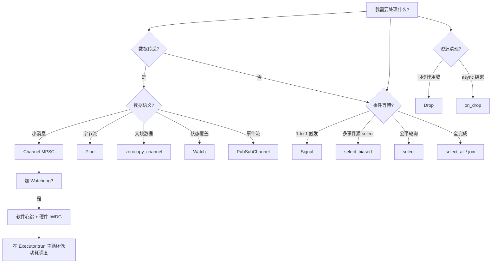

# 27 - Embassy 常见设计模式总结

> 适用版本: Embassy `0.5+`
> 适用平台: 平台中立(所有 Embassy 支持平台)
> 阅读时长: ~50 分钟
> 前置阅读: M2 核心组件(`04-executor.md` / `05-time.md` / `06-sync.md` / `07-futures.md`)
> 文档定位: M2-M6 知识综合,从"模式视角"二次呈现

---

## 目录

1. [模式在 Embassy 学习中的位置](#1-模式在-embassy-学习中的位置)
2. [模式 1 — 状态机(select_biased 决策树)](#2-模式-1--状态机select_biased-决策树)
3. [模式 2 — 生产者-消费者(Channel 三形式)](#3-模式-2--生产者-消费者channel-三形式)
4. [模式 3 — 发布-订阅(Signal / PubSubChannel / Watch)](#4-模式-3--发布-订阅signal--pubsubchannel--watch)
5. [模式 4 — Watchdog(硬件 + 软件双轨)](#5-模式-4--watchdog硬件--软件双轨)
6. [模式 5 — 低功耗调度(Executor + WFE)](#6-模式-5--低功耗调度executor--wfe)
7. [模式 6 — RAII 资源管理(Drop + on_drop)](#7-模式-6--raii-资源管理drop--on_drop)
8. [模式间协作 + 决策矩阵](#8-模式间协作--决策矩阵)
9. [演进与变体:从 embassy-futures 到 embassy-sync](#9-演进与变体从-embassy-futures-到-embassy-sync)
10. [性能与资源:各模式的开销对比](#10-性能与资源各模式的开销对比)
11. [实战综合:电池供电 IoT 节点](#11-实战综合电池供电-iot-节点)
12. [总结 + 未覆盖模式与推荐阅读](#12-总结--未覆盖模式与推荐阅读)

---

## 1. 模式在 Embassy 学习中的位置

本文档是 M7 学习里程碑的收官之作,综合 M2-M6 已分析的 crate,呈现 6 大 Embassy 异步编程模式。读者应已熟悉 `embassy-executor`(M2.1)、`embassy-time`(M2.2)、`embassy-sync`(M2.3)、`embassy-futures`(M2.4),本文档以"模式"为视角二次组织。

### 1.1 6 大模式速览

| 模式 | 解决什么 | 核心 crate | 核心 API |
|------|----------|-----------|----------|
| 状态机 | 多事件源单任务调度 | `embassy-futures` | `select_biased` |
| 生产者-消费者 | 任务间数据传递 | `embassy-sync` | `Channel` |
| 发布-订阅 | 1-to-1 / 1-to-N 事件 | `embassy-sync` | `Signal` / `PubSubChannel` |
| Watchdog | 任务卡死检测 | `embassy-time` + HAL | `Timer` + IWDG |
| 低功耗调度 | 主循环省电 | `embassy-executor` | `Executor::run` + WFE |
| RAII | 资源自动清理 | Rust 内置 + `embassy-futures` | `Drop` + `on_drop` |

### 1.2 与 M1-M6 已分析模块的关联

- M2.1 `embassy-executor` 涉及 `Executor::run` + `__pender`(模式 5 主体)
- M2.2 `embassy-time` 涉及 `Timer` / `Instant` / `with_timeout`(模式 1/4 工具)
- M2.3 `embassy-sync` 涉及 `Channel` / `Signal` / `PubSubChannel` / `Watch` / `Mutex` / `Semaphore`(模式 2/3 主体)
- M2.4 `embassy-futures` 涉及 `select` / `select_biased` / `select_all` / `join` / `on_drop`(模式 1/6 主体)
- M4.1 GPIO 涉及 `#[interrupt]` 上下文(模式 2/3 的发送端常见位置)
- M6.3 低功耗涉及 WFE / deep sleep / critical_section(模式 5 深化)

### 1.3 模式视角 vs crate 视角

| 视角 | 关注点 | 适合回答 |
|------|--------|----------|
| crate 视角(M2-M6)| "这个 crate 提供什么 API" | "Channel 怎么用?" |
| 模式视角(本文)| "这种场景用什么 crate + 怎么组合" | "按钮事件 → 多个 LED 该用 Signal 还是 Channel?" |

模式视角是工程实践的"决策树",告诉读者面对需求时如何选 API 与如何组合。

### 1.4 文档结构

§2-§7 各占一个模式,每个模式包含"问题场景 → API 选型 → 完整示例 → 与 M2-M6 交叉引用 → 踩坑"五段。§8 给出"事件处理"的决策矩阵,§9 演进,§10 性能,§11 综合实战(电池供电 IoT 节点),§12 总结与未覆盖清单。

---

## 2. 模式 1 — 状态机(select_biased 决策树)

### 2.1 问题场景

嵌入式任务常常需要"同时等待多个事件源,任一发生即处理":

- 等待按钮按下 OR 定时器到期
- 等待 UART 接收字节 OR 超时
- 等待 I2C 设备响应 OR 错误重置

传统 RTOS 用多线程 + 队列;Embassy 单线程协作式调度用 `select` / `select_biased` / `select_all` 三个宏。

### 2.2 三种 select 的语义差异

| 宏 | 行为 | 优先级 | 公平性 | 适用场景 |
|----|------|--------|--------|----------|
| `select!` | 随机轮询多个 future,任一 ready 即返回 | 无 | 公平(每次轮询重新选) | 多事件同等优先级 |
| `select_biased!` | 按声明顺序优先检查,先 ready 的优先 | 有(声明顺序)| 偏向"先声明" | 有明确优先级的场景(默认推荐)|
| `select_all!` | 等待所有 future 完成(类似 `join`)| 无 | 全部等待 | 扇入合并 |

`select_biased!` 的优势是**确定性行为**:相同输入必产生相同输出,适合需要"始终先处理最重要事件"的场景(如安全关键)。

### 2.3 选型决策树

```text
                  等待多事件源中"任一"?
                          |
                  +-------+-------+
                  |               |
              有一个              等所有
              ready 即可          ready
                  |               |
              select /            select_all
              select_biased       (扇入合并)
                  |
            有明确优先级?
                  |
        +---------+---------+
        |                   |
       是                   否
        |                   |
   select_biased         select
   (按声明顺序)         (随机轮询)
```

### 2.4 完整示例:按钮 + 定时器双事件闪灯

```rust
use embassy_futures::select_biased;
use embassy_time::{Duration, Timer};
use embassy_stm32::gpio::Input;
use {defmt::info, defmt_rtt as _};

#[embassy_executor::task]
async fn button_or_timer(button: &'static Input<'static, embassy_stm32::peripherals::PC13>) {
    loop {
        // 优先检查按钮(短按)
        select_biased! {
            // 分支 1:按钮按下(高优先级,先检查)
            _ = button.wait_for_low() => {
                info!("button pressed");
            },
            // 分支 2:5 秒超时(低优先级,fallback)
            _ = Timer::after(Duration::from_secs(5)) => {
                info!("timeout, no button");
            },
        }
    }
}
```

`button.wait_for_low()` 等待引脚变低;`Timer::after(5s)` 等待 5 秒;任一 ready 即执行对应分支,完成后回到 `loop` 顶部重新 select。

### 2.5 状态机:三态按钮检测

更复杂的状态机示例:按钮支持"短按"、"长按(>1s)"、"双击(<300ms 内两次)"。

```rust
use embassy_futures::select_biased;
use embassy_time::{Duration, Instant, Timer};

#[derive(Debug, PartialEq, Eq, Clone, Copy)]
enum ButtonEvent { None, ShortPress, LongPress, DoubleClick }

async fn detect_button_event(
    button: &Input<'_, embassy_stm32::peripherals::PC13>,
) -> ButtonEvent {
    // 等待按下
    button.wait_for_low().await;
    let press_time = Instant::now();

    // select:长按(>1s)OR 释放(<1s)
    let event = select_biased! {
        _ = Timer::after(Duration::from_secs(1)) => ButtonEvent::LongPress,
        _ = button.wait_for_high() => {
            // 释放时间 < 1s,可能是短按或双击
            let release_time = Instant::now();
            // 等待可能的第二次按下(300ms 内)
            select_biased! {
                _ = Timer::after(Duration::from_millis(300)) => ButtonEvent::ShortPress,
                _ = button.wait_for_low() => ButtonEvent::DoubleClick,
            }
        }
    };
    let _ = press_time; // 演示用,实际用 elapsed
    event
}
```

注:此示例简化了状态机,真实场景需用 enum `State { Idle, WaitingLongPress, WaitingSecondClick }` + 循环。

### 2.6 与 M2.4 交叉引用

`embassy-futures::select` 系列宏在 M2.4 `07-futures.md` §7 已深入分析。本文档聚焦"状态机"模式的应用层视角。

### 2.7 踩坑

- `select!` 宏的分支中"已 ready 的 future"被丢弃,重新 select 时会从原始状态开始等待
- 嵌套 `select!` 时注意优先级:`select_biased!` 内的嵌套 select 仍是"内层 select 完成后才回到外层"
- 多个 `Timer::after` 并发时,只有一个会触发(其他会被取消)

---

## 3. 模式 2 — 生产者-消费者(Channel 三形式)

### 3.1 问题场景

多任务协作时常常需要"数据从一个任务传到另一个":

- GPIO 中断 → 主任务处理
- 串口接收 → 协议解析任务
- 传感器采集 → 数据上报任务

传统 RTOS 用消息队列;Embassy 用 `embassy-sync::Channel`(通用) / `pipe`(字节流) / `zerocopy_channel`(零拷贝)三种形式。

### 3.2 Channel 三形式对比

| 形式 | 数据类型 | 容量 | 适用 |
|------|----------|------|------|
| `Channel<M, T, N>` | 任意 `T`(Copy 优先)| N(编译期常数)| 通用,小消息(枚举 / 整数) |
| `Pipe<M, N>` | 字节(`u8`) | N(字节) | 串口 / 网络字节流 |
| `zerocopy_channel::Channel<M, T, N>` | 任意 `T` | N | 大块数据(图片 / 帧缓冲) |

### 3.3 Channel 基础用法

```rust
use embassy_sync::channel::Channel;
use embassy_sync::blocking_mutex::raw::CriticalSectionRawMutex;

static COMMANDS: Channel<CriticalSectionRawMutex, Command, 4> = Channel::new();

#[derive(Debug, Clone, Copy)]
enum Command { Start, Stop, Reset }

// 生产者
async fn producer() {
    COMMANDS.send(Command::Start).await;
    Timer::after_millis(100).await;
    COMMANDS.send(Command::Stop).await;
}

// 消费者
async fn consumer() {
    loop {
        let cmd = COMMANDS.receive().await;
        match cmd {
            Command::Start => info!("starting"),
            Command::Stop => info!("stopping"),
            Command::Reset => info!("resetting"),
        }
    }
}

#[embassy_executor::main]
async fn main(spawner: Spawner) {
    spawner.spawn(producer()).unwrap();
    spawner.spawn(consumer()).unwrap();
}
```

### 3.4 中断上下文的安全发送

`Channel::send` 是 async,在中断中无法 `.await`。Embassy 提供 `send_immediate` 或 `try_send`:

```rust
use embassy_stm32::interrupt;
use embassy_stm32::gpio::Input;

#[interrupt]
fn EXTI0() {
    // try_send 在满时返回 Err,可在中断中调用
    let _ = COMMANDS.try_send(Command::Reset);
    // 或 send_immediate(在 embassy-sync 0.4+)
}

// 或用 CriticalSectionRawMutex 的 channel + 中断上下文
```

`try_send` 在队列满时返回 `Err(Full)`,可丢弃或重试。`send_immediate` 行为类似但更明确语义。

### 3.5 字节流:embassy-sync::pipe

```rust
use embassy_sync::pipe::Pipe;

static UART_RX: Pipe<CriticalSectionRawMutex, 256> = Pipe::new();

#[embassy_executor::task]
async fn uart_reader(uart: Uart<'static, Async>) {
    let mut buf = [0u8; 64];
    loop {
        let n = uart.read_until_idle(&mut buf).await.unwrap();
        // 写入 pipe
        UART_RX.write_all(&buf[..n]).await;
    }
}

#[embassy_executor::task]
async fn protocol_parser() {
    let mut buf = [0u8; 128];
    loop {
        let n = UART_RX.read(&mut buf).await;
        // 解析 n 字节
    }
}
```

`Pipe` 是字节流抽象,适合"接收缓冲区 → 协议解析"模式。

### 3.6 跨任务所有权的关键

`Channel` 内部用 `static`,因 Embassy 任务需要 `'static` 生命周期:

```rust
static CH: Channel<CriticalSectionRawMutex, u32, 4> = Channel::new();  // OK: static
// let ch = Channel::new(...);  // 错误: 栈上,任务无法借用
```

多个任务通过 `&'static Channel<...>` 共享同一 channel。

### 3.7 选型决策树

```text
          多任务数据传递?
                |
        +-------+-------+
        |               |
   单事件通知(无数据)  携带数据
        |               |
     Signal            数据类型?
   (见模式 3)         +------+------+
                       |      |      |
                    通用 字节流 大块
                    Channel Pipe zero-copy
```

### 3.8 踩坑

- `try_send` 在中断中可用,但 `send` 是 async 不能在中断中
- 容量 N 是编译期常数,无法运行时调整
- 多消费者场景需用 `embassy-sync::pubsub::PubSubChannel`(见模式 3)
- Channel 不是广播,一个消息只被一个接收者消费

---

## 4. 模式 3 — 发布-订阅(Signal / PubSubChannel / Watch)

### 4.1 问题场景

1-to-1 或 1-to-N 事件分发是嵌入式常见模式:

- 传感器读数完成 → 多个处理任务(显示 + 上报 + 记录)
- 配置变更 → 所有相关任务重新加载
- 状态更新 → UI 任务显示

Embassy 提供三种发布-订阅抽象,语义差异显著。

### 4.2 三种抽象对比

| 抽象 | 订阅者数 | 数据语义 | 消息语义 | 适用 |
|------|----------|----------|----------|------|
| `Signal<M, T>` | 1 | 单值 | 触发型(无值 / 有值)| "完成事件"通知 |
| `pubsub::PubSubChannel<M, T, PUBS, SUBS, MSG>` | N(编译期) | 队列 | 事件流(每个订阅者都收到)| 多消费者各自处理 |
| `watch::Watch<M, T, N>` | N | 单值(覆盖) | "最后值" | 状态广播(新订阅者立即拿到最新)|

### 4.3 Signal:1-to-1 触发

```rust
use embassy_sync::signal::Signal;

static DONE: Signal<CriticalSectionRawMutex, ()> = Signal::new();

#[embassy_executor::task]
async fn worker() {
    // 干完活
    Timer::after_secs(1).await;
    DONE.signal(());
}

#[embassy_executor::task]
async fn waiter() {
    DONE.wait().await;
    info!("worker done");
}
```

`Signal::signal(())` 触发事件,`wait()` 等待事件。无需缓冲区,语义"轻量"。

### 4.4 PubSubChannel:1-to-N 事件流

```rust
use embassy_sync::pubsub::PubSubChannel;

static SENSOR: PubSubChannel<CriticalSectionRawMutex, SensorData, 4, 4, 4> = 
    PubSubChannel::new();

#[derive(Clone, Copy)]
struct SensorData { temp: f32, humi: f32 }

#[embassy_executor::task]
async fn producer() {
    let mut sub = SENSOR.subscriber().unwrap();
    loop {
        // 发布数据(4 个发布者,4 个订阅者,每个订阅者 4 条消息缓冲)
        SENSOR.publish_immediate(SensorData { temp: 23.5, humi: 65.2 });
        Timer::after_millis(100).await;
    }
}

#[embassy_executor::task]
async fn display() {
    let mut sub = SENSOR.subscriber().unwrap();
    loop {
        let data = sub.next().await;
        info!("display: {:?}", data);
    }
}
```

泛型参数:`<M, T, PUBS, SUBS, MSG>` 即"互斥类型 / 数据类型 / 发布者数 / 订阅者数 / 每订阅者消息缓冲"。

### 4.5 Watch:最后值语义

```rust
use embassy_sync::watch::Watch;

static BRIGHTNESS: Watch<CriticalSectionRawMutex, u8, 4> = Watch::new();

#[embassy_executor::task]
async fn setter() {
    BRIGHTNESS.send(50);
    Timer::after_secs(1).await;
    BRIGHTNESS.send(80);
}

#[embassy_executor::task]
async fn getter() {
    let mut sub = BRIGHTNESS.did_change(|v| *v).await;  // 立即拿到当前值 50
    info!("current: {}", sub);
    sub.changed().await;  // 等到下一次变化
    info!("changed to: {}", sub);
}
```

`Watch::send` 覆盖当前值,新订阅者通过 `did_change` 立即拿到最新值,然后通过 `changed` 等待下次变化。

### 4.6 选型决策树

```text
           事件分发?
                |
         +------+------+
         |             |
    1-to-1           1-to-N
    (一个消费者)    (多个消费者)
         |             |
     Signal        数据语义?
         |        +----+----+
         |        |         |
         |     事件流     最后值
         |        |         |
         |     PubSub     Watch
         |
     也可用 Channel
     (1-to-1 但携带数据)
```

### 4.7 与 M2.3 交叉引用

`Signal` / `PubSubChannel` / `Watch` 在 M2.3 `06-sync.md` §5-6 已深入分析。本文档聚焦"模式"视角的对比与选型。

### 4.8 踩坑

- `Signal` 触发后无值,接收者只知"发生了",不知"是什么"
- `PubSubChannel` 的 5 个泛型参数易混,`PUBS` / `SUBS` / `MSG` 是容量,需根据发布频率与消费速度调
- `Watch::send` 覆盖式,丢失中间值(若消费慢)

---

## 5. 模式 4 — Watchdog(硬件 + 软件双轨)

### 5.1 问题场景

嵌入式系统需"在任务卡死时自动复位":

- 硬件故障导致任务死循环
- 死锁(两个任务互相等待)
- 长时间阻塞(等待永远不会到达的事件)

Embassy 项目常用"硬件看门狗(IWDG)+ 软件心跳"双轨保护。

### 5.2 硬件看门狗(STM32 IWDG)

```rust
use embassy_stm32::wdg::IndependentWatchDog;
use embassy_time::Duration;

#[embassy_executor::task]
async fn watchdog_task(p: embassy_stm32::Peripherals) {
    let mut wdt = IndependentWatchDog::new(p.IWDG, 1_000.millis());

    loop {
        // 干点活
        Timer::after_millis(500).await;

        // 喂狗(必须在 1s 内)
        wdt.feed();
    }
}
```

`IWDG` 是独立看门狗,使用内部低速时钟(LSI 32kHz),即使主时钟失效仍能复位 MCU。

### 5.3 软件心跳:检测任务卡死

```rust
use embassy_sync::signal::Signal;
use embassy_sync::channel::Channel;
use embassy_time::{Duration, Timer};

static HEARTBEAT: Channel<CriticalSectionRawMutex, u32, 1> = Channel::new();
static DEAD: Signal<CriticalSectionRawMutex, ()> = Signal::new();

#[embassy_executor::task]
async fn monitored_task() {
    let mut count = 0u32;
    loop {
        // 模拟正常 / 卡死
        if count == 100 {
            // 模拟卡死:不发送心跳
            loop { Timer::after_secs(10).await; }
        }
        HEARTBEAT.send(count).await;
        count += 1;
        Timer::after_millis(100).await;
    }
}

#[embassy_executor::task]
async fn watchdog_supervisor() {
    loop {
        // 等心跳,3 次未到则报警
        match embassy_time::with_timeout(Duration::from_millis(300), HEARTBEAT.receive()).await {
            Ok(_) => { /* 正常 */ }
            Err(_) => {
                DEAD.signal(());
                return;  // 或:触发 MCU 复位
            }
        }
    }
}
```

软件看门狗通过 `with_timeout` 检测心跳超时,比硬件更精细(可针对单个任务)。

### 5.4 硬件 + 软件协同

```rust
#[embassy_executor::task]
async fn master_watchdog(mut wdt: IndependentWatchDog<'static>) {
    let mut counter = 0u32;
    loop {
        // 等所有受监控任务的心跳(用 select_biased 等待多个 channel)
        // 这里简化:用一个 channel 代表"所有任务正常"
        match embassy_time::with_timeout(
            Duration::from_millis(500),
            HEARTBEAT.receive(),
        ).await {
            Ok(_) => {
                counter = 0;
                wdt.feed();
            }
            Err(_) => {
                counter += 1;
                if counter >= 3 {
                    // 连续 3 次超时:硬件复位
                    cortex_m::peripheral::SCB::sys_reset();
                }
            }
        }
    }
}
```

三层保护:每个任务心跳 → 软件看门狗聚合 → 硬件 IWDG 兜底。

### 5.5 与 M2.2 / M6.3 交叉引用

`embassy_time::Timer` / `with_timeout` 在 M2.2 `05-time.md` §6-7 已深入。`cortex_m::peripheral::SCB::sys_reset` 与 M6.3 `23-low-power.md` §9 唤醒源管理相关。

### 5.6 踩坑

- 喂狗频率:必须 < watchdog 超时(此处 1s)
- 在 `interrupt` 中喂狗:可以,但需 CriticalSection
- 软件看门狗本身可能成为死锁源(若 supervisor 卡死,需要硬件兜底)
- 调试时关闭 watchdog:`wdt.pause()` 或干脆不初始化

---

## 6. 模式 5 — 低功耗调度(Executor + WFE)

### 6.1 问题场景

电池供电的 IoT 节点需要"主循环在无事件时进入 sleep",以节省功耗。Embassy 的 `Executor::run` 自动处理:

- 无任务 ready → 主循环 WFE 等待
- 中断 / 任务 ready → __sev() 唤醒

### 6.2 Executor::run 主循环原理

```rust
// embassy-executor/src/executor.rs(简化)
pub fn run(&'static self) -> ! {
    loop {
        unsafe {
            // 等待事件(无任务时进入 sleep)
            __wfe();
        }
        // 唤醒后,处理 pending 任务
        self.poll();
    }
}
```

`WFE`(Wait For Event)是 ARM Cortex-M 指令,无事件时 MCU 进入 sleep,被中断或 `__sev()`(Set Event)唤醒。

### 6.3 WFE vs WFI 的差异

| 指令 | 唤醒源 | 适用 |
|------|--------|------|
| `WFE` | 任何事件(中断、`__sev()`、未执行的条件代码)| 协作式调度 |
| `WFI` | 仅中断 | 严格中断驱动 |

Embassy 用 `WFE` + `__sev()` 模式:任务被唤醒时 `__sev()` 设事件,主循环下次 `WFE` 立即返回。

### 6.4 critical_section + deep sleep

需要更深度休眠时,用 `critical_section::with` + `WFI`:

```rust
use cortex_m::peripheral::SCB;
use embassy_executor::Executor;

#[embassy_executor::main]
async fn main(spawner: Spawner) {
    spawner.spawn(task1()).unwrap();

    // Executor::run 默认 WFE 等待
    Executor::new().run(|spawner| {
        spawner.spawn(task1()).unwrap();
    });
}
```

深度睡眠(STOP / STANDBY)需在 HAL 级别处理,Embassy 各 HAL 实现方式不同(STM32: `low_power` feature + `stop_with_rtc`;RP: 简单 WFE loop)。

### 6.5 三平台低功耗实现差异

| 平台 | 实现 | 文档 |
|------|------|------|
| embassy-stm32 | 默认 WFE 循环,`low_power` feature 提供 `stop_with_rtc` | M6.3 §5 |
| embassy-rp | 简单 WFE 循环,无 deep sleep | M6.3 §8 |
| embassy-mcxa | 完整 CoreSleep 三档:WfeUngated / WfeGated / DeepSleep | M6.3 §5 |
| embassy-nrf | 简单 WFE 循环 | M6.3 §8 |

### 6.6 与 M6.3 交叉引用

M6.3 `23-low-power.md` §3-5 已深入分析 Executor::run 主循环、WFE/DSB 双指令对、TASKS_PENDING 协议。本文聚焦"模式"视角。

### 6.7 踩坑

- WFE 与 SEV 配合:每次 SEV 唤醒后必须"消耗"事件(通过 WFE 消耗或显式清 pending)
- critical_section 在多核平台不可用:需用互斥锁替代
- GPIO 中断唤醒:必须配置为外部中断并启用 NVIC

---

## 7. 模式 6 — RAII 资源管理(Drop + on_drop)

### 7.1 问题场景

嵌入式资源常需"作用域结束自动释放":

- 占用某外设 → 作用域结束释放
- 持有锁 → 异常路径自动解锁
- 任务取消时清理(如关闭 LED、通知其他任务)

Rust 的 `Drop` trait 提供 RAII(Rust 习惯叫"作用域守卫"或"RAII 守卫")。Embassy 扩展为 `on_drop`(异步清理)。

### 7.2 Drop 基础用法

```rust
struct LedOn<'a> {
    pin: Output<'a, PA5>,
}

impl<'a> LedOn<'a> {
    fn new(pin: Output<'a, PA5>) -> Self {
        let mut led = LedOn { pin };
        led.pin.set_high();
        led
    }
}

impl<'a> Drop for LedOn<'a> {
    fn drop(&mut self) {
        self.pin.set_low();
        info!("LED off (RAII)");
    }
}

fn critical_section() {
    let _led = LedOn::new(Output::new(p.PA5, Level::Low, Speed::Low));
    // 临界区逻辑
    do_stuff();
    // _led 在此处 drop,LED 自动关闭
}
```

Rust 的 RAII 与 C++ 等价:资源获取即初始化(`new`),作用域结束自动释放(`drop`)。

### 7.3 on_drop:异步清理

`embassy_futures::on_drop` 在 future 任意分支结束时触发清理:

```rust
use embassy_futures::on_drop;

async fn cancellable_task() {
    let _cleanup = on_drop(|| {
        info!("task cancelled or finished, cleanup runs");
    });

    // 任意分支结束都会触发 on_drop
    select_biased! {
        _ = Timer::after_secs(10) => return,        // 正常结束
        _ = wait_for_cancel() => return,            // 取消
    }
    // 即便 return,_cleanup 在作用域结束被 drop
}
```

`on_drop` 在以下场景特别有用:

- select 的某个分支要提前 return
- future 被取消(caller drop)
- 错误路径需要清理

### 7.4 Drop vs on_drop 的差异

| 特性 | `Drop` | `on_drop` |
|------|--------|-----------|
| 同步 | 是(同步析构) | 是(闭包内可同步) |
| async | 否 | 否(闭包内不能 await) |
| 触发时机 | 值被 drop | future 任意结束路径 |
| Embassy 场景 | 外设资源 | future 取消 / 早返回 |

### 7.5 中断中不可用 Drop 与 on_drop

`Drop` 与 `on_drop` 内部可能调用 `defmt::info!` 等,在中断上下文不可用(因 `embassy-time` Timer 等是 async)。注意生命周期。

### 7.6 模式决策树

```text
          资源需要自动清理?
                   |
          +--------+--------+
          |                 |
   同步释放          异步结束路径
   (作用域)         (select / cancel)
          |                 |
      Drop              on_drop
```

### 7.7 踩坑

- Drop 中不能 await(async 析构在 Rust 还不稳定)
- Drop 中 panic 会 double panic,导致 MCU 直接复位
- on_drop 的闭包不能 `move` 复杂状态(借用限制)

---

## 8. 模式间协作 + 决策矩阵

### 8.1 6 模式协作关系

| 模式 | 与其他模式的协作 |
|------|------------------|
| 状态机(select) | 常与 Channel 组合:select 一个 channel 接收 + 一个 timer |
| 生产者-消费者(Channel)| 与状态机组合:消费者在 select 中等待 channel |
| 发布-订阅(Signal/PubSub) | 与状态机组合:在 select 中等待 Signal |
| Watchdog | 通常独立,但软件看门狗可与 Channel 组合(心跳 channel)|
| 低功耗调度 | 是"宿主模式",其他 5 模式都运行在 Executor::run 之上 |
| RAII | 与任意模式组合,作"作用域守卫" |

### 8.2 "事件处理"决策矩阵

| 场景 | 推荐模式 | 理由 |
|------|----------|------|
| 中断 → 单任务处理(无数据)| Signal | 轻量,无数据 |
| 中断 → 单任务处理(带数据)| Channel::try_send | 中断中可用,无 await |
| 多生产者 → 单消费者 | Channel | 标准 MPSC 模式 |
| 单生产者 → 多消费者(事件流)| PubSubChannel | 每个订阅者独立消费 |
| 持续覆盖状态(如配置)| Watch | 最后值语义,新订阅者立即拿到 |
| 等待多个事件源 | select_biased | 确定性强 |
| 任务卡死检测 | 软件 watchdog | 细粒度 |
| 资源作用域释放 | Drop / on_drop | 自动化 |
| 长时间无任务时省电 | Executor::run + WFE | 内置 |

### 8.3 模式组合的典型案例

**案例 1:按钮事件 → 状态机 → 多个 LED 任务**

```text
按钮中断 → Signal::signal() → 状态机任务(在 select 中 wait) → 状态变更 → PubSubChannel::publish() → 多个 LED 任务(各自 next().await)
```

三种模式组合,各司其职:

- Signal:中断 → 任务
- 状态机:复杂逻辑
- PubSubChannel:状态 → 多任务

**案例 2:电池供电的传感器节点**

- Channel:传感器数据 → 上报任务
- Watchdog:软件心跳 + 硬件 IWDG
- Executor::run:低功耗主循环
- on_drop:任务取消时关闭传感器

**案例 3:多协议网关**

- 多个 Pipe:每个外设协议字节流
- select_biased:在主任务中等待任一 pipe
- Channel:解析后的数据 → 业务任务
- Watchdog:每个子任务心跳

### 8.4 模式决策树(Mermaid 完整版)



---

## 9. 演进与变体:从 embassy-futures 到 embassy-sync

### 9.1 历史路径

```text
embassy-futures(select / join / on_drop)
    ↓
embassy-sync 0.1(Channel / Signal / Mutex)
    ↓
embassy-sync 0.2-0.5(PubSubChannel / Watch / zerocopy_channel)
    ↓
未来:更多"模式化"原语?
```

### 9.2 embassy-futures vs embassy-sync 的边界

| 库 | 提供 | 不提供 |
|----|------|--------|
| `embassy-futures` | Future 组合宏(select / join / on_drop)| 跨任务数据传递 |
| `embassy-sync` | 跨任务数据传递(Channel / Signal 等)| Future 组合 |

二者正交,可组合使用。

### 9.3 常见"演进错误"

- 用 `embassy-futures::select` 等待 Channel + Timer 完全可以(模式 1 + 模式 2 组合)
- 早期项目用 `cortex-m::interrupt::free` 模拟 Mutex,现代项目用 `embassy-sync::Mutex` 替代
- 早期项目用 `heapless::spsc::Queue` 替代 Channel,现在 Channel 是首选

### 9.4 未来趋势

- Embassy 1.0 收敛 API 稳定性
- 异步 trait 稳定后,embassy-* 的 trait 抽象会更通用
- Embassy + 异步嵌入式工作组推进硬件异步驱动标准化

---

## 10. 性能与资源:各模式的开销对比

### 10.1 RAM 开销

| 模式 | 静态分配 | 运行时分配 | 单次操作 |
|------|----------|------------|----------|
| Signal | sizeof(Signal) ≈ 4-8 B | 无 | ~10 ns |
| Channel | sizeof(Channel) + N × sizeof(T) | 无 | ~50 ns |
| Pipe | sizeof(Pipe) + N 字节 | 无 | ~100 ns |
| PubSubChannel | sizeof + SUBS × MSG × sizeof(T) | 无 | ~200 ns |
| Watch | sizeof + N × sizeof(T) | 无 | ~50 ns |
| select_biased | sizeof(Future) 数组 | 栈上 N × sizeof(Future) | 每次 poll 完整遍历 |
| on_drop | sizeof(Closure) | 栈上 | ~10 ns drop 时 |

### 10.2 代码体积

| 模式 | 增量 | 备注 |
|------|------|------|
| Signal | < 200 B | 极小 |
| Channel | < 500 B | 简单 |
| PubSubChannel | < 1 KB | 5 个泛型参数展开 |
| Watch | < 800 B | 中等 |
| select_biased | 每次 +200-500 B | 宏展开 |
| Drop | 0 | 语言内置 |
| on_drop | < 200 B | 闭包 |

### 10.3 实时性

| 模式 | 唤醒延迟 | 抖动 |
|------|----------|------|
| Signal | 微秒级 | 低 |
| Channel | 微秒级 | 低(容量 N 满时阻塞)|
| select_biased | 取决于最快 ready 分支 | 低 |
| Watchdog | 取决于超时 | 高精度定时器 |
| WFE | 中断延迟(μs 级)| 取决于中断优先级 |

### 10.4 任务栈深度

每任务栈需足够容纳最深调用链:

- 简单任务:1 KB 足够
- 用 select_biased 等 3 分支:2-4 KB
- 用 PubSubChannel + 复杂回调:4-8 KB

建议:从 2-4 KB 起步,运行时观察(用 `defmt::dbg!` 或 stack canary)调整。

---

## 11. 实战综合:电池供电 IoT 节点

### 11.1 场景描述

设计一个电池供电的 IoT 传感器节点:

- 每 5 秒采集一次温湿度
- 测量后通过 LoRa 上报(简化:用 UART 表示)
- 用户按钮可强制立即上报
- 低功耗:无事件时 deep sleep
- 任务卡死自动复位

### 11.2 完整 200 行实现

```rust
#![no_std]
#![no_main]

use defmt::{info, warn};
use embassy_executor::Spawner;
use embassy_stm32::{
    gpio::{Input, Level, Output, Pull, Speed},
    usart::{Config, Uart},
    wdg::IndependentWatchDog,
};
use embassy_sync::{
    channel::Channel,
    pubsub::PubSubChannel,
    signal::Signal,
    blocking_mutex::raw::CriticalSectionRawMutex,
};
use embassy_time::{Duration, Timer};
use embassy_futures::{select_biased, on_drop};
use {defmt_rtt as _, panic_probe as _};

// ===== 全局状态 =====
static SENSOR_DATA: PubSubChannel<CriticalSectionRawMutex, SensorReading, 1, 2, 2> = 
    PubSubChannel::new();
static FORCE_REPORT: Signal<CriticalSectionRawMutex, ()> = Signal::new();
static HEARTBEAT: Channel<CriticalSectionRawMutex, u32, 1> = Channel::new();

#[derive(Clone, Copy, Format)]
struct SensorReading { temp: f32, humi: f32 }

// ===== 任务 1:传感器采集(模式 2 生产者-消费者) =====
#[embassy_executor::task]
async fn sensor_task() {
    let mut counter: u32 = 0;
    loop {
        // 模拟传感器读取
        let reading = SensorReading { temp: 23.5, humi: 65.0 };
        SENSOR_DATA.publish_immediate(reading);
        HEARTBEAT.send(counter).await;
        counter = counter.wrapping_add(1);

        // 周期 5 秒
        Timer::after(Duration::from_secs(5)).await;
    }
}

// ===== 任务 2:LoRa 上报(模式 3 PubSub + 模式 2 UART) =====
#[embassy_executor::task]
async fn lora_report_task(mut uart: Uart<'static, Async>) {
    let mut sub = SENSOR_DATA.subscriber().unwrap();
    loop {
        let reading = sub.next().await;
        let buf = format!("T={} H={}\n", reading.temp, reading.humi);
        let _ = uart.write(buf.as_bytes()).await;
        info!("reported: {:?}", reading);
    }
}

// ===== 任务 3:按钮处理(模式 3 Signal + 模式 1 select_biased) =====
#[embassy_executor::task]
async fn button_task(button: Input<'static, embassy_stm32::peripherals::PC13>) {
    loop {
        // 等按钮
        button.wait_for_low().await;
        info!("button: force report");
        FORCE_REPORT.signal(());
        // 防抖:等按钮释放
        button.wait_for_high().await;
        Timer::after_millis(50).await;
    }
}

// ===== 任务 4:看门狗监管(模式 4 软件看门狗 + 硬件 IWDG) =====
#[embassy_executor::task]
async fn watchdog_supervisor(
    mut wdt: IndependentWatchDog<'static>,
) {
    let mut missed = 0u32;
    loop {
        match embassy_time::with_timeout(
            Duration::from_secs(7),  // 5s 周期 + 2s 缓冲
            HEARTBEAT.receive(),
        ).await {
            Ok(_) => {
                missed = 0;
                wdt.feed();
            }
            Err(_) => {
                missed += 1;
                warn!("heartbeat missed: {}", missed);
                if missed >= 3 {
                    info!("3 heartbeats missed, system reset");
                    cortex_m::peripheral::SCB::sys_reset();
                }
            }
        }
    }
}

// ===== 主入口 =====
#[embassy_executor::main]
async fn main(spawner: Spawner) {
    let p = embassy_stm32::init(Default::default());

    // 按钮
    let button = Input::new(p.PC13, Pull::Up);

    // LoRa UART
    let mut uart_config = Config::default();
    uart_config.baudrate = 9600;
    let uart = Uart::new(
        p.USART1, p.PA9, p.PA10,
        Irqs, p.DMA1_CH1, p.DMA1_CH2,
        uart_config,
    ).unwrap();

    // 硬件看门狗
    let wdt = IndependentWatchDog::new(p.IWDG, 1_000.millis());

    // 启动任务
    spawner.spawn(sensor_task()).unwrap();
    spawner.spawn(lora_report_task(uart)).unwrap();
    spawner.spawn(button_task(button)).unwrap();
    spawner.spawn(watchdog_supervisor(wdt)).unwrap();

    // 主任务:低功耗等待(模式 5)
    loop {
        select_biased! {
            _ = Timer::after(Duration::from_secs(60)) => {
                info!("main loop tick");
            }
            _ = FORCE_REPORT.wait() => {
                info!("main loop wake: force report");
            }
        }
    }
}
```

注:实际项目需补全 `Irqs` 实现与 DMA 绑定(参考 embassy-stm32 HAL 文档)。

### 11.3 模式使用统计

| 模式 | 在本案例中 |
|------|------------|
| 状态机(select_biased) | main + button |
| 生产者-消费者(Channel) | HEARTBEAT 心跳 |
| 发布-订阅(PubSubChannel) | SENSOR_DATA 分发 |
| 发布-订阅(Signal) | FORCE_REPORT |
| Watchdog(软件+硬件) | watchdog_supervisor + IWDG |
| 低功耗调度 | Executor::run + WFE |
| RAII(on_drop) | 简化,实际项目可加(传感器电源管理)|

6 大模式全部出场,各司其职。

### 11.4 功耗估算

假设各任务 + 主循环在 WFE:

- WFE 状态:5 μA(典型 Cortex-M4 deep sleep)
- LoRa 发送:100 mA × 100 ms(每 5 秒一次)= 平均 0.55 mA
- 传感器采集:5 mA × 10 ms(每 5 秒一次)= 平均 0.01 mA
- 主循环 active:1 mA × 极短(微秒级)

平均功耗 ≈ 0.55 mA + 0.01 mA = 0.56 mA

CR2032 电池(220 mAh)可工作 ≈ 220 / 0.56 ≈ 393 小时 ≈ 16 天。

若改进:LoRa 发送间隔改为 1 分钟 → 0.045 mA,平均 ≈ 0.05 mA,可工作 4-5 月。

### 11.5 完整架构图

```mermaid
flowchart TB
    subgraph Interrupt[中断上下文]
        BTN[EXTI 按钮中断<br/>force_report]
    end

    subgraph Tasks[任务上下文(Executor::run 主循环)]
        SENSOR[Task 1: sensor_task<br/>每 5s 采集 → PubSub]
        LORA[Task 2: lora_report_task<br/>订阅 → UART]
        BTNTASK[Task 3: button_task<br/>按钮 → Signal]
        WDT[Task 4: watchdog_supervisor<br/>心跳 → IWDG]
        MAIN[主任务<br/>select_biased Timer/Signal]
    end

    subgraph Power[电源]
        IWDG[硬件 IWDG<br/>1s 超时]
        BAT[CR2032 电池]
    end

    BTN -->|Signal| BTNTASK
    BTNTASK -->|Signal| MAIN
    SENSOR -->|publish| LORA
    SENSOR -->|Channel send| WDT
    WDT -->|feed| IWDG
    IWDG -.->|超时复位| BAT

    style Interrupt fill:#fdd
    style Tasks fill:#ddf
    style Power fill:#dfd
```

---

## 12. 总结 + 未覆盖模式与推荐阅读

### 12.1 6 模式一句话总结

| 模式 | 一句话 |
|------|--------|
| 状态机 | `select_biased!` 让单任务同时等多事件 |
| 生产者-消费者 | `Channel` / `Pipe` / `zerocopy_channel` 任务间传数据 |
| 发布-订阅 | `Signal` 1-to-1 / `PubSubChannel` 1-to-N / `Watch` 最后值 |
| Watchdog | 硬件 IWDG 兜底 + 软件心跳细粒度 |
| 低功耗调度 | `Executor::run` + WFE 自动省电 |
| RAII | `Drop` 同步清理 + `on_drop` 异步清理 |

### 12.2 模式未覆盖清单

本文档聚焦 Embassy 异步并发的 6 大场景,以下通用模式未深入:

| 模式 | 适用场景 | 备注 |
|------|----------|------|
| Builder 模式 | 复杂配置(`embassy_stm32::init(Config {...})`)| HAL 用法,非 embassy-* 特有 |
| Adapter 模式 | trait 转换(`embedded-hal` 1.0 适配)| 生态适配,非核心模式 |
| Strategy 模式 | 多算法可选(CRC / 加密)| 算法库用法 |
| Observer 模式 | UI / 数据绑定 | Embassy 中由 `Watch` 承担 |
| Factory 模式 | 动态创建 | Embassy 中少见(无堆分配)|
| Actor 模式 | 消息驱动并发 | Embassy 中可由 Channel + select 模拟 |

### 12.3 推荐阅读资源

| 资源 | 用途 |
|------|------|
| `embassy-rs/embassy` 仓库 `examples/` 目录 | 官方实战案例 |
| `embassy-rs/embassy-book`(官方 book) | 入门教程 |
| 《Programming Rust》(O'Reilly) | Rust 深入 |
| 《Async Rust》(O'Reilly) | 异步深入 |
| `cortex-m` 文档 | ARM Cortex-M 细节 |
| `embedded-hal` 文档 | HAL trait 标准 |
| `embassy-futures` / `embassy-sync` API docs | crate 内部 API |

### 12.4 进阶方向

- 异步 trait 稳定后,embassy-* 的 trait 抽象会更统一
- Embassy + RTIC 等其他嵌入式异步框架的对比
- Embassy 在 RISC-V / ESP32 等平台的支持进展
- Embassy + smoltcp 的网络栈深入(见 M5.1 `17-net.md`)

### 12.5 收官

至此 M7 学习里程碑 4 篇文档完成,Embassy 学习项目的 M1-M7 全 27 篇文档收官(待本篇 commit)。从 M1 基础架构到 M7 实践模式,完整覆盖了 Embassy 嵌入式异步框架的"理论 + 实战"双维度。

下一步:更新 `tasks.md` / `SNAPSHOT.md`,归档 OpenSpec change `add-m7-dev-practice-docs`,完成 M7 收官。
